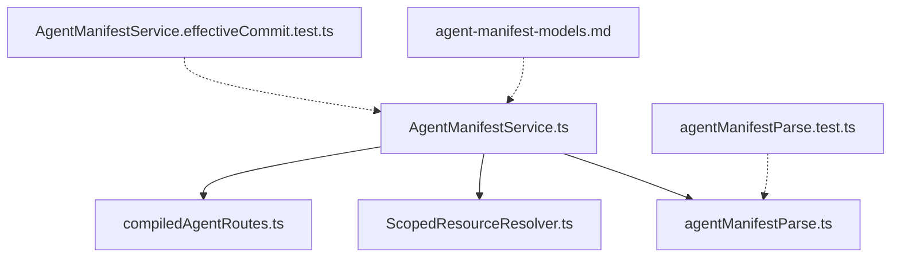
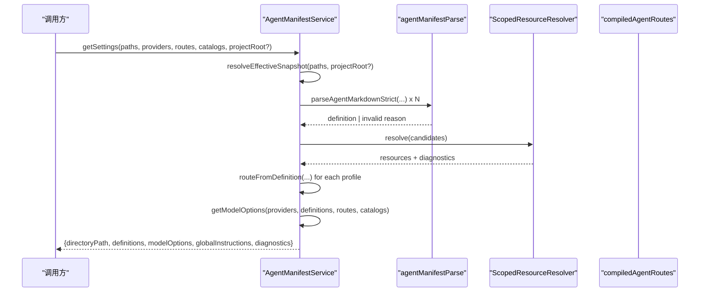
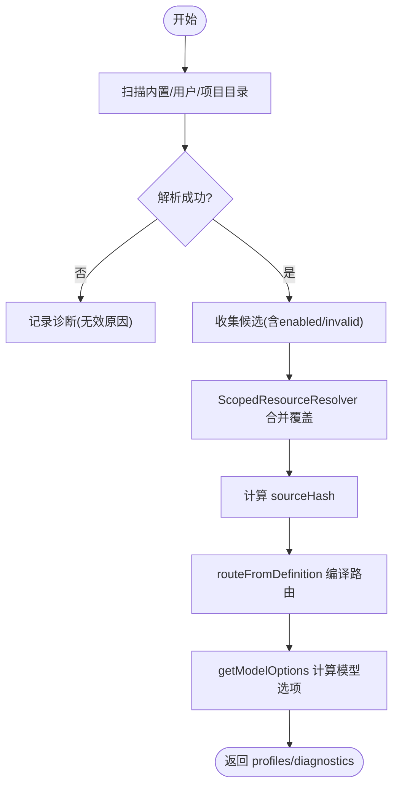
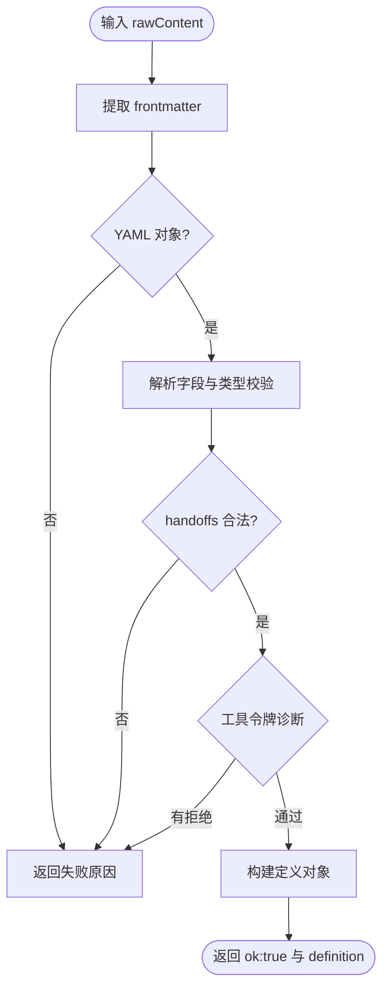
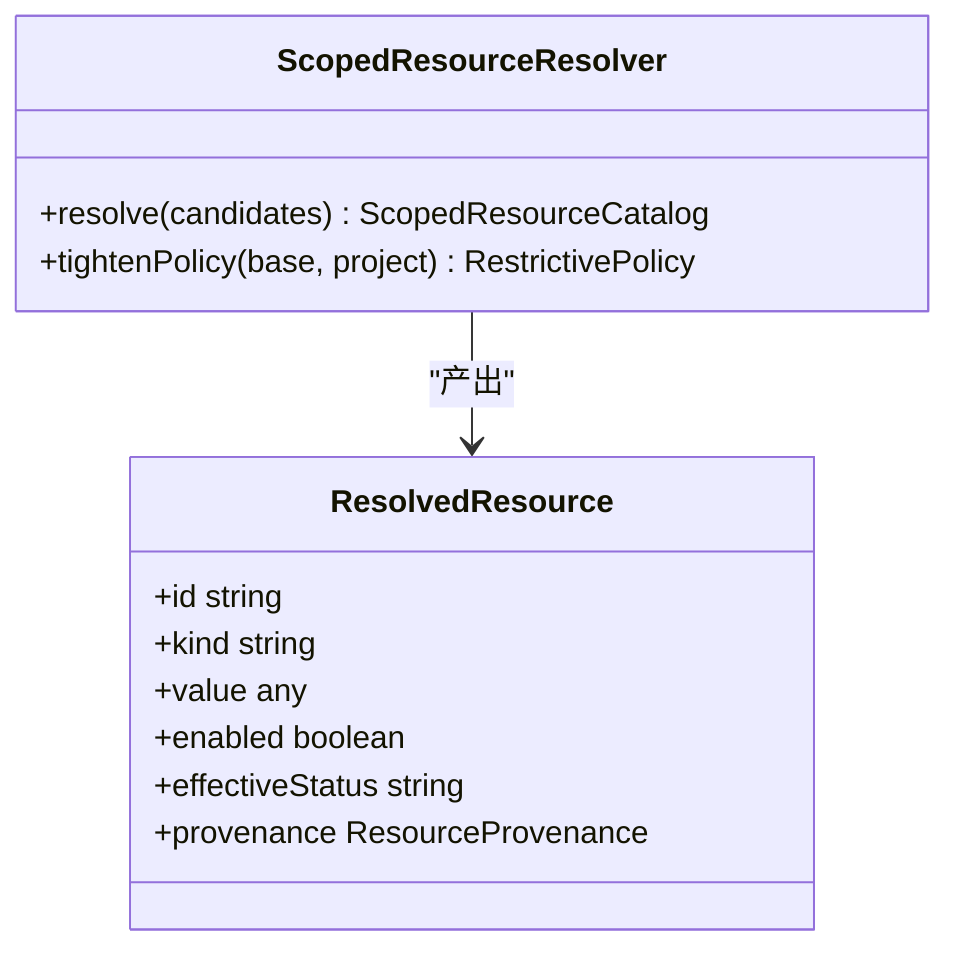
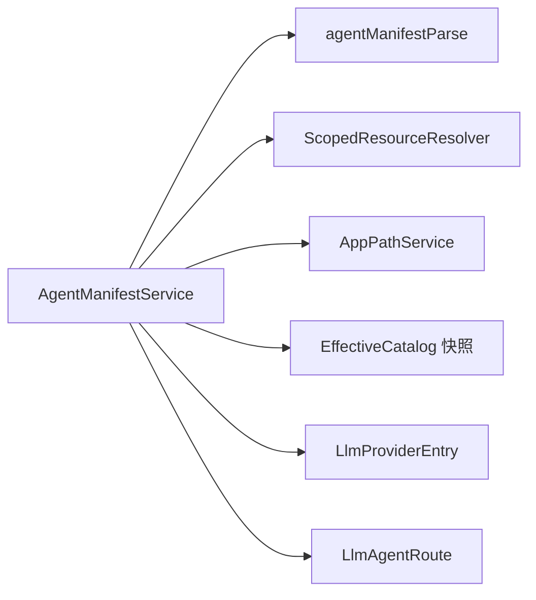

# AgentManifestService Agent清单服务

<cite>
**本文引用的文件**
- [AgentManifestService.ts](file://src/main/settings/AgentManifestService.ts)
- [agentManifestParse.ts](file://src/main/settings/agentManifestParse.ts)
- [compiledAgentRoutes.ts](file://src/main/settings/compiledAgentRoutes.ts)
- [ScopedResourceResolver.ts](file://src/main/runtime/ScopedResourceResolver.ts)
- [agent-manifest-models.md](file://docs/product/agent-manifest-models.md)
- [agentManifestParse.test.ts](file://src/main/settings/agentManifestParse.test.ts)
- [AgentManifestService.effectiveCommit.test.ts](file://src/main/settings/AgentManifestService.effectiveCommit.test.ts)
</cite>

## 目录
1. [简介](#简介)
2. [项目结构](#项目结构)
3. [核心组件](#核心组件)
4. [架构总览](#架构总览)
5. [详细组件分析](#详细组件分析)
6. [依赖关系分析](#依赖关系分析)
7. [性能考量](#性能考量)
8. [故障排查指南](#故障排查指南)
9. [结论](#结论)
10. [附录：清单文件格式与最佳实践](#附录：清单文件格式与最佳实践)

## 简介
AgentManifestService 负责解析、验证和管理 RDC-Agent 的 Agent 清单（.agent.md）文件，提供“内置/用户/项目”三层作用域的合并与覆盖策略，生成有效配置快照、模型选项、路由编译结果，并支持导入导出、备份恢复与协作开发所需的冲突检测与版本追踪。

## 项目结构
Agent 清单以 Markdown + YAML frontmatter 形式存在，按作用域优先级 builtin < user < project 进行整资源替换。服务层围绕以下文件组织：
- 清单解析与序列化：agentManifestParse.ts
- 清单服务主逻辑：AgentManifestService.ts
- 路由编译辅助：compiledAgentRoutes.ts
- 作用域资源合并：ScopedResourceResolver.ts
- 产品文档说明：agent-manifest-models.md
- 测试用例：agentManifestParse.test.ts、AgentManifestService.effectiveCommit.test.ts

图表来源
- [AgentManifestService.ts:177-246](file://src/main/settings/AgentManifestService.ts#L177-L246)
- [agentManifestParse.ts:68-151](file://src/main/settings/agentManifestParse.ts#L68-L151)
- [ScopedResourceResolver.ts:29-95](file://src/main/runtime/ScopedResourceResolver.ts#L29-L95)
- [compiledAgentRoutes.ts:6-42](file://src/main/settings/compiledAgentRoutes.ts#L6-L42)
- [agent-manifest-models.md:1-16](file://docs/product/agent-manifest-models.md#L1-L16)

章节来源
- [AgentManifestService.ts:177-246](file://src/main/settings/AgentManifestService.ts#L177-L246)
- [agentManifestParse.ts:68-151](file://src/main/settings/agentManifestParse.ts#L68-L151)
- [ScopedResourceResolver.ts:29-95](file://src/main/runtime/ScopedResourceResolver.ts#L29-L95)
- [compiledAgentRoutes.ts:6-42](file://src/main/settings/compiledAgentRoutes.ts#L6-L42)
- [agent-manifest-models.md:1-16](file://docs/product/agent-manifest-models.md#L1-L16)

## 核心组件
- AgentManifestService：统一入口，负责扫描、解析、校验、合并、保存、导入导出、路由编译与模型选项计算。
- agentManifestParse：严格解析 .agent.md，输出定义或诊断原因；同时提供序列化能力。
- ScopedResourceResolver：按作用域优先级合并候选资源，产出有效资源与诊断信息。
- compiledAgentRoutes：从定义中提取已编译路由，供上层使用。

章节来源
- [AgentManifestService.ts:177-667](file://src/main/settings/AgentManifestService.ts#L177-L667)
- [agentManifestParse.ts:68-175](file://src/main/settings/agentManifestParse.ts#L68-L175)
- [ScopedResourceResolver.ts:29-124](file://src/main/runtime/ScopedResourceResolver.ts#L29-L124)
- [compiledAgentRoutes.ts:6-42](file://src/main/settings/compiledAgentRoutes.ts#L6-L42)

## 架构总览
Agent 清单服务的整体流程如下：
- 读取与迁移：优先执行用户侧种子迁移，确保历史数据兼容。
- 扫描与解析：遍历内置、用户、项目三个目录下的 .agent.md 文件，严格解析为定义或记录无效原因。
- 合并与覆盖：通过作用域解析器按优先级合并，得到最终有效配置快照，附带诊断。
- 路由编译：从每个有效定义的 models 字段推导 providerId/modelId，形成 LlmAgentRoute。
- 模型选项：结合提供者、目录、路由与目录快照，计算可用模型选项及其状态。
- 持久化：支持保存、删除、导入，包含并发安全写入、冲突检测与哈希追踪。

图表来源
- [AgentManifestService.ts:248-266](file://src/main/settings/AgentManifestService.ts#L248-L266)
- [AgentManifestService.ts:186-246](file://src/main/settings/AgentManifestService.ts#L186-L246)
- [agentManifestParse.ts:68-151](file://src/main/settings/agentManifestParse.ts#L68-L151)
- [ScopedResourceResolver.ts:29-95](file://src/main/runtime/ScopedResourceResolver.ts#L29-L95)
- [compiledAgentRoutes.ts:6-42](file://src/main/settings/compiledAgentRoutes.ts#L6-L42)

## 详细组件分析

### AgentManifestService 类
职责概览
- 作用域扫描与解析：内置/用户/项目三目录，严格解析 .agent.md。
- 有效快照构建：合并覆盖、附加 provenance/sourceHash、注入 compiledRoute。
- 设置视图：返回 definitions、modelOptions、globalInstructions、diagnostics。
- 持久化：保存/删除/导入，含并发安全、冲突检测、只读保护。
- 路由与模型选项：从定义与提供者/目录快照推导可执行模型选项。

关键方法与行为
- resolveEffectiveSnapshot：扫描三作用域，收集候选，合并后为每个 profile 计算 sourceHash 与 compiledRoute。
- getSettings：基于快照生成 Settings 视图，排序 definitions，计算 modelOptions 与全局指令。
- saveDefinition：校验 scope、id、文件名一致性；用户作用域写覆盖，项目作用域原子写入；支持 delete；sourceHash 冲突检测。
- importFile：仅接受 .agent.md，解析并保存到用户作用域。
- routeFromDefinition / routesFromDefinitions：将 models 转换为 LlmAgentRoute，保留显式 canonical 路由。
- getModelOptions：综合 providers、routes、catalogs 与引用集合，计算模型选项状态（ready/unavailable/disabled/missing 等）。

错误与约束
- 内置清单缺失或无效会抛出明确错误。
- 用户/项目清单无效时不中断，转为诊断信息。
- 禁止直接编辑内置清单；删除内置清单需通过覆盖机制。
- 项目作用域保存必须提供 projectRoot。
- 文件名必须与 id 一致，否则拒绝。

图表来源
- [AgentManifestService.ts:186-246](file://src/main/settings/AgentManifestService.ts#L186-L246)
- [AgentManifestService.ts:498-655](file://src/main/settings/AgentManifestService.ts#L498-L655)
- [ScopedResourceResolver.ts:29-95](file://src/main/runtime/ScopedResourceResolver.ts#L29-L95)

章节来源
- [AgentManifestService.ts:177-667](file://src/main/settings/AgentManifestService.ts#L177-L667)

### 清单解析器 agentManifestParse
功能要点
- 严格解析 YAML frontmatter，提取 name、description、argument-hint、target、models、icon、accent、enabled、user-invocable、disable-model-invocation、tools、skills、mcp-servers、agents、handoffs、metadata、max-turns 等字段。
- 校验 handoffs 数组项必填字段与类型。
- 工具令牌诊断：拒绝未知或被拒令牌，避免静默过滤。
- 输出标准化定义，包含 filePath、fileName、builtin、enabled、updatedAt 等元信息。
- 提供序列化方法，保证写入格式稳定。

约束规则
- tools/skills/mcp-servers/agents/model 若出现则必须为字符串数组。
- enabled/user-invocable/disable-model-invocation 若出现则必须为布尔值。
- max-turns 若出现必须为正数。
- handoffs 每项要求 label、agent、prompt 非空，可选 send/showContinueOn/model 类型正确。

图表来源
- [agentManifestParse.ts:68-151](file://src/main/settings/agentManifestParse.ts#L68-L151)

章节来源
- [agentManifestParse.ts:68-175](file://src/main/settings/agentManifestParse.ts#L68-L175)
- [agentManifestParse.test.ts:1-30](file://src/main/settings/agentManifestParse.test.ts#L1-L30)

### 作用域资源合并 ScopedResourceResolver
策略
- 作用域优先级：builtin=0 < user=1 < project=2。
- 同 id 多候选按优先级排序，高优先级覆盖低优先级。
- 记录 provenance（scope、sourcePath、sourceHash），以及被覆盖来源（overriddenSource）。
- 对无效候选记录诊断，不参与覆盖。
- 计算 effectiveStatus：effective/inherited/overridden/disabled。

图表来源
- [ScopedResourceResolver.ts:29-95](file://src/main/runtime/ScopedResourceResolver.ts#L29-L95)

章节来源
- [ScopedResourceResolver.ts:29-124](file://src/main/runtime/ScopedResourceResolver.ts#L29-L124)

### 路由编译 compiledAgentRoutes
功能
- 从 AgentManifestDefinition 的 compiledRoute 或 models 推导 LlmAgentRoute。
- 提供批量转换与按 agentId 查询的便捷方法。

章节来源
- [compiledAgentRoutes.ts:6-42](file://src/main/settings/compiledAgentRoutes.ts#L6-L42)

## 依赖关系分析
- AgentManifestService 依赖：
  - agentManifestParse：解析/序列化清单
  - ScopedResourceResolver：作用域合并
  - AppPathService：路径解析（内置/用户/项目）
  - EffectiveCatalog 相关：模型可用性、选择与状态
  - Provider 与路由：用于模型选项计算
- 外部依赖：
  - fs、path、crypto：文件系统与哈希
  - shared types/constants：类型与常量

图表来源
- [AgentManifestService.ts:177-667](file://src/main/settings/AgentManifestService.ts#L177-L667)

章节来源
- [AgentManifestService.ts:177-667](file://src/main/settings/AgentManifestService.ts#L177-L667)

## 性能考量
- 解析阶段：严格校验与工具令牌诊断在加载时执行，建议缓存解析结果与哈希，减少重复 IO。
- 合并阶段：按 id 分组与排序复杂度 O(n log n)，n 为候选数量，通常较小。
- 模型选项计算：遍历 providers、catalogs、definitions 与 routes，注意去重与内部可见性过滤，避免重复计算。
- 写入阶段：项目作用域采用临时文件+rename 原子写入，降低并发竞争风险。

[本节为通用指导，不直接分析具体文件]

## 故障排查指南
常见错误与定位
- 内置清单缺失：BUILTIN_AGENT_MANIFEST_MISSING，检查内置 agents 目录是否存在。
- 清单语法错误：frontmatter 缺失或非对象、字段类型不符、handoffs 非法、工具令牌被拒等，查看解析返回的 reason。
- 作用域冲突：AGENT_ID_RESERVED_HISTORICAL 提示历史保留 id 被占用，需更换 id。
- 文件名不一致：AGENT_MANIFEST_FILENAME_MISMATCH，确保文件名 stem 与 id 一致。
- 并发冲突：AGENT_MANIFEST_SOURCE_HASH_CONFLICT，提交前需刷新最新 sourceHash。
- 只读保护：BUILTIN_AGENT_MANIFEST_READONLY，禁止直接编辑内置清单。

调试建议
- 使用 getSettings 获取 diagnostics 列表，逐项修复。
- 使用 readDefinition/importFile 快速验证单个清单是否合法。
- 使用 saveDefinition 的 sourceHash 参数实现乐观锁，避免覆盖他人修改。

章节来源
- [AgentManifestService.ts:186-246](file://src/main/settings/AgentManifestService.ts#L186-L246)
- [AgentManifestService.ts:284-362](file://src/main/settings/AgentManifestService.ts#L284-L362)
- [agentManifestParse.ts:68-151](file://src/main/settings/agentManifestParse.ts#L68-L151)
- [agentManifestParse.test.ts:1-30](file://src/main/settings/agentManifestParse.test.ts#L1-L30)
- [AgentManifestService.effectiveCommit.test.ts:63-135](file://src/main/settings/AgentManifestService.effectiveCommit.test.ts#L63-L135)

## 结论
AgentManifestService 提供了完整的 Agent 清单生命周期管理能力：从解析、校验、合并到路由编译与模型选项计算，再到持久化的保存、删除与导入。通过作用域优先级与严格的校验规则，确保配置的一致性与安全性；通过 sourceHash 与诊断信息，支持协作开发与问题定位。

[本节为总结，不直接分析具体文件]

## 附录：清单文件格式与最佳实践

### 清单位置与作用域
- 内置：resources/agent-runtime/agents/*.agent.md
- 用户：~/.rdx/agents/*.agent.md
- 项目：<project-root>/.rdx/agents/*.agent.md
- 优先级：builtin < user < project，整资源覆盖。

章节来源
- [agent-manifest-models.md:5-16](file://docs/product/agent-manifest-models.md#L5-L16)

### 字段定义与约束
- frontmatter 必需字段：name、description、argument-hint、target、models、icon、accent、enabled、user-invocable、disable-model-invocation、tools、skills、mcp-servers、agents、handoffs、metadata。
- handoffs：每项需 label、agent、prompt；可选 send、showContinueOn、model。
- 工具令牌：仅允许规范令牌，拒绝未知与被拒令牌。
- max-turns：可选，正整数。

章节来源
- [agent-manifest-models.md:17-118](file://docs/product/agent-manifest-models.md#L17-L118)
- [agentManifestParse.ts:68-151](file://src/main/settings/agentManifestParse.ts#L68-L151)

### 路由与模型选择
- 路由由 models 中的 canonical 标识推导 providerId 与 modelId。
- 模型选项状态包括 ready/provider-unavailable/model-disabled/model-unavailable/model-unverified/missing，依据提供者配置、目录快照与工具能力判定。

章节来源
- [AgentManifestService.ts:405-410](file://src/main/settings/AgentManifestService.ts#L405-L410)
- [AgentManifestService.ts:498-655](file://src/main/settings/AgentManifestService.ts#L498-L655)
- [compiledAgentRoutes.ts:6-42](file://src/main/settings/compiledAgentRoutes.ts#L6-L42)

### 导入导出、备份恢复与协作开发
- 导入：importFile 仅接受 .agent.md，解析后保存到用户作用域。
- 导出：readDefinition 可按 id 读取当前生效的定义。
- 备份恢复：通过文件系统复制 .agent.md 与全局指令文件；恢复后重新解析即可生效。
- 协作开发：saveDefinition 支持 sourceHash 冲突检测；项目作用域原子写入；diagnostics 提供变更影响提示。

章节来源
- [AgentManifestService.ts:412-444](file://src/main/settings/AgentManifestService.ts#L412-L444)
- [AgentManifestService.ts:379-403](file://src/main/settings/AgentManifestService.ts#L379-L403)
- [AgentManifestService.ts:284-362](file://src/main/settings/AgentManifestService.ts#L284-L362)