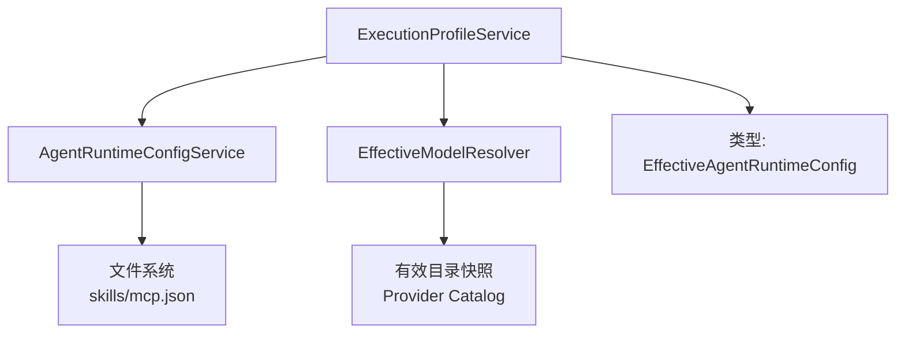
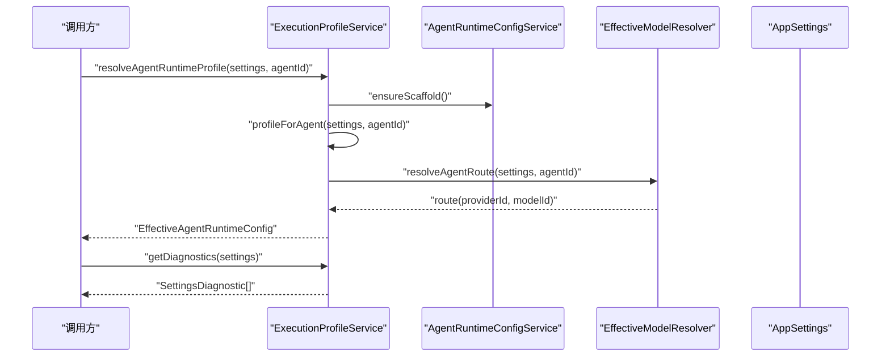
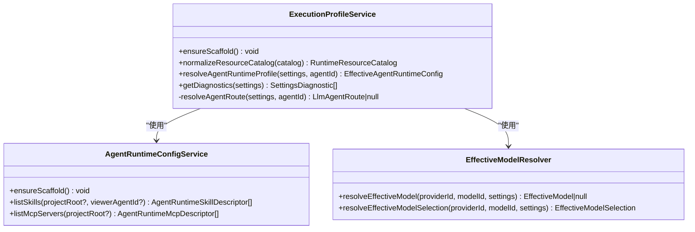
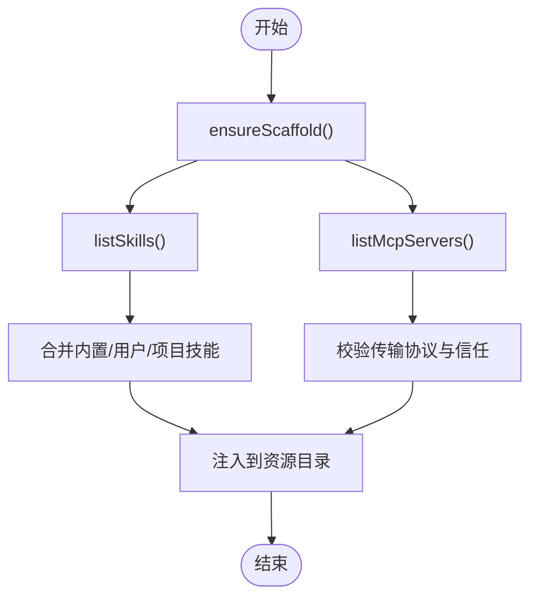
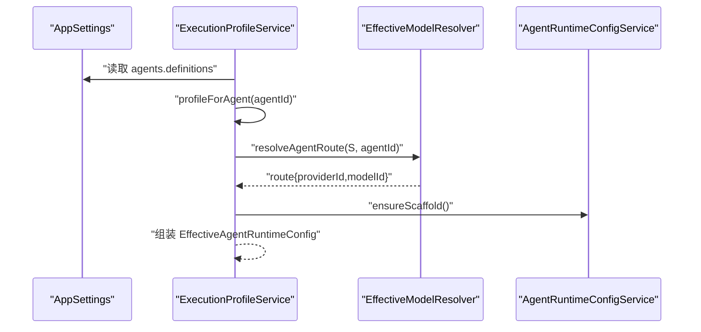
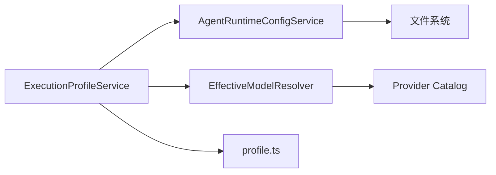

# ExecutionProfileService 执行配置文件服务

<cite>
**本文引用的文件**
- [ExecutionProfileService.ts](file://src/main/settings/ExecutionProfileService.ts)
- [AgentRuntimeConfigService.ts](file://src/main/settings/AgentRuntimeConfigService.ts)
- [EffectiveModelResolver.ts](file://src/main/settings/EffectiveModelResolver.ts)
- [profile.ts](file://src/shared/types/profile.ts)
- [builtin-profile-contracts.mjs](file://scripts/builtin-profile-contracts.mjs)
</cite>

## 目录
1. [简介](#简介)
2. [项目结构](#项目结构)
3. [核心组件](#核心组件)
4. [架构总览](#架构总览)
5. [详细组件分析](#详细组件分析)
6. [依赖关系分析](#依赖关系分析)
7. [性能考虑](#性能考虑)
8. [故障排查指南](#故障排查指南)
9. [结论](#结论)
10. [附录：配置参考与使用示例](#附录配置参考与使用示例)

## 简介
本文件围绕 ExecutionProfileService（执行配置文件服务）进行系统化文档化，重点解释执行配置文件的结构、管理与应用机制。内容涵盖配置的创建、加载、验证与应用流程；配置项定义、默认值继承与覆盖策略；多环境支持、配置模板与动态更新；版本兼容性与迁移策略；以及冲突解决机制。同时提供完整的配置参考与使用示例，帮助为不同执行场景创建和优化配置文件。

## 项目结构
ExecutionProfileService 位于主进程设置模块中，负责将“应用设置”转换为“运行时可执行的代理配置”，并整合技能、MCP 服务器等运行时资源。其关键依赖包括：
- AgentRuntimeConfigService：用于初始化运行时脚手架、列举技能与 MCP 服务器等运行时资源。
- EffectiveModelResolver：用于解析有效的模型路由与模型选择，确保所选模型可用且具备所需能力。
- 类型定义 profile.ts：定义了 EffectiveAgentRuntimeConfig 等关键数据结构。

图表来源
- [ExecutionProfileService.ts:11-65](file://src/main/settings/ExecutionProfileService.ts#L11-L65)
- [AgentRuntimeConfigService.ts:61-237](file://src/main/settings/AgentRuntimeConfigService.ts#L61-L237)
- [EffectiveModelResolver.ts:526-591](file://src/main/settings/EffectiveModelResolver.ts#L526-L591)
- [profile.ts:31-43](file://src/shared/types/profile.ts#L31-L43)

章节来源
- [ExecutionProfileService.ts:1-69](file://src/main/settings/ExecutionProfileService.ts#L1-L69)
- [AgentRuntimeConfigService.ts:1-237](file://src/main/settings/AgentRuntimeConfigService.ts#L1-L237)
- [EffectiveModelResolver.ts:1-789](file://src/main/settings/EffectiveModelResolver.ts#L1-L789)
- [profile.ts:1-44](file://src/shared/types/profile.ts#L1-L44)

## 核心组件
- ExecutionProfileService
  - ensureScaffold：确保运行时资源目录存在（如 skills、mcp 配置目录）。
  - normalizeResourceCatalog：规范化资源目录，注入当前可用的技能与 MCP 服务器列表。
  - resolveAgentRuntimeProfile：根据 AppSettings 与 AgentRole 生成 EffectiveAgentRuntimeConfig。
  - getDiagnostics：诊断是否已配置可用的 LLM Provider。
  - resolveAgentRoute（私有）：解析代理的模型路由，校验 Provider 状态与模型有效性。

- AgentRuntimeConfigService
  - listSkills / loadSkill：扫描内置、用户与项目级技能目录，按优先级合并并过滤可见性。
  - listMcpServers：扫描用户与项目级 .mcp.json 描述符，处理传输协议限制、信任与覆盖规则。

- EffectiveModelResolver
  - resolveEffectiveModel / resolveEffectiveModelSelection：基于有效目录快照选择最终模型，考虑别名、推荐与可用性。
  - planEffectiveModelRequest：规划请求能力（上下文窗口、推理模式、快速模式等），返回计划结果与建议。

章节来源
- [ExecutionProfileService.ts:11-65](file://src/main/settings/ExecutionProfileService.ts#L11-L65)
- [AgentRuntimeConfigService.ts:61-237](file://src/main/settings/AgentRuntimeConfigService.ts#L61-L237)
- [EffectiveModelResolver.ts:526-591](file://src/main/settings/EffectiveModelResolver.ts#L526-L591)

## 架构总览
下图展示了从“应用设置”到“执行配置”的完整数据流，包括资源目录规范化、模型路由解析与诊断信息生成。

图表来源
- [ExecutionProfileService.ts:25-65](file://src/main/settings/ExecutionProfileService.ts#L25-L65)
- [EffectiveModelResolver.ts:526-591](file://src/main/settings/EffectiveModelResolver.ts#L526-L591)

## 详细组件分析

### ExecutionProfileService 类分析
该类是执行配置的核心编排器，职责清晰：
- 资源目录保障：通过 ensureScaffold 保证运行时资源目录就绪。
- 资源目录规范化：normalizeResourceCatalog 将当前会话可用的技能与 MCP 服务器注入到资源目录中，便于上层消费。
- 执行配置生成：resolveAgentRuntimeProfile 依据 Agent 定义与路由，产出 EffectiveAgentRuntimeConfig，包含系统提示词、提供者与模型、温度、工具白名单、技能与 MCP 服务器 ID 列表及来源标识。
- 诊断：getDiagnostics 检查是否存在已配置的 Provider，若无则返回警告。
- 路由解析：resolveAgentRoute 校验 Provider 启用、已配置与已验证状态，并通过 EffectiveModelResolver 解析最终模型。

图表来源
- [ExecutionProfileService.ts:11-65](file://src/main/settings/ExecutionProfileService.ts#L11-L65)
- [AgentRuntimeConfigService.ts:61-237](file://src/main/settings/AgentRuntimeConfigService.ts#L61-L237)
- [EffectiveModelResolver.ts:526-591](file://src/main/settings/EffectiveModelResolver.ts#L526-L591)

章节来源
- [ExecutionProfileService.ts:11-65](file://src/main/settings/ExecutionProfileService.ts#L11-L65)

### 资源目录规范化与运行时资源
- 技能（Skills）：
  - 扫描路径：内置、用户、项目三级目录，按优先级合并。
  - 可见性：可按 viewerAgentId 过滤，仅暴露对当前代理可见的技能。
  - 元数据：包含 id、name、description、allowedTools、scope、sourcePath、effectiveStatus 等。
- MCP 服务器（MCP Servers）：
  - 描述符：读取 .mcp.json，校验 transport 是否在允许集合内（stdio、streamable-http）。
  - 信任与安全：项目级 MCP 需要信任校验，未信任将被阻止并提供原因。
  - 覆盖策略：项目级可覆盖名称、描述与默认启用状态，但禁止覆盖用户级的命令/参数/URL/环境变量。

图表来源
- [AgentRuntimeConfigService.ts:61-237](file://src/main/settings/AgentRuntimeConfigService.ts#L61-L237)

章节来源
- [AgentRuntimeConfigService.ts:61-237](file://src/main/settings/AgentRuntimeConfigService.ts#L61-L237)

### 执行配置生成流程
- 输入：AppSettings、AgentRole。
- 步骤：
  1) 查找启用的 Agent 定义，提取 instructions、tools、skills、mcpServers。
  2) 解析 Agent 路由，获取 providerId 与 modelId，并校验 Provider 状态。
  3) 通过 EffectiveModelResolver 解析最终模型（含别名映射与可用性）。
  4) 组装 EffectiveAgentRuntimeConfig，包含 systemPrompt、providerId、modelId、temperature、toolAllowlist、skillIds、mcpServerIds、source.agentProfileId。
- 输出：可用于运行时执行的有效配置。

图表来源
- [ExecutionProfileService.ts:25-65](file://src/main/settings/ExecutionProfileService.ts#L25-L65)
- [EffectiveModelResolver.ts:526-591](file://src/main/settings/EffectiveModelResolver.ts#L526-L591)

章节来源
- [ExecutionProfileService.ts:25-65](file://src/main/settings/ExecutionProfileService.ts#L25-L65)

### 诊断与错误处理
- 当没有任何已配置的 Provider 时，getDiagnostics 返回 warning，提示“无可用 Provider”。
- 路由解析失败（Provider 未启用、未配置或未验证）将导致 route 为空，从而在配置中保留空字符串或默认值。
- MCP 传输不支持或被项目信任策略阻止时，会在描述符中标记 blockedReason。

章节来源
- [ExecutionProfileService.ts:44-65](file://src/main/settings/ExecutionProfileService.ts#L44-L65)
- [AgentRuntimeConfigService.ts:120-232](file://src/main/settings/AgentRuntimeConfigService.ts#L120-L232)

## 依赖关系分析
- ExecutionProfileService 依赖：
  - AgentRuntimeConfigService：提供运行时资源清单与脚手架保障。
  - EffectiveModelResolver：提供模型路由与选择逻辑。
  - 类型定义：确保输出结构一致。
- 外部依赖：
  - 文件系统：读取 skills 与 .mcp.json。
  - 应用设置：AppSettings 中的 agents、llm.providers 等。

图表来源
- [ExecutionProfileService.ts:1-69](file://src/main/settings/ExecutionProfileService.ts#L1-L69)
- [AgentRuntimeConfigService.ts:1-237](file://src/main/settings/AgentRuntimeConfigService.ts#L1-L237)
- [EffectiveModelResolver.ts:1-789](file://src/main/settings/EffectiveModelResolver.ts#L1-L789)
- [profile.ts:1-44](file://src/shared/types/profile.ts#L1-L44)

章节来源
- [ExecutionProfileService.ts:1-69](file://src/main/settings/ExecutionProfileService.ts#L1-L69)
- [AgentRuntimeConfigService.ts:1-237](file://src/main/settings/AgentRuntimeConfigService.ts#L1-L237)
- [EffectiveModelResolver.ts:1-789](file://src/main/settings/EffectiveModelResolver.ts#L1-L789)
- [profile.ts:1-44](file://src/shared/types/profile.ts#L1-L44)

## 性能考虑
- 资源目录扫描：
  - 技能与 MCP 描述符的扫描发生在首次使用时（ensureScaffold），避免启动开销。
  - 建议缓存结果以减少重复 IO。
- 模型解析：
  - EffectiveModelResolver 会构建有效目录快照，建议在多次调用间复用快照。
- 诊断：
  - getDiagnostics 仅做简单遍历，复杂度低。

[本节为通用性能指导，不直接分析具体文件]

## 故障排查指南
- 无可用 Provider：
  - 现象：getDiagnostics 返回 warning。
  - 处理：在 AppSettings.llm.providers 中配置至少一个已启用且已验证的 Provider。
- 模型不可用：
  - 现象：resolveAgentRoute 返回 null。
  - 处理：检查 Provider 状态、模型是否启用、别名是否正确。
- MCP 被阻止：
  - 现象：blockedReason 指示传输不支持或缺乏信任。
  - 处理：修正 .mcp.json 的 transport 字段，或通过信任流程授权项目级 MCP。

章节来源
- [ExecutionProfileService.ts:44-65](file://src/main/settings/ExecutionProfileService.ts#L44-L65)
- [AgentRuntimeConfigService.ts:120-232](file://src/main/settings/AgentRuntimeConfigService.ts#L120-L232)

## 结论
ExecutionProfileService 将“静态的应用设置”转化为“动态的执行配置”，通过资源目录规范化与模型路由解析，确保每次执行都具备正确的系统提示、模型、工具与运行时资源。结合 AgentRuntimeConfigService 与 EffectiveModelResolver，该服务实现了多环境、多来源的配置合并与覆盖，提供了健壮的诊断与错误处理能力。

[本节为总结性内容，不直接分析具体文件]

## 附录：配置参考与使用示例

### 配置项定义与默认值
- EffectiveAgentRuntimeConfig：
  - agentId：代理角色标识。
  - systemPrompt：系统提示词，若未定义则回退为“You are {agentId}.”。
  - providerId：LLM 提供者 ID。
  - modelId：模型 ID，经 EffectiveModelResolver 解析后可能因别名而重映射。
  - temperature：默认 0.3。
  - toolAllowlist：工具白名单，来自 Agent 定义的 tools。
  - skillIds：技能 ID 列表，来自 Agent 定义的 skills。
  - mcpServerIds：MCP 服务器 ID 列表，来自 Agent 定义的 mcpServers。
  - source.agentProfileId：来源标识，通常为 Agent Profile ID 或 agentId。

章节来源
- [profile.ts:31-43](file://src/shared/types/profile.ts#L31-L43)
- [ExecutionProfileService.ts:25-42](file://src/main/settings/ExecutionProfileService.ts#L25-L42)

### 多环境配置支持与模板
- 多环境：
  - 通过 AppSettings 区分不同环境（如开发、测试、生产），每个环境可配置不同的 providers、models、agents。
  - 项目级与用户级资源（skills、mcp.json）可在不同环境中启用或禁用。
- 模板：
  - 内置 Agent 与 Skills 作为模板，提供基础能力与约束。
  - 可通过脚本 builtin-profile-contracts.mjs 校验内置配置契约，确保一致性。

章节来源
- [builtin-profile-contracts.mjs:95-149](file://scripts/builtin-profile-contracts.mjs#L95-L149)

### 动态配置更新
- 运行时资源：
  - 技能与 MCP 描述符在首次访问时扫描并缓存，后续变更需重新触发 ensureScaffold 或重启以生效。
- 模型路由：
  - EffectiveModelResolver 会根据 Provider Catalog 与用户覆盖动态计算有效模型，支持别名与推荐。

章节来源
- [AgentRuntimeConfigService.ts:61-237](file://src/main/settings/AgentRuntimeConfigService.ts#L61-L237)
- [EffectiveModelResolver.ts:526-591](file://src/main/settings/EffectiveModelResolver.ts#L526-L591)

### 版本兼容性与迁移策略
- 兼容性：
  - 通过 EffectiveModelResolver 的目录快照与覆盖层，兼容不同版本的 Provider Catalog 与模型定义。
- 迁移：
  - 当模型别名或路由变化时，resolveEffectiveModel 会自动重映射至有效模型。
  - 项目级 MCP 描述符变更需重新信任，避免安全风险。

章节来源
- [EffectiveModelResolver.ts:526-591](file://src/main/settings/EffectiveModelResolver.ts#L526-L591)
- [AgentRuntimeConfigService.ts:120-232](file://src/main/settings/AgentRuntimeConfigService.ts#L120-L232)

### 冲突解决机制
- 技能优先级：内置 < 用户 < 项目。
- MCP 覆盖：
  - 项目级可覆盖名称、描述与默认启用状态，但不能覆盖用户级的命令/参数/URL/环境变量。
  - 传输协议不支持将被标记为 blockedReason。
  - 项目级 MCP 需要信任校验，未信任将被阻止。

章节来源
- [AgentRuntimeConfigService.ts:95-232](file://src/main/settings/AgentRuntimeConfigService.ts#L95-L232)

### 使用示例
- 为调试场景创建执行配置：
  - 在 AppSettings.agents.definitions 中启用 debugger 代理，配置 tools、skills、mcpServers。
  - 调用 resolveAgentRuntimeProfile，获得 EffectiveAgentRuntimeConfig。
  - 使用 getDiagnostics 检查是否有可用 Provider。
- 为分析场景优化配置：
  - 在项目级 skills 目录添加自定义技能，并在 Agent 定义中引用。
  - 在项目级 mcp.json 中添加 MCP 服务器，完成信任流程后启用。
  - 通过 EffectiveModelResolver 选择具备所需能力的模型（如最大上下文、快速模式）。

[本节为概念性示例，不直接分析具体文件]