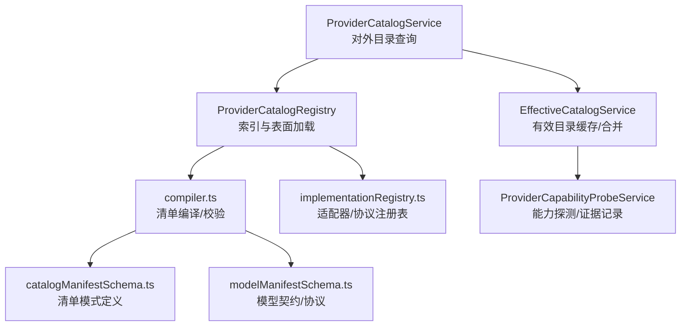
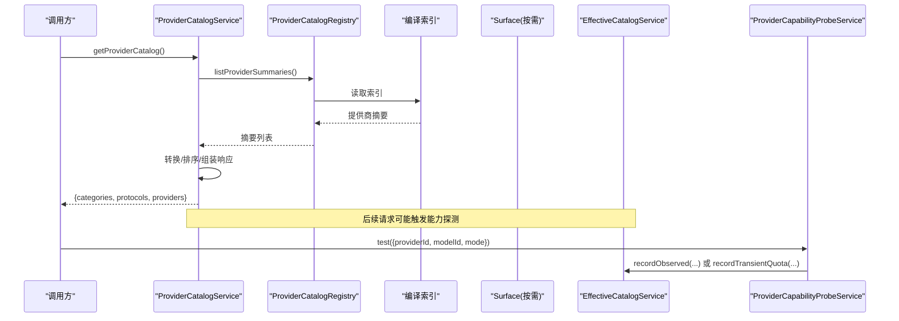
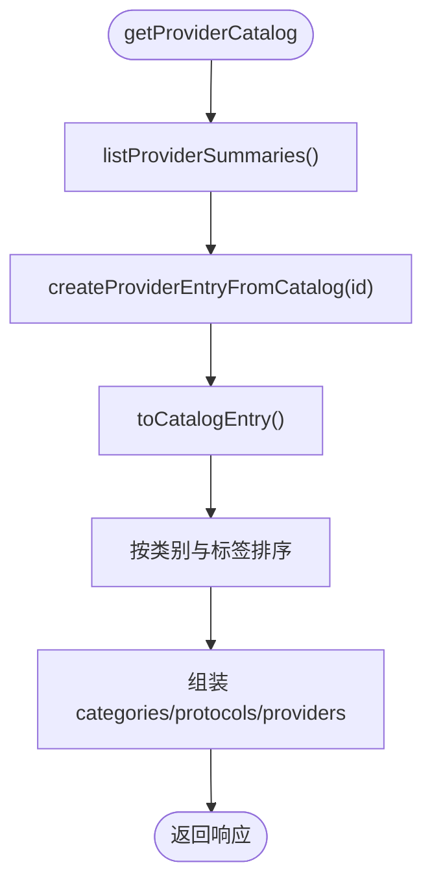
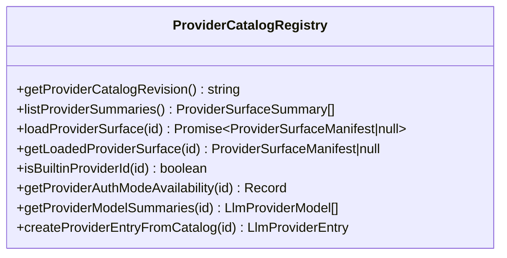
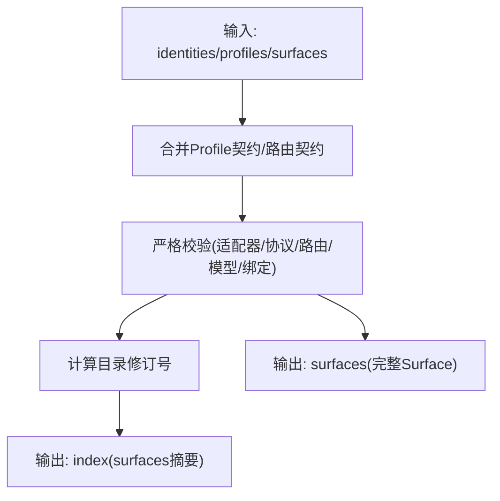
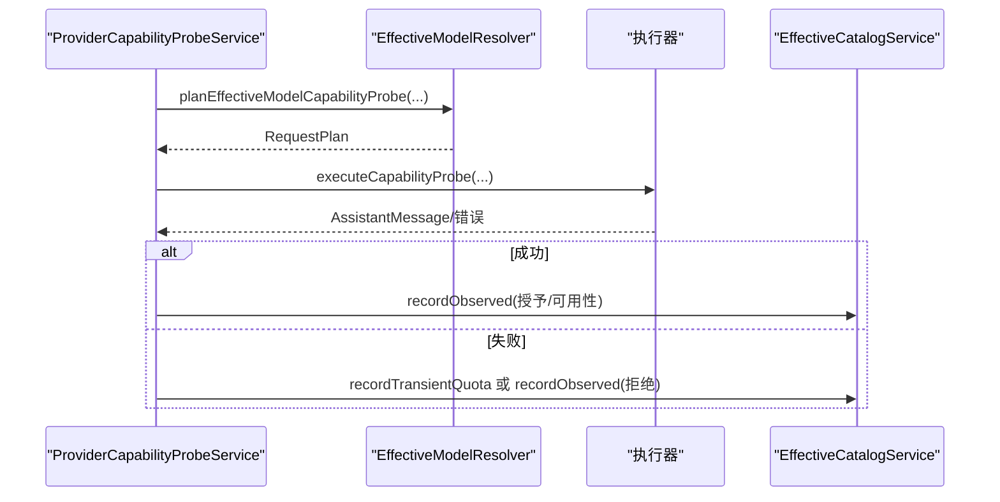
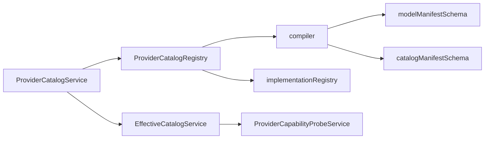

# ProviderCatalogService 提供商目录服务

<cite>
**本文引用的文件**
- [ProviderCatalogService.ts](file://src/main/settings/ProviderCatalogService.ts)
- [ProviderCatalogRegistry.ts](file://src/main/provider-catalog/ProviderCatalogRegistry.ts)
- [catalogManifestSchema.ts](file://src/shared/provider-catalog/catalogManifestSchema.ts)
- [compiler.ts](file://src/shared/provider-catalog/compiler.ts)
- [implementationRegistry.ts](file://src/shared/provider-catalog/implementationRegistry.ts)
- [modelManifestSchema.ts](file://src/shared/provider-catalog/modelManifestSchema.ts)
- [provider-catalog-index.cjs](file://scripts/provider-catalog-index.cjs)
- [EffectiveCatalogService.ts](file://src/main/settings/EffectiveCatalogService.ts)
- [ProviderCapabilityProbeService.ts](file://src/main/settings/ProviderCapabilityProbeService.ts)
</cite>

## 目录
1. [简介](#简介)
2. [项目结构](#项目结构)
3. [核心组件](#核心组件)
4. [架构总览](#架构总览)
5. [详细组件分析](#详细组件分析)
6. [依赖关系分析](#依赖关系分析)
7. [性能考量](#性能考量)
8. [故障排除指南](#故障排除指南)
9. [结论](#结论)
10. [附录](#附录)

## 简介
本文件围绕 ProviderCatalogService 及其相关子系统，系统化阐述 LLM 提供商目录的发现、解析与管理机制。内容涵盖：
- 提供商清单（Manifest）格式与编译校验
- 内置与自定义提供商的发现、加载与缓存
- 能力探测、版本兼容性与依赖管理
- 配置验证、缓存与更新机制
- 使用示例与集成新提供商的指南
- 故障排除与性能优化建议

## 项目结构
ProviderCatalogService 位于主进程设置层，负责对外暴露“提供商目录”视图；底层由 ProviderCatalogRegistry 提供清单索引与表面（Surface）加载能力；共享层的 compiler 与 schema 负责清单编译、校验与类型约束；EffectiveCatalogService 提供运行时有效目录合并与缓存；能力探测由 ProviderCapabilityProbeService 驱动。

图表来源
- [ProviderCatalogService.ts:57-69](file://src/main/settings/ProviderCatalogService.ts#L57-L69)
- [ProviderCatalogRegistry.ts:106-138](file://src/main/provider-catalog/ProviderCatalogRegistry.ts#L106-L138)
- [compiler.ts:622-715](file://src/shared/provider-catalog/compiler.ts#L622-L715)
- [catalogManifestSchema.ts:148-235](file://src/shared/provider-catalog/catalogManifestSchema.ts#L148-L235)
- [modelManifestSchema.ts:43-60](file://src/shared/provider-catalog/modelManifestSchema.ts#L43-L60)
- [implementationRegistry.ts:116-178](file://src/shared/provider-catalog/implementationRegistry.ts#L116-L178)
- [EffectiveCatalogService.ts:84-163](file://src/main/settings/EffectiveCatalogService.ts#L84-L163)
- [ProviderCapabilityProbeService.ts:277-355](file://src/main/settings/ProviderCapabilityProbeService.ts#L277-L355)

章节来源
- [ProviderCatalogService.ts:57-69](file://src/main/settings/ProviderCatalogService.ts#L57-L69)
- [ProviderCatalogRegistry.ts:106-138](file://src/main/provider-catalog/ProviderCatalogRegistry.ts#L106-L138)
- [compiler.ts:622-715](file://src/shared/provider-catalog/compiler.ts#L622-L715)

## 核心组件
- ProviderCatalogService：聚合分类、协议与提供商摘要，排序并返回统一目录响应。
- ProviderCatalogRegistry：维护编译后的目录索引与已加载的表面，提供按 ID 查询、列表与懒加载能力。
- compiler：将原始清单输入编译为可分发的索引与表面，执行严格校验与一致性检查。
- catalogManifestSchema / modelManifestSchema：以 Zod 定义的清单与模型契约，约束字段、协议、能力与行为。
- implementationRegistry：声明支持的协议与适配器映射，确保清单中的协议/适配器在运行时存在。
- EffectiveCatalogService：持久化并合并发现结果、授权与观测证据，提供快照与失效策略。
- ProviderCapabilityProbeService：基于计划执行能力探测，记录成功/失败证据到有效目录。

章节来源
- [ProviderCatalogService.ts:11-69](file://src/main/settings/ProviderCatalogService.ts#L11-L69)
- [ProviderCatalogRegistry.ts:21-138](file://src/main/provider-catalog/ProviderCatalogRegistry.ts#L21-L138)
- [compiler.ts:37-88](file://src/shared/provider-catalog/compiler.ts#L37-L88)
- [catalogManifestSchema.ts:148-235](file://src/shared/provider-catalog/catalogManifestSchema.ts#L148-L235)
- [modelManifestSchema.ts:308-338](file://src/shared/provider-catalog/modelManifestSchema.ts#L308-L338)
- [implementationRegistry.ts:116-178](file://src/shared/provider-catalog/implementationRegistry.ts#L116-L178)
- [EffectiveCatalogService.ts:84-163](file://src/main/settings/EffectiveCatalogService.ts#L84-L163)
- [ProviderCapabilityProbeService.ts:277-355](file://src/main/settings/ProviderCapabilityProbeService.ts#L277-L355)

## 架构总览
ProviderCatalogService 通过 ProviderCatalogRegistry 获取所有提供商摘要，转换为内部目录条目并按类别与标签排序后返回。清单数据来自编译产物（由脚本构建），运行时按需懒加载具体 Surface 并缓存。有效目录由 EffectiveCatalogService 维护，支持发现、授权与观测证据的合并与过期控制。能力探测通过 ProviderCapabilityProbeService 完成，并将结果回写至有效目录。

图表来源
- [ProviderCatalogService.ts:57-69](file://src/main/settings/ProviderCatalogService.ts#L57-L69)
- [ProviderCatalogRegistry.ts:106-138](file://src/main/provider-catalog/ProviderCatalogRegistry.ts#L106-L138)
- [EffectiveCatalogService.ts:150-163](file://src/main/settings/EffectiveCatalogService.ts#L150-L163)
- [ProviderCapabilityProbeService.ts:277-355](file://src/main/settings/ProviderCapabilityProbeService.ts#L277-L355)

## 详细组件分析

### ProviderCatalogService：目录聚合与排序
- 职责：从 Registry 获取提供商摘要，转换为统一目录条目，结合分类与协议定义，返回稳定排序的目录响应。
- 关键点：
  - 使用分类优先级与标签本地化比较进行排序，保证 UI 展示一致。
  - 仅暴露只读视图，不直接持有状态，便于扩展与测试。

图表来源
- [ProviderCatalogService.ts:57-69](file://src/main/settings/ProviderCatalogService.ts#L57-L69)

章节来源
- [ProviderCatalogService.ts:11-69](file://src/main/settings/ProviderCatalogService.ts#L11-L69)

### ProviderCatalogRegistry：清单索引与表面加载
- 职责：
  - 加载并校验编译后的目录索引。
  - 提供提供商摘要列表、按 ID 查询、懒加载 Surface、缓存已加载 Surface。
  - 计算默认路由、认证模式可用性、模型摘要等。
- 关键点：
  - 使用 Map 缓存已加载 Surface，避免重复 IO。
  - 对编译产物进行 schema 与版本校验，防止不兼容数据进入运行态。
  - 提供 isBuiltinProviderId、getProviderCatalogOwnership 等元信息访问。

图表来源
- [ProviderCatalogRegistry.ts:106-138](file://src/main/provider-catalog/ProviderCatalogRegistry.ts#L106-L138)
- [ProviderCatalogRegistry.ts:145-188](file://src/main/provider-catalog/ProviderCatalogRegistry.ts#L145-L188)
- [ProviderCatalogRegistry.ts:210-269](file://src/main/provider-catalog/ProviderCatalogRegistry.ts#L210-L269)

章节来源
- [ProviderCatalogRegistry.ts:21-138](file://src/main/provider-catalog/ProviderCatalogRegistry.ts#L21-L138)
- [ProviderCatalogRegistry.ts:145-269](file://src/main/provider-catalog/ProviderCatalogRegistry.ts#L145-L269)

### 清单编译与校验（compiler + schemas）
- 编译流程：
  - 读取身份、配置与表面清单，应用 Profile 契约合并，生成唯一键与哈希作为目录修订号。
  - 输出 index（包含 surfaces 摘要）、identities、profiles 与 surfaces 映射。
- 校验要点：
  - 适配器与协议必须匹配，且适配器需实现对应协议。
  - 路由、连接字段、事实源、模型选择与执行绑定的一致性检查。
  - 公开补丁不得嵌入敏感凭据。
  - 稳定状态的提供商必须提供显式 API-key 连接模式或模型目录/发现实现。
- 模式定义：
  - catalogManifestSchema 定义 Surface、Route、Connection、Discovery 等结构。
  - modelManifestSchema 定义协议、模型契约、上下文层级、执行绑定与能力声明。

图表来源
- [compiler.ts:124-165](file://src/shared/provider-catalog/compiler.ts#L124-L165)
- [compiler.ts:454-620](file://src/shared/provider-catalog/compiler.ts#L454-L620)
- [compiler.ts:622-715](file://src/shared/provider-catalog/compiler.ts#L622-L715)
- [catalogManifestSchema.ts:148-235](file://src/shared/provider-catalog/catalogManifestSchema.ts#L148-L235)
- [modelManifestSchema.ts:308-338](file://src/shared/provider-catalog/modelManifestSchema.ts#L308-L338)

章节来源
- [compiler.ts:622-715](file://src/shared/provider-catalog/compiler.ts#L622-L715)
- [catalogManifestSchema.ts:148-235](file://src/shared/provider-catalog/catalogManifestSchema.ts#L148-L235)
- [modelManifestSchema.ts:308-338](file://src/shared/provider-catalog/modelManifestSchema.ts#L308-L338)

### 内置与自定义提供商支持
- 内置提供商：
  - 通过编译后的索引与 Surface 提供，具备稳定的路由、协议与契约。
  - 可通过 isBuiltinProviderId 判断是否为内置。
- 自定义提供商：
  - 通过 discovery 策略（如 json-catalog、custom-parser）动态发现模型与路由。
  - 使用 connectionSchema 描述连接字段、凭证替代方案与头部映射。
  - 通过 effective catalog 层合并用户覆盖与运行时观测。

章节来源
- [ProviderCatalogRegistry.ts:145-188](file://src/main/provider-catalog/ProviderCatalogRegistry.ts#L145-L188)
- [catalogManifestSchema.ts:97-111](file://src/shared/provider-catalog/catalogManifestSchema.ts#L97-L111)
- [catalogManifestSchema.ts:191-235](file://src/shared/provider-catalog/catalogManifestSchema.ts#L191-L235)

### 能力探测、版本兼容性与依赖管理
- 能力探测：
  - 基于 EffectiveModelResolver 的计划，构造最小请求执行探测（fast/max-context）。
  - 成功时记录观测证据，提升可用性或授予能力；失败时根据状态码与清单匹配判定拒绝原因。
- 版本兼容性：
  - 清单编译产物包含 schemaVersion 与 catalogRevision，运行时强制校验。
  - 协议与适配器通过 implementationRegistry 集中管理，禁止未注册协议。
- 依赖管理：
  - 路由与适配器绑定，契约通过 Profile 合并，确保协议方言与能力声明一致。
  - 执行绑定限制请求头/体修改范围，禁止敏感字段泄露。

图表来源
- [ProviderCapabilityProbeService.ts:277-355](file://src/main/settings/ProviderCapabilityProbeService.ts#L277-L355)
- [EffectiveCatalogService.ts:300-340](file://src/main/settings/EffectiveCatalogService.ts#L300-L340)

章节来源
- [ProviderCapabilityProbeService.ts:277-355](file://src/main/settings/ProviderCapabilityProbeService.ts#L277-L355)
- [implementationRegistry.ts:116-178](file://src/shared/provider-catalog/implementationRegistry.ts#L116-L178)
- [compiler.ts:454-620](file://src/shared/provider-catalog/compiler.ts#L454-L620)

### 配置验证、缓存与更新机制
- 配置验证：
  - 清单编译阶段进行强校验，包括适配器/协议、路由、连接字段、事实源、模型选择与执行绑定。
  - 公开补丁禁止嵌入敏感凭据，保障清单安全。
- 缓存：
  - ProviderCatalogRegistry 缓存已加载 Surface，避免重复 IO。
  - EffectiveCatalogService 持久化 discoveries/entitlements/observed，带 TTL 与失效策略。
- 更新：
  - 通过刷新发现任务异步更新，支持指数退避与错误记录。
  - 订阅者可在快照变化时收到通知，渲染端据此更新 UI。

章节来源
- [ProviderCatalogRegistry.ts:119-138](file://src/main/provider-catalog/ProviderCatalogRegistry.ts#L119-L138)
- [EffectiveCatalogService.ts:150-163](file://src/main/settings/EffectiveCatalogService.ts#L150-L163)
- [EffectiveCatalogService.ts:246-298](file://src/main/settings/EffectiveCatalogService.ts#L246-L298)
- [compiler.ts:220-239](file://src/shared/provider-catalog/compiler.ts#L220-L239)

### 提供商目录的配置示例与使用指南
- 清单入口：
  - 通过 scripts/provider-catalog-index.cjs 加载 manifests 目录并编译为索引与 Surface。
- 新增提供商步骤：
  1) 在 manifests 中新增 Surface 与 Model 清单，遵循 catalogManifestSchema 与 modelManifestSchema。
  2) 若需新协议/适配器，先在 implementationRegistry 中注册。
  3) 重新运行编译脚本生成新的索引与 Surface。
  4) 通过 ProviderCatalogService.getProviderCatalog 获取目录，并在 UI 中展示。
  5) 如需动态发现，配置 discovery.strategy 与 admission 规则。
  6) 使用 ProviderCapabilityProbeService.test 验证 fast/max-context 能力。

章节来源
- [provider-catalog-index.cjs:1-19](file://scripts/provider-catalog-index.cjs#L1-L19)
- [catalogManifestSchema.ts:97-111](file://src/shared/provider-catalog/catalogManifestSchema.ts#L97-L111)
- [implementationRegistry.ts:116-178](file://src/shared/provider-catalog/implementationRegistry.ts#L116-L178)
- [ProviderCatalogService.ts:57-69](file://src/main/settings/ProviderCatalogService.ts#L57-L69)
- [ProviderCapabilityProbeService.ts:277-355](file://src/main/settings/ProviderCapabilityProbeService.ts#L277-L355)

## 依赖关系分析
- 低耦合：ProviderCatalogService 仅依赖 Registry 提供的摘要与转换函数，不直接操作文件系统。
- 强校验：compiler 与 schema 在构建期拦截错误，降低运行时风险。
- 可扩展：implementationRegistry 集中管理协议与适配器，新增协议无需改动上层逻辑。
- 运行时增强：EffectiveCatalogService 提供发现与观测数据的叠加层，不影响基础目录稳定性。

图表来源
- [ProviderCatalogService.ts:57-69](file://src/main/settings/ProviderCatalogService.ts#L57-L69)
- [ProviderCatalogRegistry.ts:106-138](file://src/main/provider-catalog/ProviderCatalogRegistry.ts#L106-L138)
- [compiler.ts:622-715](file://src/shared/provider-catalog/compiler.ts#L622-L715)
- [implementationRegistry.ts:116-178](file://src/shared/provider-catalog/implementationRegistry.ts#L116-L178)
- [EffectiveCatalogService.ts:84-163](file://src/main/settings/EffectiveCatalogService.ts#L84-L163)
- [ProviderCapabilityProbeService.ts:277-355](file://src/main/settings/ProviderCapabilityProbeService.ts#L277-L355)

章节来源
- [ProviderCatalogRegistry.ts:106-138](file://src/main/provider-catalog/ProviderCatalogRegistry.ts#L106-L138)
- [compiler.ts:622-715](file://src/shared/provider-catalog/compiler.ts#L622-L715)
- [implementationRegistry.ts:116-178](file://src/shared/provider-catalog/implementationRegistry.ts#L116-L178)
- [EffectiveCatalogService.ts:84-163](file://src/main/settings/EffectiveCatalogService.ts#L84-L163)

## 性能考量
- 构建期优化：
  - 清单编译阶段去重、排序与哈希，减少运行时开销。
  - 严格校验提前发现配置错误，避免无效请求。
- 运行时优化：
  - Surface 懒加载与内存缓存，避免重复 IO。
  - EffectiveCatalogService 的 TTL 与指数退避，降低频繁刷新带来的负载。
  - 能力探测结果缓存与去抖，避免重复探测。
- 网络与并发：
  - 并发刷新同一 key 的请求合并为单一 Promise，避免风暴。
  - 失败重试采用指数退避，保护后端资源。

[本节为通用指导，不直接分析具体文件]

## 故障排除指南
- 清单编译失败：
  - 检查适配器是否注册且支持目标协议。
  - 确认路由 baseUrl 非空，默认路由唯一。
  - 校验连接字段、事实源与模型选择的一致性。
- 运行时加载失败：
  - 核对编译产物 schemaVersion 与 catalogRevision 是否匹配。
  - 检查 Surface 是否存在于索引中。
- 能力探测失败：
  - 根据 HTTP 状态码分类：401 认证失败、404 路由不可用、429 配额耗尽、402 预算不足。
  - 若清单声明了授权拒绝匹配器，优先归类为授权拒绝。
  - 观察 EffectiveCatalogService 的 lastRefreshError 与最近快照指纹，定位问题。

章节来源
- [compiler.ts:454-620](file://src/shared/provider-catalog/compiler.ts#L454-L620)
- [ProviderCatalogRegistry.ts:119-138](file://src/main/provider-catalog/ProviderCatalogRegistry.ts#L119-L138)
- [ProviderCapabilityProbeService.ts:41-58](file://src/main/settings/ProviderCapabilityProbeService.ts#L41-L58)
- [EffectiveCatalogService.ts:365-388](file://src/main/settings/EffectiveCatalogService.ts#L365-L388)

## 结论
ProviderCatalogService 通过清晰的职责划分与严格的清单编译校验，提供了稳定、可扩展的 LLM 提供商目录管理能力。配合 EffectiveCatalogService 的动态发现与能力探测，系统能够在多供应商、多协议的复杂环境中保持高可用与高性能。建议在新增提供商时遵循清单规范与适配器注册流程，并通过能力探测验证关键路径，以获得最佳用户体验。

[本节为总结性内容，不直接分析具体文件]

## 附录
- 清单字段速览：
  - Surface：id、label、status、availability、category、routes、authModes、connectionSchema、discovery、models、recommendedModels、docsUrl。
  - Route：protocol、baseUrl、headers、contracts、default。
  - Model：modelId、route/routeOptions、contextTiers、controls、executionBindings、liveProjection、toolCalling/visionInput/structuredOutput。
- 常用接口：
  - getProviderCatalog：获取目录视图。
  - listProviderSummaries：列出提供商摘要。
  - loadProviderSurface：按需加载 Surface。
  - getSnapshot：获取有效目录快照。
  - test：执行能力探测。

[本节为补充说明，不直接分析具体文件]