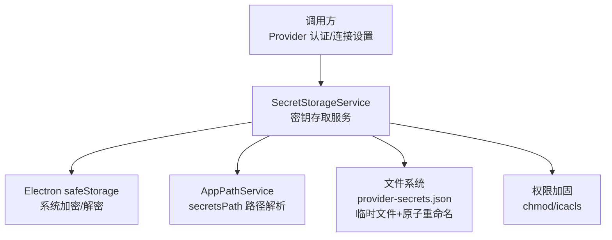
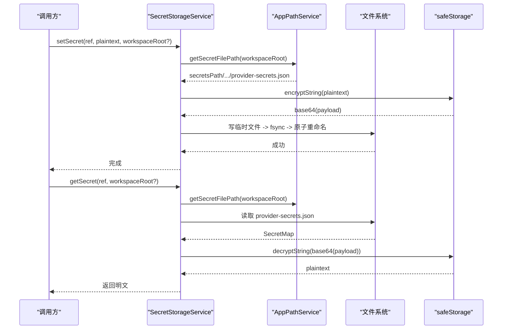
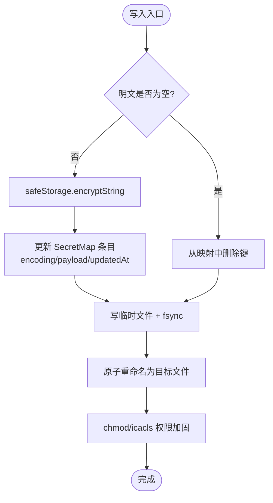
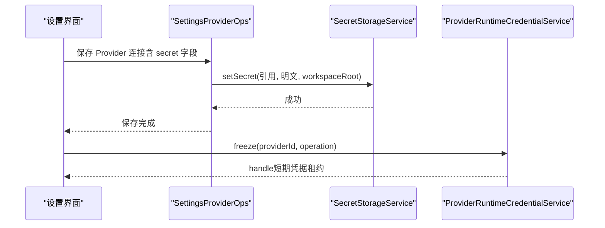
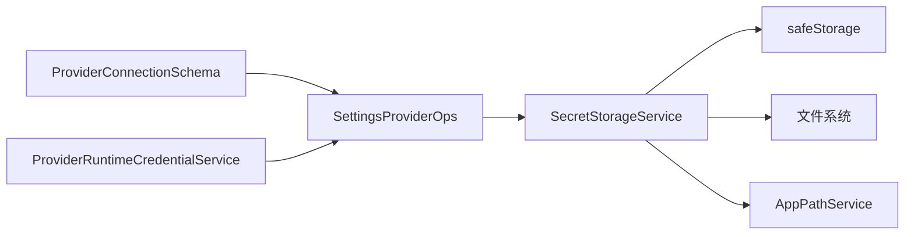

# SecretStorageService 密钥存储服务

<cite>
**本文引用的文件**
- [SecretStorageService.ts](file://src/main/settings/SecretStorageService.ts)
- [SecretStorageService.test.ts](file://src/main/settings/SecretStorageService.test.ts)
- [AppPathService.ts](file://src/main/runtime/AppPathService.ts)
- [SettingsProviderOps.ts](file://src/main/settings/SettingsProviderOps.ts)
- [ProviderConnectionSchema.ts](file://src/main/settings/ProviderConnectionSchema.ts)
- [ProviderRuntimeCredentialService.ts](file://src/main/settings/ProviderRuntimeCredentialService.ts)
- [CredentialStoreInterface.ts](file://src/main/settings/CredentialStoreInterface.ts)
</cite>

## 目录
1. [简介](#简介)
2. [项目结构](#项目结构)
3. [核心组件](#核心组件)
4. [架构总览](#架构总览)
5. [详细组件分析](#详细组件分析)
6. [依赖关系分析](#依赖关系分析)
7. [性能与可靠性](#性能与可靠性)
8. [故障排查指南](#故障排查指南)
9. [结论](#结论)
10. [附录：配置与使用示例](#附录配置与使用示例)

## 简介
本文件围绕 SecretStorageService（密钥存储服务）提供完整、深入的技术文档，聚焦敏感信息的安全存储机制、访问控制与生命周期管理。内容涵盖密钥的生成、存储、检索与销毁流程；密钥引用机制、工作区隔离与多账户支持；以及密钥轮换、泄露检测与审计日志等安全最佳实践。同时给出 Provider 认证中安全处理敏感信息的集成方式、常见安全威胁分析与防护措施说明。

## 项目结构
SecretStorageService 位于主进程设置模块中，负责将 Provider 的 API Key、OAuth 凭证等敏感数据以加密形式持久化到用户数据目录下的专用秘密文件中。其关键依赖包括 Electron 的 safeStorage 用于系统级加密、文件系统原子写入与权限加固、以及 AppPathService 提供的路径解析。

图表来源
- [SecretStorageService.ts:72-144](file://src/main/settings/SecretStorageService.ts#L72-L144)
- [AppPathService.ts:121-139](file://src/main/runtime/AppPathService.ts#L121-L139)

章节来源
- [SecretStorageService.ts:1-262](file://src/main/settings/SecretStorageService.ts#L1-L262)
- [AppPathService.ts:121-139](file://src/main/runtime/AppPathService.ts#L121-L139)

## 核心组件
- SecretStorageService：对外暴露 set/get/delete/has/copy/mask 等方法，内部维护一个以“密钥引用”为键的映射表，值包含编码类型、base64 编码的密文与更新时间戳。所有明文在落盘前通过 safeStorage 加密。
- AppPathService：提供 secretsPath 路径，默认位于用户数据根目录的 state/secrets 子目录，并在初始化时确保目录存在。
- SettingsProviderOps：在 Provider 连接配置保存过程中，将连接字段中的 secret 类型字段映射到 SecretStorageService 的密钥引用并持久化。
- ProviderConnectionSchema：定义如何识别 primary secret field、校验连接完整性、以及构建请求头映射等。
- ProviderRuntimeCredentialService：运行时凭据冻结与租约管理，配合 OAuth 刷新与特定云厂商凭据解析，形成端到端的凭据生命周期闭环。

章节来源
- [SecretStorageService.ts:72-259](file://src/main/settings/SecretStorageService.ts#L72-L259)
- [AppPathService.ts:121-139](file://src/main/runtime/AppPathService.ts#L121-L139)
- [SettingsProviderOps.ts:249-312](file://src/main/settings/SettingsProviderOps.ts#L249-L312)
- [ProviderConnectionSchema.ts:1-86](file://src/main/settings/ProviderConnectionSchema.ts#L1-L86)
- [ProviderRuntimeCredentialService.ts:51-146](file://src/main/settings/ProviderRuntimeCredentialService.ts#L51-L146)

## 架构总览
SecretStorageService 采用“引用 + 加密载荷”的设计：上层仅持有语义化的密钥引用（如 providerId/accountId/fieldId），不直接感知密文；底层统一通过 safeStorage 进行加解密，并以 JSON 映射文件持久化。该设计天然支持工作区隔离（通过 workspaceRoot 参数选择不同 secretsPath）、多账户（accountId 纳入引用）与细粒度字段（fieldId 区分不同 secret）。

图表来源
- [SecretStorageService.ts:107-144](file://src/main/settings/SecretStorageService.ts#L107-L144)
- [SecretStorageService.ts:182-227](file://src/main/settings/SecretStorageService.ts#L182-L227)
- [AppPathService.ts:121-139](file://src/main/runtime/AppPathService.ts#L121-L139)

## 详细组件分析

### SecretStorageService：加密存储与访问控制
- 加密策略：所有写入的明文先经 safeStorage.encryptString，再以 base64 存入 JSON 映射的 payload 字段；读取时校验 encoding 字段必须为 safeStorage，再解密。若 safeStorage 不可用，则拒绝写入并抛出专用错误。
- 文件安全：写入采用“临时文件 + fsync + 原子重命名”，避免部分写入导致损坏；写入后尝试 chmod 0o600，Windows 下尝试 icacls 限制为当前用户完全控制。
- 容错与隔离：读取失败或 JSON 非法会触发“隔离”操作，将原文件重命名为 .corrupt-{timestamp} 并抛出专用错误；支持按 workspaceRoot 隔离不同工作区的秘密文件。
- 引用机制：提供 createProviderSecretRef / createProviderOAuthSecretRef / createProviderAccountSecretRef / createProviderConnectionSecretRef 等方法，生成稳定、可审计的密钥引用键。
- 生命周期：setSecret 支持清空（空字符串）删除记录；deleteSecret 显式删除；hasSecretRecord 检查是否存在记录；maskSecretPreview 用于 UI 脱敏展示。

图表来源
- [SecretStorageService.ts:206-227](file://src/main/settings/SecretStorageService.ts#L206-L227)
- [SecretStorageService.ts:107-144](file://src/main/settings/SecretStorageService.ts#L107-L144)

章节来源
- [SecretStorageService.ts:18-42](file://src/main/settings/SecretStorageService.ts#L18-L42)
- [SecretStorageService.ts:44-70](file://src/main/settings/SecretStorageService.ts#L44-L70)
- [SecretStorageService.ts:72-144](file://src/main/settings/SecretStorageService.ts#L72-L144)
- [SecretStorageService.ts:146-164](file://src/main/settings/SecretStorageService.ts#L146-L164)
- [SecretStorageService.ts:166-259](file://src/main/settings/SecretStorageService.ts#L166-L259)

### 密钥引用与工作区隔离、多账户支持
- 引用键规范：
  - 单 Provider API Key：provider-{sanitize(providerId)}-api-key
  - 单 Provider OAuth：provider-{sanitize(providerId)}-oauth
  - 多账户 API Key/OAuth：provider-{sanitize(providerId)}-account-{sanitize(accountId)}-{kind}
  - 连接字段级密钥：{sanitize(providerId)}:{sanitize(accountId)}:connection:{sanitize(fieldId)}
- 工作区隔离：getSecret/setSecret/deleteSecret 均接受可选 workspaceRoot，内部通过 AppPathService.getRuntimePaths().secretsPath 定位 secretsPath，从而在不同用户/项目上下文中隔离秘密文件。
- 多账户支持：createProviderAccountSecretRef 与 createProviderConnectionSecretRef 将 accountId 纳入引用键，使同一 Provider 的不同账户凭据互不干扰。

章节来源
- [SecretStorageService.ts:146-164](file://src/main/settings/SecretStorageService.ts#L146-L164)
- [SecretStorageService.ts:72-75](file://src/main/settings/SecretStorageService.ts#L72-L75)
- [AppPathService.ts:121-139](file://src/main/runtime/AppPathService.ts#L121-L139)

### 与 Provider 认证的集成
- 连接字段到密钥引用：在保存 Provider 连接时，SettingsProviderOps 会将 schema 中标记为 secret 的字段映射到 SecretStorageService 的密钥引用，并通过 setSecret 持久化；primary secret field 可直接关联到 Provider 级别的引用。
- 运行时凭据冻结：ProviderRuntimeCredentialService 将 Provider 配置与连接值冻结为一次性租约（handle），结合 OAuth 刷新与特定云厂商凭据解析，确保运行期凭据最小暴露面与时效性。
- 头部映射：ProviderConnectionSchema 提供 resolveProviderConnectionHeaders，将连接值映射为请求头，便于在认证阶段注入令牌。

图表来源
- [SettingsProviderOps.ts:249-312](file://src/main/settings/SettingsProviderOps.ts#L249-L312)
- [ProviderRuntimeCredentialService.ts:58-83](file://src/main/settings/ProviderRuntimeCredentialService.ts#L58-L83)

章节来源
- [SettingsProviderOps.ts:249-312](file://src/main/settings/SettingsProviderOps.ts#L249-L312)
- [ProviderConnectionSchema.ts:77-86](file://src/main/settings/ProviderConnectionSchema.ts#L77-L86)
- [ProviderRuntimeCredentialService.ts:51-146](file://src/main/settings/ProviderRuntimeCredentialService.ts#L51-L146)

### 生命周期管理与清理
- 创建：首次 setSecret 时自动创建 secretsPath 与 provider-secrets.json。
- 更新：每次写入都会重建映射并原子替换文件，保证一致性。
- 删除：setSecret 传入空字符串或删除接口均可移除对应引用。
- 失效与隔离：读取损坏文件时会将其隔离为 .corrupt-{时间戳} 并抛出异常，防止污染后续读取。
- 租约过期：ProviderRuntimeCredentialService 定期清理超过最大租约时长的凭据句柄，降低内存驻留风险。

章节来源
- [SecretStorageService.ts:107-144](file://src/main/settings/SecretStorageService.ts#L107-L144)
- [SecretStorageService.ts:182-239](file://src/main/settings/SecretStorageService.ts#L182-L239)
- [ProviderRuntimeCredentialService.ts:137-142](file://src/main/settings/ProviderRuntimeCredentialService.ts#L137-L142)

## 依赖关系分析
- 外部依赖：
  - Electron safeStorage：系统级加密能力，不可用时拒绝存储。
  - Node.js fs：文件读写、fsync、权限设置。
  - child_process：Windows 下调用 icacls 强化 ACL。
- 内部依赖：
  - AppPathService：解析 secretsPath，确保目录存在。
  - SettingsProviderOps：将连接字段映射到密钥引用并持久化。
  - ProviderConnectionSchema：识别 primary secret、校验连接完整性、构造请求头。
  - ProviderRuntimeCredentialService：运行时凭据冻结与刷新，与 OAuth 刷新管理器协作。

图表来源
- [SecretStorageService.ts:1-6](file://src/main/settings/SecretStorageService.ts#L1-L6)
- [AppPathService.ts:121-139](file://src/main/runtime/AppPathService.ts#L121-L139)
- [SettingsProviderOps.ts:249-312](file://src/main/settings/SettingsProviderOps.ts#L249-L312)
- [ProviderConnectionSchema.ts:1-86](file://src/main/settings/ProviderConnectionSchema.ts#L1-L86)
- [ProviderRuntimeCredentialService.ts:51-146](file://src/main/settings/ProviderRuntimeCredentialService.ts#L51-L146)

章节来源
- [SecretStorageService.ts:1-6](file://src/main/settings/SecretStorageService.ts#L1-L6)
- [AppPathService.ts:121-139](file://src/main/runtime/AppPathService.ts#L121-L139)
- [SettingsProviderOps.ts:249-312](file://src/main/settings/SettingsProviderOps.ts#L249-L312)
- [ProviderConnectionSchema.ts:1-86](file://src/main/settings/ProviderConnectionSchema.ts#L1-L86)
- [ProviderRuntimeCredentialService.ts:51-146](file://src/main/settings/ProviderRuntimeCredentialService.ts#L51-L146)

## 性能与可靠性
- 原子写入：临时文件 + fsync + 原子重命名，避免并发写入导致的损坏。
- 最小 I/O：仅在必要时读取/写入 provider-secrets.json，且读路径快速失败（不存在即空映射）。
- 平台兼容：Linux/macOS 使用 POSIX 权限位；Windows 额外调用 icacls 提升安全性。
- 健壮性：对非法 JSON 或损坏文件进行隔离而非静默降级，避免污染状态。
- 内存占用：ProviderRuntimeCredentialService 的租约具有最大存活时间，定期清理减少长期驻留。

[本节为通用指导，无需具体文件引用]

## 故障排查指南
- safeStorage 不可用：
  - 现象：setSecret 抛出“安全存储不可用”错误。
  - 原因：操作系统未提供 safeStorage 或环境受限。
  - 处置：升级系统/运行环境或禁用敏感功能；测试用例覆盖此分支。
- 秘密文件损坏：
  - 现象：读取时报错并提示“已隔离至某路径”。
  - 原因：JSON 格式错误或权限问题导致解析失败。
  - 处置：检查隔离文件，恢复备份或重新配置；应用会自动创建新文件。
- 解密失败：
  - 现象：getSecret 返回空字符串并打印警告。
  - 原因：payload 非 safeStorage 编码或解密异常。
  - 处置：确认 entry.encoding 为 safeStorage；重新写入有效明文。
- 权限不足：
  - 现象：Windows 下无法修改 ACL 或文件被占用。
  - 原因：进程权限不足或文件句柄未释放。
  - 处置：以管理员权限运行或确保无其他进程锁定文件。

章节来源
- [SecretStorageService.test.ts:52-72](file://src/main/settings/SecretStorageService.test.ts#L52-L72)
- [SecretStorageService.ts:38-42](file://src/main/settings/SecretStorageService.ts#L38-L42)
- [SecretStorageService.ts:77-105](file://src/main/settings/SecretStorageService.ts#L77-L105)
- [SecretStorageService.ts:192-203](file://src/main/settings/SecretStorageService.ts#L192-L203)

## 结论
SecretStorageService 通过系统级加密、原子写入、权限加固与严格的引用机制，提供了高安全性的敏感信息存储能力。其与 Provider 认证链路紧密集成，支持工作区隔离与多账户场景，具备完善的容错与生命周期管理能力。建议在生产环境中启用安全存储、遵循最小权限原则、实施密钥轮换与审计，并结合运行时凭据租约机制进一步降低泄露风险。

[本节为总结性内容，无需具体文件引用]

## 附录：配置与使用示例
- 配置选项
  - 存储位置：由 AppPathService 决定，默认位于用户数据根的 state/secrets/provider-secrets.json。
  - 工作区隔离：通过 workspaceRoot 参数指定不同 secretsPath，实现多项目/多用户隔离。
  - 多账户：使用 createProviderAccountSecretRef/createProviderConnectionSecretRef 生成带 accountId 的引用键。
- 使用示例（概念性步骤）
  - 保存 API Key：调用 setSecret(createProviderSecretRef(providerId), apiKey)，随后在 Provider 配置中引用该键。
  - 保存 OAuth 凭证：调用 setSecret(createProviderOAuthSecretRef(providerId), oauthPayload)。
  - 保存连接字段密钥：调用 setSecret(createProviderConnectionSecretRef(providerId, accountId, fieldId), value)。
  - 读取密钥：调用 getSecret(ref) 获取明文；如需 UI 展示，使用 maskSecretPreview 脱敏。
  - 删除密钥：调用 deleteSecret(ref) 或 setSecret(ref, "") 清空。
- Provider 认证集成要点
  - 在保存连接时，将 schema 中标记为 secret 的字段映射到密钥引用并持久化。
  - 运行时通过 ProviderRuntimeCredentialService 冻结凭据，结合 OAuth 刷新与云厂商凭据解析，确保最小暴露面。
  - 使用 ProviderConnectionSchema.resolveProviderConnectionHeaders 将连接值映射为请求头，注入认证信息。

章节来源
- [SecretStorageService.ts:146-164](file://src/main/settings/SecretStorageService.ts#L146-L164)
- [SecretStorageService.ts:182-259](file://src/main/settings/SecretStorageService.ts#L182-L259)
- [SettingsProviderOps.ts:249-312](file://src/main/settings/SettingsProviderOps.ts#L249-L312)
- [ProviderConnectionSchema.ts:77-86](file://src/main/settings/ProviderConnectionSchema.ts#L77-L86)
- [ProviderRuntimeCredentialService.ts:58-146](file://src/main/settings/ProviderRuntimeCredentialService.ts#L58-L146)

## 安全最佳实践与威胁防护
- 密钥轮换
  - 定期更换 API Key/OAuth Token，并通过 setSecret 更新引用对应的密文。
  - 结合 ProviderRuntimeCredentialService 的 refresh 机制，确保运行期凭据及时更新。
- 泄露检测
  - 监控 provider-secrets.json 的访问与变更事件（文件系统审计）。
  - 在日志中记录 set/delete 操作的引用键（不含明文），以便追踪。
  - 对异常解密失败与文件损坏告警，快速定位潜在篡改。
- 审计日志
  - 记录密钥引用键、操作类型（set/delete/copy）、工作区标识与时间戳。
  - 避免记录明文与敏感元数据；仅保留必要的最小信息。
- 威胁分析与防护
  - 威胁：磁盘镜像/备份泄露 → 防护：safeStorage 加密 + 文件权限加固。
  - 威胁：恶意进程读取 → 防护：最小权限 + Windows ACL 限制 + 隔离损坏文件。
  - 威胁：中间人攻击 → 防护：仅本地存储，网络传输使用 HTTPS；请求头通过运行时注入。
  - 威胁：凭据长期驻留 → 防护：租约过期清理 + 最小暴露面 + 按需刷新。

[本节为通用指导，无需具体文件引用]

## 相关接口与契约
- CredentialStore 抽象：定义了 read/modify/delete 的凭据存储契约，便于未来扩展或替换实现。
- ApiKeyAuth/OAuthAuth：抽象了基于 API Key 与 OAuth 的认证流程，便于 Provider 适配。
- ProviderAuth：组合上述两种认证方式的统一表面。

章节来源
- [CredentialStoreInterface.ts:1-58](file://src/main/settings/CredentialStoreInterface.ts#L1-L58)