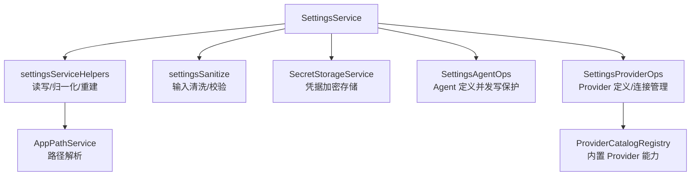
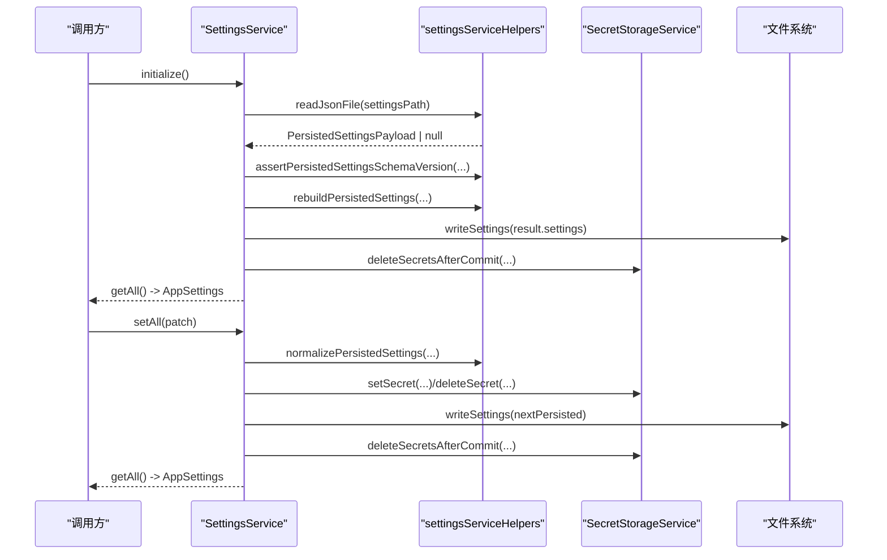
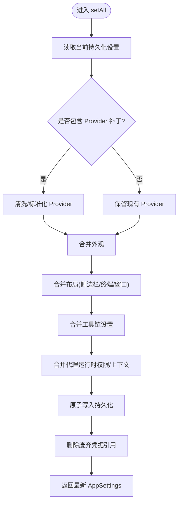
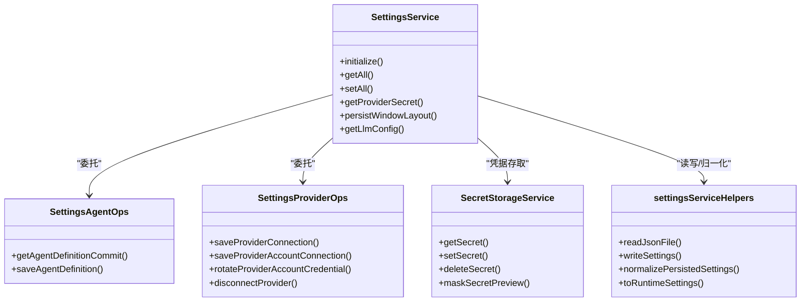

# SettingsService 设置服务

<cite>
**本文引用的文件**
- [SettingsService.ts](file://src/main/settings/SettingsService.ts)
- [settingsDefaults.ts](file://src/main/settings/settingsDefaults.ts)
- [settingsSanitize.ts](file://src/main/settings/settingsSanitize.ts)
- [SecretStorageService.ts](file://src/main/settings/SecretStorageService.ts)
- [settingsServiceHelpers.ts](file://src/main/settings/settingsServiceHelpers.ts)
- [SettingsAgentOps.ts](file://src/main/settings/SettingsAgentOps.ts)
- [SettingsProviderOps.ts](file://src/main/settings/SettingsProviderOps.ts)
</cite>

## 目录
1. [简介](#简介)
2. [项目结构](#项目结构)
3. [核心组件](#核心组件)
4. [架构总览](#架构总览)
5. [详细组件分析](#详细组件分析)
6. [依赖关系分析](#依赖关系分析)
7. [性能与可靠性](#性能与可靠性)
8. [故障排查指南](#故障排查指南)
9. [结论](#结论)
10. [附录：公共 API 参考](#附录公共-api-参考)

## 简介
SettingsService 是应用设置服务的核心，负责应用设置的初始化、读取、写入、验证、持久化、版本迁移以及 Provider（第三方服务）凭据的安全存储与热重载。它提供统一的接口来管理外观、布局、工具链、代理运行时权限、LLM Provider 配置等，并通过安全存储与数据规范化确保设置的一致性与安全性。

## 项目结构
设置相关代码集中在 src/main/settings 目录下，围绕 SettingsService 形成“读写-校验-持久化-安全存储”的分层结构：
- SettingsService：对外暴露统一 API，协调各子模块完成设置生命周期管理
- settingsDefaults：定义默认值、持久化数据结构与 Schema 版本
- settingsSanitize：输入清洗与规则校验（窗口尺寸、终端高度、路径白名单等）
- SecretStorageService：基于系统安全存储的凭据加密保存与读取
- settingsServiceHelpers：JSON 读写、Schema 版本断言、重建与归一化、运行时设置组装
- SettingsAgentOps / SettingsProviderOps：分别处理 Agent 定义与 Provider 定义的并发写保护与提交快照

图表来源
- [SettingsService.ts:94-518](file://src/main/settings/SettingsService.ts#L94-L518)
- [settingsServiceHelpers.ts:100-408](file://src/main/settings/settingsServiceHelpers.ts#L100-L408)
- [settingsSanitize.ts:42-278](file://src/main/settings/settingsSanitize.ts#L42-L278)
- [SecretStorageService.ts:72-262](file://src/main/settings/SecretStorageService.ts#L72-L262)
- [SettingsAgentOps.ts:15-192](file://src/main/settings/SettingsAgentOps.ts#L15-L192)
- [SettingsProviderOps.ts:43-547](file://src/main/settings/SettingsProviderOps.ts#L43-L547)

章节来源
- [SettingsService.ts:94-518](file://src/main/settings/SettingsService.ts#L94-L518)
- [settingsDefaults.ts:33-193](file://src/main/settings/settingsDefaults.ts#L33-L193)

## 核心组件
- SettingsService：单例服务，封装 initialize/getAll/setAll 等核心方法；管理窗口布局快速持久化；聚合 Provider 与 Agent 操作；生成 LLM 配置供上层使用
- settingsDefaults：定义 SETTINGS_SCHEMA_VERSION、默认外观/布局/工具/权限等常量与创建默认持久化负载的工厂函数
- settingsSanitize：对各类设置项进行严格清洗与范围限制（如窗口宽高、终端高度、命令前缀白名单等）
- SecretStorageService：使用系统 safeStorage 加密存储凭据，支持掩码预览、损坏隔离、原子写入与权限加固
- settingsServiceHelpers：实现 JSON 文件的异步/同步读写、Schema 版本断言、旧版数据重建、归一化为运行时 AppSettings
- SettingsAgentOps：按 Agent 维度维护写锁与提交快照，防止并发覆盖
- SettingsProviderOps：按 Provider 维度维护写锁、模型偏好、连接字段与凭据生命周期管理

章节来源
- [SettingsService.ts:94-518](file://src/main/settings/SettingsService.ts#L94-L518)
- [settingsDefaults.ts:33-193](file://src/main/settings/settingsDefaults.ts#L33-L193)
- [settingsSanitize.ts:42-278](file://src/main/settings/settingsSanitize.ts#L42-L278)
- [SecretStorageService.ts:72-262](file://src/main/settings/SecretStorageService.ts#L72-L262)
- [settingsServiceHelpers.ts:100-408](file://src/main/settings/settingsServiceHelpers.ts#L100-L408)
- [SettingsAgentOps.ts:15-192](file://src/main/settings/SettingsAgentOps.ts#L15-L192)
- [SettingsProviderOps.ts:43-547](file://src/main/settings/SettingsProviderOps.ts#L43-L547)

## 架构总览
设置服务采用“读时归一化 + 写时清洗 + 安全存储 + 并发写保护”的架构模式：
- 初始化阶段：读取磁盘设置 → 校验 Schema 版本 → 必要时重建 → 清理废弃凭据 → 返回运行时设置
- 读取阶段：从磁盘读取持久化负载 → 归一化并注入 Provider 凭据 → 组装为 AppSettings
- 写入阶段：接收补丁 → 清洗合并 → 更新 Provider 凭据 → 原子写入 → 清理废弃凭据 → 返回最新设置
- 热重载：通过 Provider 凭据与 Agent 路由在读取时动态装配，无需重启进程即可生效

图表来源
- [SettingsService.ts:103-139](file://src/main/settings/SettingsService.ts#L103-L139)
- [SettingsService.ts:249-383](file://src/main/settings/SettingsService.ts#L249-L383)
- [settingsServiceHelpers.ts:100-140](file://src/main/settings/settingsServiceHelpers.ts#L100-L140)
- [settingsServiceHelpers.ts:327-355](file://src/main/settings/settingsServiceHelpers.ts#L327-L355)
- [SecretStorageService.ts:182-227](file://src/main/settings/SecretStorageService.ts#L182-L227)

## 详细组件分析

### SettingsService 类
职责与行为
- 初始化：确保运行路径就绪、执行配置文件脚手架、读取并校验设置、必要时重建并落盘、清理废弃凭据、返回运行时设置
- 读取：getAll 将持久化负载归一化为 AppSettings，并在读取时按需注入 Provider 凭据
- 写入：setAll 接收补丁，合并外观、布局、工具、代理运行时权限、Provider 列表；处理 API Key 与账户凭据的增删改；落盘后清理废弃凭据
- 窗口布局：提供 persistWindowLayout/persistWindowLayoutAsync 快速持久化窗口状态，跳过 Provider 归一化以提升性能
- Provider 凭据：getProviderSecret、hasProviderSecret、getProviderConnectionValues、getProviderOAuthSecret 等便捷访问
- Agent/Provider 定义：委托 SettingsAgentOps/SettingsProviderOps 完成带并发保护的提交与快照
- 配置导出：getLlmConfig 输出当前可用的 LLM 配置（含 Provider 与 Agent 路由）

关键流程（setAll 写入）

图表来源
- [SettingsService.ts:249-383](file://src/main/settings/SettingsService.ts#L249-L383)

章节来源
- [SettingsService.ts:94-518](file://src/main/settings/SettingsService.ts#L94-L518)

### 设置结构与默认值
- 持久化负载类型：包含 schemaVersion、appearance、layout、profile、llm.providers、tooling、agentRuntime
- 默认值：DEFAULT_APPEARANCE、DEFAULT_LAYOUT、DEFAULT_PROFILE、DEFAULT_TOOLING、DEFAULT_AGENT_RUNTIME
- Schema 版本：SETTINGS_SCHEMA_VERSION 用于兼容与迁移判断

章节来源
- [settingsDefaults.ts:33-193](file://src/main/settings/settingsDefaults.ts#L33-L193)

### 设置验证与清洗
- 窗口尺寸：clamp 到最小/最大范围，保证可交互性
- 终端高度：限制在合理区间
- 工具链：RdcCliInvoker、RdcActions、CodeInterpreter、Shell 均做类型与范围校验
- 代理运行时权限：mode 枚举校验、路径白名单去重与展开、命令前缀数组清洗
- UI 偏好：合并与清洗，避免污染主题

章节来源
- [settingsSanitize.ts:42-278](file://src/main/settings/settingsSanitize.ts#L42-L278)

### 凭据安全存储
- 使用系统 safeStorage 加密存储，拒绝不支持的环境
- 文件写入采用临时文件 + 原子 rename，失败时清理临时文件
- Windows 下尝试收紧 ACL，非测试环境限制仅当前用户可访问
- 损坏检测：解析失败或结构异常时自动隔离至 .corrupt-* 文件
- 提供掩码预览以安全展示部分凭据

章节来源
- [SecretStorageService.ts:18-262](file://src/main/settings/SecretStorageService.ts#L18-L262)

### 版本迁移策略
- 读取时断言 schemaVersion 不超过当前支持上限
- 重建逻辑会：
  - 移除 fixture Provider 并清理其凭据
  - 移除非 catalog 的 Provider
  - 修复重复 Provider
  - 清理旧版 appearance.chromeThemes 污染
  - 移除已弃用的 embedding 选择
- 重建完成后写回新格式并清理废弃凭据

章节来源
- [settingsServiceHelpers.ts:112-126](file://src/main/settings/settingsServiceHelpers.ts#L112-L126)
- [settingsServiceHelpers.ts:176-289](file://src/main/settings/settingsServiceHelpers.ts#L176-L289)

### 热重载机制
- 读取时通过 hydrateProviderSecrets 注入真实凭据，使 Provider 凭据变更即时生效
- getLlmConfig 基于当前设置构建可用 Provider 列表与 Agent 路由，供上层实时消费
- 窗口布局快速持久化不触发完整 Provider 归一化，降低高频写入开销

章节来源
- [settingsServiceHelpers.ts:357-408](file://src/main/settings/settingsServiceHelpers.ts#L357-L408)
- [SettingsService.ts:458-487](file://src/main/settings/SettingsService.ts#L458-L487)
- [SettingsService.ts:212-247](file://src/main/settings/SettingsService.ts#L212-L247)

### 并发写保护与提交快照
- Agent 定义：按 laneKey 维护写尾 Promise 与客户端版本号，防止并发覆盖；成功提交后缓存快照
- Provider 定义：按 providerId 维护写尾与客户端版本号；支持设置 catalogRevision；失败时回滚到上次有效快照

章节来源
- [SettingsAgentOps.ts:15-192](file://src/main/settings/SettingsAgentOps.ts#L15-L192)
- [SettingsProviderOps.ts:43-190](file://src/main/settings/SettingsProviderOps.ts#L43-L190)

## 依赖关系分析

图表来源
- [SettingsService.ts:94-518](file://src/main/settings/SettingsService.ts#L94-L518)
- [SettingsAgentOps.ts:15-192](file://src/main/settings/SettingsAgentOps.ts#L15-L192)
- [SettingsProviderOps.ts:43-547](file://src/main/settings/SettingsProviderOps.ts#L43-L547)
- [SecretStorageService.ts:72-262](file://src/main/settings/SecretStorageService.ts#L72-L262)
- [settingsServiceHelpers.ts:100-408](file://src/main/settings/settingsServiceHelpers.ts#L100-L408)

## 性能与可靠性
- 原子写入：设置与凭据文件均采用临时文件 + 原子 rename，避免半写损坏
- 快速写入：窗口布局持久化跳过 Provider 归一化，减少频繁移动/调整时的开销
- 并发安全：Agent/Provider 定义写操作通过写尾队列与客户端版本号防冲突
- 健壮性：Schema 版本断言、数据重建、凭据文件损坏隔离、错误日志与提示
- 资源清理：提交后及时删除废弃凭据引用，避免残留敏感信息

[本节为通用指导，不直接分析具体文件]

## 故障排查指南
- 无法解密凭据：检查系统 safeStorage 可用性；若不可用将拒绝存储凭据
- 凭据文件损坏：会自动隔离到 .corrupt-* 文件，需检查对应路径并恢复
- 设置 Schema 过高：读取时会抛出存储 Schema 不支持错误，需升级应用或降级设置
- Provider 未配置：重建后会提示无可用 Provider，需完成登录或配置 API Key
- 并发覆盖：保存结果返回 superseded 表示被后续请求覆盖，应重试或合并变更

章节来源
- [SecretStorageService.ts:18-85](file://src/main/settings/SecretStorageService.ts#L18-L85)
- [settingsServiceHelpers.ts:112-126](file://src/main/settings/settingsServiceHelpers.ts#L112-L126)
- [settingsServiceHelpers.ts:176-289](file://src/main/settings/settingsServiceHelpers.ts#L176-L289)
- [SettingsAgentOps.ts:129-190](file://src/main/settings/SettingsAgentOps.ts#L129-L190)
- [SettingsProviderOps.ts:152-190](file://src/main/settings/SettingsProviderOps.ts#L152-L190)

## 结论
SettingsService 提供了完整的设置生命周期管理能力，涵盖初始化、读取、写入、验证、持久化、版本迁移与安全凭据管理。通过严格的输入清洗、原子写入、并发写保护与热重载机制，确保了设置的一致性与高可用性。建议在使用时遵循提供的公共 API，避免绕过清洗与校验逻辑，以确保系统稳定性与安全性。

[本节为总结，不直接分析具体文件]

## 附录：公共 API 参考
以下列出 SettingsService 的主要公共方法及其用途说明（不包含代码片段）：

- initialize(): 初始化设置服务，加载并重建设置，返回 AppSettings
- getAll(runtimePaths?): 读取并归一化设置，返回运行时 AppSettings
- setAll(patch, runtimePaths?): 应用设置补丁，持久化并返回最新 AppSettings
- getProviderSecret(providerId, workspaceRoot?): 获取指定 Provider 的 API Key 明文
- hasProviderSecret(providerId, workspaceRoot?): 检查是否存在凭据并返回掩码预览
- getProviderConnectionValues(providerId, workspaceRoot?): 获取 Provider 连接字段值（含密钥字段）
- getProviderOAuthSecret(providerId, workspaceRoot?): 获取 OAuth 凭据
- persistWindowLayout(window): 快速同步持久化窗口布局
- persistWindowLayoutAsync(window): 快速异步持久化窗口布局
- getAgentDefinitionCommit(query): 获取 Agent 定义提交快照
- saveAgentDefinition(request): 保存 Agent 定义（带并发保护）
- getProviderDefinitionCommit(providerIdDraft): 获取 Provider 定义提交快照
- setProviderDefinitionCatalogRevision(providerId, catalogRevision): 设置 Provider 目录版本
- saveProviderDefinition(request): 保存 Provider 定义（带并发保护）
- saveProviderConnection(providerId, apiKey, models, baseUrl?, protocolDraft?, authModeDraft?, modelPreferences?, connectionValuesDraft?): 保存 API Key 模式的 Provider 连接
- saveProviderAccountConnection(providerId, secretPayload, models, accountSummary?): 保存账户模式 Provider 连接
- rotateProviderAccountCredential(providerId, secretPayload, accountSummary?): 轮换账户凭据
- markProviderAccountRefreshFailure(providerId, message): 标记账户刷新失败
- disconnectProvider(providerId, authModeDraft?): 断开 Provider 连接
- getLlmConfig(): 生成当前可用的 LLM 配置（Provider 与 Agent 路由）
- getProviderCatalog(): 获取 Provider 目录
- hasConfiguredProvider(): 检查是否存在已配置的 Provider
- getSettingsPath(): 获取设置文件路径

章节来源
- [SettingsService.ts:94-518](file://src/main/settings/SettingsService.ts#L94-L518)