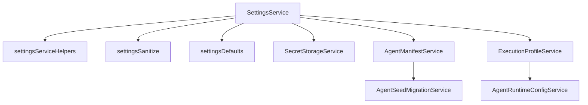
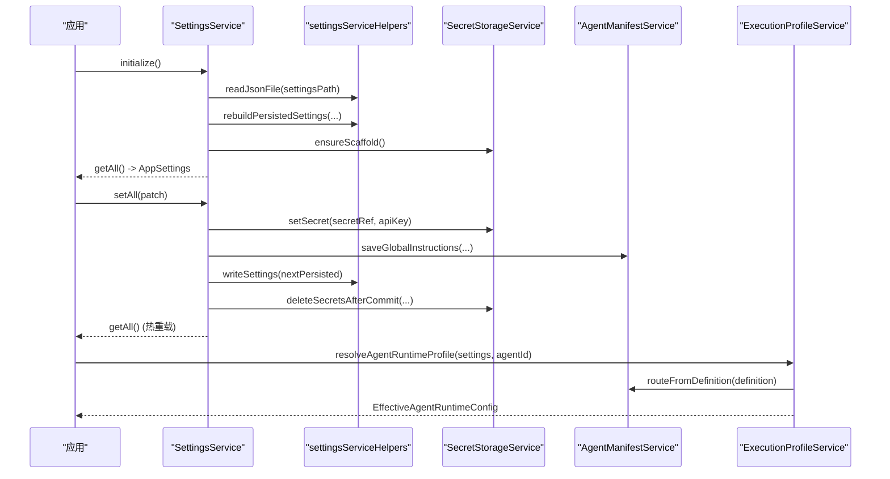
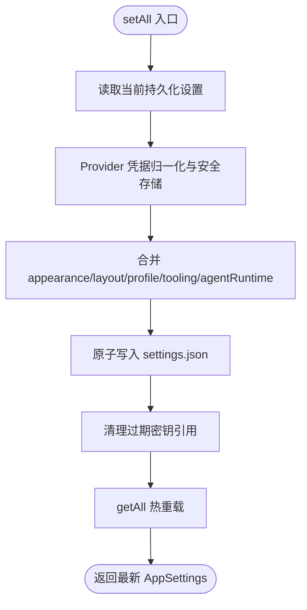
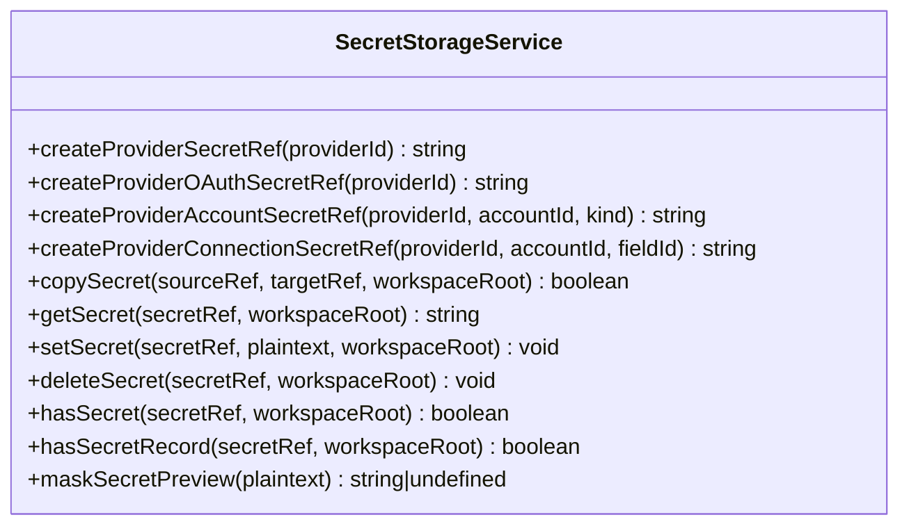
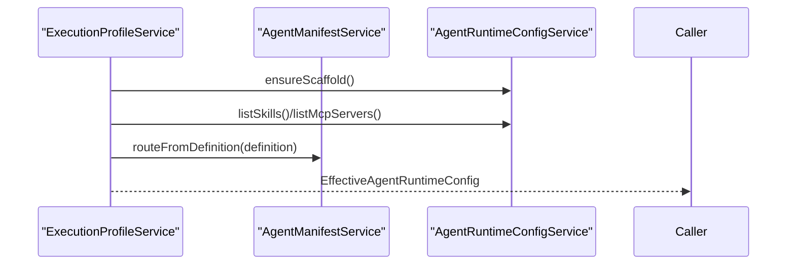
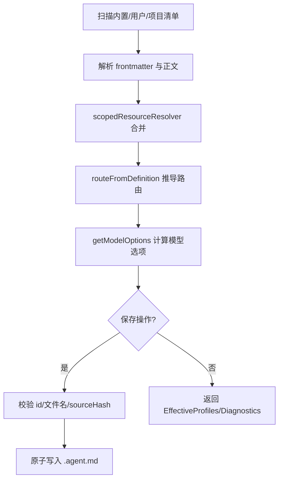
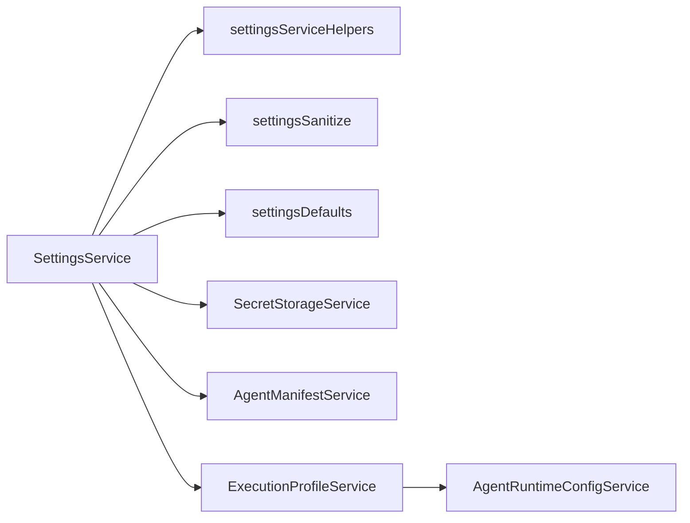

# 设置管理系统

<cite>
**本文引用的文件**
- [SettingsService.ts](file://src/main/settings/SettingsService.ts)
- [SecretStorageService.ts](file://src/main/settings/SecretStorageService.ts)
- [ExecutionProfileService.ts](file://src/main/settings/ExecutionProfileService.ts)
- [AgentManifestService.ts](file://src/main/settings/AgentManifestService.ts)
- [settingsDefaults.ts](file://src/main/settings/settingsDefaults.ts)
- [settingsServiceHelpers.ts](file://src/main/settings/settingsServiceHelpers.ts)
- [settingsSanitize.ts](file://src/main/settings/settingsSanitize.ts)
- [AgentRuntimeConfigService.ts](file://src/main/settings/AgentRuntimeConfigService.ts)
- [AgentSeedMigrationService.ts](file://src/main/settings/seed-migration/AgentSeedMigrationService.ts)
</cite>

## 目录
1. [简介](#简介)
2. [项目结构](#项目结构)
3. [核心组件](#核心组件)
4. [架构总览](#架构总览)
5. [详细组件分析](#详细组件分析)
6. [依赖关系分析](#依赖关系分析)
7. [性能考虑](#性能考虑)
8. [故障排查指南](#故障排查指南)
9. [结论](#结论)
10. [附录：设置参考与配置示例](#附录设置参考与配置示例)

## 简介
本文件系统性地梳理并文档化 RDC-Agent 的设置管理子系统，重点覆盖以下能力：
- SettingsService：应用设置的持久化、规范化、版本迁移、热重载与窗口布局快速写入。
- SecretStorageService：敏感信息（API Key、OAuth 等）的安全存储、读取、掩码预览与损坏恢复。
- ExecutionProfileService：基于 Agent 清单与提供者配置的运行时执行配置文件解析与诊断。
- AgentManifestService：Agent 清单的扫描、合并、路由推导、导入导出与冲突检测。
同时涵盖设置结构、默认值管理、版本迁移、热重载、验证规则、权限控制、备份恢复与冲突解决策略，并提供完整的设置参考与配置示例，帮助正确配置应用行为。

## 项目结构
设置相关代码集中在 src/main/settings 目录下，围绕“设置读写”、“安全存储”、“清单处理”、“执行配置”四大职责划分清晰：
- 设置读写与规范化：SettingsService、settingsServiceHelpers、settingsSanitize、settingsDefaults
- 安全存储：SecretStorageService
- 执行配置：ExecutionProfileService、AgentRuntimeConfigService
- 清单处理：AgentManifestService、AgentSeedMigrationService

图表来源
- [SettingsService.ts:94-114](file://src/main/settings/SettingsService.ts#L94-L114)
- [settingsServiceHelpers.ts:176-408](file://src/main/settings/settingsServiceHelpers.ts#L176-L408)
- [settingsSanitize.ts:1-278](file://src/main/settings/settingsSanitize.ts#L1-L278)
- [settingsDefaults.ts:33-193](file://src/main/settings/settingsDefaults.ts#L33-L193)
- [SecretStorageService.ts:72-262](file://src/main/settings/SecretStorageService.ts#L72-L262)
- [ExecutionProfileService.ts:11-69](file://src/main/settings/ExecutionProfileService.ts#L11-L69)
- [AgentRuntimeConfigService.ts:61-237](file://src/main/settings/AgentRuntimeConfigService.ts#L61-L237)
- [AgentManifestService.ts:177-667](file://src/main/settings/AgentManifestService.ts#L177-L667)
- [AgentSeedMigrationService.ts:137-788](file://src/main/settings/seed-migration/AgentSeedMigrationService.ts#L137-L788)

章节来源
- [SettingsService.ts:94-114](file://src/main/settings/SettingsService.ts#L94-L114)
- [settingsServiceHelpers.ts:176-408](file://src/main/settings/settingsServiceHelpers.ts#L176-L408)
- [settingsSanitize.ts:1-278](file://src/main/settings/settingsSanitize.ts#L1-L278)
- [settingsDefaults.ts:33-193](file://src/main/settings/settingsDefaults.ts#L33-L193)
- [SecretStorageService.ts:72-262](file://src/main/settings/SecretStorageService.ts#L72-L262)
- [ExecutionProfileService.ts:11-69](file://src/main/settings/ExecutionProfileService.ts#L11-L69)
- [AgentRuntimeConfigService.ts:61-237](file://src/main/settings/AgentRuntimeConfigService.ts#L61-L237)
- [AgentManifestService.ts:177-667](file://src/main/settings/AgentManifestService.ts#L177-L667)
- [AgentSeedMigrationService.ts:137-788](file://src/main/settings/seed-migration/AgentSeedMigrationService.ts#L137-L788)

## 核心组件
- SettingsService：负责初始化、读取、写入、合并与热重载应用设置；提供 Provider 凭据存取、窗口布局快速持久化、Agent 定义保存与 Provider 定义保存等能力。
- SecretStorageService：使用 Electron safeStorage 加密存储敏感信息，支持创建引用、读取、写入、删除、复制、掩码预览，以及损坏文件的隔离与恢复。
- ExecutionProfileService：根据当前设置与 Agent 清单生成执行配置文件，包含系统提示、模型选择、工具白名单、技能与 MCP 服务器列表，并提供诊断。
- AgentManifestService：扫描内置、用户与项目范围的 Agent 清单，解析、校验、合并、路由推导、导入导出，并处理历史保留 ID 与冲突。

章节来源
- [SettingsService.ts:94-518](file://src/main/settings/SettingsService.ts#L94-L518)
- [SecretStorageService.ts:72-262](file://src/main/settings/SecretStorageService.ts#L72-L262)
- [ExecutionProfileService.ts:11-69](file://src/main/settings/ExecutionProfileService.ts#L11-L69)
- [AgentManifestService.ts:177-667](file://src/main/settings/AgentManifestService.ts#L177-L667)

## 架构总览
设置管理的整体流程如下：
- 启动时初始化路径与资源脚手架，读取并重建持久化设置，进行版本迁移与清理。
- 读取设置后，规范化为运行时设置，注入 Provider 凭据、Agent 路由与资源目录。
- 写设置时，对 Provider 凭据进行安全存储，更新清单路由，并清理过期密钥。
- 敏感信息通过 SecretStorageService 以 safeStorage 加密存储，支持掩码预览与损坏恢复。
- 执行配置由 ExecutionProfileService 基于 Agent 清单与 Provider 状态计算，提供诊断。
- Agent 清单由 AgentManifestService 扫描、解析、合并、路由推导，并支持导入与冲突检测。

图表来源
- [SettingsService.ts:103-114](file://src/main/settings/SettingsService.ts#L103-L114)
- [SettingsService.ts:249-383](file://src/main/settings/SettingsService.ts#L249-L383)
- [settingsServiceHelpers.ts:176-408](file://src/main/settings/settingsServiceHelpers.ts#L176-L408)
- [SecretStorageService.ts:206-227](file://src/main/settings/SecretStorageService.ts#L206-L227)
- [AgentManifestService.ts:277-282](file://src/main/settings/AgentManifestService.ts#L277-L282)
- [ExecutionProfileService.ts:25-42](file://src/main/settings/ExecutionProfileService.ts#L25-L42)

## 详细组件分析

### SettingsService：设置存储、验证与热重载
- 初始化与版本检查：
  - 初始化运行时路径，确保资源脚手架存在。
  - 读取持久化设置，断言 schemaVersion 不超过当前支持版本。
  - 重建设置（rebuild），清理废弃字段与重复项，写回新设置并清理旧密钥。
- 读取与归一化：
  - 从磁盘读取持久化设置，若不存在则创建默认设置。
  - 将持久化设置转换为运行时设置，注入 Provider 凭据、Agent 路由与资源目录。
- 写入与合并：
  - 支持窗口布局的快速同步/异步写入，仅更新 layout.window，避免全量 Provider 归一化开销。
  - 全量写入时合并 appearance、layout、profile、tooling、agentRuntime、llm.providers，并对 Provider API Key 进行安全存储与旧密钥清理。
  - 当 shell.executable 变更时，清空 ShellResolver 缓存以确保生效。
- 热重载：
  - setAll 完成后调用 getAll，返回最新运行时设置，实现热重载效果。
- 权限与上下文：
  - 提供 sanitizeAgentPermissionSettings 与 sanitizeAgentRuntimeContextSettings 对权限模式、可读写根目录、命令前缀黑名单/白名单、上下文压缩阈值等进行严格校验与默认值填充。

图表来源
- [SettingsService.ts:249-383](file://src/main/settings/SettingsService.ts#L249-L383)
- [settingsServiceHelpers.ts:327-349](file://src/main/settings/settingsServiceHelpers.ts#L327-L349)
- [settingsSanitize.ts:183-216](file://src/main/settings/settingsSanitize.ts#L183-L216)

章节来源
- [SettingsService.ts:103-114](file://src/main/settings/SettingsService.ts#L103-L114)
- [SettingsService.ts:132-139](file://src/main/settings/SettingsService.ts#L132-L139)
- [SettingsService.ts:212-247](file://src/main/settings/SettingsService.ts#L212-L247)
- [SettingsService.ts:249-383](file://src/main/settings/SettingsService.ts#L249-L383)
- [settingsServiceHelpers.ts:112-126](file://src/main/settings/settingsServiceHelpers.ts#L112-L126)
- [settingsServiceHelpers.ts:176-408](file://src/main/settings/settingsServiceHelpers.ts#L176-L408)
- [settingsSanitize.ts:183-216](file://src/main/settings/settingsSanitize.ts#L183-L216)

### SecretStorageService：敏感信息保护
- 存储格式与位置：
  - 在 secretsPath 下维护 provider-secrets.json，记录每个 secretRef 的编码方式、base64 密文与更新时间。
- 安全机制：
  - 使用 Electron safeStorage 加密/解密字符串，不可用时抛出 SecretStorageUnavailableError。
  - 写入采用临时文件 + 原子重命名，确保幂等与一致性；写入后设置文件权限（POSIX 与 Windows ACL）。
- 错误恢复：
  - 读取 JSON 失败或类型不符时，将文件隔离到 .corrupt-{timestamp} 并抛出 SecretStoreCorruptError，附带 quarantinePath。
- 接口能力：
  - 创建各类 secretRef（provider api-key、oauth、account、connection field）。
  - 读取、写入、删除、判断是否存在、复制、掩码预览（显示末尾若干字符）。

图表来源
- [SecretStorageService.ts:72-262](file://src/main/settings/SecretStorageService.ts#L72-L262)

章节来源
- [SecretStorageService.ts:72-262](file://src/main/settings/SecretStorageService.ts#L72-L262)

### ExecutionProfileService：执行配置文件管理
- 功能要点：
  - 确保 Agent 运行时脚手架存在。
  - 标准化资源目录（可用技能、MCP 服务器）。
  - 根据 Agent 角色与清单推导执行配置：系统提示、Provider/Model、温度、工具白名单、技能与 MCP 服务器。
  - 诊断：若无已配置的 Provider，返回警告诊断。
- 路由解析：
  - 从 Agent 清单中获取 compiledRoute，校验 Provider 是否启用、已连接且状态为 verified，再解析有效模型。

图表来源
- [ExecutionProfileService.ts:11-69](file://src/main/settings/ExecutionProfileService.ts#L11-L69)
- [AgentManifestService.ts:405-410](file://src/main/settings/AgentManifestService.ts#L405-L410)
- [AgentRuntimeConfigService.ts:61-237](file://src/main/settings/AgentRuntimeConfigService.ts#L61-L237)

章节来源
- [ExecutionProfileService.ts:11-69](file://src/main/settings/ExecutionProfileService.ts#L11-L69)

### AgentManifestService：Agent 清单处理
- 清单扫描与合并：
  - 扫描内置、用户与项目范围清单（.agent.md），解析 frontmatter 与正文，构建候选集合。
  - 使用 scopedResourceResolver 合并优先级，处理历史保留 ID 与无效清单的诊断。
- 路由推导与模型选项：
  - 从 definition.models 推导 LlmAgentRoute，结合 Provider 与 Catalog 计算模型选项与可用性状态。
- 保存与冲突检测：
  - 保存用户或项目范围清单，校验文件名与 id 一致，禁止直接修改内置清单（需 CoW）。
  - 支持 sourceHash 冲突检测，防止并发编辑导致覆盖。
- 导入与全局指令：
  - 支持导入 .agent.md 文件为用户清单；读写全局指令文件。

图表来源
- [AgentManifestService.ts:177-667](file://src/main/settings/AgentManifestService.ts#L177-L667)

章节来源
- [AgentManifestService.ts:177-667](file://src/main/settings/AgentManifestService.ts#L177-L667)

### 版本迁移与默认值管理
- 版本迁移：
  - assertPersistedSettingsSchemaVersion 检查 schemaVersion 不超过当前支持版本，否则抛出 StorageSchemaError。
  - rebuildPersistedSettings 负责清理废弃字段、去重 Provider、重置主题预设、移除 embedding 选择等迁移逻辑。
- 默认值：
  - settingsDefaults 定义所有默认值（外观、布局、工具、代理运行时权限与上下文等）。
  - normalizePersistedSettings 与 toRuntimeSettings 将持久化设置归一化为运行时设置，缺失字段回填默认值。

章节来源
- [settingsServiceHelpers.ts:112-126](file://src/main/settings/settingsServiceHelpers.ts#L112-L126)
- [settingsServiceHelpers.ts:176-408](file://src/main/settings/settingsServiceHelpers.ts#L176-L408)
- [settingsDefaults.ts:33-193](file://src/main/settings/settingsDefaults.ts#L33-L193)

### 备份恢复与冲突解决策略
- 备份恢复：
  - 设置文件写入采用临时文件 + 原子重命名，降低损坏风险。
  - 秘密文件写入同样采用临时文件 + fsync + 原子重命名，并在失败时尝试清理临时文件。
  - 秘密文件损坏时隔离到 .corrupt-{timestamp}，便于后续恢复。
- 冲突解决：
  - Agent 清单保存支持 sourceHash 冲突检测，避免并发编辑覆盖。
  - 种子清单迁移服务使用目录锁与隔离目录，保证迁移过程安全可恢复。

章节来源
- [settingsServiceHelpers.ts:327-349](file://src/main/settings/settingsServiceHelpers.ts#L327-L349)
- [SecretStorageService.ts:107-144](file://src/main/settings/SecretStorageService.ts#L107-L144)
- [AgentManifestService.ts:284-362](file://src/main/settings/AgentManifestService.ts#L284-L362)
- [AgentSeedMigrationService.ts:143-154](file://src/main/settings/seed-migration/AgentSeedMigrationService.ts#L143-L154)

## 依赖关系分析
- SettingsService 依赖：
  - settingsServiceHelpers：读取/写入/重建/归一化设置。
  - settingsSanitize：字段级校验与默认值填充。
  - settingsDefaults：默认值与常量。
  - SecretStorageService：凭据安全存储。
  - AgentManifestService：Agent 清单与路由。
  - ExecutionProfileService：执行配置与诊断。
  - AgentRuntimeConfigService：技能与 MCP 服务器发现。
- 耦合与内聚：
  - 各模块职责清晰，SettingsService 作为协调者，其他模块专注各自领域，内聚性高、耦合度低。
- 外部依赖：
  - Electron safeStorage 用于敏感信息加密。
  - Node.js fs/promises 用于文件操作。
  - YAML 解析用于技能描述。

图表来源
- [SettingsService.ts:94-518](file://src/main/settings/SettingsService.ts#L94-L518)
- [settingsServiceHelpers.ts:176-408](file://src/main/settings/settingsServiceHelpers.ts#L176-L408)
- [settingsSanitize.ts:1-278](file://src/main/settings/settingsSanitize.ts#L1-L278)
- [settingsDefaults.ts:33-193](file://src/main/settings/settingsDefaults.ts#L33-L193)
- [SecretStorageService.ts:72-262](file://src/main/settings/SecretStorageService.ts#L72-L262)
- [ExecutionProfileService.ts:11-69](file://src/main/settings/ExecutionProfileService.ts#L11-L69)
- [AgentRuntimeConfigService.ts:61-237](file://src/main/settings/AgentRuntimeConfigService.ts#L61-L237)
- [AgentManifestService.ts:177-667](file://src/main/settings/AgentManifestService.ts#L177-L667)

章节来源
- [SettingsService.ts:94-518](file://src/main/settings/SettingsService.ts#L94-L518)
- [settingsServiceHelpers.ts:176-408](file://src/main/settings/settingsServiceHelpers.ts#L176-L408)
- [settingsSanitize.ts:1-278](file://src/main/settings/settingsSanitize.ts#L1-L278)
- [settingsDefaults.ts:33-193](file://src/main/settings/settingsDefaults.ts#L33-L193)
- [SecretStorageService.ts:72-262](file://src/main/settings/SecretStorageService.ts#L72-L262)
- [ExecutionProfileService.ts:11-69](file://src/main/settings/ExecutionProfileService.ts#L11-L69)
- [AgentRuntimeConfigService.ts:61-237](file://src/main/settings/AgentRuntimeConfigService.ts#L61-L237)
- [AgentManifestService.ts:177-667](file://src/main/settings/AgentManifestService.ts#L177-L667)

## 性能考虑
- 窗口布局快速写入：persistWindowLayout/persistWindowLayoutAsync 仅更新 layout.window，跳过 Provider 归一化与密钥水合，减少 IO 与 CPU 开销。
- 原子写入与 fsync：设置与秘密文件均采用临时文件 + 原子重命名，必要时 fsync，提升可靠性。
- 缓存清理：shell.executable 变更时清空 ShellResolver 缓存，避免不一致导致的额外重试。
- 批量归一化：normalizeUserProviders 与 hydrateProviderSecrets 集中处理 Provider 凭据，减少重复计算。

[本节为通用性能建议，不直接分析具体文件]

## 故障排查指南
- 无法解密或安全存储不可用：
  - 现象：读取/写入秘密时报错或返回空值。
  - 原因：Electron safeStorage 不可用或密钥文件损坏。
  - 处理：确认运行环境支持 safeStorage；检查 provider-secrets.json 是否被隔离到 .corrupt-{timestamp}，必要时恢复或删除。
- 设置文件损坏或不兼容：
  - 现象：读取设置失败或 schemaVersion 过高。
  - 原因：JSON 解析失败或版本不支持。
  - 处理：查看日志中的 StorageSchemaError；等待升级或回退版本；重建设置（rebuild）会清理废弃字段。
- 并发编辑冲突：
  - 现象：保存 Agent 清单时报源哈希冲突。
  - 原因：编辑器加载后的清单已被他人修改。
  - 处理：重新加载清单后再保存；确保 sourceHash 匹配。
- 无可用 Provider：
  - 现象：执行配置诊断提示缺少已配置 Provider。
  - 处理：在设置中添加并验证 Provider；确保 enabled、isConfigured、status=verified。

章节来源
- [SecretStorageService.ts:38-42](file://src/main/settings/SecretStorageService.ts#L38-L42)
- [SecretStorageService.ts:77-85](file://src/main/settings/SecretStorageService.ts#L77-L85)
- [settingsServiceHelpers.ts:112-126](file://src/main/settings/settingsServiceHelpers.ts#L112-L126)
- [AgentManifestService.ts:284-362](file://src/main/settings/AgentManifestService.ts#L284-L362)
- [ExecutionProfileService.ts:44-52](file://src/main/settings/ExecutionProfileService.ts#L44-L52)

## 结论
设置管理系统通过清晰的职责划分与严格的验证、迁移、安全存储与冲突解决机制，提供了稳定可靠的设置管理能力。SettingsService 作为协调中心，整合了 Provider 凭据、Agent 清单与执行配置，确保应用行为的一致性与可配置性。SecretStorageService 保障敏感信息安全，ExecutionProfileService 提供执行时的动态配置与诊断，AgentManifestService 支持灵活的 Agent 清单管理与冲突检测。整体架构具备良好的扩展性与可维护性。

[本节为总结性内容，不直接分析具体文件]

## 附录：设置参考与配置示例
- 设置结构（持久化负载）：
  - schemaVersion：数字，表示设置版本。
  - appearance：UI 偏好（主题、颜色等）。
  - layout：界面布局（左侧边栏、右侧面板、终端高度、窗口尺寸与位置）。
  - profile：用户资料（昵称、头像路径）。
  - tooling：工具配置（RdxCliInvoker、RdxActions、CodeInterpreter、Shell）。
  - agentRuntime：代理运行时权限与上下文（权限模式、可读写根、命令前缀黑白名单、上下文压缩阈值）。
  - llm.providers：LLM 提供者列表（id、label、协议、baseUrl、authMode、models、modelPreferences、connectionValues、secretRef 等）。
- 默认值管理：
  - 所有字段均有默认值，缺失时自动回填；布局宽度、终端高度等受最小/最大值约束。
- 版本迁移：
  - 启动时检查 schemaVersion，超过支持版本将报错；rebuild 会清理废弃字段、去重 Provider、重置主题预设。
- 热重载：
  - setAll 完成后调用 getAll，返回最新运行时设置，实现即时生效。
- 验证规则：
  - 权限模式限定为 default/auto-review/full-access/custom。
  - 路径展开与去重，命令前缀黑白名单过滤。
  - 超时时间限制在合理范围。
- 权限控制：
  - 代理运行时权限模式与可读写根、命令前缀黑白名单控制执行边界。
- 备份恢复：
  - 设置与秘密文件采用原子写入；秘密文件损坏时隔离并记录 quarantinePath。
- 冲突解决：
  - Agent 清单保存支持 sourceHash 冲突检测；种子清单迁移使用目录锁与隔离目录。

章节来源
- [settingsDefaults.ts:33-193](file://src/main/settings/settingsDefaults.ts#L33-L193)
- [settingsServiceHelpers.ts:176-408](file://src/main/settings/settingsServiceHelpers.ts#L176-L408)
- [settingsSanitize.ts:1-278](file://src/main/settings/settingsSanitize.ts#L1-L278)
- [SecretStorageService.ts:72-262](file://src/main/settings/SecretStorageService.ts#L72-L262)
- [AgentManifestService.ts:284-362](file://src/main/settings/AgentManifestService.ts#L284-L362)
- [AgentSeedMigrationService.ts:143-154](file://src/main/settings/seed-migration/AgentSeedMigrationService.ts#L143-L154)