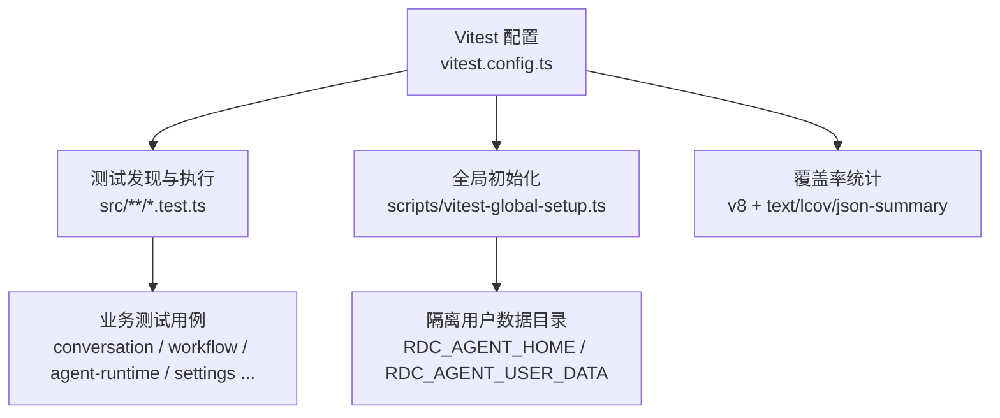
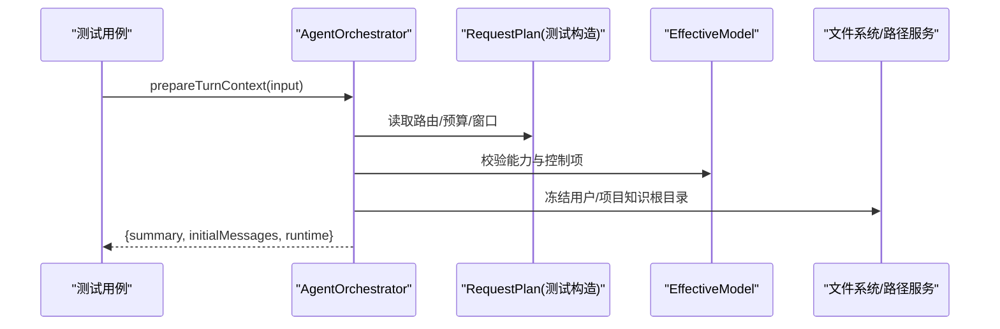
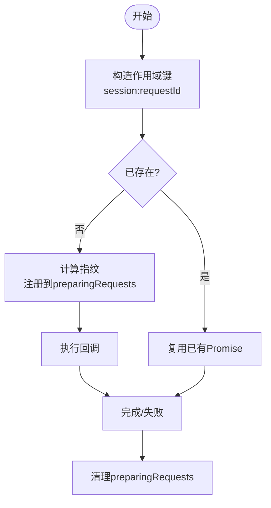
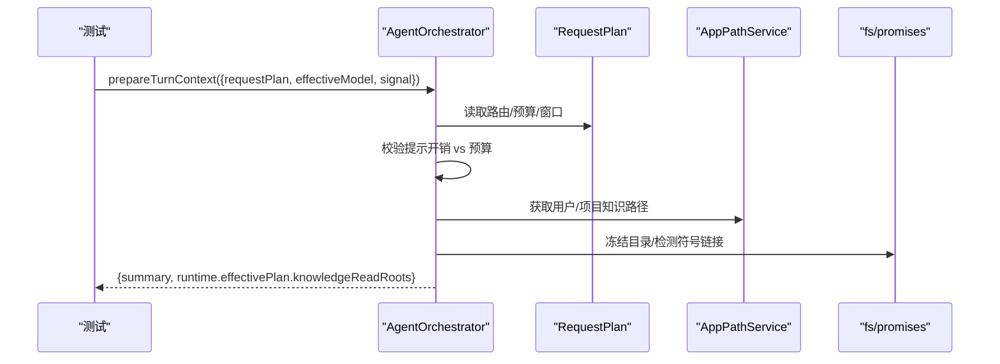
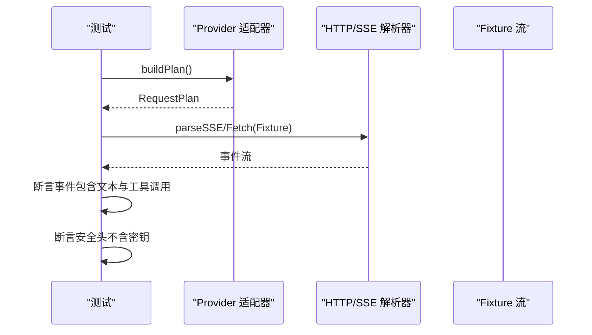
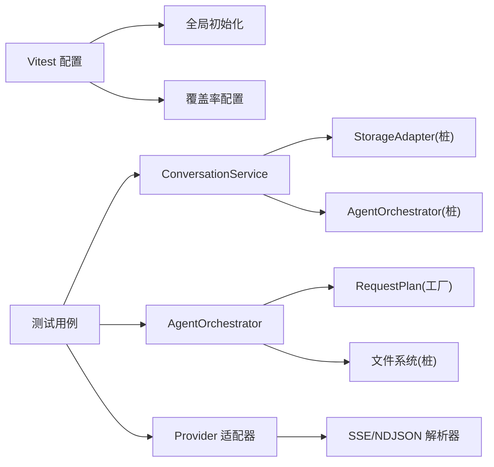

# 单元测试

<cite>
**本文引用的文件**
- [vitest.config.ts](file://vitest.config.ts)
- [package.json](file://package.json)
- [scripts/vitest-global-setup.ts](file://scripts/vitest-global-setup.ts)
- [src/main/conversation/ConversationService.idempotency.test.ts](file://src/main/conversation/ConversationService.idempotency.test.ts)
- [src/main/workflow/debugger/AgentOrchestrator.preparedTurn.test.ts](file://src/main/workflow/debugger/AgentOrchestrator.preparedTurn.test.ts)
- [src/main/testing/createTestRequestPlan.ts](file://src/main/testing/createTestRequestPlan.ts)
- [src/main/testing/contracts/providerWireFixture.test.ts](file://src/main/testing/contracts/providerWireFixture.test.ts)
- [src/main/captures/ReplayDeviceService.watch.test.ts](file://src/main/captures/ReplayDeviceService.watch.test.ts)
- [src/main/agent-runtime/tools/ToolSearch.test.ts](file://src/main/agent-runtime/tools/ToolSearch.test.ts)
- [src/main/agent-runtime/prompt/RequestEnvelopeBuilder.test.ts](file://src/main/agent-runtime/prompt/RequestEnvelopeBuilder.test.ts)
- [src/main/agent-runtime/prompt/RequestSnapshotStore.test.ts](file://src/main/agent-runtime/prompt/RequestSnapshotStore.test.ts)
</cite>

## 目录
1. [简介](#简介)
2. [项目结构](#项目结构)
3. [核心组件](#核心组件)
4. [架构总览](#架构总览)
5. [详细组件分析](#详细组件分析)
6. [依赖分析](#依赖分析)
7. [性能考虑](#性能考虑)
8. [故障排查指南](#故障排查指南)
9. [结论](#结论)
10. [附录](#附录)

## 简介
本文件面向 RDC-Agent 的单元测试实践，基于 Vitest 框架，系统说明测试组织方式、模拟对象创建、异步与定时器处理、覆盖率要求、测试数据准备与断言最佳实践。重点覆盖 AgentOrchestrator、ConversationService、Provider 系统等关键组件的测试策略，并提供可直接复用的测试模式与常见问题解决方案。

## 项目结构
RDC-Agent 使用 Vitest 在 Node 环境下运行单元测试，测试文件统一以 .test.ts 命名并与源码同目录或就近放置，便于按模块维护。Vitest 配置限定测试范围、全局初始化、覆盖率统计范围与阈值，并通过全局设置隔离用户数据路径，避免污染真实环境。

图表来源
- [vitest.config.ts:5-72](file://vitest.config.ts#L5-L72)
- [scripts/vitest-global-setup.ts:9-19](file://scripts/vitest-global-setup.ts#L9-L19)

章节来源
- [vitest.config.ts:5-72](file://vitest.config.ts#L5-L72)
- [package.json:74-76](file://package.json#L74-L76)
- [scripts/vitest-global-setup.ts:9-19](file://scripts/vitest-global-setup.ts#L9-L19)

## 核心组件
- 测试基础设施
  - 全局隔离：通过全局设置将应用数据目录指向临时目录，确保每次测试独立且可清理。
  - 覆盖率：仅对 main 与 shared 代码进行统计，排除 Electron 入口、IPC 处理器、worker 线程等不适合单元测的部分，并设置最低阈值。
- 关键被测组件
  - ConversationService：会话级幂等性、后台延续、取消与指纹冲突检测。
  - AgentOrchestrator：回合上下文准备、提示预算校验、知识根目录冻结、取消前置短路。
  - Provider 系统：请求计划构建、安全头脱敏、SSE/NDJSON 流解析、适配器适配。
- 测试工具
  - createTestRequestPlan：构造最小可用 RequestPlan，填充默认契约、状态计划、缓存与流式计划等。
  - 合同测试套件：针对 Provider 线协议、安全、并发、存储故障注入等进行矩阵化验证。

章节来源
- [scripts/vitest-global-setup.ts:9-19](file://scripts/vitest-global-setup.ts#L9-L19)
- [vitest.config.ts:12-71](file://vitest.config.ts#L12-L71)
- [src/main/testing/createTestRequestPlan.ts:20-91](file://src/main/testing/createTestRequestPlan.ts#L20-L91)

## 架构总览
下图展示一次“准备回合上下文”的典型调用链：测试构造请求计划与有效模型，调用 Orchestrator 的 prepareTurnContext，内部完成提示预算检查、知识根目录冻结、权限与诊断收集，最终返回摘要与运行时上下文。

图表来源
- [src/main/workflow/debugger/AgentOrchestrator.preparedTurn.test.ts:174-212](file://src/main/workflow/debugger/AgentOrchestrator.preparedTurn.test.ts#L174-L212)
- [src/main/testing/createTestRequestPlan.ts:20-91](file://src/main/testing/createTestRequestPlan.ts#L20-L91)

## 详细组件分析

### ConversationService 幂等性与取消
- 目标
  - 验证同一会话内相同 requestId 的去重与共享 Promise。
  - 不同会话即使 requestId 相同也不共享。
  - 指纹冲突时拒绝重复请求。
  - 准备阶段支持取消（AbortSignal）并在取消后清理。
- 测试要点
  - 使用 vi.mock 隔离 StorageAdapter、AgentOrchestrator、TraceService 等外部依赖。
  - 通过 setImmediate 等待微任务与副作用稳定后再断言。
  - 断言 sendRequests、sendRequestFingerprints、preparingRequests 等内部映射的状态变化。
  - 断言错误消息包含特定标识（如 REQUEST_ID_CONFLICT）。
- 典型流程

图表来源
- [src/main/conversation/ConversationService.idempotency.test.ts:53-180](file://src/main/conversation/ConversationService.idempotency.test.ts#L53-L180)
- [src/main/conversation/ConversationService.idempotency.test.ts:182-223](file://src/main/conversation/ConversationService.idempotency.test.ts#L182-L223)

章节来源
- [src/main/conversation/ConversationService.idempotency.test.ts:53-223](file://src/main/conversation/ConversationService.idempotency.test.ts#L53-L223)

### AgentOrchestrator 回合上下文准备
- 目标
  - 冻结有效路由，保持 provider 上下文窗口与提示预算分离。
  - 在固定提示开销超过预算时提前失败。
  - 支持信号取消，且在启动任何耗时准备前立即响应。
  - 冻结用户与项目知识目录，排除符号链接/连接点并记录诊断。
- 测试要点
  - 通过 Proxy 替换 AppPathService 的知识路径，构造真实目录与符号链接场景。
  - 使用 createTestRequestPlan 构造最小请求计划，注入敏感头用于脱敏断言。
  - 断言 summary 中的路由、预算、缓存开关、breakdown 等字段。
  - 断言异常类型与错误前缀（如 PROMPT_OVERHEAD_EXCEEDS_BUDGET、REQUEST_CANCELLED）。
- 典型流程

图表来源
- [src/main/workflow/debugger/AgentOrchestrator.preparedTurn.test.ts:174-283](file://src/main/workflow/debugger/AgentOrchestrator.preparedTurn.test.ts#L174-L283)
- [src/main/testing/createTestRequestPlan.ts:20-91](file://src/main/testing/createTestRequestPlan.ts#L20-L91)

章节来源
- [src/main/workflow/debugger/AgentOrchestrator.preparedTurn.test.ts:174-283](file://src/main/workflow/debugger/AgentOrchestrator.preparedTurn.test.ts#L174-L283)

### Provider 系统与线协议测试
- 目标
  - 验证各 Provider 适配器能正确构建 RequestPlan 与请求体。
  - 验证 SSE/NDJSON 流解析器能正确消费金样本流，提取文本与工具调用事件。
  - 验证请求头脱敏，确保不会泄露密钥或会话信息。
- 测试要点
  - 使用 createTestRequestPlan 构造标准化请求计划。
  - 通过 parseSSE/parseJsonLines 消费 fixture 流，断言事件数量与内容。
  - 使用 requestPlanHeaders 输出安全头，断言不包含敏感字段。
- 典型流程

图表来源
- [src/main/testing/contracts/providerWireFixture.test.ts:220-327](file://src/main/testing/contracts/providerWireFixture.test.ts#L220-L327)
- [src/main/testing/contracts/providerWireFixture.test.ts:626-653](file://src/main/testing/contracts/providerWireFixture.test.ts#L626-L653)
- [src/main/testing/contracts/providerWireFixture.test.ts:856-869](file://src/main/testing/contracts/providerWireFixture.test.ts#L856-L869)

章节来源
- [src/main/testing/contracts/providerWireFixture.test.ts:220-327](file://src/main/testing/contracts/providerWireFixture.test.ts#L220-L327)
- [src/main/testing/contracts/providerWireFixture.test.ts:626-653](file://src/main/testing/contracts/providerWireFixture.test.ts#L626-L653)
- [src/main/testing/contracts/providerWireFixture.test.ts:856-869](file://src/main/testing/contracts/providerWireFixture.test.ts#L856-L869)

### 工具搜索与纯函数测试
- 目标
  - 验证工具搜索的过滤、排序与分页逻辑。
- 测试要点
  - 构造最小化工具元数据，断言查询大小写不敏感匹配。
  - 断言名称命中优先于描述命中。
- 示例参考
  - 见 [src/main/agent-runtime/tools/ToolSearch.test.ts:40-58](file://src/main/agent-runtime/tools/ToolSearch.test.ts#L40-L58)

章节来源
- [src/main/agent-runtime/tools/ToolSearch.test.ts:40-58](file://src/main/agent-runtime/tools/ToolSearch.test.ts#L40-L58)

### 请求信封与快照存储
- 目标
  - 验证请求信封构建时对凭证、图片载荷、不透明推理内容的脱敏。
  - 验证请求快照持久化的读写与结构完整性。
- 测试要点
  - 构造包含敏感信息的 PromptPlan 与消息，断言构建结果中不再包含敏感片段。
  - 使用临时目录与 fs 操作验证快照写入与读取。
- 示例参考
  - 见 [src/main/agent-runtime/prompt/RequestEnvelopeBuilder.test.ts:6-33](file://src/main/agent-runtime/prompt/RequestEnvelopeBuilder.test.ts#L6-L33)
  - 见 [src/main/agent-runtime/prompt/RequestSnapshotStore.test.ts:1-37](file://src/main/agent-runtime/prompt/RequestSnapshotStore.test.ts#L1-L37)

章节来源
- [src/main/agent-runtime/prompt/RequestEnvelopeBuilder.test.ts:6-33](file://src/main/agent-runtime/prompt/RequestEnvelopeBuilder.test.ts#L6-L33)
- [src/main/agent-runtime/prompt/RequestSnapshotStore.test.ts:1-37](file://src/main/agent-runtime/prompt/RequestSnapshotStore.test.ts#L1-L37)

### 设备回放服务与定时器控制
- 目标
  - 验证 Watch 租约与轮询刷新行为。
- 测试要点
  - 使用 vi.useFakeTimers 控制时间推进，断言刷新次数与订阅释放。
  - 通过 vi.spyOn 与 vi.mock 替换 adb 客户端与日志服务。
- 示例参考
  - 见 [src/main/captures/ReplayDeviceService.watch.test.ts:49-59](file://src/main/captures/ReplayDeviceService.watch.test.ts#L49-L59)

章节来源
- [src/main/captures/ReplayDeviceService.watch.test.ts:49-59](file://src/main/captures/ReplayDeviceService.watch.test.ts#L49-L59)

## 依赖分析
- 测试与配置依赖
  - Vitest 作为测试运行器，v8 作为覆盖率提供者。
  - 全局初始化脚本隔离用户数据目录，避免跨测试污染。
- 被测模块依赖
  - AgentOrchestrator 依赖 AppPathService、文件系统、RequestPlan 与 EffectiveModel。
  - ConversationService 依赖 StorageAdapter、AgentOrchestrator、TraceService。
  - Provider 测试依赖 HTTP/SSE 解析器与适配器辅助方法。
- 耦合与解耦
  - 通过 vi.mock/vi.spyOn 将外部依赖替换为可控桩，降低耦合度。
  - 使用 createTestRequestPlan 统一构造请求计划，减少重复样板。

图表来源
- [vitest.config.ts:5-72](file://vitest.config.ts#L5-L72)
- [scripts/vitest-global-setup.ts:9-19](file://scripts/vitest-global-setup.ts#L9-L19)
- [src/main/testing/createTestRequestPlan.ts:20-91](file://src/main/testing/createTestRequestPlan.ts#L20-L91)

章节来源
- [vitest.config.ts:5-72](file://vitest.config.ts#L5-L72)
- [src/main/testing/createTestRequestPlan.ts:20-91](file://src/main/testing/createTestRequestPlan.ts#L20-L91)

## 性能考虑
- 使用内存态与桩替代真实 I/O，缩短单测执行时间。
- 通过 fake timers 精确控制异步与定时逻辑，避免真实延时。
- 限制覆盖率统计范围，聚焦核心逻辑，提升 CI 效率。
- 批量 fixture 驱动的多适配器测试，减少重复代码。

[本节为通用指导，无需引用具体文件]

## 故障排查指南
- 常见错误与定位
  - 幂等性冲突：当同一会话内相同 requestId 但不同指纹时，应抛出明确错误；检查指纹计算与去重键生成。
    - 参考断言位置：[src/main/conversation/ConversationService.idempotency.test.ts:138-180](file://src/main/conversation/ConversationService.idempotency.test.ts#L138-L180)
  - 提示预算不足：当固定提示开销超过预算时应快速失败；检查预算阈值与提示估算。
    - 参考断言位置：[src/main/workflow/debugger/AgentOrchestrator.preparedTurn.test.ts:214-224](file://src/main/workflow/debugger/AgentOrchestrator.preparedTurn.test.ts#L214-L224)
  - 取消未生效：准备阶段需监听 AbortSignal 并及时中断；检查信号注册与清理。
    - 参考断言位置：[src/main/conversation/ConversationService.idempotency.test.ts:182-223](file://src/main/conversation/ConversationService.idempotency.test.ts#L182-L223)
  - 敏感头泄露：请求头不应包含密钥或会话信息；检查 requestPlanHeaders 与适配器构建逻辑。
    - 参考断言位置：[src/main/testing/contracts/providerWireFixture.test.ts:856-869](file://src/main/testing/contracts/providerWireFixture.test.ts#L856-L869)
- 调试建议
  - 打印中间状态（如 sendRequests、preparingRequests、effectivePlan.knowledgeReadRoots）。
  - 使用临时目录与只读 fixture，避免破坏真实数据。
  - 逐步缩小范围：先验证 RequestPlan 构建，再验证流解析，最后端到端断言。

章节来源
- [src/main/conversation/ConversationService.idempotency.test.ts:138-223](file://src/main/conversation/ConversationService.idempotency.test.ts#L138-L223)
- [src/main/workflow/debugger/AgentOrchestrator.preparedTurn.test.ts:214-233](file://src/main/workflow/debugger/AgentOrchestrator.preparedTurn.test.ts#L214-L233)
- [src/main/testing/contracts/providerWireFixture.test.ts:856-869](file://src/main/testing/contracts/providerWireFixture.test.ts#L856-L869)

## 结论
RDC-Agent 的单元测试体系围绕 Vitest 构建，强调隔离、可重复与高覆盖率。通过对 ConversationService、AgentOrchestrator 与 Provider 系统的专项测试，覆盖了幂等性、取消、预算校验、知识根目录冻结、流解析与安全头等关键质量属性。借助统一的测试工具与 fixture，团队可以高效扩展新特性与回归旧问题。

[本节为总结性内容，无需引用具体文件]

## 附录

### 测试编写规范清单
- 文件组织
  - 测试文件与源码同名并以 .test.ts 结尾，放在对应模块目录下。
  - 复杂场景使用子 describe 分组，保证可读性。
- 模拟对象
  - 使用 vi.mock 替换外部依赖（StorageAdapter、AgentOrchestrator、fs、electron 等）。
  - 使用 vi.spyOn 捕获调用次数与参数，必要时恢复原始实现。
- 异步与定时器
  - 使用 await 与 Promise.resolve/setImmediate 等待微任务稳定。
  - 使用 vi.useFakeTimers 控制时间推进，并在 afterEach 恢复。
- 覆盖率要求
  - 行/函数/语句≥40%，分支≥30%；CI 通过 ratchet 机制仅允许上升。
  - 排除 Electron 入口、IPC 处理器、worker 线程等非单元测范围。
- 测试数据
  - 使用 createTestRequestPlan 构造最小可用请求计划。
  - 使用 fixtures 与临时目录，避免污染真实环境。
- 断言最佳实践
  - 断言关键状态（如 sendRequests、knowledgeReadRoots、headers）。
  - 断言错误消息包含特定标识，便于定位问题。
  - 对 JSON/流事件进行结构化断言，而非仅字符串匹配。

章节来源
- [vitest.config.ts:12-71](file://vitest.config.ts#L12-L71)
- [src/main/testing/createTestRequestPlan.ts:20-91](file://src/main/testing/createTestRequestPlan.ts#L20-L91)
- [src/main/conversation/ConversationService.idempotency.test.ts:53-223](file://src/main/conversation/ConversationService.idempotency.test.ts#L53-L223)
- [src/main/workflow/debugger/AgentOrchestrator.preparedTurn.test.ts:174-283](file://src/main/workflow/debugger/AgentOrchestrator.preparedTurn.test.ts#L174-L283)
- [src/main/testing/contracts/providerWireFixture.test.ts:626-653](file://src/main/testing/contracts/providerWireFixture.test.ts#L626-L653)
- [src/main/testing/contracts/providerWireFixture.test.ts:856-869](file://src/main/testing/contracts/providerWireFixture.test.ts#L856-L869)