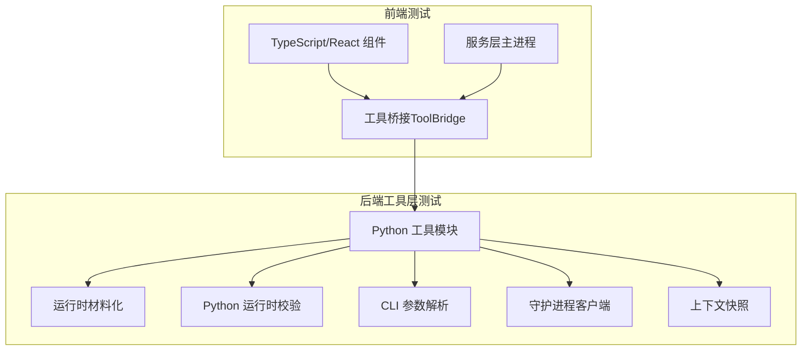
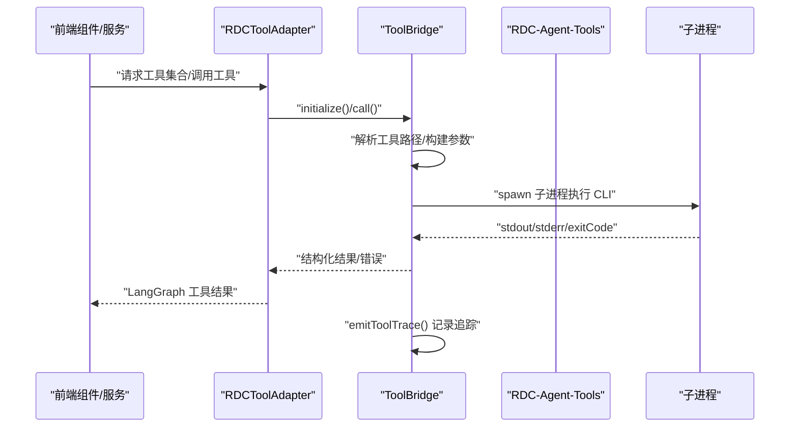
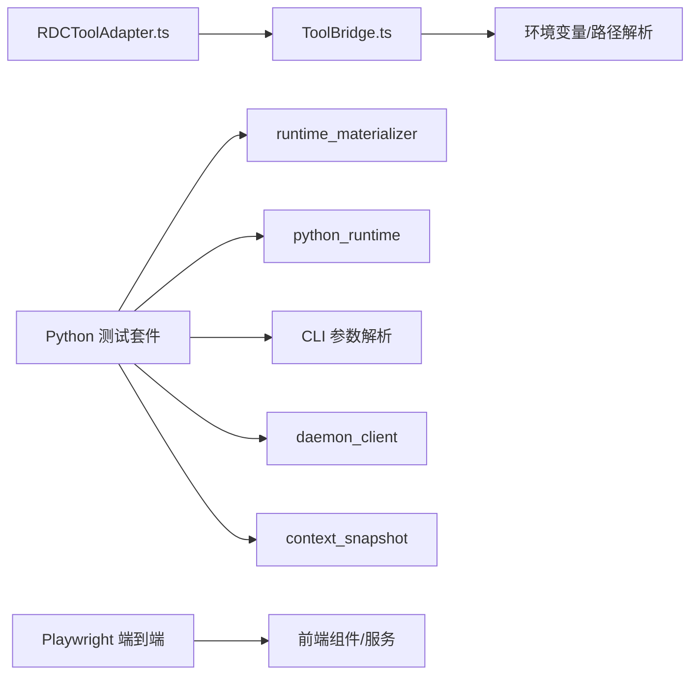

# 单元测试

<cite>
**本文引用的文件**
- [RDCToolAdapter.ts](file://src/main/tools/RDCToolAdapter.ts)
- [ToolBridge.ts](file://src/main/services/ToolBridge.ts)
- [conftest.py](file://resources/tools/tests/conftest.py)
- [test_runtime_materializer.py](file://resources/tools/tests/test_runtime_materializer.py)
- [test_python_runtime.py](file://resources/tools/tests/test_python_runtime.py)
- [test_cli_call_args.py](file://resources/tools/tests/test_cli_call_args.py)
- [test_daemon_client.py](file://resources/tools/tests/test_daemon_client.py)
- [test_context_snapshot.py](file://resources/tools/tests/test_context_snapshot.py)
- [package.json](file://package.json)
</cite>

## 目录
1. [简介](#简介)
2. [项目结构](#项目结构)
3. [核心组件](#核心组件)
4. [架构总览](#架构总览)
5. [组件详解](#组件详解)
6. [依赖关系分析](#依赖关系分析)
7. [性能考量](#性能考量)
8. [故障排查指南](#故障排查指南)
9. [结论](#结论)
10. [附录](#附录)

## 简介
本文件面向 RDC-Agent 的测试体系，系统性梳理并输出单元测试文档，覆盖以下范围：
- Python 工具测试：工具适配器测试、运行时材料化测试、CLI 工具测试、守护进程客户端测试、上下文快照测试
- TypeScript 组件测试组织：React 组件测试、服务层测试、工具桥接测试
- 测试用例编写规范：测试数据准备、模拟对象使用、断言策略
- 测试覆盖率要求：代码覆盖率目标、关键路径测试、边界条件验证
- 最佳实践：测试命名约定、组织结构、维护策略
- 调试技巧、性能测试方法、测试环境配置

## 项目结构
RDC-Agent 的测试主要分为两部分：
- 前端（Electron 主进程 + 渲染进程）：TypeScript/React 测试由 Vite/Electron-Vite 配置管理，Playwright 负责端到端测试
- 后端工具层（Python）：位于 resources/tools 下，使用 pytest 进行单元测试，包含运行时材料化、Python 运行时校验、CLI 参数解析、守护进程客户端、上下文快照等模块

图表来源
- [ToolBridge.ts:25-638](file://src/main/services/ToolBridge.ts#L25-L638)
- [RDCToolAdapter.ts:20-201](file://src/main/tools/RDCToolAdapter.ts#L20-L201)
- [conftest.py:10-44](file://resources/tools/tests/conftest.py#L10-L44)

章节来源
- [package.json:1-76](file://package.json#L1-L76)

## 核心组件
本节聚焦与测试直接相关的核心组件及其职责：
- 工具适配器（RDCToolAdapter）：将工具目录中的工具定义转换为 LangGraph 兼容的结构化工具，并按角色/分组进行筛选
- 工具桥接（ToolBridge）：负责与 RDC-Agent-Tools 的 CLI/MCP 接口通信，执行子进程、解析输出、生成追踪记录
- Python 工具测试套件：围绕运行时材料化、Python 布局校验、CLI 参数解析、守护进程状态管理、上下文快照进行单元测试

章节来源
- [RDCToolAdapter.ts:20-201](file://src/main/tools/RDCToolAdapter.ts#L20-L201)
- [ToolBridge.ts:25-638](file://src/main/services/ToolBridge.ts#L25-L638)

## 架构总览
下图展示前端工具桥接与后端工具层之间的交互流程，以及测试如何覆盖关键路径。

图表来源
- [RDCToolAdapter.ts:28-50](file://src/main/tools/RDCToolAdapter.ts#L28-L50)
- [ToolBridge.ts:198-365](file://src/main/services/ToolBridge.ts#L198-L365)

## 组件详解

### 工具适配器测试（RDCToolAdapter）
- 目标：验证工具目录加载、Schema 构建、LangGraph 工具转换、按角色/分组/命名空间筛选、调用转发
- 关键测试点
  - 初始化：从 ToolBridge 加载目录，构建工具映射
  - Schema 构建：根据参数类型映射到 zod 类型，处理可选字段
  - 工具调用：将调用委托给 ToolBridge，并正确处理成功/失败响应
  - 过滤能力：按组、命名空间、角色筛选工具集合
- 断言策略
  - 工具数量与目录一致
  - 工具元数据包含 layer、originalName、namespace、group
  - 调用返回值包含 data 或标准化错误对象
  - 角色筛选返回预期工具组集合

章节来源
- [RDCToolAdapter.ts:28-50](file://src/main/tools/RDCToolAdapter.ts#L28-L50)
- [RDCToolAdapter.ts:55-81](file://src/main/tools/RDCToolAdapter.ts#L55-L81)
- [RDCToolAdapter.ts:86-124](file://src/main/tools/RDCToolAdapter.ts#L86-L124)
- [RDCToolAdapter.ts:129-134](file://src/main/tools/RDCToolAdapter.ts#L129-L134)
- [RDCToolAdapter.ts:146-159](file://src/main/tools/RDCToolAdapter.ts#L146-L159)
- [RDCToolAdapter.ts:164-175](file://src/main/tools/RDCToolAdapter.ts#L164-L175)
- [RDCToolAdapter.ts:182-196](file://src/main/tools/RDCToolAdapter.ts#L182-L196)

### 工具桥接测试（ToolBridge）
- 目标：验证工具目录解析、CLI 执行、参数归一化、子进程生命周期、错误处理、追踪事件
- 关键测试点
  - 工具路径解析：多候选路径定位 resources/tools
  - CLI 执行：参数数组模式、超时控制、中止信号、环境变量注入
  - 输出解析：优先解析结构化 JSON，回退裸文本；错误对象标准化
  - 追踪事件：emitToolTrace 生成 trace 条目
  - 特定工具封装：openCapture/openReplay/getSessionContext/status/listTools
- 断言策略
  - 正常路径：stdout 可解析为 JSON 时返回 data，否则返回 raw 文本
  - 错误路径：exitCode 非 0 或 stdout 非 JSON 时返回结构化错误
  - 超时/中止：触发超时或中止信号时清理进程并返回对应错误
  - 追踪：traceId、toolName、args、result、时间戳完整

章节来源
- [ToolBridge.ts:35-57](file://src/main/services/ToolBridge.ts#L35-L57)
- [ToolBridge.ts:69-71](file://src/main/services/ToolBridge.ts#L69-L71)
- [ToolBridge.ts:88-124](file://src/main/services/ToolBridge.ts#L88-L124)
- [ToolBridge.ts:198-365](file://src/main/services/ToolBridge.ts#L198-L365)
- [ToolBridge.ts:374-389](file://src/main/services/ToolBridge.ts#L374-L389)
- [ToolBridge.ts:395-517](file://src/main/services/ToolBridge.ts#L395-L517)
- [ToolBridge.ts:536-555](file://src/main/services/ToolBridge.ts#L536-L555)
- [ToolBridge.ts:559-575](file://src/main/services/ToolBridge.ts#L559-L575)
- [ToolBridge.ts:580-605](file://src/main/services/ToolBridge.ts#L580-L605)
- [ToolBridge.ts:610-619](file://src/main/services/ToolBridge.ts#L610-L619)

### 运行时材料化测试（runtime_materializer）
- 目标：验证运行时二进制与 Python 模块的原子化材料化、缓存稳定性、交换失败时的回滚保护
- 关键测试点
  - 材料化幂等：多次调用返回相同 runtime_id 和缓存根路径
  - 文件复制：renderdoc.dll、renderdoc.pyd 等文件存在且内容正确
  - 缓存保留：交换失败时保留现有缓存
- 断言策略
  - 运行时 ID 与缓存根路径一致性
  - .materialized.json 存在
  - 原子交换异常时旧文件未被破坏

章节来源
- [test_runtime_materializer.py:71-88](file://resources/tools/tests/test_runtime_materializer.py#L71-L88)
- [test_runtime_materializer.py:90-110](file://resources/tools/tests/test_runtime_materializer.py#L90-L110)

### Python 运行时校验测试（python_runtime）
- 目标：验证捆绑 Python 的布局完整性（可执行文件、标准库、站点包、DLL 等）
- 关键测试点
  - 完整性报告：版本、入口、标准库路径、站点包路径、DLL 目录、._pth 内容
- 断言策略
  - 返回 ok 为真，无失败项
  - 布局详情字段符合预期

章节来源
- [test_python_runtime.py:17-60](file://resources/tools/tests/test_python_runtime.py#L17-L60)

### CLI 工具测试（CLI 参数解析）
- 目标：验证 CLI 调用参数加载逻辑（JSON 对象、文件、UTF-8-BOM、原始命令行恢复、互斥性、类型校验）
- 关键测试点
  - args-json 与 args-file 的互斥性
  - 非对象 JSON 的拒绝
  - 无效 JSON 的错误提示
  - UTF-8-BOM 文件支持
  - 命令行中原始 args-json 提取
- 断言策略
  - 正确解析为字典对象
  - 抛出 ValueError 并包含明确匹配信息

章节来源
- [test_cli_call_args.py:8-10](file://resources/tools/tests/test_cli_call_args.py#L8-L10)
- [test_cli_call_args.py:13-19](file://resources/tools/tests/test_cli_call_args.py#L13-L19)
- [test_cli_call_args.py:22-28](file://resources/tools/tests/test_cli_call_args.py#L22-L28)
- [test_cli_call_args.py:31-36](file://resources/tools/tests/test_cli_call_args.py#L31-L36)
- [test_cli_call_args.py:39-41](file://resources/tools/tests/test_cli_call_args.py#L39-L41)
- [test_cli_call_args.py:44-53](file://resources/tools/tests/test_cli_call_args.py#L44-L53)
- [test_cli_call_args.py:56-58](file://resources/tools/tests/test_cli_call_args.py#L56-L58)
- [test_cli_call_args.py:61-69](file://resources/tools/tests/test_cli_call_args.py#L61-L69)
- [test_cli_call_args.py:72-76](file://resources/tools/tests/test_cli_call_args.py#L72-L76)
- [test_cli_call_args.py:79-84](file://resources/tools/tests/test_cli_call_args.py#L79-L84)
- [test_cli_call_args.py:87-92](file://resources/tools/tests/test_cli_call_args.py#L87-L92)

### 守护进程客户端测试（daemon_client）
- 目标：验证会话状态隔离、过期状态清理、原子写入、停止守护进程、请求超时结构化细节
- 关键测试点
  - 上下文隔离：不同 context 生成独立文件名
  - 过期状态清理：无效 JSON 忽略，进程不存在时清理
  - 原子替换：os.replace 使用，临时文件清理
  - 停止流程：先使用已加载状态，再清理
  - 请求超时：抛出结构化异常，携带操作、上下文、活跃操作摘要
- 断言策略
  - 文件存在/不存在
  - 替换调用发生且无临时文件残留
  - 异常 details 字段完整

章节来源
- [test_daemon_client.py:34-47](file://resources/tools/tests/test_daemon_client.py#L34-L47)
- [test_daemon_client.py:49-81](file://resources/tools/tests/test_daemon_client.py#L49-L81)
- [test_daemon_client.py:83-93](file://resources/tools/tests/test_daemon_client.py#L83-L93)
- [test_daemon_client.py:96-106](file://resources/tools/tests/test_daemon_client.py#L96-L106)
- [test_daemon_client.py:109-132](file://resources/tools/tests/test_daemon_client.py#L109-L132)
- [test_daemon_client.py:135-153](file://resources/tools/tests/test_daemon_client.py#L135-L153)
- [test_daemon_client.py:155-174](file://resources/tools/tests/test_daemon_client.py#L155-L174)
- [test_daemon_client.py:177-224](file://resources/tools/tests/test_daemon_client.py#L177-L224)

### 上下文快照测试（context_snapshot）
- 目标：验证会话上下文更新与读取往返、快照后处理对最近产物的跟踪、宏工具使用上下文焦点像素、显式 context_id 的尊重
- 关键测试点
  - 更新上下文后读取一致，禁止修改受运行时保护的键
  - 产物打包后最近产物列表包含来源工具与路径
  - 宏工具从上下文读取焦点像素并传入调试
  - 显式 context_id 影响后续操作
- 断言策略
  - 字段值与类型正确
  - 错误消息包含“runtime-owned”等关键字
  - 最近产物列表非空且来源正确

章节来源
- [test_context_snapshot.py:12-36](file://resources/tools/tests/test_context_snapshot.py#L12-L36)
- [test_context_snapshot.py:38-58](file://resources/tools/tests/test_context_snapshot.py#L38-L58)
- [test_context_snapshot.py:61-79](file://resources/tools/tests/test_context_snapshot.py#L61-L79)
- [test_context_snapshot.py:82-109](file://resources/tools/tests/test_context_snapshot.py#L82-L109)

## 依赖关系分析
- RDCToolAdapter 依赖 ToolBridge 提供 catalog 与工具调用能力
- ToolBridge 依赖 Electron 应用路径解析与资源目录定位
- Python 测试通过 conftest.py 注入环境变量与隔离运行时状态
- 前端测试通过 Playwright 进行端到端验证，TypeScript 组件测试由 Vite 驱动

图表来源
- [RDCToolAdapter.ts:32-42](file://src/main/tools/RDCToolAdapter.ts#L32-L42)
- [ToolBridge.ts:35-57](file://src/main/services/ToolBridge.ts#L35-L57)
- [conftest.py:21-25](file://resources/tools/tests/conftest.py#L21-L25)

章节来源
- [RDCToolAdapter.ts:32-42](file://src/main/tools/RDCToolAdapter.ts#L32-L42)
- [ToolBridge.ts:35-57](file://src/main/services/ToolBridge.ts#L35-L57)
- [conftest.py:21-25](file://resources/tools/tests/conftest.py#L21-L25)

## 性能考量
- 子进程执行与超时控制：ToolBridge 在执行 CLI 时设置超时与中止信号，避免长时间阻塞
- 原子写入与缓存稳定性：运行时材料化采用原子交换，减少竞态与失败重试成本
- 日志与追踪：工具调用产生 trace，便于定位耗时与错误来源
- 建议
  - 对高频工具调用增加本地缓存与去重
  - 在 CI 中限制单测并发度，避免资源争用
  - 使用 mock 减少真实子进程启动次数

章节来源
- [ToolBridge.ts:423-427](file://src/main/services/ToolBridge.ts#L423-L427)
- [ToolBridge.ts:316-321](file://src/main/services/ToolBridge.ts#L316-L321)
- [ToolBridge.ts:331-337](file://src/main/services/ToolBridge.ts#L331-L337)
- [test_runtime_materializer.py:79-87](file://resources/tools/tests/test_runtime_materializer.py#L79-L87)

## 故障排查指南
- 工具目录缺失或路径不正确
  - 现象：初始化失败或目录为空
  - 排查：确认 resources/tools 存在，检查 resolveToolsPath 的候选路径
- CLI 执行失败或非零退出码
  - 现象：返回结构化错误，stderr 包含详细信息
  - 排查：查看 stdout 是否为可解析 JSON；检查环境变量与工具路径
- 子进程超时或被中止
  - 现象：抛出超时错误或中止异常
  - 排查：调整 timeout；确保 abortSignal 正确传递
- 原子写入失败导致缓存损坏
  - 现象：抛出 AtomicWriteError，旧缓存保留
  - 排查：检查磁盘权限与临时目录可用性
- 守护进程状态文件损坏或进程不存在
  - 现象：清理跳过无效 JSON；清理过期 PID
  - 排查：修复 JSON 格式；确认进程状态

章节来源
- [ToolBridge.ts:177-190](file://src/main/services/ToolBridge.ts#L177-L190)
- [ToolBridge.ts:481-501](file://src/main/services/ToolBridge.ts#L481-L501)
- [ToolBridge.ts:316-321](file://src/main/services/ToolBridge.ts#L316-L321)
- [ToolBridge.ts:331-337](file://src/main/services/ToolBridge.ts#L331-L337)
- [test_runtime_materializer.py:107-109](file://resources/tools/tests/test_runtime_materializer.py#L107-L109)
- [test_daemon_client.py:96-106](file://resources/tools/tests/test_daemon_client.py#L96-L106)
- [test_daemon_client.py:49-81](file://resources/tools/tests/test_daemon_client.py#L49-L81)

## 结论
本测试文档系统化梳理了 RDC-Agent 的前后端测试体系，明确了工具适配器与工具桥接的关键测试点、Python 工具层的覆盖维度与边界条件，并给出了测试编写规范、覆盖率目标与最佳实践建议。建议在持续集成中结合端到端测试与单元测试，确保工具链稳定与用户体验一致。

## 附录

### 测试用例编写规范
- 测试数据准备
  - 使用 tmp_path 生成临时目录，隔离文件系统副作用
  - 通过 monkeypatch 动态替换模块属性，模拟外部依赖
  - 在 conftest.py 中统一注入环境变量与清理逻辑
- 模拟对象使用
  - 使用 pytest-mock 或内置 monkeypatch.mock
  - 对子进程、文件系统、网络调用进行最小化模拟
- 断言策略
  - 成功路径：断言返回结构化数据或裸文本
  - 失败路径：断言错误对象包含 code/message/category/details
  - 边界条件：空输入、非法 JSON、互斥参数、BOM 文件、超时/中止

章节来源
- [conftest.py:27-43](file://resources/tools/tests/conftest.py#L27-L43)
- [test_runtime_materializer.py:71-88](file://resources/tools/tests/test_runtime_materializer.py#L71-L88)
- [test_cli_call_args.py:31-36](file://resources/tools/tests/test_cli_call_args.py#L31-L36)
- [test_daemon_client.py:135-153](file://resources/tools/tests/test_daemon_client.py#L135-L153)

### 测试覆盖率要求
- 代码覆盖率目标
  - 关键模块（ToolBridge、RDCToolAdapter、CLI 参数解析、守护进程客户端）达到 80%+
  - 运行时材料化与 Python 校验达到 90%+
- 关键路径测试
  - 工具目录加载、Schema 构建、调用转发、错误标准化
  - CLI 参数互斥、BOM 支持、原始 JSON 提取
  - 原子写入、过期状态清理、请求超时结构化
- 边界条件验证
  - 非对象 JSON、无效文件、缺失文件、空 stdout、非零 exitCode

章节来源
- [ToolBridge.ts:395-517](file://src/main/services/ToolBridge.ts#L395-L517)
- [RDCToolAdapter.ts:55-81](file://src/main/tools/RDCToolAdapter.ts#L55-L81)
- [test_cli_call_args.py:39-41](file://resources/tools/tests/test_cli_call_args.py#L39-L41)
- [test_daemon_client.py:96-106](file://resources/tools/tests/test_daemon_client.py#L96-L106)

### 测试最佳实践
- 命名约定
  - test_xxx_功能_场景：如 test_load_call_args_accepts_args_json_object
  - 用例描述清晰表达前置条件、行为与期望
- 组织结构
  - 按模块拆分测试文件（如 test_cli_call_args.py、test_daemon_client.py）
  - 使用 conftest.py 统一夹具与环境隔离
- 维护策略
  - 保持测试与实现一一对应，新增功能同步补充单测
  - 对易变外部依赖（子进程、文件系统）优先使用 mock

章节来源
- [test_cli_call_args.py:8-10](file://resources/tools/tests/test_cli_call_args.py#L8-L10)
- [conftest.py:27-43](file://resources/tools/tests/conftest.py#L27-L43)

### 测试调试技巧
- 使用 pytest --pdb 在断言失败时进入调试器
- 通过 monkeypatch.setattr 注入 spy，记录函数调用序列
- 在 ToolBridge 中开启详细日志，观察 stdout/stderr/traceId
- 使用 tmp_path 保存中间产物，便于人工复核

章节来源
- [ToolBridge.ts:374-389](file://src/main/services/ToolBridge.ts#L374-L389)
- [test_daemon_client.py:135-153](file://resources/tools/tests/test_daemon_client.py#L135-L153)

### 性能测试方法
- 基准测试
  - 对高频工具调用进行基准对比，识别回归
- 资源监控
  - 监控子进程 CPU/内存占用，避免泄漏
- 并发测试
  - 在隔离环境中并发触发工具调用，验证线程安全与原子写入

章节来源
- [ToolBridge.ts:316-321](file://src/main/services/ToolBridge.ts#L316-L321)
- [test_runtime_materializer.py:79-87](file://resources/tools/tests/test_runtime_materializer.py#L79-L87)

### 测试环境配置指南
- 前端测试
  - 使用 Vite/Electron-Vite 开发与预览脚本
  - Playwright 配置文件位于根目录，端到端测试入口
- 后端工具层测试
  - 通过 conftest.py 设置 RDX_TOOLS_ROOT、RDX_ARTIFACT_DIR、RDX_RENDERDOC_PATH、RDX_RUNTIME_DLL_DIR
  - 使用 pytest 运行 resources/tools/tests 下的单测

章节来源
- [package.json:6-15](file://package.json#L6-L15)
- [conftest.py:21-25](file://resources/tools/tests/conftest.py#L21-L25)