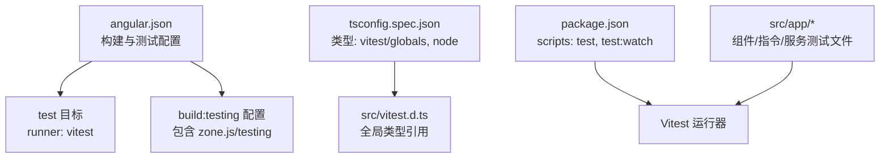
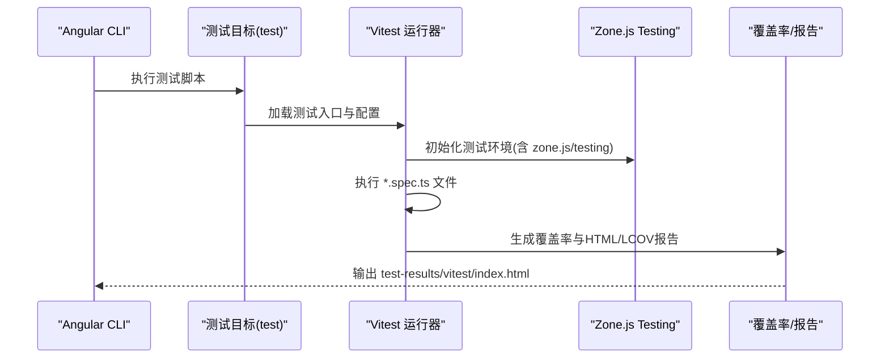
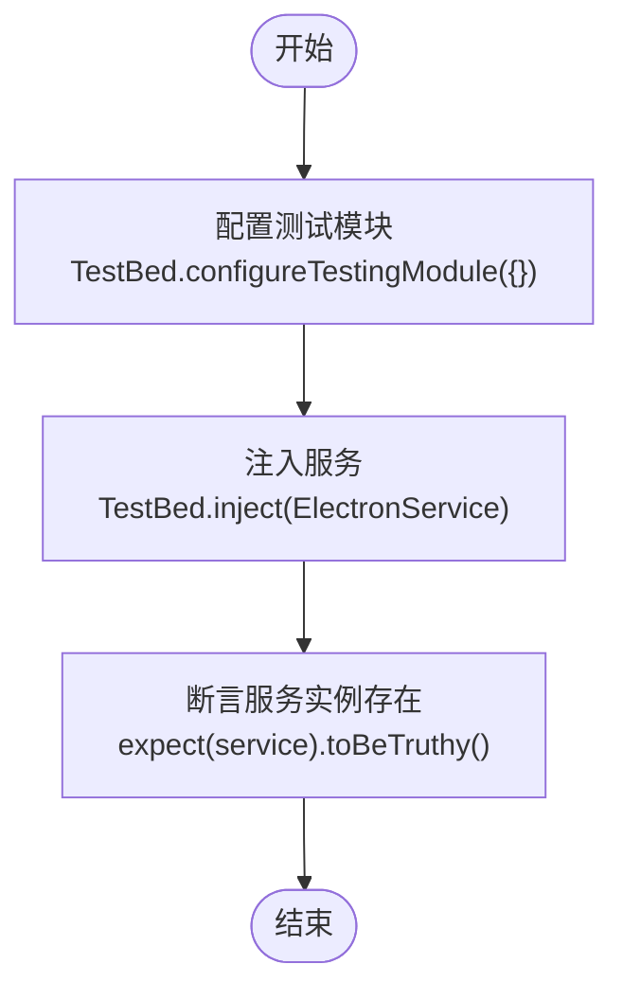
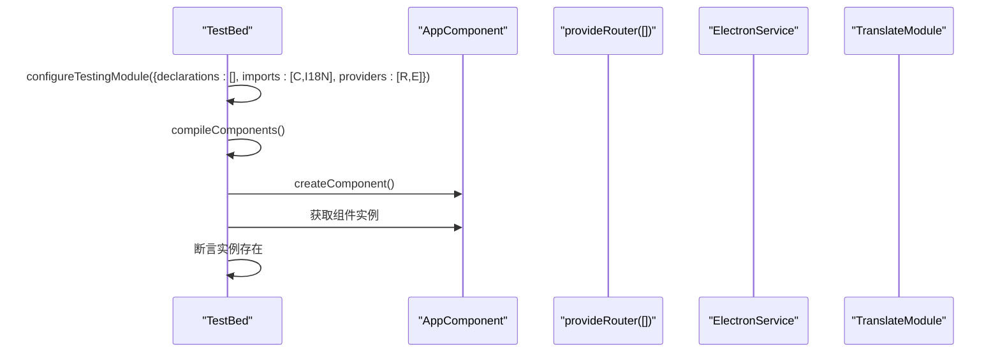
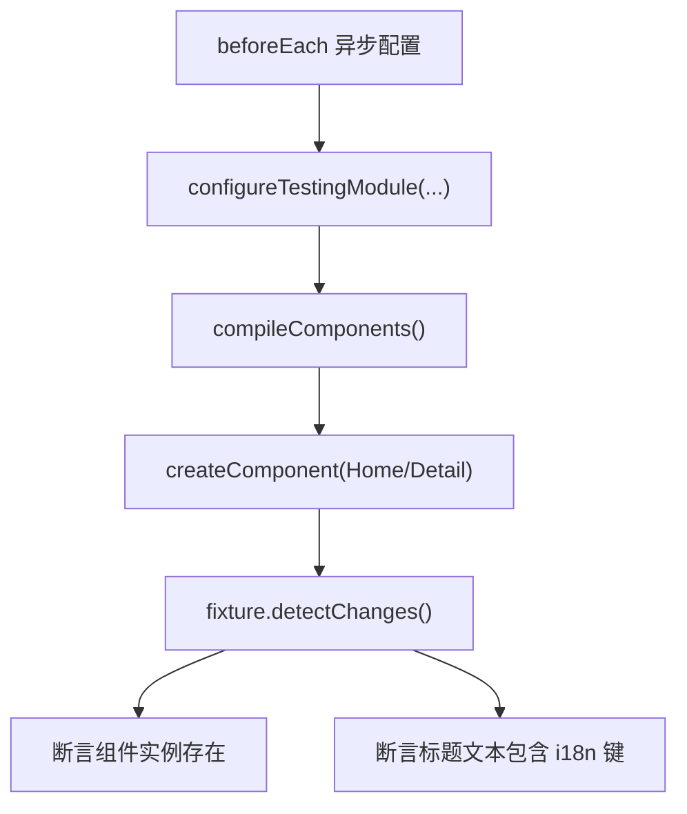
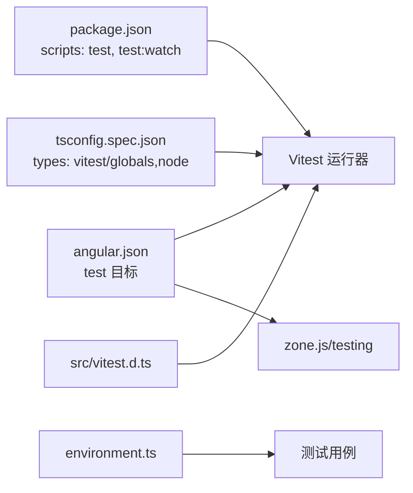

# 单元测试

<cite>
**本文引用的文件**
- [package.json](file://package.json)
- [angular.json](file://angular.json)
- [tsconfig.json](file://tsconfig.json)
- [tsconfig.spec.json](file://src/tsconfig.spec.json)
- [vitest.d.ts](file://src/vitest.d.ts)
- [electron.service.ts](file://src/app/core/services/electron/electron.service.ts)
- [electron.service.spec.ts](file://src/app/core/services/electron/electron.service.spec.ts)
- [home.component.spec.ts](file://src/app/home/home.component.spec.ts)
- [detail.component.spec.ts](file://src/app/detail/detail.component.spec.ts)
- [page-not-found.component.spec.ts](file://src/app/shared/components/page-not-found/page-not-found.component.spec.ts)
- [webview.directive.spec.ts](file://src/app/shared/directives/webview/webview.directive.spec.ts)
- [app.component.spec.ts](file://src/app/app.component.spec.ts)
- [webview.directive.ts](file://src/app/shared/directives/webview/webview.directive.ts)
- [environment.ts](file://src/environments/environment.ts)
</cite>

## 目录
1. [简介](#简介)
2. [项目结构](#项目结构)
3. [核心组件](#核心组件)
4. [架构总览](#架构总览)
5. [详细组件分析](#详细组件分析)
6. [依赖关系分析](#依赖关系分析)
7. [性能考量](#性能考量)
8. [故障排查指南](#故障排查指南)
9. [结论](#结论)
10. [附录](#附录)

## 简介
本文件系统性阐述该项目中基于 Vitest 的单元测试体系与最佳实践，覆盖以下方面：
- Vitest 在 Angular 工程中的配置与集成方式
- Angular 组件测试的组织结构、beforeEach 钩子用法与断言实践
- 核心服务（如 ElectronService）的测试策略：依赖注入、Mock 对象、异步行为验证
- 具体组件测试示例：属性渲染、事件触发、生命周期钩子验证
- 测试覆盖率配置与报告生成
- 开发环境下的运行与调试方法

## 项目结构
本项目采用 Angular CLI 工程，单元测试通过 Vitest 执行器运行。关键配置集中在 Angular 构建配置与 TypeScript 配置中，测试类型声明位于 src 目录。

**图表来源**
- [angular.json:104-127](file://angular.json#L104-L127)
- [angular.json:76-81](file://angular.json#L76-L81)
- [tsconfig.spec.json:1-21](file://src/tsconfig.spec.json#L1-L21)
- [vitest.d.ts:1-2](file://src/vitest.d.ts#L1-L2)
- [package.json:42-43](file://package.json#L42-L43)

**章节来源**
- [angular.json:104-127](file://angular.json#L104-L127)
- [angular.json:76-81](file://angular.json#L76-L81)
- [tsconfig.spec.json:1-21](file://src/tsconfig.spec.json#L1-L21)
- [vitest.d.ts:1-2](file://src/vitest.d.ts#L1-L2)
- [package.json:42-43](file://package.json#L42-L43)

## 核心组件
- 测试运行器与执行器
  - 使用 Vitest 作为 Angular 的单元测试运行器，由 Angular 构建目标 test 指定 runner 为 vitest，并启用覆盖率与 HTML 报告输出。
- 类型与全局声明
  - 通过 tsconfig.spec.json 声明引入 vitest/globals 与 node 类型；src/vitest.d.ts 提供全局类型引用，确保测试文件可直接使用 Vitest API。
- 覆盖率与报告
  - 启用覆盖率统计，报告格式包括 HTML 与 LCOV，HTML 报告输出到 test-results/vitest/index.html。

**章节来源**
- [angular.json:104-127](file://angular.json#L104-L127)
- [tsconfig.spec.json:1-21](file://src/tsconfig.spec.json#L1-L21)
- [vitest.d.ts:1-2](file://src/vitest.d.ts#L1-L2)

## 架构总览
下图展示测试执行链路：Angular CLI 触发测试目标，Vitest 运行器加载测试文件，Zone testing 支持异步与生命周期钩子，最终生成覆盖率与报告。

**图表来源**
- [angular.json:104-127](file://angular.json#L104-L127)
- [package.json:42-43](file://package.json#L42-L43)

## 详细组件分析

### ElectronService 测试
- 测试目的
  - 验证服务实例化成功，确保依赖注入可用。
- 关键点
  - 使用 TestBed.configureTestingModule({}) 创建测试模块，注入 ElectronService 并断言其存在。
  - 该服务在渲染进程中通过条件导入 Electron API，测试不涉及真实 IPC 调用，仅验证注入与基本可用性。
- 断言与最佳实践
  - 使用 toBeTruthy() 验证实例存在。
  - 如需模拟 isElectron 或真实 Electron 环境，可在 beforeEach 中通过 provide 与 Mock 替换实现。

**图表来源**
- [electron.service.spec.ts:1-13](file://src/app/core/services/electron/electron.service.spec.ts#L1-L13)

**章节来源**
- [electron.service.spec.ts:1-13](file://src/app/core/services/electron/electron.service.spec.ts#L1-L13)
- [electron.service.ts:1-57](file://src/app/core/services/electron/electron.service.ts#L1-L57)

### AppComponent 测试
- 测试目的
  - 验证应用根组件在提供路由与 ElectronService 的情况下可正确创建。
- 关键点
  - 通过 provideRouter([]) 提供空路由，ElectronService 以单例形式注入。
  - 使用 TranslateModule.forRoot() 提供国际化支持。
- 断言与最佳实践
  - 断言组件实例存在；如需扩展，可添加模板渲染断言或交互事件验证。

**图表来源**
- [app.component.spec.ts:1-22](file://src/app/app.component.spec.ts#L1-L22)

**章节来源**
- [app.component.spec.ts:1-22](file://src/app/app.component.spec.ts#L1-L22)

### HomeComponent 与 DetailComponent 测试
- 测试目的
  - 验证页面组件在提供路由与国际化模块的情况下可创建，并能正确渲染标题文本。
- 关键点
  - 两个组件均通过 provideRouter([]) 注入路由，使用 TranslateModule.forRoot() 提供 i18n。
  - beforeEach 中使用 async/await 完成模块编译与组件创建，随后进行断言。
- 断言与最佳实践
  - 断言组件实例存在；
  - 断言 DOM 文本内容包含预期的 i18n 键值；
  - 可扩展：添加点击导航、参数传递等交互场景的断言。

**图表来源**
- [home.component.spec.ts:1-34](file://src/app/home/home.component.spec.ts#L1-L34)
- [detail.component.spec.ts:1-34](file://src/app/detail/detail.component.spec.ts#L1-L34)

**章节来源**
- [home.component.spec.ts:1-34](file://src/app/home/home.component.spec.ts#L1-L34)
- [detail.component.spec.ts:1-34](file://src/app/detail/detail.component.spec.ts#L1-L34)

### PageNotFoundComponent 测试
- 测试目的
  - 验证 404 页面组件可创建。
- 关键点
  - 测试模块未显式提供路由，保持最小依赖。
- 断言与最佳实践
  - 断言组件实例存在；如需扩展，可加入路由导航后渲染断言。

**章节来源**
- [page-not-found.component.spec.ts:1-24](file://src/app/shared/components/page-not-found/page-not-found.component.spec.ts#L1-L24)

### WebviewDirective 测试
- 测试目的
  - 验证指令可被实例化。
- 关键点
  - 指令为独立指令，测试无需复杂上下文。
- 断言与最佳实践
  - 断言指令实例存在；如需扩展，可加入宿主元素绑定与行为验证。

**章节来源**
- [webview.directive.spec.ts:1-9](file://src/app/shared/directives/webview/webview.directive.spec.ts#L1-L9)
- [webview.directive.ts:1-10](file://src/app/shared/directives/webview/webview.directive.ts#L1-L10)

## 依赖关系分析
- 测试运行器与构建配置
  - angular.json 的 test 目标指定 runner 为 vitest，并启用 coverage 与 HTML 报告输出。
  - build:testing 配置包含 zone.js/testing，确保异步与生命周期钩子在测试中正常工作。
- 类型与声明
  - tsconfig.spec.json 引入 vitest/globals 与 node 类型；src/vitest.d.ts 提供全局类型引用。
- 脚本与工具
  - package.json 提供 test 与 test:watch 脚本，分别用于一次性与持续监听模式运行测试。
- 环境配置
  - environment.ts 提供本地开发环境常量，测试中可按需替换为生产或测试环境配置。

**图表来源**
- [package.json:42-43](file://package.json#L42-L43)
- [angular.json:104-127](file://angular.json#L104-L127)
- [angular.json:76-81](file://angular.json#L76-L81)
- [tsconfig.spec.json:1-21](file://src/tsconfig.spec.json#L1-L21)
- [vitest.d.ts:1-2](file://src/vitest.d.ts#L1-L2)
- [environment.ts:1-5](file://src/environments/environment.ts#L1-L5)

**章节来源**
- [package.json:42-43](file://package.json#L42-L43)
- [angular.json:104-127](file://angular.json#L104-L127)
- [angular.json:76-81](file://angular.json#L76-L81)
- [tsconfig.spec.json:1-21](file://src/tsconfig.spec.json#L1-L21)
- [vitest.d.ts:1-2](file://src/vitest.d.ts#L1-L2)
- [environment.ts:1-5](file://src/environments/environment.ts#L1-L5)

## 性能考量
- 测试执行性能
  - 使用 Vitest 的内置并发与快速启动能力，结合 Angular 的增量编译与 zone.js/testing，提升测试反馈速度。
- 覆盖率开销
  - 启用覆盖率会增加执行时间，建议在 CI 中开启，在本地开发中可通过脚本选择性运行。
- 构建配置优化
  - testing 配置启用 zone.js/testing，避免在测试中引入不必要的 polyfill，减少初始化成本。

## 故障排查指南
- 测试无法启动或报类型错误
  - 确认 tsconfig.spec.json 已引入 vitest/globals 与 node 类型；src/vitest.d.ts 是否存在全局类型引用。
- 组件渲染断言失败
  - 确保在 beforeEach 中调用 compileComponents() 与 fixture.detectChanges()；检查 i18n 键是否正确。
- ElectronService 相关问题
  - 若需要模拟 Electron 环境，可在 beforeEach 中通过 provide 与 Mock 替换服务实例；注意 isElectron 判断逻辑。
- 路由相关断言失败
  - 确保在测试模块中提供 provideRouter([])；如需导航测试，可结合 RouterTestingModule 或自定义 Mock。
- 覆盖率报告缺失
  - 检查 angular.json 的 coverage 与 report 配置；确认输出目录 test-results/vitest/index.html 是否生成。

**章节来源**
- [tsconfig.spec.json:1-21](file://src/tsconfig.spec.json#L1-L21)
- [vitest.d.ts:1-2](file://src/vitest.d.ts#L1-L2)
- [angular.json:104-127](file://angular.json#L104-L127)

## 结论
本项目已完整集成 Vitest 作为 Angular 单元测试运行器，配合 Angular CLI 的 test 目标与 zone.js/testing，形成高效的测试执行链路。测试文件覆盖服务、组件与指令，断言策略清晰，具备良好的可扩展性。建议在后续迭代中：
- 为 ElectronService 增加更细粒度的行为断言与 Mock 场景
- 为组件补充交互事件与生命周期钩子验证
- 在 CI 中启用覆盖率与报告生成，持续监控质量指标

## 附录
- 开发环境运行与调试
  - 一次性运行：执行测试脚本，查看控制台与 HTML 报告
  - 持续监听：使用 watch 模式实时反馈测试结果
- 覆盖率与报告
  - 覆盖率开关与报告格式在 Angular 测试目标中配置，HTML 报告输出至 test-results/vitest/index.html

**章节来源**
- [package.json:42-43](file://package.json#L42-L43)
- [angular.json:104-127](file://angular.json#L104-L127)