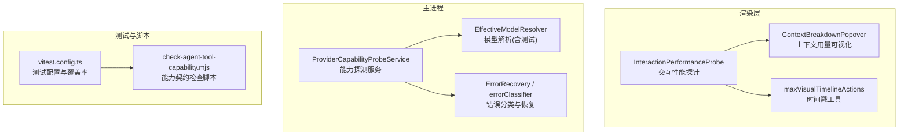
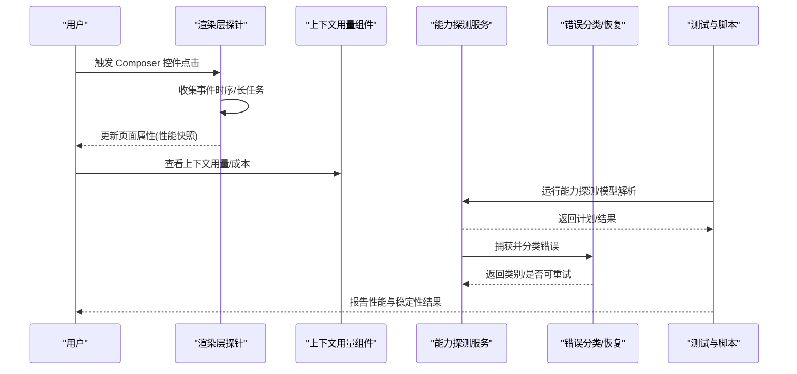
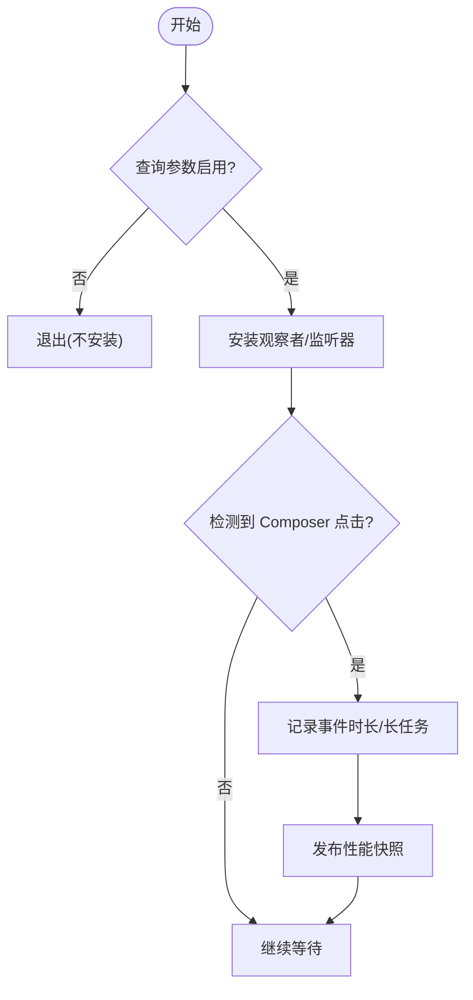
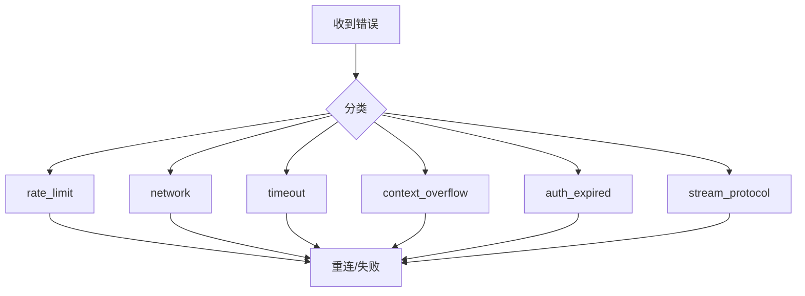
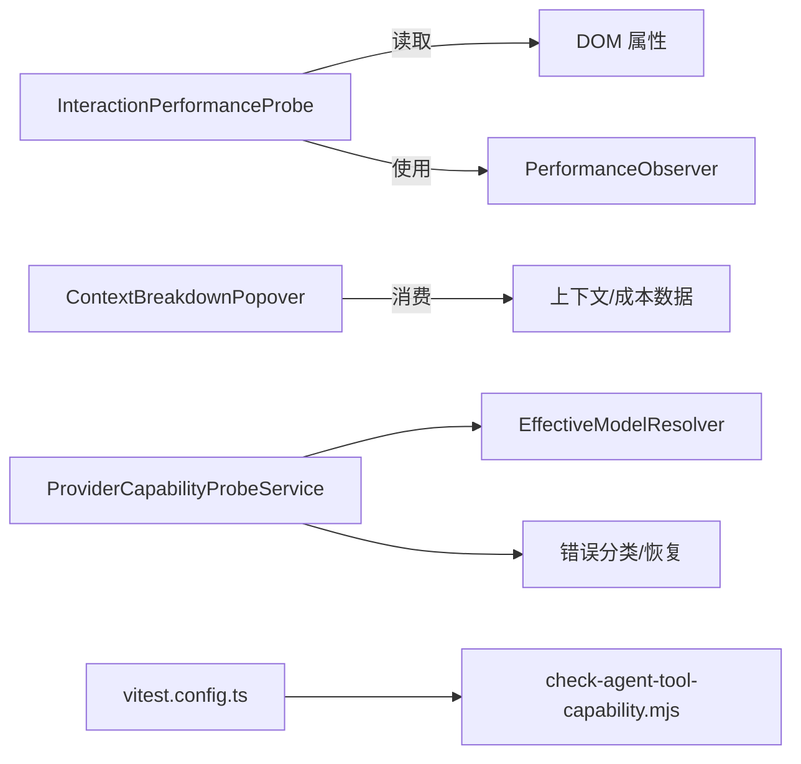

# 性能测试

<cite>
**本文引用的文件**
- [InteractionPerformanceProbe.ts](file://src/renderer/platform/performance/InteractionPerformanceProbe.ts)
- [InteractionPerformanceProbe.test.ts](file://src/renderer/platform/performance/InteractionPerformanceProbe.test.ts)
- [vitest.config.ts](file://vitest.config.ts)
- [ProviderCapabilityProbeService.ts](file://src/main/settings/ProviderCapabilityProbeService.ts)
- [EffectiveModelResolver.test.ts](file://src/main/settings/EffectiveModelResolver.test.ts)
- [errorClassifier.test.ts](file://src/main/agent-runtime/providers/internal/errorClassifier.test.ts)
- [ErrorRecovery.ts](file://src/main/agent-runtime/agent/ErrorRecovery.ts)
- [ContextBreakdownPopover.tsx](file://src/renderer/patterns/ContextBreakdownPopover.tsx)
- [maxVisualTimelineActions.ts](file://src/renderer/features/composer/maxVisualTimelineActions.ts)
- [investigationRecordSchemas.ts](file://src/main/investigation/investigationRecordSchemas.ts)
- [investigationTestFixtures.ts](file://src/main/investigation/investigationTestFixtures.ts)
- [renderdocInvestigation.ts](file://src/shared/types/renderdocInvestigation.ts)
- [check-agent-tool-capability.mjs](file://scripts/check-agent-tool-capability.mjs)
</cite>

## 目录
1. [简介](#简介)
2. [项目结构](#项目结构)
3. [核心组件](#核心组件)
4. [架构总览](#架构总览)
5. [详细组件分析](#详细组件分析)
6. [依赖关系分析](#依赖关系分析)
7. [性能考量](#性能考量)
8. [故障排查指南](#故障排查指南)
9. [结论](#结论)
10. [附录](#附录)

## 简介
本文件面向 RDC-Agent 的性能测试与优化，聚焦以下目标：
- 明确性能指标定义（交互延迟、长任务、上下文使用、网络错误分类等）
- 设计可复现的测试场景（负载、压力、回归检测）
- 说明如何编写与执行基准测试（基于现有 Vitest 配置与探针）
- 提供网络请求优化与性能问题诊断方法
- 给出性能优化建议与回归检测策略

## 项目结构
RDC-Agent 在渲染层提供了交互性能探针，用于采集点击到下一次绘制的延迟分布与长任务情况；在主进程侧具备能力探测、模型选择与错误分类等能力，可用于构建端到端的性能与稳定性测试。测试框架基于 Vitest，覆盖主进程与共享模块，并通过脚本聚合关键用例。

图表来源
- [InteractionPerformanceProbe.ts:1-154](file://src/renderer/platform/performance/InteractionPerformanceProbe.ts#L1-L154)
- [ContextBreakdownPopover.tsx:97-263](file://src/renderer/patterns/ContextBreakdownPopover.tsx#L97-L263)
- [maxVisualTimelineActions.ts:12](file://src/renderer/features/composer/maxVisualTimelineActions.ts#L12)
- [ProviderCapabilityProbeService.ts:277-293](file://src/main/settings/ProviderCapabilityProbeService.ts#L277-L293)
- [EffectiveModelResolver.test.ts:178-210](file://src/main/settings/EffectiveModelResolver.test.ts#L178-L210)
- [ErrorRecovery.ts:50-230](file://src/main/agent-runtime/agent/ErrorRecovery.ts#L50-L230)
- [vitest.config.ts:1-82](file://vitest.config.ts#L1-L82)
- [check-agent-tool-capability.mjs:66-84](file://scripts/check-agent-tool-capability.mjs#L66-L84)

章节来源
- [vitest.config.ts:1-82](file://vitest.config.ts#L1-L82)
- [check-agent-tool-capability.mjs:66-84](file://scripts/check-agent-tool-capability.mjs#L66-L84)

## 核心组件
- 交互性能探针：通过 PerformanceObserver 采集“点击到下一次绘制”的事件时序与长任务，输出稳定的 P95 与最大值，便于量化 UI 响应性。
- 上下文用量可视化：展示当前/上次实际或预估的 token 占用、成本与阈值，辅助评估提示词与压缩策略对性能的影响。
- 能力探测服务：对模型路由、上下文模式、快速模式等进行探测与记录，支撑不同负载下的行为验证。
- 错误分类与恢复：将 HTTP 状态码与消息模式归类为 rate_limit、network、timeout、context_overflow 等，指导重试与降级策略。
- 测试与覆盖率：Vitest 统一入口与覆盖率阈值，保障主进程与共享代码质量。

章节来源
- [InteractionPerformanceProbe.ts:1-154](file://src/renderer/platform/performance/InteractionPerformanceProbe.ts#L1-L154)
- [ContextBreakdownPopover.tsx:97-263](file://src/renderer/patterns/ContextBreakdownPopover.tsx#L97-L263)
- [ProviderCapabilityProbeService.ts:277-293](file://src/main/settings/ProviderCapabilityProbeService.ts#L277-L293)
- [ErrorRecovery.ts:50-230](file://src/main/agent-runtime/agent/ErrorRecovery.ts#L50-L230)
- [vitest.config.ts:1-82](file://vitest.config.ts#L1-L82)

## 架构总览
下图展示了从用户交互到性能数据采集、再到主进程能力探测与错误处理的端到端流程，以及测试与脚本如何驱动这些路径。

图表来源
- [InteractionPerformanceProbe.ts:75-154](file://src/renderer/platform/performance/InteractionPerformanceProbe.ts#L75-L154)
- [ContextBreakdownPopover.tsx:226-239](file://src/renderer/patterns/ContextBreakdownPopover.tsx#L226-L239)
- [ProviderCapabilityProbeService.ts:277-293](file://src/main/settings/ProviderCapabilityProbeService.ts#L277-L293)
- [errorClassifier.test.ts:6-163](file://src/main/agent-runtime/providers/internal/errorClassifier.test.ts#L6-L163)
- [vitest.config.ts:1-82](file://vitest.config.ts#L1-L82)

## 详细组件分析

### 交互性能探针（渲染层）
- 指标定义
  - 点击到下一次绘制 P95/最大值：衡量交互响应性
  - 长任务最大耗时：识别阻塞主线程的任务
  - 支持性与观测计数：区分浏览器能力差异
- 实现要点
  - 仅在查询参数开启时安装监听，避免影响正常路径
  - 仅统计 Composer 相关控件的点击事件
  - 使用 PerformanceObserver 的 event 与 longtask 类型采集数据
  - 将汇总结果写入 DOM 属性，供自动化测试读取
- 测试要点
  - 断言 p95 与长任务最大值确定性
  - 无交互时不生成虚假测量

图表来源
- [InteractionPerformanceProbe.ts:75-154](file://src/renderer/platform/performance/InteractionPerformanceProbe.ts#L75-L154)

章节来源
- [InteractionPerformanceProbe.ts:1-154](file://src/renderer/platform/performance/InteractionPerformanceProbe.ts#L1-L154)
- [InteractionPerformanceProbe.test.ts:1-44](file://src/renderer/platform/performance/InteractionPerformanceProbe.test.ts#L1-L44)

### 上下文用量与成本（渲染层）
- 作用：展示当前/上次实际或预估的 token 占用、成本与阈值，帮助定位提示词膨胀、压缩阈值不当导致的性能退化
- 关键点：
  - 支持“预估”和“实际”两种视图
  - 显示输入/输出/缓存读写成本
  - 结合压缩阈值进行可视化对比

章节来源
- [ContextBreakdownPopover.tsx:97-263](file://src/renderer/patterns/ContextBreakdownPopover.tsx#L97-L263)

### 能力探测与模型解析（主进程）
- 能力探测：对 max-context、fast 等模式进行探测，校验可用性并记录结果
- 模型解析：根据设置与控制项计算有效模型、上下文预算与层级
- 用途：在不同负载下验证路由与模型选择的正确性与稳定性

章节来源
- [ProviderCapabilityProbeService.ts:277-293](file://src/main/settings/ProviderCapabilityProbeService.ts#L277-L293)
- [EffectiveModelResolver.test.ts:178-210](file://src/main/settings/EffectiveModelResolver.test.ts#L178-L210)

### 错误分类与恢复（主进程）
- 分类维度：HTTP 状态码、消息模式、协议异常等
- 典型类别：rate_limit、network、timeout、context_overflow、auth_expired、stream_protocol 等
- 恢复策略：按优先级决定重试、降级或终止

图表来源
- [errorClassifier.test.ts:6-163](file://src/main/agent-runtime/providers/internal/errorClassifier.test.ts#L6-L163)
- [ErrorRecovery.ts:50-230](file://src/main/agent-runtime/agent/ErrorRecovery.ts#L50-L230)

章节来源
- [errorClassifier.test.ts:6-163](file://src/main/agent-runtime/providers/internal/errorClassifier.test.ts#L6-L163)
- [ErrorRecovery.ts:50-230](file://src/main/agent-runtime/agent/ErrorRecovery.ts#L50-L230)

### 时间戳工具（渲染层）
- 提供跨平台的时间获取方式，优先使用 performance.now()，回退到 Date.now()
- 适用于需要高精度计时的场景

章节来源
- [maxVisualTimelineActions.ts:12](file://src/renderer/features/composer/maxVisualTimelineActions.ts#L12)

### 基准与度量数据结构（主进程/共享）
- 基准字段：包含预热次数、分辨率、垂直同步、采样协议等
- 世界状态基准：在调查场景中作为基准描述

章节来源
- [investigationRecordSchemas.ts:71](file://src/main/investigation/investigationRecordSchemas.ts#L71)
- [investigationTestFixtures.ts:97](file://src/main/investigation/investigationTestFixtures.ts#L97)
- [renderdocInvestigation.ts:216](file://src/shared/types/renderdocInvestigation.ts#L216)

## 依赖关系分析
- 渲染层探针依赖浏览器性能 API（PerformanceObserver），并在特定选择器范围内监听点击事件
- 上下文用量组件依赖上下文与成本数据源，展示当前/预估用量
- 能力探测服务依赖模型解析与设置服务，产出探测结果
- 错误分类依赖 HTTP 状态与消息模式匹配规则
- 测试与脚本通过 Vitest 统一执行，并对关键能力契约进行检查

图表来源
- [InteractionPerformanceProbe.ts:75-154](file://src/renderer/platform/performance/InteractionPerformanceProbe.ts#L75-L154)
- [ContextBreakdownPopover.tsx:226-239](file://src/renderer/patterns/ContextBreakdownPopover.tsx#L226-L239)
- [ProviderCapabilityProbeService.ts:277-293](file://src/main/settings/ProviderCapabilityProbeService.ts#L277-L293)
- [vitest.config.ts:1-82](file://vitest.config.ts#L1-L82)
- [check-agent-tool-capability.mjs:66-84](file://scripts/check-agent-tool-capability.mjs#L66-L84)

章节来源
- [vitest.config.ts:1-82](file://vitest.config.ts#L1-L82)
- [check-agent-tool-capability.mjs:66-84](file://scripts/check-agent-tool-capability.mjs#L66-L84)

## 性能考量
- 指标定义
  - 交互延迟：点击到下一次绘制的 P95/最大值
  - 长任务：首次交互后的长任务最大耗时
  - 上下文用量：token 占用比例、成本构成、压缩阈值
  - 网络健康：错误分类占比（rate_limit、network、timeout、context_overflow 等）
- 测试场景设计
  - 负载测试：逐步增加并发请求/交互频率，观察 P95 与长任务变化
  - 压力测试：在高并发下验证错误分类与恢复策略的有效性
  - 回归检测：固定样本集（如能力契约测试）与覆盖率阈值，确保指标不劣化
- 工具与执行
  - 使用 Vitest 运行单元测试与契约测试，配合覆盖率阈值
  - 通过查询参数启用交互性能探针，导出性能快照供自动化读取
  - 使用能力探测与模型解析用例验证不同模式下的行为一致性

[本节为通用指导，无需具体文件引用]

## 故障排查指南
- 常见问题定位
  - 高 P95/长任务：检查 Composer 控件附近是否存在重型操作或阻塞任务
  - 频繁 rate_limit：调整重试退避策略，降低并发或切换模型/路由
  - network/timeout：检查网络连通性与超时配置，必要时启用重试
  - context_overflow：压缩上下文或降低上下文预算
  - auth_expired：刷新凭证或重新建立连接
- 诊断步骤
  - 启用交互性能探针，读取 DOM 属性中的性能快照
  - 查看上下文用量面板，确认 token 占用与成本
  - 检查错误分类日志，定位错误类型与重试策略
  - 运行能力探测与模型解析测试，验证配置与路由

章节来源
- [InteractionPerformanceProbe.ts:75-154](file://src/renderer/platform/performance/InteractionPerformanceProbe.ts#L75-L154)
- [ContextBreakdownPopover.tsx:226-239](file://src/renderer/patterns/ContextBreakdownPopover.tsx#L226-L239)
- [errorClassifier.test.ts:6-163](file://src/main/agent-runtime/providers/internal/errorClassifier.test.ts#L6-L163)
- [ErrorRecovery.ts:50-230](file://src/main/agent-runtime/agent/ErrorRecovery.ts#L50-L230)

## 结论
RDC-Agent 已具备完善的性能采集与测试基础设施：
- 渲染层提供标准化的交互性能探针与上下文用量可视化
- 主进程提供能力探测、模型解析与错误分类，支撑负载与压力测试
- 测试框架与脚本保证关键路径的可重复性与回归检测
建议在生产环境中持续采集上述指标，并结合错误分类与上下文用量进行持续优化。

[本节为总结，无需具体文件引用]

## 附录
- 运行测试
  - 使用 Vitest 执行主进程与共享模块测试，覆盖率阈值已在配置中设定
  - 使用能力契约检查脚本验证关键能力与路由
- 启用性能探针
  - 在渲染页 URL 中添加查询参数以启用探针，随后执行交互并读取性能快照
- 指标基线
  - 记录 P95/最大值、长任务最大耗时、错误分类占比、上下文用量与成本，作为回归检测基线

章节来源
- [vitest.config.ts:1-82](file://vitest.config.ts#L1-L82)
- [check-agent-tool-capability.mjs:66-84](file://scripts/check-agent-tool-capability.mjs#L66-L84)
- [InteractionPerformanceProbe.ts:75-154](file://src/renderer/platform/performance/InteractionPerformanceProbe.ts#L75-L154)