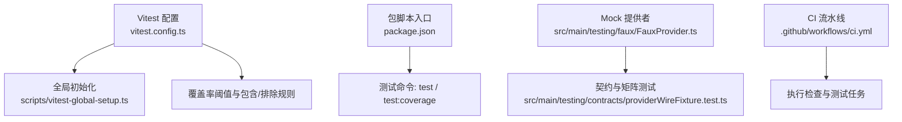
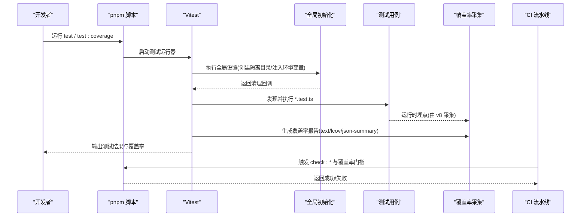
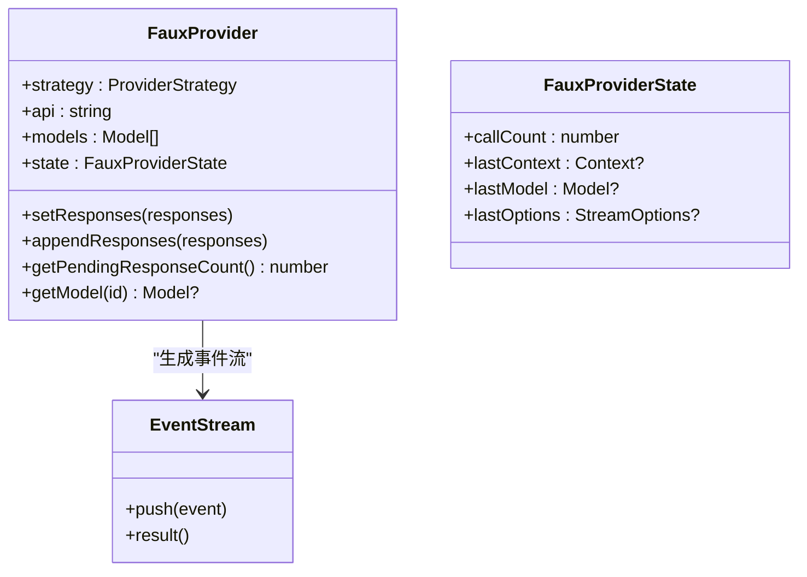
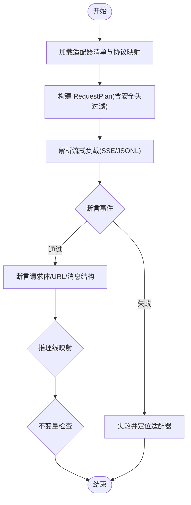
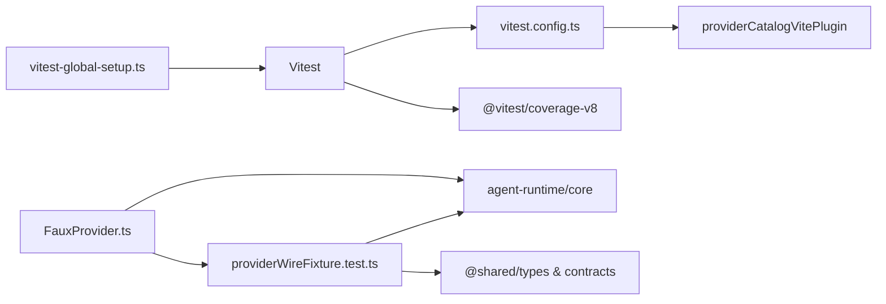

# 测试基础设施

<cite>
**本文引用的文件**
- [vitest.config.ts](file://vitest.config.ts)
- [scripts/vitest-global-setup.ts](file://scripts/vitest-global-setup.ts)
- [package.json](file://package.json)
- [src/main/testing/contracts/providerWireFixture.test.ts](file://src/main/testing/contracts/providerWireFixture.test.ts)
- [src/main/testing/faux/FauxProvider.ts](file://src/main/testing/faux/FauxProvider.ts)
- [.github/workflows/ci.yml](file://.github/workflows/ci.yml)
</cite>

## 目录
1. [简介](#简介)
2. [项目结构](#项目结构)
3. [核心组件](#核心组件)
4. [架构总览](#架构总览)
5. [详细组件分析](#详细组件分析)
6. [依赖关系分析](#依赖关系分析)
7. [性能考虑](#性能考虑)
8. [故障排查指南](#故障排查指南)
9. [结论](#结论)
10. [附录](#附录)

## 简介
本文件面向 RDC-Agent 的测试基础设施，聚焦于测试工具与框架的配置与管理、测试服务器启动、数据库初始化、外部服务模拟、测试数据工厂与夹具的使用，以及持续集成中的测试流水线、测试报告与覆盖率统计。目标是帮助开发者快速搭建、运行和维护稳定可靠的测试环境，确保主进程与共享模块的行为正确性与可回归性。

## 项目结构
RDC-Agent 使用 Vitest 作为 Node 端单元测试框架，配合 V8 覆盖率采集；通过全局设置隔离用户数据目录，避免污染真实环境；提供 Provider 协议矩阵化的 Fixture 测试与 FauxProvider 等 Mock 能力；CI 中集成检查脚本与覆盖率门槛。

图表来源
- [vitest.config.ts:1-82](file://vitest.config.ts#L1-L82)
- [scripts/vitest-global-setup.ts:1-21](file://scripts/vitest-global-setup.ts#L1-L21)
- [package.json:19-76](file://package.json#L19-L76)
- [src/main/testing/faux/FauxProvider.ts:1-250](file://src/main/testing/faux/FauxProvider.ts#L1-L250)
- [src/main/testing/contracts/providerWireFixture.test.ts:1-870](file://src/main/testing/contracts/providerWireFixture.test.ts#L1-L870)
- [.github/workflows/ci.yml:1-200](file://.github/workflows/ci.yml#L1-L200)

章节来源
- [vitest.config.ts:1-82](file://vitest.config.ts#L1-L82)
- [scripts/vitest-global-setup.ts:1-21](file://scripts/vitest-global-setup.ts#L1-L21)
- [package.json:19-76](file://package.json#L19-L76)

## 核心组件
- 测试运行器与覆盖率
  - 使用 Vitest 在 Node 环境中运行测试，自动发现 src/**/*.test.ts。
  - 覆盖率由 v8 提供，输出 text、lcov、json-summary 到 coverage 目录。
  - 覆盖率范围限定 main 与 shared，排除 Electron/IPC/Worker/桌面绑定等不适合单元覆盖的代码。
  - 设定行/函数/分支/语句的最低阈值，并通过 ratchet 脚本保障只升不降。
- 全局环境与隔离
  - 全局设置创建临时根目录并注入环境变量，使每个测试运行拥有独立的用户与应用数据目录，并在结束后清理。
- 测试脚本与命令
  - 提供 test、test:watch、test:coverage 等命令；并提供大量 check:* 专项测试与校验脚本（如 provider-catalog、agent-runtime、hooks 等）。
- 外部服务模拟与数据工厂
  - FauxProvider：实现 ProviderStrategy，支持预设响应序列、调用状态追踪与事件流生成，便于断言上下文、模型与选项。
  - 协议矩阵 Fixture：以固定流式响应（SSE/JSONL）与期望文档驱动多供应商适配器的请求体构建与流解析契约测试。

章节来源
- [vitest.config.ts:1-82](file://vitest.config.ts#L1-L82)
- [scripts/vitest-global-setup.ts:1-21](file://scripts/vitest-global-setup.ts#L1-L21)
- [package.json:19-76](file://package.json#L19-L76)
- [src/main/testing/faux/FauxProvider.ts:1-250](file://src/main/testing/faux/FauxProvider.ts#L1-L250)
- [src/main/testing/contracts/providerWireFixture.test.ts:1-870](file://src/main/testing/contracts/providerWireFixture.test.ts#L1-L870)

## 架构总览
下图展示了从测试命令到覆盖率输出的端到端流程，包括全局环境隔离、测试发现与执行、覆盖率收集与阈值检查。

图表来源
- [vitest.config.ts:1-82](file://vitest.config.ts#L1-L82)
- [scripts/vitest-global-setup.ts:1-21](file://scripts/vitest-global-setup.ts#L1-L21)
- [package.json:19-76](file://package.json#L19-L76)
- [.github/workflows/ci.yml:1-200](file://.github/workflows/ci.yml#L1-L200)

## 详细组件分析

### 测试运行器与覆盖率配置
- 运行环境
  - 指定 Node 环境，启用全局 API，仅包含 src/**/*.test.ts。
  - 通过别名将 @shared/@main/@renderer 指向对应源码目录，便于测试导入。
- 覆盖率策略
  - 使用 v8 采集，输出多种格式至 coverage 目录。
  - 包含 main 与 shared 代码，排除 Electron 入口、IPC handlers、worker、媒体/捕获、会话编排、OAuth、daemon、sdk、reports、testing faux 等不适合单元覆盖的部分。
  - 设置最低覆盖率阈值，并通过 ratchet 脚本强制“只升不降”。
- 插件与钩子
  - 引入 providerCatalogVitePlugin，用于测试时处理 provider catalog。
  - 全局设置脚本负责隔离用户数据目录，避免污染真实 ~/.rdc-agent。

章节来源
- [vitest.config.ts:1-82](file://vitest.config.ts#L1-L82)

### 全局初始化与环境隔离
- 作用
  - 为每次测试运行创建临时根目录，并设置 RDC_AGENT_HOME、RDC_AGENT_USER_DATA、RDC_AGENT_QA_INSTANCE_ID 等环境变量。
  - 保证所有 worker 继承同一隔离根目录，测试结束后递归删除。
- 影响
  - 防止测试读写真实用户数据或应用数据。
  - 为 QA/集成场景提供唯一实例标识，便于日志关联与资源隔离。

章节来源
- [scripts/vitest-global-setup.ts:1-21](file://scripts/vitest-global-setup.ts#L1-L21)

### 测试脚本与命令
- 常用命令
  - test：运行全部单元测试。
  - test:watch：监听模式。
  - test:coverage：运行并生成覆盖率报告。
- 专项检查
  - 大量 check:* 脚本用于架构、契约、工作流、渲染结构、设计令牌、会话投影、知识系统、调查系统等维度的静态与行为校验。
  - check:coverage-ratchet：基于基线进行覆盖率回退保护。
- 启动与冒烟
  - start/smoke 系列脚本用于桌面与浏览器模式的冒烟与健康检查。

章节来源
- [package.json:19-76](file://package.json#L19-L76)

### 外部服务模拟：FauxProvider
- 目标
  - 提供一个可配置的 LLM Provider 模拟，实现 ProviderStrategy，注册后可被 ProviderRegistry 使用。
- 能力
  - 预设响应队列：支持文本、完整消息、自定义事件序列、停止原因与用量覆盖。
  - 事件流生成：自动生成标准 start/text_start/text_delta/text_end/done 事件，或直接发射自定义事件。
  - 调用追踪：记录 callCount、lastContext、lastModel、lastOptions，便于断言。
  - 错误路径：当无待消费响应时，发送 error 事件并附带错误信息。
- 使用建议
  - 在需要隔离网络与外部依赖的单元测试中注册该策略，构造最小化上下文与模型，验证上层逻辑对事件流的消费与聚合。

图表来源
- [src/main/testing/faux/FauxProvider.ts:1-250](file://src/main/testing/faux/FauxProvider.ts#L1-L250)

章节来源
- [src/main/testing/faux/FauxProvider.ts:1-250](file://src/main/testing/faux/FauxProvider.ts#L1-L250)

### 协议矩阵与 Fixture 测试
- 目标
  - 以固定流式响应（SSE/JSONL）与期望文档驱动多供应商适配器的请求体构建与流解析契约测试，确保各适配器协议一致性。
- 关键机制
  - 维护适配器清单与协议映射，确保共享 fixture 覆盖所有原生协议。
  - 构建 RequestPlan 并断言安全头过滤（不包含敏感头）。
  - 解析流式负载并断言文本与工具调用事件的存在性。
  - 针对各适配器调用内部辅助方法，断言 URL 构建、消息体结构与流类型。
- 不变量与健壮性
  - 断言流构建器拒绝冲突通道、早到 delta、终止后事件等非法状态。
  - 断言超大/截断 SSE 缓冲的 fail-closed 行为。
  - 断言 reasoning wire 在不同选择下的映射。

图表来源
- [src/main/testing/contracts/providerWireFixture.test.ts:1-870](file://src/main/testing/contracts/providerWireFixture.test.ts#L1-L870)

章节来源
- [src/main/testing/contracts/providerWireFixture.test.ts:1-870](file://src/main/testing/contracts/providerWireFixture.test.ts#L1-L870)

### 持续集成与流水线
- 职责
  - 在 CI 中执行各类 check:* 与测试任务，确保架构、契约、覆盖率与仓库卫生。
  - 结合覆盖率门槛与 ratchet 机制，阻止覆盖率下降。
- 典型阶段
  - 安装依赖、类型检查、lint、测试运行、覆盖率生成、报告上传与门禁。
- 扩展建议
  - 按需增加并行任务、缓存依赖、分片测试以提升速度。
  - 将覆盖率报告与质量门禁纳入 PR 合并条件。

章节来源
- [.github/workflows/ci.yml:1-200](file://.github/workflows/ci.yml#L1-L200)

## 依赖关系分析
- 测试运行器依赖
  - Vitest 与 @vitest/runner 提供测试执行能力；@vitest/coverage-v8 提供覆盖率采集。
  - 通过 vite 插件 providerCatalogVitePlugin 处理 provider catalog。
- 测试代码依赖
  - 测试用例依赖 agent-runtime 内部模块（EventStream、AssistantStreamBuilder、http 解析器等）与 shared 类型/契约。
  - FauxProvider 依赖 core 类型与 EventStream，实现 ProviderStrategy。
- 环境变量与路径
  - 全局设置注入 RDC_AGENT_* 环境变量，控制用户与应用数据目录位置。
  - Vitest 别名简化测试导入路径。

图表来源
- [vitest.config.ts:1-82](file://vitest.config.ts#L1-L82)
- [src/main/testing/contracts/providerWireFixture.test.ts:1-870](file://src/main/testing/contracts/providerWireFixture.test.ts#L1-L870)
- [src/main/testing/faux/FauxProvider.ts:1-250](file://src/main/testing/faux/FauxProvider.ts#L1-L250)
- [scripts/vitest-global-setup.ts:1-21](file://scripts/vitest-global-setup.ts#L1-L21)

章节来源
- [vitest.config.ts:1-82](file://vitest.config.ts#L1-L82)
- [src/main/testing/contracts/providerWireFixture.test.ts:1-870](file://src/main/testing/contracts/providerWireFixture.test.ts#L1-L870)
- [src/main/testing/faux/FauxProvider.ts:1-250](file://src/main/testing/faux/FauxProvider.ts#L1-L250)
- [scripts/vitest-global-setup.ts:1-21](file://scripts/vitest-global-setup.ts#L1-L21)

## 性能考虑
- 测试隔离
  - 使用临时目录与唯一实例 ID，避免磁盘竞争与状态泄漏。
- 覆盖率裁剪
  - 排除 Electron/IPC/Worker/桌面绑定等代码，减少无关开销，聚焦可测面。
- 并行与缓存
  - 建议在 CI 中启用依赖缓存与测试分片，缩短反馈时间。
- 流式处理
  - 协议矩阵测试对 SSE/JSONL 流进行增量解析，注意缓冲区大小与异常路径的性能影响。

[本节为通用指导，不直接分析具体文件]

## 故障排查指南
- 测试无法访问真实用户数据
  - 确认全局设置已生效，环境变量 RDC_AGENT_HOME/RDC_AGENT_USER_DATA 指向临时目录。
  - 若仍写入真实目录，检查是否覆盖了全局设置或在测试中显式修改了相关路径。
- 覆盖率未达标或被 ratchet 拒绝
  - 查看覆盖率报告与阈值配置，确认新增代码属于 include 范围。
  - 更新 ratchet 基线前评估变更合理性，避免掩盖退化。
- 协议矩阵测试失败
  - 核对适配器清单与协议映射是否一致。
  - 检查 fixture 流文件是否存在且完整，expected.md 是否满足最低要求。
  - 关注断言失败的具体适配器与事件类型，定位是请求体构建还是流解析问题。
- FauxProvider 行为异常
  - 确认已设置响应队列，且事件序列包含 done/error。
  - 检查调用状态（callCount、lastContext 等）是否符合预期。
  - 在无响应时，应收到 error 事件；如需模拟错误，可在事件中注入错误对象。

章节来源
- [scripts/vitest-global-setup.ts:1-21](file://scripts/vitest-global-setup.ts#L1-L21)
- [vitest.config.ts:1-82](file://vitest.config.ts#L1-L82)
- [src/main/testing/contracts/providerWireFixture.test.ts:1-870](file://src/main/testing/contracts/providerWireFixture.test.ts#L1-L870)
- [src/main/testing/faux/FauxProvider.ts:1-250](file://src/main/testing/faux/FauxProvider.ts#L1-L250)

## 结论
RDC-Agent 的测试基础设施围绕 Vitest 与 V8 覆盖率展开，通过严格的环境隔离、丰富的 Mock 能力与协议矩阵化的 Fixture 测试，确保了主进程与共享模块的可测性与稳定性。配合 CI 中的多项检查与覆盖率门槛，形成了从本地开发到持续集成的闭环质量保障。建议在新功能或重构时优先补充对应的契约与矩阵测试，并遵循覆盖率只升不降的原则。

[本节为总结性内容，不直接分析具体文件]

## 附录
- 常用命令速查
  - 运行测试：pnpm test
  - 监听模式：pnpm test:watch
  - 生成覆盖率：pnpm test:coverage
  - 专项检查：pnpm check:<name>（如 provider-system、agent-runtime、hooks 等）
  - 覆盖率门槛：pnpm check:coverage-ratchet
- 关键路径参考
  - 测试配置：vitest.config.ts
  - 全局初始化：scripts/vitest-global-setup.ts
  - 包脚本：package.json
  - Mock 提供者：src/main/testing/faux/FauxProvider.ts
  - 协议矩阵测试：src/main/testing/contracts/providerWireFixture.test.ts
  - CI 流水线：.github/workflows/ci.yml

[本节为补充信息，不直接分析具体文件]