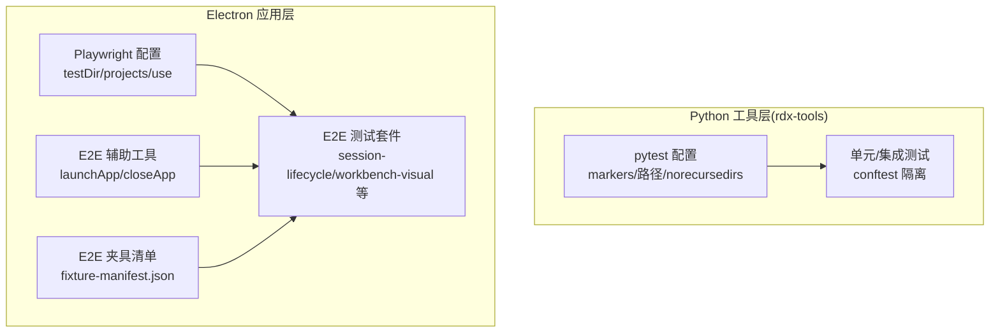
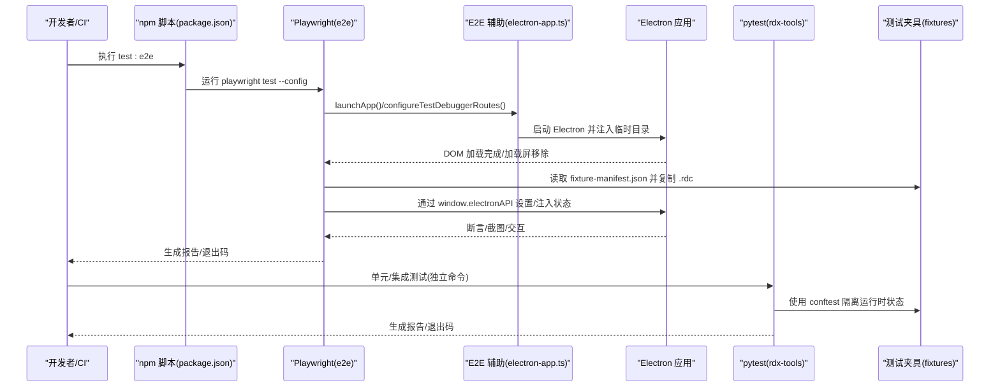
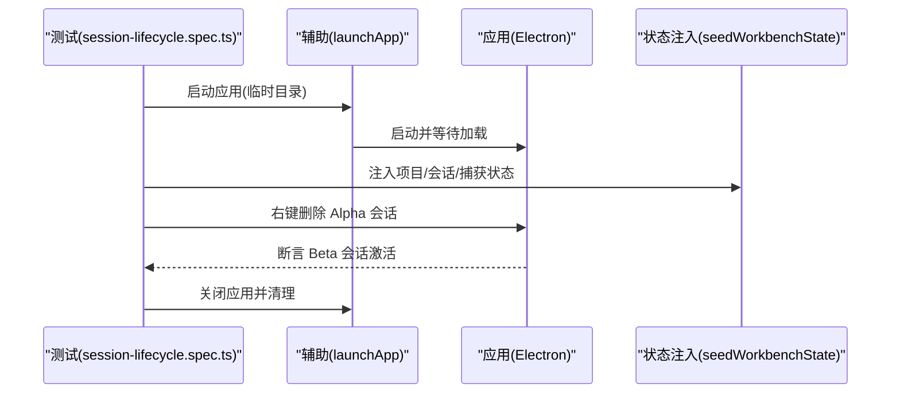
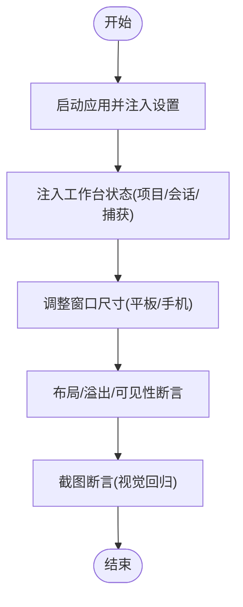
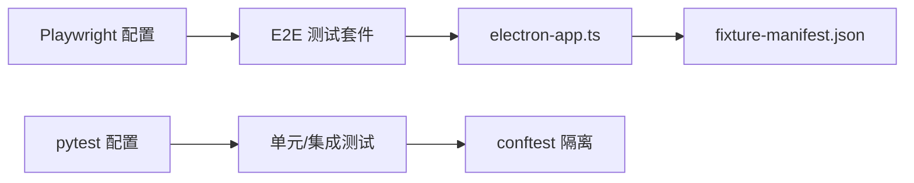

# 测试策略

<cite>
**本文引用的文件**
- [playwright.config.ts](file://playwright.config.ts)
- [package.json](file://package.json)
- [resources/tools/tests/conftest.py](file://resources/tools/tests/conftest.py)
- [resources/tools/pytest.ini](file://resources/tools/pytest.ini)
- [resources/tools/pyproject.toml](file://resources/tools/pyproject.toml)
- [resources/tools/tests/test_context_snapshot.py](file://resources/tools/tests/test_context_snapshot.py)
- [resources/tools/tests/test_runtime_materializer.py](file://resources/tools/tests/test_runtime_materializer.py)
- [e2e/helpers/electron-app.ts](file://e2e/helpers/electron-app.ts)
- [e2e/fixtures/fixture-manifest.json](file://e2e/fixtures/fixture-manifest.json)
- [e2e/session-lifecycle.spec.ts](file://e2e/session-lifecycle.spec.ts)
- [e2e/workbench-visual.spec.ts](file://e2e/workbench-visual.spec.ts)
- [resources/tools/tests/fixtures/README.md](file://resources/tools/tests/fixtures/README.md)
</cite>

## 目录
1. [引言](#引言)
2. [项目结构](#项目结构)
3. [核心组件](#核心组件)
4. [架构总览](#架构总览)
5. [详细组件分析](#详细组件分析)
6. [依赖关系分析](#依赖关系分析)
7. [性能考量](#性能考量)
8. [故障排除指南](#故障排除指南)
9. [结论](#结论)
10. [附录](#附录)

## 引言
本测试策略文档面向 RDC-Agent 项目的测试体系，系统化阐述测试金字塔（单元测试、集成测试、端到端测试）的组织与实施方式，重点覆盖 Playwright 端到端测试的配置与实现、测试用例设计与断言策略、测试数据管理、测试环境搭建（含测试数据库、模拟服务与隔离机制）、持续集成中的测试流程（自动化执行、结果报告与质量门禁）、测试最佳实践（用例编写、覆盖率要求、性能测试），以及测试调试技巧、故障排除与维护建议，并给出可扩展与改进方向。

## 项目结构
RDC-Agent 的测试相关布局主要分为三层：
- Python 工具层（rdx-tools）：使用 pytest 进行单元与集成测试，具备标记化分类与运行隔离能力。
- Electron 桌面应用层：基于 Playwright 的端到端测试，通过自定义启动器与测试夹具管理临时用户数据与工作区。
- 固定夹具（fixtures）：集中管理测试所需的 .rdc 捕获文件清单，便于复现与回归。

图表来源
- [playwright.config.ts:1-26](file://playwright.config.ts#L1-L26)
- [resources/tools/pytest.ini:1-9](file://resources/tools/pytest.ini#L1-L9)
- [resources/tools/pyproject.toml:34-43](file://resources/tools/pyproject.toml#L34-L43)
- [resources/tools/tests/conftest.py:1-44](file://resources/tools/tests/conftest.py#L1-L44)
- [e2e/helpers/electron-app.ts:1-170](file://e2e/helpers/electron-app.ts#L1-L170)
- [e2e/fixtures/fixture-manifest.json:1-22](file://e2e/fixtures/fixture-manifest.json#L1-L22)

章节来源
- [playwright.config.ts:1-26](file://playwright.config.ts#L1-L26)
- [resources/tools/pytest.ini:1-9](file://resources/tools/pytest.ini#L1-L9)
- [resources/tools/pyproject.toml:34-43](file://resources/tools/pyproject.toml#L34-L43)
- [resources/tools/tests/conftest.py:1-44](file://resources/tools/tests/conftest.py#L1-L44)
- [e2e/helpers/electron-app.ts:1-170](file://e2e/helpers/electron-app.ts#L1-L170)
- [e2e/fixtures/fixture-manifest.json:1-22](file://e2e/fixtures/fixture-manifest.json#L1-L22)

## 核心组件
- Playwright 端到端测试框架：统一测试目录、超时、重试、截图与跟踪策略，按项目划分（electron）。
- Python pytest 测试框架：集中于 rdx-tools 子模块，提供标记分类（unit/contract/fixture_integration/gpu_live）与自动状态隔离。
- E2E 辅助工具：封装 Electron 应用启动、临时用户数据与工作区管理、设置持久化与调试路由配置等。
- 测试夹具：集中管理 .rdc 捕获文件清单，支持复制到临时工作区以供测试使用。

章节来源
- [playwright.config.ts:1-26](file://playwright.config.ts#L1-L26)
- [resources/tools/pytest.ini:1-9](file://resources/tools/pytest.ini#L1-L9)
- [resources/tools/pyproject.toml:34-43](file://resources/tools/pyproject.toml#L34-L43)
- [resources/tools/tests/conftest.py:1-44](file://resources/tools/tests/conftest.py#L1-L44)
- [e2e/helpers/electron-app.ts:1-170](file://e2e/helpers/electron-app.ts#L1-L170)
- [e2e/fixtures/fixture-manifest.json:1-22](file://e2e/fixtures/fixture-manifest.json#L1-L22)

## 架构总览
下图展示从命令行到测试执行再到断言与报告的整体流程，涵盖 Playwright 与 pytest 的协作边界与隔离策略。

图表来源
- [package.json:15-15](file://package.json#L15-L15)
- [playwright.config.ts:4-25](file://playwright.config.ts#L4-L25)
- [e2e/helpers/electron-app.ts:26-76](file://e2e/helpers/electron-app.ts#L26-L76)
- [e2e/fixtures/fixture-manifest.json:1-22](file://e2e/fixtures/fixture-manifest.json#L1-L22)
- [resources/tools/tests/conftest.py:27-44](file://resources/tools/tests/conftest.py#L27-L44)

## 详细组件分析

### Playwright 端到端测试配置与实现
- 测试目录与项目划分：统一在 e2e 目录下，按 electron 项目运行，匹配所有 .spec.ts 文件。
- 超时与重试：单测超时较长，重试为 0，确保失败快速暴露。
- 截图与跟踪：禁用动画、隐藏光标、CSS 缩放，首次重试时开启 trace，仅在失败时截图，降低噪声。
- 项目结构：单一 electron 项目，便于统一管理浏览器/桌面应用行为。

章节来源
- [playwright.config.ts:4-25](file://playwright.config.ts#L4-L25)

### E2E 辅助工具与应用生命周期
- 启动与隔离：创建临时 tempDir、userDataDir、workspaceDir，复制 fixture 到工作区，注入测试模式与路径变量，等待加载完成。
- 设置持久化：通过 window.electronAPI.settings.get/set 注入 LLM 提供商与代理路由，确保调试链路可用。
- 关闭与清理：关闭应用并递归删除临时目录，避免磁盘污染。

章节来源
- [e2e/helpers/electron-app.ts:26-76](file://e2e/helpers/electron-app.ts#L26-L76)
- [e2e/helpers/electron-app.ts:96-153](file://e2e/helpers/electron-app.ts#L96-L153)
- [e2e/helpers/electron-app.ts:158-170](file://e2e/helpers/electron-app.ts#L158-L170)

### 测试夹具与数据管理
- 夹具清单：fixture-manifest.json 描述 .rdc 捕获来源、角色与描述，辅助测试复现实战场景。
- 数据复制：启动时将清单中的 .rdc 文件复制到临时工作区，保证测试可重复且不受外部路径影响。
- 夹具策略说明：当前仓库未内置可公开分发的 .rdc 样本，需通过外部参数传入或后续补齐。

章节来源
- [e2e/fixtures/fixture-manifest.json:1-22](file://e2e/fixtures/fixture-manifest.json#L1-L22)
- [e2e/helpers/electron-app.ts:34-46](file://e2e/helpers/electron-app.ts#L34-L46)
- [resources/tools/tests/fixtures/README.md:1-16](file://resources/tools/tests/fixtures/README.md#L1-L16)

### 测试用例设计与断言策略
- 行为驱动：围绕用户任务流与界面交互设计用例，如会话生命周期、工作台视觉回归、终端面板展开等。
- 断言类型：包含可见性断言、截图断言、布局与溢出断言、元素是否处于视口内等。
- 状态注入：通过 window.electronAPI 注入项目、会话、捕获、上下文快照等状态，确保测试前置条件稳定一致。

章节来源
- [e2e/session-lifecycle.spec.ts:16-69](file://e2e/session-lifecycle.spec.ts#L16-L69)
- [e2e/workbench-visual.spec.ts:271-323](file://e2e/workbench-visual.spec.ts#L271-L323)
- [e2e/workbench-visual.spec.ts:363-391](file://e2e/workbench-visual.spec.ts#L363-L391)
- [e2e/workbench-visual.spec.ts:440-458](file://e2e/workbench-visual.spec.ts#L440-L458)

### Python 单元/集成测试（pytest）
- 标记分类：unit（无需捕获夹具）、contract（目录/适配器契约校验）、fixture_integration（需要首方捕获夹具）、gpu_live（需要真实渲染/GPU 环境）。
- 自动隔离：conftest 在每次测试前后清理运行时状态文件与上下文快照，确保测试间无副作用。
- 典型用例：
  - 上下文快照更新与获取往返一致性、非法字段更新错误处理。
  - 后处理上下文快照对最近产物的追踪。
  - 基于上下文焦点像素的宏调用断言。
  - 显式 context_id 的操作与查询一致性。

章节来源
- [resources/tools/pytest.ini:4-8](file://resources/tools/pytest.ini#L4-L8)
- [resources/tools/pyproject.toml:37-42](file://resources/tools/pyproject.toml#L37-L42)
- [resources/tools/tests/conftest.py:27-44](file://resources/tools/tests/conftest.py#L27-L44)
- [resources/tools/tests/test_context_snapshot.py:12-36](file://resources/tools/tests/test_context_snapshot.py#L12-L36)
- [resources/tools/tests/test_context_snapshot.py:38-59](file://resources/tools/tests/test_context_snapshot.py#L38-L59)
- [resources/tools/tests/test_context_snapshot.py:61-79](file://resources/tools/tests/test_context_snapshot.py#L61-L79)
- [resources/tools/tests/test_context_snapshot.py:82-109](file://resources/tools/tests/test_context_snapshot.py#L82-L109)

### 运行时材料化测试（集成侧）
- 场景目标：验证运行时材料化稳定性、缓存保留与原子写失败回滚。
- 方法：准备模拟二进制与清单，两次材料化比对 runtime_id 与缓存根路径，断言文件内容与存在性；模拟原子交换失败，断言异常并保留旧缓存。

章节来源
- [resources/tools/tests/test_runtime_materializer.py:71-88](file://resources/tools/tests/test_runtime_materializer.py#L71-L88)
- [resources/tools/tests/test_runtime_materializer.py:90-110](file://resources/tools/tests/test_runtime_materializer.py#L90-L110)

### 测试序列与流程图示例

#### 端到端会话生命周期流程

图表来源
- [e2e/session-lifecycle.spec.ts:8-14](file://e2e/session-lifecycle.spec.ts#L8-L14)
- [e2e/session-lifecycle.spec.ts:23-69](file://e2e/session-lifecycle.spec.ts#L23-L69)
- [e2e/helpers/electron-app.ts:26-76](file://e2e/helpers/electron-app.ts#L26-L76)

#### 视觉回归断言流程

图表来源
- [e2e/workbench-visual.spec.ts:245-269](file://e2e/workbench-visual.spec.ts#L245-L269)
- [e2e/workbench-visual.spec.ts:440-458](file://e2e/workbench-visual.spec.ts#L440-L458)
- [e2e/workbench-visual.spec.ts:271-323](file://e2e/workbench-visual.spec.ts#L271-L323)

## 依赖关系分析
- Playwright 与 Electron：通过 @playwright/test 与 electron 启动器交互，借助辅助工具注入临时目录与设置。
- pytest 与 rdx-tools：通过 conftest 实现运行时状态隔离，避免跨测试污染。
- 夹具与测试：fixture-manifest.json 作为外部输入源，被辅助工具复制到临时工作区，供 E2E 测试使用。

图表来源
- [playwright.config.ts:4-25](file://playwright.config.ts#L4-L25)
- [e2e/helpers/electron-app.ts:26-76](file://e2e/helpers/electron-app.ts#L26-L76)
- [e2e/fixtures/fixture-manifest.json:1-22](file://e2e/fixtures/fixture-manifest.json#L1-L22)
- [resources/tools/pytest.ini:1-9](file://resources/tools/pytest.ini#L1-L9)
- [resources/tools/tests/conftest.py:27-44](file://resources/tools/tests/conftest.py#L27-L44)

章节来源
- [playwright.config.ts:4-25](file://playwright.config.ts#L4-L25)
- [resources/tools/pytest.ini:1-9](file://resources/tools/pytest.ini#L1-L9)
- [resources/tools/tests/conftest.py:27-44](file://resources/tools/tests/conftest.py#L27-L44)
- [e2e/helpers/electron-app.ts:26-76](file://e2e/helpers/electron-app.ts#L26-L76)
- [e2e/fixtures/fixture-manifest.json:1-22](file://e2e/fixtures/fixture-manifest.json#L1-L22)

## 性能考量
- 截图与动画控制：禁用动画、隐藏光标、CSS 缩放，减少视觉断言的抖动与耗时。
- 截图触发策略：仅在失败时截图，降低磁盘 IO 与报告体积。
- 超时与重试：长超时与零重试有助于快速定位问题，避免 CI 中无意义的反复尝试。
- 窗口尺寸与布局断言：通过不同分辨率断言，提前发现布局性能问题。
- 运行时材料化：缓存命中与原子写保护，避免重复拷贝与竞态。

章节来源
- [playwright.config.ts:8-18](file://playwright.config.ts#L8-L18)
- [e2e/workbench-visual.spec.ts:440-458](file://e2e/workbench-visual.spec.ts#L440-L458)
- [resources/tools/tests/test_runtime_materializer.py:71-88](file://resources/tools/tests/test_runtime_materializer.py#L71-L88)

## 故障排除指南
- 应用未加载完成：检查启动参数与临时目录注入，确认加载屏移除逻辑与等待时间。
- 设置未持久化：确认 configureTestDebuggerRoutes 是否成功写入并校验 persisted 结果。
- 截图失败或不稳定：检查禁用动画与隐藏光标配置，确保失败时截图已启用。
- 夹具缺失：确认 fixture-manifest.json 中的 .rdc 路径是否存在，辅助工具是否正确复制。
- 运行时状态污染：确认 conftest 的自动清理是否生效，必要时手动清理临时目录。

章节来源
- [e2e/helpers/electron-app.ts:26-76](file://e2e/helpers/electron-app.ts#L26-L76)
- [e2e/helpers/electron-app.ts:96-153](file://e2e/helpers/electron-app.ts#L96-L153)
- [playwright.config.ts:8-18](file://playwright.config.ts#L8-L18)
- [e2e/fixtures/fixture-manifest.json:1-22](file://e2e/fixtures/fixture-manifest.json#L1-L22)
- [resources/tools/tests/conftest.py:27-44](file://resources/tools/tests/conftest.py#L27-L44)

## 结论
RDC-Agent 的测试体系以 Playwright 端到端测试为核心，结合 pytest 单元/集成测试与严格的运行时隔离策略，形成完整的测试金字塔。通过夹具清单与辅助工具实现稳定的测试数据与环境管理，配合禁用动画、失败截图与跟踪等策略提升可维护性与可诊断性。建议在 CI 中引入覆盖率统计与性能回归阈值，并逐步补齐内置 .rdc 夹具，以进一步增强测试的可重复性与自动化水平。

## 附录

### 测试金字塔组织与职责
- 单元测试（pytest）：快速、稳定、聚焦函数级行为，使用标记分类与自动隔离。
- 集成测试（pytest）：验证模块间协作与运行时材料化、上下文快照等关键流程。
- 端到端测试（Playwright）：覆盖用户任务流与界面交互，结合夹具与状态注入保障可重复性。

章节来源
- [resources/tools/pytest.ini:4-8](file://resources/tools/pytest.ini#L4-L8)
- [resources/tools/pyproject.toml:37-42](file://resources/tools/pyproject.toml#L37-L42)
- [resources/tools/tests/conftest.py:27-44](file://resources/tools/tests/conftest.py#L27-L44)
- [playwright.config.ts:4-25](file://playwright.config.ts#L4-L25)

### 测试环境搭建要点
- 测试数据库：当前未见专用测试数据库配置，建议在 CI 中为 Python 测试提供独立 SQLite 或内存数据库，并在 conftest 中进行初始化与清理。
- 模拟服务：通过 window.electronAPI 注入虚拟状态与设置，减少对外部服务依赖。
- 隔离机制：临时目录、用户数据与工作区隔离，测试前后自动清理，避免状态泄漏。

章节来源
- [e2e/helpers/electron-app.ts:26-76](file://e2e/helpers/electron-app.ts#L26-L76)
- [resources/tools/tests/conftest.py:27-44](file://resources/tools/tests/conftest.py#L27-L44)

### 持续集成中的测试流程
- 自动化执行：通过 npm 脚本触发 Playwright 与 pytest，分别输出报告与退出码。
- 结果报告：Playwright 默认生成 HTML 报告与 trace，pytest 可结合插件输出 XML 报告。
- 质量门禁：建议在 CI 中设置失败即停、覆盖率阈值与性能回归阈值，确保主干质量。

章节来源
- [package.json:15-15](file://package.json#L15-L15)
- [playwright.config.ts:4-25](file://playwright.config.ts#L4-L25)

### 测试最佳实践
- 用例编写：以用户任务为中心，拆分前置条件、步骤与断言；优先使用语义化选择器与稳定的数据注入。
- 覆盖率要求：建议为关键模块设定最小覆盖率阈值，并定期审查低覆盖区域。
- 性能测试：结合窗口尺寸断言与截图策略，建立视觉回归基线；对关键交互增加时延断言。

章节来源
- [e2e/workbench-visual.spec.ts:271-323](file://e2e/workbench-visual.spec.ts#L271-L323)
- [e2e/workbench-visual.spec.ts:440-458](file://e2e/workbench-visual.spec.ts#L440-L458)

### 测试调试技巧与维护建议
- 调试技巧：启用首次重试时的 trace，失败截图，固定时间戳与布局断言，缩小问题范围。
- 维护建议：定期更新夹具清单与注入状态，补充内置 .rdc 样本，完善标记分类与隔离逻辑。

章节来源
- [playwright.config.ts:15-18](file://playwright.config.ts#L15-L18)
- [e2e/workbench-visual.spec.ts:363-391](file://e2e/workbench-visual.spec.ts#L363-L391)
- [resources/tools/tests/fixtures/README.md:1-16](file://resources/tools/tests/fixtures/README.md#L1-L16)