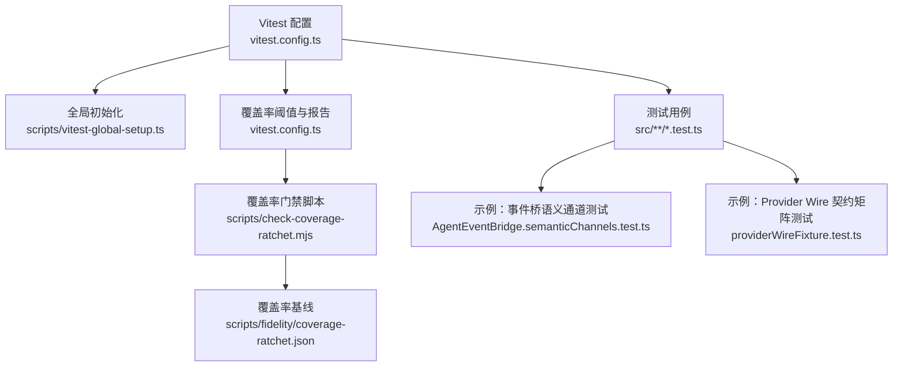
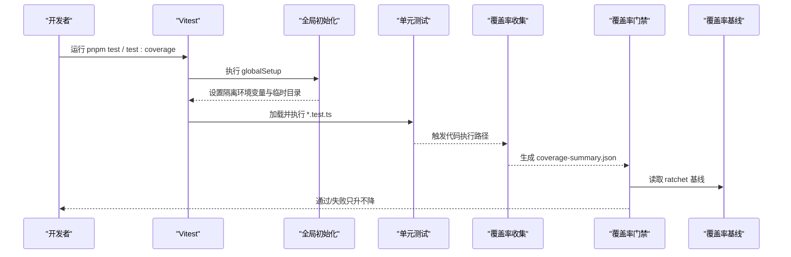
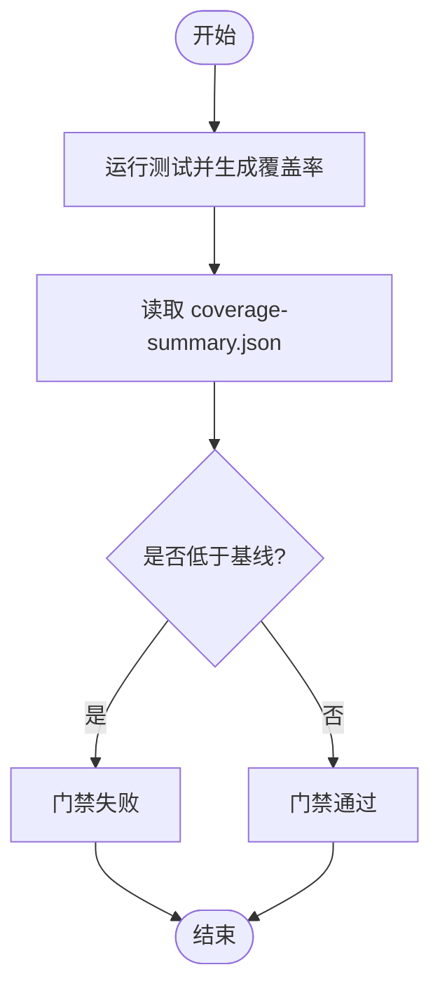
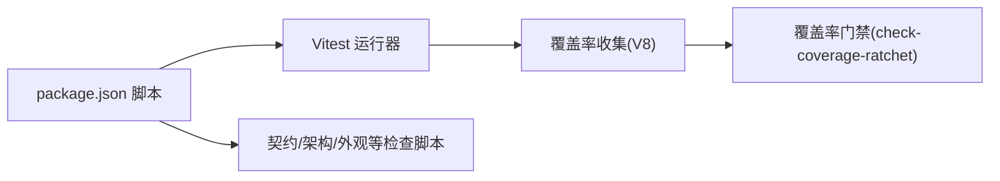

# 测试策略

<cite>
**本文引用的文件**
- [vitest.config.ts](file://vitest.config.ts)
- [package.json](file://package.json)
- [vitest-global-setup.ts](file://scripts/vitest-global-setup.ts)
- [check-coverage-ratchet.mjs](file://scripts/check-coverage-ratchet.mjs)
- [coverage-ratchet.json](file://scripts/fidelity/coverage-ratchet.json)
- [AgentEventBridge.semanticChannels.test.ts](file://src/main/agent-runtime/AgentEventBridge.semanticChannels.test.ts)
- [providerWireFixture.test.ts](file://src/main/testing/contracts/providerWireFixture.test.ts)
- [isolatedRdxTools.ts](file://src/main/testing/isolatedRdxTools.ts)
- [browser-qa-surface.md](file://docs/architecture/browser-qa-surface.md)
- [work-process-cot README.md](file://test/work-process-cot/README.md)
</cite>

## 目录
1. [简介](#简介)
2. [项目结构](#项目结构)
3. [核心组件](#核心组件)
4. [架构总览](#架构总览)
5. [详细组件分析](#详细组件分析)
6. [依赖分析](#依赖分析)
7. [性能考虑](#性能考虑)
8. [故障排查指南](#故障排查指南)
9. [结论](#结论)
10. [附录](#附录)

## 简介
本测试策略面向 RDC-Agent，覆盖单元测试、集成测试与端到端（E2E）验收测试的编写与执行规范；明确测试框架配置、用例设计原则、覆盖率门槛与“只升不降”的基线管控；说明模拟服务、测试数据管理、测试环境隔离；给出性能与安全测试方法；并定义持续集成中的测试流程与自动化最佳实践。

## 项目结构
RDC-Agent 使用 Vitest 作为 Node 侧测试运行器，测试文件以 .test.ts 命名约定组织在 src 目录下；通过全局初始化脚本隔离用户数据与临时目录；覆盖率由 V8 提供并以“ratchet”机制进行只升不降门禁。

图表来源
- [vitest.config.ts:5-72](file://vitest.config.ts#L5-L72)
- [vitest-global-setup.ts:5-20](file://scripts/vitest-global-setup.ts#L5-L20)
- [check-coverage-ratchet.mjs:1-88](file://scripts/check-coverage-ratchet.mjs#L1-L88)
- [coverage-ratchet.json:1-7](file://scripts/fidelity/coverage-ratchet.json#L1-L7)

章节来源
- [vitest.config.ts:5-82](file://vitest.config.ts#L5-L82)
- [package.json:19-76](file://package.json#L19-L76)
- [vitest-global-setup.ts:5-20](file://scripts/vitest-global-setup.ts#L5-L20)

## 核心组件
- 测试运行与发现
  - 使用 Vitest，启用全局 API，Node 环境，匹配 src/**/*.test.ts。
  - 别名 @main/@shared/@renderer 指向对应源码目录，便于跨层引用。
- 测试环境隔离
  - 全局初始化创建独立临时根目录，设置 RDC_AGENT_HOME、RDC_AGENT_USER_DATA、RDC_AGENT_QA_INSTANCE_ID，并在结束后清理。
- 覆盖率与质量门禁
  - 使用 V8 收集覆盖率，输出 text/lcov/json-summary。
  - 仅统计 main/shared 代码，排除 Electron/IPC/工具/会话编排等进程或桌面绑定模块。
  - 通过 check-coverage-ratchet.mjs 对比 coverage-ratchet.json，确保指标只升不降。
- 命令入口
  - test/test:watch/test:coverage 等脚本统一入口，便于本地开发与 CI 调用。

章节来源
- [vitest.config.ts:5-82](file://vitest.config.ts#L5-L82)
- [vitest-global-setup.ts:5-20](file://scripts/vitest-global-setup.ts#L5-L20)
- [check-coverage-ratchet.mjs:1-88](file://scripts/check-coverage-ratchet.mjs#L1-L88)
- [coverage-ratchet.json:1-7](file://scripts/fidelity/coverage-ratchet.json#L1-L7)
- [package.json:19-76](file://package.json#L19-L76)

## 架构总览
下图展示从测试执行到覆盖率门禁的完整链路，以及关键隔离点与断言点。

图表来源
- [vitest.config.ts:5-72](file://vitest.config.ts#L5-L72)
- [vitest-global-setup.ts:5-20](file://scripts/vitest-global-setup.ts#L5-L20)
- [check-coverage-ratchet.mjs:1-88](file://scripts/check-coverage-ratchet.mjs#L1-L88)

## 详细组件分析

### 单元测试策略
- 范围与目标
  - 聚焦主进程逻辑与共享库（main/shared），排除 Electron/IPC/工具/会话编排等进程或桌面绑定模块。
  - 保证核心算法、协议转换、状态机、权限与能力探测等关键路径具备高覆盖与强断言。
- 用例设计要点
  - 输入边界与异常分支：如空输入、超大输出截断、错误码处理。
  - 语义等价性：如事件桥对 providerOutputRef 的透传一致性。
  - 并发与稳定性：工具调度、上下文窗口、恢复诊断等。
- 示例
  - 事件桥语义通道测试验证文本、思考、工具调用的 source refs 在共享事件中保持一致。
  - Provider Wire 契约矩阵测试覆盖多协议流式响应解析、安全头脱敏、请求体形状。

章节来源
- [vitest.config.ts:12-64](file://vitest.config.ts#L12-L64)
- [AgentEventBridge.semanticChannels.test.ts:1-115](file://src/main/agent-runtime/AgentEventBridge.semanticChannels.test.ts#L1-L115)
- [providerWireFixture.test.ts:49-869](file://src/main/testing/contracts/providerWireFixture.test.ts#L49-L869)

### 集成测试策略
- 目标
  - 验证跨模块协作：如 Agent 运行时、会话持久化、Hook 引擎、知识系统、工作区资源等。
  - 通过 fixtures 与契约测试保障外部协议与内部模型的一致性。
- 方法与工具
  - 使用 fixtures 与 golden stream 校验适配器行为。
  - 通过 isolatedRdxTools 将原生 CLI 工具以符号链接方式挂载到隔离目录，避免污染真实环境。
- 示例
  - 契约测试矩阵：为每个协议构建最小 RequestPlan，断言安全头、协议契约、流式解析结果。
  - 工具隔离：在临时目录中建立 tools 子树，注入 RDX_TOOLS_ROOT，使测试可独立运行。

章节来源
- [providerWireFixture.test.ts:220-324](file://src/main/testing/contracts/providerWireFixture.test.ts#L220-L324)
- [providerWireFixture.test.ts:596-653](file://src/main/testing/contracts/providerWireFixture.test.ts#L596-L653)
- [isolatedRdxTools.ts:1-15](file://src/main/testing/isolatedRdxTools.ts#L1-L15)

### 端到端（E2E）与验收测试策略
- Browser QA 表面
  - 通过一次性 /qa 引导建立同源 cookie，随后访问 /app；支持 dev 模式反向代理与 HMR。
  - 严格限制 payload 大小，除特定通道外默认上限 1 MiB。
  - 验收需显式指定 userData 或使用隔离临时目录，避免触碰真实 ~/.rdx。
- Work Process CoT 静态验收
  - 提供一组 HTML 场景页面用于视觉与交互验收，不接入 vitest/CI，不改动 renderer。
  - 通过导航、播放控制、语言与主题切换验证 UI 表现。
- 执行建议
  - 使用 smoke 脚本启动浏览器/桌面健康检查。
  - 在 CI 中先执行 unit+integration，再按需触发 browser QA 与 visual fidelity 检查。

章节来源
- [browser-qa-surface.md:1-50](file://docs/architecture/browser-qa-surface.md#L1-L50)
- [work-process-cot README.md:1-75](file://test/work-process-cot/README.md#L1-L75)
- [package.json:71-72](file://package.json#L71-L72)

### 测试数据与模拟服务
- 数据隔离
  - 全局初始化创建唯一临时根目录，设置 RDC_AGENT_HOME/RDC_AGENT_USER_DATA，确保每次运行互不影响。
- 固定数据与黄金流
  - 使用 fixtures 目录下的流式响应样本与 expected.md 断言，保证协议适配稳定。
- 模拟与桩
  - 通过构造最小 RequestPlan、Mock 网络响应、注入环境变量等方式隔离外部依赖。
  - 对原生 CLI 工具采用符号链接挂载，避免复制与污染。

章节来源
- [vitest-global-setup.ts:5-20](file://scripts/vitest-global-setup.ts#L5-L20)
- [providerWireFixture.test.ts:288-324](file://src/main/testing/contracts/providerWireFixture.test.ts#L288-L324)
- [isolatedRdxTools.ts:1-15](file://src/main/testing/isolatedRdxTools.ts#L1-L15)

### 覆盖率要求与基线管理
- 收集范围
  - 仅统计 main/shared 代码，排除 Electron/IPC/工具/会话编排/遥测/工作线程等。
- 阈值与报告
  - 行/函数/分支/语句均设下限；输出 text/lcov/json-summary。
- 只升不降门禁
  - 通过 check-coverage-ratchet.mjs 比较 coverage-summary.json 与 scripts/fidelity/coverage-ratchet.json，任一指标下降即失败。
  - 首次运行可通过环境变量初始化基线文件。

图表来源
- [check-coverage-ratchet.mjs:1-88](file://scripts/check-coverage-ratchet.mjs#L1-L88)
- [coverage-ratchet.json:1-7](file://scripts/fidelity/coverage-ratchet.json#L1-L7)

章节来源
- [vitest.config.ts:12-72](file://vitest.config.ts#L12-L72)
- [check-coverage-ratchet.mjs:1-88](file://scripts/check-coverage-ratchet.mjs#L1-L88)
- [coverage-ratchet.json:1-7](file://scripts/fidelity/coverage-ratchet.json#L1-L7)

### 性能测试指导
- 单元级性能
  - 针对大输出截断、流式解析、并发工具调度等路径添加耗时与内存断言，避免回归。
- 集成级压测
  - 使用 fixtures 构造长流或多并发场景，评估解析吞吐与内存峰值。
- 端到端基准
  - 在浏览器 QA 模式下录制关键路径耗时（如对话轮次、工具调用链），纳入回归基线。
- 建议
  - 使用 --coverage 与自定义 reporter 输出性能指标；在 CI 中记录历史趋势。

[本节为通用指导，不直接分析具体文件]

### 安全测试指导
- 敏感信息脱敏
  - 断言安全头不包含密钥、令牌等敏感字段；流式响应样本不得包含敏感内容。
- 权限与能力探测
  - 对能力探针失败进行分类与记录，确保配额耗尽等场景被正确降级与重试。
- 输入校验与限流
  - 对浏览器 QA 的 JSON body 大小进行限制，防止滥用；对特定通道放宽时需有通道标识与校验。
- 建议
  - 在契约测试中加入“黑名单”正则断言；在集成测试中注入异常凭据验证拒绝路径。

章节来源
- [providerWireFixture.test.ts:856-869](file://src/main/testing/contracts/providerWireFixture.test.ts#L856-L869)
- [browser-qa-surface.md:1-50](file://docs/architecture/browser-qa-surface.md#L1-L50)

## 依赖分析
- 测试框架与工具
  - Vitest、@vitest/runner、@vitest/coverage-v8。
- 脚本与命令
  - test/test:watch/test:coverage 统一入口；check:* 系列脚本用于架构、契约、外观、覆盖率等门禁。
- 外部依赖
  - 通过 fixtures 与协议适配器间接依赖 LLM 提供商协议；测试中通过 Mock 与固定流规避真实网络。

图表来源
- [package.json:19-76](file://package.json#L19-L76)
- [check-coverage-ratchet.mjs:1-88](file://scripts/check-coverage-ratchet.mjs#L1-L88)

章节来源
- [package.json:19-76](file://package.json#L19-L76)

## 性能考虑
- 测试并行
  - Vitest 默认并行执行测试，注意共享状态隔离（已通过全局初始化解决）。
- 覆盖率开销
  - 全量覆盖率可能影响速度，可按模块拆分运行（如 check:hooks、check:skills 等）。
- I/O 与磁盘
  - 临时目录位于系统 tmpdir，避免大量写入；必要时调整超时与重试策略。

[本节为通用指导，不直接分析具体文件]

## 故障排查指南
- 覆盖率门禁失败
  - 确认已运行 test:coverage 生成 coverage-summary.json；若基线缺失，按提示初始化。
  - 检查覆盖率 include/exclude 配置是否误排除了新增代码。
- 测试环境冲突
  - 确认未设置 RDC_AGENT_USE_CANONICAL_USERDATA=1 时不会写入真实用户目录；如需真实数据，请显式指定 userData。
- 浏览器 QA 无法进入
  - 检查一次性 /qa 引导是否成功获取 cookie；确保在同源 /app 下访问；dev 模式需通过反向代理。
- 原生工具不可用
  - 确认 isolatedRdxTools 已正确创建符号链接并注入 RDX_TOOLS_ROOT。

章节来源
- [check-coverage-ratchet.mjs:30-70](file://scripts/check-coverage-ratchet.mjs#L30-L70)
- [vitest-global-setup.ts:5-20](file://scripts/vitest-global-setup.ts#L5-L20)
- [browser-qa-surface.md:1-50](file://docs/architecture/browser-qa-surface.md#L1-L50)
- [isolatedRdxTools.ts:1-15](file://src/main/testing/isolatedRdxTools.ts#L1-L15)

## 结论
RDC-Agent 的测试体系以 Vitest 为核心，结合严格的测试环境隔离、契约驱动的 fixtures、只升不降的覆盖率门禁，以及浏览器 QA 与静态验收页，形成从单元到端到端的完整质量闭环。建议在 CI 中分层执行：单元与集成优先，契约与外观门禁紧随，最后按需触发浏览器 QA 与视觉审计，确保快速反馈与高质量交付。

## 附录
- 常用命令
  - 运行全部测试：pnpm run test
  - 监听模式：pnpm run test:watch
  - 生成覆盖率：pnpm run test:coverage
  - 覆盖率门禁：pnpm run check:coverage-ratchet
  - 浏览器 QA 冒烟：pnpm run smoke:agent-browser
  - 桌面健康冒烟：pnpm run smoke:desktop
- 覆盖率基线更新
  - 首次运行后按提示生成 scripts/fidelity/coverage-ratchet.json；后续变更需经评审提升基线。

章节来源
- [package.json:19-76](file://package.json#L19-L76)
- [check-coverage-ratchet.mjs:56-69](file://scripts/check-coverage-ratchet.mjs#L56-L69)