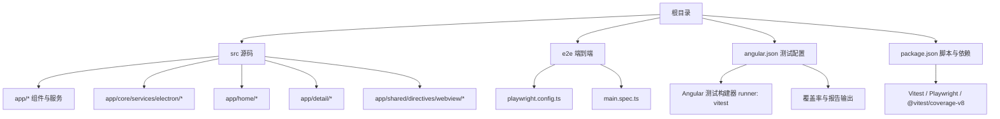
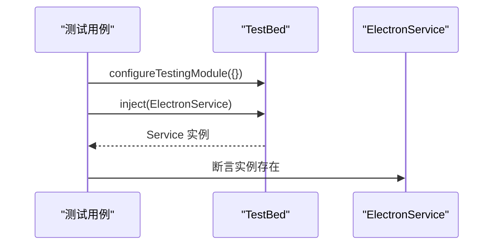
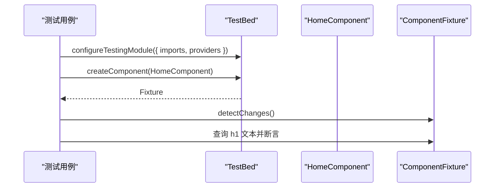
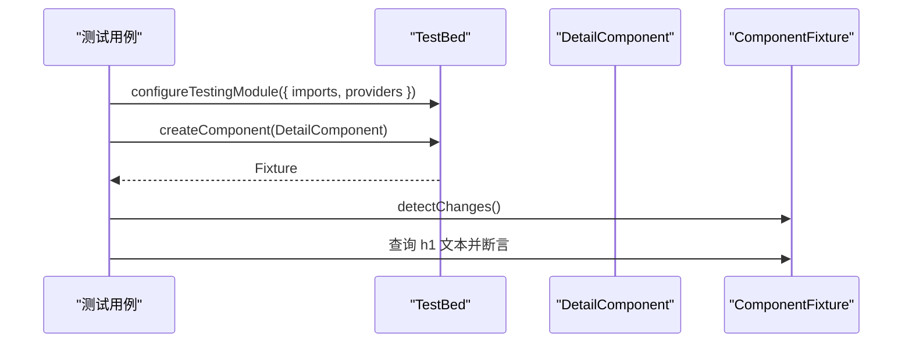
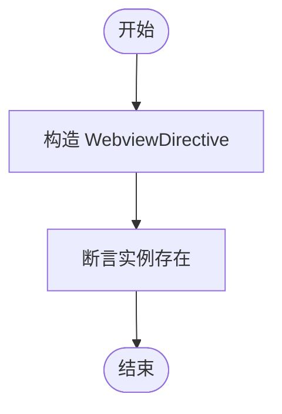
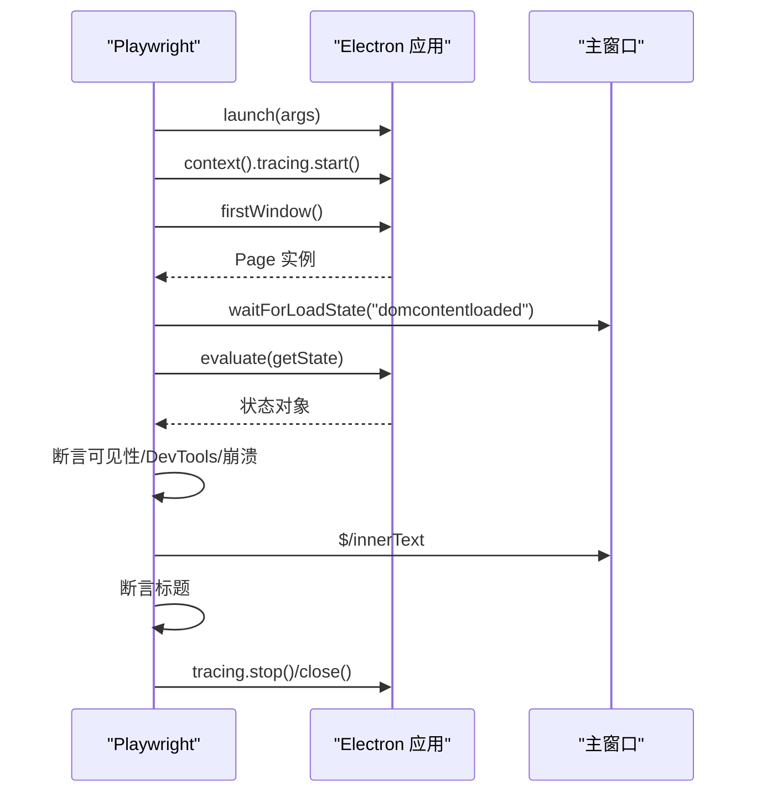
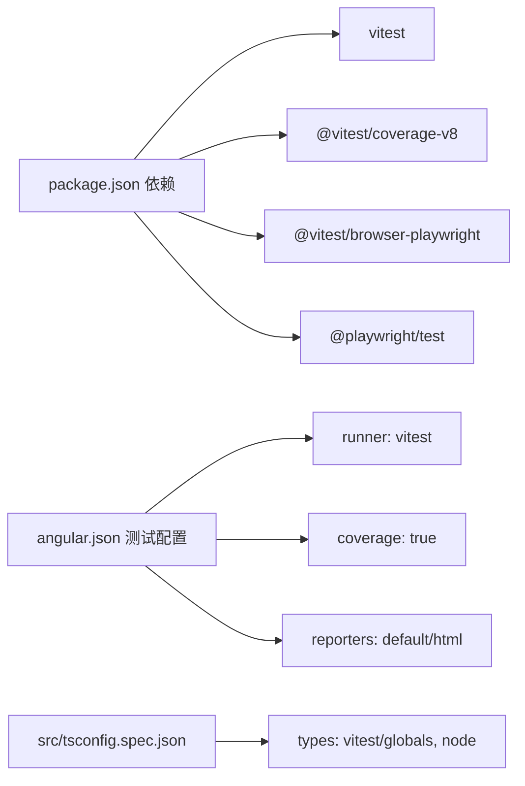

# 测试策略

<cite>
**本文引用的文件**
- [package.json](file://package.json)
- [angular.json](file://angular.json)
- [src/vitest.d.ts](file://src/vitest.d.ts)
- [src/tsconfig.spec.json](file://src/tsconfig.spec.json)
- [e2e/playwright.config.ts](file://e2e/playwright.config.ts)
- [e2e/main.spec.ts](file://e2e/main.spec.ts)
- [src/app/core/services/electron/electron.service.spec.ts](file://src/app/core/services/electron/electron.service.spec.ts)
- [src/app/home/home.component.spec.ts](file://src/app/home/home.component.spec.ts)
- [src/app/detail/detail.component.spec.ts](file://src/app/detail/detail.component.spec.ts)
- [src/app/shared/directives/webview/webview.directive.spec.ts](file://src/app/shared/directives/webview/webview.directive.spec.ts)
- [src/app/core/services/electron/electron.service.ts](file://src/app/core/services/electron/electron.service.ts)
- [src/app/home/home.component.ts](file://src/app/home/home.component.ts)
- [src/app/detail/detail.component.ts](file://src/app/detail/detail.component.ts)
- [src/app/shared/directives/webview/webview.directive.ts](file://src/app/shared/directives/webview/webview.directive.ts)
- [src/app/app.component.ts](file://src/app/app.component.ts)
</cite>

## 目录
1. [引言](#引言)
2. [项目结构](#项目结构)
3. [核心组件](#核心组件)
4. [架构总览](#架构总览)
5. [详细组件分析](#详细组件分析)
6. [依赖分析](#依赖分析)
7. [性能考虑](#性能考虑)
8. [故障排查指南](#故障排查指南)
9. [结论](#结论)
10. [附录](#附录)

## 引言
本测试策略文档面向 Angular + Electron 应用的测试体系，系统性阐述单元测试与端到端测试的配置、组织与执行方式。项目采用 Vitest 作为单元测试运行器，并通过 Angular CLI 的测试构建器进行集成；同时采用 Playwright 进行 Electron 应用的端到端测试。本文将从测试架构、配置要点、断言模式、页面对象与交互模拟、可维护性实践、覆盖率与 CI 执行流程等方面展开，并提供常见问题与优化建议。

## 项目结构
项目采用 Angular CLI 标准工程结构，测试相关的关键目录与文件如下：
- 单元测试：位于各源码模块下的 *.spec.ts 文件，遵循“被测文件同目录同名”的约定
- 端到端测试：位于 e2e 目录，包含 Playwright 配置与测试用例
- 测试工具链：Vitest（单元）+ Playwright（E2E），由 Angular CLI 构建器统一调度

图表来源
- [angular.json:104-127](file://angular.json#L104-L127)
- [package.json:27-47](file://package.json#L27-L47)
- [e2e/playwright.config.ts:1-21](file://e2e/playwright.config.ts#L1-L21)
- [e2e/main.spec.ts:1-60](file://e2e/main.spec.ts#L1-L60)

章节来源
- [angular.json:104-127](file://angular.json#L104-L127)
- [package.json:27-47](file://package.json#L27-L47)

## 核心组件
- 单元测试运行器与配置
  - Angular CLI 使用 Vitest 作为测试运行器，启用浏览器环境与覆盖率统计
  - TypeScript 测试配置包含 Vitest 全局类型与 Node 类型，确保断言与全局可用
  - 测试报告输出至 HTML 并生成 LCOV 报告，便于 CI 展示与覆盖率聚合
- 端到端测试运行器与配置
  - Playwright 配置为 Electron 应用提供 headless 关闭、视口尺寸、慢动作与快照阈值等参数
  - 测试中通过 Electron 应用启动上下文，捕获首窗体并进行断言与截图/追踪输出

章节来源
- [angular.json:104-127](file://angular.json#L104-L127)
- [src/tsconfig.spec.json:1-21](file://src/tsconfig.spec.json#L1-L21)
- [src/vitest.d.ts:1-2](file://src/vitest.d.ts#L1-L2)
- [e2e/playwright.config.ts:1-21](file://e2e/playwright.config.ts#L1-L21)

## 架构总览
下图展示了测试体系在项目中的整体关系：Angular CLI 测试构建器驱动 Vitest 执行单元测试；Playwright 启动 Electron 应用并执行端到端测试；覆盖率与报告由 Vitest 生成并在 CI 中消费。

```mermaid
graph TB
subgraph "单元测试"
V["Vitest 运行器"]
TSC["TypeScript 测试配置<br/>src/tsconfig.spec.json"]
VTYPES["Vitest 全局类型<br/>src/vitest.d.ts"]
end
subgraph "端到端测试"
P["Playwright 运行器"]
PCFG["Playwright 配置<br/>e2e/playwright.config.ts"]
E2E["E2E 测试用例<br/>e2e/main.spec.ts"]
end
CLI["Angular CLI 测试构建器<br/>angular.json:test"] --> V
V --> TSC
TSC --> VTYPES
P --> PCFG
P --> E2E
CLI -.->|"脚本命令"| NPM["NPM 脚本<br/>package.json: scripts.test / scripts.e2e"]
```

图表来源
- [angular.json:104-127](file://angular.json#L104-L127)
- [src/tsconfig.spec.json:1-21](file://src/tsconfig.spec.json#L1-L21)
- [src/vitest.d.ts:1-2](file://src/vitest.d.ts#L1-L2)
- [e2e/playwright.config.ts:1-21](file://e2e/playwright.config.ts#L1-L21)
- [e2e/main.spec.ts:1-60](file://e2e/main.spec.ts#L1-L60)
- [package.json:27-47](file://package.json#L27-L47)

## 详细组件分析

### 单元测试：ElectronService
- 目标：验证 ElectronService 的实例化与 isElectron 判断逻辑
- 断言模式：通过 TestBed 注入服务并断言其存在性
- 可扩展点：可在测试中注入假实现以覆盖渲染进程条件分支

图表来源
- [src/app/core/services/electron/electron.service.spec.ts:1-13](file://src/app/core/services/electron/electron.service.spec.ts#L1-L13)
- [src/app/core/services/electron/electron.service.ts:1-57](file://src/app/core/services/electron/electron.service.ts#L1-L57)

章节来源
- [src/app/core/services/electron/electron.service.spec.ts:1-13](file://src/app/core/services/electron/electron.service.spec.ts#L1-L13)
- [src/app/core/services/electron/electron.service.ts:1-57](file://src/app/core/services/electron/electron.service.ts#L1-L57)

### 单元测试：HomeComponent
- 目标：验证 HomeComponent 初始化与标题渲染
- 断言模式：通过 ComponentFixture 获取原生元素并断言文本内容
- 依赖注入：使用 provideRouter 提供路由支持，导入 TranslateModule 以解析国际化键

图表来源
- [src/app/home/home.component.spec.ts:1-34](file://src/app/home/home.component.spec.ts#L1-L34)
- [src/app/home/home.component.ts:1-19](file://src/app/home/home.component.ts#L1-L19)

章节来源
- [src/app/home/home.component.spec.ts:1-34](file://src/app/home/home.component.spec.ts#L1-L34)
- [src/app/home/home.component.ts:1-19](file://src/app/home/home.component.ts#L1-L19)

### 单元测试：DetailComponent
- 目标：验证 DetailComponent 初始化与标题渲染
- 断言模式：与 HomeComponent 类似，断言 h1 标题文本
- 依赖注入：同样提供路由与翻译模块支持

图表来源
- [src/app/detail/detail.component.spec.ts:1-34](file://src/app/detail/detail.component.spec.ts#L1-L34)
- [src/app/detail/detail.component.ts:1-21](file://src/app/detail/detail.component.ts#L1-L21)

章节来源
- [src/app/detail/detail.component.spec.ts:1-34](file://src/app/detail/detail.component.spec.ts#L1-L34)
- [src/app/detail/detail.component.ts:1-21](file://src/app/detail/detail.component.ts#L1-L21)

### 单元测试：WebviewDirective
- 目标：验证 WebviewDirective 的实例化
- 断言模式：构造指令并断言其存在性

图表来源
- [src/app/shared/directives/webview/webview.directive.spec.ts:1-9](file://src/app/shared/directives/webview/webview.directive.spec.ts#L1-L9)
- [src/app/shared/directives/webview/webview.directive.ts:1-10](file://src/app/shared/directives/webview/webview.directive.ts#L1-L10)

章节来源
- [src/app/shared/directives/webview/webview.directive.spec.ts:1-9](file://src/app/shared/directives/webview/webview.directive.spec.ts#L1-L9)
- [src/app/shared/directives/webview/webview.directive.ts:1-10](file://src/app/shared/directives/webview/webview.directive.ts#L1-L10)

### 端到端测试：Electron 应用启动与断言
- 目标：验证 Electron 主窗口可见性、开发者工具关闭状态与崩溃状态；校验首页标题
- 断言模式：通过 evaluate 访问主进程窗口状态并断言；通过选择器查询 DOM 文本并断言
- 截图与追踪：开启 tracing 并在结束后导出 zip 以便问题复现

图表来源
- [e2e/main.spec.ts:1-60](file://e2e/main.spec.ts#L1-L60)
- [e2e/playwright.config.ts:1-21](file://e2e/playwright.config.ts#L1-L21)

章节来源
- [e2e/main.spec.ts:1-60](file://e2e/main.spec.ts#L1-L60)
- [e2e/playwright.config.ts:1-21](file://e2e/playwright.config.ts#L1-L21)

## 依赖分析
- 测试运行器与工具
  - Vitest：单元测试运行器与断言库
  - @vitest/coverage-v8：覆盖率收集
  - @vitest/browser-playwright：在浏览器环境中运行单元测试（结合 Playwright）
  - Playwright：端到端测试与 Electron 应用控制
- Angular 集成
  - Angular CLI 测试构建器指定 runner 为 vitest，并启用覆盖率与报告输出
  - 测试 TS 配置引入 Vitest 与 Node 类型，保证断言可用性

图表来源
- [package.json:62-95](file://package.json#L62-L95)
- [angular.json:104-127](file://angular.json#L104-L127)
- [src/tsconfig.spec.json:1-21](file://src/tsconfig.spec.json#L1-L21)

章节来源
- [package.json:62-95](file://package.json#L62-L95)
- [angular.json:104-127](file://angular.json#L104-L127)
- [src/tsconfig.spec.json:1-21](file://src/tsconfig.spec.json#L1-L21)

## 性能考虑
- 单元测试
  - 使用浏览器环境运行可提升 DOM 相关组件的测试效率，但需注意启动开销
  - 合理拆分测试套件，避免不必要的全局状态共享
- 端到端测试
  - Playwright 配置了慢动作参数，有助于调试但会增加耗时；在 CI 中可调整为 headless 以提速
  - 截图与快照会显著增加 IO 压力，建议仅在必要时开启或按需裁剪
- 覆盖率
  - 启用 HTML 与 LCOV 报告，便于本地与 CI 可视化；在大型项目中可考虑仅在 PR 或合并前生成完整报告

## 故障排查指南
- 单元测试无法识别断言
  - 确认 TypeScript 测试配置已包含 Vitest 全局类型与 Node 类型
  - 确认根目录类型声明正确引用 Vitest 全局
- Electron 环境判断失败
  - 确保渲染进程中 isElectron 条件分支按预期工作；在测试中可通过注入假实现绕过真实 Electron 环境
- 端到端测试超时或不稳定
  - 检查 Playwright 配置的超时与视口设置；在 CI 中建议改为 headless 并缩短 slowMo
  - 使用 tracing 导出 zip 并在本地复现问题
- 覆盖率报告缺失
  - 确认 Angular CLI 测试构建器启用了 coverage，并检查报告输出路径是否可达

章节来源
- [src/tsconfig.spec.json:1-21](file://src/tsconfig.spec.json#L1-L21)
- [src/vitest.d.ts:1-2](file://src/vitest.d.ts#L1-L2)
- [src/app/core/services/electron/electron.service.ts:53-55](file://src/app/core/services/electron/electron.service.ts#L53-L55)
- [e2e/playwright.config.ts:1-21](file://e2e/playwright.config.ts#L1-L21)
- [angular.json:113-126](file://angular.json#L113-L126)

## 结论
本项目采用 Vitest + Playwright 的双层测试体系：单元测试通过 Angular CLI 构建器统一调度，具备良好的覆盖率与报告能力；端到端测试直接控制 Electron 应用，覆盖关键用户路径与界面状态。建议在日常开发中优先编写单元测试，配合少量关键 E2E 场景，以平衡速度与质量；在 CI 中启用 headless 与最小化截图策略，提升吞吐量。

## 附录
- 测试脚本与命令
  - 单元测试：通过 Angular CLI 测试构建器运行，自动启用覆盖率与报告
  - 端到端测试：先构建生产 Web 资源，再调用 Playwright 执行 e2e 目录下的测试
- 测试文件组织
  - 单元测试与被测文件同目录同名，便于维护与定位
  - 端到端测试集中于 e2e 目录，配置独立于应用代码
- 最佳实践
  - 使用 provideRouter 与必要的模块导入，确保组件测试的最小依赖集
  - 在需要 Electron 特性时，通过注入假实现隔离真实进程
  - 将 DOM 查询与断言集中在少数关键场景，避免过度脆弱的 UI 测试

章节来源
- [package.json:27-47](file://package.json#L27-L47)
- [angular.json:104-127](file://angular.json#L104-L127)
- [e2e/playwright.config.ts:1-21](file://e2e/playwright.config.ts#L1-L21)