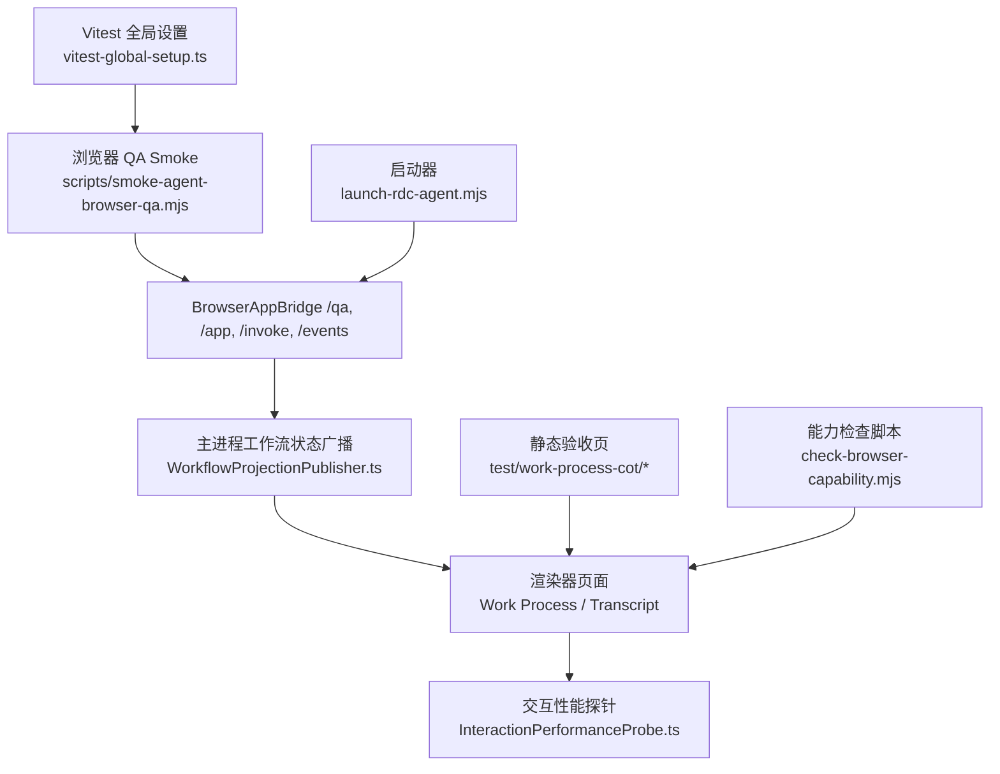
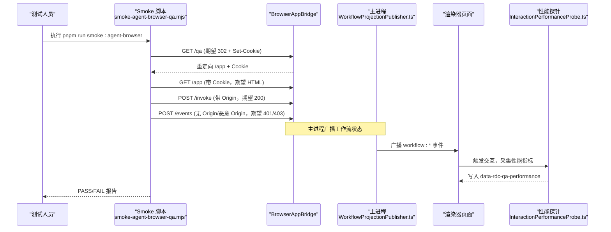
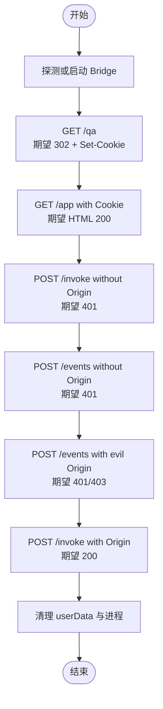
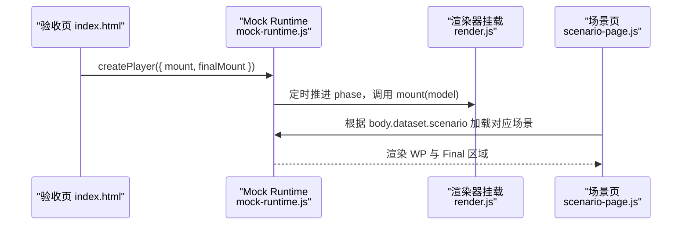
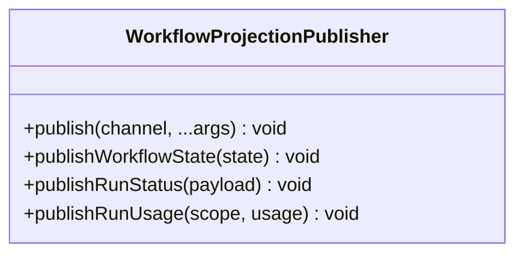
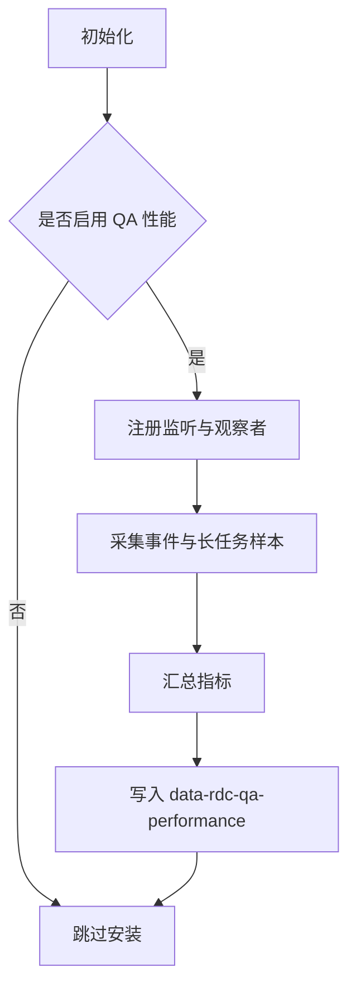
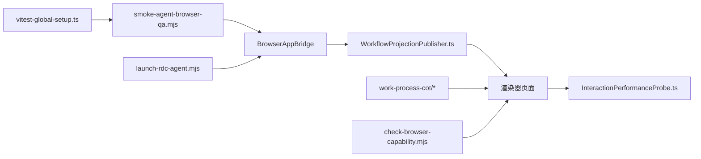

# 端到端测试

<cite>
**本文引用的文件**
- [scripts/smoke-agent-browser-qa.mjs](file://scripts/smoke-agent-browser-qa.mjs)
- [scripts/check-browser-capability.mjs](file://scripts/check-browser-capability.mjs)
- [test/work-process-cot/README.md](file://test/work-process-cot/README.md)
- [test/work-process-cot/FIDELITY-AUDIT.md](file://test/work-process-cot/FIDELITY-AUDIT.md)
- [test/work-process-cot/index.html](file://test/work-process-cot/index.html)
- [test/work-process-cot/shared/mock-runtime.js](file://test/work-process-cot/shared/mock-runtime.js)
- [test/work-process-cot/shared/scenario-page.js](file://test/work-process-cot/shared/scenario-page.js)
- [src/main/workflow/debugger/WorkflowProjectionPublisher.ts](file://src/main/workflow/debugger/WorkflowProjectionPublisher.ts)
- [src/renderer/platform/performance/InteractionPerformanceProbe.ts](file://src/renderer/platform/performance/InteractionPerformanceProbe.ts)
- [scripts/vitest-global-setup.ts](file://scripts/vitest-global-setup.ts)
- [scripts/launch-rdc-agent.mjs](file://scripts/launch-rdc-agent.mjs)
</cite>

## 目录
1. [简介](#简介)
2. [项目结构](#项目结构)
3. [核心组件](#核心组件)
4. [架构总览](#架构总览)
5. [详细组件分析](#详细组件分析)
6. [依赖关系分析](#依赖关系分析)
7. [性能考量](#性能考量)
8. [故障排查指南](#故障排查指南)
9. [结论](#结论)
10. [附录](#附录)

## 简介
本文件面向 RDC-Agent 的端到端（E2E）测试，聚焦“基于浏览器的工作流程测试”。内容涵盖：
- 用户交互模拟与界面状态验证
- 性能指标收集与发布
- 测试场景设计原则、测试数据管理、测试环境配置
- 自动化脚本编写、测试结果分析与问题诊断方法
- UI 测试最佳实践与常见问题解决方案

本项目提供了两类 E2E 能力：
- 静态高保真验收页：用于快速审视 Agent CoT / Work Process 的视觉与状态效果，不接入 CI，不改动产品代码。
- 浏览器 QA Smoke：启动或连接 BrowserAppBridge，校验认证、跨域安全、调用通道等关键路径。

## 项目结构
与端到端测试直接相关的目录与文件如下：
- test/work-process-cot：静态高保真验收页与场景矩阵，提供伪执行播放器、多语言与主题切换、场景导航。
- scripts/smoke-agent-browser-qa.mjs：浏览器 QA smoke 脚本，负责启动/探测 Bridge、发起 HTTP 请求并断言行为。
- scripts/check-browser-capability.mjs：校验渲染器调用通道的能力分类覆盖情况。
- src/main/workflow/debugger/WorkflowProjectionPublisher.ts：主进程向渲染器广播工作流状态变更。
- src/renderer/platform/performance/InteractionPerformanceProbe.ts：在浏览器中采集点击到绘制等交互性能指标。
- scripts/vitest-global-setup.ts：为 Vitest 运行提供隔离的用户数据目录，避免污染真实环境。
- scripts/launch-rdc-agent.mjs：支持以 headless 模式启动 Electron 进行浏览器验证。

图表来源
- [scripts/smoke-agent-browser-qa.mjs:43-140](file://scripts/smoke-agent-browser-qa.mjs#L43-L140)
- [src/main/workflow/debugger/WorkflowProjectionPublisher.ts:17-40](file://src/main/workflow/debugger/WorkflowProjectionPublisher.ts#L17-L40)
- [src/renderer/platform/performance/InteractionPerformanceProbe.ts:1-101](file://src/renderer/platform/performance/InteractionPerformanceProbe.ts#L1-L101)
- [test/work-process-cot/README.md:1-75](file://test/work-process-cot/README.md#L1-L75)
- [scripts/check-browser-capability.mjs:12-37](file://scripts/check-browser-capability.mjs#L12-L37)
- [scripts/vitest-global-setup.ts:9-19](file://scripts/vitest-global-setup.ts#L9-L19)
- [scripts/launch-rdc-agent.mjs:502-527](file://scripts/launch-rdc-agent.mjs#L502-L527)

章节来源
- [test/work-process-cot/README.md:1-75](file://test/work-process-cot/README.md#L1-L75)
- [scripts/smoke-agent-browser-qa.mjs:1-286](file://scripts/smoke-agent-browser-qa.mjs#L1-L286)
- [scripts/check-browser-capability.mjs:1-45](file://scripts/check-browser-capability.mjs#L1-L45)
- [src/main/workflow/debugger/WorkflowProjectionPublisher.ts:1-40](file://src/main/workflow/debugger/WorkflowProjectionPublisher.ts#L1-L40)
- [src/renderer/platform/performance/InteractionPerformanceProbe.ts:1-101](file://src/renderer/platform/performance/InteractionPerformanceProbe.ts#L1-L101)
- [scripts/vitest-global-setup.ts:1-21](file://scripts/vitest-global-setup.ts#L1-L21)
- [scripts/launch-rdc-agent.mjs:502-527](file://scripts/launch-rdc-agent.mjs#L502-L527)

## 核心组件
- 浏览器 QA Smoke（smoke-agent-browser-qa.mjs）
  - 功能：启动或连接 BrowserAppBridge；访问 /qa 获取重定向与 Cookie；使用 Cookie 访问 /app 与 /invoke；校验跨域 Origin 策略；清理临时 userData。
  - 关键点：超时控制、子进程生命周期管理、可配置的 QA URL 与基础地址。
- 静态验收页（test/work-process-cot/*）
  - 功能：通过 mock runtime 驱动 Work Process 的伪执行时间轴；支持播放/暂停/重放/跳到完成；支持 ZH/EN 与 Light/Dark；按场景展示不同工具族与状态。
  - 关键点：场景数据集中管理；渲染器挂载点分离；i18n 与主题联动刷新。
- 工作流状态广播（WorkflowProjectionPublisher.ts）
  - 功能：将工作流状态、运行状态、用量摘要等事件广播至所有渲染器窗口。
  - 关键点：统一 emit + 遍历 BrowserWindow 发送，保证多窗口一致性。
- 交互性能探针（InteractionPerformanceProbe.ts）
  - 功能：在开启 QA 参数时，采集点击到绘制、长任务等指标，写入页面属性供外部读取。
  - 关键点：查询开关、去重安装、阈值与采样统计。
- 能力检查脚本（check-browser-capability.mjs）
  - 功能：枚举渲染器调用通道，校验能力分类覆盖，输出统计。
  - 关键点：未分类通道告警、能力类别计数。
- Vitest 全局设置（vitest-global-setup.ts）
  - 功能：为每次测试运行创建隔离的 RDC 用户数据目录，并在结束后清理。
  - 关键点：环境变量注入、进程级隔离、幂等清理。
- 启动器（launch-rdc-agent.mjs）
  - 功能：支持以 headless 模式启动 Electron 进行浏览器验证，等待渲染器就绪后进入验证流程。
  - 关键点：dev server 启动、端口分配、信号处理与退出码传播。

章节来源
- [scripts/smoke-agent-browser-qa.mjs:43-140](file://scripts/smoke-agent-browser-qa.mjs#L43-L140)
- [test/work-process-cot/README.md:23-68](file://test/work-process-cot/README.md#L23-L68)
- [src/main/workflow/debugger/WorkflowProjectionPublisher.ts:17-40](file://src/main/workflow/debugger/WorkflowProjectionPublisher.ts#L17-L40)
- [src/renderer/platform/performance/InteractionPerformanceProbe.ts:16-101](file://src/renderer/platform/performance/InteractionPerformanceProbe.ts#L16-L101)
- [scripts/check-browser-capability.mjs:12-37](file://scripts/check-browser-capability.mjs#L12-L37)
- [scripts/vitest-global-setup.ts:9-19](file://scripts/vitest-global-setup.ts#L9-L19)
- [scripts/launch-rdc-agent.mjs:502-527](file://scripts/launch-rdc-agent.mjs#L502-L527)

## 架构总览
端到端测试由“静态验收页”和“浏览器 QA Smoke”两条主线组成，二者共同覆盖 UI 表现与运行时安全/连通性。

图表来源
- [scripts/smoke-agent-browser-qa.mjs:43-140](file://scripts/smoke-agent-browser-qa.mjs#L43-L140)
- [src/main/workflow/debugger/WorkflowProjectionPublisher.ts:17-40](file://src/main/workflow/debugger/WorkflowProjectionPublisher.ts#L17-L40)
- [src/renderer/platform/performance/InteractionPerformanceProbe.ts:75-101](file://src/renderer/platform/performance/InteractionPerformanceProbe.ts#L75-L101)

## 详细组件分析

### 组件A：浏览器 QA Smoke（smoke-agent-browser-qa.mjs）
- 目标：验证 BrowserAppBridge 的认证、跨域、调用通道可用性。
- 关键流程：
  - 启动或探测 Bridge，解析日志中的 /qa 链接。
  - 访问 /qa 获取重定向与 rdcBridgeToken Cookie。
  - 携带 Cookie 访问 /app，确保返回 HTML。
  - 校验无 Origin 与恶意 Origin 的 /invoke 与 /events 被拒绝。
  - 清理临时 userData 并终止子进程树。
- 错误处理：
  - 超时与退出码检测。
  - 非预期响应体（如 JSON 代替 HTML）。
  - 跨域策略失败时的明确报错。

图表来源
- [scripts/smoke-agent-browser-qa.mjs:43-140](file://scripts/smoke-agent-browser-qa.mjs#L43-L140)
- [scripts/smoke-agent-browser-qa.mjs:143-210](file://scripts/smoke-agent-browser-qa.mjs#L143-L210)
- [scripts/smoke-agent-browser-qa.mjs:212-232](file://scripts/smoke-agent-browser-qa.mjs#L212-L232)

章节来源
- [scripts/smoke-agent-browser-qa.mjs:1-286](file://scripts/smoke-agent-browser-qa.mjs#L1-L286)

### 组件B：静态验收页与工作过程（test/work-process-cot/*）
- 目标：在不改动产品代码的前提下，快速验证 Work Process 的视觉与状态流转。
- 关键机制：
  - 通过 mock runtime 生成阶段化模型，驱动渲染器挂载点更新。
  - 支持播放/暂停/重放/跳到完成，便于人工审查。
  - 场景矩阵覆盖工具族、聚合、紧凑行、计划与任务快照、ask_user、opaque、Markdown 表面等。
- 数据管理：
  - 场景数据集中定义，按 id 索引。
  - i18n 与主题变化时自动刷新。

图表来源
- [test/work-process-cot/index.html:35-82](file://test/work-process-cot/index.html#L35-L82)
- [test/work-process-cot/shared/mock-runtime.js:174-256](file://test/work-process-cot/shared/mock-runtime.js#L174-L256)
- [test/work-process-cot/shared/scenario-page.js:1-59](file://test/work-process-cot/shared/scenario-page.js#L1-L59)

章节来源
- [test/work-process-cot/README.md:23-68](file://test/work-process-cot/README.md#L23-L68)
- [test/work-process-cot/FIDELITY-AUDIT.md:1-52](file://test/work-process-cot/FIDELITY-AUDIT.md#L1-L52)
- [test/work-process-cot/index.html:1-86](file://test/work-process-cot/index.html#L1-L86)
- [test/work-process-cot/shared/mock-runtime.js:1-261](file://test/work-process-cot/shared/mock-runtime.js#L1-L261)
- [test/work-process-cot/shared/scenario-page.js:1-59](file://test/work-process-cot/shared/scenario-page.js#L1-L59)

### 组件C：工作流状态广播（WorkflowProjectionPublisher.ts）
- 目标：在主进程侧统一广播工作流相关事件，确保多窗口渲染一致。
- 关键点：
  - 通过 rendererEventHub.emit 与 BrowserWindow.webContents.send 双重投递。
  - 提供 publishWorkflowState、publishRunStatus、publishRunUsage 等便捷方法。

图表来源
- [src/main/workflow/debugger/WorkflowProjectionPublisher.ts:17-40](file://src/main/workflow/debugger/WorkflowProjectionPublisher.ts#L17-L40)

章节来源
- [src/main/workflow/debugger/WorkflowProjectionPublisher.ts:1-40](file://src/main/workflow/debugger/WorkflowProjectionPublisher.ts#L1-L40)

### 组件D：交互性能探针（InteractionPerformanceProbe.ts）
- 目标：在 QA 模式下采集点击到绘制、长任务等指标，写入页面属性以便外部读取。
- 关键点：
  - 通过查询参数启用，避免影响正常应用路径。
  - 记录 event timing 与 long task 样本，计算 P95 与最大值。
  - 仅安装一次，防止重复监听。

图表来源
- [src/renderer/platform/performance/InteractionPerformanceProbe.ts:16-101](file://src/renderer/platform/performance/InteractionPerformanceProbe.ts#L16-L101)

章节来源
- [src/renderer/platform/performance/InteractionPerformanceProbe.ts:1-101](file://src/renderer/platform/performance/InteractionPerformanceProbe.ts#L1-L101)

### 组件E：能力检查脚本（check-browser-capability.mjs）
- 目标：校验渲染器调用通道的能力分类覆盖，发现未分类通道。
- 关键点：
  - 枚举 RENDERER_INVOKE_CHANNELS，解析能力类别。
  - 输出 read/mutation/high-impact/desktop-only 统计。

章节来源
- [scripts/check-browser-capability.mjs:1-45](file://scripts/check-browser-capability.mjs#L1-L45)

### 组件F：Vitest 全局设置（vitest-global-setup.ts）
- 目标：为每次测试运行创建隔离的用户数据目录，避免污染真实环境。
- 关键点：
  - 设置 RDC_AGENT_HOME、RDC_AGENT_USER_DATA、RDC_AGENT_QA_INSTANCE_ID。
  - 运行结束后递归删除临时目录。

章节来源
- [scripts/vitest-global-setup.ts:1-21](file://scripts/vitest-global-setup.ts#L1-L21)

### 组件G：启动器（launch-rdc-agent.mjs）
- 目标：支持以 headless 模式启动 Electron 进行浏览器验证，等待渲染器就绪。
- 关键点：
  - 启动渲染器 dev server，分配 OS 端口。
  - 注入 ELECTRON_RENDERER_URL，启动 Electron 子进程。
  - 监听信号并清理资源。

章节来源
- [scripts/launch-rdc-agent.mjs:502-527](file://scripts/launch-rdc-agent.mjs#L502-L527)

## 依赖关系分析
- Smoke 脚本依赖 BrowserAppBridge 提供的 /qa、/app、/invoke、/events 接口。
- 主进程通过 WorkflowProjectionPublisher 向渲染器广播工作流状态。
- 渲染器在 QA 模式下启用 InteractionPerformanceProbe 采集性能。
- 静态验收页通过 mock runtime 驱动 UI，无需真实 IPC。
- 能力检查脚本依赖渲染器 API 通道定义，确保能力分类完整。
- Vitest 全局设置确保测试隔离，避免共享状态。

图表来源
- [scripts/smoke-agent-browser-qa.mjs:43-140](file://scripts/smoke-agent-browser-qa.mjs#L43-L140)
- [src/main/workflow/debugger/WorkflowProjectionPublisher.ts:17-40](file://src/main/workflow/debugger/WorkflowProjectionPublisher.ts#L17-L40)
- [src/renderer/platform/performance/InteractionPerformanceProbe.ts:75-101](file://src/renderer/platform/performance/InteractionPerformanceProbe.ts#L75-L101)
- [test/work-process-cot/README.md:23-68](file://test/work-process-cot/README.md#L23-L68)
- [scripts/check-browser-capability.mjs:12-37](file://scripts/check-browser-capability.mjs#L12-L37)
- [scripts/vitest-global-setup.ts:9-19](file://scripts/vitest-global-setup.ts#L9-L19)
- [scripts/launch-rdc-agent.mjs:502-527](file://scripts/launch-rdc-agent.mjs#L502-L527)

## 性能考量
- 交互性能采集仅在 QA 模式下启用，避免对正常路径造成开销。
- 使用 Event Timing 与 Long Task 观察器，采样频率低且可配置阈值。
- 指标以 JSON 形式写入页面属性，便于外部工具读取与上报。
- 静态验收页采用伪执行，避免真实 IPC 与网络开销，适合快速回归。

[本节为通用指导，不直接分析具体文件]

## 故障排查指南
- 无法访问 /qa 或 /app
  - 确认 Bridge 已启动且端口可达；检查超时与环境变量 RDC_AGENT_SMOKE_BRIDGE_URL。
  - 若使用 START=1，确认子进程日志中出现 /qa 链接。
- /app 返回 JSON 而非 HTML
  - 可能认证失败或白屏；检查 Cookie 是否正确传递。
- /invoke 或 /events 未拒绝恶意 Origin
  - 检查跨域策略实现；确认 Origin 头与允许的源列表。
- 性能探针未生效
  - 确认查询参数 qaPerformance=1；检查是否已安装（data-rdc-qa-performance 存在）。
- 静态验收页场景不显示
  - 检查 scenario id 与数据映射；确认 i18n 与主题刷新逻辑。

章节来源
- [scripts/smoke-agent-browser-qa.mjs:43-140](file://scripts/smoke-agent-browser-qa.mjs#L43-L140)
- [scripts/smoke-agent-browser-qa.mjs:143-210](file://scripts/smoke-agent-browser-qa.mjs#L143-L210)
- [src/renderer/platform/performance/InteractionPerformanceProbe.ts:75-101](file://src/renderer/platform/performance/InteractionPerformanceProbe.ts#L75-L101)
- [test/work-process-cot/shared/scenario-page.js:1-59](file://test/work-process-cot/shared/scenario-page.js#L1-L59)

## 结论
RDC-Agent 的端到端测试体系兼顾了“静态高保真验收”与“浏览器 QA Smoke”，既能快速回归 UI 表现，又能验证运行时安全与连通性。通过工作流状态广播与交互性能探针，测试覆盖了从主进程到渲染器的关键路径。建议在日常开发中结合静态验收页进行快速自查，并结合 smoke 脚本进行集成验证，确保质量与效率并重。

[本节为总结，不直接分析具体文件]

## 附录
- 测试场景设计原则
  - 覆盖典型用户路径：运行中、完成、停止、错误恢复、工具聚合、紧凑行、计划与任务快照、ask_user、opaque、Markdown 表面。
  - 关注边界条件：thinking 生命周期、compact 安静行、approval 扁平条、mcp__* 标签差异。
- 测试数据管理
  - 场景数据集中定义，按 id 索引；支持多语言与主题切换。
  - Mock runtime 生成阶段化模型，便于回放与跳转。
- 测试环境配置
  - 使用 vitest 全局设置隔离用户数据。
  - 通过环境变量控制 smoke 脚本行为（URL、超时、是否自动启动）。
- 自动化脚本编写要点
  - 明确断言点：HTTP 状态码、响应体类型、跨域策略。
  - 管理子进程生命周期：捕获日志、超时、清理。
- 结果分析与问题诊断
  - 优先定位 Bridge 可达性与认证；其次检查跨域策略；最后查看渲染器性能指标。
- UI 测试最佳实践
  - 使用稳定的选择器与语义化标记；保持类名与产品一致；避免硬编码文案。
- 常见问题解决方案
  - 端口冲突：更换端口或释放占用。
  - 权限问题：确保 userData 目录可写。
  - 网络限制：代理或本地回环地址配置。

[本节为通用指导，不直接分析具体文件]