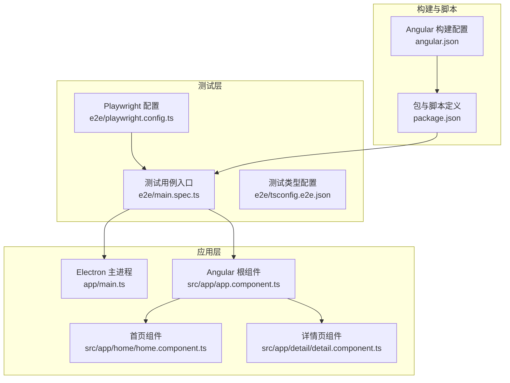
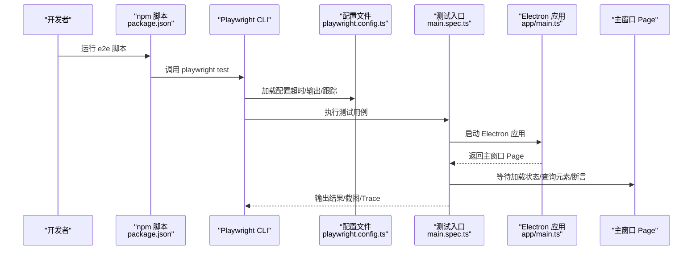
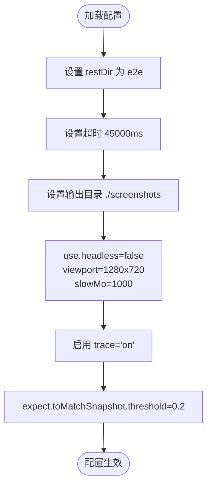
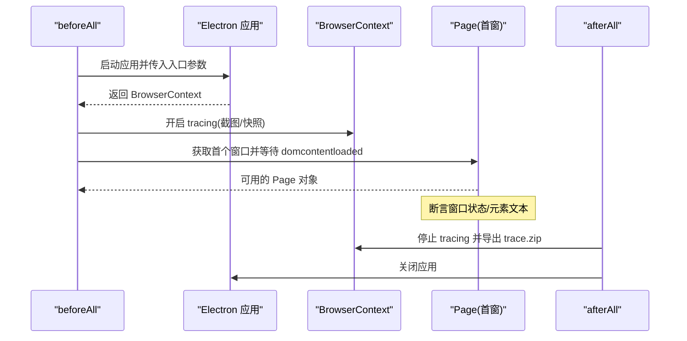
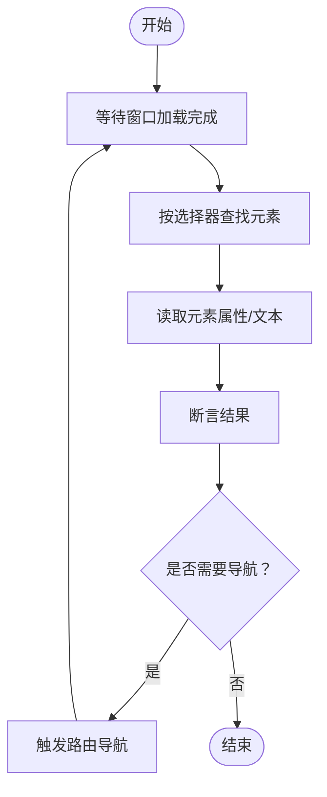
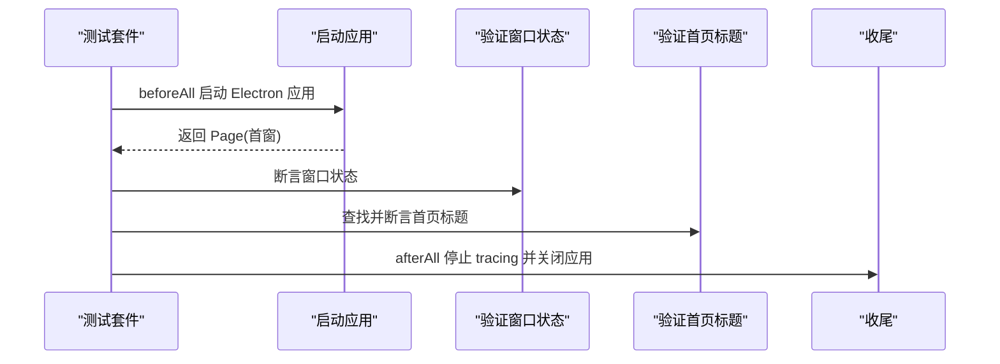
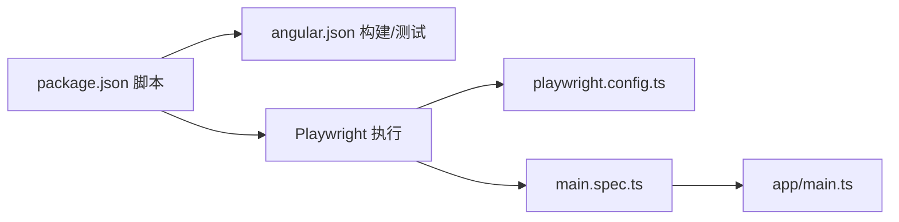

# 端到端测试

<cite>
**本文引用的文件**
- [e2e/playwright.config.ts](file://e2e/playwright.config.ts)
- [e2e/main.spec.ts](file://e2e/main.spec.ts)
- [e2e/tsconfig.e2e.json](file://e2e/tsconfig.e2e.json)
- [package.json](file://package.json)
- [angular.json](file://angular.json)
- [app/main.ts](file://app/main.ts)
- [src/app/app.component.ts](file://src/app/app.component.ts)
- [src/app/home/home.component.ts](file://src/app/home/home.component.ts)
- [src/app/home/home.component.html](file://src/app/home/home.component.html)
- [src/app/detail/detail.component.ts](file://src/app/detail/detail.component.ts)
- [src/app/detail/detail.component.html](file://src/app/detail/detail.component.html)
- [src/app/core/services/electron/electron.service.ts](file://src/app/core/services/electron/electron.service.ts)
- [README.md](file://README.md)
</cite>

## 目录
1. [简介](#简介)
2. [项目结构](#项目结构)
3. [核心组件](#核心组件)
4. [架构总览](#架构总览)
5. [详细组件分析](#详细组件分析)
6. [依赖关系分析](#依赖关系分析)
7. [性能考量](#性能考量)
8. [故障排查指南](#故障排查指南)
9. [结论](#结论)
10. [附录](#附录)

## 简介
本文件面向希望系统性掌握该仓库中 Playwright 端到端测试配置与实现的读者，围绕以下目标展开：测试环境搭建（浏览器与 Electron 启动参数、超时与慢动作）、页面对象模式实践（选择器策略、等待条件与交互）、可维护的 E2E 测试编写（数据与导航、交互模拟）、测试报告与可视化（截图、视频与 Trace）、调试技巧与常见问题。文中所有技术细节均基于仓库现有文件进行分析与总结。

## 项目结构
该仓库采用“主进程（Electron）+ 渲染进程（Angular）”的桌面应用结构，并在根目录下提供 Playwright E2E 测试配置与用例。关键位置如下：
- e2e：存放 Playwright 配置、测试入口与类型配置
- app：Electron 主进程入口，负责窗口创建与资源加载
- src：Angular 应用源码，包含路由、组件与国际化
- angular.json：构建与测试任务配置（含 E2E 项目）
- package.json：脚本命令与依赖声明（含 Playwright 与 Electron）

**图表来源**
- [e2e/playwright.config.ts:1-21](file://e2e/playwright.config.ts#L1-L21)
- [e2e/main.spec.ts:1-60](file://e2e/main.spec.ts#L1-L60)
- [e2e/tsconfig.e2e.json:1-14](file://e2e/tsconfig.e2e.json#L1-L14)
- [app/main.ts:1-94](file://app/main.ts#L1-L94)
- [src/app/app.component.ts:1-35](file://src/app/app.component.ts#L1-L35)
- [src/app/home/home.component.ts:1-19](file://src/app/home/home.component.ts#L1-L19)
- [src/app/detail/detail.component.ts:1-21](file://src/app/detail/detail.component.ts#L1-L21)
- [angular.json:1-188](file://angular.json#L1-L188)
- [package.json:1-108](file://package.json#L1-L108)

**章节来源**
- [e2e/playwright.config.ts:1-21](file://e2e/playwright.config.ts#L1-L21)
- [e2e/main.spec.ts:1-60](file://e2e/main.spec.ts#L1-L60)
- [e2e/tsconfig.e2e.json:1-14](file://e2e/tsconfig.e2e.json#L1-L14)
- [package.json:1-108](file://package.json#L1-L108)
- [angular.json:1-188](file://angular.json#L1-L188)
- [app/main.ts:1-94](file://app/main.ts#L1-L94)
- [src/app/app.component.ts:1-35](file://src/app/app.component.ts#L1-L35)
- [src/app/home/home.component.ts:1-19](file://src/app/home/home.component.ts#L1-L19)
- [src/app/detail/detail.component.ts:1-21](file://src/app/detail/detail.component.ts#L1-L21)

## 核心组件
- Playwright 配置：集中定义测试目录、超时、输出目录、浏览器/上下文参数、快照阈值与跟踪策略。
- 测试用例入口：以 Electron 应用为被测目标，通过上下文跟踪、窗口状态断言、DOM 元素文本断言等完成基础验证。
- 类型配置：为 E2E 测试指定模块与类型，确保编译与运行环境一致。
- 脚本与依赖：通过 package.json 的脚本统一触发构建与 E2E 执行；angular.json 提供测试任务与报告输出路径。

**章节来源**
- [e2e/playwright.config.ts:1-21](file://e2e/playwright.config.ts#L1-L21)
- [e2e/main.spec.ts:1-60](file://e2e/main.spec.ts#L1-L60)
- [e2e/tsconfig.e2e.json:1-14](file://e2e/tsconfig.e2e.json#L1-L14)
- [package.json:27-47](file://package.json#L27-L47)
- [angular.json:104-127](file://angular.json#L104-L127)

## 架构总览
下图展示了从命令触发到测试执行的关键路径，以及 Electron 应用与 Playwright 的交互方式。

**图表来源**
- [package.json:44-45](file://package.json#L44-L45)
- [e2e/playwright.config.ts:1-21](file://e2e/playwright.config.ts#L1-L21)
- [e2e/main.spec.ts:10-16](file://e2e/main.spec.ts#L10-L16)
- [app/main.ts:64-93](file://app/main.ts#L64-L93)

## 详细组件分析

### Playwright 配置分析
- 测试目录与输出：测试目录位于 e2e，截图输出目录为 ./screenshots。
- 超时与慢动作：整体超时为 45 秒，launchOptions 中启用 slowMo 以放慢操作便于观察。
- 浏览器与上下文：headless 关闭，视口尺寸 1280x720；启用 trace 以便后续分析。
- 快照阈值：toMatchSnapshot 的阈值设为 0.2，适配视觉回归场景。
- 并行与并发：当前配置未显式设置并行度，默认由 Playwright 决定；如需调整可在配置中扩展。

**图表来源**
- [e2e/playwright.config.ts:2-16](file://e2e/playwright.config.ts#L2-L16)

**章节来源**
- [e2e/playwright.config.ts:1-21](file://e2e/playwright.config.ts#L1-L21)

### 测试用例入口分析
- 生命周期：beforeAll 启动 Electron 应用，获取上下文与首个窗口，开启 tracing；afterAll 停止 tracing 并关闭应用。
- 窗口状态断言：通过 evaluate 获取主窗口可见性、开发者工具打开状态与崩溃状态，断言其符合预期。
- 页面元素断言：通过选择器定位首页标题元素，读取文本并断言。
- 截图与快照：注释中提供了截图与快照断言的示例，便于视觉回归。

**图表来源**
- [e2e/main.spec.ts:10-16](file://e2e/main.spec.ts#L10-L16)
- [e2e/main.spec.ts:18-41](file://e2e/main.spec.ts#L18-L41)
- [e2e/main.spec.ts:49-53](file://e2e/main.spec.ts#L49-L53)
- [e2e/main.spec.ts:55-58](file://e2e/main.spec.ts#L55-L58)

**章节来源**
- [e2e/main.spec.ts:1-60](file://e2e/main.spec.ts#L1-L60)

### 页面对象模式与交互策略
- 选择器策略：使用基于组件模板的标签选择器定位元素（例如首页标题），具备稳定性和语义化优势。
- 等待条件：通过窗口加载状态等待 DOM 内容加载完成，避免过早断言导致的不稳定。
- 交互操作：当前用例主要进行元素查询与文本断言；若需复杂交互，建议封装页面对象方法（如点击、输入、滚动）以提升可维护性。
- 数据与导航：结合 Angular 路由，可在用例中进行页面跳转与断言，确保导航链路正确。

**图表来源**
- [e2e/main.spec.ts:15-16](file://e2e/main.spec.ts#L15-L16)
- [e2e/main.spec.ts:50-53](file://e2e/main.spec.ts#L50-L53)
- [src/app/home/home.component.html:1-8](file://src/app/home/home.component.html#L1-L8)
- [src/app/detail/detail.component.html:1-8](file://src/app/detail/detail.component.html#L1-L8)

**章节来源**
- [e2e/main.spec.ts:1-60](file://e2e/main.spec.ts#L1-L60)
- [src/app/home/home.component.html:1-8](file://src/app/home/home.component.html#L1-L8)
- [src/app/detail/detail.component.html:1-8](file://src/app/detail/detail.component.html#L1-L8)

### 测试数据管理与可维护性
- 构建前置：E2E 脚本先执行生产构建，再运行 Playwright 测试，确保测试环境与发布一致。
- 统一入口：通过 package.json 的 e2e 脚本统一入口，便于 CI/CD 集成。
- 报告与可视化：配置中已开启 trace，可用专用命令查看 Trace 文件，辅助定位问题。

**章节来源**
- [package.json:44-45](file://package.json#L44-L45)
- [e2e/playwright.config.ts:12-12](file://e2e/playwright.config.ts#L12-L12)

### 完整测试用例示例（从启动到验证）
以下示例展示从应用启动到功能验证的完整流程，对应仓库中的现有实现：

- 步骤 1：beforeAll 启动 Electron 应用，获取 BrowserContext 与首个窗口，开启 tracing。
- 步骤 2：断言窗口状态（可见、未打开开发者工具、未崩溃）。
- 步骤 3：定位首页标题元素，断言文本内容。
- 步骤 4：afterAll 停止 tracing 并关闭应用。

**图表来源**
- [e2e/main.spec.ts:10-16](file://e2e/main.spec.ts#L10-L16)
- [e2e/main.spec.ts:18-41](file://e2e/main.spec.ts#L18-L41)
- [e2e/main.spec.ts:49-53](file://e2e/main.spec.ts#L49-L53)
- [e2e/main.spec.ts:55-58](file://e2e/main.spec.ts#L55-L58)

**章节来源**
- [e2e/main.spec.ts:1-60](file://e2e/main.spec.ts#L1-L60)

## 依赖关系分析
- 脚本与命令：package.json 中的 e2e 脚本负责先构建 Web 资产，再调用 Playwright 执行测试。
- 构建与测试：angular.json 提供 test 任务与报告输出路径，便于与 E2E 协同。
- Electron 与渲染：app/main.ts 控制窗口创建与资源加载，决定测试入口与页面可用性。

**图表来源**
- [package.json:44-45](file://package.json#L44-L45)
- [angular.json:104-127](file://angular.json#L104-L127)
- [e2e/playwright.config.ts:1-21](file://e2e/playwright.config.ts#L1-L21)
- [e2e/main.spec.ts:1-60](file://e2e/main.spec.ts#L1-L60)
- [app/main.ts:1-94](file://app/main.ts#L1-L94)

**章节来源**
- [package.json:27-47](file://package.json#L27-L47)
- [angular.json:104-127](file://angular.json#L104-L127)

## 性能考量
- 慢动作与可观察性：配置中启用 slowMo，有助于调试但会增加测试总时长。在 CI 中可考虑关闭或降低数值。
- 视口与截图：固定视口尺寸有利于一致性，但可能影响某些响应式布局的覆盖度。可根据需要扩展多分辨率矩阵。
- 超时设置：默认 45 秒适合大多数场景，若页面资源较大或网络较慢，可适当上调。
- 并发与并行：当前未显式设置并行度，建议在稳定后根据硬件能力与稳定性评估逐步引入并行策略。

## 故障排查指南
- 启动失败或黑屏：检查 Electron 主进程窗口创建逻辑与资源加载路径，确认开发/生产模式下的 URL 设置。
- 元素找不到：确认页面已完全加载（等待 domcontentloaded），并使用稳定的组件选择器。
- 截图与快照：若视觉差异过大，可调整快照阈值；必要时更新基准快照。
- Trace 分析：使用专用命令查看 Trace 文件，定位交互时序与异常点。
- 代理与网络：如在代理环境下运行，参考 README 中的代理例外设置。

**章节来源**
- [app/main.ts:27-51](file://app/main.ts#L27-L51)
- [e2e/main.spec.ts:15-15](file://e2e/main.spec.ts#L15-L15)
- [e2e/playwright.config.ts:15-15](file://e2e/playwright.config.ts#L15-L15)
- [README.md:148-149](file://README.md#L148-L149)

## 结论
本仓库的 Playwright E2E 测试以 Electron 应用为核心被测对象，通过简洁的配置与用例实现了基础的功能与视觉验证。建议在现有基础上进一步完善页面对象封装、导航链路断言与并行执行策略，并结合 Trace 与报告体系持续提升可维护性与稳定性。

## 附录
- 快速运行
  - 在本地安装依赖后，直接运行 E2E 脚本即可执行测试。
- 参考命令
  - 运行 E2E：见 package.json 中的 e2e 脚本
  - 查看 Trace：见 package.json 中的 e2e:show-trace 脚本
- 相关文件索引
  - Playwright 配置：[e2e/playwright.config.ts:1-21](file://e2e/playwright.config.ts#L1-L21)
  - 测试入口：[e2e/main.spec.ts:1-60](file://e2e/main.spec.ts#L1-L60)
  - 测试类型配置：[e2e/tsconfig.e2e.json:1-14](file://e2e/tsconfig.e2e.json#L1-L14)
  - 构建与测试配置：[angular.json:104-127](file://angular.json#L104-L127)
  - 包与脚本：[package.json:27-47](file://package.json#L27-L47)
  - Electron 主进程：[app/main.ts:1-94](file://app/main.ts#L1-L94)
  - Angular 根组件：[src/app/app.component.ts:1-35](file://src/app/app.component.ts#L1-L35)
  - 首页组件与模板：[src/app/home/home.component.ts:1-19](file://src/app/home/home.component.ts#L1-L19)、[src/app/home/home.component.html:1-8](file://src/app/home/home.component.html#L1-L8)
  - 详情页组件与模板：[src/app/detail/detail.component.ts:1-21](file://src/app/detail/detail.component.ts#L1-L21)、[src/app/detail/detail.component.html:1-8](file://src/app/detail/detail.component.html#L1-L8)
  - Electron 服务：[src/app/core/services/electron/electron.service.ts:1-57](file://src/app/core/services/electron/electron.service.ts#L1-L57)
  - 项目说明：[README.md:140-147](file://README.md#L140-L147)