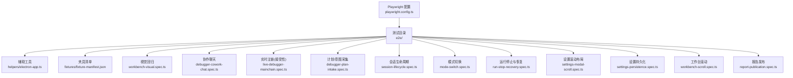
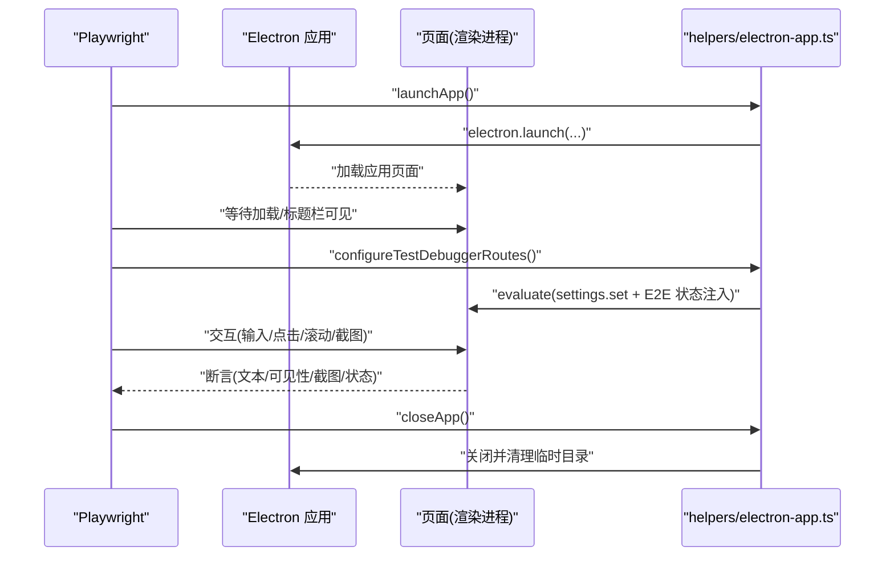
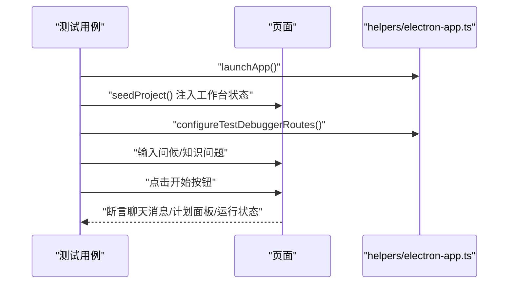
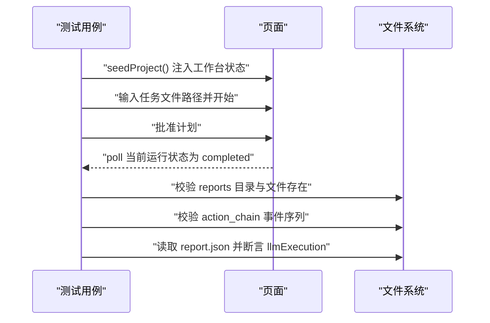
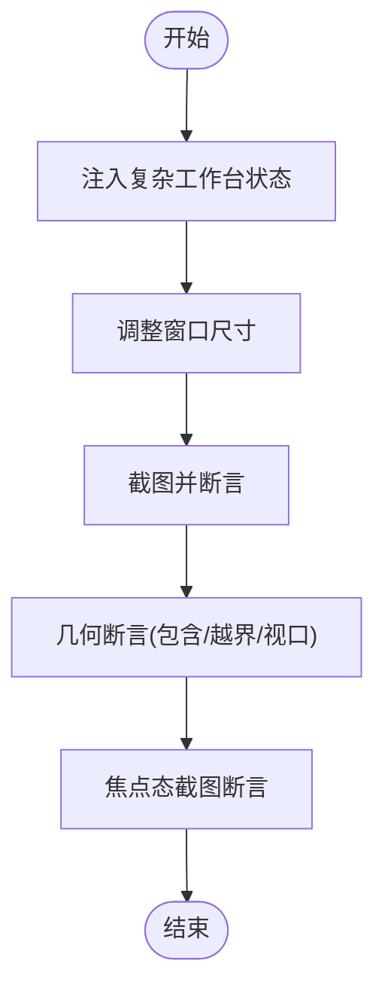
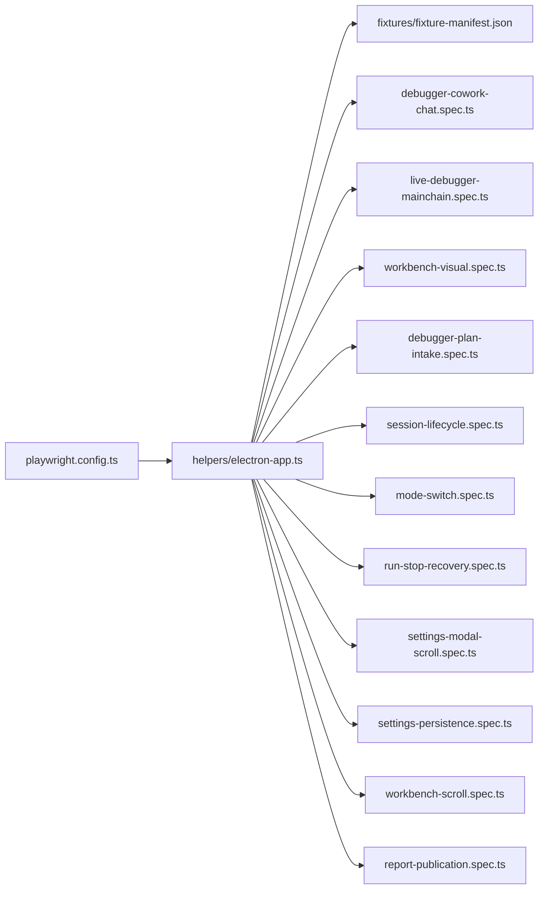

# 端到端测试

<cite>
**本文引用的文件**
- [playwright.config.ts](file://playwright.config.ts)
- [e2e/tsconfig.json](file://e2e/tsconfig.json)
- [e2e/helpers/electron-app.ts](file://e2e/helpers/electron-app.ts)
- [e2e/fixtures/fixture-manifest.json](file://e2e/fixtures/fixture-manifest.json)
- [e2e/workbench-visual.spec.ts](file://e2e/workbench-visual.spec.ts)
- [e2e/debugger-cowork-chat.spec.ts](file://e2e/debugger-cowork-chat.spec.ts)
- [e2e/live-debugger-mainchain.spec.ts](file://e2e/live-debugger-mainchain.spec.ts)
- [e2e/debugger-intake.spec.ts](file://e2e/debugger-intake.spec.ts)
- [e2e/debugger-plan-intake.spec.ts](file://e2e/debugger-plan-intake.spec.ts)
- [e2e/session-lifecycle.spec.ts](file://e2e/session-lifecycle.spec.ts)
- [e2e/mode-switch.spec.ts](file://e2e/mode-switch.spec.ts)
- [e2e/run-stop-recovery.spec.ts](file://e2e/run-stop-recovery.spec.ts)
- [e2e/settings-modal-scroll.spec.ts](file://e2e/settings-modal-scroll.spec.ts)
- [e2e/settings-persistence.spec.ts](file://e2e/settings-persistence.spec.ts)
- [e2e/workbench-scroll.spec.ts](file://e2e/workbench-scroll.spec.ts)
- [e2e/report-publication.spec.ts](file://e2e/report-publication.spec.ts)
</cite>

## 目录
1. [简介](#简介)
2. [项目结构](#项目结构)
3. [核心组件](#核心组件)
4. [架构总览](#架构总览)
5. [详细组件分析](#详细组件分析)
6. [依赖关系分析](#依赖关系分析)
7. [性能考量](#性能考量)
8. [故障排查指南](#故障排查指南)
9. [结论](#结论)
10. [附录](#附录)

## 简介
本文件面向 RDC-Agent 的端到端测试体系，系统化阐述 Playwright 测试框架的配置与使用，覆盖测试环境设置、浏览器与 Electron 应用配置、测试数据准备与隔离机制。文档聚焦三大类测试用例：调试器协作聊天、实时调试主链（接受性测试）与工作台视觉回归，并对其他重要测试如会话生命周期、模式切换、设置持久化与滚动、报告发布等进行补充说明。同时给出断言策略、调试技巧、失败用例分析与性能优化建议，帮助开发者高效维护与扩展测试套件。

## 项目结构
RDC-Agent 的端到端测试位于 e2e 目录，采用 Playwright 的 TypeScript 配置与项目化组织。测试通过 helpers/electron-app.ts 封装 Electron 应用的启动、关闭与测试专用设置，fixtures 提供测试夹具清单，各 *.spec.ts 文件对应具体测试场景。

图表来源
- [playwright.config.ts:1-26](file://playwright.config.ts#L1-L26)
- [e2e/helpers/electron-app.ts:1-170](file://e2e/helpers/electron-app.ts#L1-L170)
- [e2e/fixtures/fixture-manifest.json:1-22](file://e2e/fixtures/fixture-manifest.json#L1-L22)

章节来源
- [playwright.config.ts:1-26](file://playwright.config.ts#L1-L26)
- [e2e/tsconfig.json:1-16](file://e2e/tsconfig.json#L1-L16)

## 核心组件
- Playwright 配置
  - testDir 指向 e2e 目录，timeout 为 60 秒，retries 为 0；截图策略禁用动画、隐藏光标、CSS 缩放；仅定义 electron 项目。
- Electron 应用封装
  - 启动 Electron 应用，设置临时用户数据与工作空间目录，复制夹具 .rdc 到工作空间；通过 evaluate 注入设置与工作台状态；提供关闭与清理能力。
- 测试夹具
  - fixture-manifest.json 声明本地/远程 .rdc 夹具路径，用于测试数据准备。

章节来源
- [playwright.config.ts:4-25](file://playwright.config.ts#L4-L25)
- [e2e/helpers/electron-app.ts:26-76](file://e2e/helpers/electron-app.ts#L26-L76)
- [e2e/helpers/electron-app.ts:34-46](file://e2e/helpers/electron-app.ts#L34-L46)
- [e2e/fixtures/fixture-manifest.json:1-22](file://e2e/fixtures/fixture-manifest.json#L1-L22)

## 架构总览
端到端测试以 Playwright 驱动 Electron 应用，通过页面定位器与 evaluate 与渲染进程交互，注入测试状态与设置，完成从 UI 到业务链路的全链路验证。

图表来源
- [e2e/helpers/electron-app.ts:26-76](file://e2e/helpers/electron-app.ts#L26-L76)
- [e2e/helpers/electron-app.ts:96-153](file://e2e/helpers/electron-app.ts#L96-L153)

## 详细组件分析

### 调试器协作聊天测试
- 设计目标
  - 验证在正确配置 LLM Provider 与 Agent 路由后，普通问候与通用技术问题的对话行为符合预期，不触发正式计划采集流程。
- 用户场景模拟
  - 新建临时项目，注入工作台状态；配置测试路由；输入自然语言，点击“开始”。
- 断言策略
  - 聊天消息包含预期关键词；计划采集面板不可见；当前运行为空。
- 错误处理
  - 若路由缺失或配置失败，抛出异常并中断测试。

图表来源
- [e2e/debugger-cowork-chat.spec.ts:41-79](file://e2e/debugger-cowork-chat.spec.ts#L41-L79)
- [e2e/helpers/electron-app.ts:96-153](file://e2e/helpers/electron-app.ts#L96-L153)

章节来源
- [e2e/debugger-cowork-chat.spec.ts:41-79](file://e2e/debugger-cowork-chat.spec.ts#L41-L79)

### 实时调试主链测试（接受性）
- 设计目标
  - 在真实本地工程与任务文件上执行主链，验证产出三类报告与关键动作事件，以及 LLM 执行元信息。
- 用户场景模拟
  - 使用真实工程根路径与任务文件，创建会话并注入工作台状态；输入任务文件路径，批准计划后等待完成。
- 断言策略
  - 报告目录存在 report.md/json/html；action_chain 包含 dispatch/llm_call/tool_execution/verification/report_published；report.json 中 llmExecution 字段满足条件。
- 环境要求
  - 通过环境变量开启，需本地工程与任务文件存在。

图表来源
- [e2e/live-debugger-mainchain.spec.ts:13-105](file://e2e/live-debugger-mainchain.spec.ts#L13-L105)

章节来源
- [e2e/live-debugger-mainchain.spec.ts:9-107](file://e2e/live-debugger-mainchain.spec.ts#L9-L107)

### 工作台视觉测试
- 设计目标
  - 对关键 UI 区域进行视觉回归，确保布局、滚动、焦点态与响应式在不同窗口尺寸下稳定。
- 断言策略
  - 截图对比：右栏窄态、Capture Library 工具栏、Opened Capture 面板、终端抽屉、左右栏 Footer、折叠后入口、768/375 宽度布局、主输入条焦点态。
  - 几何断言：容器内子元素完全/水平/垂直包含、元素在视口内、菜单不越界、运行中锁定态。
- 数据准备
  - 注入复杂项目/会话/输入/Capture/上下文快照与预览，固定时间戳保证可重复性。

图表来源
- [e2e/workbench-visual.spec.ts:135-243](file://e2e/workbench-visual.spec.ts#L135-L243)
- [e2e/workbench-visual.spec.ts:271-469](file://e2e/workbench-visual.spec.ts#L271-L469)

章节来源
- [e2e/workbench-visual.spec.ts:245-269](file://e2e/workbench-visual.spec.ts#L245-L269)

### 计划/意图采集测试
- 设计目标
  - 验证在配置 Provider 与路由后，输入任务文件能自动发现目标 Capture 与事件，并在批准后进入分发阶段；若路由缺失则走自然语言兜底。
- 断言策略
  - 计划面板可见、包含目标 Capture/事件；批准按钮可用；批准后出现“调试报告已生成”提示；路由缺失时无正式运行。

章节来源
- [e2e/debugger-plan-intake.spec.ts:57-107](file://e2e/debugger-plan-intake.spec.ts#L57-L107)

### 会话生命周期测试
- 设计目标
  - 验证会话右键菜单删除功能，删除后自动切换到剩余会话。
- 断言策略
  - 删除项消失、活动会话切换为目标会话。

章节来源
- [e2e/session-lifecycle.spec.ts:16-69](file://e2e/session-lifecycle.spec.ts#L16-L69)

### 模式切换测试
- 设计目标
  - 验证应用启动后显示三模式入口，空闲壳层保留调试输入条；切换到 Analyzer/Optimizer 时仅显示独立占位页。
- 断言策略
  - Tab 可见与选中状态；切换后侧边栏与输入条数量变化。

章节来源
- [e2e/mode-switch.spec.ts:14-44](file://e2e/mode-switch.spec.ts#L14-L44)

### 运行停止与恢复测试
- 设计目标
  - 验证运行中可停止并最终转为 cancelled；重启后 stale run 可被识别为 interrupted 并支持 Restart Run。
- 断言策略
  - 停止后运行状态为 cancelled；action_chain 包含 RUN_STOPPED；重启后新 runId 与原 runId 不同。

章节来源
- [e2e/run-stop-recovery.spec.ts:47-147](file://e2e/run-stop-recovery.spec.ts#L47-L147)

### 设置滚动布局测试
- 设计目标
  - 验证设置弹窗中 Workspace/Model/Agent 面板在大量数据下的可访问滚动布局。
- 断言策略
  - 打开设置弹窗后，三个导航项均可访问并显示对应内容。

章节来源
- [e2e/settings-modal-scroll.spec.ts:19-93](file://e2e/settings-modal-scroll.spec.ts#L19-L93)

### 设置持久化测试
- 设计目标
  - 验证 Provider/Agent 路由等设置在重启后持久化；敏感字段（如 API Key）不以明文形式返回。
- 断言策略
  - 重启后 Provider 存在且 API Key 空字符串；Agent 路由仅展示可用 Provider/Model；保存后停留在当前面板。

章节来源
- [e2e/settings-persistence.spec.ts:30-357](file://e2e/settings-persistence.spec.ts#L30-L357)

### 工作台滚动测试
- 设计目标
  - 验证主壳层左右栏与控制面板支持独立滚轮滚动；聊天态消息区滚动时主输入条保持可见。
- 断言策略
  - 滚动前后 scrollTop 增大；主输入条顶部始终在主区域可视范围内。

章节来源
- [e2e/workbench-scroll.spec.ts:236-283](file://e2e/workbench-scroll.spec.ts#L236-L283)

### 报告发布测试
- 设计目标
  - 验证调试完成后真实写入 reports 目录并包含关键事件，report.json 中 llmExecution 字段满足条件。
- 断言策略
  - report.md/json/html 存在；action_chain 包含关键事件；llmExecution 字段断言。

章节来源
- [e2e/report-publication.spec.ts:44-101](file://e2e/report-publication.spec.ts#L44-L101)

## 依赖关系分析
- 配置层
  - playwright.config.ts 定义测试目录、超时、重试、截图策略与项目类型。
- 辅助层
  - helpers/electron-app.ts 提供应用生命周期管理、测试设置注入、工作台状态注入与夹具复制。
- 夹具层
  - fixtures/fixture-manifest.json 提供 .rdc 夹具清单，驱动数据准备。
- 用例层
  - 各 *.spec.ts 通过定位器与 evaluate 与页面交互，执行断言与状态轮询。

图表来源
- [playwright.config.ts:4-25](file://playwright.config.ts#L4-L25)
- [e2e/helpers/electron-app.ts:26-76](file://e2e/helpers/electron-app.ts#L26-L76)
- [e2e/fixtures/fixture-manifest.json:1-22](file://e2e/fixtures/fixture-manifest.json#L1-L22)

章节来源
- [playwright.config.ts:4-25](file://playwright.config.ts#L4-L25)
- [e2e/helpers/electron-app.ts:26-76](file://e2e/helpers/electron-app.ts#L26-L76)

## 性能考量
- 截图策略
  - 禁用动画、隐藏光标、CSS 缩放，降低视觉差异与截图耗时。
- 超时与轮询
  - 对运行状态与文件存在性采用 poll 与合理 timeout，避免忙等。
- 窗口尺寸与滚动
  - 固定窗口尺寸与滚动断言，减少布局抖动带来的不稳定。
- 临时目录与清理
  - 启动时创建临时目录，关闭时按需清理，避免磁盘膨胀与跨用例污染。

章节来源
- [playwright.config.ts:8-18](file://playwright.config.ts#L8-L18)
- [e2e/helpers/electron-app.ts:158-169](file://e2e/helpers/electron-app.ts#L158-L169)

## 故障排查指南
- 测试未通过但 UI 正常
  - 检查截图断言是否受动画/光标影响，必要时调整截图策略或等待稳定后再断言。
- 路由缺失导致流程异常
  - 确认 configureTestDebuggerRoutes 是否成功持久化；检查 evaluate 返回值与异常。
- 接受性测试跳过
  - 确认环境变量已设置；检查工程与任务文件路径是否存在。
- 滚动断言失败
  - 确保页面已渲染足够内容；检查 hover 与 wheel 的位置参数；确认容器可滚动。
- 设置持久化异常
  - 重启后读取 settings.get，确认敏感字段未明文返回；核对 Provider/Agent 路由选项。
- 行为不一致（视觉回归）
  - 固定窗口尺寸与主题；冻结时间戳；确保无外部动画干扰。

章节来源
- [e2e/helpers/electron-app.ts:96-153](file://e2e/helpers/electron-app.ts#L96-L153)
- [e2e/live-debugger-mainchain.spec.ts:10-11](file://e2e/live-debugger-mainchain.spec.ts#L10-L11)
- [e2e/workbench-scroll.spec.ts:265-283](file://e2e/workbench-scroll.spec.ts#L265-L283)
- [e2e/settings-persistence.spec.ts:30-79](file://e2e/settings-persistence.spec.ts#L30-L79)

## 结论
RDC-Agent 的端到端测试以 Playwright + Electron 为核心，结合 helpers/electron-app.ts 的应用生命周期管理与工作台状态注入，覆盖了从 UI 到业务主链的关键场景。通过严格的断言策略（文本/可见性/截图/状态轮询/文件存在）、稳定的测试夹具与隔离机制，确保测试结果可靠且可复现。建议持续扩展接受性测试与视觉回归覆盖面，配合性能优化与调试技巧，提升整体质量与效率。

## 附录
- 测试环境搭建要点
  - Playwright 配置：testDir、timeout、retries、截图策略、项目类型。
  - Electron 启动：临时用户数据与工作空间目录、夹具复制、加载状态等待。
  - 测试数据：通过 evaluate 注入项目/会话/输入/Capture/上下文快照与预览。
  - 隔离机制：每个用例独立启动/关闭应用，临时目录按需清理。
- 测试调试技巧
  - 使用 trace on-first-retry；针对滚动/焦点/窗口尺寸断言时固定尺寸与时间戳；对异步状态使用 poll。
- 失败用例分析
  - 优先检查路由与设置注入是否成功；核对截图断言的稳定性；确认文件系统事件是否产生。
- 性能优化建议
  - 合理设置 timeout；减少不必要的截图；合并断言以降低往返；使用固定窗口尺寸与主题。