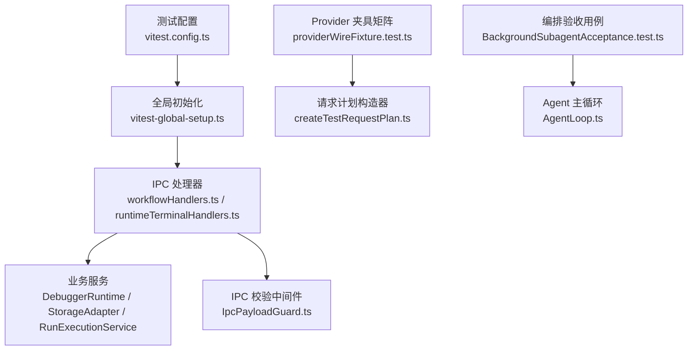
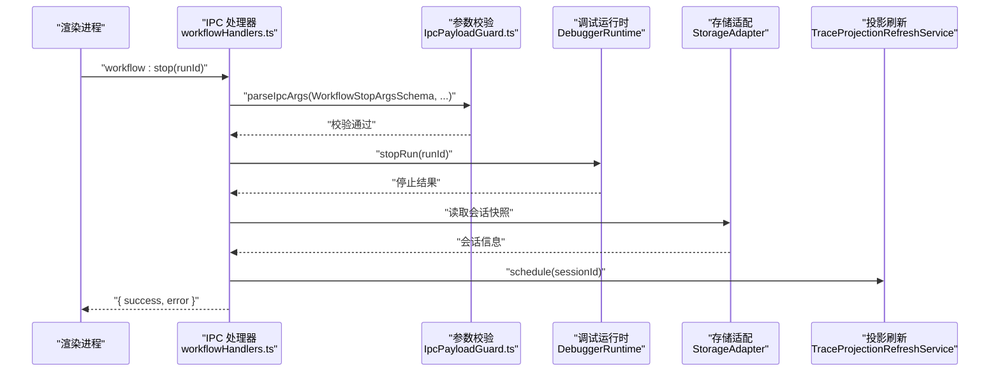
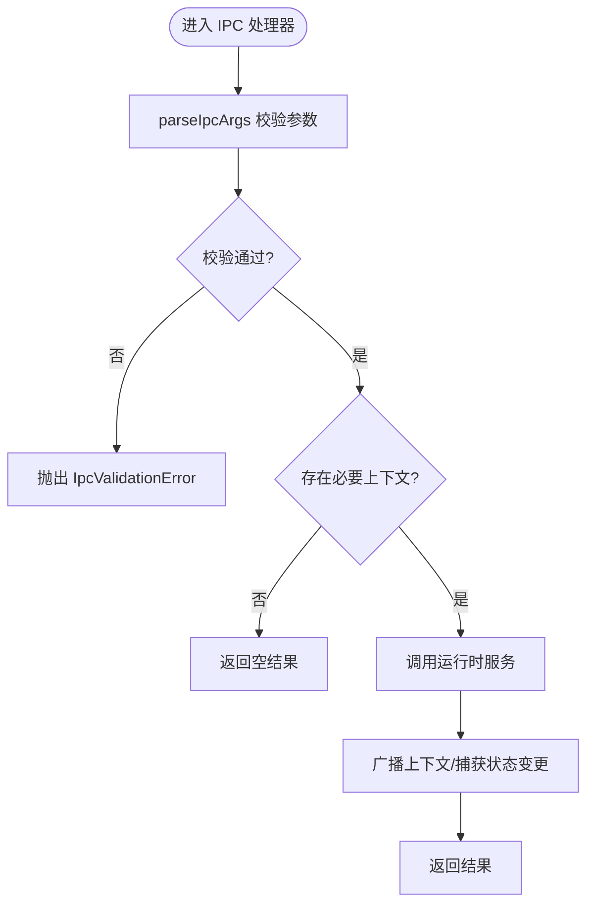
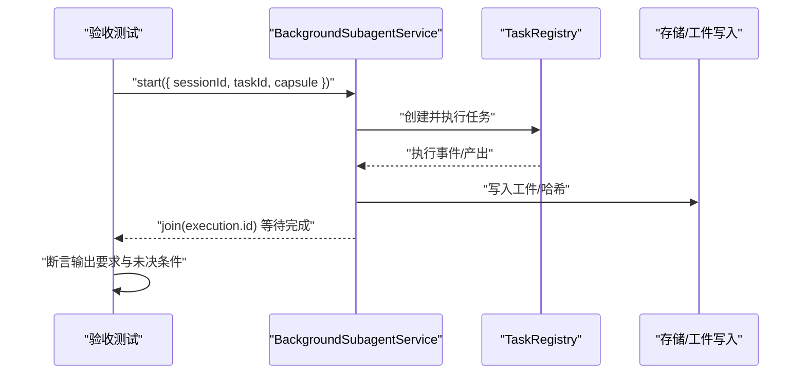
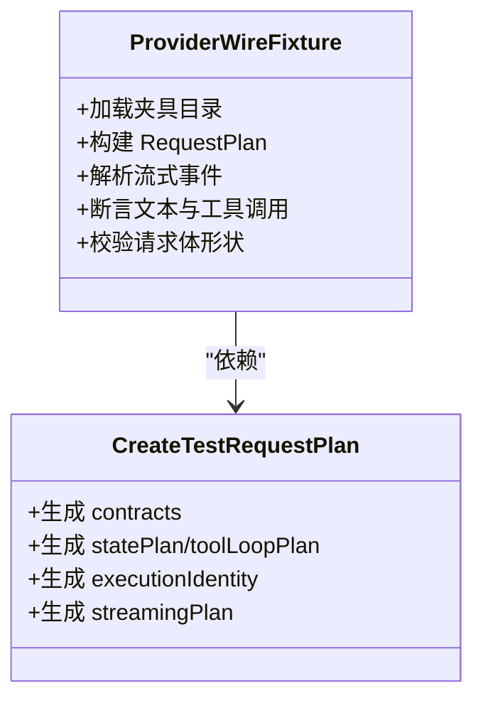
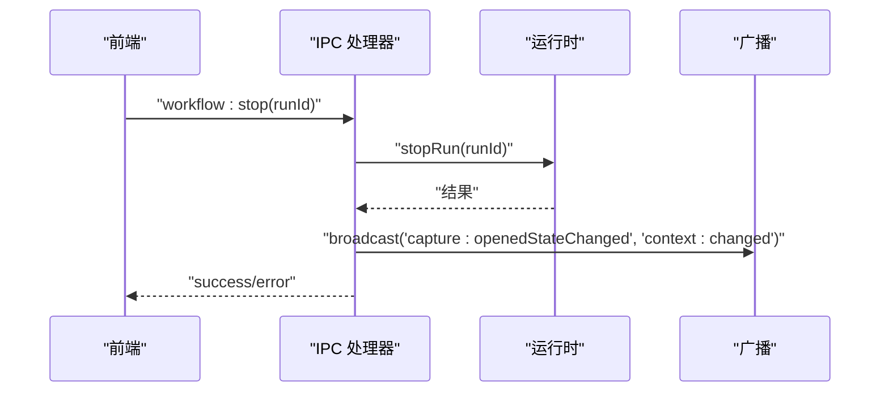
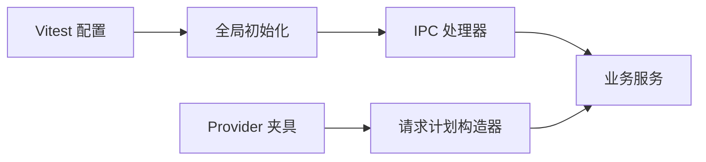

# 集成测试

<cite>
**本文引用的文件**
- [vitest.config.ts](file://vitest.config.ts)
- [vitest-global-setup.ts](file://scripts/vitest-global-setup.ts)
- [IpcPayloadGuard.ts](file://src/main/ipc/validation/IpcPayloadGuard.ts)
- [workflowHandlers.ts](file://src/main/ipc/workflowHandlers.ts)
- [workflowHandlers.usage.test.ts](file://src/main/ipc/workflowHandlers.usage.test.ts)
- [providerWireFixture.test.ts](file://src/main/testing/contracts/providerWireFixture.test.ts)
- [createTestRequestPlan.ts](file://src/main/testing/createTestRequestPlan.ts)
- [BackgroundSubagentAcceptance.test.ts](file://src/main/workflow/debugger/BackgroundSubagentAcceptance.test.ts)
- [OrchestratorTestStubs.test.ts](file://src/main/workflow/debugger/OrchestratorTestStubs.test.ts)
- [LiveProviderOAuthContracts.test.ts](file://src/main/settings/LiveProviderOAuthContracts.test.ts)
- [AgentLoop.ts](file://src/main/agent-runtime/agent/AgentLoop.ts)
- [runtimeTerminalHandlers.ts](file://src/main/ipc/runtimeTerminalHandlers.ts)
</cite>

## 目录
1. [简介](#简介)
2. [项目结构](#项目结构)
3. [核心组件](#核心组件)
4. [架构总览](#架构总览)
5. [详细组件分析](#详细组件分析)
6. [依赖分析](#依赖分析)
7. [性能考虑](#性能考虑)
8. [故障排查指南](#故障排查指南)
9. [结论](#结论)
10. [附录](#附录)

## 简介
本文件面向 RDC-Agent 的跨模块集成测试，聚焦以下目标：
- IPC 通信测试：验证主进程与渲染进程之间的消息契约、参数校验、错误处理与边界条件。
- Agent 编排流程测试：覆盖工作流生命周期、子代理任务、工具装配与执行、状态恢复与终止。
- Provider 集成测试：基于固定夹具（fixtures）对多种协议进行端到端解析与输出断言。
- 合同测试（Contract Testing）：通过共享夹具与类型化 Schema 保证各层接口稳定。
- 工作流测试场景设计：提供可复用的场景模板与环境搭建方法。
- 端到端业务流程：从 UI 触发到后端执行、再到结果回传的完整链路验证。

## 项目结构
RDC-Agent 使用 Vitest 作为 Node 侧测试框架，并通过全局初始化隔离用户数据目录，避免污染真实环境。IPC 层采用 Zod Schema 做入参校验，所有处理器统一通过中间件进行安全与大小限制。Provider 协议测试以“夹具矩阵”形式组织，确保多协议一致性与回归保护。

**图示来源**
- [vitest.config.ts:5-17](file://vitest.config.ts#L5-L17)
- [vitest-global-setup.ts:9-19](file://scripts/vitest-global-setup.ts#L9-L19)
- [workflowHandlers.ts:18-105](file://src/main/ipc/workflowHandlers.ts#L18-L105)
- [IpcPayloadGuard.ts:1-37](file://src/main/ipc/validation/IpcPayloadGuard.ts#L1-L37)
- [providerWireFixture.test.ts:49-654](file://src/main/testing/contracts/providerWireFixture.test.ts#L49-L654)
- [createTestRequestPlan.ts:20-92](file://src/main/testing/createTestRequestPlan.ts#L20-L92)
- [BackgroundSubagentAcceptance.test.ts:1-22](file://src/main/workflow/debugger/BackgroundSubagentAcceptance.test.ts#L1-L22)
- [AgentLoop.ts:1-44](file://src/main/agent-runtime/agent/AgentLoop.ts#L1-L44)

**章节来源**
- [vitest.config.ts:5-72](file://vitest.config.ts#L5-L72)
- [vitest-global-setup.ts:9-19](file://scripts/vitest-global-setup.ts#L9-L19)

## 核心组件
- IPC 校验与边界保护：通过统一的 parseIpcArgs 与字节长度限制，确保所有 IPC 调用具备强类型与容量防护。
- 工作流 IPC 接口：封装 workflow:getState、workflow:resume、workflow:stop、workflow:listRuns、workflow:listActiveRuns、workflow:getRunUsage 等能力。
- Provider 协议夹具矩阵：为每个协议维护去敏化的 SSE/JSONL 流与期望输出，驱动解析与组装断言。
- 测试请求计划构造器：集中生成 RequestPlan，屏蔽默认值与敏感信息，便于在各类集成场景中复用。
- 编排验收测试：以最小依赖模拟后台子代理、任务注册与结果持久化，覆盖复杂协作路径。

**章节来源**
- [IpcPayloadGuard.ts:1-37](file://src/main/ipc/validation/IpcPayloadGuard.ts#L1-L37)
- [workflowHandlers.ts:18-105](file://src/main/ipc/workflowHandlers.ts#L18-L105)
- [providerWireFixture.test.ts:49-654](file://src/main/testing/contracts/providerWireFixture.test.ts#L49-L654)
- [createTestRequestPlan.ts:20-92](file://src/main/testing/createTestRequestPlan.ts#L20-L92)
- [BackgroundSubagentAcceptance.test.ts:1-22](file://src/main/workflow/debugger/BackgroundSubagentAcceptance.test.ts#L1-L22)

## 架构总览
下图展示一次典型的工作流 IPC 调用链：渲染进程发起 IPC，主进程处理器校验参数后调用运行时服务，最终返回结果并广播上下文变更。

**图示来源**
- [workflowHandlers.ts:53-82](file://src/main/ipc/workflowHandlers.ts#L53-L82)
- [IpcPayloadGuard.ts:16-37](file://src/main/ipc/validation/IpcPayloadGuard.ts#L16-L37)

## 详细组件分析

### IPC 通信测试策略
- 参数校验与失败关闭：所有 IPC 处理器必须通过 parseIpcArgs 进行 Zod Schema 校验，并在超限时抛出明确错误码。
- 字节限制：通过 maxBytes 控制载荷大小，防止异常或恶意大报文导致内存压力。
- 边界与空态：当缺少必要上下文（如 currentSessionId）时，应返回安全的空结果而非抛错。
- 使用示例：
  - 工作流停止：校验 runId，调用 stopRun，广播捕获与上下文变更，调度投影刷新。
  - 运行用量查询：通过边界函数返回标准化用量结果，避免重复包装。

**图示来源**
- [workflowHandlers.ts:53-82](file://src/main/ipc/workflowHandlers.ts#L53-L82)
- [IpcPayloadGuard.ts:1-37](file://src/main/ipc/validation/IpcPayloadGuard.ts#L1-L37)

**章节来源**
- [workflowHandlers.ts:18-105](file://src/main/ipc/workflowHandlers.ts#L18-L105)
- [runtimeTerminalHandlers.ts:1-17](file://src/main/ipc/runtimeTerminalHandlers.ts#L1-L17)
- [IpcPayloadGuard.ts:1-37](file://src/main/ipc/validation/IpcPayloadGuard.ts#L1-L37)

### Agent 编排流程测试
- 背景子代理验收：以最小依赖创建 TaskRegistry 与 BackgroundSubagentService，验证任务完成、输出要求满足、未决范围条件不升级为缺失输出。
- 测试模式桩：通过环境变量切换测试模式，验证流式桩函数的分块与合并行为。
- 主循环要点：AgentLoop 以显式状态机驱动，支持工具循环、恢复与终止；编排测试需覆盖这些转换点。

**图示来源**
- [BackgroundSubagentAcceptance.test.ts:1-22](file://src/main/workflow/debugger/BackgroundSubagentAcceptance.test.ts#L1-L22)
- [OrchestratorTestStubs.test.ts:8-35](file://src/main/workflow/debugger/OrchestratorTestStubs.test.ts#L8-L35)
- [AgentLoop.ts:1-44](file://src/main/agent-runtime/agent/AgentLoop.ts#L1-L44)

**章节来源**
- [BackgroundSubagentAcceptance.test.ts:1-22](file://src/main/workflow/debugger/BackgroundSubagentAcceptance.test.ts#L1-L22)
- [OrchestratorTestStubs.test.ts:8-35](file://src/main/workflow/debugger/OrchestratorTestStubs.test.ts#L8-L35)
- [AgentLoop.ts:1-44](file://src/main/agent-runtime/agent/AgentLoop.ts#L1-L44)

### Provider 集成测试（合同测试）
- 夹具矩阵：为每个协议维护去敏化的流式响应与期望 Markdown 输出，确保解析与组装正确。
- 请求计划构造：通过 createTestRequestPlan 生成一致的 RequestPlan，屏蔽敏感头与默认值。
- 协议覆盖：校验 fixture 目录完整性、协议覆盖率、请求体构建与头部脱敏。
- OAuth 合同：针对第三方提供商的授权与交换流程进行断言，确保 URL 参数与交换体符合预期。

**图示来源**
- [providerWireFixture.test.ts:49-654](file://src/main/testing/contracts/providerWireFixture.test.ts#L49-L654)
- [createTestRequestPlan.ts:20-92](file://src/main/testing/createTestRequestPlan.ts#L20-L92)

**章节来源**
- [providerWireFixture.test.ts:49-654](file://src/main/testing/contracts/providerWireFixture.test.ts#L49-L654)
- [createTestRequestPlan.ts:20-92](file://src/main/testing/createTestRequestPlan.ts#L20-L92)
- [LiveProviderOAuthContracts.test.ts:14-27](file://src/main/settings/LiveProviderOAuthContracts.test.ts#L14-L27)

### 工作流测试场景设计
- 场景分类：
  - 正常路径：启动、运行、完成、折叠、停止。
  - 流式输出：分块接收与合并。
  - 工具族聚合：按家族聚合工具调用结果。
  - 上下文压缩：长上下文的压缩与回放。
  - 计划与任务：计划阶段与任务阶段的衔接。
  - 用户审批：需要人工确认的步骤。
  - 错误恢复：缺失工件时的恢复策略。
  - 多格式表面：Markdown 与其他格式的呈现。
- 场景实现：
  - 使用 HTML 页面承载场景，配合共享渲染与 mock 运行时。
  - 通过 scenario-page.js 与 scenarios-data.js 管理场景元数据与步骤。
  - 使用 mock-runtime.js 注入运行时行为，避免外部依赖。

[本节为概念性说明，不直接分析具体文件]

### 测试环境搭建
- 隔离用户数据：全局初始化脚本在每个测试进程内创建临时根目录，设置 RDC_AGENT_HOME 与 RDC_AGENT_USER_DATA，并在结束后清理。
- 别名与插件：Vitest 配置包含 providerCatalogVitePlugin 与 @shared/@main/@renderer 别名，确保模块解析一致。
- 覆盖率阈值：设置行、函数、分支、语句的最低覆盖率，结合 ratchet 机制只允许提升。

**章节来源**
- [vitest-global-setup.ts:9-19](file://scripts/vitest-global-setup.ts#L9-L19)
- [vitest.config.ts:5-72](file://vitest.config.ts#L5-L72)

### 端到端业务流程测试
- 触发入口：渲染进程通过 IPC 调用工作流接口（如 workflow:stop）。
- 主进程处理：校验参数、调用 DebuggerRuntime 停止运行、更新会话状态、广播上下文变更、调度投影刷新。
- 结果回传：返回成功或错误信息，渲染进程据此更新 UI。
- 断言要点：
  - IPC 参数被严格校验且无二次包装。
  - 运行时服务被正确调用且返回符合预期。
  - 广播事件携带正确的会话与作用域信息。

**图示来源**
- [workflowHandlers.ts:53-82](file://src/main/ipc/workflowHandlers.ts#L53-L82)

**章节来源**
- [workflowHandlers.ts:53-82](file://src/main/ipc/workflowHandlers.ts#L53-L82)

## 依赖分析
- 测试框架与配置：Vitest 负责发现与执行测试，全局初始化确保隔离环境。
- IPC 层：依赖 Electron ipcMain 与 Zod Schema，统一通过中间件校验。
- 业务服务：工作流处理器依赖 DebuggerRuntime、StorageAdapter、TraceProjectionRefreshService。
- Provider 测试：依赖协议夹具、请求计划构造器、事件流与解析工具。

**图示来源**
- [vitest.config.ts:5-72](file://vitest.config.ts#L5-L72)
- [vitest-global-setup.ts:9-19](file://scripts/vitest-global-setup.ts#L9-L19)
- [workflowHandlers.ts:18-105](file://src/main/ipc/workflowHandlers.ts#L18-L105)
- [providerWireFixture.test.ts:49-654](file://src/main/testing/contracts/providerWireFixture.test.ts#L49-L654)
- [createTestRequestPlan.ts:20-92](file://src/main/testing/createTestRequestPlan.ts#L20-L92)

**章节来源**
- [vitest.config.ts:5-72](file://vitest.config.ts#L5-L72)
- [workflowHandlers.ts:18-105](file://src/main/ipc/workflowHandlers.ts#L18-L105)
- [providerWireFixture.test.ts:49-654](file://src/main/testing/contracts/providerWireFixture.test.ts#L49-L654)

## 性能考虑
- IPC 载荷限制：通过 maxBytes 控制 JSON 序列化后的字节长度，避免大报文影响稳定性。
- 流式处理：Provider 夹具测试关注流式事件的增量解析与合并，确保低延迟与高吞吐。
- 资源隔离：全局初始化创建临时目录，减少磁盘竞争与 IO 干扰。
- 覆盖率门槛：保持最低覆盖率，结合 ratchet 机制防止退化。

[本节提供通用指导，不直接分析具体文件]

## 故障排查指南
- IPC 参数校验失败：检查是否通过 parseIpcArgs 传入正确的 Schema，并确认 maxBytes 与 padTo 设置合理。
- 运行时为空：当缺少 currentSessionId 或 runId 时，处理器应返回空结果或明确错误，避免崩溃。
- Provider 解析异常：核对夹具目录完整性、协议覆盖率与期望输出，确保去敏头未被泄露。
- 环境隔离问题：确认 RDC_AGENT_HOME 与 RDC_AGENT_USER_DATA 指向临时目录，避免污染真实数据。

**章节来源**
- [IpcPayloadGuard.ts:1-37](file://src/main/ipc/validation/IpcPayloadGuard.ts#L1-L37)
- [workflowHandlers.ts:21-33](file://src/main/ipc/workflowHandlers.ts#L21-L33)
- [providerWireFixture.test.ts:607-654](file://src/main/testing/contracts/providerWireFixture.test.ts#L607-L654)
- [vitest-global-setup.ts:9-19](file://scripts/vitest-global-setup.ts#L9-L19)

## 结论
RDC-Agent 的集成测试体系围绕 IPC 契约、Agent 编排与 Provider 协议三大维度展开，借助 Vitest 全局隔离、Zod 强类型校验与夹具矩阵，形成稳定的回归保护。通过场景化设计与端到端用例，能够覆盖从 UI 触发到后端执行的全链路行为。建议持续完善夹具覆盖、强化边界用例，并将更多跨模块交互纳入自动化验收。

[本节为总结性内容，不直接分析具体文件]

## 附录
- 常用命令：
  - 运行测试：pnpm test
  - 覆盖率报告：pnpm test --coverage
  - 覆盖率门槛检查：pnpm run check:coverage-ratchet
- 关键路径：
  - 测试配置：vitest.config.ts
  - 全局初始化：scripts/vitest-global-setup.ts
  - IPC 处理器：src/main/ipc/workflowHandlers.ts
  - 参数校验：src/main/ipc/validation/IpcPayloadGuard.ts
  - Provider 夹具：src/main/testing/contracts/providerWireFixture.test.ts
  - 请求计划构造：src/main/testing/createTestRequestPlan.ts
  - 编排验收：src/main/workflow/debugger/BackgroundSubagentAcceptance.test.ts

[本节为补充信息，不直接分析具体文件]