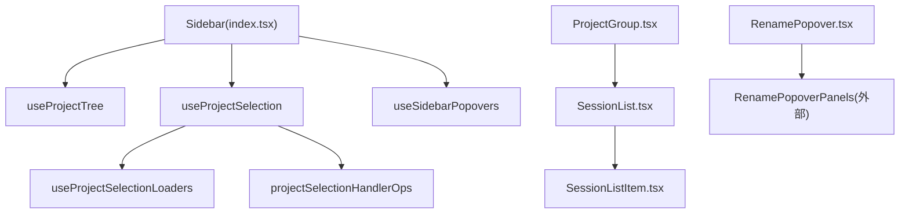
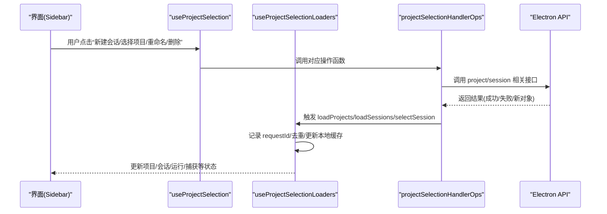
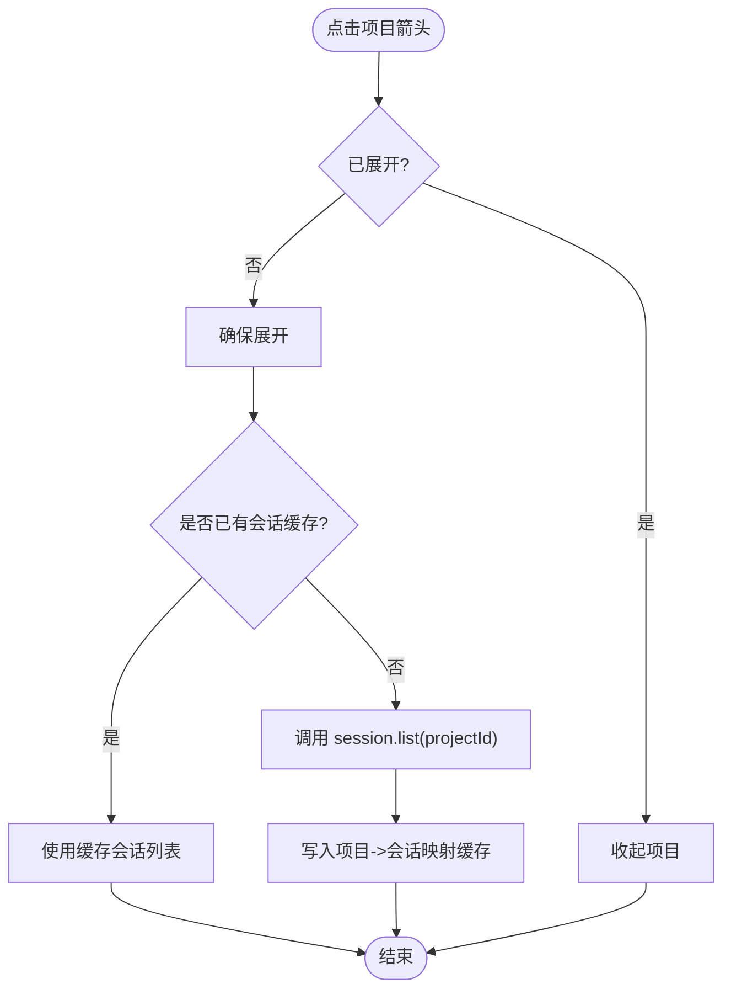
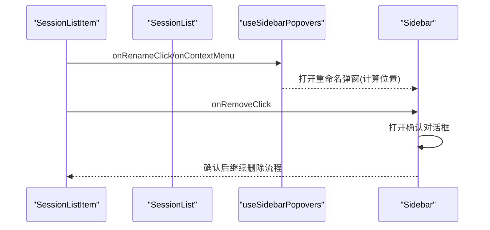
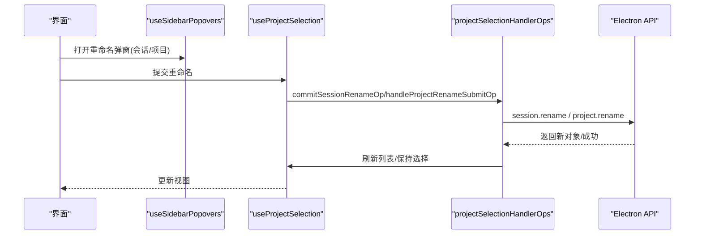
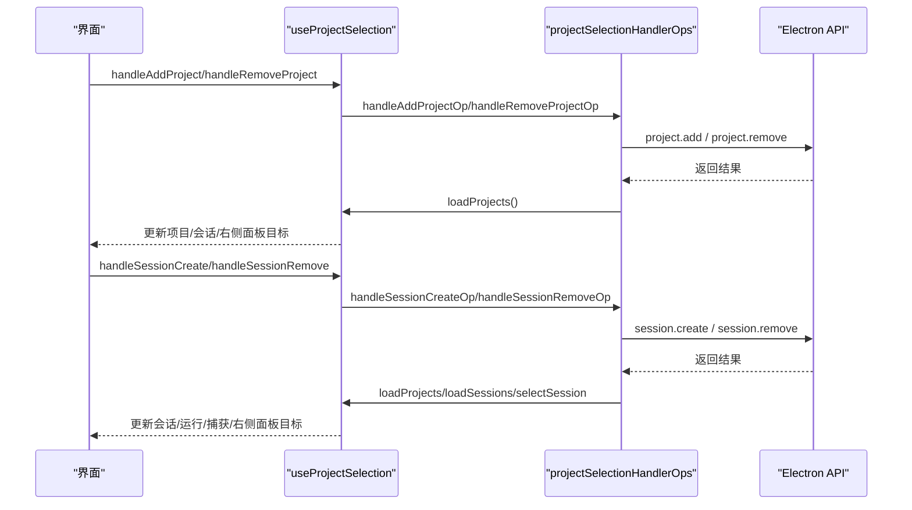
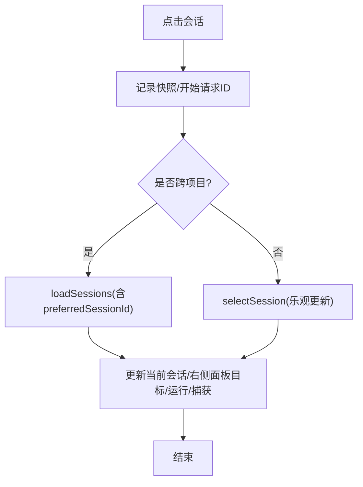
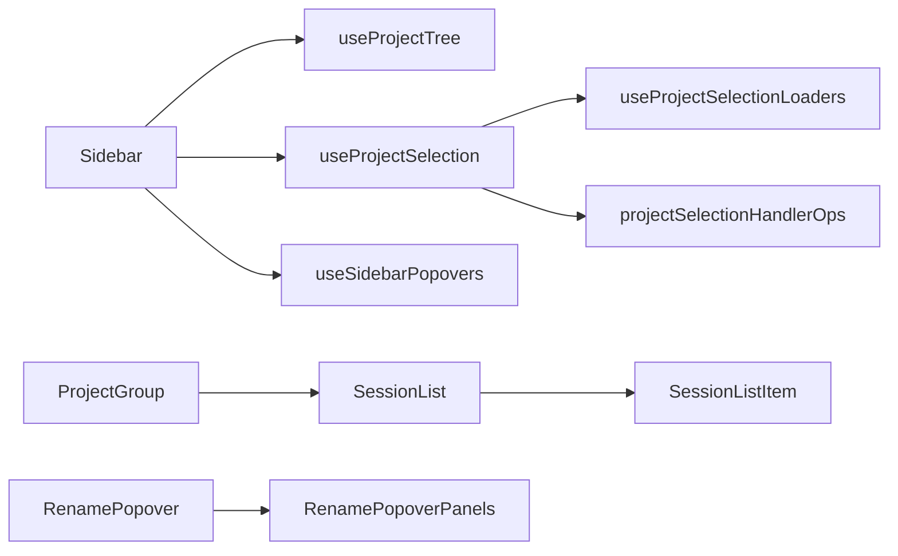

# 侧边栏导航

<cite>
**本文引用的文件**
- [src/renderer/features/sidebar/Sidebar/index.tsx](file://src/renderer/features/sidebar/Sidebar/index.tsx)
- [src/renderer/features/sidebar/Sidebar/useProjectTree.ts](file://src/renderer/features/sidebar/Sidebar/useProjectTree.ts)
- [src/renderer/features/sidebar/Sidebar/ProjectGroup.tsx](file://src/renderer/features/sidebar/Sidebar/ProjectGroup.tsx)
- [src/renderer/features/sidebar/Sidebar/SessionList.tsx](file://src/renderer/features/sidebar/Sidebar/SessionList.tsx)
- [src/renderer/features/sidebar/Sidebar/SessionListItem.tsx](file://src/renderer/features/sidebar/Sidebar/SessionListItem.tsx)
- [src/renderer/features/sidebar/Sidebar/RenamePopover.tsx](file://src/renderer/features/sidebar/Sidebar/RenamePopover.tsx)
- [src/renderer/features/sidebar/Sidebar/useSidebarPopovers.ts](file://src/renderer/features/sidebar/Sidebar/useSidebarPopovers.ts)
- [src/renderer/features/sidebar/Sidebar/types.ts](file://src/renderer/features/sidebar/Sidebar/types.ts)
- [src/renderer/features/sidebar/Sidebar/useProjectSelection.ts](file://src/renderer/features/sidebar/Sidebar/useProjectSelection.ts)
- [src/renderer/features/sidebar/Sidebar/projectSelectionHandlerOps.ts](file://src/renderer/features/sidebar/Sidebar/projectSelectionHandlerOps.ts)
- [src/renderer/features/sidebar/Sidebar/useProjectSelectionLoaders.ts](file://src/renderer/features/sidebar/Sidebar/useProjectSelectionLoaders.ts)
</cite>

## 目录
1. [简介](#简介)
2. [项目结构](#项目结构)
3. [核心组件](#核心组件)
4. [架构总览](#架构总览)
5. [详细组件分析](#详细组件分析)
6. [依赖关系分析](#依赖关系分析)
7. [性能与缓存](#性能与缓存)
8. [故障排查指南](#故障排查指南)
9. [结论](#结论)
10. [附录：可访问性与优化建议](#附录可访问性与优化建议)

## 简介
本文件聚焦 RDC-Agent 渲染端的“侧边栏导航”能力，围绕项目树结构、会话列表管理、导航交互逻辑展开，覆盖项目分组、会话重命名、搜索过滤（实现现状）、批量操作（当前范围）、会话状态同步、数据加载策略与缓存机制、自定义导航项与快捷方式、键盘导航支持，以及体验优化与可访问性方案。

## 项目结构
侧边栏由一组 React 组件与 Hook 组成，采用“展示组件 + 行为 Hook + 操作器”的分层组织：
- 展示组件：ProjectGroup、SessionList、SessionListItem、RenamePopover
- 行为 Hook：useProjectTree、useProjectSelection、useProjectSelectionLoaders、useSidebarPopovers
- 操作器：projectSelectionHandlerOps（封装对 Electron API 的调用与副作用）
- 类型定义：types.ts（统一 Popover/选择/选项等类型）

图示来源
- [src/renderer/features/sidebar/Sidebar/index.tsx:20-186](file://src/renderer/features/sidebar/Sidebar/index.tsx#L20-L186)
- [src/renderer/features/sidebar/Sidebar/useProjectTree.ts:10-81](file://src/renderer/features/sidebar/Sidebar/useProjectTree.ts#L10-L81)
- [src/renderer/features/sidebar/Sidebar/useProjectSelection.ts:27-142](file://src/renderer/features/sidebar/Sidebar/useProjectSelection.ts#L27-L142)
- [src/renderer/features/sidebar/Sidebar/useProjectSelectionLoaders.ts:32-153](file://src/renderer/features/sidebar/Sidebar/useProjectSelectionLoaders.ts#L32-L153)
- [src/renderer/features/sidebar/Sidebar/projectSelectionHandlerOps.ts:35-330](file://src/renderer/features/sidebar/Sidebar/projectSelectionHandlerOps.ts#L35-L330)
- [src/renderer/features/sidebar/Sidebar/ProjectGroup.tsx:29-154](file://src/renderer/features/sidebar/Sidebar/ProjectGroup.tsx#L29-L154)
- [src/renderer/features/sidebar/Sidebar/SessionList.tsx:22-75](file://src/renderer/features/sidebar/Sidebar/SessionList.tsx#L22-L75)
- [src/renderer/features/sidebar/Sidebar/SessionListItem.tsx:17-81](file://src/renderer/features/sidebar/Sidebar/SessionListItem.tsx#L17-L81)
- [src/renderer/features/sidebar/Sidebar/RenamePopover.tsx:31-43](file://src/renderer/features/sidebar/Sidebar/RenamePopover.tsx#L31-L43)

章节来源
- [src/renderer/features/sidebar/Sidebar/index.tsx:20-186](file://src/renderer/features/sidebar/Sidebar/index.tsx#L20-L186)
- [src/renderer/features/sidebar/Sidebar/useProjectTree.ts:10-81](file://src/renderer/features/sidebar/Sidebar/useProjectTree.ts#L10-L81)
- [src/renderer/features/sidebar/Sidebar/useProjectSelection.ts:27-142](file://src/renderer/features/sidebar/Sidebar/useProjectSelection.ts#L27-L142)
- [src/renderer/features/sidebar/Sidebar/useProjectSelectionLoaders.ts:32-153](file://src/renderer/features/sidebar/Sidebar/useProjectSelectionLoaders.ts#L32-L153)
- [src/renderer/features/sidebar/Sidebar/projectSelectionHandlerOps.ts:35-330](file://src/renderer/features/sidebar/Sidebar/projectSelectionHandlerOps.ts#L35-L330)
- [src/renderer/features/sidebar/Sidebar/ProjectGroup.tsx:29-154](file://src/renderer/features/sidebar/Sidebar/ProjectGroup.tsx#L29-L154)
- [src/renderer/features/sidebar/Sidebar/SessionList.tsx:22-75](file://src/renderer/features/sidebar/Sidebar/SessionList.tsx#L22-L75)
- [src/renderer/features/sidebar/Sidebar/SessionListItem.tsx:17-81](file://src/renderer/features/sidebar/Sidebar/SessionListItem.tsx#L17-L81)
- [src/renderer/features/sidebar/Sidebar/RenamePopover.tsx:31-43](file://src/renderer/features/sidebar/Sidebar/RenamePopover.tsx#L31-L43)

## 核心组件
- 项目分组（ProjectGroup）：负责项目标题、展开/收起、菜单入口、子会话列表容器与溢出控制。
- 会话列表（SessionList）：渲染会话条目，支持“显示更多/更少”以控制可见数量。
- 会话条目（SessionListItem）：单个会话的激活、重命名、删除按钮及键盘事件。
- 重命名弹窗（RenamePopover）：统一管理会话/项目重命名与项目菜单的弹出定位与关闭。
- 树状态（useProjectTree）：维护项目展开态、按项目缓存会话列表、切换展开时按需加载。
- 选择与加载（useProjectSelection / useProjectSelectionLoaders）：组合加载流程、选择请求去重、错误与忙碌态管理。
- 操作器（projectSelectionHandlerOps）：封装添加/删除项目、创建/删除/重命名会话、打开资源管理器、选择会话等具体业务。

章节来源
- [src/renderer/features/sidebar/Sidebar/ProjectGroup.tsx:29-154](file://src/renderer/features/sidebar/Sidebar/ProjectGroup.tsx#L29-L154)
- [src/renderer/features/sidebar/Sidebar/SessionList.tsx:22-75](file://src/renderer/features/sidebar/Sidebar/SessionList.tsx#L22-L75)
- [src/renderer/features/sidebar/Sidebar/SessionListItem.tsx:17-81](file://src/renderer/features/sidebar/Sidebar/SessionListItem.tsx#L17-L81)
- [src/renderer/features/sidebar/Sidebar/RenamePopover.tsx:31-43](file://src/renderer/features/sidebar/Sidebar/RenamePopover.tsx#L31-L43)
- [src/renderer/features/sidebar/Sidebar/useProjectTree.ts:10-81](file://src/renderer/features/sidebar/Sidebar/useProjectTree.ts#L10-L81)
- [src/renderer/features/sidebar/Sidebar/useProjectSelection.ts:27-142](file://src/renderer/features/sidebar/Sidebar/useProjectSelection.ts#L27-L142)
- [src/renderer/features/sidebar/Sidebar/useProjectSelectionLoaders.ts:32-153](file://src/renderer/features/sidebar/Sidebar/useProjectSelectionLoaders.ts#L32-L153)
- [src/renderer/features/sidebar/Sidebar/projectSelectionHandlerOps.ts:35-330](file://src/renderer/features/sidebar/Sidebar/projectSelectionHandlerOps.ts#L35-L330)

## 架构总览
侧边栏通过“展示组件 -> Hook -> 操作器 -> Electron API”的链路完成交互与数据流。选择请求使用自增 ID 进行去抖与竞态保护；项目会话列表按项目键缓存；右侧面板目标（右栏）在切换项目/会话时更新。

图示来源
- [src/renderer/features/sidebar/Sidebar/useProjectSelection.ts:27-142](file://src/renderer/features/sidebar/Sidebar/useProjectSelection.ts#L27-L142)
- [src/renderer/features/sidebar/Sidebar/useProjectSelectionLoaders.ts:56-136](file://src/renderer/features/sidebar/Sidebar/useProjectSelectionLoaders.ts#L56-L136)
- [src/renderer/features/sidebar/Sidebar/projectSelectionHandlerOps.ts:35-330](file://src/renderer/features/sidebar/Sidebar/projectSelectionHandlerOps.ts#L35-L330)

## 详细组件分析

### 项目分组与树形展开
- 项目分组组件负责：
  - 显示项目名称与原始路径名（当两者不一致时）。
  - 展开/收起子会话列表，并控制“显示更多/更少”。
  - 提供项目菜单入口（仅当前项目可见）。
- 树状态 Hook 负责：
  - 维护每个项目的展开状态。
  - 首次展开时按项目加载会话列表，后续复用缓存。
  - 清理不可见项目的缓存与展开状态。

图示来源
- [src/renderer/features/sidebar/Sidebar/useProjectTree.ts:15-57](file://src/renderer/features/sidebar/Sidebar/useProjectTree.ts#L15-L57)
- [src/renderer/features/sidebar/Sidebar/ProjectGroup.tsx:52-154](file://src/renderer/features/sidebar/Sidebar/ProjectGroup.tsx#L52-L154)

章节来源
- [src/renderer/features/sidebar/Sidebar/useProjectTree.ts:10-81](file://src/renderer/features/sidebar/Sidebar/useProjectTree.ts#L10-L81)
- [src/renderer/features/sidebar/Sidebar/ProjectGroup.tsx:29-154](file://src/renderer/features/sidebar/Sidebar/ProjectGroup.tsx#L29-L154)

### 会话列表与条目交互
- 会话列表根据“溢出阈值”默认只显示前若干条，并提供“显示更多/更少”切换。
- 会话条目支持：
  - 激活会话（选中并切换到右侧面板）。
  - 右键或点击重命名按钮打开重命名弹窗。
  - 删除会话（触发确认对话框后执行）。

图示来源
- [src/renderer/features/sidebar/Sidebar/SessionListItem.tsx:17-81](file://src/renderer/features/sidebar/Sidebar/SessionListItem.tsx#L17-L81)
- [src/renderer/features/sidebar/Sidebar/SessionList.tsx:22-75](file://src/renderer/features/sidebar/Sidebar/SessionList.tsx#L22-L75)
- [src/renderer/features/sidebar/Sidebar/useSidebarPopovers.ts:10-72](file://src/renderer/features/sidebar/Sidebar/useSidebarPopovers.ts#L10-L72)
- [src/renderer/features/sidebar/Sidebar/index.tsx:34-58](file://src/renderer/features/sidebar/Sidebar/index.tsx#L34-L58)

章节来源
- [src/renderer/features/sidebar/Sidebar/SessionList.tsx:22-75](file://src/renderer/features/sidebar/Sidebar/SessionList.tsx#L22-L75)
- [src/renderer/features/sidebar/Sidebar/SessionListItem.tsx:17-81](file://src/renderer/features/sidebar/Sidebar/SessionListItem.tsx#L17-L81)
- [src/renderer/features/sidebar/Sidebar/useSidebarPopovers.ts:10-72](file://src/renderer/features/sidebar/Sidebar/useSidebarPopovers.ts#L10-L72)
- [src/renderer/features/sidebar/Sidebar/index.tsx:34-58](file://src/renderer/features/sidebar/Sidebar/index.tsx#L34-L58)

### 会话重命名与项目重命名
- 会话重命名：
  - 通过上下文菜单或重命名按钮打开弹窗，提交后调用 Electron API 重命名。
  - 成功后刷新项目会话列表，若当前会话被重命名则同步更新当前会话。
- 项目重命名：
  - 从项目菜单进入重命名，提交后刷新项目列表并保持当前选择。

图示来源
- [src/renderer/features/sidebar/Sidebar/useSidebarPopovers.ts:19-55](file://src/renderer/features/sidebar/Sidebar/useSidebarPopovers.ts#L19-L55)
- [src/renderer/features/sidebar/Sidebar/projectSelectionHandlerOps.ts:170-287](file://src/renderer/features/sidebar/Sidebar/projectSelectionHandlerOps.ts#L170-L287)
- [src/renderer/features/sidebar/Sidebar/RenamePopover.tsx:31-43](file://src/renderer/features/sidebar/Sidebar/RenamePopover.tsx#L31-L43)

章节来源
- [src/renderer/features/sidebar/Sidebar/projectSelectionHandlerOps.ts:170-287](file://src/renderer/features/sidebar/Sidebar/projectSelectionHandlerOps.ts#L170-L287)
- [src/renderer/features/sidebar/Sidebar/useSidebarPopovers.ts:19-55](file://src/renderer/features/sidebar/Sidebar/useSidebarPopovers.ts#L19-L55)
- [src/renderer/features/sidebar/Sidebar/RenamePopover.tsx:31-43](file://src/renderer/features/sidebar/Sidebar/RenamePopover.tsx#L31-L43)

### 项目分组、会话创建与删除
- 新增项目：选择目录后调用 API 添加，并加载项目列表，将右侧面板切到项目视图。
- 删除项目：确认后调用 API 删除，刷新项目列表。
- 创建会话：在当前项目下创建新会话，自动选中并加载会话列表。
- 删除会话：确认后调用 API 删除，若删除的是当前会话，则切换到下一个会话或回到项目视图，并清理相关缓存。

图示来源
- [src/renderer/features/sidebar/Sidebar/projectSelectionHandlerOps.ts:35-168](file://src/renderer/features/sidebar/Sidebar/projectSelectionHandlerOps.ts#L35-L168)
- [src/renderer/features/sidebar/Sidebar/projectSelectionHandlerOps.ts:194-252](file://src/renderer/features/sidebar/Sidebar/projectSelectionHandlerOps.ts#L194-L252)
- [src/renderer/features/sidebar/Sidebar/useProjectSelection.ts:80-118](file://src/renderer/features/sidebar/Sidebar/useProjectSelection.ts#L80-L118)

章节来源
- [src/renderer/features/sidebar/Sidebar/projectSelectionHandlerOps.ts:35-168](file://src/renderer/features/sidebar/Sidebar/projectSelectionHandlerOps.ts#L35-L168)
- [src/renderer/features/sidebar/Sidebar/projectSelectionHandlerOps.ts:194-252](file://src/renderer/features/sidebar/Sidebar/projectSelectionHandlerOps.ts#L194-L252)
- [src/renderer/features/sidebar/Sidebar/useProjectSelection.ts:80-118](file://src/renderer/features/sidebar/Sidebar/useProjectSelection.ts#L80-L118)

### 会话激活与状态同步
- 激活会话会：
  - 设置当前项目与会话，右侧面板目标设为“会话”。
  - 清空运行/捕获/运行集合，确保干净状态。
  - 若跨项目切换，先加载会话列表再选中目标会话；否则直接选择会话。
  - 使用快照与“最新请求”机制保证并发安全与回滚一致性。

图示来源
- [src/renderer/features/sidebar/Sidebar/projectSelectionHandlerOps.ts:289-330](file://src/renderer/features/sidebar/Sidebar/projectSelectionHandlerOps.ts#L289-L330)
- [src/renderer/features/sidebar/Sidebar/useProjectSelectionLoaders.ts:111-124](file://src/renderer/features/sidebar/Sidebar/useProjectSelectionLoaders.ts#L111-L124)

章节来源
- [src/renderer/features/sidebar/Sidebar/projectSelectionHandlerOps.ts:289-330](file://src/renderer/features/sidebar/Sidebar/projectSelectionHandlerOps.ts#L289-L330)
- [src/renderer/features/sidebar/Sidebar/useProjectSelectionLoaders.ts:111-124](file://src/renderer/features/sidebar/Sidebar/useProjectSelectionLoaders.ts#L111-L124)

### 搜索过滤与批量操作
- 搜索过滤：当前代码未实现侧边栏会话/项目的文本搜索过滤功能。可在 SessionList 中增加输入框并对 projectSessions 进行前端过滤，或使用防抖的查询钩子。
- 批量操作：当前未提供批量删除/重命名。可在项目组头部或工具栏增加多选模式，配合操作器扩展批量 API。

[本节为概念性说明，不直接分析具体文件]

### 自定义导航项与快捷方式
- 自定义导航项：可通过在项目菜单中添加额外动作（如“打开资源管理器”）扩展。当前已实现“打开资源管理器”入口。
- 快捷方式：当前未内置全局快捷键绑定。可在应用级命令注册处接入侧边栏常用操作的快捷键（如新建会话、切换项目）。

[本节为概念性说明，不直接分析具体文件]

### 键盘导航支持
- 项目展开/收起：支持 Enter/Space 触发。
- 会话重命名：支持 Enter/Space 打开重命名弹窗。
- 删除/重命名按钮：均支持键盘触发与焦点管理。
- 建议：为列表项增加 Tab 顺序与方向键导航，提升无鼠标可用性。

章节来源
- [src/renderer/features/sidebar/Sidebar/ProjectGroup.tsx:68-81](file://src/renderer/features/sidebar/Sidebar/ProjectGroup.tsx#L68-L81)
- [src/renderer/features/sidebar/Sidebar/ProjectGroup.tsx:107-119](file://src/renderer/features/sidebar/Sidebar/ProjectGroup.tsx#L107-L119)
- [src/renderer/features/sidebar/Sidebar/SessionListItem.tsx:51-69](file://src/renderer/features/sidebar/Sidebar/SessionListItem.tsx#L51-L69)
- [src/renderer/features/sidebar/Sidebar/useSidebarPopovers.ts:41-48](file://src/renderer/features/sidebar/Sidebar/useSidebarPopovers.ts#L41-L48)

## 依赖关系分析
- 组件依赖：
  - Sidebar 依赖 useProjectTree、useProjectSelection、useSidebarPopovers。
  - ProjectGroup 依赖 SessionList、useProjectTree 中的名称解析。
  - SessionList 依赖 SessionListItem。
  - RenamePopover 依赖 useRenamePopover 与面板组件。
- Hook 与操作器：
  - useProjectSelection 聚合 loaders 与 handlers，暴露统一的交互方法。
  - useProjectSelectionLoaders 封装加载流程、请求去重、初始加载。
  - projectSelectionHandlerOps 直接与 Electron API 交互，并驱动 store 更新。

图示来源
- [src/renderer/features/sidebar/Sidebar/index.tsx:20-186](file://src/renderer/features/sidebar/Sidebar/index.tsx#L20-L186)
- [src/renderer/features/sidebar/Sidebar/useProjectSelection.ts:27-142](file://src/renderer/features/sidebar/Sidebar/useProjectSelection.ts#L27-L142)
- [src/renderer/features/sidebar/Sidebar/useProjectSelectionLoaders.ts:32-153](file://src/renderer/features/sidebar/Sidebar/useProjectSelectionLoaders.ts#L32-L153)
- [src/renderer/features/sidebar/Sidebar/projectSelectionHandlerOps.ts:35-330](file://src/renderer/features/sidebar/Sidebar/projectSelectionHandlerOps.ts#L35-L330)
- [src/renderer/features/sidebar/Sidebar/ProjectGroup.tsx:29-154](file://src/renderer/features/sidebar/Sidebar/ProjectGroup.tsx#L29-L154)
- [src/renderer/features/sidebar/Sidebar/SessionList.tsx:22-75](file://src/renderer/features/sidebar/Sidebar/SessionList.tsx#L22-L75)
- [src/renderer/features/sidebar/Sidebar/SessionListItem.tsx:17-81](file://src/renderer/features/sidebar/Sidebar/SessionListItem.tsx#L17-L81)
- [src/renderer/features/sidebar/Sidebar/RenamePopover.tsx:31-43](file://src/renderer/features/sidebar/Sidebar/RenamePopover.tsx#L31-L43)

## 性能与缓存
- 项目会话缓存：
  - 使用 projectSessionsByProject 按项目缓存会话列表，避免重复请求。
  - 切换项目或清理时通过 pruneTreeForProjects/resetTree 维护缓存一致性。
- 请求去重与竞态保护：
  - 使用自增 requestId 标记每次选择请求，仅在“最新请求”时生效，防止旧响应覆盖新状态。
- 懒加载与折叠：
  - 项目首次展开才加载会话列表；会话列表默认只展示前若干项，减少 DOM 节点数量。
- 建议：
  - 为长列表引入虚拟滚动（当单项目会话数较多时）。
  - 对重命名/删除等写操作加入乐观更新与失败回滚，提升感知性能。

章节来源
- [src/renderer/features/sidebar/Sidebar/useProjectTree.ts:15-44](file://src/renderer/features/sidebar/Sidebar/useProjectTree.ts#L15-L44)
- [src/renderer/features/sidebar/Sidebar/useProjectSelectionLoaders.ts:56-63](file://src/renderer/features/sidebar/Sidebar/useProjectSelectionLoaders.ts#L56-L63)
- [src/renderer/features/sidebar/Sidebar/SessionList.tsx:52-70](file://src/renderer/features/sidebar/Sidebar/SessionList.tsx#L52-L70)

## 故障排查指南
- 常见问题定位：
  - 项目/会话未更新：检查是否在“最新请求”分支内执行了状态更新。
  - 重命名无效：确认提交前 titleDraft 非空且与原名不同。
  - 删除后右侧面板异常：确认删除当前会话时是否正确切换至下一会话或回到项目视图，并清理运行/捕获。
- 调试建议：
  - 在操作器中打印 requestId 与 isLatestSelectionRequest 判断。
  - 观察项目会话缓存 map 的变化，确认 prune/reset 是否生效。
  - 关注 sidebarError 状态，定位 Electron API 返回的错误信息。

章节来源
- [src/renderer/features/sidebar/Sidebar/useProjectSelectionLoaders.ts:56-63](file://src/renderer/features/sidebar/Sidebar/useProjectSelectionLoaders.ts#L56-L63)
- [src/renderer/features/sidebar/Sidebar/projectSelectionHandlerOps.ts:170-287](file://src/renderer/features/sidebar/Sidebar/projectSelectionHandlerOps.ts#L170-L287)
- [src/renderer/features/sidebar/Sidebar/projectSelectionHandlerOps.ts:194-252](file://src/renderer/features/sidebar/Sidebar/projectSelectionHandlerOps.ts#L194-L252)

## 结论
侧边栏导航通过清晰的组件分层与 Hook 化逻辑，实现了项目分组、会话列表管理、重命名、创建/删除会话、状态同步与基础缓存。当前未实现搜索过滤与批量操作，但具备良好扩展点。建议在长列表、键盘导航、可访问性与性能方面持续优化，以提升整体用户体验。

## 附录：可访问性与优化建议
- 可访问性
  - 为所有交互按钮提供语义化 aria-label/title，当前已部分实现（如项目展开按钮）。
  - 为列表项增加 role="list/listitem"，并为焦点元素提供清晰焦点样式。
  - 弹窗需实现焦点陷阱与 ESC 关闭，当前弹窗定位与关闭逻辑可在此基础上增强。
- 体验优化
  - 搜索过滤：在 SessionList 顶部增加搜索框，支持会话标题模糊匹配，并使用防抖减少重渲染。
  - 批量操作：在 ProjectGroup 头部增加多选模式，支持批量删除/移动/重命名。
  - 键盘导航：为会话列表增加上下方向键导航与回车激活，Tab 顺序符合视觉顺序。
  - 性能：对大列表启用虚拟滚动；对写操作采用乐观更新与失败回滚；对网络请求增加重试与超时处理。

[本节为概念性说明，不直接分析具体文件]