# 右侧面板

<cite>
**本文引用的文件**
- [src/renderer/features/right-rail/index.tsx](file://src/renderer/features/right-rail/index.tsx)
- [src/renderer/features/right-rail/TraceRightPanel.tsx](file://src/renderer/features/right-rail/TraceRightPanel.tsx)
- [src/renderer/features/right-rail/CapturePanel.tsx](file://src/renderer/features/right-rail/CapturePanel.tsx)
- [src/renderer/features/right-rail/CaptureFrame.tsx](file://src/renderer/features/right-rail/CaptureFrame.tsx)
- [src/renderer/features/right-rail/CaptureHistory.tsx](file://src/renderer/features/right-rail/CaptureHistory.tsx)
- [src/renderer/features/right-rail/useCaptureReplay.ts](file://src/renderer/features/right-rail/useCaptureReplay.ts)
- [src/renderer/features/right-rail/replayApplyQueue.ts](file://src/renderer/features/right-rail/replayApplyQueue.ts)
- [src/renderer/features/right-rail/readCaptureHistory.ts](file://src/renderer/features/right-rail/readCaptureHistory.ts)
- [src/renderer/features/right-rail/capturePanelActions.ts](file://src/renderer/features/right-rail/capturePanelActions.ts)
- [src/renderer/features/right-rail/CaptureReplayStatus.tsx](file://src/renderer/features/right-rail/CaptureReplayStatus.tsx)
- [src/renderer/features/right-rail/CaptureReplay.css](file://src/renderer/features/right-rail/CaptureReplay.css)
- [src/renderer/features/right-rail/RightRail.css](file://src/renderer/features/right-rail/RightRail.css)
- [src/renderer/features/right-rail/RightRailContext.tsx](file://src/renderer/features/right-rail/RightRailContext.tsx)
- [src/renderer/features/right-rail/RightRailProgressList.tsx](file://src/renderer/features/right-rail/RightRailProgressList.tsx)
- [src/renderer/features/right-rail/RightRailArtifactList.tsx](file://src/renderer/features/right-rail/RightRailArtifactList.tsx)
- [src/renderer/features/right-rail/RightRailOutputList.tsx](file://src/renderer/features/right-rail/RightRailOutputList.tsx)
- [src/renderer/features/right-rail/RightRailEmptyVisuals.tsx](file://src/renderer/features/right-rail/RightRailEmptyVisuals.tsx)
- [src/renderer/features/right-rail/RightRailEmptyVisuals.css](file://src/renderer/features/right-rail/RightRailEmptyVisuals.css)
- [src/main/agent-trace/RightRailProjectionService.ts](file://src/main/agent-trace/RightRailProjectionService.ts)
- [src/main/agent-trace/rightRailProjectionMappers.ts](file://src/main/agent-trace/rightRailProjectionMappers.ts)
- [src/main/agent-trace/rightRailInvestigationArtifacts.ts](file://src/main/agent-trace/rightRailInvestigationArtifacts.ts)
- [src/main/sessions/RdxSessionService.ts](file://src/main/sessions/RdxSessionService.ts)
- [src/main/ipc/captureDeviceHandlers.ts](file://src/main/ipc/captureDeviceHandlers.ts)
- [src/shared/types/captureReplay.ts](file://src/shared/types/captureReplay.ts)
- [src/shared/types/trace.ts](file://src/shared/types/trace.ts)
</cite>

## 更新摘要
**变更内容**
- **新增** CaptureReplayStatus.tsx 组件：提供专用的捕获回放状态显示和 callout 管理功能
- **重构** CapturePanel.tsx：使用集中式的状态解析函数（resolveCaptureStatusTone、collectCaptureCallouts）
- **增强** UI 样式：改进空状态处理，使用容器查询（container queries）和 aspect-ratio CSS 属性
- **优化** 状态管理：统一的状态色调处理和错误提示机制

## 目录
1. [简介](#简介)
2. [项目结构](#项目结构)
3. [核心组件](#核心组件)
4. [架构总览](#架构总览)
5. [详细组件分析](#详细组件分析)
6. [回放功能详解](#回放功能详解)
7. [依赖关系分析](#依赖关系分析)
8. [性能考量](#性能考量)
9. [故障排查指南](#故障排查指南)
10. [结论](#结论)
11. [附录](#附录)

## 简介
本文件为 RDC-Agent 的"右侧面板"完整技术文档，聚焦以下能力：
- 上下文信息展示：任务资源、会话与运行时上下文、诊断提示。
- 调试详情查看：捕获文件打开、预览、设备切换、诊断处理。
- 工具输出预览：当前与历史输出列表、打开与复制路径。
- **新增**：交互式回放界面、回放历史管理、状态管理钩子和事件应用队列。
- **新增**：专用状态显示组件和统一的 callout 管理机制。
- 特性说明：捕获文件分析、资源查看器、进度跟踪。
- 状态管理：数据绑定、实时更新机制。
- 扩展性：自定义面板开发、插件扩展、主题适配。
- 体验优化：布局优化与交互改进建议。

## 项目结构
右侧面板由渲染层（React）与主进程投影服务组成。渲染层负责视图与交互，主进程负责从会话、任务、工件、设置等来源聚合数据并映射为 UI 模型。

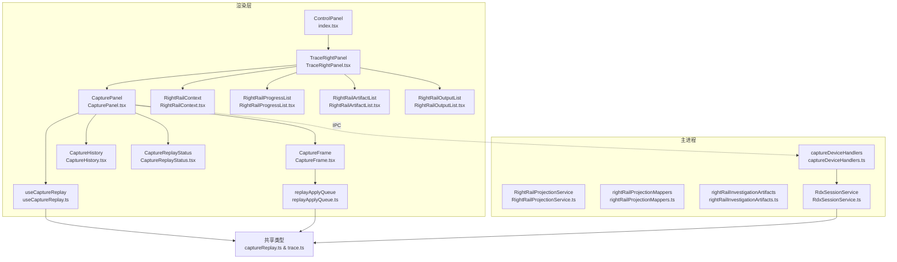

**图表来源**
- [src/renderer/features/right-rail/index.tsx:1-21](file://src/renderer/features/right-rail/index.tsx#L1-L21)
- [src/renderer/features/right-rail/TraceRightPanel.tsx:1-46](file://src/renderer/features/right-rail/TraceRightPanel.tsx#L1-L46)
- [src/renderer/features/right-rail/CapturePanel.tsx:1-148](file://src/renderer/features/right-rail/CapturePanel.tsx#L1-L148)
- [src/renderer/features/right-rail/CaptureReplayStatus.tsx:1-136](file://src/renderer/features/right-rail/CaptureReplayStatus.tsx#L1-L136)
- [src/renderer/features/right-rail/CaptureFrame.tsx:1-69](file://src/renderer/features/right-rail/CaptureFrame.tsx#L1-L69)
- [src/renderer/features/right-rail/CaptureHistory.tsx:1-92](file://src/renderer/features/right-rail/CaptureHistory.tsx#L1-L92)
- [src/renderer/features/right-rail/useCaptureReplay.ts:1-33](file://src/renderer/features/right-rail/useCaptureReplay.ts#L1-L33)
- [src/renderer/features/right-rail/replayApplyQueue.ts:1-32](file://src/renderer/features/right-rail/replayApplyQueue.ts#L1-L32)
- [src/main/sessions/RdxSessionService.ts:73-229](file://src/main/sessions/RdxSessionService.ts#L73-L229)
- [src/main/ipc/captureDeviceHandlers.ts:25-61](file://src/main/ipc/captureDeviceHandlers.ts#L25-L61)

**章节来源**
- [src/renderer/features/right-rail/index.tsx:1-21](file://src/renderer/features/right-rail/index.tsx#L1-L21)
- [src/renderer/features/right-rail/TraceRightPanel.tsx:1-46](file://src/renderer/features/right-rail/TraceRightPanel.tsx#L1-L46)

## 核心组件
- ControlPanel：根据当前项目与会话决定显示"项目导入面板"或"追踪右侧面板"。
- TraceRightPanel：右侧面板容器，按区块组织进度、工件、输出、上下文、捕获。
- CapturePanel：捕获文件选择、打开、预览、设备切换、诊断处理，**新增**集成回放功能和专用状态管理。
- **新增** CaptureReplayStatus：专用的捕获回放状态显示组件，提供状态芯片、callout 管理和状态解析功能。
- **新增** CaptureFrame：交互式回放界面，支持事件选择、目标切换和实时反馈。
- **新增** CaptureHistory：回放历史管理，提供历史记录浏览和播放功能。
- **新增** useCaptureReplay：状态管理钩子，统一管理回放状态订阅和生命周期。
- **新增** replayApplyQueue：事件应用队列，实现请求去重和批量处理。
- RightRailContext：任务资源列表（附件、目录、技能、MCP、Web 等）。
- RightRailProgressList：任务进度列表，支持定位与停止后台工作。
- RightRailArtifactList：调查工件列表，支持预览与元信息展示。
- RightRailOutputList：工具输出列表，支持打开与复制路径。
- RightRailProjectionService：构建右侧面板所需的全部视图模型。
- rightRailProjectionMappers：将任务、输出、上下文等映射为 UI 模型。
- rightRailInvestigationArtifacts：聚合调查工件并计算覆盖/截断计数。

**章节来源**
- [src/renderer/features/right-rail/index.tsx:1-21](file://src/renderer/features/right-rail/index.tsx#L1-L21)
- [src/renderer/features/right-rail/TraceRightPanel.tsx:1-46](file://src/renderer/features/right-rail/TraceRightPanel.tsx#L1-L46)
- [src/renderer/features/right-rail/CapturePanel.tsx:1-148](file://src/renderer/features/right-rail/CapturePanel.tsx#L1-L148)
- [src/renderer/features/right-rail/CaptureReplayStatus.tsx:1-136](file://src/renderer/features/right-rail/CaptureReplayStatus.tsx#L1-L136)
- [src/renderer/features/right-rail/CaptureFrame.tsx:1-69](file://src/renderer/features/right-rail/CaptureFrame.tsx#L1-L69)
- [src/renderer/features/right-rail/CaptureHistory.tsx:1-92](file://src/renderer/features/right-rail/CaptureHistory.tsx#L1-L92)
- [src/renderer/features/right-rail/useCaptureReplay.ts:1-33](file://src/renderer/features/right-rail/useCaptureReplay.ts#L1-L33)
- [src/renderer/features/right-rail/replayApplyQueue.ts:1-32](file://src/renderer/features/right-rail/replayApplyQueue.ts#L1-L32)

## 架构总览
右侧面板的数据流遵循"主进程投影 + 渲染层消费"的模式：
- 主进程通过 RightRailProjectionService 聚合会话、任务、工件、设置等信息，生成统一的 RightPanelViewModel。
- 渲染层通过 store 订阅该视图模型，并在各子组件中按需呈现。
- 交互（如打开捕获、切换设备、预览、停止任务）通过 IPC 调用主进程能力，完成后刷新投影以驱动 UI 更新。
- **新增**：回放功能通过 useCaptureReplay 钩子统一管理状态，CaptureFrame 和 CaptureHistory 组件提供交互式回放界面，CaptureReplayStatus 提供统一的状态显示。

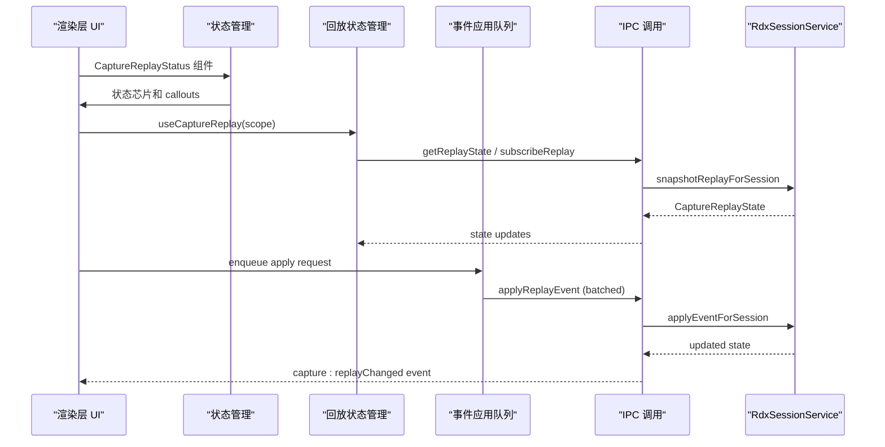

**图表来源**
- [src/renderer/features/right-rail/CaptureReplayStatus.tsx:101-134](file://src/renderer/features/right-rail/CaptureReplayStatus.tsx#L101-L134)
- [src/renderer/features/right-rail/useCaptureReplay.ts:1-33](file://src/renderer/features/right-rail/useCaptureReplay.ts#L1-L33)
- [src/renderer/features/right-rail/replayApplyQueue.ts:1-32](file://src/renderer/features/right-rail/replayApplyQueue.ts#L1-L32)
- [src/main/sessions/RdxSessionService.ts:209-220](file://src/main/sessions/RdxSessionService.ts#L209-L220)
- [src/main/ipc/captureDeviceHandlers.ts:36-50](file://src/main/ipc/captureDeviceHandlers.ts#L36-L50)

## 详细组件分析

### 进度跟踪（RightRailProgressList）
- 功能：列出任务进度，支持定位到对应任务块并高亮闪烁；提供停止后台工作的入口。
- 数据绑定：从 presentation.rightPanel.progress 读取任务列表。
- 交互流程：点击任务行滚动至目标并添加闪烁类；点击停止按钮调用取消接口并刷新投影。

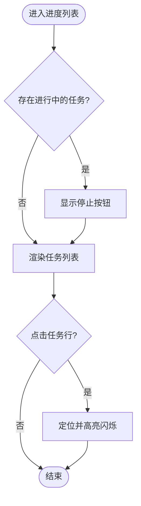

**图表来源**
- [src/renderer/features/right-rail/RightRailProgressList.tsx:1-36](file://src/renderer/features/right-rail/RightRailProgressList.tsx#L1-L36)

**章节来源**
- [src/renderer/features/right-rail/RightRailProgressList.tsx:1-36](file://src/renderer/features/right-rail/RightRailProgressList.tsx#L1-L36)

### 工件列表（RightRailArtifactList）
- 功能：展示调查工件条目，包含类型、状态、时间、任务、世界状态、来源引用数等元信息；支持复制 ID 与预览。
- 数据来源：主进程聚合调查工件索引与清单，计算被覆盖与截断数量。
- 预览：点击预览后弹出预览面板，关闭时恢复。

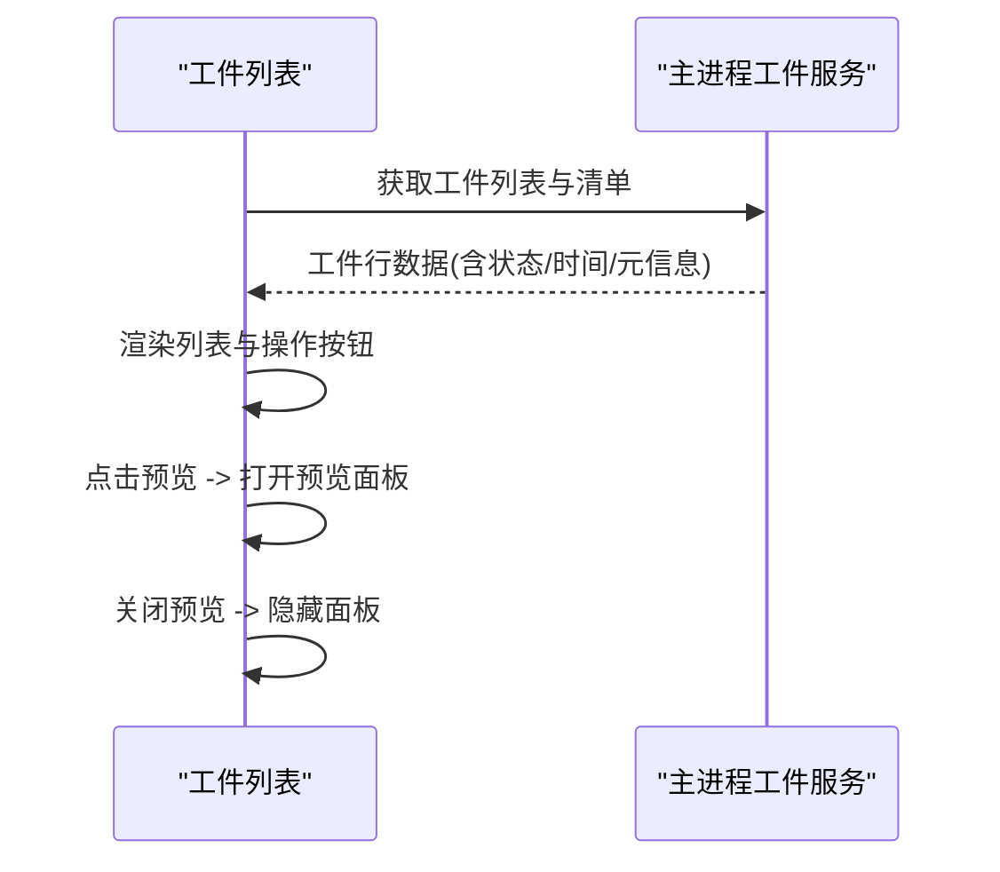

**图表来源**
- [src/renderer/features/right-rail/RightRailArtifactList.tsx:1-110](file://src/renderer/features/right-rail/RightRailArtifactList.tsx#L1-L110)
- [src/main/agent-trace/rightRailInvestigationArtifacts.ts:1-106](file://src/main/agent-trace/rightRailInvestigationArtifacts.ts#L1-L106)

**章节来源**
- [src/renderer/features/right-rail/RightRailArtifactList.tsx:1-110](file://src/renderer/features/right-rail/RightRailArtifactList.tsx#L1-L110)
- [src/main/agent-trace/rightRailInvestigationArtifacts.ts:1-106](file://src/main/agent-trace/rightRailInvestigationArtifacts.ts#L1-L106)

### 工具输出预览（RightRailOutputList）
- 功能：展示当前与历史输出，支持打开文件或复制路径；失败状态禁用打开。
- 数据来源：主进程映射输出工件，区分最新运行与其他运行。

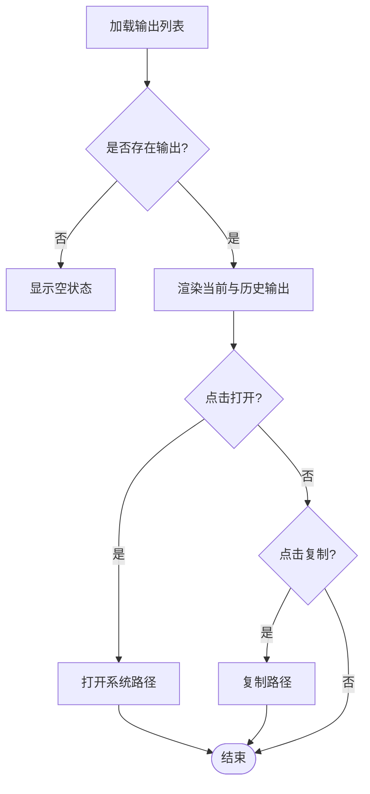

**图表来源**
- [src/renderer/features/right-rail/RightRailOutputList.tsx:1-40](file://src/renderer/features/right-rail/RightRailOutputList.tsx#L1-L40)
- [src/main/agent-trace/rightRailProjectionMappers.ts:51-81](file://src/main/agent-trace/rightRailProjectionMappers.ts#L51-L81)

**章节来源**
- [src/renderer/features/right-rail/RightRailOutputList.tsx:1-40](file://src/renderer/features/right-rail/RightRailOutputList.tsx#L1-L40)
- [src/main/agent-trace/rightRailProjectionMappers.ts:51-81](file://src/main/agent-trace/rightRailProjectionMappers.ts#L51-L81)

### 上下文信息（RightRailContext）
- 功能：展示任务资源列表，包括附件、目录、技能、MCP、Web 等；支持打开文件路径。
- 数据来源：主进程聚合附件与任务资源，去重后呈现。

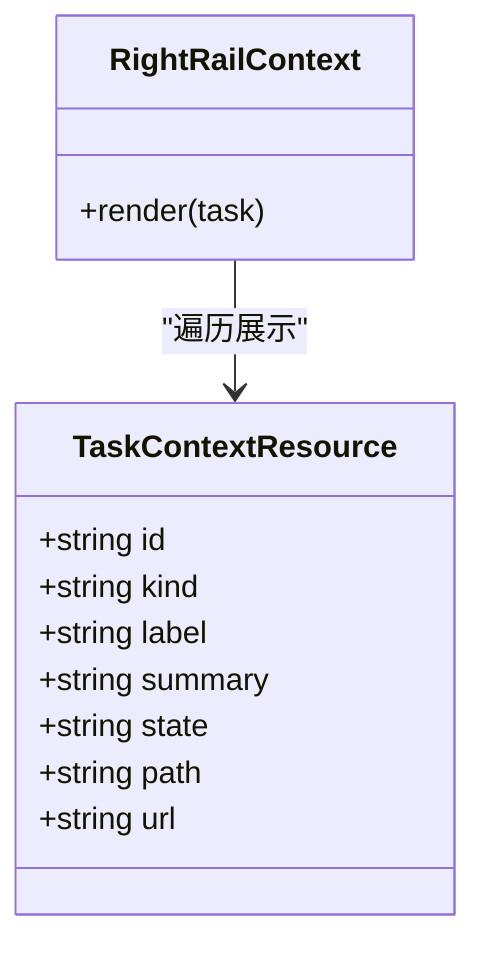

**图表来源**
- [src/renderer/features/right-rail/RightRailContext.tsx:1-66](file://src/renderer/features/right-rail/RightRailContext.tsx#L1-L66)
- [src/shared/types/trace.ts:165-194](file://src/shared/types/trace.ts#L165-L194)
- [src/main/agent-trace/rightRailProjectionMappers.ts:96-120](file://src/main/agent-trace/rightRailProjectionMappers.ts#L96-L120)

**章节来源**
- [src/renderer/features/right-rail/RightRailContext.tsx:1-66](file://src/renderer/features/right-rail/RightRailContext.tsx#L1-L66)
- [src/main/agent-trace/rightRailProjectionMappers.ts:96-120](file://src/main/agent-trace/rightRailProjectionMappers.ts#L96-L120)
- [src/shared/types/trace.ts:165-194](file://src/shared/types/trace.ts#L165-L194)

### 捕获文件分析与资源查看器（CapturePanel）
- 功能：选择捕获输入、打开/重新打开捕获、切换回放设备、开启/关闭人类预览、复制运行时上下文、清理已打开捕获。
- **新增**：集成回放功能，支持交互式回放和历史查看，使用专用状态管理组件。
- **新增**：使用集中式状态解析函数（resolveCaptureStatusTone、collectCaptureCallouts）处理状态逻辑。
- 交互流程：选择输入与设备后执行打开；若失败则显示诊断并提供重试、切换设备、打开设置或复制错误等操作。
- 数据刷新：每次操作后并行刷新捕获状态、上下文快照与追踪投影，确保 UI 一致。

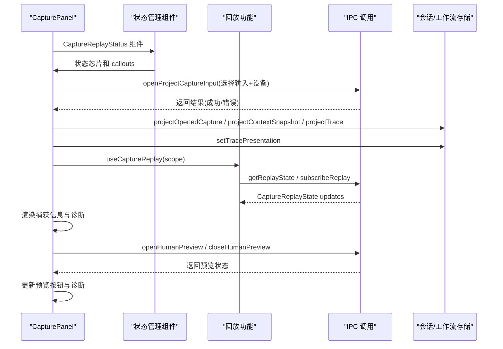

**图表来源**
- [src/renderer/features/right-rail/CapturePanel.tsx:1-148](file://src/renderer/features/right-rail/CapturePanel.tsx#L1-L148)
- [src/renderer/features/right-rail/CaptureReplayStatus.tsx:101-134](file://src/renderer/features/right-rail/CaptureReplayStatus.tsx#L101-L134)
- [src/renderer/features/right-rail/useCaptureReplay.ts:1-33](file://src/renderer/features/right-rail/useCaptureReplay.ts#L1-L33)

**章节来源**
- [src/renderer/features/right-rail/CapturePanel.tsx:1-148](file://src/renderer/features/right-rail/CapturePanel.tsx#L1-L148)

### 专用状态管理组件（CaptureReplayStatus）
- **新增** 功能：提供专用的捕获回放状态显示和 callout 管理功能。
- **新增** 核心特性：
  - 状态芯片（CaptureReplayStatusChip）：显示当前状态的视觉指示器，支持 success、warning、error、info 四种色调。
  - Callout 管理（CaptureReplayCallouts）：统一处理警告、错误和信息提示，支持重试操作。
  - 状态解析（resolveCaptureStatusTone）：根据阶段、挂起状态和部分就绪状态确定合适的色调。
  - Callout 收集（collectCaptureCallouts）：集中处理各种状态组合，生成统一的提示信息。
  - 部分就绪检测（isCapturePartialReady）：识别捕获处于部分可用状态的情况。

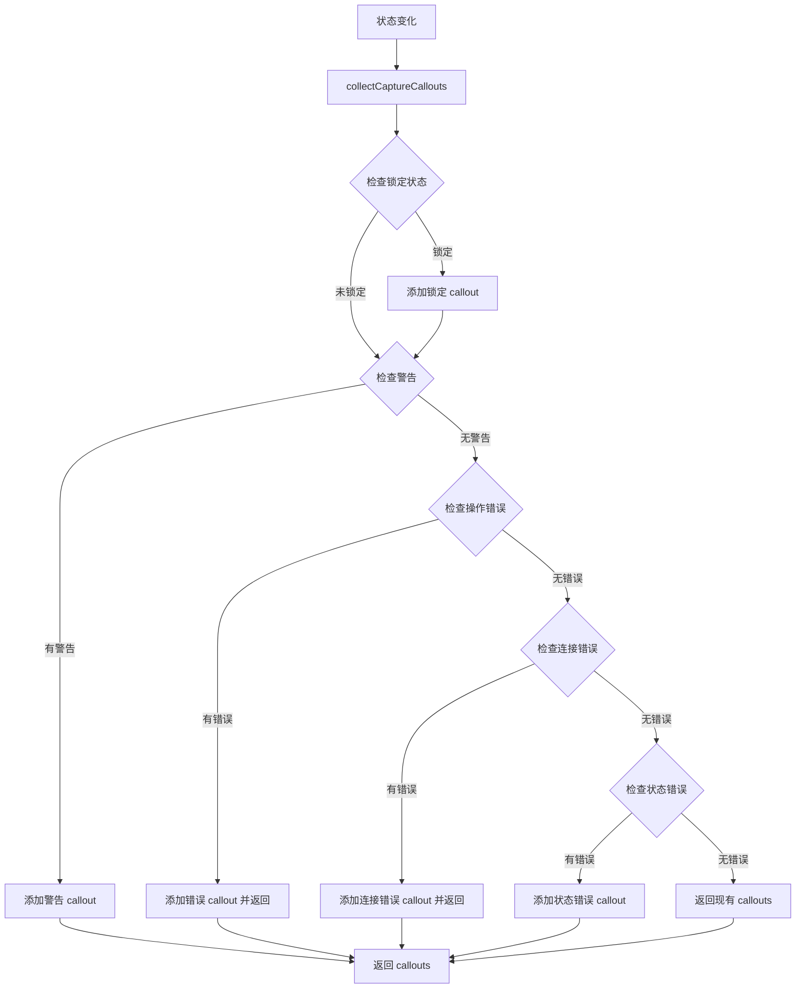

**图表来源**
- [src/renderer/features/right-rail/CaptureReplayStatus.tsx:47-89](file://src/renderer/features/right-rail/CaptureReplayStatus.tsx#L47-L89)

**章节来源**
- [src/renderer/features/right-rail/CaptureReplayStatus.tsx:1-136](file://src/renderer/features/right-rail/CaptureReplayStatus.tsx#L1-L136)

### 右侧面板容器（TraceRightPanel）
- 功能：组合进度、工件、输出、上下文、捕获五个区块，并根据数据存在性决定是否显示空状态。
- 数据绑定：从 presentation.rightPanel 解构出 progress/artifacts/outputs/context，并派生 hasArtifacts/hasOutputs/hasTaskContext/hasCapture 控制显示逻辑。

**章节来源**
- [src/renderer/features/right-rail/TraceRightPanel.tsx:1-46](file://src/renderer/features/right-rail/TraceRightPanel.tsx#L1-L46)

### 投影服务与映射（主进程）
- RightRailProjectionService：并发收集会话、任务、对话、请求快照、工件、设置，构建完整的 RightPanelViewModel。
- rightRailProjectionMappers：
  - mapRightRailProgress：将任务记录映射为进度任务。
  - mapRightRailOutputs：过滤输出工件并按最新运行分组。
  - buildTaskContext：组装任务上下文资源与权限模式。
  - buildRdxContext：组装捕获、可用捕获、运行时上下文与诊断。
- rightRailInvestigationArtifacts：拉取工件索引与清单，计算覆盖与截断，处理降级状态。

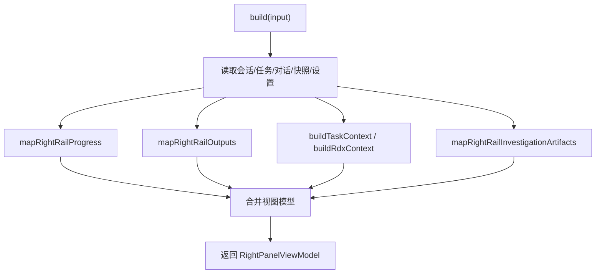

**图表来源**
- [src/main/agent-trace/RightRailProjectionService.ts:1-97](file://src/main/agent-trace/RightRailProjectionService.ts#L1-L97)
- [src/main/agent-trace/rightRailProjectionMappers.ts:1-184](file://src/main/agent-trace/rightRailProjectionMappers.ts#L1-L184)
- [src/main/agent-trace/rightRailInvestigationArtifacts.ts:1-106](file://src/main/agent-trace/rightRailInvestigationArtifacts.ts#L1-L106)

**章节来源**
- [src/main/agent-trace/RightRailProjectionService.ts:1-97](file://src/main/agent-trace/RightRailProjectionService.ts#L1-L97)
- [src/main/agent-trace/rightRailProjectionMappers.ts:1-184](file://src/main/agent-trace/rightRailProjectionMappers.ts#L1-L184)
- [src/main/agent-trace/rightRailInvestigationArtifacts.ts:1-106](file://src/main/agent-trace/rightRailInvestigationArtifacts.ts#L1-L106)

## 回放功能详解

### CaptureFrame 交互式回放界面
- 功能：提供交互式回放界面，支持事件选择、目标切换、实时反馈和状态指示。
- 核心特性：
  - 事件导航：通过前后按钮、滑块和直接输入事件ID进行导航。
  - 目标切换：支持不同纹理目标和输出槽位的选择。
  - 实时反馈：显示请求状态、应用状态和设备同步状态。
  - 错误处理：显示错误信息和重试选项。

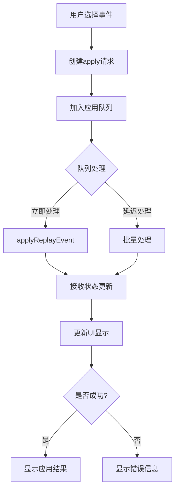

**图表来源**
- [src/renderer/features/right-rail/CaptureFrame.tsx:17-33](file://src/renderer/features/right-rail/CaptureFrame.tsx#L17-L33)
- [src/renderer/features/right-rail/replayApplyQueue.ts:1-32](file://src/renderer/features/right-rail/replayApplyQueue.ts#L1-L32)

**章节来源**
- [src/renderer/features/right-rail/CaptureFrame.tsx:1-69](file://src/renderer/features/right-rail/CaptureFrame.tsx#L1-L69)
- [src/renderer/features/right-rail/replayApplyQueue.ts:1-32](file://src/renderer/features/right-rail/replayApplyQueue.ts#L1-L32)

### CaptureHistory 历史管理
- 功能：管理回放历史记录，支持浏览、播放和详细信息查看。
- 核心特性：
  - 历史加载：分页加载历史记录，支持增量更新。
  - 播放控制：支持自动播放、暂停和手动导航。
  - 实时观察：在回放过程中显示代理观察结果。
  - 工具调用关联：支持跳转到相关工具调用消息。

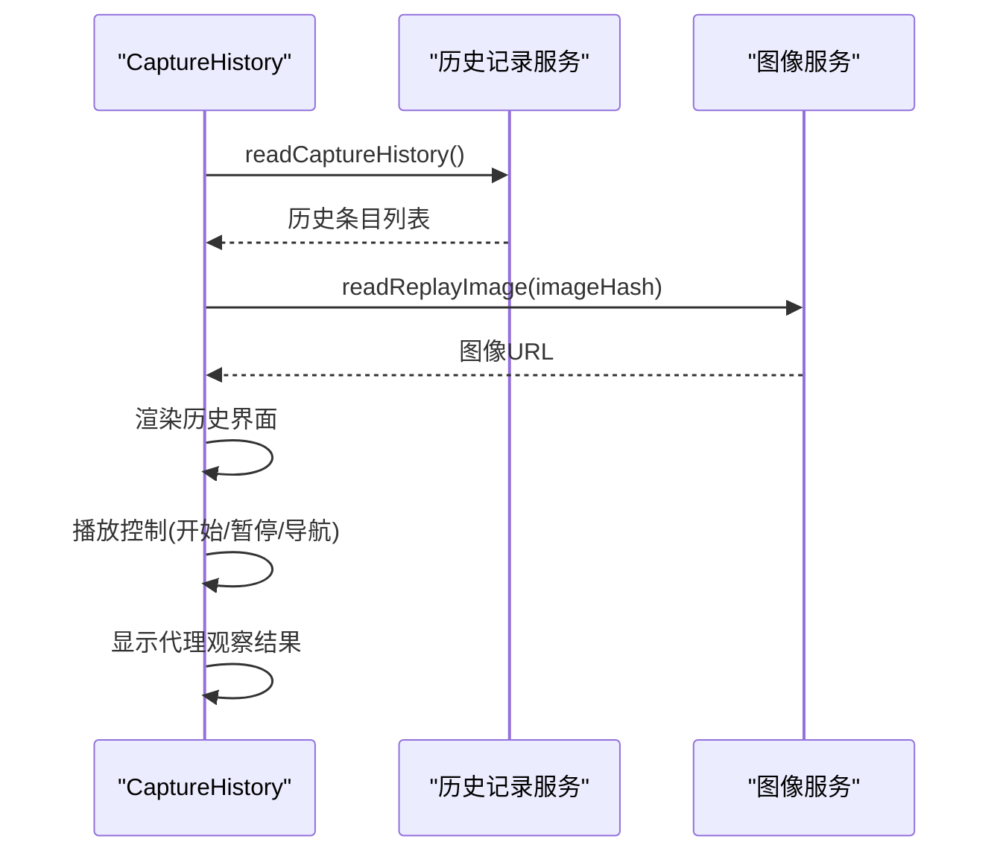

**图表来源**
- [src/renderer/features/right-rail/CaptureHistory.tsx:23-49](file://src/renderer/features/right-rail/CaptureHistory.tsx#L23-L49)
- [src/renderer/features/right-rail/readCaptureHistory.ts:10-26](file://src/renderer/features/right-rail/readCaptureHistory.ts#L10-L26)

**章节来源**
- [src/renderer/features/right-rail/CaptureHistory.tsx:1-92](file://src/renderer/features/right-rail/CaptureHistory.tsx#L1-L92)
- [src/renderer/features/right-rail/readCaptureHistory.ts:1-27](file://src/renderer/features/right-rail/readCaptureHistory.ts#L1-L27)

### useCaptureReplay 状态管理钩子
- 功能：统一管理回放状态的生命周期，包括状态订阅、错误处理和重新加载。
- 核心特性：
  - 状态订阅：通过 subscribeReplay 监听回放状态变化。
  - 状态验证：使用 acceptsReplayState 确保状态更新的顺序性。
  - 错误处理：捕获并显示状态获取过程中的错误。
  - 生命周期管理：组件卸载时自动清理订阅。

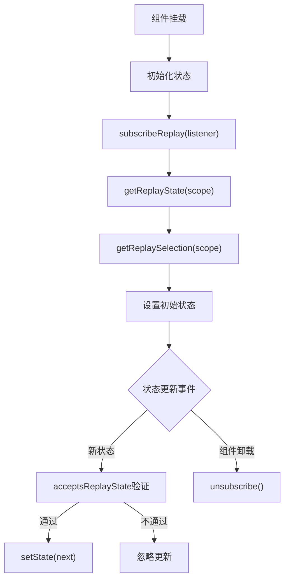

**图表来源**
- [src/renderer/features/right-rail/useCaptureReplay.ts:5-32](file://src/renderer/features/right-rail/useCaptureReplay.ts#L5-L32)

**章节来源**
- [src/renderer/features/right-rail/useCaptureReplay.ts:1-33](file://src/renderer/features/right-rail/useCaptureReplay.ts#L1-L33)

### replayApplyQueue 事件应用队列
- 功能：实现事件应用的请求去重和批量处理，避免重复请求和资源竞争。
- 核心特性：
  - 请求去重：同一时刻只保留一个待处理的请求。
  - 批量处理：支持立即处理和延迟处理两种模式。
  - 错误处理：统一处理应用过程中的错误。
  - 资源管理：提供 dispose 方法清理定时器。

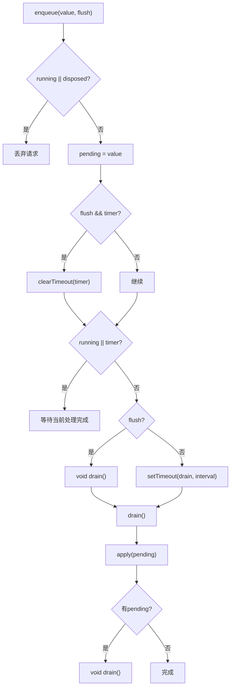

**图表来源**
- [src/renderer/features/right-rail/replayApplyQueue.ts:1-32](file://src/renderer/features/right-rail/replayApplyQueue.ts#L1-L32)

**章节来源**
- [src/renderer/features/right-rail/replayApplyQueue.ts:1-32](file://src/renderer/features/right-rail/replayApplyQueue.ts#L1-L32)

## 依赖关系分析
- 渲染层依赖：
  - stores：workflowStore、sessionProjectionStore、deviceStore、projectStore。
  - hooks：appShellBridge（打开路径、复制文本）、i18n。
  - ui：Button、DropdownSelect、TaskStatusMarker。
- 主进程依赖：
  - sessions：会话与工件源、存储适配器。
  - agent-runtime：任务注册表、会话任务存储。
  - settings：全局设置。
  - investigation：调查工件服务与错误处理。
- **新增**：回放功能依赖：
  - capturePanelActions：IPC 通信封装。
  - RdxSessionService：回放状态管理和事件应用。
  - captureDeviceHandlers：回放相关的 IPC 处理器。
  - **新增** CaptureReplayStatus：专用状态管理组件。
- 共享类型：trace.ts 定义了所有视图模型与枚举，captureReplay.ts 定义了回放相关类型。

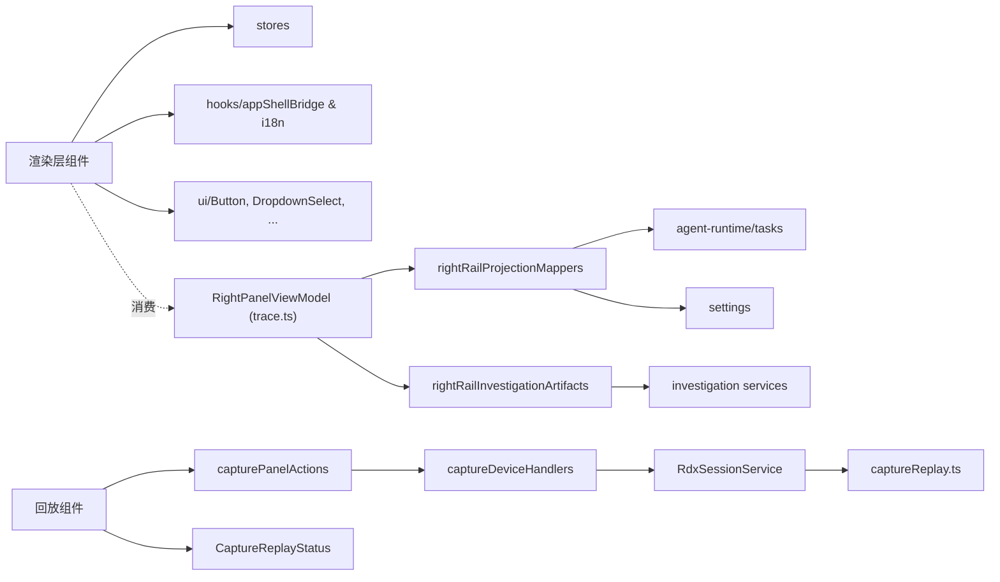

**图表来源**
- [src/shared/types/trace.ts:1-278](file://src/shared/types/trace.ts#L1-L278)
- [src/shared/types/captureReplay.ts:1-38](file://src/shared/types/captureReplay.ts#L1-L38)
- [src/renderer/features/right-rail/capturePanelActions.ts:1-24](file://src/renderer/features/right-rail/capturePanelActions.ts#L1-L24)
- [src/renderer/features/right-rail/CaptureReplayStatus.tsx:1-136](file://src/renderer/features/right-rail/CaptureReplayStatus.tsx#L1-L136)
- [src/main/ipc/captureDeviceHandlers.ts:25-61](file://src/main/ipc/captureDeviceHandlers.ts#L25-L61)
- [src/main/sessions/RdxSessionService.ts:73-229](file://src/main/sessions/RdxSessionService.ts#L73-L229)

**章节来源**
- [src/shared/types/trace.ts:1-278](file://src/shared/types/trace.ts#L1-L278)

## 性能考量
- 并发聚合：主进程使用 Promise.all 并发读取会话、任务、对话、快照、工件，减少构建延迟。
- 去重与限制：任务资源去重、工件列表限制最大行数，避免渲染过多节点。
- 增量刷新：捕获相关操作后仅刷新必要状态（捕获状态、上下文快照、追踪投影），降低整体重绘成本。
- 视觉反馈：任务定位时使用 CSS 动画与媒体查询适配减少动效的设备偏好，提升可访问性与性能。
- **新增**：回放功能性能优化：
  - 事件应用队列：避免重复请求和资源竞争。
  - 历史分页加载：减少内存占用和网络请求。
  - 图像懒加载：仅在需要时加载回放图像。
  - 状态订阅优化：使用 generation 和 revision 字段确保状态更新的顺序性。
  - **新增** 状态组件优化：CaptureReplayStatus 组件提供高效的状态渲染和 callout 管理。
- **新增** 样式优化：
  - 使用容器查询（container queries）实现响应式布局。
  - 采用 aspect-ratio CSS 属性确保正确的纵横比。
  - 优化空状态视觉效果，提升用户体验。

## 故障排查指南
- 捕获打开失败：
  - 现象：CapturePanel 显示诊断信息，可能提示配置、设备不兼容或回放错误。
  - 处理：根据诊断动作选择重试、切换设备、打开设置或复制错误信息。
- 工件列表降级：
  - 现象：工件行标记为 degraded，标题为空，显示内容哈希短串。
  - 原因：清单缺失或内容哈希不一致，或索引损坏。
  - 处理：检查调查工件存储健康度，必要时重建索引或重新生成工件。
- 输出不可用：
  - 现象：输出状态为 failed，打开按钮禁用。
  - 处理：确认输出是否生成成功，检查路径与权限。
- **新增**：回放功能故障排查：
  - 回放状态异常：检查 useCaptureReplay 的状态订阅是否正确，确认 generation 和 revision 字段。
  - 事件应用失败：查看 replayApplyQueue 的错误处理，确认事件ID有效性。
  - 历史加载失败：检查 readCaptureHistory 的分页逻辑，确认 afterSequence 参数。
  - 图像加载失败：验证 imageSha256 和 captureHash 的正确性。
  - **新增** 状态显示问题：检查 CaptureReplayStatus 组件的状态解析逻辑，确认 resolveCaptureStatusTone 和 collectCaptureCallouts 的输出。
  - **新增** Callout 显示异常：验证 callout 收集函数的输入参数，确认各种状态组合的处理逻辑。

**章节来源**
- [src/renderer/features/right-rail/CapturePanel.tsx:103-112](file://src/renderer/features/right-rail/CapturePanel.tsx#L103-L112)
- [src/main/agent-trace/rightRailInvestigationArtifacts.ts:83-104](file://src/main/agent-trace/rightRailInvestigationArtifacts.ts#L83-L104)
- [src/renderer/features/right-rail/RightRailOutputList.tsx:22-34](file://src/renderer/features/right-rail/RightRailOutputList.tsx#L22-L34)
- [src/renderer/features/right-rail/CaptureReplayStatus.tsx:47-89](file://src/renderer/features/right-rail/CaptureReplayStatus.tsx#L47-L89)

## 结论
右侧面板通过清晰的分层架构实现了上下文展示、调试详情查看与工具输出预览的核心能力。**新增的回放功能**进一步增强了调试和分析能力，提供了交互式回放界面、历史管理和状态管理机制。**新增的专用状态管理组件**（CaptureReplayStatus）提供了统一的状态显示和 callout 管理功能，提升了用户体验的一致性。主进程投影服务统一聚合多源数据，渲染层以声明式方式消费视图模型，配合捕获面板的交互与诊断处理，形成闭环的工作流。建议在后续迭代中继续强化：
- 更细粒度的增量更新策略，减少不必要的全量刷新。
- 更丰富的工件预览能力与缓存策略。
- 更好的无障碍与国际化支持。
- 可扩展的面板插槽机制，便于第三方插件集成。
- **新增**：回放功能的性能优化和用户体验改进。
- **新增**：状态管理组件的扩展性和可定制性。

## 附录

### 数据模型概览（trace.ts 与 captureReplay.ts）
- 进度任务：ProgressTask
- 工件记录：TraceArtifactRecord
- 上下文资源：TaskContextResource
- 捕获上下文：RdxContextPanelViewModel
- 右侧面板视图模型：RightPanelViewModel
- **新增**：回放状态：CaptureReplayState
- **新增**：回放事件：CaptureReplayEvent
- **新增**：回放目标：CaptureReplayTarget
- **新增**：回放历史：CaptureReplayHistoryEntry
- **新增**：状态色调：CaptureStatusTone
- **新增**：Callout 类型：CaptureCallout

**章节来源**
- [src/shared/types/trace.ts:26-82](file://src/shared/types/trace.ts#L26-L82)
- [src/shared/types/trace.ts:138-163](file://src/shared/types/trace.ts#L138-L163)
- [src/shared/types/trace.ts:165-247](file://src/shared/types/trace.ts#L165-L247)
- [src/shared/types/trace.ts:249-254](file://src/shared/types/trace.ts#L249-L254)
- [src/shared/types/captureReplay.ts:16-37](file://src/shared/types/captureReplay.ts#L16-L37)

### 自定义面板开发与插件扩展建议
- 在 ControlPanel 中增加新的 rightRailTarget 分支，挂载自定义面板组件。
- 复用 RightRailProjectionService 的能力，通过新增映射函数扩展视图模型字段。
- 使用共享类型 trace.ts 定义新字段，保持前后端契约一致。
- 通过 appShellBridge 与 IPC 调用主进程能力，实现插件化功能。
- **新增**：回放功能扩展建议：
  - 基于 useCaptureReplay 钩子开发自定义回放界面。
  - 利用 replayApplyQueue 实现自定义事件处理逻辑。
  - 扩展 CaptureHistory 组件支持更多历史数据类型。
  - **新增** 使用 CaptureReplayStatus 组件提供统一的状态显示。
  - **新增** 自定义 callout 类型和处理逻辑。

**章节来源**
- [src/renderer/features/right-rail/index.tsx:7-18](file://src/renderer/features/right-rail/index.tsx#L7-L18)
- [src/main/agent-trace/RightRailProjectionService.ts:37-93](file://src/main/agent-trace/RightRailProjectionService.ts#L37-L93)
- [src/renderer/features/right-rail/CaptureReplayStatus.tsx:1-136](file://src/renderer/features/right-rail/CaptureReplayStatus.tsx#L1-L136)

### 主题适配与样式建议
- 使用现有 CSS 类名（如 right-rail-section、right-rail-task-row）以保持风格一致。
- 利用 i18n 键值替换文案，确保多语言一致性。
- 对图标与颜色采用设计系统的 token，便于主题切换。
- **新增**：回放功能样式：
  - CaptureReplay.css 提供了完整的回放界面样式。
  - 支持响应式布局和可访问性要求。
  - 使用 CSS 变量确保主题一致性。
  - **新增** 状态芯片样式：支持 success、warning、error、info 四种色调。
  - **新增** Callout 样式：统一的警告、错误和信息提示样式。
- **新增** 空状态处理优化：
  - 使用容器查询（container queries）实现响应式布局。
  - 采用 aspect-ratio CSS 属性确保正确的纵横比。
  - 优化 RightRailEmptyVisuals 组件的视觉效果。
  - 改进空状态在不同屏幕尺寸下的显示效果。

[本节为通用样式建议，不直接分析具体文件]