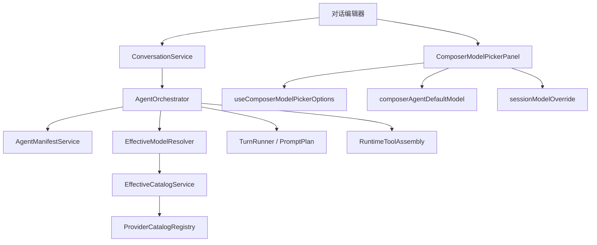
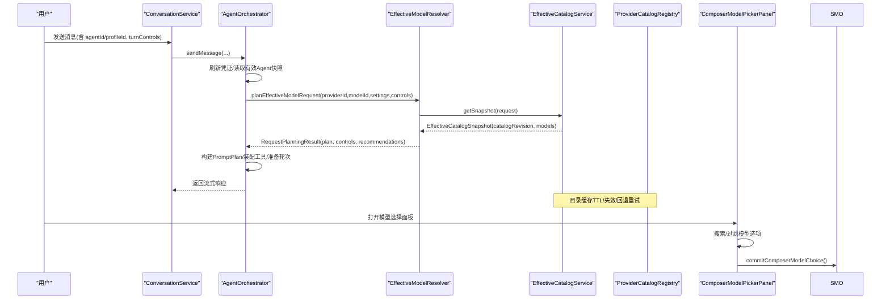
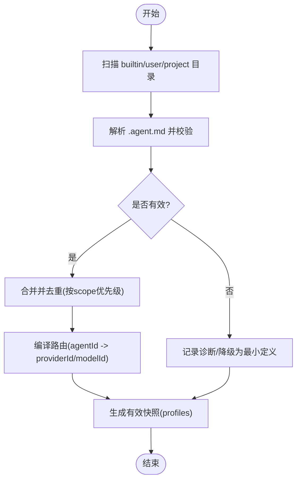
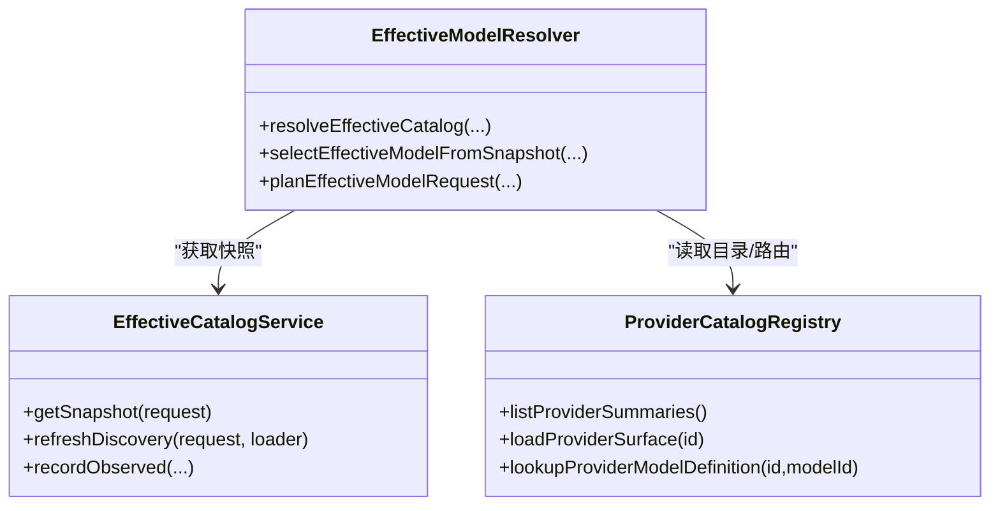
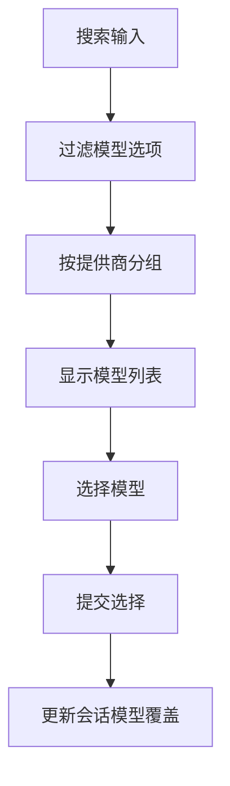
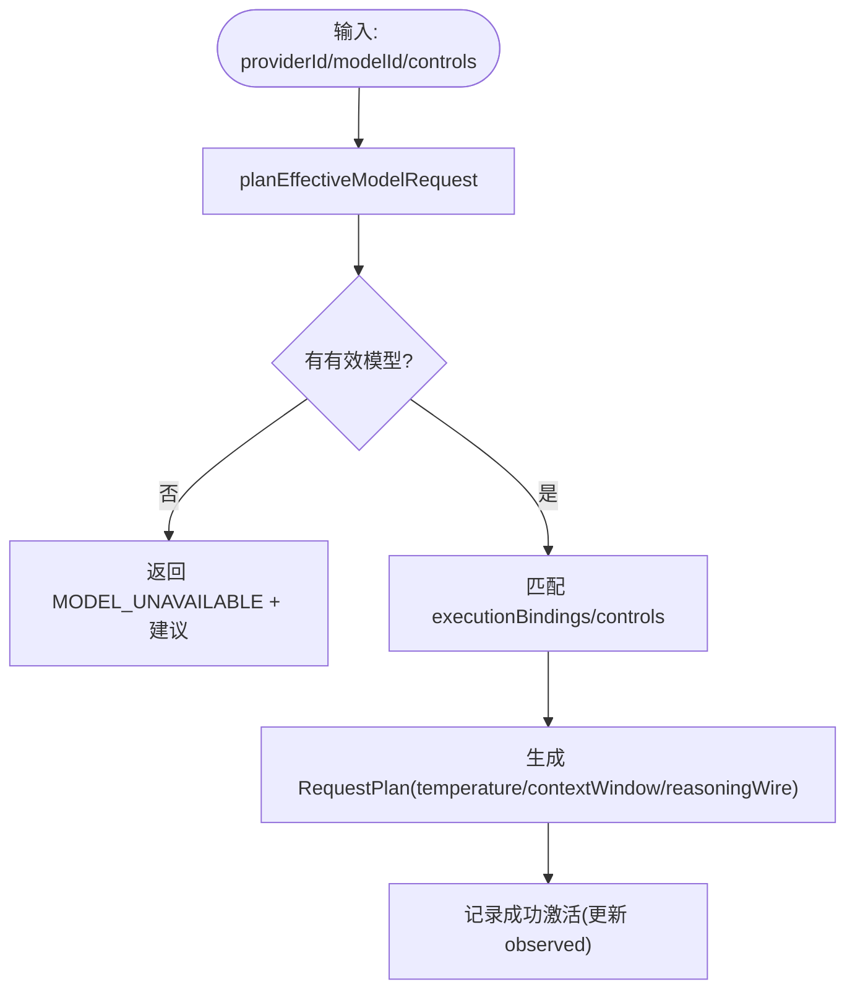
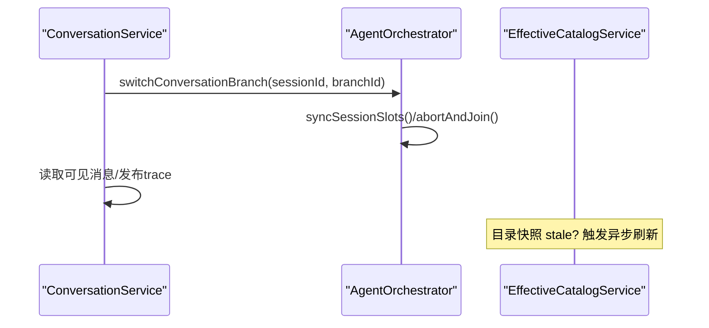
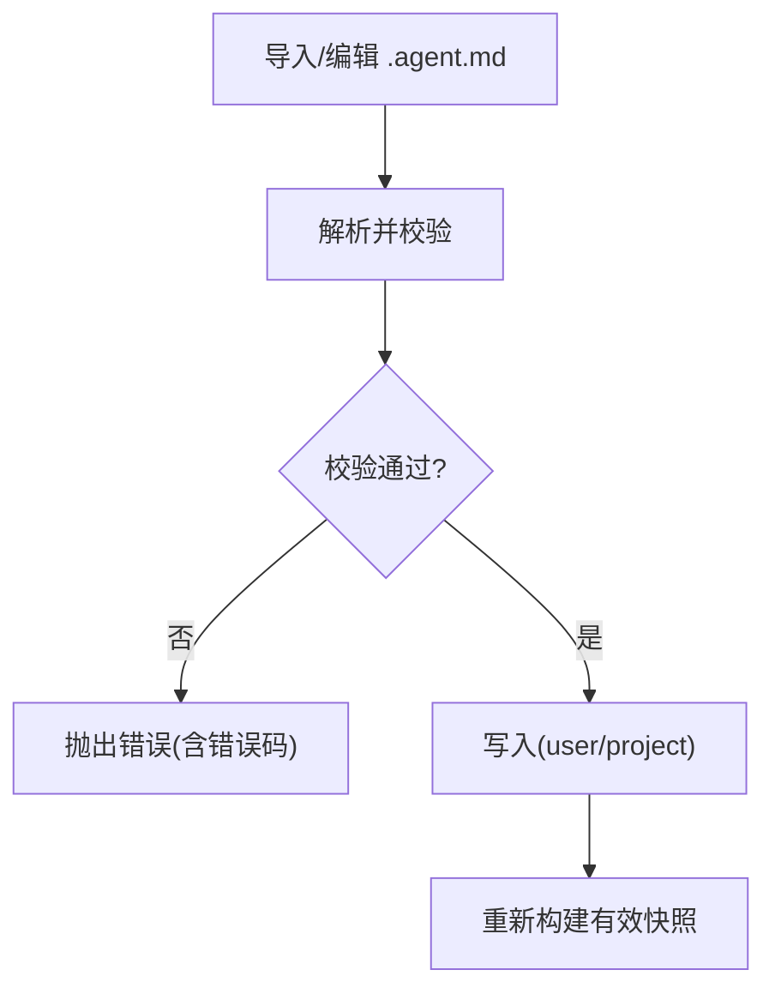
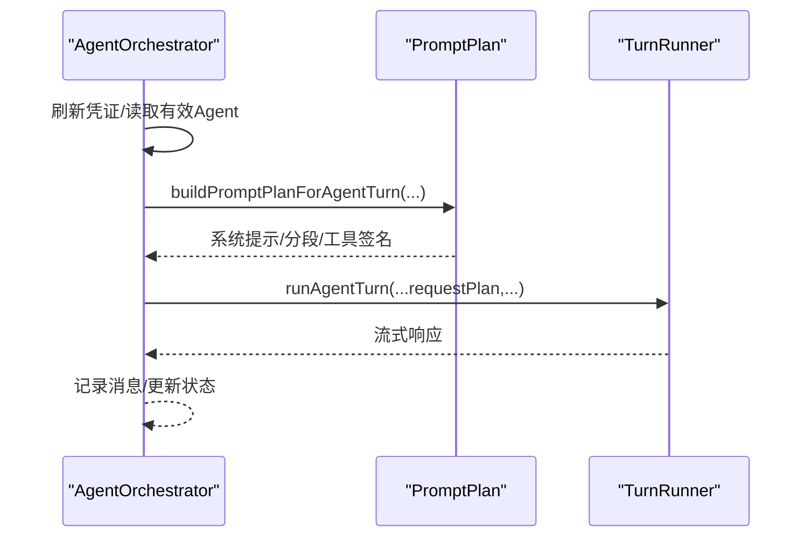
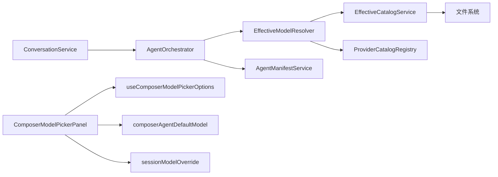

# Agent 选择与配置

<cite>
**本文引用的文件**
- [src/main/agent-runtime/index.ts](file://src/main/agent-runtime/index.ts)
- [src/main/settings/EffectiveModelResolver.ts](file://src/main/settings/EffectiveModelResolver.ts)
- [src/main/settings/EffectiveCatalogService.ts](file://src/main/settings/EffectiveCatalogService.ts)
- [src/main/provider-catalog/ProviderCatalogRegistry.ts](file://src/main/provider-catalog/ProviderCatalogRegistry.ts)
- [src/main/settings/ProviderCatalogService.ts](file://src/main/settings/ProviderCatalogService.ts)
- [src/main/settings/AgentManifestService.ts](file://src/main/settings/AgentManifestService.ts)
- [src/main/conversation/ConversationService.ts](file://src/main/conversation/ConversationService.ts)
- [src/main/workflow/debugger/AgentOrchestrator.ts](file://src/main/workflow/debugger/AgentOrchestrator.ts)
- [src/renderer/features/composer/ComposerModelPickerPanel.tsx](file://src/renderer/features/composer/ComposerModelPickerPanel.tsx)
- [src/renderer/features/composer/composerModelPicker.ts](file://src/renderer/features/composer/composerModelPicker.ts)
- [src/renderer/features/composer/composerAgentDefaultModel.ts](file://src/renderer/features/composer/composerAgentDefaultModel.ts)
- [src/renderer/features/composer/useComposerModelPickerOptions.ts](file://src/renderer/features/composer/useComposerModelPickerOptions.ts)
- [src/renderer/features/composer/sessionModelOverride.ts](file://src/renderer/features/composer/sessionModelOverride.ts)
- [src/renderer/hooks/useComposerEffectiveModel.ts](file://src/renderer/hooks/useComposerEffectiveModel.ts)
- [src/renderer/features/composer/ComposerModelEffortControl.tsx](file://src/renderer/features/composer/ComposerModelEffortControl.tsx)
- [src/renderer/features/composer/ComposerModelEffortPanel.tsx](file://src/renderer/features/composer/ComposerModelEffortPanel.tsx)
</cite>

## 更新摘要
**变更内容**
- 新增统一模型选择面板组件 ComposerModelPickerPanel，替代原有的 ComposerModelOverrideMenu
- 实现搜索功能、按提供者分组显示、Agent 默认选项支持
- 增强模型选择的用户体验，提供上下文窗口标签和推理能力标识
- 集成到统一的模型-努力胶囊界面中

## 目录
1. [简介](#简介)
2. [项目结构](#项目结构)
3. [核心组件](#核心组件)
4. [架构总览](#架构总览)
5. [详细组件分析](#详细组件分析)
6. [依赖关系分析](#依赖关系分析)
7. [性能考虑](#性能考虑)
8. [故障排查指南](#故障排查指南)
9. [结论](#结论)
10. [附录：使用场景与集成示例](#附录使用场景与集成示例)

## 简介
本文件面向"对话编辑器"的 Agent 选择与配置能力，系统性说明以下主题：
- Agent 发现机制、能力匹配与动态加载流程
- **新增的统一模型选择面板**：包含搜索功能、Agent 默认选项、按提供者分组的模型列表
- 模型选择、参数配置与权限模式设置
- Agent 切换、缓存策略与性能优化
- 自定义 Agent 注册、配置校验与错误处理
- 实际使用场景的代码级集成指引（以路径引用代替代码片段）

该子系统由"声明式清单 + 提供者目录 + 有效目录快照 + 运行时编排"四层协作完成，确保在用户界面中可感知、可配置、可执行且可审计。

## 项目结构
围绕 Agent 选择与配置的关键模块分布如下：
- 提供者目录层：提供内置 Provider 表面、路由、协议与模型清单
- 有效目录服务：合并多层贡献（目录、用户、授权、观察），生成带版本号的快照
- 模型解析器：基于有效目录进行模型选择、请求规划与能力探测
- Agent 清单服务：扫描并编译 .agent.md，产出可用 Agent 定义与路由
- **新增模型选择面板**：统一的模型选择界面，支持搜索、分组和默认选项
- 会话服务：负责消息发送、分支切换、幂等控制与上下文准备
- 编排器：统一入口，协调凭证、工具、提示计划与轮次执行

图表来源
- [src/main/conversation/ConversationService.ts:545-568](file://src/main/conversation/ConversationService.ts#L545-L568)
- [src/main/workflow/debugger/AgentOrchestrator.ts:195-366](file://src/main/workflow/debugger/AgentOrchestrator.ts#L195-L366)
- [src/renderer/features/composer/ComposerModelPickerPanel.tsx:32-80](file://src/renderer/features/composer/ComposerModelPickerPanel.tsx#L32-L80)
- [src/renderer/features/composer/useComposerModelPickerOptions.ts:21-40](file://src/renderer/features/composer/useComposerModelPickerOptions.ts#L21-L40)

章节来源
- [src/main/agent-runtime/index.ts:1-14](file://src/main/agent-runtime/index.ts#L1-L14)

## 核心组件
- EffectiveCatalogService：维护 discovery/entitlement/observed 三层数据，持久化并支持失效与回退重试，输出带 catalogRevision 的有效目录快照。
- EffectiveModelResolver：将 Provider 设置、目录、用户覆盖与授权信息合并为 EffectiveModel，并进行请求规划（fast/max-context/reasoning）。
- AgentManifestService：扫描 builtin/user/project 三处 .agent.md，解析、校验、去重、编译路由，并提供模型选项投影。
- ProviderCatalogRegistry：加载编译后的 Provider 表面与模型清单，提供路由、协议、认证模式与默认 baseUrl。
- ConversationService：会话级入口，负责消息发送、分支切换、幂等与上下文准备。
- AgentOrchestrator：编排凭证刷新、工具装配、提示计划、轮次执行与状态更新。
- **新增 ComposerModelPickerPanel**：统一的模型选择面板，支持搜索、分组显示、Agent 默认选项和上下文窗口标签。

章节来源
- [src/main/settings/EffectiveCatalogService.ts:84-244](file://src/main/settings/EffectiveCatalogService.ts#L84-L244)
- [src/main/settings/EffectiveModelResolver.ts:421-640](file://src/main/settings/EffectiveModelResolver.ts#L421-L640)
- [src/main/settings/AgentManifestService.ts:186-275](file://src/main/settings/AgentManifestService.ts#L186-L275)
- [src/main/provider-catalog/ProviderCatalogRegistry.ts:119-202](file://src/main/provider-catalog/ProviderCatalogRegistry.ts#L119-L202)
- [src/main/conversation/ConversationService.ts:545-568](file://src/main/conversation/ConversationService.ts#L545-L568)
- [src/main/workflow/debugger/AgentOrchestrator.ts:195-366](file://src/main/workflow/debugger/AgentOrchestrator.ts#L195-L366)
- [src/renderer/features/composer/ComposerModelPickerPanel.tsx:32-80](file://src/renderer/features/composer/ComposerModelPickerPanel.tsx#L32-L80)

## 架构总览
下图展示从"对话编辑"到"模型执行"的端到端流程，包括 Agent 选择、能力匹配、动态加载与缓存，以及新的统一模型选择界面。

图表来源
- [src/main/conversation/ConversationService.ts:545-568](file://src/main/conversation/ConversationService.ts#L545-L568)
- [src/main/workflow/debugger/AgentOrchestrator.ts:195-366](file://src/main/workflow/debugger/AgentOrchestrator.ts#L195-L366)
- [src/renderer/features/composer/ComposerModelPickerPanel.tsx:68-80](file://src/renderer/features/composer/ComposerModelPickerPanel.tsx#L68-L80)
- [src/renderer/features/composer/sessionModelOverride.ts:36-46](file://src/renderer/features/composer/sessionModelOverride.ts#L36-L46)

## 详细组件分析

### 1) Agent 发现机制与动态加载
- 清单扫描范围：builtin、user、project 三级目录，按优先级合并；保留历史保留 ID 的诊断告警。
- 解析与校验：严格解析 .agent.md frontmatter，失败时记录诊断并降级为最小可用定义。
- 路由编译：从 models 字段提取 providerId/modelId，形成 LlmAgentRoute；未命中则置空。
- 生效快照：返回 profiles 列表，附带 effectiveStatus、provenance 与 sourceHash，供上层决策。

图表来源
- [src/main/settings/AgentManifestService.ts:95-175](file://src/main/settings/AgentManifestService.ts#L95-L175)
- [src/main/settings/AgentManifestService.ts:186-245](file://src/main/settings/AgentManifestService.ts#L186-L245)
- [src/main/settings/AgentManifestService.ts:405-410](file://src/main/settings/AgentManifestService.ts#L405-L410)

章节来源
- [src/main/settings/AgentManifestService.ts:95-175](file://src/main/settings/AgentManifestService.ts#L95-L175)
- [src/main/settings/AgentManifestService.ts:186-245](file://src/main/settings/AgentManifestService.ts#L186-L245)
- [src/main/settings/AgentManifestService.ts:405-410](file://src/main/settings/AgentManifestService.ts#L405-L410)

### 2) 能力匹配与模型选择
- 有效目录合并：catalog（内置）、user（用户配置）、entitlement（账户授权）、observed（运行观测）多层叠加。
- 权威目录策略：对 authoritative-list 的 Provider，缺失的账号限定模型会被 tombstone 标记为不可用。
- 选择算法：精确匹配 modelId → 别名匹配 → 推荐排序（排除 internal 目标）。
- 请求规划：根据 controls（fast/max-context/reasoning）与 executionBindings 计算最终 plan，必要时给出建议模型。

图表来源
- [src/main/settings/EffectiveCatalogService.ts:150-244](file://src/main/settings/EffectiveCatalogService.ts#L150-L244)
- [src/main/settings/EffectiveModelResolver.ts:421-640](file://src/main/settings/EffectiveModelResolver.ts#L421-L640)
- [src/main/provider-catalog/ProviderCatalogRegistry.ts:119-202](file://src/main/provider-catalog/ProviderCatalogRegistry.ts#L119-L202)

章节来源
- [src/main/settings/EffectiveModelResolver.ts:286-317](file://src/main/settings/EffectiveModelResolver.ts#L286-L317)
- [src/main/settings/EffectiveModelResolver.ts:526-640](file://src/main/settings/EffectiveModelResolver.ts#L526-L640)
- [src/main/settings/EffectiveCatalogService.ts:150-244](file://src/main/settings/EffectiveCatalogService.ts#L150-L244)

### 3) 统一模型选择面板（新增）
**更新** 新增了统一的模型选择面板组件，提供改进的用户体验和功能。

- **搜索功能**：支持按提供商ID、模型ID、标签和别名进行搜索过滤
- **分组显示**：按提供商组织模型列表，提升可读性
- **Agent 默认选项**：显示和选择 Agent 配置的默认模型
- **上下文窗口标签**：显示模型的上下文窗口大小信息
- **推理能力标识**：标识支持推理功能的模型
- **键盘导航**：支持箭头键、Home/End 键的无障碍访问

图表来源
- [src/renderer/features/composer/ComposerModelPickerPanel.tsx:55-59](file://src/renderer/features/composer/ComposerModelPickerPanel.tsx#L55-L59)
- [src/renderer/features/composer/composerModelPicker.ts:84-111](file://src/renderer/features/composer/composerModelPicker.ts#L84-L111)
- [src/renderer/features/composer/sessionModelOverride.ts:36-46](file://src/renderer/features/composer/sessionModelOverride.ts#L36-L46)

章节来源
- [src/renderer/features/composer/ComposerModelPickerPanel.tsx:32-80](file://src/renderer/features/composer/ComposerModelPickerPanel.tsx#L32-L80)
- [src/renderer/features/composer/composerModelPicker.ts:23-111](file://src/renderer/features/composer/composerModelPicker.ts#L23-L111)
- [src/renderer/features/composer/composerAgentDefaultModel.ts:25-63](file://src/renderer/features/composer/composerAgentDefaultModel.ts#L25-L63)

### 4) 模型选择、参数配置与权限模式
- 模型选择：优先 exact match，其次 alias；internal 目标不暴露给选择器。
- 参数配置：
  - fastModel：快速模式开关，受 executionBinding 与 entitlement 控制。
  - maxContextMode：长上下文模式，绑定特定 tier 与 entitlement。
  - reasoningLevel：推理级别映射到 wireProfile，某些 Provider 强制 always-on。
- 权限模式：authMode 来自 Provider 表面（account/none/api-key/environment/local），影响连接与凭据生命周期。

图表来源
- [src/main/settings/EffectiveModelResolver.ts:593-640](file://src/main/settings/EffectiveModelResolver.ts#L593-640)
- [src/main/settings/EffectiveModelResolver.ts:689-745](file://src/main/settings/EffectiveModelResolver.ts#L689-745)
- [src/main/provider-catalog/ProviderCatalogRegistry.ts:210-266](file://src/main/provider-catalog/ProviderCatalogRegistry.ts#L210-L266)

章节来源
- [src/main/settings/EffectiveModelResolver.ts:593-640](file://src/main/settings/EffectiveModelResolver.ts#L593-640)
- [src/main/settings/EffectiveModelResolver.ts:689-745](file://src/main/settings/EffectiveModelResolver.ts#L689-745)
- [src/main/provider-catalog/ProviderCatalogRegistry.ts:210-266](file://src/main/provider-catalog/ProviderCatalogRegistry.ts#L210-L266)

### 5) Agent 切换、缓存策略与性能优化
- Agent 切换：通过 conversation branch 切换实现多分支并行与回溯；切换时清理内存 slot 缓存并中止活跃轮次。
- 缓存策略：
  - EffectiveCatalogService 持久化 discoveries/entitlements/observed，带 TTL 与 backoff 重试。
  - ProviderCatalogRegistry 缓存已加载的 Provider surface，避免重复 IO。
- 性能优化：
  - 幂等请求指纹与去重，防止重复准备。
  - 按需刷新目录（stale 检测），减少不必要网络。
  - 工具延迟激活与 MCP 租约释放，降低资源占用。

图表来源
- [src/main/conversation/ConversationService.ts:704-741](file://src/main/conversation/ConversationService.ts#L704-L741)
- [src/main/workflow/debugger/AgentOrchestrator.ts:638-653](file://src/main/workflow/debugger/AgentOrchestrator.ts#L638-L653)
- [src/main/settings/EffectiveCatalogService.ts:150-244](file://src/main/settings/EffectiveCatalogService.ts#L150-L244)

章节来源
- [src/main/conversation/ConversationService.ts:704-741](file://src/main/conversation/ConversationService.ts#L704-L741)
- [src/main/workflow/debugger/AgentOrchestrator.ts:638-653](file://src/main/workflow/debugger/AgentOrchestrator.ts#L638-L653)
- [src/main/settings/EffectiveCatalogService.ts:150-244](file://src/main/settings/EffectiveCatalogService.ts#L150-L244)

### 6) 自定义 Agent 注册、配置验证与错误处理
- 注册方式：在 user 或 project 目录放置 .agent.md，系统自动发现并编译。
- 配置验证：严格解析 frontmatter，非法内容会抛出明确错误码（如 AGENT_MANIFEST_INVALID、BUILTIN_AGENT_MANIFEST_READONLY）。
- 写入保护：builtin 只读，需 CoW 复制；项目级保存需要 projectRoot；文件名必须与 id 一致。
- 导入功能：支持从外部 .agent.md 导入并转为 user 定义。

图表来源
- [src/main/settings/AgentManifestService.ts:284-362](file://src/main/settings/AgentManifestService.ts#L284-L362)
- [src/main/settings/AgentManifestService.ts:412-444](file://src/main/settings/AgentManifestService.ts#L412-L444)

章节来源
- [src/main/settings/AgentManifestService.ts:284-362](file://src/main/settings/AgentManifestService.ts#L284-L362)
- [src/main/settings/AgentManifestService.ts:412-444](file://src/main/settings/AgentManifestService.ts#L412-L444)

### 7) 运行时编排与执行
- 凭证管理：发送前冻结并刷新 Provider 凭据，必要时重新应用 LLM 配置。
- 提示计划：根据 contextWindow、toolAllowlist、effectiveProfile 构建系统提示与分段。
- 轮次执行：调用 TurnRunner 执行，携带 requestPlan、turnControls、effectiveModel 等信息。
- 结果记录：流式内容落盘并发布 trace，更新 Agent 状态。

图表来源
- [src/main/workflow/debugger/AgentOrchestrator.ts:195-366](file://src/main/workflow/debugger/AgentOrchestrator.ts#L195-366)
- [src/main/workflow/debugger/AgentOrchestrator.ts:384-634](file://src/main/workflow/debugger/AgentOrchestrator.ts#L384-L634)

章节来源
- [src/main/workflow/debugger/AgentOrchestrator.ts:195-366](file://src/main/workflow/debugger/AgentOrchestrator.ts#L195-366)
- [src/main/workflow/debugger/AgentOrchestrator.ts:384-634](file://src/main/workflow/debugger/AgentOrchestrator.ts#L384-L634)

## 依赖关系分析
- ConversationService 依赖 AgentOrchestrator 作为统一编排入口。
- AgentOrchestrator 依赖 EffectiveModelResolver 做模型规划，依赖 AgentManifestService 获取有效 Agent 定义。
- EffectiveModelResolver 依赖 EffectiveCatalogService 获取合并后的目录快照，依赖 ProviderCatalogRegistry 读取 Provider 表面与模型定义。
- EffectiveCatalogService 依赖文件系统持久化目录状态，并支持订阅者通知。
- **新增依赖**：ComposerModelPickerPanel 依赖 useComposerModelPickerOptions、composerAgentDefaultModel 和 sessionModelOverride。

图表来源
- [src/main/conversation/ConversationService.ts:545-568](file://src/main/conversation/ConversationService.ts#L545-L568)
- [src/main/workflow/debugger/AgentOrchestrator.ts:195-366](file://src/main/workflow/debugger/AgentOrchestrator.ts#L195-L366)
- [src/renderer/features/composer/ComposerModelPickerPanel.tsx:6-17](file://src/renderer/features/composer/ComposerModelPickerPanel.tsx#L6-L17)

章节来源
- [src/main/conversation/ConversationService.ts:545-568](file://src/main/conversation/ConversationService.ts#L545-L568)
- [src/main/workflow/debugger/AgentOrchestrator.ts:195-366](file://src/main/workflow/debugger/AgentOrchestrator.ts#L195-L366)
- [src/renderer/features/composer/ComposerModelPickerPanel.tsx:6-17](file://src/renderer/features/composer/ComposerModelPickerPanel.tsx#L6-L17)

## 性能考虑
- 目录缓存与TTL：EffectiveCatalogService 对 discovery/entitlement 设置过期时间，避免频繁刷新；失败时指数退避。
- 幂等与去重：ConversationService 基于 requestId 与指纹去重，避免重复准备与执行。
- 按需刷新：仅在 stale 且有 activeLoader 时触发刷新，减少无效 IO。
- 工具与MCP：延迟激活与租约释放，减少常驻资源占用。
- 分支切换：切换时清理内存 slot 缓存，保证一致性。
- **新增优化**：模型选择面板使用 useMemo 缓存过滤和分组结果，useEffect 管理异步数据加载，避免不必要的重新渲染。

[本节为通用性能指导，无需具体文件引用]

## 故障排查指南
- 模型不可用：检查 effective catalog 中模型 availability 与 controls；查看 planEffectiveModelRequest 返回的 code/message 与建议模型。
- 目录刷新失败：关注 lastRefreshError 与 backoff 窗口；必要时调用 invalidateDiscovery 主动失效。
- Agent 清单错误：根据错误码定位问题（如 AGENT_MANIFEST_INVALID、BUILTIN_AGENT_MANIFEST_READONLY），修正 .agent.md 后重新构建。
- 会话繁忙/冲突：确认 requestId 唯一性与 fingerprint 匹配；避免并发准备同一 scope。
- 分支切换异常：确保先停止活跃轮次并同步 slot；检查 fork/branch 有效性。
- **新增排查**：模型选择面板问题检查 providers 配置、有效目录加载状态、Agent 默认模型可用性。

章节来源
- [src/main/settings/EffectiveModelResolver.ts:593-640](file://src/main/settings/EffectiveModelResolver.ts#L593-L640)
- [src/main/settings/EffectiveCatalogService.ts:123-148](file://src/main/settings/EffectiveCatalogService.ts#L123-L148)
- [src/main/settings/AgentManifestService.ts:284-362](file://src/main/settings/AgentManifestService.ts#L284-L362)
- [src/main/conversation/ConversationService.ts:445-543](file://src/main/conversation/ConversationService.ts#L445-L543)
- [src/main/conversation/ConversationService.ts:704-741](file://src/main/conversation/ConversationService.ts#L704-L741)

## 结论
该子系统通过"清单驱动 + 目录合并 + 请求规划 + 编排执行"的清晰分层，实现了 Agent 的可发现、可配置、可执行与可审计。结合缓存、幂等与回退策略，在保证正确性的同时兼顾了性能与稳定性。**新增的统一模型选择面板进一步提升了用户体验**，提供了搜索、分组、默认选项等功能，使模型选择更加直观和高效。对于扩展新 Agent 与新 Provider，只需遵循清单与目录规范即可无缝接入。

[本节为总结性内容，无需具体文件引用]

## 附录：使用场景与集成示例
以下为常见使用场景的集成要点（以文件路径引用代替代码片段）：

- 场景一：用户在对话中选择不同 Agent 并发送消息
  - 入口：ConversationService.sendMessage
  - 关键步骤：解析 agentId/profileId → 编排 → 模型规划 → 提示计划 → 执行
  - 参考路径
    - [src/main/conversation/ConversationService.ts:545-568](file://src/main/conversation/ConversationService.ts#L545-L568)
    - [src/main/workflow/debugger/AgentOrchestrator.ts:195-366](file://src/main/workflow/debugger/AgentOrchestrator.ts#L195-L366)

- 场景二：**使用新的统一模型选择面板**
  - 入口：ComposerModelPickerPanel 组件
  - 关键步骤：加载模型选项 → 搜索过滤 → 分组显示 → 选择模型 → 提交覆盖
  - 参考路径
    - [src/renderer/features/composer/ComposerModelPickerPanel.tsx:32-80](file://src/renderer/features/composer/ComposerModelPickerPanel.tsx#L32-L80)
    - [src/renderer/features/composer/useComposerModelPickerOptions.ts:21-40](file://src/renderer/features/composer/useComposerModelPickerOptions.ts#L21-L40)
    - [src/renderer/features/composer/sessionModelOverride.ts:36-46](file://src/renderer/features/composer/sessionModelOverride.ts#L36-L46)

- 场景三：切换对话分支并继续对话
  - 入口：ConversationService.switchConversationBranch
  - 关键步骤：停止活跃轮次 → 同步 slot → 重建可见消息 → 发布 trace
  - 参考路径
    - [src/main/conversation/ConversationService.ts:704-741](file://src/main/conversation/ConversationService.ts#L704-L741)

- 场景四：新增自定义 Agent 并在项目中生效
  - 操作：在项目 agentsPath 下添加 .agent.md，确保 id 合法、models 字段指向有效 provider/model
  - 验证：AgentManifestService 解析与校验，生成有效快照
  - 参考路径
    - [src/main/settings/AgentManifestService.ts:95-175](file://src/main/settings/AgentManifestService.ts#L95-L175)
    - [src/main/settings/AgentManifestService.ts:186-245](file://src/main/settings/AgentManifestService.ts#L186-L245)

- 场景五：调整模型参数（fast/max-context/reasoning）
  - 入口：EffectiveModelResolver.planEffectiveModelRequest
  - 行为：根据 controls 与 executionBindings 生成 plan，必要时给出建议
  - 参考路径
    - [src/main/settings/EffectiveModelResolver.ts:593-640](file://src/main/settings/EffectiveModelResolver.ts#L593-640)

- 场景六：刷新 Provider 目录并观察效果
  - 入口：EffectiveCatalogService.refreshDiscovery/getSnapshot
  - 行为：合并多层贡献，持久化并通知监听者
  - 参考路径
    - [src/main/settings/EffectiveCatalogService.ts:150-244](file://src/main/settings/EffectiveCatalogService.ts#L150-L244)

- 场景七：查询可用 Provider 与协议
  - 入口：ProviderCatalogService.getProviderCatalog
  - 行为：列出分类、协议与 Provider 摘要，便于 UI 渲染
  - 参考路径
    - [src/main/settings/ProviderCatalogService.ts:57-73](file://src/main/settings/ProviderCatalogService.ts#L57-L73)

- 场景八：**集成统一模型-努力胶囊界面**
  - 入口：ComposerModelEffortControl 组件
  - 关键步骤：构建胶囊展示 → 切换视图 → 集成模型选择和努力调节
  - 参考路径
    - [src/renderer/features/composer/ComposerModelEffortControl.tsx:20-184](file://src/renderer/features/composer/ComposerModelEffortControl.tsx#L20-L184)
    - [src/renderer/features/composer/ComposerModelEffortPanel.tsx:28-245](file://src/renderer/features/composer/ComposerModelEffortPanel.tsx#L28-L245)