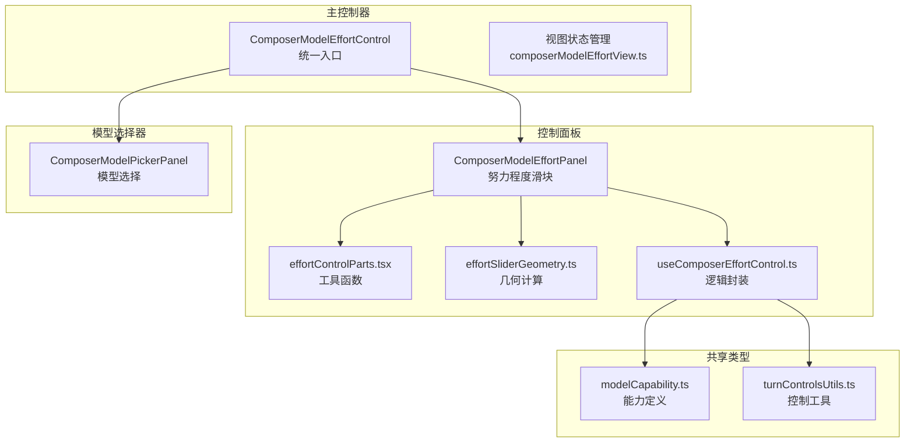
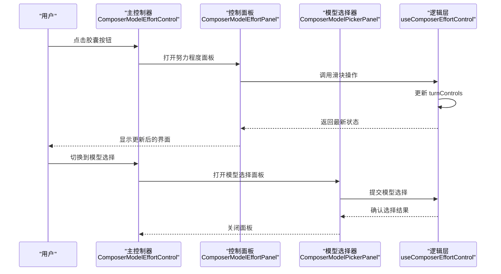
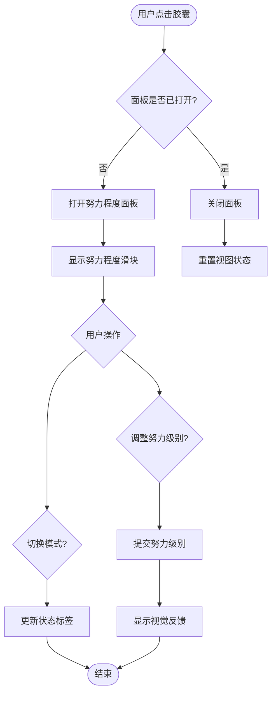
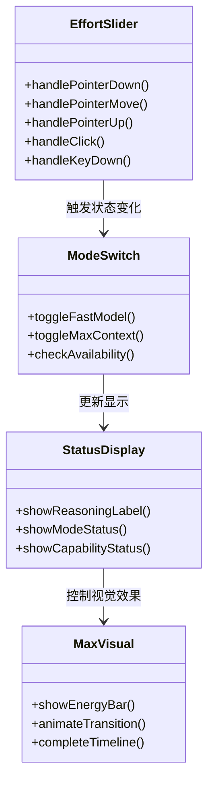
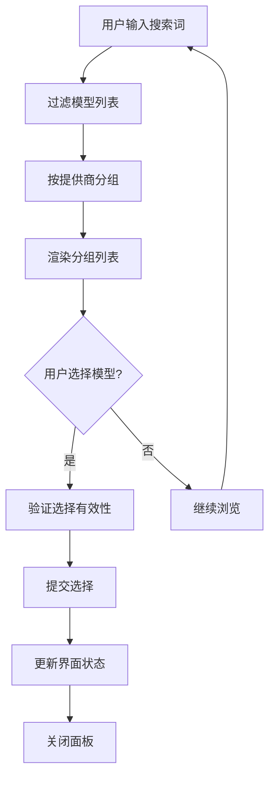
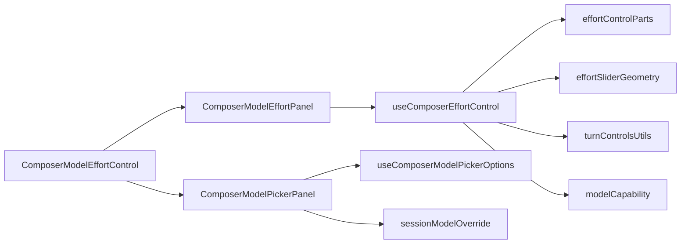

# 努力程度控制

<cite>
**本文引用的文件**
- [ComposerModelEffortControl.tsx](file://src/renderer/features/composer/ComposerModelEffortControl.tsx)
- [ComposerModelEffortPanel.tsx](file://src/renderer/features/composer/ComposerModelEffortPanel.tsx)
- [ComposerModelPickerPanel.tsx](file://src/renderer/features/composer/ComposerModelPickerPanel.tsx)
- [effortControlParts.tsx](file://src/renderer/features/composer/effortControlParts.tsx)
- [useComposerEffortControl.ts](file://src/renderer/features/composer/useComposerEffortControl.ts)
- [composerModelEffortView.ts](file://src/renderer/features/composer/composerModelEffortView.ts)
- [effortSliderGeometry.ts](file://src/renderer/features/composer/effortSliderGeometry.ts)
- [turnControlsUtils.ts](file://src/renderer/lib/turnControlsUtils.ts)
- [modelCapability.ts](file://src/shared/types/modelCapability.ts)
</cite>

## 更新摘要
**变更内容**
- 重构了模型与努力程度控制的界面架构，采用统一的胶囊式系统
- 将独立的 EffortControl.tsx 和 ComposerModelOverrideMenu.tsx 合并为 ComposerModelEffortControl.tsx
- 新增 ComposerModelEffortPanel.tsx 用于努力程度控制面板
- 新增 ComposerModelPickerPanel.tsx 用于模型选择面板
- 实现了视图状态管理和平滑的界面切换

## 目录
1. [简介](#简介)
2. [项目结构](#项目结构)
3. [核心组件](#核心组件)
4. [架构总览](#架构总览)
5. [详细组件分析](#详细组件分析)
6. [依赖关系分析](#依赖关系分析)
7. [性能与资源影响](#性能与资源影响)
8. [故障排查指南](#故障排查指南)
9. [结论](#结论)
10. [附录：使用场景与优化建议](#附录：使用场景与优化建议)

## 简介
本文件面向"对话编辑器"的努力程度控制能力，系统性说明用户如何调节推理努力级别、系统如何进行资源分配与成本估算、不同努力级别的特性与适用场景，以及界面交互、状态同步与配置持久化的完整流程。同时提供自定义努力级别、阈值设置与监控指标的实现要点，并给出实际使用场景的代码路径参考与优化建议。

**更新** 基于最新的胶囊式架构设计，重新组织了组件结构和交互流程，提供了更统一的用户体验。

## 项目结构
新的努力程度控制系统采用模块化设计，包含主控制器、控制面板和模型选择器：

**图表来源**
- [ComposerModelEffortControl.tsx:20-184](file://src/renderer/features/composer/ComposerModelEffortControl.tsx#L20-L184)
- [ComposerModelEffortPanel.tsx:28-245](file://src/renderer/features/composer/ComposerModelEffortPanel.tsx#L28-L245)
- [ComposerModelPickerPanel.tsx:32-207](file://src/renderer/features/composer/ComposerModelPickerPanel.tsx#L32-L207)
- [useComposerEffortControl.ts:27-168](file://src/renderer/features/composer/useComposerEffortControl.ts#L27-L168)

**章节来源**
- [ComposerModelEffortControl.tsx:20-184](file://src/renderer/features/composer/ComposerModelEffortControl.tsx#L20-L184)
- [ComposerModelEffortPanel.tsx:28-245](file://src/renderer/features/composer/ComposerModelEffortPanel.tsx#L28-L245)
- [ComposerModelPickerPanel.tsx:32-207](file://src/renderer/features/composer/ComposerModelPickerPanel.tsx#L32-L207)
- [useComposerEffortControl.ts:27-168](file://src/renderer/features/composer/useComposerEffortControl.ts#L27-L168)

## 核心组件
- **统一胶囊控制器**
  - ComposerModelEffortControl：作为主入口，整合模型选择和努力程度控制
  - 支持快速模式、最大上下文模式和推理努力级别的统一展示
  - 实现胶囊样式的紧凑界面设计
- **努力程度控制面板**
  - ComposerModelEffortPanel：提供滑块、开关和状态显示
  - 支持拖拽、点击和键盘操作
  - 集成最大上下文可视化效果
- **模型选择面板**
  - ComposerModelPickerPanel：提供模型搜索、分组和选择功能
  - 支持代理默认模型设置
  - 实现键盘导航和焦点管理
- **状态管理与逻辑**
  - useComposerEffortControl：封装所有业务逻辑
  - 处理能力检测、状态同步和事件响应
  - 管理滑块交互和视觉效果

**章节来源**
- [ComposerModelEffortControl.tsx:20-184](file://src/renderer/features/composer/ComposerModelEffortControl.tsx#L20-L184)
- [ComposerModelEffortPanel.tsx:28-245](file://src/renderer/features/composer/ComposerModelEffortPanel.tsx#L28-L245)
- [ComposerModelPickerPanel.tsx:32-207](file://src/renderer/features/composer/ComposerModelPickerPanel.tsx#L32-L207)
- [useComposerEffortControl.ts:27-168](file://src/renderer/features/composer/useComposerEffortControl.ts#L27-L168)

## 架构总览
新的架构采用分层设计，通过统一的控制器协调各个子组件：

**图表来源**
- [ComposerModelEffortControl.tsx:96-184](file://src/renderer/features/composer/ComposerModelEffortControl.tsx#L96-L184)
- [ComposerModelEffortPanel.tsx:116-245](file://src/renderer/features/composer/ComposerModelEffortPanel.tsx#L116-L245)
- [ComposerModelPickerPanel.tsx:120-207](file://src/renderer/features/composer/ComposerModelPickerPanel.tsx#L120-L207)
- [useComposerEffortControl.ts:115-168](file://src/renderer/features/composer/useComposerEffortControl.ts#L115-L168)

## 详细组件分析

### 统一胶囊控制器
新的 ComposerModelEffortControl 作为单一入口点，整合了模型选择和努力程度控制功能：

- **胶囊界面**：紧凑的 pill 形状设计，显示当前模型、努力级别和模式状态
- **视图管理**：支持在努力程度面板和模型选择面板之间切换
- **状态同步**：实时反映模型选择、努力级别和模式状态的变更
- **布局适配**：根据屏幕空间动态调整弹出位置

**图表来源**
- [ComposerModelEffortControl.tsx:68-184](file://src/renderer/features/composer/ComposerModelEffortControl.tsx#L68-L184)
- [composerModelEffortView.ts:5-11](file://src/renderer/features/composer/composerModelEffortView.ts#L5-L11)

**章节来源**
- [ComposerModelEffortControl.tsx:20-184](file://src/renderer/features/composer/ComposerModelEffortControl.tsx#L20-L184)
- [composerModelEffortView.ts:1-11](file://src/renderer/features/composer/composerModelEffortView.ts#L1-L11)

### 努力程度控制面板
ComposerModelEffortPanel 提供了完整的努力程度调节界面：

- **滑块控制**：支持拖拽、点击和键盘操作，具有吸附到可用级别的功能
- **模式开关**：快速模式和最大上下文模式的独立开关
- **状态显示**：实时显示当前努力级别、可用性和状态标签
- **视觉效果**：最大上下文模式下的能量条动画和过渡效果

**图表来源**
- [ComposerModelEffortPanel.tsx:13-245](file://src/renderer/features/composer/ComposerModelEffortPanel.tsx#L13-L245)
- [useComposerEffortControl.ts:151-168](file://src/renderer/features/composer/useComposerEffortControl.ts#L151-L168)

**章节来源**
- [ComposerModelEffortPanel.tsx:28-245](file://src/renderer/features/composer/ComposerModelEffortPanel.tsx#L28-L245)
- [useComposerEffortControl.ts:27-168](file://src/renderer/features/composer/useComposerEffortControl.ts#L27-L168)

### 模型选择面板
ComposerModelPickerPanel 提供了直观的模型选择界面：

- **搜索功能**：支持按名称搜索可用模型
- **分组显示**：按提供商对模型进行分组展示
- **默认模型**：支持设置代理默认模型
- **键盘导航**：完整的键盘访问支持和焦点管理

**图表来源**
- [ComposerModelPickerPanel.tsx:55-91](file://src/renderer/features/composer/ComposerModelPickerPanel.tsx#L55-L91)
- [ComposerModelPickerPanel.tsx:162-207](file://src/renderer/features/composer/ComposerModelPickerPanel.tsx#L162-L207)

**章节来源**
- [ComposerModelPickerPanel.tsx:32-207](file://src/renderer/features/composer/ComposerModelPickerPanel.tsx#L32-L207)

### 滑块几何与交互
effortSliderGeometry.ts 提供了精确的滑块几何计算：

- **拇指定位**：确保拇指始终在轨道范围内移动
- **比例映射**：将物理位置转换为逻辑比例值
- **工具提示定位**：智能调整工具提示位置避免溢出
- **吸附算法**：精确计算最近的可用级别位置

**章节来源**
- [effortSliderGeometry.ts:1-67](file://src/renderer/features/composer/effortSliderGeometry.ts#L1-L67)

### 工具函数与辅助方法
effortControlParts.tsx 提供了核心的工具函数：

- **级别解析**：根据能力约束解析有效的努力级别
- **显示顺序**：生成符合用户期望的显示顺序
- **吸附计算**：计算滑块位置的吸附目标
- **胶囊呈现**：构建胶囊界面的显示内容

**章节来源**
- [effortControlParts.tsx:1-150](file://src/renderer/features/composer/effortControlParts.tsx#L1-L150)

## 依赖关系分析
新的架构具有清晰的依赖层次：

**图表来源**
- [ComposerModelEffortControl.tsx:1-184](file://src/renderer/features/composer/ComposerModelEffortControl.tsx#L1-L184)
- [ComposerModelEffortPanel.tsx:1-245](file://src/renderer/features/composer/ComposerModelEffortPanel.tsx#L1-L245)
- [ComposerModelPickerPanel.tsx:1-207](file://src/renderer/features/composer/ComposerModelPickerPanel.tsx#L1-L207)
- [useComposerEffortControl.ts:1-168](file://src/renderer/features/composer/useComposerEffortControl.ts#L1-L168)

**章节来源**
- [ComposerModelEffortControl.tsx:1-184](file://src/renderer/features/composer/ComposerModelEffortControl.tsx#L1-L184)
- [ComposerModelEffortPanel.tsx:1-245](file://src/renderer/features/composer/ComposerModelEffortPanel.tsx#L1-L245)
- [ComposerModelPickerPanel.tsx:1-207](file://src/renderer/features/composer/ComposerModelPickerPanel.tsx#L1-L207)
- [useComposerEffortControl.ts:1-168](file://src/renderer/features/composer/useComposerEffortControl.ts#L1-L168)

## 性能与资源影响
新的架构在性能方面有以下优化：

- **组件拆分**：将大组件拆分为多个小组件，提高渲染效率
- **状态管理**：使用 React hooks 进行细粒度的状态管理
- **懒加载**：模型选择面板按需加载，减少初始渲染开销
- **内存管理**：及时清理事件监听器和定时器，防止内存泄漏

**更新** 新的胶囊式设计减少了 DOM 节点数量，提高了整体性能。

## 故障排查指南
- **面板无法打开**
  - 检查菜单注册是否正确
  - 验证 ref 引用是否有效
  - 确认权限和禁用状态
- **滑块交互异常**
  - 检查几何计算函数
  - 验证事件处理器绑定
  - 确认轨道尺寸计算
- **状态不同步**
  - 检查 turnControls 更新逻辑
  - 验证能力检测状态
  - 确认视图状态转换

**章节来源**
- [useComposerEffortControl.ts:37-168](file://src/renderer/features/composer/useComposerEffortControl.ts#L37-L168)
- [ComposerModelEffortControl.tsx:68-184](file://src/renderer/features/composer/ComposerModelEffortControl.tsx#L68-L184)

## 结论
新的努力程度控制系统通过统一的胶囊式架构，提供了更加直观和高效的用户界面。模块化的设计使得各个组件职责清晰，便于维护和扩展。新的交互模式提升了用户体验，同时保持了良好的性能和可访问性。

**更新** 重构后的架构更好地平衡了功能完整性和代码可维护性，为未来的功能扩展奠定了坚实基础。

## 附录：使用场景与优化建议
- **日常问答与轻量任务**
  - 推荐：off/low 级别，开启快速模式
  - 目标：低延迟、低成本
  - 参考：[ComposerModelEffortPanel.tsx:126-136](file://src/renderer/features/composer/ComposerModelEffortPanel.tsx#L126-L136)
- **中等复杂度推理**
  - 推荐：medium/high 级别，按需开启最大上下文
  - 目标：平衡质量与成本
  - 参考：[useComposerEffortControl.ts:146-149](file://src/renderer/features/composer/useComposerEffortControl.ts#L146-L149)
- **复杂分析与深度推理**
  - 推荐：xhigh/max 级别，谨慎开启最大上下文
  - 目标：高质量输出，接受更高成本
  - 参考：[effortControlParts.tsx:29-38](file://src/renderer/features/composer/effortControlParts.tsx#L29-L38)
- **预算敏感场景**
  - 推荐：较低努力级别 + 快速模式，严格预算
  - 目标：控制工具调用与子代理数量
  - 参考：[turnControlsUtils.ts](file://src/renderer/lib/turnControlsUtils.ts)
- **性能优化建议**
  - 使用 React.memo 包裹静态组件
  - 优化重渲染频率
  - 合理使用 useMemo 和 useCallback
  - 参考：[useComposerEffortControl.ts:49-52](file://src/renderer/features/composer/useComposerEffortControl.ts#L49-L52)

**章节来源**
- [ComposerModelEffortPanel.tsx:126-136](file://src/renderer/features/composer/ComposerModelEffortPanel.tsx#L126-L136)
- [useComposerEffortControl.ts:146-149](file://src/renderer/features/composer/useComposerEffortControl.ts#L146-L149)
- [effortControlParts.tsx:29-38](file://src/renderer/features/composer/effortControlParts.tsx#L29-L38)
- [useComposerEffortControl.ts:49-52](file://src/renderer/features/composer/useComposerEffortControl.ts#L49-L52)