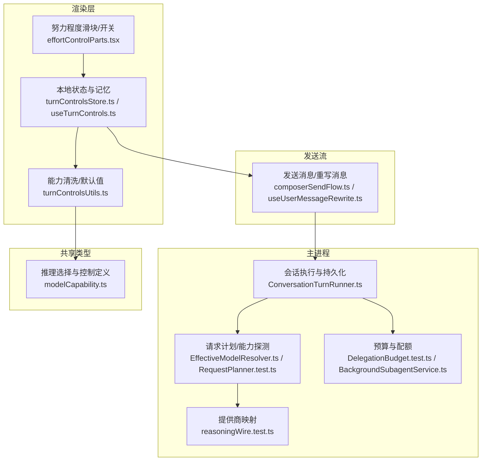
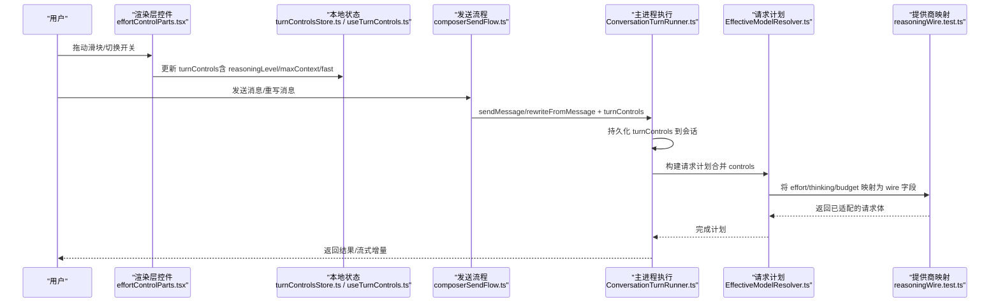
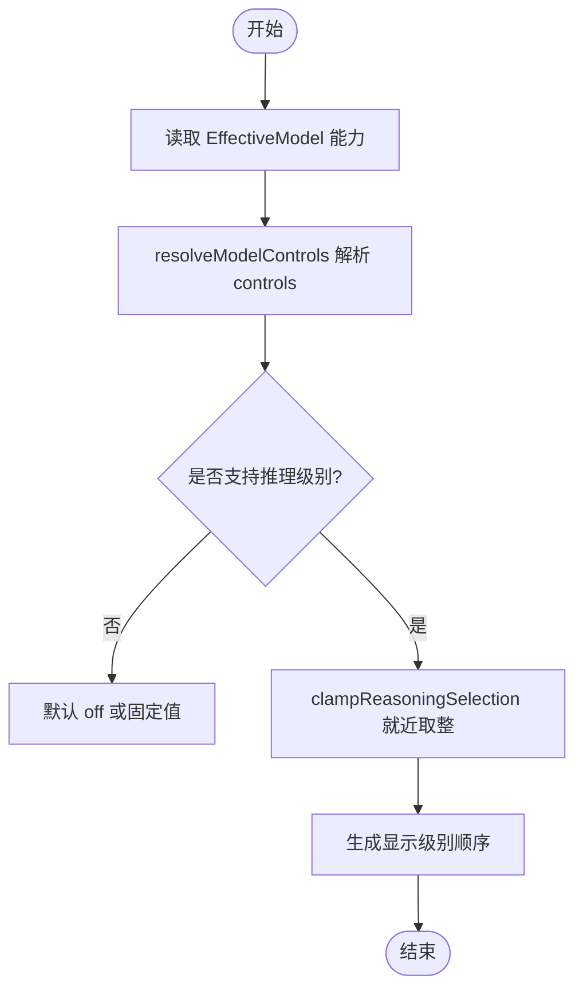
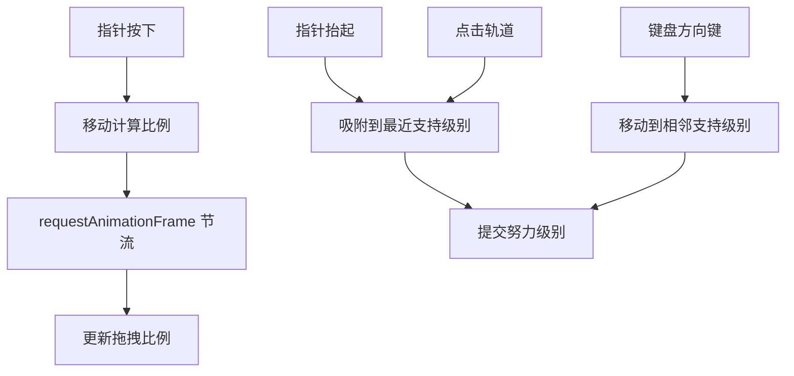
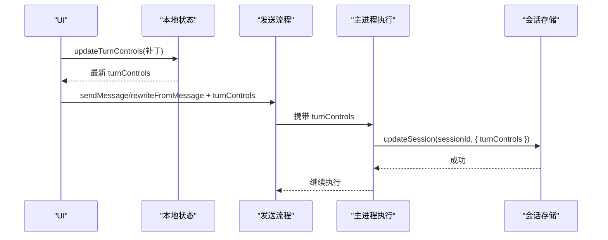
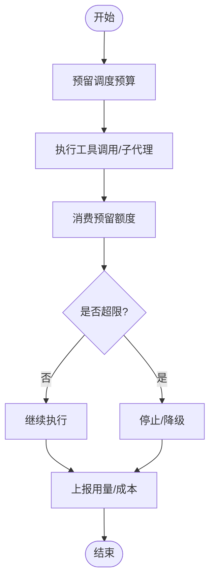
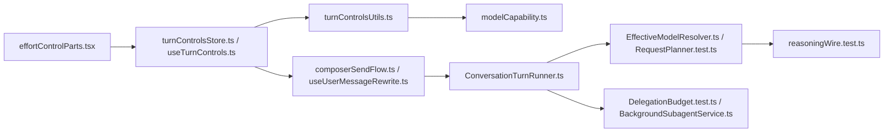

# 努力程度控制

<cite>
**本文引用的文件**
- [effortControlParts.tsx](file://src/renderer/features/composer/effortControlParts.tsx)
- [effortSliderHandlers.ts](file://src/renderer/features/composer/effortSliderHandlers.ts)
- [turnControlsUtils.ts](file://src/renderer/lib/turnControlsUtils.ts)
- [turnControlsStore.ts](file://src/renderer/stores/turnControlsStore.ts)
- [useTurnControls.ts](file://src/renderer/features/composer/useTurnControls.ts)
- [composerSendFlow.ts](file://src/renderer/features/composer/composerSendFlow.ts)
- [useUserMessageRewrite.ts](file://src/renderer/features/transcript/useUserMessageRewrite.ts)
- [ConversationTurnRunner.ts](file://src/main/conversation/ConversationTurnRunner.ts)
- [DebuggerLlmService.ts](file://src/main/settings/DebuggerLlmService.ts)
- [modelCapability.ts](file://src/shared/types/modelCapability.ts)
- [reasoningWire.test.ts](file://src/main/agent-runtime/providers/reasoningWire.test.ts)
- [RequestPlanner.test.ts](file://src/main/settings/RequestPlanner.test.ts)
- [EffectiveModelResolver.ts](file://src/main/settings/EffectiveModelResolver.ts)
- [ContextBreakdownPopover.tsx](file://src/renderer/patterns/ContextBreakdownPopover.tsx)
- [DelegationBudget.test.ts](file://src/main/workflow/debugger/DelegationBudget.test.ts)
- [BackgroundSubagentService.ts](file://src/main/workflow/debugger/BackgroundSubagentService.ts)
- [composer-effort.css](file://src/renderer/features/composer/composer-effort.css)
- [composer-effort-1.css](file://src/renderer/features/composer/composer-effort-1.css)
- [composer-effort-2.css](file://src/renderer/features/composer/composer-effort-2.css)
- [composer-effort-3.css](file://src/renderer/features/composer/composer-effort-3.css)
- [composer-effort-4.css](file://src/renderer/features/composer/composer-effort-4.css)
- [composer-effort-5.css](file://src/renderer/features/composer/composer-effort-5.css)
</cite>

## 目录
1. [简介](#简介)
2. [项目结构](#项目结构)
3. [核心组件](#核心组件)
4. [架构总览](#架构总览)
5. [详细组件分析](#详细组件分析)
6. [依赖关系分析](#依赖关系分析)
7. [性能与资源影响](#性能与资源影响)
8. [故障排查指南](#故障排查指南)
9. [结论](#结论)
10. [附录：使用场景与优化建议](#附录：使用场景与优化建议)

## 简介
本文件面向“对话编辑器”的努力程度控制能力，系统性说明用户如何调节推理努力级别、系统如何进行资源分配与成本估算、不同努力级别的特性与适用场景，以及界面交互、状态同步与配置持久化的完整流程。同时提供自定义努力级别、阈值设置与监控指标的实现要点，并给出实际使用场景的代码路径参考与优化建议。

## 项目结构
努力程度控制横跨渲染层（UI）、会话发送流、主进程运行器与模型能力解析/编配等模块：
- 渲染层：滑块与开关控件、能力状态展示、本地状态存储与记忆
- 发送流：将当前轮次的控制参数（含努力级别）随消息一起提交到主进程
- 主进程：会话执行时持久化控制参数，并在请求计划阶段映射为各提供商的 wire 格式
- 共享类型：统一的推理选择集合、控制元数据与映射规则
- 监控与成本：上下文用量与成本卡片在 UI 中呈现

**图表来源**
- [effortControlParts.tsx:1-269](file://src/renderer/features/composer/effortControlParts.tsx#L1-L269)
- [turnControlsStore.ts:1-34](file://src/renderer/stores/turnControlsStore.ts#L1-L34)
- [useTurnControls.ts:116-142](file://src/renderer/features/composer/useTurnControls.ts#L116-L142)
- [turnControlsUtils.ts:1-87](file://src/renderer/lib/turnControlsUtils.ts#L1-L87)
- [composerSendFlow.ts:30-125](file://src/renderer/features/composer/composerSendFlow.ts#L30-L125)
- [useUserMessageRewrite.ts:48-105](file://src/renderer/features/transcript/useUserMessageRewrite.ts#L48-L105)
- [ConversationTurnRunner.ts:124-144](file://src/main/conversation/ConversationTurnRunner.ts#L124-L144)
- [EffectiveModelResolver.ts:623-659](file://src/main/settings/EffectiveModelResolver.ts#L623-L659)
- [reasoningWire.test.ts:1-138](file://src/main/agent-runtime/providers/reasoningWire.test.ts#L1-L138)
- [modelCapability.ts:1-294](file://src/shared/types/modelCapability.ts#L1-L294)

**章节来源**
- [effortControlParts.tsx:1-269](file://src/renderer/features/composer/effortControlParts.tsx#L1-L269)
- [turnControlsStore.ts:1-34](file://src/renderer/stores/turnControlsStore.ts#L1-L34)
- [useTurnControls.ts:116-142](file://src/renderer/features/composer/useTurnControls.ts#L116-L142)
- [turnControlsUtils.ts:1-87](file://src/renderer/lib/turnControlsUtils.ts#L1-L87)
- [composerSendFlow.ts:30-125](file://src/renderer/features/composer/composerSendFlow.ts#L30-L125)
- [useUserMessageRewrite.ts:48-105](file://src/renderer/features/transcript/useUserMessageRewrite.ts#L48-L105)
- [ConversationTurnRunner.ts:124-144](file://src/main/conversation/ConversationTurnRunner.ts#L124-L144)
- [EffectiveModelResolver.ts:623-659](file://src/main/settings/EffectiveModelResolver.ts#L623-L659)
- [reasoningWire.test.ts:1-138](file://src/main/agent-runtime/providers/reasoningWire.test.ts#L1-L138)
- [modelCapability.ts:1-294](file://src/shared/types/modelCapability.ts#L1-L294)

## 核心组件
- 努力级别与模式
  - 推理努力级别：off/on/minimal/low/medium/high/xhigh/max，由共享类型统一约束，支持按能力裁剪与就近取整
  - 最大上下文模式：根据能力决定固定/可选/不支持，并可显示令牌窗口大小
  - 快速模式：用于更快响应但可能降低质量或深度
- 界面与交互
  - 滑块：支持拖拽、吸附到可用级别、键盘方向键微调
  - 开关：最大上下文与快速模式的切换行，带状态标签（固定/未验证/拒绝/加载中）
  - 图标与徽章：不同努力级别对应不同密度图标；最大上下文与快速模式以徽章提示
- 状态与持久化
  - 本地记忆：按能力键记住最近一次的控制组合
  - 会话持久化：会话执行时将 turnControls 写回会话记录
  - 发送携带：每次发送或重写消息都会附带当前 turnControls
- 能力解析与映射
  - 能力解析：根据 EffectiveModel 计算可选项、默认值、是否禁用
  - 提供商映射：将统一努力级别映射为各提供商 wire 字段（如 thinking/effort/budget）
- 预算与成本
  - 预算：子任务/代理的调用次数、深度、时间等限制，父子预算共享记账
  - 成本：上下文用量与成本在 UI 中以卡片形式展示（本轮/本运行/输入输出/缓存读写）

**章节来源**
- [modelCapability.ts:1-294](file://src/shared/types/modelCapability.ts#L1-L294)
- [effortControlParts.tsx:1-269](file://src/renderer/features/composer/effortControlParts.tsx#L1-L269)
- [effortSliderHandlers.ts:1-99](file://src/renderer/features/composer/effortSliderHandlers.ts#L1-L99)
- [turnControlsUtils.ts:1-87](file://src/renderer/lib/turnControlsUtils.ts#L1-L87)
- [turnControlsStore.ts:1-34](file://src/renderer/stores/turnControlsStore.ts#L1-L34)
- [useTurnControls.ts:116-142](file://src/renderer/features/composer/useTurnControls.ts#L116-L142)
- [composerSendFlow.ts:160-186](file://src/renderer/features/composer/composerSendFlow.ts#L160-L186)
- [useUserMessageRewrite.ts:75-105](file://src/renderer/features/transcript/useUserMessageRewrite.ts#L75-L105)
- [ConversationTurnRunner.ts:124-144](file://src/main/conversation/ConversationTurnRunner.ts#L124-L144)
- [reasoningWire.test.ts:118-138](file://src/main/agent-runtime/providers/reasoningWire.test.ts#L118-L138)
- [DelegationBudget.test.ts:1-23](file://src/main/workflow/debugger/DelegationBudget.test.ts#L1-L23)
- [BackgroundSubagentService.ts:82-94](file://src/main/workflow/debugger/BackgroundSubagentService.ts#L82-L94)
- [ContextBreakdownPopover.tsx:241-263](file://src/renderer/patterns/ContextBreakdownPopover.tsx#L241-L263)

## 架构总览
下图展示了从用户在对话框调整努力级别，到消息发送到主进程执行，再到请求计划与提供商映射的完整链路。

**图表来源**
- [effortControlParts.tsx:1-269](file://src/renderer/features/composer/effortControlParts.tsx#L1-L269)
- [turnControlsStore.ts:1-34](file://src/renderer/stores/turnControlsStore.ts#L1-L34)
- [useTurnControls.ts:116-142](file://src/renderer/features/composer/useTurnControls.ts#L116-L142)
- [composerSendFlow.ts:160-186](file://src/renderer/features/composer/composerSendFlow.ts#L160-L186)
- [ConversationTurnRunner.ts:124-144](file://src/main/conversation/ConversationTurnRunner.ts#L124-L144)
- [EffectiveModelResolver.ts:623-659](file://src/main/settings/EffectiveModelResolver.ts#L623-L659)
- [reasoningWire.test.ts:118-138](file://src/main/agent-runtime/providers/reasoningWire.test.ts#L118-L138)

## 详细组件分析

### 努力级别与能力解析
- 统一选择空间：off/on/minimal/low/medium/high/xhigh/max，通过共享类型集中管理
- 能力驱动：根据 EffectiveModel 的 controls.reasoning 决定支持的级别、默认选择、是否允许 off
- 就近取整与校验：当用户选择不在支持列表时，自动就近匹配到最接近的支持级别
- 最大上下文与快速模式：根据能力状态（fixed/selectable/unsupported）与授权（granted/denied/unknown）决定可用性

**图表来源**
- [modelCapability.ts:146-174](file://src/shared/types/modelCapability.ts#L146-L174)
- [modelCapability.ts:249-293](file://src/shared/types/modelCapability.ts#L249-L293)
- [turnControlsUtils.ts:21-27](file://src/renderer/lib/turnControlsUtils.ts#L21-L27)

**章节来源**
- [modelCapability.ts:1-294](file://src/shared/types/modelCapability.ts#L1-L294)
- [turnControlsUtils.ts:1-87](file://src/renderer/lib/turnControlsUtils.ts#L1-L87)

### 滑块与开关交互
- 滑块
  - 拖拽：计算相对位置比例，按帧节流更新，释放时吸附到最近支持级别
  - 点击：直接定位到最近支持级别
  - 键盘：左右/上下键移动到相邻支持级别
  - 视觉：不同级别对应不同密度的图标，便于识别
- 开关
  - 最大上下文：根据能力决定是否可选、是否固定、是否未验证或被拒绝
  - 快速模式：同上，独立于推理级别
- 样式：多档 CSS 文件用于不同努力级别的视觉反馈

**图表来源**
- [effortSliderHandlers.ts:1-99](file://src/renderer/features/composer/effortSliderHandlers.ts#L1-L99)
- [effortControlParts.tsx:235-269](file://src/renderer/features/composer/effortControlParts.tsx#L235-L269)
- [composer-effort.css](file://src/renderer/features/composer/composer-effort.css)
- [composer-effort-1.css](file://src/renderer/features/composer/composer-effort-1.css)
- [composer-effort-2.css](file://src/renderer/features/composer/composer-effort-2.css)
- [composer-effort-3.css](file://src/renderer/features/composer/composer-effort-3.css)
- [composer-effort-4.css](file://src/renderer/features/composer/composer-effort-4.css)
- [composer-effort-5.css](file://src/renderer/features/composer/composer-effort-5.css)

**章节来源**
- [effortSliderHandlers.ts:1-99](file://src/renderer/features/composer/effortSliderHandlers.ts#L1-L99)
- [effortControlParts.tsx:1-269](file://src/renderer/features/composer/effortControlParts.tsx#L1-L269)
- [composer-effort.css](file://src/renderer/features/composer/composer-effort.css)
- [composer-effort-1.css](file://src/renderer/features/composer/composer-effort-1.css)
- [composer-effort-2.css](file://src/renderer/features/composer/composer-effort-2.css)
- [composer-effort-3.css](file://src/renderer/features/composer/composer-effort-3.css)
- [composer-effort-4.css](file://src/renderer/features/composer/composer-effort-4.css)
- [composer-effort-5.css](file://src/renderer/features/composer/composer-effort-5.css)

### 状态同步与配置持久化
- 本地记忆：按能力键记住最近一次的控制组合，避免重复初始化
- 会话持久化：会话执行开始时将 turnControls 写入会话记录，保证后续恢复一致
- 发送携带：发送消息或重写消息时，将当前 turnControls 一并提交给主进程
- 能力就绪：能力解析完成后，对现有 controls 进行清洗，确保始终合法

**图表来源**
- [useTurnControls.ts:116-142](file://src/renderer/features/composer/useTurnControls.ts#L116-L142)
- [composerSendFlow.ts:160-186](file://src/renderer/features/composer/composerSendFlow.ts#L160-L186)
- [useUserMessageRewrite.ts:75-105](file://src/renderer/features/transcript/useUserMessageRewrite.ts#L75-L105)
- [ConversationTurnRunner.ts:124-144](file://src/main/conversation/ConversationTurnRunner.ts#L124-L144)

**章节来源**
- [useTurnControls.ts:116-142](file://src/renderer/features/composer/useTurnControls.ts#L116-L142)
- [composerSendFlow.ts:160-186](file://src/renderer/features/composer/composerSendFlow.ts#L160-L186)
- [useUserMessageRewrite.ts:75-105](file://src/renderer/features/transcript/useUserMessageRewrite.ts#L75-L105)
- [ConversationTurnRunner.ts:124-144](file://src/main/conversation/ConversationTurnRunner.ts#L124-L144)

### 请求计划与提供商映射
- 请求计划：将 turnControls 与模型能力结合，生成最终请求计划，包含上下文模式、温度、压缩阈值等
- 提供商映射：将统一努力级别映射为各提供商 wire 字段，例如：
  - OpenAI Responses：thinking 与 output_config.effort
  - OpenAI Compatible：enable_thinking 与 reasoning_effort
  - Anthropic：thinking enabled/disabled 与 onBudgetTokens
  - Gemini：thinking level 或 budget
- 测试覆盖：多种 wire profile 的行为在测试中验证

```mermaid
classDiagram
class ConversationTurnControls {
+reasoningLevel
+maxContextMode
+fastModel
}
class ReasoningControl {
+kind
+supportsOff
+levels
+defaultSelection
+wireProfile
}
class ProviderWire {
<<interface>>
}
class OpenAiResponsesWire {
+thinking
+output_config.effort
}
class OpenAiCompatibleWire {
+enable_thinking
+reasoning_effort
}
class AnthropicWire {
+thinking.enabled
+onBudgetTokens
}
class GeminiWire {
+thinking.level
+thinking.budget
}
ConversationTurnControls --> ReasoningControl : "依据能力解析"
ReasoningControl --> ProviderWire : "映射为具体 wire"
ProviderWire <|-- OpenAiResponsesWire
ProviderWire <|-- OpenAiCompatibleWire
ProviderWire <|-- AnthropicWire
ProviderWire <|-- GeminiWire
```

**图表来源**
- [modelCapability.ts:24-76](file://src/shared/types/modelCapability.ts#L24-L76)
- [reasoningWire.test.ts:118-138](file://src/main/agent-runtime/providers/reasoningWire.test.ts#L118-L138)
- [RequestPlanner.test.ts:1-17](file://src/main/settings/RequestPlanner.test.ts#L1-L17)

**章节来源**
- [modelCapability.ts:24-76](file://src/shared/types/modelCapability.ts#L24-L76)
- [reasoningWire.test.ts:118-138](file://src/main/agent-runtime/providers/reasoningWire.test.ts#L118-L138)
- [RequestPlanner.test.ts:1-17](file://src/main/settings/RequestPlanner.test.ts#L1-L17)
- [EffectiveModelResolver.ts:623-659](file://src/main/settings/EffectiveModelResolver.ts#L623-L659)

### 预算、配额与成本估算
- 预算：子任务/代理的 toolCalls、subagents、childDepth、wallTime 等限制，父子预算共享记账，防止过度消耗
- 成本：上下文用量与成本在 UI 中展示，包括本轮成本、本运行累计、输入/输出/缓存读写成本
- 调试服务：运行时汇总上下文用量并广播，供 UI 消费

**图表来源**
- [DelegationBudget.test.ts:1-23](file://src/main/workflow/debugger/DelegationBudget.test.ts#L1-L23)
- [BackgroundSubagentService.ts:82-94](file://src/main/workflow/debugger/BackgroundSubagentService.ts#L82-L94)
- [DebuggerLlmService.ts:316-345](file://src/main/settings/DebuggerLlmService.ts#L316-L345)
- [ContextBreakdownPopover.tsx:241-263](file://src/renderer/patterns/ContextBreakdownPopover.tsx#L241-L263)

**章节来源**
- [DelegationBudget.test.ts:1-23](file://src/main/workflow/debugger/DelegationBudget.test.ts#L1-L23)
- [BackgroundSubagentService.ts:82-94](file://src/main/workflow/debugger/BackgroundSubagentService.ts#L82-L94)
- [DebuggerLlmService.ts:316-345](file://src/main/settings/DebuggerLlmService.ts#L316-L345)
- [ContextBreakdownPopover.tsx:241-263](file://src/renderer/patterns/ContextBreakdownPopover.tsx#L241-L263)

## 依赖关系分析
- 渲染层依赖
  - 能力解析与默认值：turnControlsUtils.ts 依赖共享能力类型与上下文层级工具
  - 交互逻辑：effortSliderHandlers.ts 依赖 effortControlParts.tsx 中的级别计算与吸附逻辑
  - 状态管理：turnControlsStore.ts 与 useTurnControls.ts 负责本地记忆与能力就绪后的清洗
- 发送流依赖
  - composerSendFlow.ts 与 useUserMessageRewrite.ts 将 turnControls 作为请求的一部分发送给主进程
- 主进程依赖
  - ConversationTurnRunner.ts 在会话执行时持久化 turnControls
  - EffectiveModelResolver.ts 与 RequestPlanner.test.ts 负责请求计划
  - reasoningWire.test.ts 负责将努力级别映射为各提供商 wire 字段
  - DelegationBudget.test.ts 与 BackgroundSubagentService.ts 负责预算与配额
- 共享类型
  - modelCapability.ts 定义了推理选择、控制元数据与映射规则，贯穿全链路

**图表来源**
- [effortControlParts.tsx:1-269](file://src/renderer/features/composer/effortControlParts.tsx#L1-L269)
- [turnControlsStore.ts:1-34](file://src/renderer/stores/turnControlsStore.ts#L1-L34)
- [useTurnControls.ts:116-142](file://src/renderer/features/composer/useTurnControls.ts#L116-L142)
- [turnControlsUtils.ts:1-87](file://src/renderer/lib/turnControlsUtils.ts#L1-L87)
- [modelCapability.ts:1-294](file://src/shared/types/modelCapability.ts#L1-L294)
- [composerSendFlow.ts:160-186](file://src/renderer/features/composer/composerSendFlow.ts#L160-L186)
- [useUserMessageRewrite.ts:75-105](file://src/renderer/features/transcript/useUserMessageRewrite.ts#L75-L105)
- [ConversationTurnRunner.ts:124-144](file://src/main/conversation/ConversationTurnRunner.ts#L124-L144)
- [EffectiveModelResolver.ts:623-659](file://src/main/settings/EffectiveModelResolver.ts#L623-L659)
- [reasoningWire.test.ts:118-138](file://src/main/agent-runtime/providers/reasoningWire.test.ts#L118-L138)
- [DelegationBudget.test.ts:1-23](file://src/main/workflow/debugger/DelegationBudget.test.ts#L1-L23)
- [BackgroundSubagentService.ts:82-94](file://src/main/workflow/debugger/BackgroundSubagentService.ts#L82-L94)

**章节来源**
- [effortControlParts.tsx:1-269](file://src/renderer/features/composer/effortControlParts.tsx#L1-L269)
- [turnControlsStore.ts:1-34](file://src/renderer/stores/turnControlsStore.ts#L1-L34)
- [useTurnControls.ts:116-142](file://src/renderer/features/composer/useTurnControls.ts#L116-L142)
- [turnControlsUtils.ts:1-87](file://src/renderer/lib/turnControlsUtils.ts#L1-L87)
- [modelCapability.ts:1-294](file://src/shared/types/modelCapability.ts#L1-L294)
- [composerSendFlow.ts:160-186](file://src/renderer/features/composer/composerSendFlow.ts#L160-L186)
- [useUserMessageRewrite.ts:75-105](file://src/renderer/features/transcript/useUserMessageRewrite.ts#L75-L105)
- [ConversationTurnRunner.ts:124-144](file://src/main/conversation/ConversationTurnRunner.ts#L124-L144)
- [EffectiveModelResolver.ts:623-659](file://src/main/settings/EffectiveModelResolver.ts#L623-L659)
- [reasoningWire.test.ts:118-138](file://src/main/agent-runtime/providers/reasoningWire.test.ts#L118-L138)
- [DelegationBudget.test.ts:1-23](file://src/main/workflow/debugger/DelegationBudget.test.ts#L1-L23)
- [BackgroundSubagentService.ts:82-94](file://src/main/workflow/debugger/BackgroundSubagentService.ts#L82-L94)

## 性能与资源影响
- 努力级别越高，推理深度与思考步骤通常越多，导致：
  - 更高的 token 消耗与更长的延迟
  - 更大的上下文窗口占用（尤其开启最大上下文模式时）
  - 更多的工具调用与子代理任务（受预算限制）
- 快速模式可降低延迟与成本，但可能减少推理深度
- 预算机制防止无限增长：
  - 子任务继承父预算并进一步收紧上限
  - 原子预留与消费，避免重复计费
- 成本可视化：
  - 本轮成本、本运行累计、输入/输出/缓存读写成本在 UI 中呈现，便于用户权衡

[本节为通用指导，不直接分析具体文件]

## 故障排查指南
- 能力未就绪或加载失败
  - 现象：开关行显示“加载中”，无法调整
  - 处理：等待能力解析完成，必要时重试能力探测
- 能力被拒绝或未验证
  - 现象：最大上下文或快速模式显示“拒绝”或“未验证”
  - 处理：检查权限与账户授权，必要时联系管理员
- 努力级别不可用
  - 现象：滑块无法吸附到期望级别
  - 处理：查看能力定义的 supported levels，系统将就近取整
- 预算耗尽
  - 现象：子任务提前终止或降级
  - 处理：调低努力级别或放宽预算限制（若策略允许）
- 成本异常高
  - 现象：成本卡片显示高额累计
  - 处理：关闭最大上下文或降低努力级别，启用快速模式

**章节来源**
- [effortControlStatusLabels.test.ts:1-42](file://src/renderer/features/composer/effortControlStatusLabels.test.ts#L1-L42)
- [DelegationBudget.test.ts:1-23](file://src/main/workflow/debugger/DelegationBudget.test.ts#L1-L23)
- [ContextBreakdownPopover.tsx:241-263](file://src/renderer/patterns/ContextBreakdownPopover.tsx#L241-L263)

## 结论
努力程度控制通过统一的能力解析、直观的交互与严格的预算机制，实现了在不同提供商之间的一致体验与可控的成本/性能平衡。用户可在渲染层灵活调节推理努力级别与上下文模式，系统在发送与执行阶段确保配置正确传递与持久化，并通过成本可视化帮助用户做出明智选择。

[本节为总结性内容，不直接分析具体文件]

## 附录：使用场景与优化建议
- 日常问答与轻量任务
  - 推荐：off/low，快速模式开启
  - 目标：低延迟、低成本
  - 参考路径：[effortControlParts.tsx:28-37](file://src/renderer/features/composer/effortControlParts.tsx#L28-L37)
- 中等复杂度推理
  - 推荐：medium/high，按需开启最大上下文
  - 目标：平衡质量与成本
  - 参考路径：[reasoningWire.test.ts:118-138](file://src/main/agent-runtime/providers/reasoningWire.test.ts#L118-L138)
- 复杂分析与深度推理
  - 推荐：xhigh/max，谨慎开启最大上下文
  - 目标：高质量输出，接受更高成本
  - 参考路径：[modelCapability.ts:1-294](file://src/shared/types/modelCapability.ts#L1-L294)
- 预算敏感场景
  - 推荐：lower effort + fast mode，严格预算
  - 目标：控制工具调用与子代理数量
  - 参考路径：[DelegationBudget.test.ts:1-23](file://src/main/workflow/debugger/DelegationBudget.test.ts#L1-L23)
- 成本监控与优化
  - 关注成本卡片：本轮/本运行/输入输出/缓存读写
  - 调整上下文模式与努力级别以降低成本
  - 参考路径：[ContextBreakdownPopover.tsx:241-263](file://src/renderer/patterns/ContextBreakdownPopover.tsx#L241-L263)

**章节来源**
- [effortControlParts.tsx:28-37](file://src/renderer/features/composer/effortControlParts.tsx#L28-L37)
- [reasoningWire.test.ts:118-138](file://src/main/agent-runtime/providers/reasoningWire.test.ts#L118-L138)
- [modelCapability.ts:1-294](file://src/shared/types/modelCapability.ts#L1-L294)
- [DelegationBudget.test.ts:1-23](file://src/main/workflow/debugger/DelegationBudget.test.ts#L1-L23)
- [ContextBreakdownPopover.tsx:241-263](file://src/renderer/patterns/ContextBreakdownPopover.tsx#L241-L263)