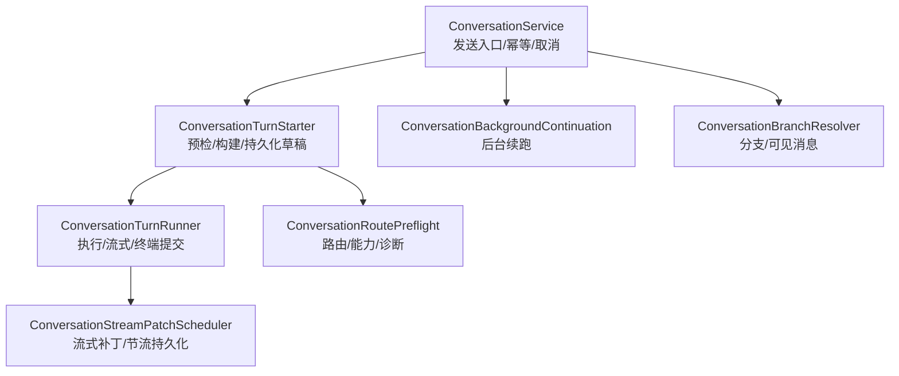
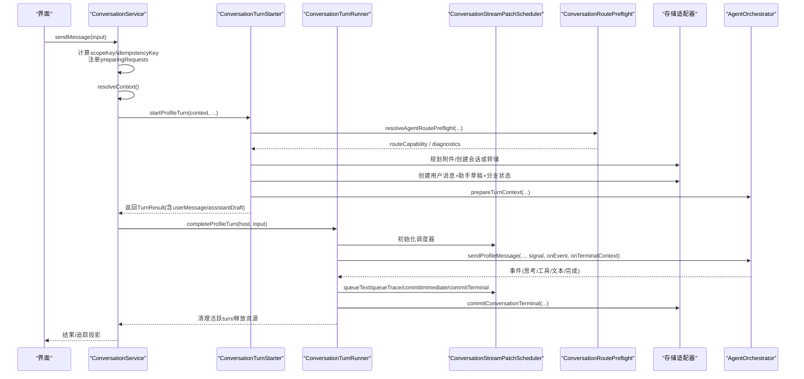
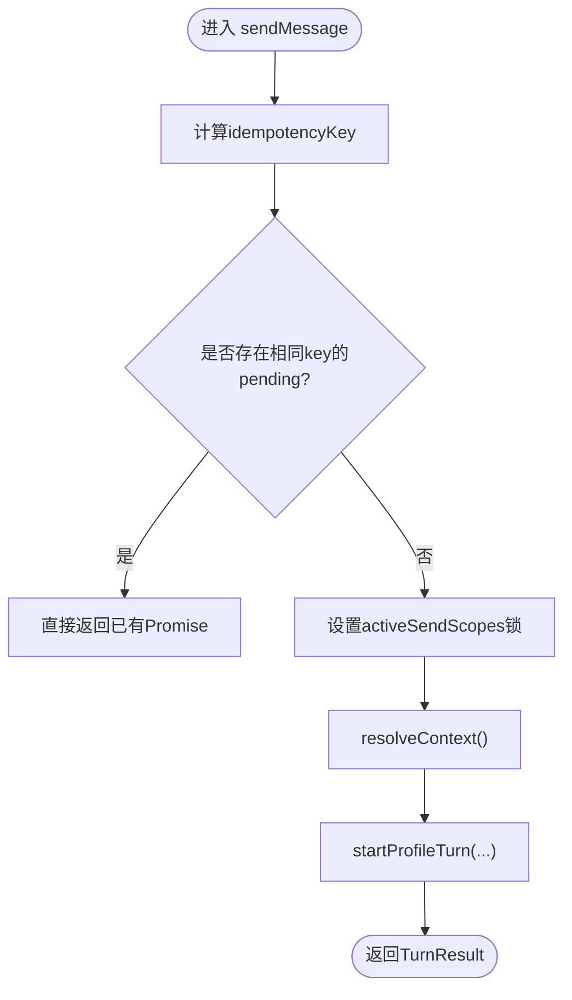
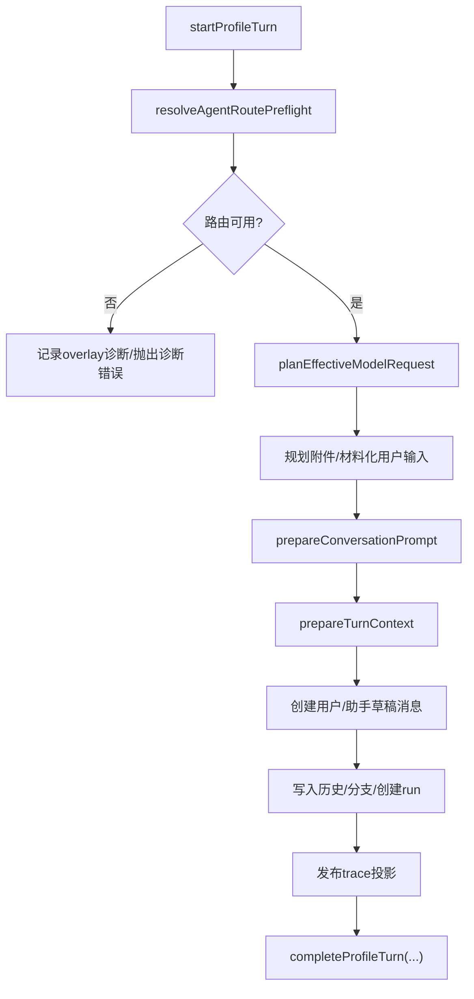
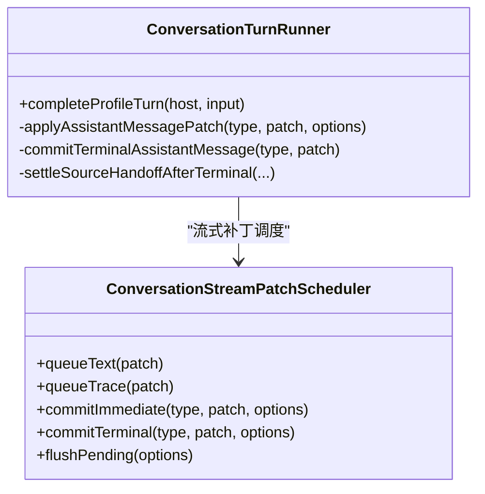
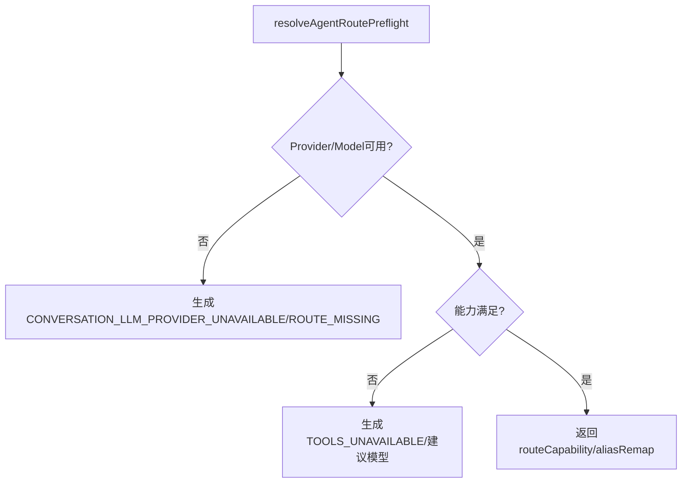
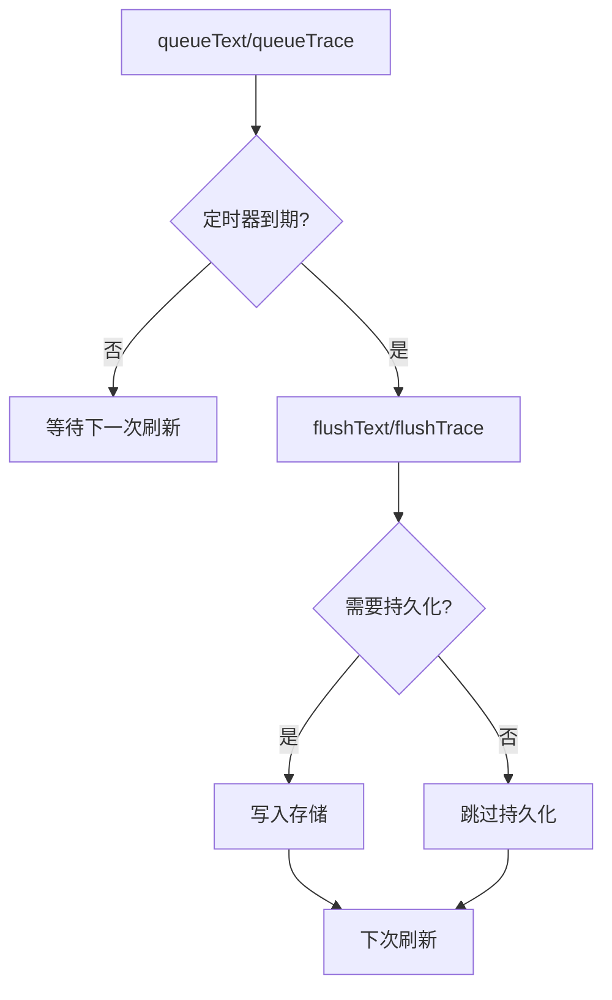
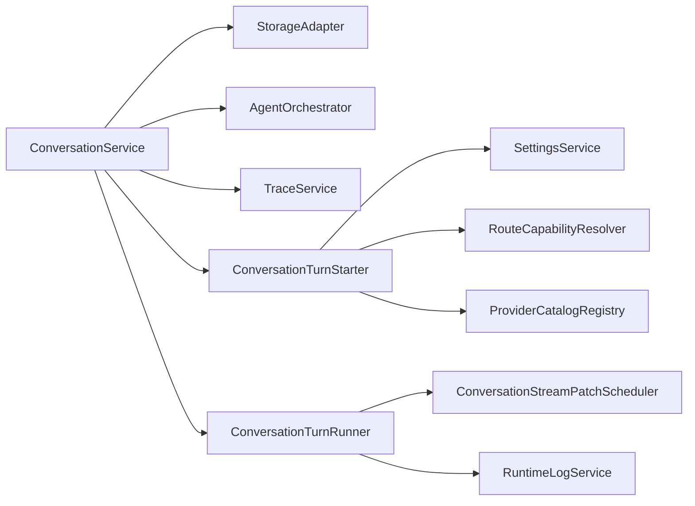

# 发送流程控制

<cite>
**本文引用的文件**
- [ConversationService.ts](file://src/main/conversation/ConversationService.ts)
- [ConversationTurnStarter.ts](file://src/main/conversation/ConversationTurnStarter.ts)
- [ConversationTurnRunner.ts](file://src/main/conversation/ConversationTurnRunner.ts)
- [ConversationRoutePreflight.ts](file://src/main/conversation/ConversationRoutePreflight.ts)
- [ConversationStreamPatchScheduler.ts](file://src/main/conversation/ConversationStreamPatchScheduler.ts)
- [ConversationBackgroundContinuation.ts](file://src/main/conversation/ConversationBackgroundContinuation.ts)
- [ConversationBranchResolver.ts](file://src/main/conversation/ConversationBranchResolver.ts)
</cite>

## 目录
1. [简介](#简介)
2. [项目结构](#项目结构)
3. [核心组件](#核心组件)
4. [架构总览](#架构总览)
5. [详细组件分析](#详细组件分析)
6. [依赖关系分析](#依赖关系分析)
7. [性能与并发](#性能与并发)
8. [故障排除指南](#故障排除指南)
9. [结论](#结论)
10. [附录：使用示例与最佳实践](#附录：使用示例与最佳实践)

## 简介
本文件系统化说明对话编辑器的“发送流程控制”，覆盖消息构建、上下文准备、会话状态管理、发送队列机制、发送前验证、错误重试、取消处理、进度跟踪、并发控制、超时处理、网络异常恢复，以及发送钩子、拦截器与监控指标。目标是帮助开发者理解从用户点击“发送”到助手回复落盘的完整链路，并能在复杂场景下定位问题与优化性能。

## 项目结构
围绕“发送”的关键模块集中在 main/conversation 目录：
- ConversationService：入口服务，负责幂等请求、去重、范围锁定、取消、分支切换、后台续跑等。
- ConversationTurnStarter：将输入转换为可执行的 Turn，完成路由预检、模型选择、附件规划、提示词构建、持久化草稿、创建运行记录等。
- ConversationTurnRunner：执行 Turn，驱动流式输出、工作追踪、终端提交、手递手（handoff）结算、最终状态落盘。
- ConversationRoutePreflight：路由与能力预检、诊断生成、失败分类与用户提示文案。
- ConversationStreamPatchScheduler：流式补丁调度器，合并文本/追踪更新，节流持久化与追踪发布。
- ConversationBackgroundContinuation：后台续跑队列，空闲时自动继续未完成的任务。
- ConversationBranchResolver：分支与可见消息解析（由共享库提供）。

图表来源
- [ConversationService.ts:78-109](file://src/main/conversation/ConversationService.ts#L78-L109)
- [ConversationTurnStarter.ts:68-105](file://src/main/conversation/ConversationTurnStarter.ts#L68-L105)
- [ConversationTurnRunner.ts:124-173](file://src/main/conversation/ConversationTurnRunner.ts#L124-L173)
- [ConversationStreamPatchScheduler.ts:42-66](file://src/main/conversation/ConversationStreamPatchScheduler.ts#L42-L66)
- [ConversationBackgroundContinuation.ts:6-35](file://src/main/conversation/ConversationBackgroundContinuation.ts#L6-L35)
- [ConversationBranchResolver.ts:1-16](file://src/main/conversation/ConversationBranchResolver.ts#L1-L16)
- [ConversationRoutePreflight.ts:350-477](file://src/main/conversation/ConversationRoutePreflight.ts#L350-L477)

章节来源
- [ConversationService.ts:78-109](file://src/main/conversation/ConversationService.ts#L78-L109)
- [ConversationTurnStarter.ts:68-105](file://src/main/conversation/ConversationTurnStarter.ts#L68-L105)
- [ConversationTurnRunner.ts:124-173](file://src/main/conversation/ConversationTurnRunner.ts#L124-L173)
- [ConversationStreamPatchScheduler.ts:42-66](file://src/main/conversation/ConversationStreamPatchScheduler.ts#L42-L66)
- [ConversationBackgroundContinuation.ts:6-35](file://src/main/conversation/ConversationBackgroundContinuation.ts#L6-L35)
- [ConversationBranchResolver.ts:1-16](file://src/main/conversation/ConversationBranchResolver.ts#L1-L16)
- [ConversationRoutePreflight.ts:350-477](file://src/main/conversation/ConversationRoutePreflight.ts#L350-L477)

## 核心组件
- 发送入口与幂等控制：通过 requestId + scopeKey 计算 idempotencyKey，缓存待完成 Promise，避免重复发送；同时维护 preparingRequests 与 activeSendScopes 实现同会话/项目的串行准备与互斥。
- 上下文准备：读取项目、会话、当前 Run、打开的捕获、回放设备、附件等，组装 ResolvedConversationContext。
- 路由与能力预检：校验 Agent/Provider/Model 可用性、配置一致性、能力是否满足工具/视觉输入等，生成诊断信息。
- 消息构建与持久化：创建用户消息与助手草稿，写入会话历史与分支状态，创建 run 记录，发布初始 trace。
- 执行与流式输出：调用编排器发送消息，监听事件，聚合思考过程、工具调用、最终答案，按策略节流持久化与追踪发布。
- 终端提交与收尾：提交最终上下文、更新会话上下文日志、结束 run、释放资源、结算 handoff。
- 后台续跑：当会话空闲且存在未完成的后台任务时，自动继续执行。

章节来源
- [ConversationService.ts:279-543](file://src/main/conversation/ConversationService.ts#L279-L543)
- [ConversationService.ts:545-568](file://src/main/conversation/ConversationService.ts#L545-L568)
- [ConversationTurnStarter.ts:68-105](file://src/main/conversation/ConversationTurnStarter.ts#L68-L105)
- [ConversationTurnStarter.ts:151-230](file://src/main/conversation/ConversationTurnStarter.ts#L151-L230)
- [ConversationTurnStarter.ts:356-503](file://src/main/conversation/ConversationTurnStarter.ts#L356-L503)
- [ConversationTurnRunner.ts:124-173](file://src/main/conversation/ConversationTurnRunner.ts#L124-L173)
- [ConversationTurnRunner.ts:464-518](file://src/main/conversation/ConversationTurnRunner.ts#L464-L518)
- [ConversationTurnRunner.ts:615-743](file://src/main/conversation/ConversationTurnRunner.ts#L615-L743)
- [ConversationBackgroundContinuation.ts:6-35](file://src/main/conversation/ConversationBackgroundContinuation.ts#L6-L35)

## 架构总览
下图展示一次“发送”的端到端时序，包括幂等检查、上下文准备、路由预检、消息构建、执行、流式更新、终端提交与收尾。

图表来源
- [ConversationService.ts:545-568](file://src/main/conversation/ConversationService.ts#L545-L568)
- [ConversationTurnStarter.ts:356-503](file://src/main/conversation/ConversationTurnStarter.ts#L356-L503)
- [ConversationTurnStarter.ts:504-616](file://src/main/conversation/ConversationTurnStarter.ts#L504-L616)
- [ConversationTurnRunner.ts:124-173](file://src/main/conversation/ConversationTurnRunner.ts#L124-L173)
- [ConversationTurnRunner.ts:464-518](file://src/main/conversation/ConversationTurnRunner.ts#L464-L518)
- [ConversationTurnRunner.ts:615-743](file://src/main/conversation/ConversationTurnRunner.ts#L615-L743)
- [ConversationStreamPatchScheduler.ts:42-66](file://src/main/conversation/ConversationStreamPatchScheduler.ts#L42-L66)
- [ConversationRoutePreflight.ts:350-477](file://src/main/conversation/ConversationRoutePreflight.ts#L350-L477)

## 详细组件分析

### ConversationService：发送入口、幂等与并发控制
- 幂等与去重：基于 requestId + scopeKey 计算 idempotencyKey，缓存 pending Promise；若相同 key 已存在则直接返回。
- 范围互斥：activeSendScopes 保证同一 session/project 在 preparing 阶段串行，防止并发准备导致冲突。
- 取消与中止：abortAllTurns 会中止所有 preparing 与 active turns，并清理后台子代理。
- 后台续跑：backgroundContinuations 在会话空闲时自动继续未完成任务。
- 分支切换：switchConversationBranch 会停止活跃 turn、同步 slot、重新计算可见消息并发布投影。

图表来源
- [ConversationService.ts:279-543](file://src/main/conversation/ConversationService.ts#L279-L543)
- [ConversationService.ts:545-568](file://src/main/conversation/ConversationService.ts#L545-L568)

章节来源
- [ConversationService.ts:78-109](file://src/main/conversation/ConversationService.ts#L78-L109)
- [ConversationService.ts:115-126](file://src/main/conversation/ConversationService.ts#L115-L126)
- [ConversationService.ts:176-231](file://src/main/conversation/ConversationService.ts#L176-L231)
- [ConversationService.ts:279-543](file://src/main/conversation/ConversationService.ts#L279-L543)
- [ConversationService.ts:545-568](file://src/main/conversation/ConversationService.ts#L545-L568)
- [ConversationService.ts:704-741](file://src/main/conversation/ConversationService.ts#L704-L741)

### ConversationTurnStarter：上下文准备、路由预检与消息构建
- 路由与能力预检：resolveAgentRoutePreflight 校验 Agent/Provider/Model 可用性与能力，必要时记录 overlay 诊断。
- 模型选择与计划：planEffectiveModelRequest 生成 RequestPlan，考虑压缩阈值与 controls。
- 附件规划：为当前 turn 规划附件路径与元数据，必要时分配临时会话。
- 提示词构建：prepareConversationPrompt 产出 promptPlan、visibleTurnIds、allowedToolNames 等。
- 持久化草稿：创建 user 与 assistant 草稿消息，写入会话历史与分支状态，创建 run 记录并发布初始 trace。
- 安全与一致性：configurationCommit 校验确保所选 Agent/Provider/Model 与冻结快照一致。

图表来源
- [ConversationTurnStarter.ts:68-105](file://src/main/conversation/ConversationTurnStarter.ts#L68-L105)
- [ConversationTurnStarter.ts:151-230](file://src/main/conversation/ConversationTurnStarter.ts#L151-L230)
- [ConversationTurnStarter.ts:231-336](file://src/main/conversation/ConversationTurnStarter.ts#L231-L336)
- [ConversationTurnStarter.ts:356-503](file://src/main/conversation/ConversationTurnStarter.ts#L356-L503)
- [ConversationTurnStarter.ts:504-616](file://src/main/conversation/ConversationTurnStarter.ts#L504-L616)

章节来源
- [ConversationTurnStarter.ts:68-105](file://src/main/conversation/ConversationTurnStarter.ts#L68-L105)
- [ConversationTurnStarter.ts:151-230](file://src/main/conversation/ConversationTurnStarter.ts#L151-L230)
- [ConversationTurnStarter.ts:231-336](file://src/main/conversation/ConversationTurnStarter.ts#L231-L336)
- [ConversationTurnStarter.ts:356-503](file://src/main/conversation/ConversationTurnStarter.ts#L356-L503)
- [ConversationTurnStarter.ts:504-616](file://src/main/conversation/ConversationTurnStarter.ts#L504-L616)

### ConversationTurnRunner：执行、流式输出与终端提交
- 流式调度：ConversationStreamPatchScheduler 合并文本与追踪更新，按时间窗口节流持久化与追踪发布，避免频繁 IO。
- 事件处理：createAgentEventHandler 接收思考、工具、文本、完成等事件，聚合 visibleResponse 与 canonicalOutput。
- 错误处理：捕获 provider/stream/协议违规等错误，生成诊断并写入 workTrace，终止流并标记状态。
- 终端提交：commitConversationTerminal 原子提交最终上下文、会话上下文日志，更新 run 状态，释放 MCP 租约与凭据。
- Handoff 结算：根据 terminalHandoff 决定是否提交并触发自动发送后续 profile turn。

图表来源
- [ConversationTurnRunner.ts:124-173](file://src/main/conversation/ConversationTurnRunner.ts#L124-L173)
- [ConversationTurnRunner.ts:234-258](file://src/main/conversation/ConversationTurnRunner.ts#L234-L258)
- [ConversationTurnRunner.ts:464-518](file://src/main/conversation/ConversationTurnRunner.ts#L464-L518)
- [ConversationTurnRunner.ts:615-743](file://src/main/conversation/ConversationTurnRunner.ts#L615-L743)
- [ConversationStreamPatchScheduler.ts:42-66](file://src/main/conversation/ConversationStreamPatchScheduler.ts#L42-L66)

章节来源
- [ConversationTurnRunner.ts:124-173](file://src/main/conversation/ConversationTurnRunner.ts#L124-L173)
- [ConversationTurnRunner.ts:234-258](file://src/main/conversation/ConversationTurnRunner.ts#L234-L258)
- [ConversationTurnRunner.ts:464-518](file://src/main/conversation/ConversationTurnRunner.ts#L464-L518)
- [ConversationTurnRunner.ts:615-743](file://src/main/conversation/ConversationTurnRunner.ts#L615-L743)

### ConversationRoutePreflight：路由预检与诊断
- 路由解析：根据 agentId/modelOverride 解析 provider 与 model，校验启用状态与配置一致性。
- 能力判定：判断模型是否支持工具/视觉输入，给出推荐模型。
- 诊断生成：对缺失路由、不可用 Provider、额度/限流、过载、网络错误等进行分类，生成用户友好提示与技术细节。
- 失败分类：结合 HTTP 状态码、错误类别与消息片段，推断失败类型并格式化技术消息。

图表来源
- [ConversationRoutePreflight.ts:350-477](file://src/main/conversation/ConversationRoutePreflight.ts#L350-L477)
- [ConversationRoutePreflight.ts:523-604](file://src/main/conversation/ConversationRoutePreflight.ts#L523-L604)
- [ConversationRoutePreflight.ts:623-773](file://src/main/conversation/ConversationRoutePreflight.ts#L623-L773)

章节来源
- [ConversationRoutePreflight.ts:350-477](file://src/main/conversation/ConversationRoutePreflight.ts#L350-L477)
- [ConversationRoutePreflight.ts:523-604](file://src/main/conversation/ConversationRoutePreflight.ts#L523-L604)
- [ConversationRoutePreflight.ts:623-773](file://src/main/conversation/ConversationRoutePreflight.ts#L623-L773)

### ConversationStreamPatchScheduler：流式补丁与节流
- 文本与追踪分离：分别维护 pendingTextPatch 与 pendingTracePatch，独立定时器刷新。
- 节流持久化：默认每 600ms 持久化一次，避免高频磁盘写入。
- 即时与终态提交：commitImmediate 立即提交（可选持久化），commitTerminal 强制刷新并关闭调度器。
- 可控开关：flushPending 支持强制持久化与选择性 emit/publishTrace。

图表来源
- [ConversationStreamPatchScheduler.ts:42-66](file://src/main/conversation/ConversationStreamPatchScheduler.ts#L42-L66)
- [ConversationStreamPatchScheduler.ts:68-130](file://src/main/conversation/ConversationStreamPatchScheduler.ts#L68-L130)
- [ConversationStreamPatchScheduler.ts:132-205](file://src/main/conversation/ConversationStreamPatchScheduler.ts#L132-L205)

章节来源
- [ConversationStreamPatchScheduler.ts:42-66](file://src/main/conversation/ConversationStreamPatchScheduler.ts#L42-L66)
- [ConversationStreamPatchScheduler.ts:68-130](file://src/main/conversation/ConversationStreamPatchScheduler.ts#L68-L130)
- [ConversationStreamPatchScheduler.ts:132-205](file://src/main/conversation/ConversationStreamPatchScheduler.ts#L132-L205)

### ConversationBackgroundContinuation：后台续跑
- 事件排队：onSettled 将事件加入 pending，按 sequence 排序。
- 空闲触发：notifyIdle 在会话空闲时尝试执行 pending event，失败不丢弃，等待下一次空闲边界重试。
- 抑制与恢复：suppress 暂停某会话的续跑，resume 恢复。

章节来源
- [ConversationBackgroundContinuation.ts:6-35](file://src/main/conversation/ConversationBackgroundContinuation.ts#L6-L35)

### ConversationBranchResolver：分支与可见消息
- 提供分支创建、查找、规范化、修复与可见消息解析能力，供主进程调用。

章节来源
- [ConversationBranchResolver.ts:1-16](file://src/main/conversation/ConversationBranchResolver.ts#L1-L16)

## 依赖关系分析
- ConversationService 依赖：
  - StorageAdapter：会话/历史/分支/Run 读写。
  - AgentOrchestrator：准备 Turn 上下文、发送消息、背景子代理管理。
  - TraceService：构建 conversation presentation。
  - 内部模块：AttachmentHashing、PromptPreparer、TurnStarter、TurnRunner、Terminal、BackgroundContinuation、HandoffOps。
- ConversationTurnStarter 依赖：
  - SettingsService、EffectiveModelResolver、ProviderCatalogRegistry、RouteCapabilityResolver、StorageAdapter、TraceService、AgentOrchestrator。
- ConversationTurnRunner 依赖：
  - AgentOrchestrator、AgentUserInputRequestService、AgentToolApprovalRequestService、StorageAdapter、RuntimeLogService、StreamPatchScheduler、WorkTrace、ToolEvidence、LoopRuntimeState、CanonicalAssistantOutput、AttachmentMaterializer、TurnAgentEventHandler。

图表来源
- [ConversationService.ts:78-109](file://src/main/conversation/ConversationService.ts#L78-L109)
- [ConversationTurnStarter.ts:14-44](file://src/main/conversation/ConversationTurnStarter.ts#L14-L44)
- [ConversationTurnRunner.ts:17-33](file://src/main/conversation/ConversationTurnRunner.ts#L17-L33)

章节来源
- [ConversationService.ts:78-109](file://src/main/conversation/ConversationService.ts#L78-L109)
- [ConversationTurnStarter.ts:14-44](file://src/main/conversation/ConversationTurnStarter.ts#L14-L44)
- [ConversationTurnRunner.ts:17-33](file://src/main/conversation/ConversationTurnRunner.ts#L17-L33)

## 性能与并发
- 流式节流：文本与追踪分别以 48ms/160ms 刷新，持久化每 600ms 批量提交，降低 IO 压力。
- 幂等与去重：相同 idempotencyKey 的请求直接复用 Promise，减少重复计算与网络开销。
- 并发控制：activeSendScopes 限制同一会话/项目在 preparing 阶段串行；activeTurns 跟踪运行中的 turn，避免重复启动。
- 取消与中止：AbortController 贯穿准备与执行阶段，支持用户主动停止与系统级中止。
- 后台续跑：空闲时自动继续未完成任务，提升吞吐与用户体验。
- 追踪发布节流：终端提交与追踪发布最小间隔 160ms，避免渲染层频繁重建。

[本节为通用性能指导，无需具体文件引用]

## 故障排除指南
- 路由不可用/模型不可用：
  - 现象：提示“当前 xxx 链路的 provider 不可用/模型不可用”。
  - 排查：检查 Settings 中 Provider 连接状态、账号密钥、模型目录；确认 effective catalog 包含目标模型。
  - 参考：[ConversationRoutePreflight.ts:350-477](file://src/main/conversation/ConversationRoutePreflight.ts#L350-L477)
- 认证/额度/限流/过载/网络错误：
  - 现象：用户提示“认证失败/额度不足/服务商过载/网络连接失败”。
  - 排查：查看技术消息中的 HTTP 状态码、attempts/maxAttempts、snippet；检查网络、代理、配额与账单。
  - 参考：[ConversationRoutePreflight.ts:623-773](file://src/main/conversation/ConversationRoutePreflight.ts#L623-L773)
- 流式协议完整性失败：
  - 现象：“本地流式协议完整性校验失败”。
  - 排查：通常为客户端对流式输出分段完整性故障，与服务端账号/额度无关；收集技术详情反馈开发者。
  - 参考：[ConversationRoutePreflight.ts:555-571](file://src/main/conversation/ConversationRoutePreflight.ts#L555-L571)
- 附件相关错误：
  - 现象：“附件未能用于本次请求/视觉输入不支持/附件不存在”。
  - 排查：移除无效附件或更换支持视觉输入的模型；确保会话已选择或创建。
  - 参考：[ConversationRoutePreflight.ts:574-593](file://src/main/conversation/ConversationRoutePreflight.ts#L574-L593)
- 保存失败/提交失败：
  - 现象：“对话状态无法保存/无法提交”。
  - 排查：检查磁盘权限与存储适配器；重试后仍失败需重启会话。
  - 参考：[ConversationTurnRunner.ts:187-210](file://src/main/conversation/ConversationTurnRunner.ts#L187-L210)
  - 参考：[ConversationTurnRunner.ts:688-709](file://src/main/conversation/ConversationTurnRunner.ts#L688-L709)
- 取消与停止：
  - 现象：用户停止后显示“当前请求已停止”。
  - 排查：确认 cancelActiveTurn 正确触发 abortController；检查 backgroundSubagents 是否被中止。
  - 参考：[ConversationService.ts:176-231](file://src/main/conversation/ConversationService.ts#L176-L231)
  - 参考：[ConversationTurnRunner.ts:260-277](file://src/main/conversation/ConversationTurnRunner.ts#L260-L277)

章节来源
- [ConversationRoutePreflight.ts:350-477](file://src/main/conversation/ConversationRoutePreflight.ts#L350-L477)
- [ConversationRoutePreflight.ts:523-604](file://src/main/conversation/ConversationRoutePreflight.ts#L523-L604)
- [ConversationRoutePreflight.ts:623-773](file://src/main/conversation/ConversationRoutePreflight.ts#L623-L773)
- [ConversationTurnRunner.ts:187-210](file://src/main/conversation/ConversationTurnRunner.ts#L187-L210)
- [ConversationTurnRunner.ts:260-277](file://src/main/conversation/ConversationTurnRunner.ts#L260-L277)
- [ConversationTurnRunner.ts:688-709](file://src/main/conversation/ConversationTurnRunner.ts#L688-L709)
- [ConversationService.ts:176-231](file://src/main/conversation/ConversationService.ts#L176-L231)

## 结论
该发送流程通过严格的幂等控制、范围互斥、路由预检、流式节流与终端原子提交，实现了高可靠、高性能、可观测的对话发送体验。配合后台续跑与完善的错误分类与用户提示，能够在复杂网络与配置环境下保持稳定与易用性。

[本节为总结，无需具体文件引用]

## 附录：使用示例与最佳实践
- 基本发送
  - 调用入口：sendMessage(input)，确保提供唯一 requestId、sessionId/projectId、message 与必要的 turnControls。
  - 参考路径：[ConversationService.ts:545-568](file://src/main/conversation/ConversationService.ts#L545-L568)
- 编辑并重发
  - 调用 rewriteFromMessage(input)，支持对历史用户消息进行编辑并重发，自动停止下游活跃 turn 并创建新分支。
  - 参考路径：[ConversationService.ts:571-702](file://src/main/conversation/ConversationService.ts#L571-L702)
- 切换分支
  - 调用 switchConversationBranch(input)，停止活跃 turn、同步 slot、更新分支状态并重新计算可见消息。
  - 参考路径：[ConversationService.ts:704-741](file://src/main/conversation/ConversationService.ts#L704-L741)
- 取消进行中请求
  - 调用 cancelActiveTurn(request)，支持按 requestId/turnId/sessionId 精确取消；同时中止后台子代理。
  - 参考路径：[ConversationService.ts:176-231](file://src/main/conversation/ConversationService.ts#L176-L231)
- 监控与指标
  - 运行时日志：runtimeLogService.log 记录模型别名映射、诊断信息等。
  - 追踪投影：publishConversationTrace 发布 conversation presentation，供右侧面板与工作区展示。
  - 参考路径：[ConversationTurnStarter.ts:450-462](file://src/main/conversation/ConversationTurnStarter.ts#L450-L462)
  - 参考路径：[ConversationTurnRunner.ts:680-687](file://src/main/conversation/ConversationTurnRunner.ts#L680-L687)
- 最佳实践
  - 始终传递唯一 requestId，便于幂等与取消。
  - 合理设置 turnControls（如 reasoningLevel、fastModel）以平衡质量与速度。
  - 大附件场景优先选择有会话的项目，避免无会话附件失败。
  - 关注流式节流参数，必要时调整 textFlushMs/traceFlushMs/persistFlushMs。
  - 遇到网络/额度/过载错误时，引导用户稍后重试或更换模型。

[本节为使用指导，无需具体文件引用]