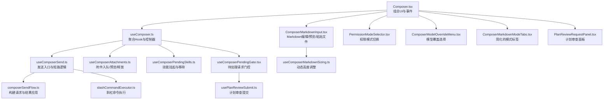
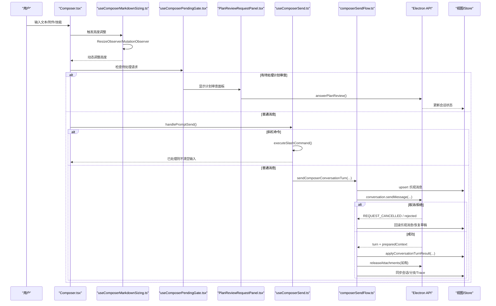
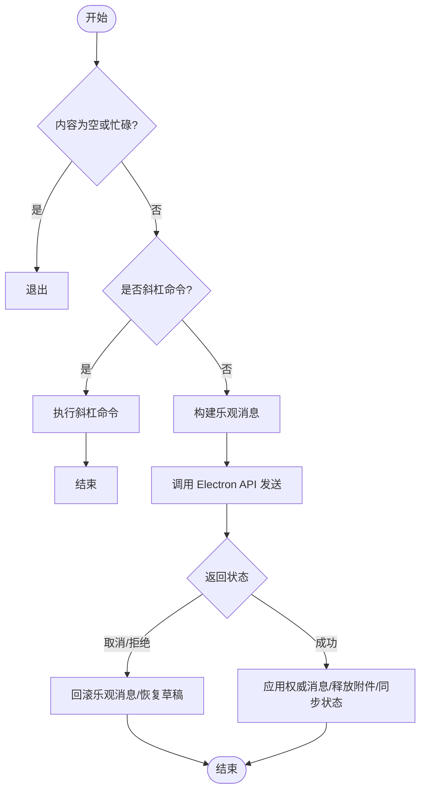
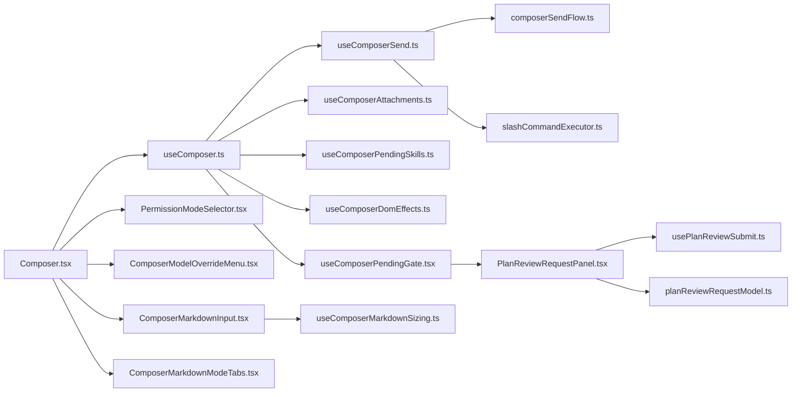

# 对话编辑器

<cite>
**本文引用的文件**
- [Composer.tsx](file://src/renderer/features/composer/Composer.tsx)
- [ComposerMarkdownInput.tsx](file://src/renderer/features/composer/ComposerMarkdownInput.tsx)
- [useComposerMarkdownSizing.ts](file://src/renderer/features/composer/useComposerMarkdownSizing.ts)
- [useComposer.ts](file://src/renderer/features/composer/useComposer.ts)
- [useComposerSend.ts](file://src/renderer/features/composer/useComposerSend.ts)
- [composerSendFlow.ts](file://src/renderer/features/composer/composerSendFlow.ts)
- [PermissionModeSelector.tsx](file://src/renderer/features/composer/PermissionModeSelector.tsx)
- [ComposerModelOverrideMenu.tsx](file://src/renderer/features/composer/ComposerModelOverrideMenu.tsx)
- [slashCommandExecutor.ts](file://src/renderer/features/composer/slashCommandExecutor.ts)
- [useComposerAttachments.ts](file://src/renderer/features/composer/useComposerAttachments.ts)
- [useComposerPendingSkills.ts](file://src/renderer/features/composer/useComposerPendingSkills.ts)
- [EffortControlParts.tsx](file://src/renderer/features/composer/effortControlParts.tsx)
- [useComposerDomEffects.ts](file://src/renderer/features/composer/useComposerDomEffects.ts)
- [ComposerMarkdownModeTabs.tsx](file://src/renderer/features/composer/ComposerMarkdownModeTabs.tsx)
- [PlanReviewRequestPanel.tsx](file://src/renderer/features/composer/PlanReviewRequestPanel.tsx)
- [planReviewRequestModel.ts](file://src/renderer/features/composer/planReviewRequestModel.ts)
- [usePlanReviewSubmit.ts](file://src/renderer/features/composer/usePlanReviewSubmit.ts)
- [useComposerPendingGate.tsx](file://src/renderer/features/composer/useComposerPendingGate.tsx)
- [composer-plan-review.css](file://src/renderer/features/composer/composer-plan-review.css)
- [composer-chrome-1.css](file://src/renderer/features/composer/composer-chrome-1.css)
- [composer-chrome-2.css](file://src/renderer/features/composer/composer-chrome-2.css)
- [composer-chrome-3.css](file://src/renderer/features/composer/composer-chrome-3.css)
- [composer-chrome-4.css](file://src/renderer/features/composer/composer-chrome-4.css)
- [composerPromptGeometry.ts](file://src/renderer/features/composer/composerPromptGeometry.ts)
- [ComposerMarkdownInput.css](file://src/renderer/features/composer/ComposerMarkdownInput.css)
</cite>

## 更新摘要
**变更内容**
- 新增了 useComposerMarkdownSizing Hook，提供动态高度调整功能，支持 ResizeObserver 和 MutationObserver
- 增强了 Markdown 输入处理，实现编辑和预览模式下的自动高度同步
- 改进了焦点处理机制，移除了不必要的焦点边框，通过 CSS 选择器精确控制焦点指示器作用域
- 优化了编辑器性能，使用 requestAnimationFrame 进行高效的高度测量
- 增强了样式一致性，确保编辑和预览模式在字体、行高、颜色等视觉元素上保持一致

## 目录
1. [简介](#简介)
2. [项目结构](#项目结构)
3. [核心组件](#核心组件)
4. [架构总览](#架构总览)
5. [详细组件分析](#详细组件分析)
6. [依赖关系分析](#依赖关系分析)
7. [性能考量](#性能考量)
8. [故障排查指南](#故障排查指南)
9. [结论](#结论)
10. [附录：集成与扩展指南](#附录：集成与扩展指南)

## 简介
本文件面向 RDC-Agent 的"对话编辑器"（Composer），系统性说明其功能特性、状态管理、消息构建机制以及高级能力（技能选择、模型配置、权限模式）。文档同时提供自定义扩展建议、快捷键配置与用户体验优化实践，并给出实际使用场景的集成要点。

**最新更新**：Composer组件已进行重大改进，包括新增的动态高度调整Hook、增强的Markdown输入处理、改进的焦点处理机制、编辑和预览模式的一致样式，以及优化的性能表现。

## 项目结构
对话编辑器位于渲染进程的前端特性模块中，采用 React + Hooks 的组合式架构：
- 顶层容器负责组装 UI 与交互入口（输入区、附件托盘、工具栏、菜单等）
- 多个 Hook 分别承担状态与业务逻辑（发送流程、附件处理、技能挂起、上下文与展示）
- 通过 Electron API 与主进程通信，完成会话、配置、命令执行与消息流转
- **新增**：useComposerMarkdownSizing Hook 提供智能的高度调整和布局管理

**图示来源**
- [Composer.tsx:53-299](file://src/renderer/features/composer/Composer.tsx#L53-L299)
- [useComposer.ts:23-193](file://src/renderer/features/composer/useComposer.ts#L23-L193)
- [useComposerSend.ts:20-200](file://src/renderer/features/composer/useComposerSend.ts#L20-L200)
- [composerSendFlow.ts:30-277](file://src/renderer/features/composer/composerSendFlow.ts#L30-L277)
- [useComposerAttachments.ts:20-189](file://src/renderer/features/composer/useComposerAttachments.ts#L20-L189)
- [useComposerPendingSkills.ts:5-48](file://src/renderer/features/composer/useComposerPendingSkills.ts#L5-L48)
- [ComposerMarkdownInput.tsx:95-230](file://src/renderer/features/composer/ComposerMarkdownInput.tsx#L95-L230)
- [useComposerMarkdownSizing.ts:6-56](file://src/renderer/features/composer/useComposerMarkdownSizing.ts#L6-L56)
- [PermissionModeSelector.tsx:15-76](file://src/renderer/features/composer/PermissionModeSelector.tsx#L15-L76)
- [ComposerModelOverrideMenu.tsx:33-256](file://src/renderer/features/composer/ComposerModelOverrideMenu.tsx#L33-L256)
- [slashCommandExecutor.ts:233-284](file://src/renderer/features/composer/slashCommandExecutor.ts#L233-L284)
- [ComposerMarkdownModeTabs.tsx:13-37](file://src/renderer/features/composer/ComposerMarkdownModeTabs.tsx#L13-L37)
- [PlanReviewRequestPanel.tsx:15-77](file://src/renderer/features/composer/PlanReviewRequestPanel.tsx#L15-L77)
- [useComposerPendingGate.tsx:6-39](file://src/renderer/features/composer/useComposerPendingGate.tsx#L6-L39)
- [usePlanReviewSubmit.ts:5-23](file://src/renderer/features/composer/usePlanReviewSubmit.ts#L5-L23)

**章节来源**
- [Composer.tsx:53-299](file://src/renderer/features/composer/Composer.tsx#L53-L299)
- [useComposer.ts:23-193](file://src/renderer/features/composer/useComposer.ts#L23-L193)

## 核心组件
- Composer 容器：编排 Markdown 输入、附件托盘、技能芯片、权限模式、模型覆盖、努力度控制、发送按钮等；处理拖拽/粘贴附件、忙态切换、面板优先级（工具审批/计划审查/用户输入优先）。
- Markdown 输入：基于 CodeMirror 的 Markdown 编辑器，支持写/预览双模式、自动高度、Enter 发送、粘贴文件、禁用态。**已增强**：现在通过 useComposerMarkdownSizing Hook 提供智能的高度调整和布局管理。
- 动态高度调整：useComposerMarkdownSizing Hook 使用 ResizeObserver 和 MutationObserver 监听内容变化，自动调整编辑器高度。
- 发送 Hook：统一入口，处理空内容/忙碌拦截、斜杠命令分流、乐观消息、错误恢复、调用后端发送流程。
- 发送流程：构建配置、生成请求ID、插入乐观消息、调用 Electron API 发送、回滚/提交、清理资源、同步会话与分支状态。
- 附件处理：按会话作用域维护待发送附件草稿，支持选择/拖拽/粘贴、批量入队、超限/拒绝提示、释放临时资源。
- 技能挂起：按会话作用域维护待激活技能列表，支持追加/移除，随发送一并提交。
- 权限模式：以 Pill 形式展示当前权限模式，下拉切换 default/auto-review/full-access/custom。
- 模型覆盖：搜索分组显示可用模型，支持"代理默认"和具体模型覆盖，持久化到会话/项目范围。
- 努力度控制：可视化推理强度与快捷模式（最大上下文/快速模型），图标与标签随级别变化。
- **新增**：计划审查面板：支持用户交互式的计划审批和拒绝操作，包含手递选项选择和反馈输入。
- **新增**：简化的模式标签组件，提供更直观的模式切换体验。

**章节来源**
- [Composer.tsx:53-299](file://src/renderer/features/composer/Composer.tsx#L53-L299)
- [ComposerMarkdownInput.tsx:95-230](file://src/renderer/features/composer/ComposerMarkdownInput.tsx#L95-L230)
- [useComposerMarkdownSizing.ts:6-56](file://src/renderer/features/composer/useComposerMarkdownSizing.ts#L6-L56)
- [useComposerSend.ts:20-200](file://src/renderer/features/composer/useComposerSend.ts#L20-L200)
- [composerSendFlow.ts:30-277](file://src/renderer/features/composer/composerSendFlow.ts#L30-L277)
- [useComposerAttachments.ts:20-189](file://src/renderer/features/composer/useComposerAttachments.ts#L20-L189)
- [useComposerPendingSkills.ts:5-48](file://src/renderer/features/composer/useComposerPendingSkills.ts#L5-L48)
- [PermissionModeSelector.tsx:15-76](file://src/renderer/features/composer/PermissionModeSelector.tsx#L15-L76)
- [ComposerModelOverrideMenu.tsx:33-256](file://src/renderer/features/composer/ComposerModelOverrideMenu.tsx#L33-L256)
- [effortControlParts.tsx:12-269](file://src/renderer/features/composer/effortControlParts.tsx#L12-L269)
- [PlanReviewRequestPanel.tsx:15-77](file://src/renderer/features/composer/PlanReviewRequestPanel.tsx#L15-L77)
- [ComposerMarkdownModeTabs.tsx:13-37](file://src/renderer/features/composer/ComposerMarkdownModeTabs.tsx#L13-L37)

## 架构总览
下图展示了从用户输入到消息落库的关键路径，包括斜杠命令分流、乐观更新、错误恢复与资源释放，以及新增的动态高度调整机制。

**图示来源**
- [useComposerMarkdownSizing.ts:28-42](file://src/renderer/features/composer/useComposerMarkdownSizing.ts#L28-L42)
- [useComposerPendingGate.tsx:6-39](file://src/renderer/features/composer/useComposerPendingGate.tsx#L6-L39)
- [PlanReviewRequestPanel.tsx:25-35](file://src/renderer/features/composer/PlanReviewRequestPanel.tsx#L25-L35)
- [useComposerSend.ts:83-183](file://src/renderer/features/composer/useComposerSend.ts#L83-L183)
- [composerSendFlow.ts:96-261](file://src/renderer/features/composer/composerSendFlow.ts#L96-L261)
- [slashCommandExecutor.ts:233-284](file://src/renderer/features/composer/slashCommandExecutor.ts#L233-L284)

## 详细组件分析

### Composer 容器与交互编排
- 职责：组合输入区、附件托盘、技能芯片、权限模式、模型覆盖、努力度、发送按钮；处理拖拽/粘贴附件、忙态切换、面板优先级（工具审批/计划审查/用户输入优先）。
- 关键行为：
  - 当存在待审批工具或用户输入或计划审查时，优先渲染对应面板，隐藏常规输入。
  - 根据是否启用 Markdown 模式切换输入组件与占位符。
  - 将选中的 Agent、模式、设备、会话等信息透传给发送流程。
  - 动态计算按钮禁用态与描述文案。
  - **新增**：集成了简化的模式标签组件，提供更好的用户体验。

**章节来源**
- [Composer.tsx:53-299](file://src/renderer/features/composer/Composer.tsx#L53-L299)

### 动态高度调整 Hook
- **新增功能**：useComposerMarkdownSizing Hook 提供智能的编辑器高度调整。
- 使用 ResizeObserver 监听宿主容器和内容区域的大小变化。
- 使用 MutationObserver 监听 DOM 结构和样式的变化。
- 通过 requestAnimationFrame 进行高效的批量高度测量。
- 支持编辑模式和预览模式的差异化高度计算。
- 自动处理最小高度（72px）和最大高度（180px）限制。
- 在组件卸载时正确清理事件监听器和动画帧。

**章节来源**
- [useComposerMarkdownSizing.ts:6-56](file://src/renderer/features/composer/useComposerMarkdownSizing.ts#L6-L56)
- [composerPromptGeometry.ts:1-4](file://src/renderer/features/composer/composerPromptGeometry.ts#L1-L4)

### 计划审查面板
- **新增功能**：PlanReviewRequestPanel 组件提供交互式计划审批界面。
- 显示计划标题、摘要和详细信息。
- 支持用户输入反馈意见，用于拒绝计划时提供原因。
- 提供批准和拒绝两个主要操作按钮。
- 集成 HandoffActionRow 组件，允许用户选择手递选项来批准计划。
- 通过 usePlanReviewSubmit Hook 与后端通信，提交用户的决策。

**章节来源**
- [PlanReviewRequestPanel.tsx:15-77](file://src/renderer/features/composer/PlanReviewRequestPanel.tsx#L15-L77)
- [usePlanReviewSubmit.ts:5-23](file://src/renderer/features/composer/usePlanReviewSubmit.ts#L5-L23)

### 待处理请求门控机制
- **新增功能**：useComposerPendingGate Hook 统一管理各种待处理请求的显示优先级。
- 优先级顺序：工具审批 > 计划审查 > 用户输入。
- 当存在任何待处理请求时，会阻止常规输入界面的显示。
- 为每种请求类型提供专门的样式容器和交互处理。

**章节来源**
- [useComposerPendingGate.tsx:6-39](file://src/renderer/features/composer/useComposerPendingGate.tsx#L6-L39)

### Markdown 输入与智能提示
- 基于 CodeMirror 的 Markdown 编辑器，支持写/预览双模式、自动高度（最小/最大）、Enter 发送、Tab 缩进、粘贴文件。
- 在预览模式下复用消息渲染组件，保证所见即所得。
- 通过 EditorView 扩展注册右键菜单与键盘事件，确保与宿主样式一致。
- **已增强**：现在通过 useComposerMarkdownSizing Hook 提供智能的高度调整，支持 ResizeObserver 和 MutationObserver。
- **已改进**：现在在编辑和预览模式间提供一致的样式，包括字体、行高、颜色等视觉元素。
- **已改进**：简化了焦点处理，移除了不必要的焦点边框，通过 CSS 选择器精确控制焦点指示器的作用域。

**章节来源**
- [ComposerMarkdownInput.tsx:95-230](file://src/renderer/features/composer/ComposerMarkdownInput.tsx#L95-L230)
- [useComposerMarkdownSizing.ts:6-56](file://src/renderer/features/composer/useComposerMarkdownSizing.ts#L6-L56)
- [ComposerMarkdownInput.css:78-81](file://src/renderer/features/composer/ComposerMarkdownInput.css#L78-L81)

### 简化的模式标签管理
- **新增功能**：使用专门的 `ComposerMarkdownModeTabs` 组件来管理编辑和预览模式的切换。
- 提供直观的标签界面，支持禁用状态下的交互控制。
- 通过 `Tabs` 组件实现模式切换，提供更好的可访问性和用户体验。
- 与整体设计系统保持一致的视觉风格。

**章节来源**
- [ComposerMarkdownModeTabs.tsx:13-37](file://src/renderer/features/composer/ComposerMarkdownModeTabs.tsx#L13-L37)

### 发送流程与消息构建
- 入口：handlePromptSend 校验空内容与忙碌态，区分斜杠命令与普通消息。
- 斜杠命令：executeSlashCommand 解析命令并执行 UI 动作（如切换主题/权限/模型、导出会话、撤销/清空历史等）。
- 普通消息：
  - 生成 requestId，构建乐观消息（用户消息+助手草稿），立即上屏。
  - 构建配置（含模型覆盖、Agent 路由、会话/项目信息），调用 Electron API 发送。
  - 处理取消/拒绝：回滚乐观消息、恢复草稿、清理活跃轮次。
  - 成功：应用权威消息、释放临时附件、同步会话/分支/Trace、清理活跃轮次。

**图示来源**
- [useComposerSend.ts:83-183](file://src/renderer/features/composer/useComposerSend.ts#L83-L183)
- [composerSendFlow.ts:96-261](file://src/renderer/features/composer/composerSendFlow.ts#L96-L261)

**章节来源**
- [useComposerSend.ts:20-200](file://src/renderer/features/composer/useComposerSend.ts#L20-L200)
- [composerSendFlow.ts:30-277](file://src/renderer/features/composer/composerSendFlow.ts#L30-L277)
- [slashCommandExecutor.ts:233-284](file://src/renderer/features/composer/slashCommandExecutor.ts#L233-L284)

### 附件处理与预览
- 作用域隔离：按"项目+会话"键值维护待发送附件，避免跨会话污染。
- 入队策略：选择/拖拽/粘贴均转为 StageItem 后批量入队，限制数量上限，失败时记录错误草稿并提示。
- 生命周期：发送成功后释放 stagingId；切换会话时释放上一作用域的附件；删除单个附件时释放对应资源。

**章节来源**
- [useComposerAttachments.ts:20-189](file://src/renderer/features/composer/useComposerAttachments.ts#L20-189)

### 技能选择与挂起
- 技能以"芯片"形式展示，支持追加/移除，随发送一并提交为 preloadSkillIds。
- 通过斜杠命令可"武装"技能，下次发送生效。

**章节来源**
- [useComposerPendingSkills.ts:5-48](file://src/renderer/features/composer/useComposerPendingSkills.ts#L5-L48)
- [slashCommandExecutor.ts:218-227](file://src/renderer/features/composer/slashCommandExecutor.ts#L218-L227)

### 权限模式
- 以 Pill 控件展示当前权限模式（default/auto-review/full-access/custom），点击弹出菜单切换。
- 切换写入全局设置，影响后续 Agent 运行时的权限策略。

**章节来源**
- [PermissionModeSelector.tsx:15-76](file://src/renderer/features/composer/PermissionModeSelector.tsx#L15-L76)

### 模型配置与覆盖
- 支持"代理默认"与具体模型覆盖，覆盖范围可为会话/项目。
- 提供搜索与分组展示，选中后持久化并刷新有效模型。
- 与斜杠命令联动，可通过命令切换模型或恢复代理默认。

**章节来源**
- [ComposerModelOverrideMenu.tsx:33-256](file://src/renderer/features/composer/ComposerModelOverrideMenu.tsx#L33-L256)
- [slashCommandExecutor.ts:86-118](file://src/renderer/features/composer/slashCommandExecutor.ts#L86-L118)

### 努力度控制（推理强度）
- 可视化推理级别与快捷模式（最大上下文/快速模型），图标密度随级别递增。
- 提供开关行与滑块映射，自动对齐到支持的离散级别。

**章节来源**
- [effortControlParts.tsx:12-269](file://src/renderer/features/composer/effortControlParts.tsx#L12-L269)

### DOM 效果与焦点管理
- **新增功能**：`useComposerDomEffects` Hook 统一管理 DOM 效果和焦点处理。
- 自动调整文本区域高度，保持与 Markdown 输入组件的一致性。
- 管理 Agent 选择和模式设置的默认值。
- 确保在不同模式下的高度计算准确无误。

**章节来源**
- [useComposerDomEffects.ts:25-42](file://src/renderer/features/composer/useComposerDomEffects.ts#L25-L42)

### 计划审查数据模型
- **新增功能**：planReviewRequestModel 定义了计划审查的数据结构和查找逻辑。
- PendingPlanReviewRequest 接口包含会话ID、轮次ID、工具调用ID和计划审查数据。
- findPendingPlanReview 函数从消息列表中查找等待处理的计划审查请求。
- 支持多种消息状态（draft、streaming）和工作跟踪块的处理。

**章节来源**
- [planReviewRequestModel.ts:3-39](file://src/renderer/features/composer/planReviewRequestModel.ts#L3-L39)

## 依赖关系分析
- Composer 容器依赖 useComposer 聚合的状态与回调，进而组合各子组件。
- useComposer 聚合：
  - 会话/项目/设备/布局/设置等全局 Store
  - 附件 Hook、技能 Hook、发送 Hook、上下文与展示 Hook
- 发送流程依赖 Electron API 进行会话、命令、消息与资源管理。
- 斜杠命令通过统一执行器分发到 UI 动作（切换主题/权限/模型、会话操作等）。
- **新增依赖**：模式标签组件依赖于统一的 Tabs 组件和国际化服务。
- **新增依赖**：计划审查面板依赖于计划审查数据模型和提交流程。
- **新增依赖**：Markdown 输入组件现在依赖 useComposerMarkdownSizing Hook 进行高度调整。

**图示来源**
- [Composer.tsx:53-299](file://src/renderer/features/composer/Composer.tsx#L53-L299)
- [useComposer.ts:23-193](file://src/renderer/features/composer/useComposer.ts#L23-L193)
- [useComposerSend.ts:20-200](file://src/renderer/features/composer/useComposerSend.ts#L20-L200)
- [composerSendFlow.ts:30-277](file://src/renderer/features/composer/composerSendFlow.ts#L30-L277)
- [slashCommandExecutor.ts:233-284](file://src/renderer/features/composer/slashCommandExecutor.ts#L233-L284)
- [useComposerAttachments.ts:20-189](file://src/renderer/features/composer/useComposerAttachments.ts#L20-L189)
- [useComposerPendingSkills.ts:5-48](file://src/renderer/features/composer/useComposerPendingSkills.ts#L5-L48)
- [PermissionModeSelector.tsx:15-76](file://src/renderer/features/composer/PermissionModeSelector.tsx#L15-L76)
- [ComposerModelOverrideMenu.tsx:33-256](file://src/renderer/features/composer/ComposerModelOverrideMenu.tsx#L33-L256)
- [ComposerMarkdownInput.tsx:95-230](file://src/renderer/features/composer/ComposerMarkdownInput.tsx#L95-L230)
- [useComposerMarkdownSizing.ts:6-56](file://src/renderer/features/composer/useComposerMarkdownSizing.ts#L6-L56)
- [ComposerMarkdownModeTabs.tsx:13-37](file://src/renderer/features/composer/ComposerMarkdownModeTabs.tsx#L13-L37)
- [useComposerDomEffects.ts:25-42](file://src/renderer/features/composer/useComposerDomEffects.ts#L25-L42)
- [useComposerPendingGate.tsx:6-39](file://src/renderer/features/composer/useComposerPendingGate.tsx#L6-L39)
- [PlanReviewRequestPanel.tsx:15-77](file://src/renderer/features/composer/PlanReviewRequestPanel.tsx#L15-L77)
- [usePlanReviewSubmit.ts:5-23](file://src/renderer/features/composer/usePlanReviewSubmit.ts#L5-L23)
- [planReviewRequestModel.ts:3-39](file://src/renderer/features/composer/planReviewRequestModel.ts#L3-L39)

**章节来源**
- [useComposer.ts:23-193](file://src/renderer/features/composer/useComposer.ts#L23-L193)

## 性能考量
- 乐观更新与回滚：先上屏再等待服务端确认，失败时快速回滚，提升响应性。
- 作用域隔离：附件与技能按"项目+会话"键值存储，避免不必要的全局状态膨胀。
- 资源释放：发送完成后及时释放临时附件，防止内存泄漏。
- 输入自适应：Markdown 输入高度随内容增长，限制最大高度，减少重排。
- 并发控制：忙碌态与调试运行/对话轮次联合判断，避免重复提交。
- **新增优化**：useComposerMarkdownSizing Hook 使用 requestAnimationFrame 进行高效的高度测量，避免频繁的 DOM 查询。
- **新增优化**：ResizeObserver 和 MutationObserver 的使用减少了不必要的事件监听和重新渲染。
- **新增优化**：简化的模式标签减少了不必要的状态更新和重新渲染。
- **新增优化**：改进的焦点处理减少了浏览器重绘和重排操作。
- **新增优化**：计划审查面板使用高效的查找算法，避免全量遍历消息列表。

## 故障排查指南
- 附件超限/拒绝：检查入队数量与类型，查看提示文案定位错误码（如 ATTACHMENT_LIMIT_EXCEEDED）。
- 发送被取消：若出现 REQUEST_CANCELLED，会回滚乐观消息并恢复草稿，检查停止逻辑是否正确触发。
- 模型覆盖保存失败：检查会话/项目范围是否可写，确认选项有效性。
- 斜杠命令无效：确认命令参数格式与上下文（会话/项目/工作区）是否完整。
- **新增**：计划审查面板不显示：检查是否存在等待处理的 plan_artifact 工具调用，确认消息状态正确。
- **新增**：计划审查提交失败：检查 Electron API 是否可用，确认会话ID、轮次ID和工具调用ID是否正确。
- **新增**：模式标签不工作：检查 `ComposerMarkdownModeTabs` 组件是否正确接收 `mode` 和 `onModeChange` 属性。
- **新增**：焦点样式异常：检查 CSS 选择器是否正确应用，特别是 `.cm-content:focus-visible` 规则。
- **新增**：高度调整异常：检查 useComposerMarkdownSizing Hook 是否正确初始化，确认 ResizeObserver 和 MutationObserver 是否正常运作。
- **新增**：编辑器高度不正确：检查 composerPromptGeometry.ts 中的最小和最大高度配置，确认 CSS 变量是否正确设置。

**章节来源**
- [useComposerAttachments.ts:90-147](file://src/renderer/features/composer/useComposerAttachments.ts#L90-L147)
- [composerSendFlow.ts:144-207](file://src/renderer/features/composer/composerSendFlow.ts#L144-L207)
- [ComposerModelOverrideMenu.tsx:93-116](file://src/renderer/features/composer/ComposerModelOverrideMenu.tsx#L93-L116)
- [slashCommandExecutor.ts:233-284](file://src/renderer/features/composer/slashCommandExecutor.ts#L233-L284)
- [planReviewRequestModel.ts:12-39](file://src/renderer/features/composer/planReviewRequestModel.ts#L12-L39)
- [usePlanReviewSubmit.ts:5-23](file://src/renderer/features/composer/usePlanReviewSubmit.ts#L5-L23)
- [ComposerMarkdownInput.css:78-81](file://src/renderer/features/composer/ComposerMarkdownInput.css#L78-L81)
- [useComposerMarkdownSizing.ts:28-42](file://src/renderer/features/composer/useComposerMarkdownSizing.ts#L28-L42)
- [composerPromptGeometry.ts:1-4](file://src/renderer/features/composer/composerPromptGeometry.ts#L1-L4)

## 结论
RDC-Agent 的对话编辑器以清晰的 Hook 分层与稳健的发送流程为核心，提供了 Markdown 输入、附件处理、技能挂起、权限模式、模型覆盖与努力度控制等完整能力。通过乐观更新、作用域隔离与资源释放，兼顾了交互体验与系统稳定性。结合斜杠命令与菜单体系，用户可在不离开编辑器的情况下完成常用操作。

**最新更新**：最近的改进包括新增的动态高度调整 Hook、增强的 Markdown 输入处理、改进的焦点处理机制、编辑和预览模式的一致样式，以及优化的性能表现。useComposerMarkdownSizing Hook 的引入显著提升了编辑器的响应性和用户体验，通过智能的高度调整和布局管理，确保了编辑器在各种内容长度下的最佳显示效果。计划审查面板为用户提供了交互式的工作流控制能力，增强了系统的灵活性和可控性。

## 附录：集成与扩展指南

### 自定义编辑器扩展
- 在 Markdown 输入中注入扩展：通过 CodeMirror 的 extensions 数组添加语法高亮、补全、快捷键等。
- 在 Composer 容器中注册新菜单项：利用菜单注册机制（如 usage/model/permission 等区域）扩展工具栏。
- 新增斜杠命令：在命令执行器中增加新的 UI Action 分支，实现界面联动或数据操作。
- **新增**：扩展模式标签组件：可以通过自定义 `ComposerMarkdownModeTabs` 组件来实现特殊的模式切换逻辑。
- **新增**：扩展现有请求面板：可以参照 PlanReviewRequestPanel 的实现方式，添加新的交互式请求处理面板。
- **新增**：自定义高度调整逻辑：可以通过修改 useComposerMarkdownSizing Hook 来定制编辑器的高度调整行为。

**章节来源**
- [ComposerMarkdownInput.tsx:135-178](file://src/renderer/features/composer/ComposerMarkdownInput.tsx#L135-L178)
- [slashCommandExecutor.ts:120-231](file://src/renderer/features/composer/slashCommandExecutor.ts#L120-L231)
- [ComposerMarkdownModeTabs.tsx:13-37](file://src/renderer/features/composer/ComposerMarkdownModeTabs.tsx#L13-L37)
- [PlanReviewRequestPanel.tsx:15-77](file://src/renderer/features/composer/PlanReviewRequestPanel.tsx#L15-L77)
- [useComposerMarkdownSizing.ts:6-56](file://src/renderer/features/composer/useComposerMarkdownSizing.ts#L6-L56)

### 快捷键配置
- Enter 发送：Markdown 输入中通过 Keymap 绑定 Enter 触发发送；文本域中通过 onKeyDown 监听 Enter。
- Tab 缩进：启用缩进快捷键，便于代码片段编辑。
- 菜单导航：模型选择弹窗支持方向键与 Home/End 导航，提升键盘可达性。
- **新增**：模式切换快捷键：可以通过扩展 `ComposerMarkdownModeTabs` 组件来添加自定义的键盘快捷键。
- **新增**：计划审查快捷键：可以为计划审查面板添加键盘快捷键，如 Enter 批准、Esc 关闭等。

**章节来源**
- [ComposerMarkdownInput.tsx:141-151](file://src/renderer/features/composer/ComposerMarkdownInput.tsx#L141-L151)
- [useComposerSend.ts:185-190](file://src/renderer/features/composer/useComposerSend.ts#L185-L190)
- [ComposerModelOverrideMenu.tsx:118-143](file://src/renderer/features/composer/ComposerModelOverrideMenu.tsx#L118-L143)

### 用户体验优化建议
- 占位符与提示：根据忙碌态与模式动态调整占位符与按钮描述，降低误操作。
- 反馈与可访问性：为关键控件提供 aria-label/title，确保屏幕阅读器友好。
- 视觉一致性：复用主题变量与动态样式，保持与整体设计系统一致。
- 错误可见性：对附件拒绝、发送失败、命令执行失败提供明确提示，必要时引导至设置页。
- **新增**：焦点管理：确保所有可交互元素都有适当的焦点样式，特别是在编辑和预览模式之间切换时。
- **新增**：样式一致性：在编辑和预览模式中使用相同的字体、行高、颜色等视觉元素，提供无缝的用户体验。
- **新增**：计划审查用户体验：为计划审查面板提供清晰的反馈信息和错误提示，确保用户理解每个操作的含义。
- **新增**：高度自适应：利用 useComposerMarkdownSizing Hook 提供的智能高度调整，确保编辑器在各种内容长度下都有良好的显示效果。

**章节来源**
- [Composer.tsx:131-157](file://src/renderer/features/composer/Composer.tsx#L131-L157)
- [Composer.tsx:229-294](file://src/renderer/features/composer/Composer.tsx#L229-L294)
- [ComposerModelOverrideMenu.tsx:145-256](file://src/renderer/features/composer/ComposerModelOverrideMenu.tsx#L145-L256)
- [composer-chrome-1.css:78-81](file://src/renderer/features/composer/composer-chrome-1.css#L78-L81)
- [composer-plan-review.css:8-44](file://src/renderer/features/composer/composer-plan-review.css#L8-L44)

### 实际使用场景与集成要点
- 场景一：用户粘贴图片与文本混合内容
  - 步骤：在 Markdown 输入中粘贴文件 → 自动识别并入队 → 发送时转换为附件输入 → 成功后释放临时资源。
  - 关键点：粘贴事件拦截、文件转 StageItem、数量限制与错误提示。
- 场景二：通过斜杠命令切换权限模式
  - 步骤：输入命令 → 解析 UI Action → 调用设置服务更新权限模式 → 刷新界面。
  - 关键点：命令参数校验、设置持久化、界面即时反馈。
- 场景三：会话内模型覆盖
  - 步骤：打开模型覆盖菜单 → 搜索并选择模型 → 保存到会话/项目范围 → 后续发送生效。
  - 关键点：有效模型过滤、覆盖范围、失败回退与提示。
- **新增场景四**：计划审查交互
  - 步骤：Agent 生成计划 → 触发计划审查请求 → 用户查看计划详情 → 选择批准或拒绝 → 提交决策。
  - 关键点：计划数据获取、用户反馈收集、手递选项处理、状态同步。
- **新增场景五**：模式切换优化
  - 步骤：点击模式标签 → 切换到预览/编辑模式 → 应用一致的样式 → 保持焦点状态。
  - 关键点：简化的标签管理、一致的视觉样式、改进的焦点处理。
- **新增场景六**：动态高度调整
  - 步骤：用户输入内容 → useComposerMarkdownSizing Hook 监听变化 → 自动调整编辑器高度 → 保持最佳显示效果。
  - 关键点：ResizeObserver 和 MutationObserver 的正确使用、requestAnimationFrame 的性能优化、最小最大高度的合理设置。

**章节来源**
- [useComposerAttachments.ts:149-167](file://src/renderer/features/composer/useComposerAttachments.ts#L149-L167)
- [slashCommandExecutor.ts:151-158](file://src/renderer/features/composer/slashCommandExecutor.ts#L151-158)
- [ComposerModelOverrideMenu.tsx:93-116](file://src/renderer/features/composer/ComposerModelOverrideMenu.tsx#L93-L116)
- [PlanReviewRequestPanel.tsx:25-77](file://src/renderer/features/composer/PlanReviewRequestPanel.tsx#L25-L77)
- [planReviewRequestModel.ts:12-39](file://src/renderer/features/composer/planReviewRequestModel.ts#L12-L39)
- [ComposerMarkdownModeTabs.tsx:13-37](file://src/renderer/features/composer/ComposerMarkdownModeTabs.tsx#L13-L37)
- [useComposerMarkdownSizing.ts:28-42](file://src/renderer/features/composer/useComposerMarkdownSizing.ts#L28-L42)