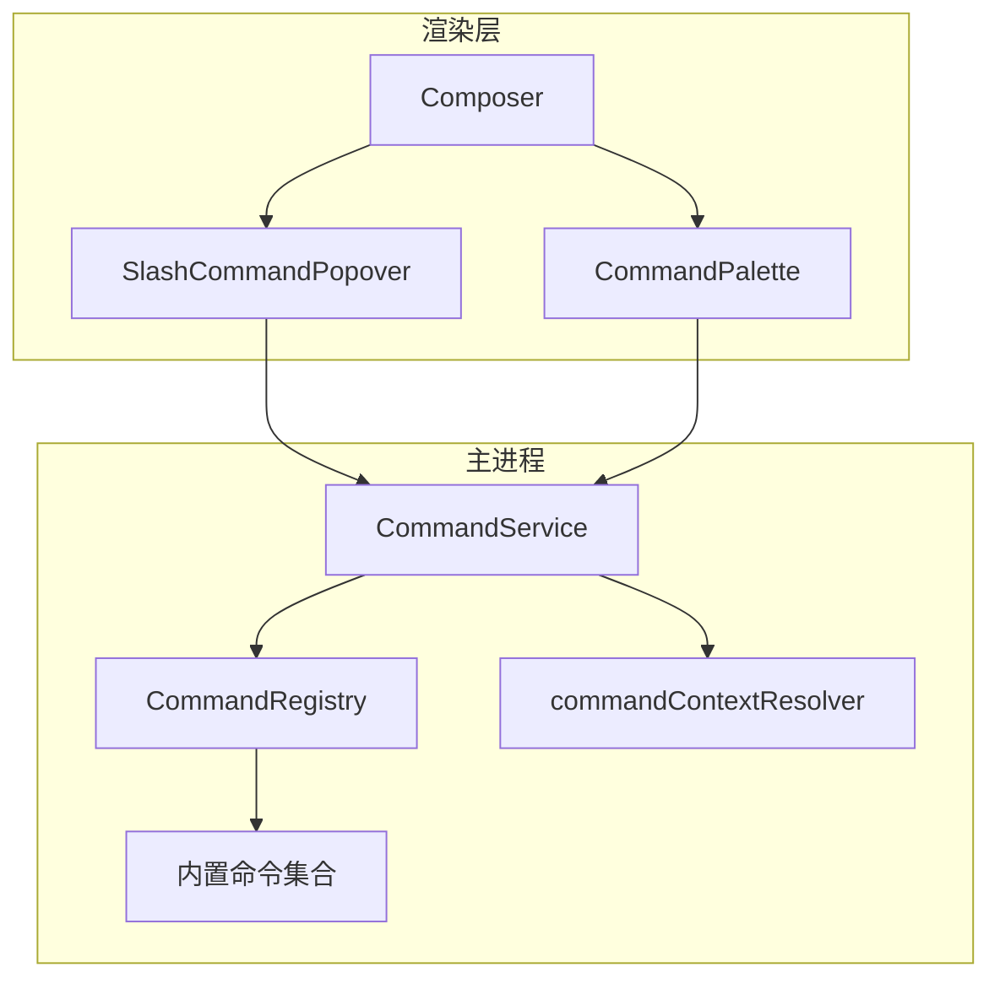
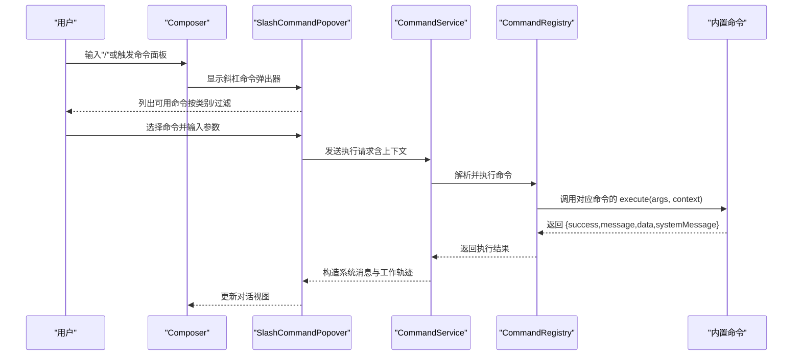
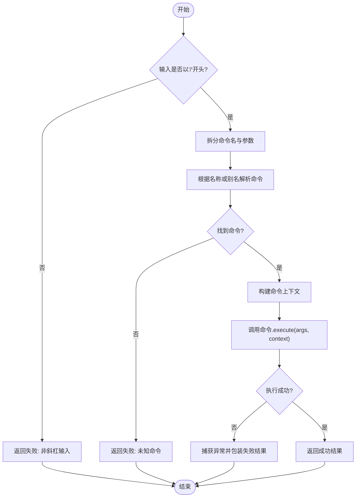
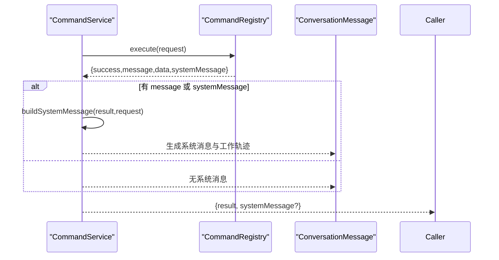
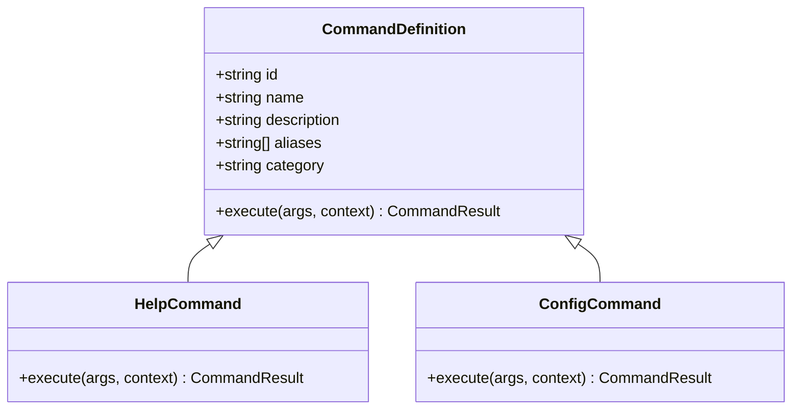
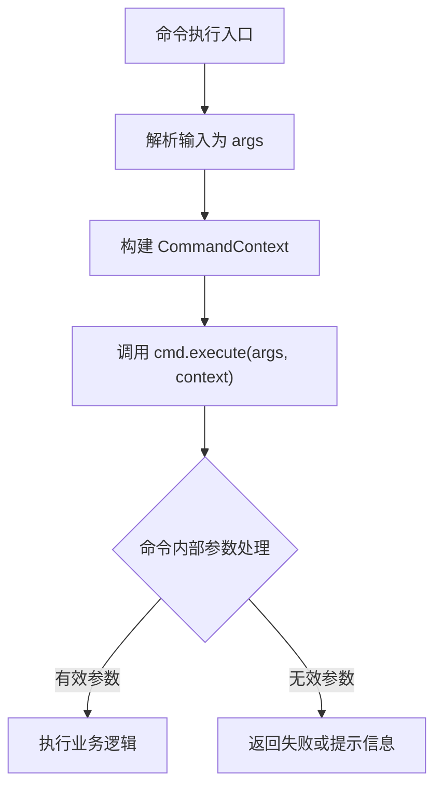
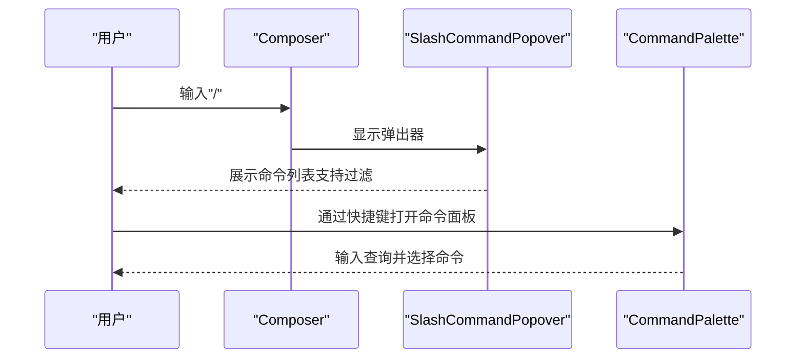
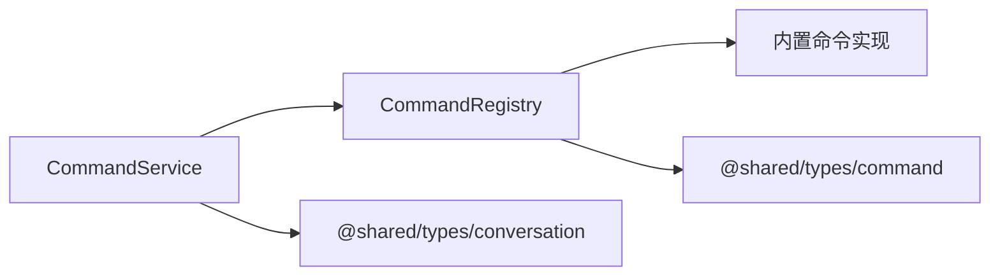

# 斜杠命令系统

<cite>
**本文引用的文件**
- [CommandRegistry.ts](file://src/main/commands/CommandRegistry.ts)
- [CommandService.ts](file://src/main/commands/CommandService.ts)
- [index.ts](file://src/main/commands/index.ts)
- [commandContextResolver.ts](file://src/main/commands/commandContextResolver.ts)
- [help.ts](file://src/main/commands/builtins/help.ts)
- [config.ts](file://src/main/commands/builtins/config.ts)
- [SlashCommandPopover.tsx](file://src/renderer/features/composer/SlashCommandPopover.tsx)
- [Composer.tsx](file://src/renderer/features/composer/Composer.tsx)
- [CommandPalette/index.tsx](file://src/renderer/patterns/CommandPalette/index.tsx)
</cite>

## 目录
1. [简介](#简介)
2. [项目结构](#项目结构)
3. [核心组件](#核心组件)
4. [架构总览](#架构总览)
5. [详细组件分析](#详细组件分析)
6. [依赖关系分析](#依赖关系分析)
7. [性能考虑](#性能考虑)
8. [故障排查指南](#故障排查指南)
9. [结论](#结论)
10. [附录](#附录)

## 简介
本文件面向对话编辑器中的“斜杠命令”子系统，系统性说明命令注册机制、自动完成与提示界面、命令执行流程、内置命令集、自定义命令开发、参数处理、权限控制、错误处理与调试工具，并提供实际使用场景与扩展指南。该子系统由主进程的命令注册与执行中心、服务桥接层以及渲染层的斜杠命令弹出器与命令面板组成，形成从输入到执行的完整闭环。

## 项目结构
- 主进程命令核心
  - 命令注册与执行：CommandRegistry
  - 命令服务桥接：CommandService
  - 全局注册入口：index（集中注册内置命令）
  - 上下文解析：commandContextResolver
  - 内置命令集合：builtins/*（如 help、config 等）
- 渲染层交互
  - 斜杠命令弹出器：SlashCommandPopover
  - 编辑器集成：Composer（触发并展示弹出器）
  - 全局命令面板：CommandPalette（通用命令入口）

**图示来源**
- [CommandRegistry.ts:18-115](file://src/main/commands/CommandRegistry.ts#L18-L115)
- [CommandService.ts:17-73](file://src/main/commands/CommandService.ts#L17-L73)
- [index.ts:31-68](file://src/main/commands/index.ts#L31-L68)
- [commandContextResolver.ts:7-25](file://src/main/commands/commandContextResolver.ts#L7-L25)
- [SlashCommandPopover.tsx:16-22](file://src/renderer/features/composer/SlashCommandPopover.tsx#L16-L22)
- [Composer.tsx:77-77](file://src/renderer/features/composer/Composer.tsx#L77-L77)
- [CommandPalette/index.tsx:19-20](file://src/renderer/patterns/CommandPalette/index.tsx#L19-L20)

**章节来源**
- [CommandRegistry.ts:18-115](file://src/main/commands/CommandRegistry.ts#L18-L115)
- [CommandService.ts:17-73](file://src/main/commands/CommandService.ts#L17-L73)
- [index.ts:31-68](file://src/main/commands/index.ts#L31-L68)
- [commandContextResolver.ts:7-25](file://src/main/commands/commandContextResolver.ts#L7-L25)
- [SlashCommandPopover.tsx:16-22](file://src/renderer/features/composer/SlashCommandPopover.tsx#L16-L22)
- [Composer.tsx:77-77](file://src/renderer/features/composer/Composer.tsx#L77-L77)
- [CommandPalette/index.tsx:19-20](file://src/renderer/patterns/CommandPalette/index.tsx#L19-L20)

## 核心组件
- CommandRegistry（命令注册与执行中心）
  - 维护命令映射（支持别名），提供注册、注销、查找、列表与执行能力。
  - 负责解析原始输入（以“/”开头）、路由到具体命令、构建上下文并调用 execute。
  - 统一捕获异常并返回失败结果。
- CommandService（命令执行桥接层）
  - 封装 Registry.execute，将结果转换为 ConversationMessage，便于渲染层展示。
  - 生成 workTrace 块，记录命令执行状态与摘要。
- 内置命令集合（builtins/*）
  - 通过 index.ts 集中注册，例如 /help、/config 等。
  - 每个命令实现统一的 CommandDefinition 接口（id、name、description、aliases、category、execute）。
- 上下文解析（commandContextResolver）
  - 将会话、项目、工作区、Agent、模式、模型、主题等信息组装为命令上下文。

**章节来源**
- [CommandRegistry.ts:18-115](file://src/main/commands/CommandRegistry.ts#L18-L115)
- [CommandService.ts:17-73](file://src/main/commands/CommandService.ts#L17-L73)
- [index.ts:31-68](file://src/main/commands/index.ts#L31-L68)
- [commandContextResolver.ts:7-25](file://src/main/commands/commandContextResolver.ts#L7-L25)

## 架构总览
下图展示了从用户输入到命令执行与结果展示的端到端流程。

**图示来源**
- [CommandRegistry.ts:73-115](file://src/main/commands/CommandRegistry.ts#L73-L115)
- [CommandService.ts:20-73](file://src/main/commands/CommandService.ts#L20-L73)
- [help.ts:7-48](file://src/main/commands/builtins/help.ts#L7-L48)
- [config.ts:6-19](file://src/main/commands/builtins/config.ts#L6-L19)
- [SlashCommandPopover.tsx:16-22](file://src/renderer/features/composer/SlashCommandPopover.tsx#L16-L22)
- [Composer.tsx:77-77](file://src/renderer/features/composer/Composer.tsx#L77-L77)

## 详细组件分析

### 命令注册与发现（CommandRegistry）
- 注册与别名
  - register：支持同名覆盖；同时注册 aliases 到同一命令对象。
  - unregister：移除主名及与其关联的别名。
- 查找与列举
  - resolve：根据名称或别名获取命令定义。
  - list：去重并按主 id 输出，支持按 category 过滤，排序后供 UI 自动完成。
- 执行流程
  - execute：校验输入以“/”开头；拆分命令名与参数；解析上下文；调用 cmd.execute；捕获异常并包装为失败结果。

**图示来源**
- [CommandRegistry.ts:73-115](file://src/main/commands/CommandRegistry.ts#L73-L115)

**章节来源**
- [CommandRegistry.ts:18-115](file://src/main/commands/CommandRegistry.ts#L18-L115)

### 命令服务桥接（CommandService）
- 职责
  - 调用 Registry.execute，并将结果转换为 ConversationMessage。
  - 生成 workTrace 块，包含命令标题、状态、摘要与数据。
- 系统消息构建
  - 基于 result.message/systemMessage 与当前时间戳生成唯一 ID。
  - 将 success 映射为 status（complete/error）。
  - 当存在 data 时，将其序列化追加到 summary。

**图示来源**
- [CommandService.ts:20-73](file://src/main/commands/CommandService.ts#L20-L73)

**章节来源**
- [CommandService.ts:17-73](file://src/main/commands/CommandService.ts#L17-L73)

### 内置命令集与示例
- 集中注册
  - index.ts 在 getRegistry() 中创建单例并注册所有内置命令。
- 典型命令
  - /help：列出全部命令或查看某命令详情；按类别分组输出。
  - /config：打开设置或定位到指定配置项（通过 uiAction 驱动前端行为）。
- 扩展点
  - 新增命令需实现 CommandDefinition，并在 index.ts 的 registerBuiltins 中注册。

**图示来源**
- [help.ts:7-48](file://src/main/commands/builtins/help.ts#L7-L48)
- [config.ts:6-19](file://src/main/commands/builtins/config.ts#L6-L19)
- [index.ts:41-68](file://src/main/commands/index.ts#L41-L68)

**章节来源**
- [index.ts:31-68](file://src/main/commands/index.ts#L31-L68)
- [help.ts:7-48](file://src/main/commands/builtins/help.ts#L7-L48)
- [config.ts:6-19](file://src/main/commands/builtins/config.ts#L6-L19)

### 命令上下文与参数处理
- 上下文来源
  - commandContextResolver 将 sessionId、projectId、workspaceRoot、agentId、currentMode、currentModelId、currentTheme 组合为 CommandContext。
- 参数传递
  - Registry.execute 将 args（字符串数组）与 context 传入命令的 execute。
  - 命令内部可依据参数进行分支逻辑（如 /config 读取 section）。

**图示来源**
- [CommandRegistry.ts:73-115](file://src/main/commands/CommandRegistry.ts#L73-L115)
- [commandContextResolver.ts:7-25](file://src/main/commands/commandContextResolver.ts#L7-L25)

**章节来源**
- [CommandRegistry.ts:73-115](file://src/main/commands/CommandRegistry.ts#L73-L115)
- [commandContextResolver.ts:7-25](file://src/main/commands/commandContextResolver.ts#L7-L25)

### 命令提示界面、自动完成与快捷键
- 斜杠命令弹出器
  - SlashCommandPopover 作为弹出式选择器，接收命令列表并支持过滤搜索。
  - 与 Composer 集成，在编辑器中输入“/”时触发。
- 全局命令面板
  - CommandPalette 提供全局命令入口，支持查询与执行回调。
- 自动完成
  - 通过 Registry.list(category?) 获取命令列表，UI 侧可按名称/描述/类别进行过滤与排序展示。

**图示来源**
- [SlashCommandPopover.tsx:16-22](file://src/renderer/features/composer/SlashCommandPopover.tsx#L16-L22)
- [Composer.tsx:77-77](file://src/renderer/features/composer/Composer.tsx#L77-L77)
- [CommandPalette/index.tsx:19-20](file://src/renderer/patterns/CommandPalette/index.tsx#L19-L20)

**章节来源**
- [SlashCommandPopover.tsx:16-22](file://src/renderer/features/composer/SlashCommandPopover.tsx#L16-L22)
- [Composer.tsx:77-77](file://src/renderer/features/composer/Composer.tsx#L77-L77)
- [CommandPalette/index.tsx:19-20](file://src/renderer/patterns/CommandPalette/index.tsx#L19-L20)

### 权限控制与安全性
- 命令级权限
  - 可在命令定义中增加权限字段（如 requiredPermissions），在执行前由上层服务校验。
- 上下文约束
  - 通过 CommandContext 限制命令对会话/项目/工作区的访问范围。
- 安全建议
  - 对敏感操作（如修改配置、导出数据）增加二次确认与审计日志。
  - 避免在命令中直接暴露底层资源路径或密钥。

[本节为概念性说明，不直接分析具体文件]

### 错误处理与调试
- 统一错误包装
  - Registry.execute 捕获异常并返回失败结果，附带错误信息。
- 工作轨迹
  - CommandService 生成的 workTrace 包含命令标题、状态与摘要，便于追踪问题。
- 调试建议
  - 使用 /help 快速验证命令可用性。
  - 检查命令返回的 message/data 与 workTrace.blocks 内容定位问题。

**章节来源**
- [CommandRegistry.ts:105-115](file://src/main/commands/CommandRegistry.ts#L105-L115)
- [CommandService.ts:34-73](file://src/main/commands/CommandService.ts#L34-L73)

## 依赖关系分析
- 组件耦合
  - CommandService 依赖 CommandRegistry；Registry 依赖内置命令实现。
  - 渲染层通过 Service 与 Registry 解耦，便于替换与测试。
- 外部依赖
  - 共享类型来自 @shared/types/command 与 conversation 类型。
  - 内置命令可能依赖 SettingsService、StorageAdapter 等（通过命令内部注入或服务调用）。

**图示来源**
- [CommandService.ts:10-15](file://src/main/commands/CommandService.ts#L10-L15)
- [CommandRegistry.ts:10-16](file://src/main/commands/CommandRegistry.ts#L10-L16)
- [index.ts:41-68](file://src/main/commands/index.ts#L41-L68)

**章节来源**
- [CommandService.ts:10-15](file://src/main/commands/CommandService.ts#L10-L15)
- [CommandRegistry.ts:10-16](file://src/main/commands/CommandRegistry.ts#L10-L16)
- [index.ts:41-68](file://src/main/commands/index.ts#L41-L68)

## 性能考虑
- 命令列表缓存
  - Registry.list 每次遍历 Map，建议在 UI 层缓存并按需刷新。
- 批量命令
  - 对于需要多次调用的场景，可合并参数减少往返。
- 异步执行
  - 命令执行应为异步，避免阻塞主线程；长耗时任务应返回流式或进度反馈。
- 日志与追踪
  - 利用 workTrace 记录关键步骤，便于性能分析与问题定位。

[本节为通用指导，不直接分析具体文件]

## 故障排查指南
- 常见问题
  - 输入未以“/”开头：Registry 会返回失败提示。
  - 未知命令：Registry 返回“未知命令”，建议使用 /help 查看可用命令。
  - 命令执行异常：被捕获并包装为失败结果，检查命令内部抛出错误。
- 定位方法
  - 查看 CommandService 生成的 systemMessage 与 workTrace.blocks 内容。
  - 使用 /help <command> 查看命令描述与别名，确认拼写与参数格式。
- 恢复策略
  - 对幂等命令可重试；对破坏性操作需二次确认。
  - 若涉及权限不足，检查上下文与会话/项目绑定是否正确。

**章节来源**
- [CommandRegistry.ts:73-115](file://src/main/commands/CommandRegistry.ts#L73-L115)
- [CommandService.ts:34-73](file://src/main/commands/CommandService.ts#L34-L73)

## 结论
斜杠命令系统通过清晰的注册与执行分层、统一的上下文与结果模型，以及友好的前端提示与面板，实现了高内聚、低耦合的命令生态。开发者可通过实现 CommandDefinition 并注册到全局 Registry，快速扩展功能；借助 workTrace 与统一错误包装，便于调试与维护。结合权限控制与最佳实践，可构建安全、稳定、易用的对话编辑器命令体验。

## 附录
- 使用场景示例
  - 打开设置：在编辑器输入 /config 并指定 section，触发前端打开设置界面。
  - 查看帮助：输入 /help 或 /help <command> 获取命令列表或详情。
  - 执行自定义命令：实现 CommandDefinition 并在 index.ts 中注册，随后即可通过斜杠触发。
- 扩展开发指南
  - 新增命令步骤
    - 在 builtins 下新建命令文件，实现 CommandDefinition。
    - 在 index.ts 的 registerBuiltins 中导入并注册。
    - 如需权限控制，在上层服务中校验后再执行。
  - 参数处理建议
    - 对必填参数进行校验，返回明确的错误信息。
    - 对可选参数提供默认值与帮助提示。
  - 调试技巧
    - 使用 /help 验证命令是否生效。
    - 检查 workTrace 与 systemMessage 内容定位问题。

[本节为概念性说明，不直接分析具体文件]