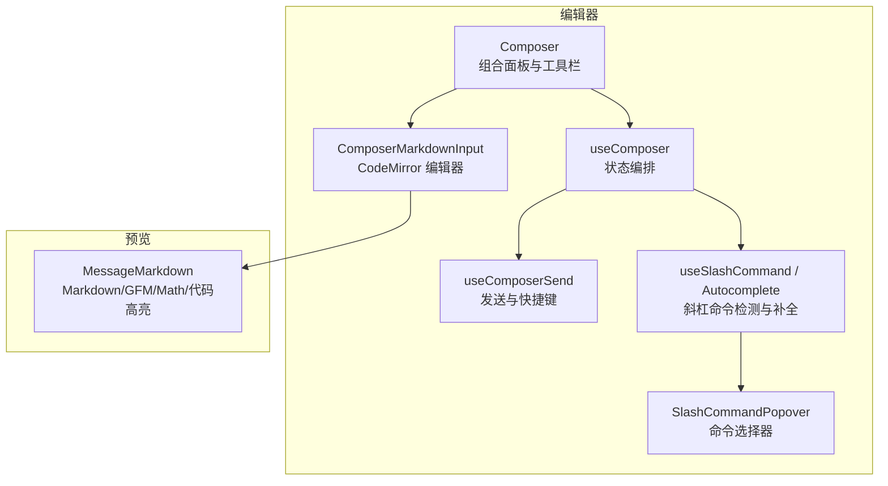
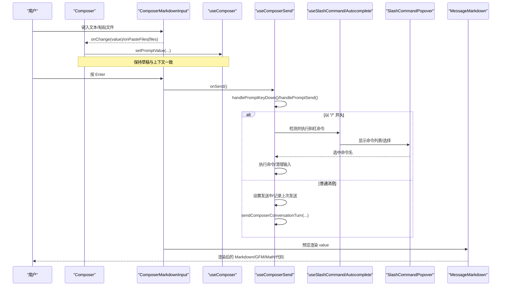
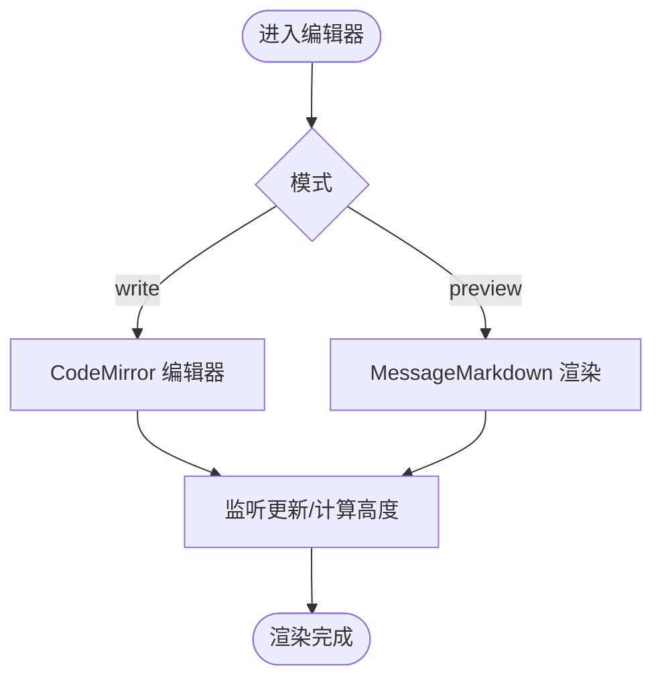
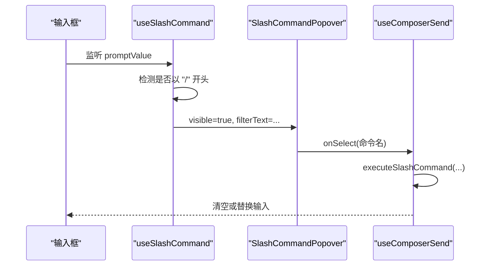
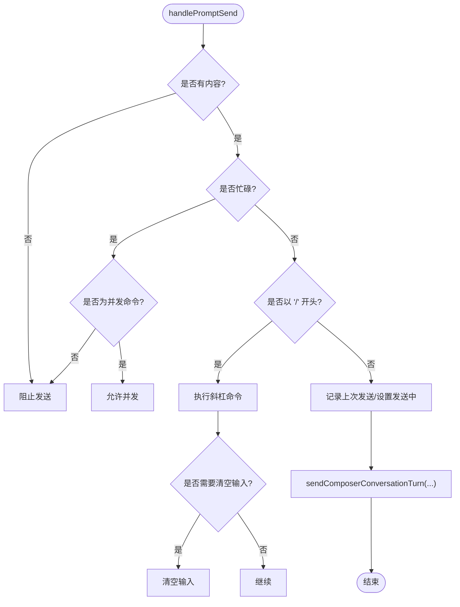
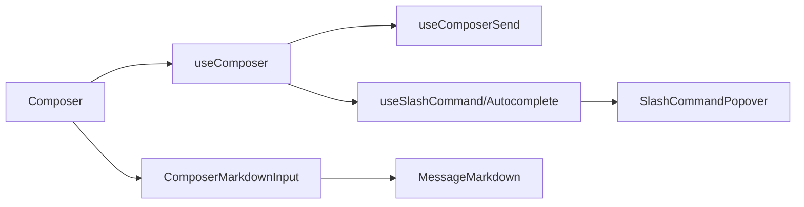

# 输入处理与编辑

<cite>
**本文引用的文件**
- [ComposerMarkdownInput.tsx](file://src/renderer/features/composer/ComposerMarkdownInput.tsx)
- [Composer.tsx](file://src/renderer/features/composer/Composer.tsx)
- [useComposer.ts](file://src/renderer/features/composer/useComposer.ts)
- [useComposerSend.ts](file://src/renderer/features/composer/useComposerSend.ts)
- [useSlashCommand.ts](file://src/renderer/features/composer/useSlashCommand.ts)
- [useSlashCommandAutocomplete.ts](file://src/renderer/features/composer/useSlashCommandAutocomplete.ts)
- [SlashCommandPopover.tsx](file://src/renderer/features/composer/SlashCommandPopover.tsx)
- [MessageMarkdown.tsx](file://src/renderer/patterns/Markdown/MessageMarkdown.tsx)
</cite>

## 目录
1. [简介](#简介)
2. [项目结构](#项目结构)
3. [核心组件](#核心组件)
4. [架构总览](#架构总览)
5. [详细组件分析](#详细组件分析)
6. [依赖关系分析](#依赖关系分析)
7. [性能考量](#性能考量)
8. [故障排查指南](#故障排查指南)
9. [结论](#结论)
10. [附录](#附录)

## 简介
本文件聚焦对话编辑器“输入处理与编辑”能力，覆盖 Markdown 输入模式、文本编辑功能、快捷键支持、实时预览机制、输入验证、自动完成（斜杠命令）、语法高亮、格式转换、编辑器状态管理、内容持久化、撤销重做机制，以及自定义扩展、主题定制与用户体验优化建议。文档同时提供实际使用场景的集成要点与代码片段路径，便于快速落地。

## 项目结构
围绕对话输入的核心位于渲染端的 composer 特性目录，配合 Markdown 渲染模式：
- 编辑器与交互：ComposerMarkdownInput、Composer、useComposer、useComposerSend、useSlashCommand、useSlashCommandAutocomplete、SlashCommandPopover
- 预览渲染：MessageMarkdown（基于 react-markdown + GFM + KaTeX + 代码高亮）
- 状态与上下文：useComposer 聚合会话、项目、设备、模式等上下文，并协调发送流程

图表来源
- [Composer.tsx:175-220](file://src/renderer/features/composer/Composer.tsx#L175-L220)
- [ComposerMarkdownInput.tsx:135-178](file://src/renderer/features/composer/ComposerMarkdownInput.tsx#L135-L178)
- [useComposer.ts:63-127](file://src/renderer/features/composer/useComposer.ts#L63-L127)
- [useComposerSend.ts:83-155](file://src/renderer/features/composer/useComposerSend.ts#L83-L155)
- [useSlashCommand.ts:20-48](file://src/renderer/features/composer/useSlashCommand.ts#L20-L48)
- [useSlashCommandAutocomplete.ts:6-36](file://src/renderer/features/composer/useSlashCommandAutocomplete.ts#L6-L36)
- [SlashCommandPopover.tsx:22-109](file://src/renderer/features/composer/SlashCommandPopover.tsx#L22-L109)
- [MessageMarkdown.tsx:89-108](file://src/renderer/patterns/Markdown/MessageMarkdown.tsx#L89-L108)

章节来源
- [Composer.tsx:175-220](file://src/renderer/features/composer/Composer.tsx#L175-L220)
- [ComposerMarkdownInput.tsx:135-178](file://src/renderer/features/composer/ComposerMarkdownInput.tsx#L135-L178)
- [useComposer.ts:63-127](file://src/renderer/features/composer/useComposer.ts#L63-L127)
- [useComposerSend.ts:83-155](file://src/renderer/features/composer/useComposerSend.ts#L83-L155)
- [useSlashCommand.ts:20-48](file://src/renderer/features/composer/useSlashCommand.ts#L20-L48)
- [useSlashCommandAutocomplete.ts:6-36](file://src/renderer/features/composer/useSlashCommandAutocomplete.ts#L6-L36)
- [SlashCommandPopover.tsx:22-109](file://src/renderer/features/composer/SlashCommandPopover.tsx#L22-L109)
- [MessageMarkdown.tsx:89-108](file://src/renderer/patterns/Markdown/MessageMarkdown.tsx#L89-L108)

## 核心组件
- ComposerMarkdownInput：基于 CodeMirror 的 Markdown 编辑器，提供写/预览双模式、粘贴文件、Enter 发送、动态高度自适应、主题样式、Tab 缩进、只读控制。
- Composer：编排输入区、附件托盘、模式切换标签、工具栏（代理/权限/模型/努力度/用量），并在忙碌或请求中切换视图。
- useComposer：集中管理提示词草稿、附件、技能、会话/项目/设备上下文、发送流程、展示文案与按钮禁用态。
- useComposerSend：实现发送主流程、斜杠命令分流、并发控制、键盘 Enter 发送、停止逻辑。
- useSlashCommand / useSlashCommandAutocomplete / SlashCommandPopover：检测“/”触发、过滤命令、弹出层选择与键盘导航。
- MessageMarkdown：统一渲染 Markdown/GFM/KaTeX/代码块/Mermaid，用于预览与消息展示。

章节来源
- [ComposerMarkdownInput.tsx:18-26](file://src/renderer/features/composer/ComposerMarkdownInput.tsx#L18-L26)
- [Composer.tsx:53-117](file://src/renderer/features/composer/Composer.tsx#L53-L117)
- [useComposer.ts:23-193](file://src/renderer/features/composer/useComposer.ts#L23-L193)
- [useComposerSend.ts:20-199](file://src/renderer/features/composer/useComposerSend.ts#L20-L199)
- [useSlashCommand.ts:20-48](file://src/renderer/features/composer/useSlashCommand.ts#L20-L48)
- [useSlashCommandAutocomplete.ts:6-36](file://src/renderer/features/composer/useSlashCommandAutocomplete.ts#L6-L36)
- [SlashCommandPopover.tsx:22-109](file://src/renderer/features/composer/SlashCommandPopover.tsx#L22-L109)
- [MessageMarkdown.tsx:89-108](file://src/renderer/patterns/Markdown/MessageMarkdown.tsx#L89-L108)

## 架构总览
以下序列图展示了从用户输入到发送、预览与命令处理的完整链路。

图表来源
- [Composer.tsx:175-220](file://src/renderer/features/composer/Composer.tsx#L175-L220)
- [ComposerMarkdownInput.tsx:135-178](file://src/renderer/features/composer/ComposerMarkdownInput.tsx#L135-L178)
- [useComposerSend.ts:83-155](file://src/renderer/features/composer/useComposerSend.ts#L83-L155)
- [useSlashCommand.ts:20-48](file://src/renderer/features/composer/useSlashCommand.ts#L20-L48)
- [useSlashCommandAutocomplete.ts:6-36](file://src/renderer/features/composer/useSlashCommandAutocomplete.ts#L6-L36)
- [SlashCommandPopover.tsx:22-109](file://src/renderer/features/composer/SlashCommandPopover.tsx#L22-L109)
- [MessageMarkdown.tsx:89-108](file://src/renderer/patterns/Markdown/MessageMarkdown.tsx#L89-L108)

## 详细组件分析

### Markdown 输入模式与实时预览
- 写/预览双模式：通过 mode 在编辑器与预览之间切换；预览区域使用 MessageMarkdown 渲染同一份值。
- 动态高度：根据内容 scrollHeight 计算容器高度，限制最小/最大高度，保证紧凑且可滚动。
- 粘贴文件：拦截 paste 事件，提取 files 并交由上层处理；若存在纯文本则保留文本行为。
- 只读与禁用：editable 受 disabled 与 mode 控制，避免运行中误改。

图表来源
- [ComposerMarkdownInput.tsx:110-178](file://src/renderer/features/composer/ComposerMarkdownInput.tsx#L110-L178)
- [MessageMarkdown.tsx:89-108](file://src/renderer/patterns/Markdown/MessageMarkdown.tsx#L89-L108)

章节来源
- [ComposerMarkdownInput.tsx:110-178](file://src/renderer/features/composer/ComposerMarkdownInput.tsx#L110-L178)
- [MessageMarkdown.tsx:89-108](file://src/renderer/patterns/Markdown/MessageMarkdown.tsx#L89-L108)

### 文本编辑功能与快捷键
- Tab 缩进：启用 indentWithTab，提升多行编辑效率。
- Enter 发送：在编辑器内最高优先级绑定 Enter 调用 onSend；同时在 textarea 模式下由 useComposerSend 的 handlePromptKeyDown 捕获 Enter（非 Shift+Enter）。
- 粘贴与拖拽：编辑器内部拦截粘贴文件；外层 Composer 也提供拖放与粘贴入口，统一走附件处理。
- 占位符与换行：启用 placeholder 与行包裹，提升可读性。

章节来源
- [ComposerMarkdownInput.tsx:135-178](file://src/renderer/features/composer/ComposerMarkdownInput.tsx#L135-L178)
- [useComposerSend.ts:185-190](file://src/renderer/features/composer/useComposerSend.ts#L185-L190)
- [Composer.tsx:160-220](file://src/renderer/features/composer/Composer.tsx#L160-L220)

### 斜杠命令与自动完成
- 触发条件：当 promptValue 去除空白后以 “/” 开头时，进入命令模式；长度限制确保弹窗及时出现。
- 过滤与选择：根据 filterText 过滤命令名称与别名；支持键盘上下导航、Enter 选择、Esc 关闭。
- 执行策略：以 “/” 开头的输入优先交给斜杠命令处理器；若非命令则作为普通消息发送。
- 并发控制：部分命令允许与当前运行并发（如模型切换），其余情况下会置为发送中状态。

图表来源
- [useSlashCommand.ts:20-48](file://src/renderer/features/composer/useSlashCommand.ts#L20-L48)
- [useSlashCommandAutocomplete.ts:6-36](file://src/renderer/features/composer/useSlashCommandAutocomplete.ts#L6-L36)
- [SlashCommandPopover.tsx:22-109](file://src/renderer/features/composer/SlashCommandPopover.tsx#L22-L109)
- [useComposerSend.ts:94-116](file://src/renderer/features/composer/useComposerSend.ts#L94-L116)

章节来源
- [useSlashCommand.ts:20-48](file://src/renderer/features/composer/useSlashCommand.ts#L20-L48)
- [useSlashCommandAutocomplete.ts:6-36](file://src/renderer/features/composer/useSlashCommandAutocomplete.ts#L6-L36)
- [SlashCommandPopover.tsx:22-109](file://src/renderer/features/composer/SlashCommandPopover.tsx#L22-L109)
- [useComposerSend.ts:94-116](file://src/renderer/features/composer/useComposerSend.ts#L94-L116)

### 输入验证与发送流程
- 空内容与忙碌态：无有效内容或处于忙碌态（有活跃会话/调试运行/发送中）将阻止发送；特定命令允许并发。
- 命令分流：以 “/” 开头的输入先尝试执行斜杠命令；成功处理后可能清空输入。
- 发送准备：记录上次发送信息（会话、项目、提示词、附件、技能），再调用发送流程。
- 错误与恢复：发送失败时通过通知提示；会话切换时重置发送中状态。

图表来源
- [useComposerSend.ts:83-155](file://src/renderer/features/composer/useComposerSend.ts#L83-L155)

章节来源
- [useComposerSend.ts:83-155](file://src/renderer/features/composer/useComposerSend.ts#L83-L155)

### 语法高亮与格式转换
- 编辑器侧：启用 markdown 语言扩展、括号匹配、行包裹、主题样式；未启用行号与折叠，保持简洁。
- 预览侧：使用 react-markdown 解析 GFM、数学公式（KaTeX）、代码高亮（rehype-highlight），并对代码块进行 Mermaid 特殊处理。
- 安全与体验：外部链接在新窗口打开；图片懒加载；任务复选框只读展示。

章节来源
- [ComposerMarkdownInput.tsx:135-178](file://src/renderer/features/composer/ComposerMarkdownInput.tsx#L135-L178)
- [MessageMarkdown.tsx:89-108](file://src/renderer/patterns/Markdown/MessageMarkdown.tsx#L89-L108)

### 编辑器状态管理与内容持久化
- 提示词草稿：通过 useScopedPromptDraft 按项目/会话维度维护草稿，避免跨会话污染。
- 会话上下文：useComposer 聚合当前项目、会话、设备、模式、代理等信息，驱动界面与发送。
- 发送状态：isPromptSending 与 isComposerBusy 控制按钮与输入可用性；会话切换时复位。
- 附件与技能：pendingAttachments/pendingSkillIds 在发送前暂存，发送后按需清理。

章节来源
- [useComposer.ts:63-127](file://src/renderer/features/composer/useComposer.ts#L63-L127)
- [useComposerSend.ts:49-81](file://src/renderer/features/composer/useComposerSend.ts#L49-L81)

### 撤销与重做机制
- CodeMirror 默认内置撤销/重做栈，无需额外配置即可使用 Ctrl/Cmd+Z 与 Ctrl/Cmd+Shift+Z。
- 如需自定义行为（例如合并多次变更、限制历史深度），可通过 CodeMirror 的 undoManager 或相关扩展进行控制。

章节来源
- [ComposerMarkdownInput.tsx:192-210](file://src/renderer/features/composer/ComposerMarkdownInput.tsx#L192-L210)

### 自定义输入扩展、主题定制与体验优化
- 自定义扩展：可在 extensions 数组中追加 CodeMirror 扩展（如自动补全、校验、格式化插件），并通过 Prec 调整键位优先级。
- 主题定制：通过 EditorView.theme 映射设计令牌（颜色、字体、行高），并与应用主题联动。
- 体验优化：
  - 动态高度与行包裹，减少滚动。
  - 仅在当前模式为 write 时监听更新以节省性能。
  - 斜杠命令弹窗支持键盘导航，提升无障碍与效率。
  - 粘贴/拖拽统一接入附件处理，减少重复逻辑。

章节来源
- [ComposerMarkdownInput.tsx:28-93](file://src/renderer/features/composer/ComposerMarkdownInput.tsx#L28-L93)
- [ComposerMarkdownInput.tsx:135-178](file://src/renderer/features/composer/ComposerMarkdownInput.tsx#L135-L178)
- [SlashCommandPopover.tsx:52-82](file://src/renderer/features/composer/SlashCommandPopover.tsx#L52-L82)

## 依赖关系分析
- 组件耦合：
  - Composer 依赖 useComposer 提供的状态与方法，组合多个子组件（Markdown 输入、附件、工具栏等）。
  - ComposerMarkdownInput 依赖 CodeMirror 生态与 MessageMarkdown 预览。
  - useComposerSend 依赖会话/项目/工作流存储，负责发送与命令执行。
  - 斜杠命令相关模块解耦了检测、过滤、展示与执行。
- 外部依赖：
  - CodeMirror（编辑器与扩展）
  - react-markdown、remark-gfm、remark-math、rehype-highlight、rehype-katex（预览渲染）
  - Electron API（命令列表、IPC 通信）

图表来源
- [Composer.tsx:175-220](file://src/renderer/features/composer/Composer.tsx#L175-L220)
- [useComposer.ts:63-127](file://src/renderer/features/composer/useComposer.ts#L63-L127)
- [useComposerSend.ts:83-155](file://src/renderer/features/composer/useComposerSend.ts#L83-L155)
- [useSlashCommand.ts:20-48](file://src/renderer/features/composer/useSlashCommand.ts#L20-L48)
- [SlashCommandPopover.tsx:22-109](file://src/renderer/features/composer/SlashCommandPopover.tsx#L22-L109)
- [MessageMarkdown.tsx:89-108](file://src/renderer/patterns/Markdown/MessageMarkdown.tsx#L89-L108)

章节来源
- [Composer.tsx:175-220](file://src/renderer/features/composer/Composer.tsx#L175-L220)
- [useComposer.ts:63-127](file://src/renderer/features/composer/useComposer.ts#L63-L127)
- [useComposerSend.ts:83-155](file://src/renderer/features/composer/useComposerSend.ts#L83-L155)
- [useSlashCommand.ts:20-48](file://src/renderer/features/composer/useSlashCommand.ts#L20-L48)
- [SlashCommandPopover.tsx:22-109](file://src/renderer/features/composer/SlashCommandPopover.tsx#L22-L109)
- [MessageMarkdown.tsx:89-108](file://src/renderer/patterns/Markdown/MessageMarkdown.tsx#L89-L108)

## 性能考量
- 仅在 write 模式监听更新并计算高度，避免预览模式下的不必要重排。
- 使用 memo 与 useMemo 对渲染结果进行缓存（如 MessageMarkdown）。
- 动态高度计算采用最小/最大高度限制，防止过度增长导致布局抖动。
- 斜杠命令弹窗仅在短输入范围内显示，降低 DOM 复杂度。
- 代码高亮与数学公式渲染按需启用，避免首屏过重。

[本节为通用指导，不直接分析具体文件]

## 故障排查指南
- 无法发送：
  - 检查是否处于忙碌态（发送中/活跃会话/调试运行）；确认输入非空或存在有效附件。
  - 若以 “/” 开头，确认命令是否存在并可执行。
- 预览异常：
  - 检查 Markdown 语法是否正确；确认 Math/KaTeX 与代码高亮资源已加载。
- 斜杠命令无效：
  - 确认输入以 “/” 开头且长度满足显示条件；检查命令列表是否可用。
- 粘贴文件失败：
  - 确认 onPasteFiles 回调已注册；检查剪贴板数据类型。

章节来源
- [useComposerSend.ts:83-155](file://src/renderer/features/composer/useComposerSend.ts#L83-L155)
- [ComposerMarkdownInput.tsx:152-167](file://src/renderer/features/composer/ComposerMarkdownInput.tsx#L152-L167)
- [useSlashCommand.ts:20-48](file://src/renderer/features/composer/useSlashCommand.ts#L20-L48)
- [SlashCommandPopover.tsx:33-40](file://src/renderer/features/composer/SlashCommandPopover.tsx#L33-L40)

## 结论
该输入处理方案以 CodeMirror 为核心，结合 React 状态管理与模块化 hook，实现了 Markdown 输入、实时预览、斜杠命令、快捷键、附件处理与主题定制等关键能力。通过清晰的职责划分与可扩展的扩展点，既保证了易用性，也为后续增强（如更丰富的自动补全、校验规则、自定义主题）提供了良好基础。

[本节为总结，不直接分析具体文件]

## 附录
- 集成要点（代码片段路径）
  - 启用 Markdown 输入与预览：[ComposerMarkdownInput.tsx:135-178](file://src/renderer/features/composer/ComposerMarkdownInput.tsx#L135-L178)
  - 组合输入区与工具栏：[Composer.tsx:175-220](file://src/renderer/features/composer/Composer.tsx#L175-L220)
  - 发送流程与快捷键：[useComposerSend.ts:83-155](file://src/renderer/features/composer/useComposerSend.ts#L83-L155), [useComposerSend.ts:185-190](file://src/renderer/features/composer/useComposerSend.ts#L185-L190)
  - 斜杠命令检测与弹窗：[useSlashCommand.ts:20-48](file://src/renderer/features/composer/useSlashCommand.ts#L20-L48), [SlashCommandPopover.tsx:22-109](file://src/renderer/features/composer/SlashCommandPopover.tsx#L22-L109)
  - 预览渲染配置：[MessageMarkdown.tsx:89-108](file://src/renderer/patterns/Markdown/MessageMarkdown.tsx#L89-L108)
- 最佳实践建议
  - 在扩展数组中使用 Prec 控制键位优先级，避免冲突。
  - 通过 EditorView.theme 与设计令牌对齐主题，保持一致视觉。
  - 对长内容预览使用懒加载与分页策略，提升首屏性能。
  - 为斜杠命令提供清晰描述与分类，提升可发现性。

[本节为补充说明，不直接分析具体文件]