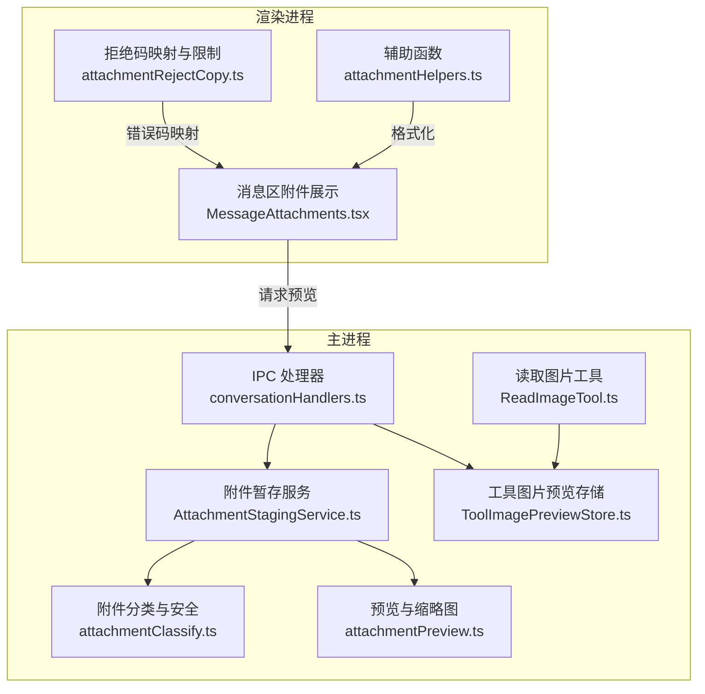
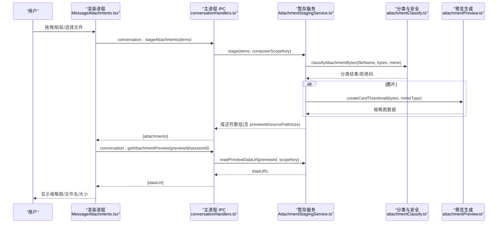
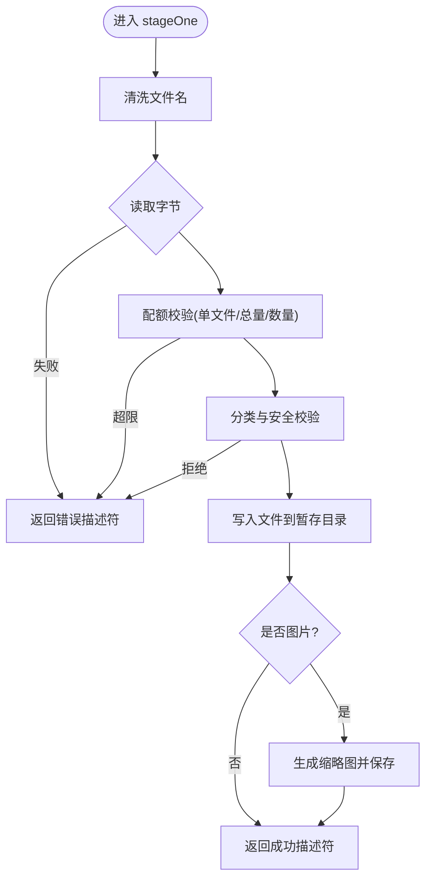
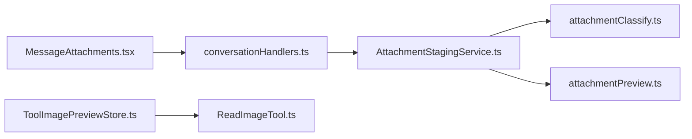

# 附件管理

<cite>
**本文引用的文件**
- [AttachmentStagingService.ts](file://src/main/conversation/AttachmentStagingService.ts)
- [attachmentClassify.ts](file://src/main/conversation/attachmentClassify.ts)
- [attachmentPreview.ts](file://src/main/conversation/attachmentPreview.ts)
- [conversationHandlers.ts](file://src/main/ipc/conversationHandlers.ts)
- [MessageAttachments.tsx](file://src/renderer/features/transcript/MessageAttachments.tsx)
- [attachmentRejectCopy.ts](file://src/renderer/features/composer/attachmentRejectCopy.ts)
- [ToolImagePreviewStore.ts](file://src/main/conversation/ToolImagePreviewStore.ts)
- [ReadImageTool.ts](file://src/main/agent-runtime/tools/primitives/ReadImageTool.ts)
- [attachmentHelpers.ts](file://src/renderer/services/attachmentHelpers.ts)
</cite>

## 目录
1. [简介](#简介)
2. [项目结构](#项目结构)
3. [核心组件](#核心组件)
4. [架构总览](#架构总览)
5. [详细组件分析](#详细组件分析)
6. [依赖关系分析](#依赖关系分析)
7. [性能考虑](#性能考虑)
8. [故障排查指南](#故障排查指南)
9. [结论](#结论)
10. [附录](#附录)

## 简介
本文件面向对话编辑器中的“附件管理”能力，系统性说明以下方面：
- 文件拖拽上传、粘贴插入、文件选择与批量处理的端到端流程
- 支持的附件类型、大小限制、格式校验与安全策略
- 预览生成与展示（缩略图、卡片预览）
- 附件状态管理、错误处理与进度提示
- 自定义处理器扩展点、安全验证与性能优化策略
- 实际使用场景的代码级参考路径与最佳实践

该功能由主进程服务负责安全校验、落盘与预览生成，渲染进程负责交互、预览获取与展示。通过 IPC 接口进行跨进程通信，确保大文件与敏感操作在主进程完成。

## 项目结构
围绕附件管理的代码主要分布在以下位置：
- 主进程：附件暂存与分类、预览生成、IPC 处理
- 渲染进程：消息区附件展示、预览获取、拒绝码映射与 UI 文案
- 工具链：图像读取与预览记录（用于工具调用场景）

图表来源
- [conversationHandlers.ts:195-240](file://src/main/ipc/conversationHandlers.ts#L195-L240)
- [AttachmentStagingService.ts:110-271](file://src/main/conversation/AttachmentStagingService.ts#L110-L271)
- [attachmentClassify.ts:319-365](file://src/main/conversation/attachmentClassify.ts#L319-L365)
- [attachmentPreview.ts:36-99](file://src/main/conversation/attachmentPreview.ts#L36-L99)
- [MessageAttachments.tsx:1-68](file://src/renderer/features/transcript/MessageAttachments.tsx#L1-L68)
- [attachmentRejectCopy.ts:1-23](file://src/renderer/features/composer/attachmentRejectCopy.ts#L1-L23)
- [ToolImagePreviewStore.ts:69-127](file://src/main/conversation/ToolImagePreviewStore.ts#L69-L127)
- [ReadImageTool.ts:55-87](file://src/main/agent-runtime/tools/primitives/ReadImageTool.ts#L55-L87)

章节来源
- [conversationHandlers.ts:195-240](file://src/main/ipc/conversationHandlers.ts#L195-L240)
- [AttachmentStagingService.ts:110-271](file://src/main/conversation/AttachmentStagingService.ts#L110-L271)
- [attachmentClassify.ts:319-365](file://src/main/conversation/attachmentClassify.ts#L319-L365)
- [attachmentPreview.ts:36-99](file://src/main/conversation/attachmentPreview.ts#L36-L99)
- [MessageAttachments.tsx:1-68](file://src/renderer/features/transcript/MessageAttachments.tsx#L1-L68)
- [attachmentRejectCopy.ts:1-23](file://src/renderer/features/composer/attachmentRejectCopy.ts#L1-L23)
- [ToolImagePreviewStore.ts:69-127](file://src/main/conversation/ToolImagePreviewStore.ts#L69-L127)
- [ReadImageTool.ts:55-87](file://src/main/agent-runtime/tools/primitives/ReadImageTool.ts#L55-L87)

## 核心组件
- 附件暂存服务（AttachmentStagingService）
  - 职责：接收附件项（路径或 base64），执行命名清洗、大小配额校验、内容分类、安全校验、落盘、生成缩略图、维护生命周期（TTL、释放）。
  - 关键能力：批量 stage、按作用域/会话释放、预览数据 URL 读取、过期清理。
- 附件分类与安全（attachmentClassify）
  - 职责：基于扩展名与魔数识别类型；定义支持/拒绝的 MIME 与扩展；执行图像尺寸/像素限制；拒绝可执行与 SVG 等风险类型。
- 预览与缩略图（attachmentPreview）
  - 职责：将原图缩放为卡片缩略图；将文件转为 data URL；路径安全校验（防符号链接逃逸）。
- IPC 处理器（conversationHandlers）
  - 职责：暴露 stage/release/getAttachmentPreview 等 IPC 方法；对预览请求做会话/作用域校验；限制入参大小。
- 渲染侧展示（MessageAttachments）
  - 职责：列出消息附件，按需拉取预览，打开原始文件；区分图片与非图片显示。
- 拒绝码映射（attachmentRejectCopy）
  - 职责：将后端拒绝码映射到 i18n 键；识别超限类错误并统一提示。
- 工具图片预览（ToolImagePreviewStore, ReadImageTool）
  - 职责：在工具调用中读取图片、生成预览并持久化；供前端通过会话 ID 与预览 ID 获取。

章节来源
- [AttachmentStagingService.ts:184-335](file://src/main/conversation/AttachmentStagingService.ts#L184-L335)
- [attachmentClassify.ts:14-19](file://src/main/conversation/attachmentClassify.ts#L14-L19)
- [attachmentClassify.ts:290-317](file://src/main/conversation/attachmentClassify.ts#L290-L317)
- [attachmentPreview.ts:36-99](file://src/main/conversation/attachmentPreview.ts#L36-L99)
- [conversationHandlers.ts:195-240](file://src/main/ipc/conversationHandlers.ts#L195-L240)
- [MessageAttachments.tsx:1-68](file://src/renderer/features/transcript/MessageAttachments.tsx#L1-L68)
- [attachmentRejectCopy.ts:1-23](file://src/renderer/features/composer/attachmentRejectCopy.ts#L1-L23)
- [ToolImagePreviewStore.ts:69-127](file://src/main/conversation/ToolImagePreviewStore.ts#L69-L127)
- [ReadImageTool.ts:55-87](file://src/main/agent-runtime/tools/primitives/ReadImageTool.ts#L55-L87)

## 架构总览
附件从用户输入到最终展示的完整链路如下：

图表来源
- [conversationHandlers.ts:195-240](file://src/main/ipc/conversationHandlers.ts#L195-L240)
- [AttachmentStagingService.ts:110-271](file://src/main/conversation/AttachmentStagingService.ts#L110-L271)
- [attachmentClassify.ts:319-365](file://src/main/conversation/attachmentClassify.ts#L319-L365)
- [attachmentPreview.ts:36-99](file://src/main/conversation/attachmentPreview.ts#L36-L99)
- [MessageAttachments.tsx:1-68](file://src/renderer/features/transcript/MessageAttachments.tsx#L1-L68)

## 详细组件分析

### 附件暂存服务（AttachmentStagingService）
- 输入形式
  - 路径型：sourcePath + 可选 fileName
  - 字节型：bytesBase64 + 可选 mimeType
- 处理流程
  - 名称清洗与合法性检查（禁止保留名、非法字符）
  - 读取字节（路径或 base64），严格 base64 校验
  - 配额校验：单文件大小、累计暂存大小、最大条目数
  - 分类与安全：文本/图片/PDF/二进制；拒绝可执行与 SVG
  - 图片安全：魔数校验、声明 MIME 与实际一致、边长与像素上限
  - 落盘与预览：写入 stagingRoot 下独立目录；图片生成缩略图并保存
  - 生命周期：TTL 自动清理；按作用域/会话释放；随机 stagingId 隔离
- 输出
  - ComposerAttachmentDescriptor：stagingId、fileName、mimeType、size、layer、kind、sourcePath、previewId（图片）、error（失败时）

图表来源
- [AttachmentStagingService.ts:184-271](file://src/main/conversation/AttachmentStagingService.ts#L184-L271)
- [attachmentClassify.ts:319-365](file://src/main/conversation/attachmentClassify.ts#L319-L365)

章节来源
- [AttachmentStagingService.ts:184-271](file://src/main/conversation/AttachmentStagingService.ts#L184-L271)
- [AttachmentStagingService.ts:273-335](file://src/main/conversation/AttachmentStagingService.ts#L273-L335)

### 附件分类与安全（attachmentClassify）
- 支持类型
  - 图片：PNG/JPEG/GIF/WebP（魔数校验）
  - PDF：application/pdf 或 .pdf
  - 文本：text/* 或常见文本扩展名（UTF-8 校验）
  - 二进制：其他类型
- 拒绝规则
  - 可执行文件（PE/ELF/Mach-O 或特定扩展名）
  - SVG（无论扩展名还是魔数检测）
  - 捕获文件 .rdc 引导至导入入口
  - 图片维度/像素上限保护
- 常量与边界
  - 单文件最大字节、总字节、最大像素、最大边长、解码图像上限等

章节来源
- [attachmentClassify.ts:5-12](file://src/main/conversation/attachmentClassify.ts#L5-L12)
- [attachmentClassify.ts:14-19](file://src/main/conversation/attachmentClassify.ts#L14-L19)
- [attachmentClassify.ts:21-88](file://src/main/conversation/attachmentClassify.ts#L21-L88)
- [attachmentClassify.ts:290-317](file://src/main/conversation/attachmentClassify.ts#L290-L317)
- [attachmentClassify.ts:319-365](file://src/main/conversation/attachmentClassify.ts#L319-L365)

### 预览与缩略图（attachmentPreview）
- 缩略图生成：优先使用 nativeImage 缩放，超出阈值回退原图；统一输出 PNG 缩略图
- 数据 URL：将字节转换为 data URL 供前端直接渲染
- 路径安全：防止符号链接逃逸，确保文件位于会话/暂存根目录下

章节来源
- [attachmentPreview.ts:36-99](file://src/main/conversation/attachmentPreview.ts#L36-L99)

### IPC 处理器（conversationHandlers）
- 暴露接口
  - conversation:stageAttachments：批量暂存附件
  - conversation:releaseAttachments：释放暂存附件
  - conversation:getAttachmentPreview：获取预览 data URL（支持会话内与暂存作用域）
- 安全控制
  - 会话校验：仅允许当前会话访问其预览
  - 作用域校验：暂存预览需匹配 composerScopeKey
  - 入参大小限制：防止超大载荷注入

章节来源
- [conversationHandlers.ts:195-240](file://src/main/ipc/conversationHandlers.ts#L195-L240)

### 渲染侧展示（MessageAttachments）
- 列表展示：根据 kind/mime 判断是否为图片，显示缩略图或图标
- 预览加载：对图片附件异步获取预览 data URL，缓存于本地状态
- 打开原始文件：提供打开原文件的动作

章节来源
- [MessageAttachments.tsx:1-68](file://src/renderer/features/transcript/MessageAttachments.tsx#L1-L68)

### 拒绝码映射与限制（attachmentRejectCopy）
- 将后端拒绝码映射为 i18n 键，便于统一提示
- 识别超限错误（包含载荷过大、数量超限、schema 违规）

章节来源
- [attachmentRejectCopy.ts:1-23](file://src/renderer/features/composer/attachmentRejectCopy.ts#L1-L23)

### 工具图片预览（ToolImagePreviewStore, ReadImageTool）
- 工具读取图片后生成预览并持久化到会话目录
- 提供按 sessionId + previewId 读取预览 data URL 的能力
- 与主进程 IPC 配合，实现安全的预览访问

章节来源
- [ToolImagePreviewStore.ts:69-127](file://src/main/conversation/ToolImagePreviewStore.ts#L69-L127)
- [ReadImageTool.ts:55-87](file://src/main/agent-runtime/tools/primitives/ReadImageTool.ts#L55-L87)

## 依赖关系分析
- 耦合关系
  - AttachmentStagingService 依赖 attachmentClassify（分类与安全）与 attachmentPreview（缩略图）
  - conversationHandlers 作为 IPC 门面，协调暂存服务与会话存储
  - 渲染侧 MessageAttachments 依赖 IPC 获取预览，并使用 attachmentHelpers 格式化大小
  - ToolImagePreviewStore 与 ReadImageTool 协作，形成工具调用时的图片预览闭环
- 外部依赖
  - Electron nativeImage（用于图片缩放）
  - Node fs/path/crypto（文件系统与标识）
  - 共享类型（@shared/types）约束数据结构

图表来源
- [AttachmentStagingService.ts:1-18](file://src/main/conversation/AttachmentStagingService.ts#L1-L18)
- [conversationHandlers.ts:195-240](file://src/main/ipc/conversationHandlers.ts#L195-L240)
- [MessageAttachments.tsx:1-68](file://src/renderer/features/transcript/MessageAttachments.tsx#L1-L68)
- [ToolImagePreviewStore.ts:69-127](file://src/main/conversation/ToolImagePreviewStore.ts#L69-L127)
- [ReadImageTool.ts:55-87](file://src/main/agent-runtime/tools/primitives/ReadImageTool.ts#L55-L87)

章节来源
- [AttachmentStagingService.ts:1-18](file://src/main/conversation/AttachmentStagingService.ts#L1-L18)
- [conversationHandlers.ts:195-240](file://src/main/ipc/conversationHandlers.ts#L195-L240)
- [MessageAttachments.tsx:1-68](file://src/renderer/features/transcript/MessageAttachments.tsx#L1-L68)
- [ToolImagePreviewStore.ts:69-127](file://src/main/conversation/ToolImagePreviewStore.ts#L69-L127)
- [ReadImageTool.ts:55-87](file://src/main/agent-runtime/tools/primitives/ReadImageTool.ts#L55-L87)

## 性能考虑
- 缩略图生成
  - 使用 nativeImage 缩放，限制最大边长，避免大图渲染开销
  - 超过阈值时回退原图，减少内存占用
- 预览缓存
  - 渲染侧缓存 data URL，避免重复 IPC 调用
- 配额与限流
  - 单文件/总量/数量三重限制，防止资源耗尽
  - 暂存 TTL 自动清理，降低磁盘压力
- I/O 安全
  - 路径校验与符号链接防护，避免恶意路径绕过
- 传输限制
  - IPC 入参大小限制，防止超大载荷阻塞事件循环

[本节为通用性能建议，不直接分析具体文件]

## 故障排查指南
- 常见错误码与含义
  - ATTACHMENT_LIMIT_EXCEEDED：超过附件数量、单文件大小或总量限制
  - ATTACHMENT_INVALID：文件名非法、base64 无效、图片魔数不匹配或尺寸超标
  - ATTACHMENT_MEDIA_UNSUPPORTED：不支持的类型（如 SVG、非标准图片/PDF）
  - ATTACHMENT_EXECUTABLE_DENIED：可执行文件被拒绝
  - ATTACHMENT_NOT_FOUND：源文件不存在
  - IMAGE_PREVIEW_SESSION_DENIED / IMAGE_PREVIEW_SCOPE_DENIED：预览访问权限不足
  - IMAGE_PREVIEW_NOT_FOUND：预览不存在
  - IMAGE_PREVIEW_PATH_ESCAPE：路径逃逸或符号链接风险
- 定位步骤
  - 检查 IPC 入参大小与 schema 校验
  - 查看暂存目录是否存在对应 stagingId 目录与文件
  - 确认图片魔数与声明 MIME 一致
  - 核对会话 ID 与作用域 key 是否匹配
- 修复建议
  - 调整附件大小或数量
  - 修正文件名与编码
  - 更换为支持的图片格式
  - 确保预览请求携带正确的 sessionId/composerScopeKey

章节来源
- [attachmentRejectCopy.ts:1-23](file://src/renderer/features/composer/attachmentRejectCopy.ts#L1-L23)
- [conversationHandlers.ts:195-240](file://src/main/ipc/conversationHandlers.ts#L195-L240)
- [AttachmentStagingService.ts:184-335](file://src/main/conversation/AttachmentStagingService.ts#L184-L335)
- [attachmentClassify.ts:290-365](file://src/main/conversation/attachmentClassify.ts#L290-L365)
- [attachmentPreview.ts:71-99](file://src/main/conversation/attachmentPreview.ts#L71-L99)

## 结论
附件管理以“主进程安全校验 + 渲染进程轻量展示”的架构实现，覆盖从输入到预览的全链路。通过严格的分类与安全策略、配额与 TTL 机制、以及稳健的 IPC 边界，保障了用户体验与系统稳定性。未来可在以下方向持续优化：
- 更细粒度的进度反馈（分片上传、实时进度）
- 更多媒体类型的渐进式支持（在安全前提下）
- 更强的缓存与去重策略（基于哈希）
- 可扩展的自定义处理器钩子（在分类与安全之后）

[本节为总结性内容，不直接分析具体文件]

## 附录

### 支持的附件类型与限制
- 图片：PNG/JPEG/GIF/WebP（魔数校验，边长与像素上限）
- PDF：application/pdf 或 .pdf
- 文本：text/* 或常见文本扩展名（UTF-8）
- 二进制：其他类型
- 拒绝：可执行文件、SVG、捕获文件 .rdc（引导至导入入口）
- 限制：单文件最大字节、总字节、最大像素、最大边长、解码图像上限、最大条目数

章节来源
- [attachmentClassify.ts:5-12](file://src/main/conversation/attachmentClassify.ts#L5-L12)
- [attachmentClassify.ts:14-19](file://src/main/conversation/attachmentClassify.ts#L14-L19)
- [attachmentClassify.ts:290-317](file://src/main/conversation/attachmentClassify.ts#L290-L317)
- [attachmentClassify.ts:319-365](file://src/main/conversation/attachmentClassify.ts#L319-L365)

### 实际使用场景与参考路径
- 拖拽/粘贴/选择文件
  - 渲染侧收集文件并调用 IPC 暂存
  - 参考路径：[MessageAttachments.tsx:1-68](file://src/renderer/features/transcript/MessageAttachments.tsx#L1-L68)、[conversationHandlers.ts:195-240](file://src/main/ipc/conversationHandlers.ts#L195-L240)
- 批量处理
  - 一次性提交多个附件，服务端逐项校验并返回描述符数组
  - 参考路径：[AttachmentStagingService.ts:110-127](file://src/main/conversation/AttachmentStagingService.ts#L110-L127)
- 预览展示
  - 渲染侧按需获取预览 data URL，缓存并展示缩略图
  - 参考路径：[MessageAttachments.tsx:45-68](file://src/renderer/features/transcript/MessageAttachments.tsx#L45-L68)、[conversationHandlers.ts:211-240](file://src/main/ipc/conversationHandlers.ts#L211-L240)
- 工具调用图片预览
  - 工具读取图片并生成预览，前端通过会话 ID 与预览 ID 获取
  - 参考路径：[ReadImageTool.ts:55-87](file://src/main/agent-runtime/tools/primitives/ReadImageTool.ts#L55-L87)、[ToolImagePreviewStore.ts:69-127](file://src/main/conversation/ToolImagePreviewStore.ts#L69-L127)

### 最佳实践
- 始终在主进程进行安全校验与落盘，渲染进程只做轻量展示
- 使用 stagingId 与 composerScopeKey 隔离不同上下文
- 对图片进行魔数与尺寸双重校验，避免恶意或异常图片
- 合理设置配额与 TTL，定期清理暂存目录
- 对用户可见的错误进行 i18n 映射，提升体验一致性

[本节为通用实践建议，不直接分析具体文件]