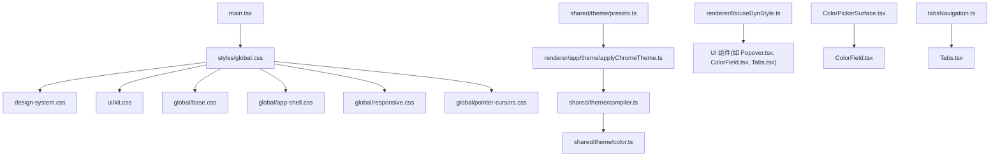
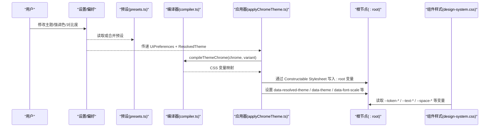
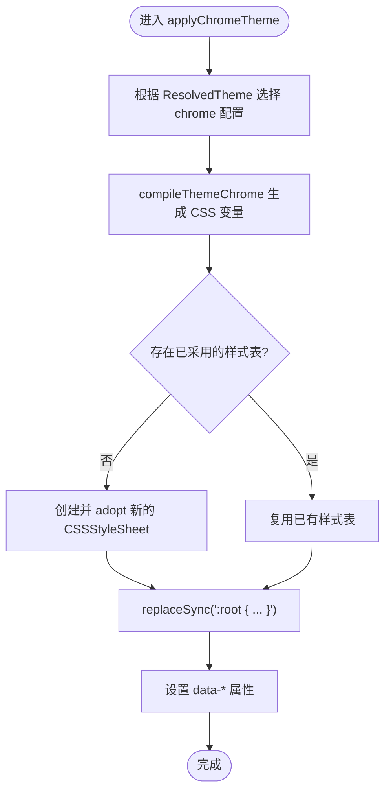
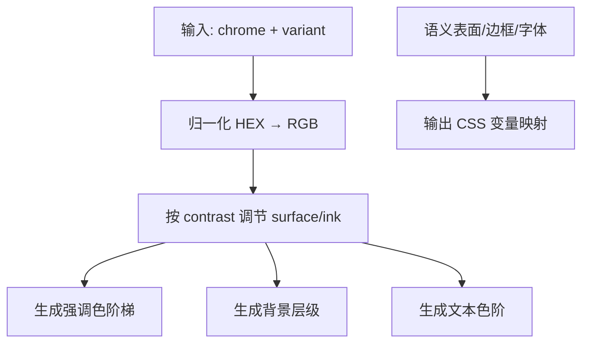
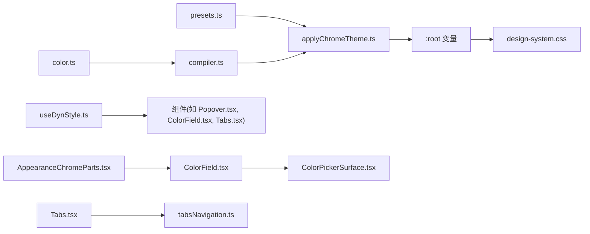

# 主题与样式系统

<cite>
**本文引用的文件**
- [applyChromeTheme.ts](file://src/renderer/app/theme/applyChromeTheme.ts)
- [compiler.ts](file://src/shared/theme/compiler.ts)
- [color.ts](file://src/shared/theme/color.ts)
- [presets.ts](file://src/shared/theme/presets.ts)
- [design-system.css](file://src/renderer/styles/design-system.css)
- [global.css](file://src/renderer/styles/global.css)
- [app-shell.css](file://src/renderer/styles/global/app-shell.css)
- [useDynStyle.ts](file://src/renderer/lib/useDynStyle.ts)
- [Popover.tsx](file://src/renderer/ui/Popover.tsx)
- [ColorField.tsx](file://src/renderer/ui/ColorField.tsx)
- [ColorField.css](file://src/renderer/ui/ColorField.css)
- [ColorPickerSurface.tsx](file://src/renderer/ui/ColorPickerSurface.tsx)
- [ColorPickerSurface.css](file://src/renderer/ui/ColorPickerSurface.css)
- [Tabs.tsx](file://src/renderer/ui/Tabs.tsx)
- [Tabs.css](file://src/renderer/ui/Tabs.css)
- [tabsNavigation.ts](file://src/renderer/ui/tabsNavigation.ts)
- [AppearanceChromeParts.tsx](file://src/renderer/features/settings/SettingsModal/sections/AppearanceChromeParts.tsx)
- [check-design-tokens.mjs](file://scripts/check-design-tokens.mjs)
- [design-system.md](file://docs/ui/design-system.md)
</cite>

## 更新摘要
**变更内容**
- 增强了 Light/Dark 模式支持，改进了主题应用函数的数据属性设置
- ColorField 组件提供了改进的颜色选择器功能和更好的可访问性支持
- Tabs 组件系统重构了实例ID管理和键盘导航逻辑
- 新增了完整的颜色选择器表面组件和导航功能

## 目录
1. [简介](#简介)
2. [项目结构](#项目结构)
3. [核心组件](#核心组件)
4. [架构总览](#架构总览)
5. [详细组件分析](#详细组件分析)
6. [依赖关系分析](#依赖关系分析)
7. [性能考虑](#性能考虑)
8. [故障排查指南](#故障排查指南)
9. [结论](#结论)
10. [附录](#附录)

## 简介
本文件系统化说明 RDC-Agent 的主题与样式体系，覆盖全局样式架构、CSS 变量与语义令牌（Design Tokens）体系、主题切换机制、应用壳层主题注入函数 applyChromeTheme 的实现原理与样式覆盖策略，以及组件样式规范、本地化支持、自定义主题开发指南、样式调试技巧与性能优化建议。同时解释响应式设计与移动端适配方案。

**更新** 本次更新重点增强了 Light/Dark 模式支持，改进了 ColorField 组件的颜色选择器功能和可访问性，并重构了 Tabs 组件的实例ID管理和键盘导航系统。

## 项目结构
- 样式入口与层级
  - 唯一全局入口：渲染进程 main.tsx → styles/global.css → design-system.css，并导入 UI Kit、基础样式、应用壳层、响应式与指针光标等模块。
  - 设计系统定义位于 design-system.css，包含原始色板、间距、圆角、排版、阴影、动画、工具类与"语义令牌层"。
  - 应用壳层样式在 global/app-shell.css 中，使用语义令牌构建三栏布局与标题栏。
- 主题编译与运行时注入
  - 共享主题编译器 shared/theme/compiler.ts 将 ThemeChromeConfig 编译为 CSS 自定义属性集合。
  - 渲染端 applyChromeTheme.ts 通过 Constructable Stylesheets 将 :root 变量注入文档，并设置 data-* 属性驱动主题状态。
- 预设与颜色计算
  - presets.ts 提供内置主题预设目录与默认值。
  - color.ts 提供 HEX/RGB/HSL 转换、对比度调节、调色板扩展等能力。
- 动态样式与 CSP 兼容
  - useDynStyle.ts 提供 React Hook 与命令式 API，统一通过 adoptedStyleSheets 写入动态样式，避免 inline style。
  - Popover.tsx 等组件使用 useDynStyle 进行定位等动态样式更新。
- 合规检查与设计规范
  - scripts/check-design-tokens.mjs 强制组件 CSS 仅引用语义令牌，禁止直接使用原始 token 或字面量。
  - docs/ui/design-system.md 明确令牌迁移规则、入口约束、CSP 要求与按钮系统等。

**图示来源**
- [global.css:5-11](file://src/renderer/styles/global.css#L5-L11)
- [applyChromeTheme.ts:1-53](file://src/renderer/app/theme/applyChromeTheme.ts#L1-L53)
- [compiler.ts:1-85](file://src/shared/theme/compiler.ts#L1-L85)
- [color.ts:1-187](file://src/shared/theme/color.ts#L1-L187)
- [presets.ts:1-110](file://src/shared/theme/presets.ts#L1-L110)
- [useDynStyle.ts:1-81](file://src/renderer/lib/useDynStyle.ts#L1-L81)
- [Popover.tsx:1-58](file://src/renderer/ui/Popover.tsx#L1-L58)
- [ColorField.tsx:1-118](file://src/renderer/ui/ColorField.tsx#L1-L118)
- [ColorPickerSurface.tsx:1-164](file://src/renderer/ui/ColorPickerSurface.tsx#L1-L164)
- [Tabs.tsx:1-93](file://src/renderer/ui/Tabs.tsx#L1-L93)
- [tabsNavigation.ts:1-14](file://src/renderer/ui/tabsNavigation.ts#L1-L14)

**章节来源**
- [global.css:5-11](file://src/renderer/styles/global.css#L5-L11)
- [design-system.css:1-800](file://src/renderer/styles/design-system.css#L1-L800)
- [app-shell.css:1-137](file://src/renderer/styles/global/app-shell.css#L1-L137)
- [design-system.md:98-117](file://docs/ui/design-system.md#L98-L117)

## 核心组件
- 主题编译与注入
  - compileThemeChrome：根据 ThemeChromeConfig 与 ResolvedTheme 生成 CSS 自定义属性，包括强调色、背景层级、文本色、边框、字体与语义表面等。
  - applyChromeTheme：选择当前主题配置，调用编译器生成变量，通过 Constructable Stylesheet 替换 :root 变量，并设置 data-* 属性以驱动样式分支。
- 预设与调色板
  - THEME_PRESET_CATALOG：内置多套主题预设，提供 light/dark 两套 chrome 配置。
  - color 工具：HEX/RGB/HSL 互转、相对亮度、对比度滑块调节、强调色与表面/墨色调色板扩展。
- 动态样式
  - useDynStyle/assignDynStyle：基于 adoptedStyleSheets 的声明式与命令式动态样式注入，满足严格 CSP 要求。
- 设计令牌与规范
  - design-system.css 中的语义令牌层：--token-* 命名空间，供组件使用；禁止在组件 CSS 中使用原始 --color-* 或字面量。
  - check-design-tokens.mjs：CI 级令牌合规检查，限制违规引用。
- **新增** 颜色选择器组件
  - ColorField：增强的颜色选择器组件，支持网格和行内布局，提供更好的可访问性支持。
  - ColorPickerSurface：自绘制的饱和度×明度平面加色相轨道的颜色选择器。
- **新增** 标签页组件增强
  - Tabs：重构的标签页组件，使用 useId 管理实例ID，支持键盘导航和分段变体。
  - tabsNavigation：专门的键盘导航解析函数，处理箭头键、Home/End 键的标签页切换。

**章节来源**
- [applyChromeTheme.ts:15-52](file://src/renderer/app/theme/applyChromeTheme.ts#L15-L52)
- [compiler.ts:23-77](file://src/shared/theme/compiler.ts#L23-L77)
- [color.ts:17-187](file://src/shared/theme/color.ts#L17-L187)
- [presets.ts:25-110](file://src/shared/theme/presets.ts#L25-L110)
- [useDynStyle.ts:35-81](file://src/renderer/lib/useDynStyle.ts#L35-81)
- [design-system.css:752-800](file://src/renderer/styles/design-system.css#L752-L800)
- [check-design-tokens.mjs:1-48](file://scripts/check-design-tokens.mjs#L1-L48)
- [ColorField.tsx:8-118](file://src/renderer/ui/ColorField.tsx#L8-L118)
- [ColorPickerSurface.tsx:9-164](file://src/renderer/ui/ColorPickerSurface.tsx#L9-L164)
- [Tabs.tsx:6-93](file://src/renderer/ui/Tabs.tsx#L6-L93)
- [tabsNavigation.ts:1-14](file://src/renderer/ui/tabsNavigation.ts#L1-L14)

## 架构总览
主题系统由"配置→编译→注入→消费"四层构成：
- 配置层：UiPreferences.theme + chromeThemes.light/dark，来自用户设置；presets.ts 提供默认预设。
- 编译层：compiler.ts 将配置转换为 CSS 变量集合，处理对比度、调色板扩展与语义表面。
- 注入层：applyChromeTheme.ts 将变量写入 :root，并通过 data-* 暴露主题状态。
- 消费层：design-system.css 与组件 CSS 通过 --token-* 与 --text-*/--space-* 等语义变量消费主题。

**图示来源**
- [presets.ts:25-110](file://src/shared/theme/presets.ts#L25-L110)
- [compiler.ts:23-77](file://src/shared/theme/compiler.ts#L23-L77)
- [applyChromeTheme.ts:15-52](file://src/renderer/app/theme/applyChromeTheme.ts#L15-L52)
- [design-system.css:752-800](file://src/renderer/styles/design-system.css#L752-L800)

## 详细组件分析

### 主题应用函数 applyChromeTheme
- 职责
  - 根据当前 ResolvedTheme 从 UiPreferences.chromeThemes 中选择 light/dark 配置。
  - 调用编译器生成 CSS 变量，并以 Constructable Stylesheet 的形式一次性替换 :root 变量。
  - 设置 documentElement 的 data-* 属性，驱动样式分支（如浅色/深色、字体缩放、减少动效、指针光标）。
- 实现要点
  - ensureChromeSheet：懒创建并持久化一个 CSSStyleSheet，加入 document.adoptedStyleSheets。
  - replaceSync：原子替换，避免闪烁与中间态。
  - 不直接操作 element.style，确保 CSP 安全。
- 样式覆盖策略
  - 通过 :root 变量优先级覆盖默认值；light/dark 分支在 design-system.css 中以 data 属性选择器覆盖特定变量。
  - 语义令牌层（--token-*）作为稳定消费点，组件无需感知底层原始色板变化。
- **更新** 改进了数据属性设置，现在设置 chromePreset、resolvedTheme、theme、fontScale、pointerCursors、reduceMotion 等多个数据属性。

**图示来源**
- [applyChromeTheme.ts:6-52](file://src/renderer/app/theme/applyChromeTheme.ts#L6-L52)
- [compiler.ts:23-77](file://src/shared/theme/compiler.ts#L23-L77)

**章节来源**
- [applyChromeTheme.ts:15-52](file://src/renderer/app/theme/applyChromeTheme.ts#L15-L52)

### 主题编译器 compiler.ts
- 输入：ThemeChromeConfig（accent/surface/ink/fonts/contrast）+ ResolvedTheme
- 输出：CompiledChromeCssVars（键为 CSS 变量名，值为 rgb triplet 或表达式）
- 关键逻辑
  - 归一化 HEX 颜色，解析为 RGB。
  - 根据 contrast 滑块调整 surface/ink 分离度。
  - 生成强调色阶梯、背景层级、文本色阶、边框与语义表面。
  - 注入字体变量与 light/dark 差异化的边框与表面。
- 复杂度
  - 线性遍历调色板条目，时间复杂度 O(n)，n 为调色板步数（常数级）。
  - 无 DOM 操作，纯函数，易于测试与缓存。

**图示来源**
- [compiler.ts:23-77](file://src/shared/theme/compiler.ts#L23-L77)
- [color.ts:100-187](file://src/shared/theme/color.ts#L100-L187)

**章节来源**
- [compiler.ts:23-77](file://src/shared/theme/compiler.ts#L23-L77)

### 预设与调色板 presets.ts / color.ts
- 预设目录
  - 内置多套主题（rdc、absolutely、ayu、catppuccin、dracula、everforest、github、gruvbox、linear），每套提供 light/dark 的 chrome 配置。
  - 提供 getThemePreset/getPresetChrome/createDefaultChromeThemes 等工具。
- 调色板工具
  - 强调色阶梯 scaleAccentPalette：基于 HSL 生成 50–900 色阶。
  - 表面/墨色阶梯 scaleSurfacePalette/scaleInkPalette：根据明暗模式生成不同灰阶。
  - 对比度调节 applyContrastPair：围绕中心对比度（默认 45）平滑调整表面与墨色分离度。
  - 颜色转换与相对亮度计算，用于可访问性保障。

**章节来源**
- [presets.ts:25-110](file://src/shared/theme/presets.ts#L25-L110)
- [color.ts:17-187](file://src/shared/theme/color.ts#L17-L187)

### 设计令牌与组件样式规范
- 三层令牌架构
  - 原始层：--color-bg-*, --color-accent-* 等，仅在 token 定义层使用。
  - 语义层：--token-*，表达意图（背景、边框、文本、交互态等）。
  - 组件层：--btn-*, --input-*, --card-* 等，限定于组件内部。
- 规则
  - 组件 CSS 必须引用语义令牌，禁止直接使用原始令牌或十六进制字面量。
  - 字号使用 --text-*，间距使用 --space-*，禁止硬编码像素值。
  - 边框 token 已含 alpha，禁止再追加额外 alpha。
- 合规检查
  - check-design-tokens.mjs 扫描 CSS，锁定债务基线，只允许减少违规。

**章节来源**
- [design-system.css:752-800](file://src/renderer/styles/design-system.css#L752-L800)
- [design-system.md:45-117](file://docs/ui/design-system.md#L45-L117)
- [check-design-tokens.mjs:1-48](file://scripts/check-design-tokens.mjs#L1-L48)

### 动态样式与 CSP 兼容
- useDynStyle
  - 通过 React Hook 收集声明，批量写入单一 CSSStyleSheet，避免多次重排。
  - 返回 data-dyn-style 属性，供选择器匹配。
- assignDynStyle/clearDynStyle
  - 命令式接口，用于测量与自适应场景（如 textarea 自动高度、画布尺寸）。
- 组件示例
  - Popover 使用 useDynStyle 动态设置 left/top 定位，保证在视口边界内显示。

**章节来源**
- [useDynStyle.ts:35-81](file://src/renderer/lib/useDynStyle.ts#L35-L81)
- [Popover.tsx:52-58](file://src/renderer/ui/Popover.tsx#L52-L58)

### **新增** ColorField 颜色选择器组件
- 功能特性
  - 支持网格和行内两种布局模式，适应不同的界面需求。
  - 集成 ColorPickerSurface 提供直观的 HSV 颜色选择体验。
  - 实时预览当前选中的颜色，显示十六进制值。
  - 支持键盘导航和屏幕阅读器，提供良好的可访问性。
- 可访问性改进
  - 使用 aria-labelledby 关联标签和控件。
  - 为颜色选择区域提供有意义的 aria-label。
  - 支持焦点可见性和键盘操作。
- 样式定制
  - 通过 CSS 变量支持主题化和样式定制。
  - 响应式设计，在小屏幕上自动调整布局。

**章节来源**
- [ColorField.tsx:8-118](file://src/renderer/ui/ColorField.tsx#L8-L118)
- [ColorField.css:1-187](file://src/renderer/ui/ColorField.css#L1-L187)

### **新增** ColorPickerSurface 颜色选择器表面
- 核心功能
  - 自绘制的饱和度×明度平面，支持鼠标拖拽和键盘精确控制。
  - 独立的色相轨道，支持点击和拖拽选择色相。
  - 保持色相稳定性，即使在纯黑/纯白时也能维持用户选择的色相。
- 交互设计
  - 支持指针事件，提供流畅的拖拽体验。
  - 键盘导航：方向键微调，Shift+方向键粗调。
  - 触摸设备友好，支持触摸操作。
- 技术实现
  - 使用 HSV 颜色模型进行颜色计算。
  - 通过 useDynStyle 动态更新 CSS 变量，避免重新渲染。
  - 精确的颜色拾取算法，确保用户体验的一致性。

**章节来源**
- [ColorPickerSurface.tsx:9-164](file://src/renderer/ui/ColorPickerSurface.tsx#L9-L164)
- [ColorPickerSurface.css:1-71](file://src/renderer/ui/ColorPickerSurface.css#L1-L71)

### **新增** Tabs 标签页组件重构
- 实例ID管理
  - 使用 React.useId() 自动生成唯一的实例ID，避免重复ID冲突。
  - 每个标签和面板都有基于实例ID的唯一标识符。
  - 支持多个 Tabs 实例在同一页面中独立工作。
- 键盘导航增强
  - 实现了专门的 resolveTabNavigation 函数处理键盘事件。
  - 支持左右箭头键在标签间导航。
  - 支持 Home/End 键跳转到第一个/最后一个可用标签。
  - 智能跳过禁用状态的标签。
- 可访问性改进
  - 正确的 ARIA 角色和属性设置。
  - 焦点管理，确保合适的初始焦点位置。
  - 屏幕阅读器友好的标签描述。

**章节来源**
- [Tabs.tsx:6-93](file://src/renderer/ui/Tabs.tsx#L6-L93)
- [Tabs.css:1-88](file://src/renderer/ui/Tabs.css#L1-L88)
- [tabsNavigation.ts:1-14](file://src/renderer/ui/tabsNavigation.ts#L1-L14)

### 响应式设计与移动端适配
- 全局入口引入 responsive.css，配合 app-shell.css 的网格布局与最小宽度约束。
- 字体缩放通过 data-font-scale 切换 --text-* 变量，提升可读性与触控友好性。
- 减少动效通过 prefers-reduced-motion 与 data-reduce-motion 双重控制，兼顾无障碍与性能。
- **新增** ColorField 组件支持响应式布局，在小屏幕上自动调整为单列布局。

**章节来源**
- [global.css:5-11](file://src/renderer/styles/global.css#L5-L11)
- [app-shell.css:97-137](file://src/renderer/styles/global/app-shell.css#L97-L137)
- [design-system.css:301-323](file://src/renderer/styles/design-system.css#L301-L323)
- [design-system.css:455-471](file://src/renderer/styles/design-system.css#L455-L471)
- [ColorField.css:124-129](file://src/renderer/ui/ColorField.css#L124-L129)

## 依赖关系分析
- 模块耦合
  - applyChromeTheme 依赖 compiler 与 presets；compiler 依赖 color 工具。
  - design-system.css 作为消费层，依赖 :root 变量与 data-* 状态。
  - 组件通过 useDynStyle 与主题变量解耦，保持高内聚低耦合。
- 外部依赖
  - 浏览器 API：document.adoptedStyleSheets、CSSStyleSheet.replaceSync。
  - 构建产物：UI Kit、基础样式、响应式样式与应用壳层样式。
- **新增** 组件依赖
  - ColorField 依赖 ColorPickerSurface 和 Popover 组件。
  - Tabs 依赖 tabsNavigation 模块处理键盘导航。
  - AppearanceChromeParts 使用 ColorField 进行主题颜色编辑。

**图示来源**
- [presets.ts:25-110](file://src/shared/theme/presets.ts#L25-L110)
- [compiler.ts:23-77](file://src/shared/theme/compiler.ts#L23-L77)
- [color.ts:17-187](file://src/shared/theme/color.ts#L17-L187)
- [applyChromeTheme.ts:15-52](file://src/renderer/app/theme/applyChromeTheme.ts#L15-L52)
- [design-system.css:752-800](file://src/renderer/styles/design-system.css#L752-L800)
- [useDynStyle.ts:35-81](file://src/renderer/lib/useDynStyle.ts#L35-L81)
- [Popover.tsx:52-58](file://src/renderer/ui/Popover.tsx#L52-L58)
- [ColorField.tsx:1-118](file://src/renderer/ui/ColorField.tsx#L1-L118)
- [ColorPickerSurface.tsx:1-164](file://src/renderer/ui/ColorPickerSurface.tsx#L1-L164)
- [Tabs.tsx:1-93](file://src/renderer/ui/Tabs.tsx#L1-L93)
- [tabsNavigation.ts:1-14](file://src/renderer/ui/tabsNavigation.ts#L1-L14)
- [AppearanceChromeParts.tsx:1-198](file://src/renderer/features/settings/SettingsModal/sections/AppearanceChromeParts.tsx#L1-L198)

**章节来源**
- [applyChromeTheme.ts:15-52](file://src/renderer/app/theme/applyChromeTheme.ts#L15-L52)
- [compiler.ts:23-77](file://src/shared/theme/compiler.ts#L23-L77)
- [design-system.css:752-800](file://src/renderer/styles/design-system.css#L752-L800)

## 性能考虑
- 样式注入
  - 使用 Constructable Stylesheets 与 replaceSync 原子更新，减少重绘与回流。
  - 集中管理动态样式，避免频繁插入/删除 style 标签。
- 变量计算
  - 编译器为纯函数，可在需要时缓存结果；颜色转换与调色板扩展开销极低。
- 可访问性与动效
  - 尊重 prefers-reduced-motion 与 data-reduce-motion，禁用不必要动画以提升低端设备性能。
- 令牌合规
  - CI 令牌检查防止回归，降低后期维护成本。
- **新增** 组件性能优化
  - ColorPickerSurface 使用 useDynStyle 避免不必要的重渲染。
  - Tabs 组件使用 useRef 管理标签引用，提高键盘导航性能。
  - ColorField 组件通过状态管理优化颜色输入的响应性。

## 故障排查指南
- 主题未生效
  - 确认 applyChromeTheme 是否被调用且传入正确的 ResolvedTheme 与 UiPreferences。
  - 检查 :root 是否包含 data-resolved-theme、data-theme、data-font-scale 等属性。
- CSP 报错
  - 确保没有使用 <style>.textContent 或 element.style 注入；改用 adoptedStyleSheets 与 useDynStyle。
- 令牌违规
  - 运行 check-design-tokens.mjs，修复组件 CSS 中对原始令牌或字面量的引用。
- 视觉异常
  - 检查 contrast 滑块是否导致 surface/ink 对比度过低；必要时调整 preset 或对比度参数。
  - 确认 semantic tokens 未被意外覆盖；优先使用 --token-*。
- **新增** 颜色选择器问题
  - 检查 ColorPickerSurface 的 HSV 颜色转换是否正确。
  - 验证键盘导航事件是否正确绑定和处理。
  - 确认颜色选择器的焦点管理和可访问性属性。
- **新增** Tabs 组件问题
  - 检查 useId 生成的实例ID是否唯一。
  - 验证键盘导航逻辑是否正确处理禁用标签。
  - 确认 ARIA 属性和角色设置是否符合无障碍标准。

**章节来源**
- [applyChromeTheme.ts:29-52](file://src/renderer/app/theme/applyChromeTheme.ts#L29-L52)
- [useDynStyle.ts:35-81](file://src/renderer/lib/useDynStyle.ts#L35-L81)
- [check-design-tokens.mjs:1-48](file://scripts/check-design-tokens.mjs#L1-L48)
- [design-system.md:98-117](file://docs/ui/design-system.md#L98-L117)
- [ColorPickerSurface.tsx:90-114](file://src/renderer/ui/ColorPickerSurface.tsx#L90-L114)
- [Tabs.tsx:44-50](file://src/renderer/ui/Tabs.tsx#L44-L50)

## 结论
本主题与样式系统通过"配置→编译→注入→消费"的分层架构，实现了可定制、可验证、高性能的界面外观体系。语义令牌层隔离了组件与底层色板，applyChromeTheme 以 CSP 友好的方式注入主题变量，配合预设与调色板工具，使主题切换与自定义变得简单可靠。动态样式机制进一步保证了复杂交互下的性能与一致性。遵循令牌规范与 CI 检查，可有效维持长期可维护性。

**更新** 本次更新显著增强了系统的可访问性和用户体验：
- 改进了 Light/Dark 模式支持，提供更稳定的主题切换体验
- 新增了完整的 ColorField 组件，提供直观的颜色选择和良好的可访问性
- 重构了 Tabs 组件，实现了更好的实例管理和键盘导航
- 所有新增组件都遵循了项目的可访问性标准和设计规范

## 附录

### 自定义主题开发指南
- 新增预设
  - 在 presets.ts 中添加新预设条目，提供 light/dark 的 chrome 配置（accent/surface/ink/fonts/contrast）。
  - 使用 createDefaultChromeThemes 或 getPresetChrome 获取默认配置进行扩展。
- 调整对比度
  - 通过 contrast 参数微调 surface/ink 分离度，确保可读性与美观性平衡。
- 校验与发布
  - 运行 check-design-tokens.mjs 确保无令牌违规。
  - 在 design-system.css 的语义令牌层补充必要的 --token-* 别名，便于组件消费。
- **新增** 颜色选择器定制
  - 可以通过 CSS 变量自定义 ColorField 的外观和行为。
  - 利用 ColorPickerSurface 的 HSV 模型进行高级颜色操作。
- **新增** Tabs 组件扩展
  - 可以使用 variant="segmented" 创建紧凑的单选控件。
  - 通过 CSS 变量自定义标签页的样式和行为。

**章节来源**
- [presets.ts:25-110](file://src/shared/theme/presets.ts#L25-L110)
- [check-design-tokens.mjs:1-48](file://scripts/check-design-tokens.mjs#L1-L48)
- [design-system.css:752-800](file://src/renderer/styles/design-system.css#L752-L800)
- [ColorField.css:1-187](file://src/renderer/ui/ColorField.css#L1-L187)
- [Tabs.css:1-88](file://src/renderer/ui/Tabs.css#L1-L88)

### 样式调试技巧
- 查看 :root 变量
  - 在浏览器开发者工具中检查 :root 的 CSS 变量，确认 applyChromeTheme 是否正确注入。
- 动态样式
  - 使用 useDynStyle 返回的 data-dyn-style 属性定位动态样式块，便于调试定位问题。
- 令牌合规
  - 利用 check-design-tokens.mjs 快速定位违规引用，逐步清理历史债务。
- **新增** 颜色选择器调试
  - 检查 ColorPickerSurface 的 HSV 状态是否正确同步。
  - 验证颜色选择器的键盘事件处理和焦点管理。
  - 使用浏览器开发者工具的无障碍检查工具验证可访问性。
- **新增** Tabs 组件调试
  - 检查实例ID生成是否正确，避免ID冲突。
  - 验证键盘导航逻辑，确保箭头键和 Home/End 键正常工作。
  - 使用无障碍工具检查 ARIA 属性的正确性。

**章节来源**
- [applyChromeTheme.ts:29-52](file://src/renderer/app/theme/applyChromeTheme.ts#L29-L52)
- [useDynStyle.ts:35-81](file://src/renderer/lib/useDynStyle.ts#L35-L81)
- [check-design-tokens.mjs:1-48](file://scripts/check-design-tokens.mjs#L1-L48)
- [ColorPickerSurface.tsx:90-114](file://src/renderer/ui/ColorPickerSurface.tsx#L90-L114)
- [Tabs.tsx:44-50](file://src/renderer/ui/Tabs.tsx#L44-L50)

### 本地化支持
- 上下文菜单等 UI 通过 i18n 钩子加载文案，与主题系统解耦。
- 主题变量与令牌不受语言影响，确保跨语言一致的外观体验。
- **新增** 颜色选择器和标签页组件支持国际化
  - ColorField 和 ColorPickerSurface 通过 props 接收本地化标签。
  - Tabs 组件支持可访问性的本地化描述。

**章节来源**
- [useAppContextMenu.ts:20-36](file://src/renderer/hooks/useAppContextMenu.ts#L20-L36)
- [ColorField.tsx:18-23](file://src/renderer/ui/ColorField.tsx#L18-L23)
- [ColorPickerSurface.tsx:12-15](file://src/renderer/ui/ColorPickerSurface.tsx#L12-L15)
- [Tabs.tsx:20-21](file://src/renderer/ui/Tabs.tsx#L20-L21)