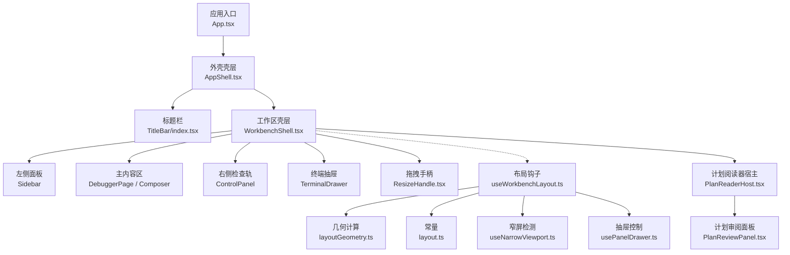
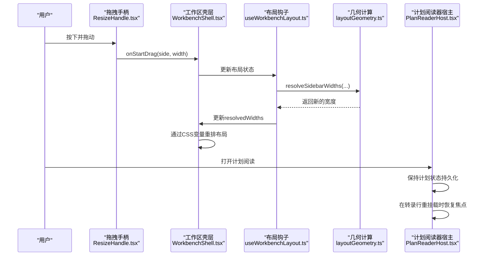
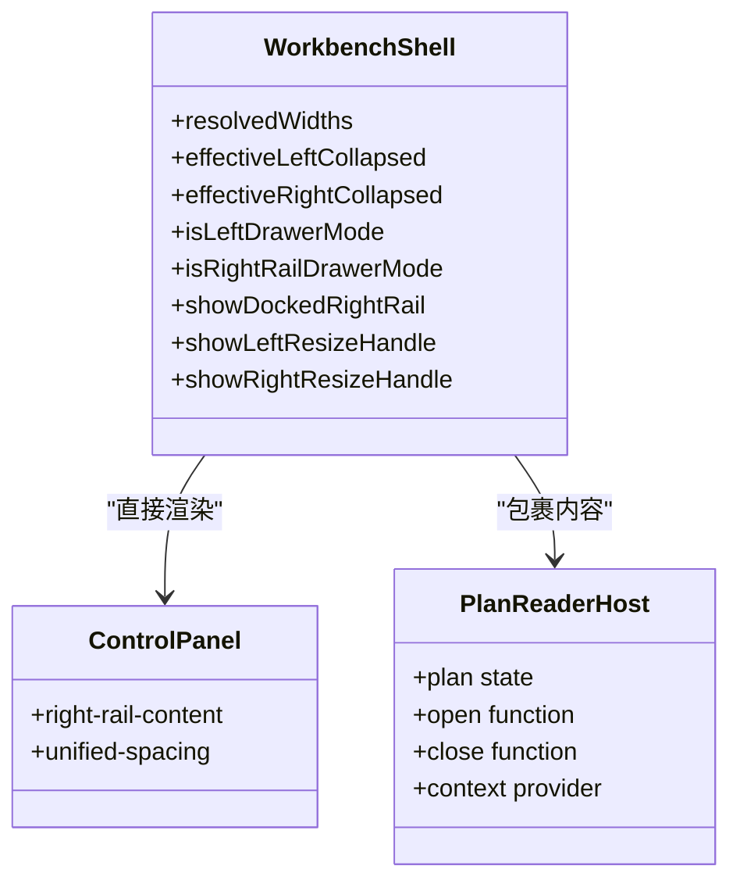
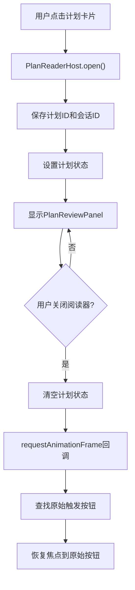
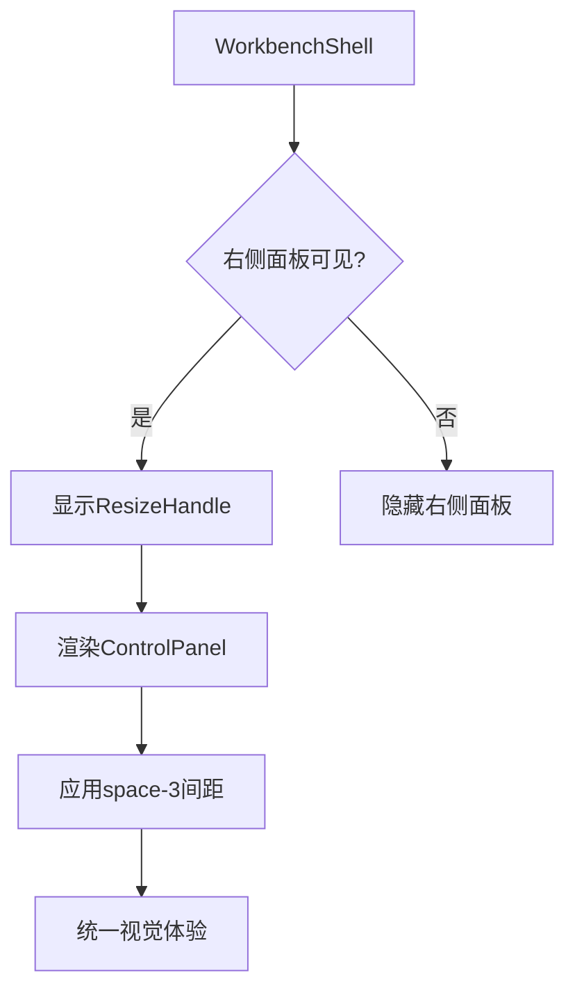
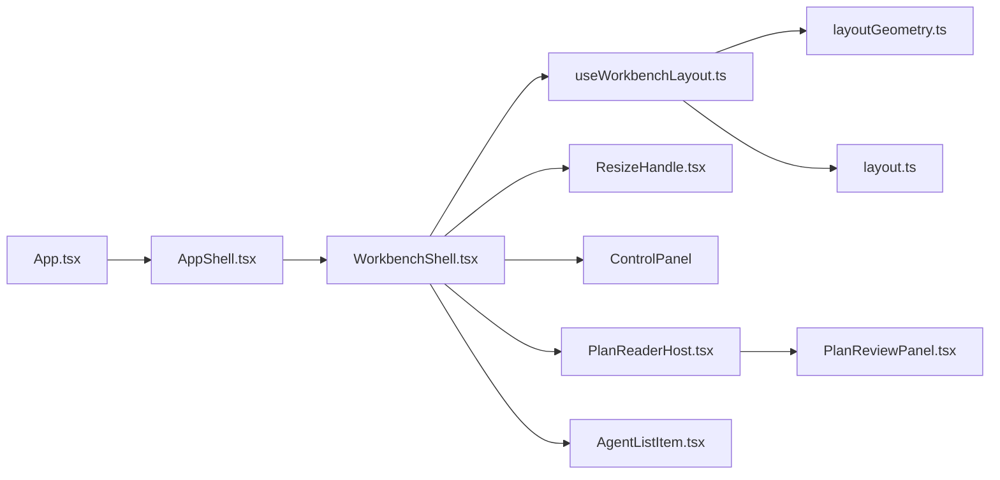

# 工作台界面

<cite>
**本文引用的文件**
- [WorkbenchShell.tsx](file://src/renderer/app/WorkbenchShell.tsx)
- [useWorkbenchLayout.ts](file://src/renderer/app/useWorkbenchLayout.ts)
- [usePanelDrawer.ts](file://src/renderer/app/usePanelDrawer.ts)
- [useNarrowViewport.ts](file://src/renderer/app/useNarrowViewport.ts)
- [AppShell.css](file://src/renderer/shell/AppShell.css)
- [app-shell.css](file://src/renderer/styles/global/app-shell.css)
- [RightRail.css](file://src/renderer/features/right-rail/RightRail.css)
- [layout.ts](file://src/shared/constants/layout.ts)
- [ResizeHandle.tsx](file://src/renderer/shell/ResizeHandle.tsx)
- [PlanReaderHost.tsx](file://src/renderer/features/transcript/PlanReaderHost.tsx)
- [PlanReviewPanel.tsx](file://src/renderer/features/transcript/PlanReviewPanel.tsx)
- [AgentListItem.tsx](file://src/renderer/features/settings/SettingsModal/sections/AgentListItem.tsx)
- [AgentListItem.css](file://src/renderer/features/settings/SettingsModal/sections/AgentListItem.css)
</cite>

## 更新摘要
**变更内容**
- 增强 PlanReaderHost 提供计划阅读上下文持久化，确保在转录交互期间保持计划阅读状态
- 改进用户菜单紧凑模式支持和 AgentList 项目比例优化
- 右侧面板重构：移除 PanelZone 包装器，直接在 WorkbenchShell 中管理 resize 状态
- 统一间距系统：所有 rail 侧边使用 space-3 padding 解决视觉不一致问题

## 目录
1. [简介](#简介)
2. [项目结构](#项目结构)
3. [核心组件](#核心组件)
4. [架构总览](#架构总览)
5. [详细组件分析](#详细组件分析)
6. [依赖关系分析](#依赖关系分析)
7. [性能考量](#性能考量)
8. [故障排查指南](#故障排查指南)
9. [结论](#结论)
10. [附录](#附录)

## 简介
本文件面向 RDC-Agent 工作台界面的设计与实现，聚焦主工作区布局、面板管理机制与响应式适配；详解 AppShell 组件的标题栏、侧边栏、内容区域与状态通知的组织方式；说明面板拖拽调整大小、动态布局切换（停靠/抽屉）与多窗口管理；并提供主题定制、样式覆盖方法与可访问性支持要点，以及常见布局场景的配置示例与最佳实践。

**更新** 本次更新重点反映了以下改进：PlanReaderHost 现在提供持久的计划阅读上下文，确保在转录交互期间保持计划阅读状态；用户菜单紧凑模式支持得到改善；AgentList 项目比例得到优化；同时继续包含之前对右侧面板的重构和间距系统的改进。

## 项目结构
工作台由"外壳 + 工作区"两层组成：
- 外壳层：AppShell 提供容器与 overlays（用户菜单、设置、知识中心、命令面板、通知等）。
- 工作区层：WorkbenchShell 组织左侧导航、右侧检查轨、主内容与底部输入栏，并处理拖拽与响应式行为。
- 布局逻辑：useWorkbenchLayout 负责尺寸计算、折叠/展开、抽屉模式切换与持久化；layoutGeometry 提供响应式宽度与最小主区域约束；常量 layout.ts 定义尺寸边界与断点。
- **新增** PlanReaderHost 作为计划阅读器的宿主组件，提供跨转录行重挂载的持久化上下文。

**图表来源**
- [WorkbenchShell.tsx:147-236](file://src/renderer/app/WorkbenchShell.tsx#L147-L236)
- [useWorkbenchLayout.ts:24-209](file://src/renderer/app/useWorkbenchLayout.ts#L24-L209)
- [PlanReaderHost.tsx:9-32](file://src/renderer/features/transcript/PlanReaderHost.tsx#L9-L32)
- [layout.ts:1-43](file://src/shared/constants/layout.ts#L1-L43)

## 核心组件
- WorkbenchShell：主工作区布局，包含左侧导航、右侧检查轨、主内容区、底部输入栏与终端抽屉；通过 CSS 变量与类名驱动不同布局态。**更新** 现在直接管理右侧面板的resize状态，不再依赖PanelZone包装器，并集成了PlanReaderHost。
- ResizeHandle：拖拽手柄，触发 onDragStart 并读取相邻面板初始宽度。
- useWorkbenchLayout：布局中枢，维护 appBody 尺寸、折叠态、抽屉模式、拖拽调整、响应式计算与持久化。
- RightRail：右侧检查轨组件，使用统一的space-3间距系统确保视觉一致性。
- PlanReaderHost：计划阅读器宿主组件，提供跨转录行重挂载的持久化计划阅读上下文。
- AgentListItem：设置模态框中的代理列表项，具有优化的比例和紧凑模式支持。
- AppShell：最外层容器，承载 titleBar、body、overlays，用于统一注入全局覆盖层。

**章节来源**
- [WorkbenchShell.tsx:17-46](file://src/renderer/app/WorkbenchShell.tsx#L17-L46)
- [ResizeHandle.tsx:3-7](file://src/renderer/shell/ResizeHandle.tsx#L3-L7)
- [useWorkbenchLayout.ts:24-209](file://src/renderer/app/useWorkbenchLayout.ts#L24-L209)
- [RightRail.css:1-13](file://src/renderer/features/right-rail/RightRail.css#L1-L13)
- [PlanReaderHost.tsx:9-32](file://src/renderer/features/transcript/PlanReaderHost.tsx#L9-L32)
- [AgentListItem.tsx:18-39](file://src/renderer/features/settings/SettingsModal/sections/AgentListItem.tsx#L18-L39)

## 架构总览
工作台采用"壳层 + 内容"分层：
- 壳层（AppShell）：固定结构，保证全局覆盖层一致性与可组合性。
- 工作区（WorkbenchShell）：以 Flex/Grid 布局组织左右面板与主内容，使用 CSS 变量控制宽度与可见性。**更新** 现在直接在组件内部管理右侧面板的resize状态，简化了组件层次结构，并集成了PlanReaderHost。
- 布局引擎（useWorkbenchLayout + layoutGeometry）：基于容器宽度与面板配置，自动决定折叠/展开、停靠/抽屉模式，并在拖拽时实时重算。
- 常量与断点（layout.ts）：集中管理最小/最大宽度、默认值与断点阈值，确保跨组件一致性。
- **新增** 计划阅读上下文（PlanReaderHost）：提供跨组件的计划阅读状态管理，确保在转录行重挂载时保持阅读状态。

**图表来源**
- [WorkbenchShell.tsx:79-89](file://src/renderer/app/WorkbenchShell.tsx#L79-L89)
- [useWorkbenchLayout.ts:121-187](file://src/renderer/app/useWorkbenchLayout.ts#L121-L187)
- [PlanReaderHost.tsx:12-25](file://src/renderer/features/transcript/PlanReaderHost.tsx#L12-L25)

## 详细组件分析

### WorkbenchShell 组件架构
- 职责：主工作区布局容器，直接管理右侧面板的resize状态和显示逻辑。
- **更新** 移除了PanelZone包装器，直接在组件内处理右侧面板的渲染和resize手柄逻辑，并集成了PlanReaderHost作为计划阅读上下文提供者。
- 布局结构：左侧导航（可折叠/抽屉）、主内容区（含设备选择器、活动提示、底部输入栏）、右侧检查轨（可折叠/抽屉）、终端抽屉。
- 样式管理：通过useDynStyle设置CSS变量控制面板宽度和resize手柄显示。

**图表来源**
- [WorkbenchShell.tsx:18-47](file://src/renderer/app/WorkbenchShell.tsx#L18-L47)
- [WorkbenchShell.tsx:207-227](file://src/renderer/app/WorkbenchShell.tsx#L207-L227)
- [PlanReaderHost.tsx:9-32](file://src/renderer/features/transcript/PlanReaderHost.tsx#L9-L32)

**章节来源**
- [WorkbenchShell.tsx:49-89](file://src/renderer/app/WorkbenchShell.tsx#L49-L89)
- [WorkbenchShell.tsx:207-227](file://src/renderer/app/WorkbenchShell.tsx#L207-L227)

### 计划阅读器宿主增强
- **新功能**：PlanReaderHost 提供跨转录行重挂载的持久化计划阅读上下文。
- 状态管理：使用 useState 管理当前计划，useRef 跟踪原始触发器信息。
- 焦点恢复：关闭阅读器后自动将焦点恢复到原始的触发按钮，提升用户体验。
- 会话验证：在关闭时验证当前会话是否与打开时的会话一致，避免跨会话的状态污染。

**图表来源**
- [PlanReaderHost.tsx:12-25](file://src/renderer/features/transcript/PlanReaderHost.tsx#L12-L25)

**章节来源**
- [PlanReaderHost.tsx:9-32](file://src/renderer/features/transcript/PlanReaderHost.tsx#L9-L32)
- [PlanReaderHost.test.ts:12-38](file://src/renderer/features/transcript/PlanReaderHost.test.ts#L12-L38)

### 右侧面板重构与间距系统
- **重构内容**：移除了PanelZone包装器组件，直接在WorkbenchShell中管理右侧面板的resize状态。
- **间距统一**：右侧检查轨使用统一的space-3 padding，确保与左侧面板和其他UI元素的一致性。
- **结构简化**：右侧面板现在直接渲染ControlPanel组件，减少了不必要的DOM层级。
- **样式优化**：RightRail.css定义了统一的间距系统，包括gap: var(--space-3)和padding: var(--space-3)。

**图表来源**
- [WorkbenchShell.tsx:207-227](file://src/renderer/app/WorkbenchShell.tsx#L207-L227)
- [RightRail.css:1-13](file://src/renderer/features/right-rail/RightRail.css#L1-L13)

**章节来源**
- [WorkbenchShell.tsx:207-227](file://src/renderer/app/WorkbenchShell.tsx#L207-L227)
- [RightRail.css:1-13](file://src/renderer/features/right-rail/RightRail.css#L1-L13)

### AgentList 项目比例优化
- **改进内容**：AgentListItem 组件获得了更好的比例和紧凑模式支持。
- 视觉设计：使用 ModeGlyph 图标，配合 OverflowFade 处理长描述文本。
- 响应式布局：通过 CSS 变量控制间距和尺寸，确保在不同屏幕尺寸下的良好显示。
- 可访问性：为图标添加 aria-hidden 属性，为名称添加 title 属性提供完整信息。

**章节来源**
- [AgentListItem.tsx:18-39](file://src/renderer/features/settings/SettingsModal/sections/AgentListItem.tsx#L18-L39)
- [AgentListItem.css:1-41](file://src/renderer/features/settings/SettingsModal/sections/AgentListItem.css#L1-L41)

### 主工作区布局与响应式
- 布局结构：左侧导航（可折叠/抽屉）、主内容区（含设备选择器、活动提示、底部输入栏）、右侧检查轨（可折叠/抽屉）、终端抽屉。
- 响应式策略：
  - 使用 ResizeObserver 与 window resize 同步容器宽度。
  - 根据容器宽度与面板配置，调用 resolveResponsiveSidebarState 决定是否折叠左右面板。
  - 当右侧检查轨在窄屏或自动折叠时进入抽屉模式；左侧导航在小屏或自动折叠时也进入抽屉模式。
  - 通过 CSS 变量 --left-sidebar-width、--right-panel-width、--left-resize-handle-width、--right-resize-handle-width、--workbench-rail-max-width、--workbench-inline-mode 驱动布局。
- 宽度计算：resolveSidebarWidths 在可用空间不足时优先缩减一侧，再回退到另一侧，确保不突破最小主区域与面板最小宽度限制。

**章节来源**
- [useWorkbenchLayout.ts:24-209](file://src/renderer/app/useWorkbenchLayout.ts#L24-L209)
- [app-shell.css:95-111](file://src/renderer/styles/global/app-shell.css#L95-L111)

### 面板拖拽与动态布局切换
- 拖拽流程：
  - 用户在 ResizeHandle 上按下，记录起始位置与面板初始宽度。
  - 监听 pointermove，根据移动距离与最小主区域、手柄宽度、对侧面板宽度，计算新宽度并写入布局存储。
  - 释放指针后清除拖拽状态并持久化布局。
- **更新** 右侧面板的resize状态现在直接在WorkbenchShell中管理，不再通过PanelZone传递。
- 动态切换：
  - 根据 isRightRailDrawerViewport 与自动折叠结果，右侧检查轨在窄屏或自动折叠时切换为抽屉。
  - 左侧导航在小屏或自动折叠时切换为抽屉。
  - 切换过程中保持面板内容不被卸载（keepMounted），提升交互流畅度。

**章节来源**
- [WorkbenchShell.tsx:79-89](file://src/renderer/app/WorkbenchShell.tsx#L79-L89)
- [useWorkbenchLayout.ts:121-187](file://src/renderer/app/useWorkbenchLayout.ts#L121-L187)

### 多窗口管理与状态栏
- 窗口控制：TitleBar 提供最小化、最大化/还原、关闭按钮，并通过 useWindowControls 桥接原生窗口能力。
- 状态提示：
  - 顶部 shell-notice 作为临时状态提示，自动消失。
  - 终端按钮根据活动条目严重级别显示不同状态徽章（error/warning/running）。
- 可访问性：所有按钮均设置 aria-label 与 title，窗口控制组使用 role="group" 与 aria-label。

**章节来源**
- [WorkbenchShell.tsx:168-191](file://src/renderer/app/WorkbenchShell.tsx#L168-L191)

### 主题定制与样式覆盖
- 主题来源：应用启动时根据 settings.appearance.theme 与系统主题解析出 ResolvedTheme，并通过 AppProviders 注入上下文。
- 样式覆盖：
  - 通过 CSS 变量（如 --token-*）与自定义属性（--left-sidebar-width、--right-panel-width 等）进行主题与布局定制。
  - AppShell.css 定义了通知条、侧边栏底部按钮等基础样式，便于覆盖与扩展。
- **更新** 右侧面板现在使用统一的space-3间距系统，确保在不同主题下保持一致的视觉效果；AgentListItem 也采用了相同的间距系统。

**章节来源**
- [AppShell.css:1-69](file://src/renderer/shell/AppShell.css#L1-L69)
- [RightRail.css:1-13](file://src/renderer/features/right-rail/RightRail.css#L1-L13)
- [AgentListItem.css:1-41](file://src/renderer/features/settings/SettingsModal/sections/AgentListItem.css#L1-L41)

### 可访问性支持
- 语义化：标题栏使用 header，窗口控制组使用 role="group" 与 aria-label。
- 交互可达性：面板切换按钮具备 aria-label、title 与 disabled 态；终端按钮具备 aria-label 与 title。
- 状态播报：shell-notice 使用 role="status" 与 aria-live="polite" 播报状态变化。
- **新增** PlanReaderHost 在关闭阅读器后自动恢复焦点到原始触发按钮，确保键盘导航的连续性。

**章节来源**
- [WorkbenchShell.tsx:168-191](file://src/renderer/app/WorkbenchShell.tsx#L168-L191)
- [PlanReaderHost.tsx:16-25](file://src/renderer/features/transcript/PlanReaderHost.tsx#L16-L25)

## 依赖关系分析
- 组件耦合：
  - AppShell 仅负责容器与 overlays，低耦合高内聚。
  - WorkbenchShell 直接管理右侧面板的resize状态，减少了对PanelZone的依赖，并集成了PlanReaderHost。
  - useWorkbenchLayout 依赖 layoutGeometry 与常量 layout.ts，解耦具体数值与算法。
  - **新增** PlanReaderHost 作为独立的状态管理组件，被 WorkbenchShell 包裹使用。
- **更新** 右侧面板现在直接渲染ControlPanel，减少了组件间的通信开销；AgentListItem 使用了统一的间距系统和图标组件。
- 外部依赖：
  - 布局常量集中在 layout.ts，避免硬编码。
  - 窄屏检测与抽屉控制通过 useNarrowViewport 与 usePanelDrawer 抽象，便于测试与替换。

**图表来源**
- [WorkbenchShell.tsx:147-236](file://src/renderer/app/WorkbenchShell.tsx#L147-L236)
- [useWorkbenchLayout.ts:24-209](file://src/renderer/app/useWorkbenchLayout.ts#L24-L209)
- [PlanReaderHost.tsx:9-32](file://src/renderer/features/transcript/PlanReaderHost.tsx#L9-L32)
- [AgentListItem.tsx:18-39](file://src/renderer/features/settings/SettingsModal/sections/AgentListItem.tsx#L18-L39)

**章节来源**
- [WorkbenchShell.tsx:147-236](file://src/renderer/app/WorkbenchShell.tsx#L147-L236)
- [useWorkbenchLayout.ts:24-209](file://src/renderer/app/useWorkbenchLayout.ts#L24-L209)

## 性能考量
- 响应式计算：
  - 使用 useMemo 缓存响应式折叠态与宽度，减少重复计算。
  - ResizeObserver 与 window resize 事件合并更新容器宽度，避免频繁重排。
- 拖拽性能：
  - 拖拽期间仅更新布局存储与 CSS 变量，避免整树重渲染。
  - **更新** 移除PanelZone包装器减少了DOM层级，提升了拖拽性能。
- 内存与生命周期：
  - 监听器在组件卸载时移除，防止内存泄漏。
  - 抽屉模式 keepMounted 避免频繁创建销毁带来的开销。
- **更新** 统一的间距系统减少了样式计算复杂度，提升了渲染性能；PlanReaderHost 使用 useRef 避免不必要的重新渲染。
- **新增** PlanReaderHost 的状态管理优化：使用 useCallback 缓存 open/close 函数，避免子组件不必要的重新渲染。

## 故障排查指南
- 面板无法拖拽：
  - 检查手柄是否被禁用（collapsed 或 rightVisible=false）。
  - 确认 onPointerDown 已绑定且有效。
  - **更新** 检查WorkbenchShell中的showRightResizeHandle逻辑是否正确。
- 布局异常：
  - 检查容器宽度是否为正数，ResizeObserver 是否正确观察 appBodyRef。
  - 验证常量 LEFT_SIDEBAR_MIN_WIDTH、RIGHT_PANEL_MIN_WIDTH、APP_MIN_MAIN_WIDTH 是否合理。
- 抽屉模式不生效：
  - 确认 isRightRailDrawerViewport 与自动折叠逻辑正确触发。
  - 检查 usePanelDrawer 的 isOpen 状态与 close/toggle 方法调用。
- 间距不一致：
  - **更新** 确认右侧面板使用了正确的space-3间距。
  - 检查RightRail.css中的padding和gap设置。
- 主题未生效：
  - 确认 ResolvedTheme 已正确解析并注入。
  - 检查 CSS 变量与 token 是否被覆盖。
- **新增** 计划阅读器问题：
  - 确认 PlanReaderHost 正确包裹了需要计划阅读功能的内容。
  - 检查 usePlanReader hook 是否在 PlanReaderHost 内部正确使用。
  - 验证焦点恢复逻辑是否正常工作。

**章节来源**
- [WorkbenchShell.tsx:79-89](file://src/renderer/app/WorkbenchShell.tsx#L79-L89)
- [RightRail.css:1-13](file://src/renderer/features/right-rail/RightRail.css#L1-L13)
- [useWorkbenchLayout.ts:96-119](file://src/renderer/app/useWorkbenchLayout.ts#L96-L119)
- [PlanReaderHost.tsx:16-25](file://src/renderer/features/transcript/PlanReaderHost.tsx#L16-L25)

## 结论
RDC-Agent 工作台通过清晰的壳层与工作区分离、集中的布局算法与常量管理，实现了灵活的响应式布局、稳定的拖拽体验与良好的可访问性。**更新** 本次更新增强了 PlanReaderHost 提供持久的计划阅读上下文，确保在转录交互期间保持计划阅读状态；改进了用户菜单紧凑模式支持和 AgentList 项目比例；同时继续包含之前对右侧面板的重构和间距系统的改进。AppShell 提供统一的容器与覆盖层，WorkbenchShell 组织主工作区，useWorkbenchLayout 与 layoutGeometry 协同完成折叠/展开、停靠/抽屉切换与宽度分配。结合主题系统与样式覆盖机制，可在不侵入业务逻辑的前提下实现高度定制。

## 附录
- 常见布局场景配置建议：
  - 双面板展开：确保容器宽度大于 APP_FULL_CHROME_MIN_WIDTH，左右面板宽度在 MIN/MAX 范围内。
  - 窄屏单面板：启用抽屉模式，保持主内容可读性；右侧检查轨在 <= RIGHT_RAIL_DRAWER_BREAKPOINT 时进入抽屉。
  - 大宽屏优化：限制右侧检查轨最大宽度为 WORKBENCH_CHAT_RAIL_MAX_WIDTH，避免过度拉伸。
- **更新** 间距系统最佳实践：
  - 所有rail侧边统一使用space-3 padding，确保视觉一致性。
  - 使用CSS变量管理间距，便于主题切换和维护。
  - AgentListItem 等组件也应遵循统一的间距规范。
- **新增** 计划阅读器使用指南：
  - 确保 PlanReaderHost 包裹了需要使用计划阅读功能的内容。
  - 在需要打开计划阅读的地方使用 usePlanReader hook。
  - 利用焦点恢复功能提升键盘导航体验。
- 最佳实践：
  - 将尺寸与断点集中于 layout.ts，避免散落的魔法数字。
  - 使用 CSS 变量驱动布局与主题，便于运行时切换与覆盖。
  - 为所有交互元素提供 aria-label 与合适的 role，确保键盘与屏幕阅读器友好。
  - 在拖拽结束后持久化布局，提升用户体验一致性。
  - **更新** 直接在父组件管理子组件的resize状态，减少不必要的组件包装。
  - **新增** 使用 PlanReaderHost 管理跨组件的计划阅读状态，避免状态丢失。