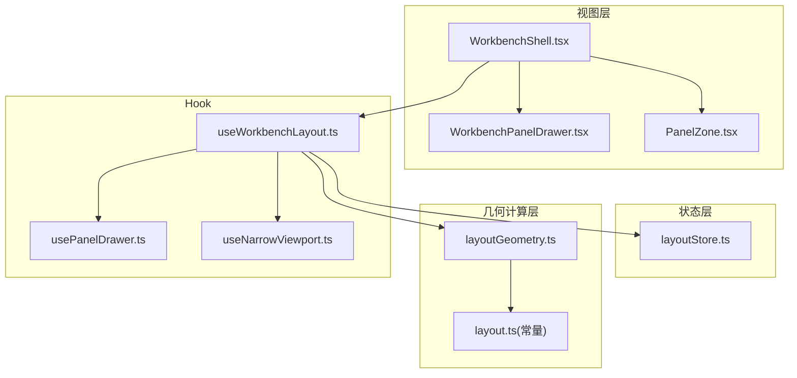
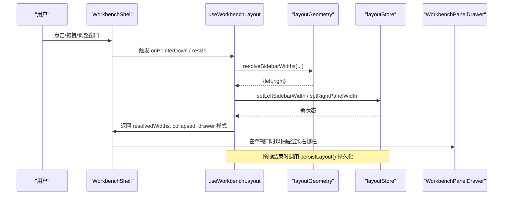
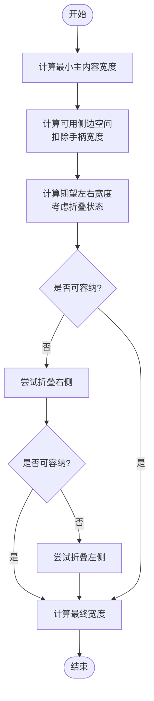
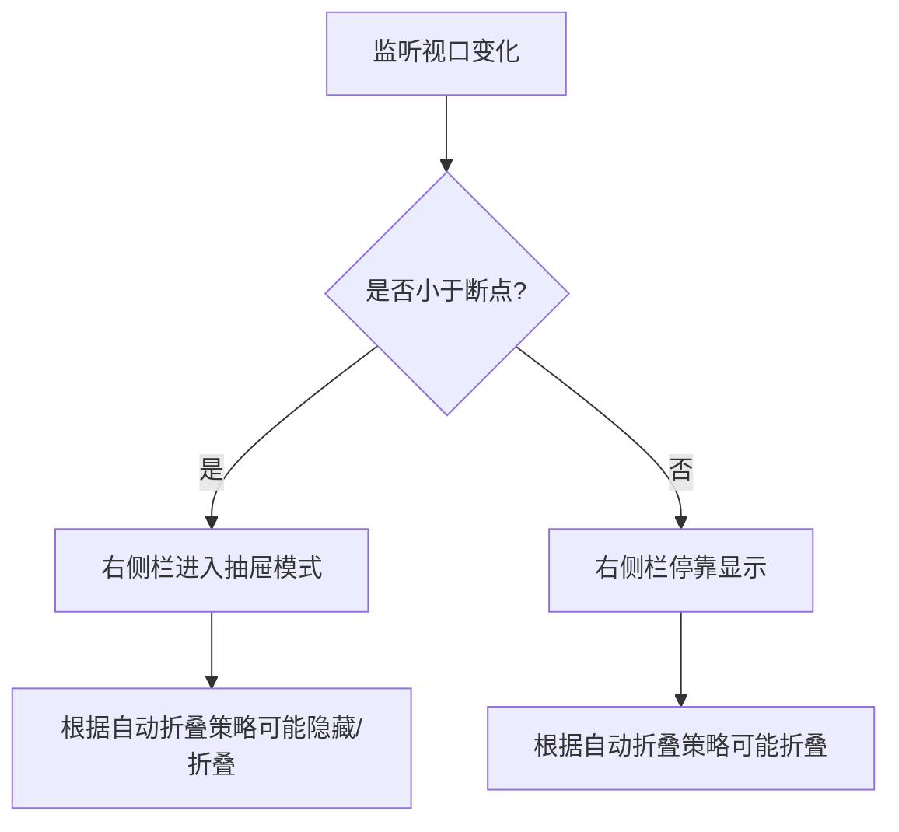
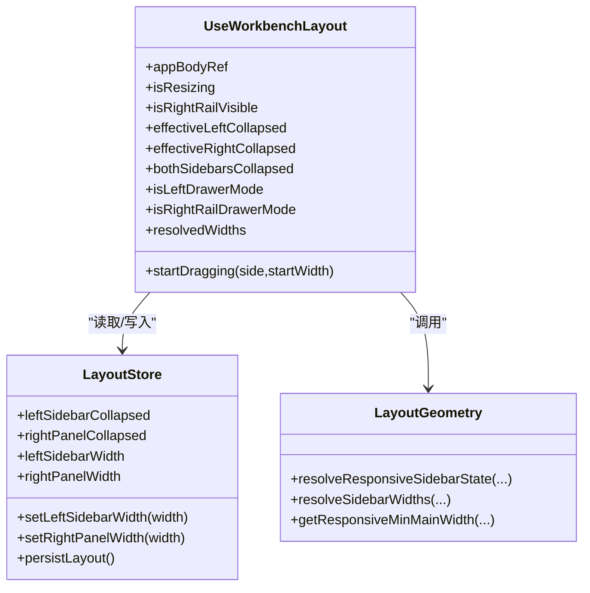
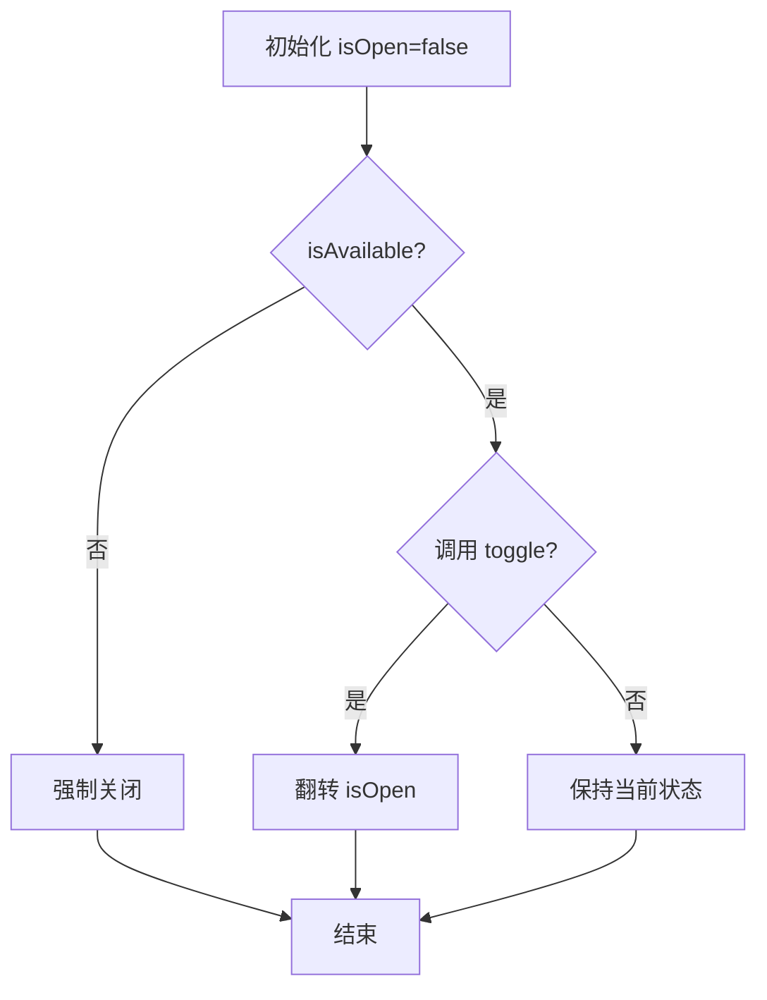
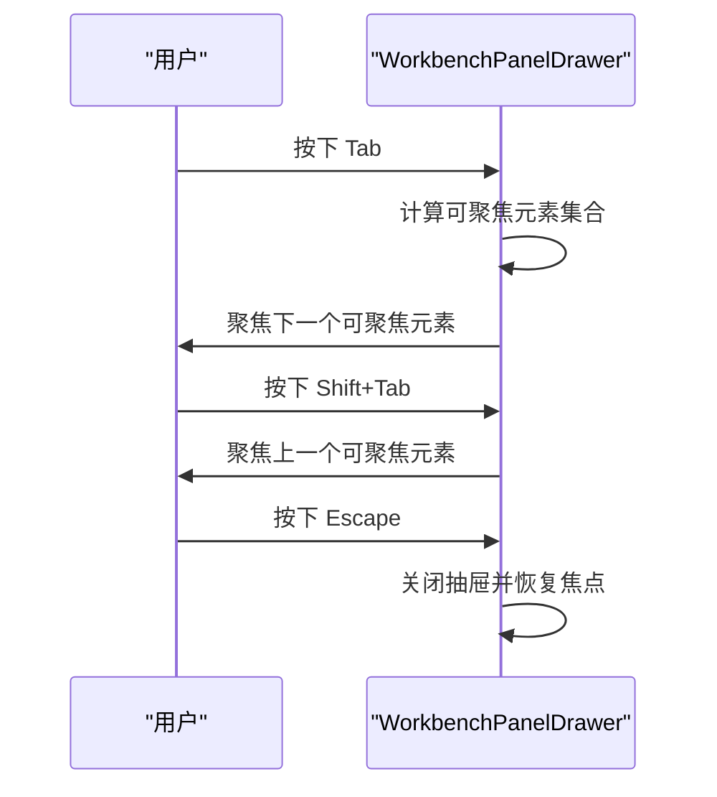
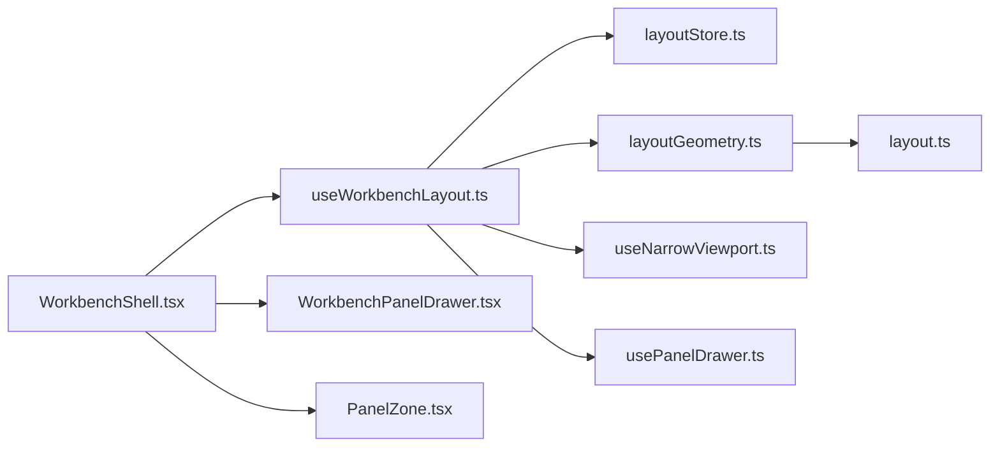

# 布局系统

<cite>
**本文引用的文件**
- [useWorkbenchLayout.ts](file://src/renderer/app/useWorkbenchLayout.ts)
- [usePanelDrawer.ts](file://src/renderer/app/usePanelDrawer.ts)
- [layoutGeometry.ts](file://src/renderer/shell/layoutGeometry.ts)
- [WorkbenchShell.tsx](file://src/renderer/app/WorkbenchShell.tsx)
- [WorkbenchPanelDrawer.tsx](file://src/renderer/app/WorkbenchPanelDrawer.tsx)
- [useNarrowViewport.ts](file://src/renderer/app/useNarrowViewport.ts)
- [layoutStore.ts](file://src/renderer/stores/layoutStore.ts)
- [PanelZone.tsx](file://src/renderer/shell/PanelZone.tsx)
- [layout.ts](file://src/shared/constants/layout.ts)
</cite>

## 目录
1. [简介](#简介)
2. [项目结构](#项目结构)
3. [核心组件](#核心组件)
4. [架构总览](#架构总览)
5. [详细组件分析](#详细组件分析)
6. [依赖关系分析](#依赖关系分析)
7. [性能考量](#性能考量)
8. [故障排查指南](#故障排查指南)
9. [结论](#结论)
10. [附录：配置与自定义布局开发指南](#附录配置与自定义布局开发指南)

## 简介
本文件面向工作台布局系统，系统性说明以下方面：
- 布局几何计算算法：左右面板宽度、折叠状态、最小主内容宽度的计算与约束。
- 响应式适配策略与断点处理机制：根据视口宽度自动切换抽屉模式或停靠模式。
- useWorkbenchLayout 自定义 Hook：状态管理、拖拽调整、布局切换逻辑。
- usePanelDrawer 抽屉面板的状态控制：开关、关闭、可用性限制。
- 不同屏幕尺寸下的布局适配方案：小屏抽屉化、中屏自动折叠、大屏停靠。
- 键盘导航支持与可访问性实现：焦点陷阱、Esc 关闭、语义化角色与标签。
- 布局配置选项与自定义布局开发指南：常量、持久化、扩展点。

## 项目结构
工作台布局由“状态层（Zustand）+ 几何计算层 + 视图层（Shell/Drawer）”组成：
- 状态层：layoutStore 维护折叠、宽度、终端高度等布局状态，并提供持久化能力。
- 几何计算层：layoutGeometry 提供响应式折叠判定与宽度解析函数。
- 视图层：WorkbenchShell 负责渲染左右侧栏、主区域、右侧栏（或抽屉），并接入拖拽调整；WorkbenchPanelDrawer 提供可访问的抽屉容器。
- 辅助 Hook：useNarrowViewport 用于判断窄视口；usePanelDrawer 提供轻量抽屉开关状态。

图表来源
- [useWorkbenchLayout.ts:24-209](file://src/renderer/app/useWorkbenchLayout.ts#L24-L209)
- [layoutGeometry.ts:66-151](file://src/renderer/shell/layoutGeometry.ts#L66-L151)
- [WorkbenchShell.tsx:48-239](file://src/renderer/app/WorkbenchShell.tsx#L48-L239)
- [WorkbenchPanelDrawer.tsx:30-96](file://src/renderer/app/WorkbenchPanelDrawer.tsx#L30-L96)
- [layoutStore.ts:77-155](file://src/renderer/stores/layoutStore.ts#L77-L155)
- [layout.ts:1-43](file://src/shared/constants/layout.ts#L1-L43)

章节来源
- [useWorkbenchLayout.ts:24-209](file://src/renderer/app/useWorkbenchLayout.ts#L24-L209)
- [layoutGeometry.ts:66-151](file://src/renderer/shell/layoutGeometry.ts#L66-L151)
- [WorkbenchShell.tsx:48-239](file://src/renderer/app/WorkbenchShell.tsx#L48-L239)
- [WorkbenchPanelDrawer.tsx:30-96](file://src/renderer/app/WorkbenchPanelDrawer.tsx#L30-L96)
- [layoutStore.ts:77-155](file://src/renderer/stores/layoutStore.ts#L77-L155)
- [layout.ts:1-43](file://src/shared/constants/layout.ts#L1-L43)

## 核心组件
- useWorkbenchLayout：集中管理应用主体宽度、拖拽调整、响应式折叠、抽屉模式切换、最终宽度计算与事件绑定。
- layoutGeometry：提供 getResponsiveMinMainWidth、resolveResponsiveSidebarState、resolveSidebarWidths 等纯函数，保证布局计算的确定性与可测试性。
- layoutStore：基于 Zustand 的布局状态存储，包含折叠、宽度、终端高度及持久化方法。
- WorkbenchShell：将布局状态映射为 DOM 结构与交互（拖拽手柄、抽屉触发）。
- WorkbenchPanelDrawer：可访问的抽屉容器，封装焦点管理、键盘事件与模态语义。
- usePanelDrawer：轻量抽屉开关 Hook，支持按可用性条件禁用打开。
- useNarrowViewport：基于 matchMedia 与 window.innerWidth 的窄视口检测 Hook。

章节来源
- [useWorkbenchLayout.ts:24-209](file://src/renderer/app/useWorkbenchLayout.ts#L24-L209)
- [layoutGeometry.ts:66-151](file://src/renderer/shell/layoutGeometry.ts#L66-L151)
- [layoutStore.ts:77-155](file://src/renderer/stores/layoutStore.ts#L77-L155)
- [WorkbenchShell.tsx:48-239](file://src/renderer/app/WorkbenchShell.tsx#L48-L239)
- [WorkbenchPanelDrawer.tsx:30-96](file://src/renderer/app/WorkbenchPanelDrawer.tsx#L30-L96)
- [usePanelDrawer.ts:3-16](file://src/renderer/app/usePanelDrawer.ts#L3-L16)
- [useNarrowViewport.ts:8-24](file://src/renderer/app/useNarrowViewport.ts#L8-L24)

## 架构总览
下图展示了从用户交互到状态更新再到视图渲染的关键流程：

图表来源
- [WorkbenchShell.tsx:147-234](file://src/renderer/app/WorkbenchShell.tsx#L147-L234)
- [useWorkbenchLayout.ts:121-187](file://src/renderer/app/useWorkbenchLayout.ts#L121-L187)
- [layoutGeometry.ts:101-151](file://src/renderer/shell/layoutGeometry.ts#L101-L151)
- [layoutStore.ts:138-155](file://src/renderer/stores/layoutStore.ts#L138-L155)

## 详细组件分析

### 布局几何计算算法
- 最小主内容宽度：getResponsiveMinMainWidth 返回固定最小值，确保主区域可读性。
- 可用侧边空间：考虑两侧是否折叠以及拖拽手柄占用，计算可用于侧栏的空间。
- 折叠判定：当期望的左右宽度之和超过可用空间时，优先尝试折叠右侧，再折叠左侧，保证主内容不被过度压缩。
- 宽度解析：在满足最小宽度约束的前提下，按比例缩减超出的部分，必要时进行二次缩减，确保不违反最小宽度。

图表来源
- [layoutGeometry.ts:37-99](file://src/renderer/shell/layoutGeometry.ts#L37-L99)
- [layoutGeometry.ts:101-151](file://src/renderer/shell/layoutGeometry.ts#L101-L151)

章节来源
- [layoutGeometry.ts:37-99](file://src/renderer/shell/layoutGeometry.ts#L37-L99)
- [layoutGeometry.ts:101-151](file://src/renderer/shell/layoutGeometry.ts#L101-L151)

### 响应式适配策略与断点处理机制
- 窄视口断点：RIGHT_RAIL_DRAWER_BREAKPOINT 决定右侧栏在小屏下进入抽屉模式。
- 自动折叠：当视口缩小导致无法同时展开左右侧栏时，优先折叠右侧，其次左侧。
- 抽屉模式：当处于窄视口或自动折叠时，右侧栏通过 WorkbenchPanelDrawer 以抽屉形式呈现，避免挤压主内容。
- 左侧抽屉：在极窄或自动折叠场景，左侧导航也可切换为抽屉模式，提升小屏可用性。

图表来源
- [useWorkbenchLayout.ts:40-73](file://src/renderer/app/useWorkbenchLayout.ts#L40-L73)
- [layout.ts:11-12](file://src/shared/constants/layout.ts#L11-L12)

章节来源
- [useWorkbenchLayout.ts:40-73](file://src/renderer/app/useWorkbenchLayout.ts#L40-L73)
- [layout.ts:11-12](file://src/shared/constants/layout.ts#L11-L12)

### useWorkbenchLayout 状态管理与布局切换逻辑
- 状态来源：
  - 应用主体宽度：ResizeObserver + window.resize 同步。
  - 折叠与宽度：来自 layoutStore 的 left/right 折叠与宽度。
  - 右侧栏可见性：根据当前项目与会话目标动态决定。
- 关键逻辑：
  - 计算 effectiveCollapsed：结合响应式折叠与抽屉模式。
  - 计算 isRightRailDrawerMode/isLeftDrawerMode：基于断点与自动折叠。
  - 拖拽调整：pointermove 实时计算并更新宽度，pointerup 持久化。
  - 暴露 API：resolvedWidths、toggle/close 抽屉、startDragging 等。

图表来源
- [useWorkbenchLayout.ts:24-209](file://src/renderer/app/useWorkbenchLayout.ts#L24-L209)
- [layoutStore.ts:77-155](file://src/renderer/stores/layoutStore.ts#L77-L155)
- [layoutGeometry.ts:66-151](file://src/renderer/shell/layoutGeometry.ts#L66-L151)

章节来源
- [useWorkbenchLayout.ts:24-209](file://src/renderer/app/useWorkbenchLayout.ts#L24-L209)
- [layoutStore.ts:77-155](file://src/renderer/stores/layoutStore.ts#L77-L155)
- [layoutGeometry.ts:66-151](file://src/renderer/shell/layoutGeometry.ts#L66-L151)

### usePanelDrawer 抽屉面板状态控制
- 功能：维护 isOpen 状态，并在不可用时强制关闭；提供 close/toggle 方法。
- 行为：当 isAvailable 为 false 时，isOpen 会被重置为 false，防止无效交互。
- 使用场景：配合 useWorkbenchLayout 的 isLeftDrawerMode/isRightRailDrawerMode 控制抽屉开关。

图表来源
- [usePanelDrawer.ts:3-16](file://src/renderer/app/usePanelDrawer.ts#L3-L16)

章节来源
- [usePanelDrawer.ts:3-16](file://src/renderer/app/usePanelDrawer.ts#L3-L16)

### 键盘导航支持与可访问性实现
- 抽屉模态：WorkbenchPanelDrawer 使用 role="dialog"、aria-modal="true"、aria-label 描述标题，提供可访问的对话框语义。
- 焦点管理：打开时记录上一个焦点元素，首次聚焦到第一个可聚焦元素；关闭后恢复焦点。
- 键盘事件：
  - Esc 键关闭抽屉。
  - Tab/Shift+Tab 在抽屉内循环聚焦，防止焦点逃逸。
- 其他可访问性：
  - 拖拽手柄 aria-hidden="true"，避免被读屏器关注。
  - 按钮具备 aria-label/title，便于无障碍操作。

图表来源
- [WorkbenchPanelDrawer.ts:34-74](file://src/renderer/app/WorkbenchPanelDrawer.ts#L34-L74)
- [WorkbenchShell.tsx:160-164](file://src/renderer/app/WorkbenchShell.tsx#L160-L164)

章节来源
- [WorkbenchPanelDrawer.ts:34-74](file://src/renderer/app/WorkbenchPanelDrawer.ts#L34-L74)
- [WorkbenchShell.tsx:160-164](file://src/renderer/app/WorkbenchShell.tsx#L160-L164)

### 不同屏幕尺寸下的布局适配方案
- 超窄屏（<=720px 或自动折叠）：左侧导航以抽屉形式展示，减少干扰。
- 窄屏（<=RIGHT_RAIL_DRAWER_BREAKPOINT）：右侧栏以抽屉形式展示，避免挤压主内容。
- 中屏：右侧栏可能因空间不足自动折叠，左侧保留或自动折叠。
- 大屏：左右侧栏均可停靠显示，拖拽调整宽度。

章节来源
- [useWorkbenchLayout.ts:61-73](file://src/renderer/app/useWorkbenchLayout.ts#L61-L73)
- [layout.ts:11-12](file://src/shared/constants/layout.ts#L11-L12)

## 依赖关系分析
- useWorkbenchLayout 依赖：
  - layoutStore：读写折叠与宽度，持久化布局。
  - layoutGeometry：计算响应式折叠与宽度。
  - useNarrowViewport：判断窄视口。
  - usePanelDrawer：管理抽屉开关。
- WorkbenchShell 依赖：
  - useWorkbenchLayout：获取布局状态与交互回调。
  - WorkbenchPanelDrawer：渲染抽屉。
  - PanelZone：复用侧栏样式与宽度注入。
- layoutGeometry 依赖：
  - layout.ts：常量定义（最小宽度、最大宽度、断点等）。

图表来源
- [useWorkbenchLayout.ts:24-209](file://src/renderer/app/useWorkbenchLayout.ts#L24-L209)
- [WorkbenchShell.tsx:48-239](file://src/renderer/app/WorkbenchShell.tsx#L48-L239)
- [layoutGeometry.ts:66-151](file://src/renderer/shell/layoutGeometry.ts#L66-L151)
- [layout.ts:1-43](file://src/shared/constants/layout.ts#L1-L43)

章节来源
- [useWorkbenchLayout.ts:24-209](file://src/renderer/app/useWorkbenchLayout.ts#L24-L209)
- [WorkbenchShell.tsx:48-239](file://src/renderer/app/WorkbenchShell.tsx#L48-L239)
- [layoutGeometry.ts:66-151](file://src/renderer/shell/layoutGeometry.ts#L66-L151)
- [layout.ts:1-43](file://src/shared/constants/layout.ts#L1-L43)

## 性能考量
- 计算复杂度：
  - resolveResponsiveSidebarState 与 resolveSidebarWidths 均为 O(1) 常数时间计算，适合高频触发（如拖拽）。
- 事件监听：
  - pointermove 与 resize 事件在 Hook 内部统一注册与清理，避免内存泄漏。
- 重绘优化：
  - 通过 CSS 变量注入宽度，减少 React 层级重渲染。
  - ResizeObserver 仅观察 appBody，降低监听范围。
- 持久化：
  - 仅在拖拽结束时调用 persistLayout，避免频繁写盘。

[本节为通用性能建议，无需具体文件引用]

## 故障排查指南
- 右侧栏未显示：
  - 检查 rightRailTarget 与 currentProject/currentSession 是否正确设置。
  - 确认 isRightRailVisible 是否为 true。
- 抽屉模式异常：
  - 检查 RIGHT_RAIL_DRAWER_BREAKPOINT 与 useNarrowViewport 返回值。
  - 确认 isRightRailDrawerMode 与 isRightRailDrawerOpen 状态。
- 拖拽无效：
  - 检查 effectiveLeftCollapsed/effectiveRightCollapsed 是否为 false。
  - 确认 onPointerDown 已绑定到拖拽手柄。
- 持久化失败：
  - 在非 Electron 环境（如浏览器 QA）settings 写入可能被拒绝，属预期行为；布局仍可在内存中工作。

章节来源
- [useWorkbenchLayout.ts:40-73](file://src/renderer/app/useWorkbenchLayout.ts#L40-L73)
- [useWorkbenchLayout.ts:121-187](file://src/renderer/app/useWorkbenchLayout.ts#L121-L187)
- [layoutStore.ts:42-75](file://src/renderer/stores/layoutStore.ts#L42-L75)

## 结论
该布局系统通过清晰的职责划分与纯函数几何计算，实现了稳定可靠的响应式布局。useWorkbenchLayout 作为中枢协调状态与交互，layoutGeometry 提供确定性算法，layoutStore 负责状态与持久化，WorkbenchShell/Drawer 完成可视化与可访问性。整体设计兼顾了多端适配、用户体验与可维护性。

[本节为总结性内容，无需具体文件引用]

## 附录：配置与自定义布局开发指南
- 布局常量（layout.ts）：
  - 左右侧栏默认/最小/最大/折叠宽度。
  - 右侧栏抽屉断点、最小主内容宽度、拖拽手柄宽度。
  - 终端高度默认/最小/最大值。
- 状态持久化（layoutStore.ts）：
  - hydrateFromSettings：从设置中恢复布局状态。
  - persistLayout：将布局状态保存到 settings.layout。
- 自定义布局开发：
  - 新增断点：在 layout.ts 中定义新断点，并在 useWorkbenchLayout 中引入并使用。
  - 新增面板：在 layoutStore 中添加状态字段与方法，在 layoutGeometry 中扩展计算逻辑，在 WorkbenchShell 中渲染与交互。
  - 自定义抽屉：复用 WorkbenchPanelDrawer 的可访问性实现，传入 title/closeLabel/children。
- 最佳实践：
  - 所有宽度变更需经过 clamp 限制，避免越界。
  - 拖拽结束后再持久化，减少 I/O 压力。
  - 对不可用状态（如无项目）隐藏右侧栏，避免无效 UI。

章节来源
- [layout.ts:1-43](file://src/shared/constants/layout.ts#L1-L43)
- [layoutStore.ts:87-155](file://src/renderer/stores/layoutStore.ts#L87-L155)
- [useWorkbenchLayout.ts:24-209](file://src/renderer/app/useWorkbenchLayout.ts#L24-L209)
- [WorkbenchPanelDrawer.tsx:30-96](file://src/renderer/app/WorkbenchPanelDrawer.tsx#L30-L96)