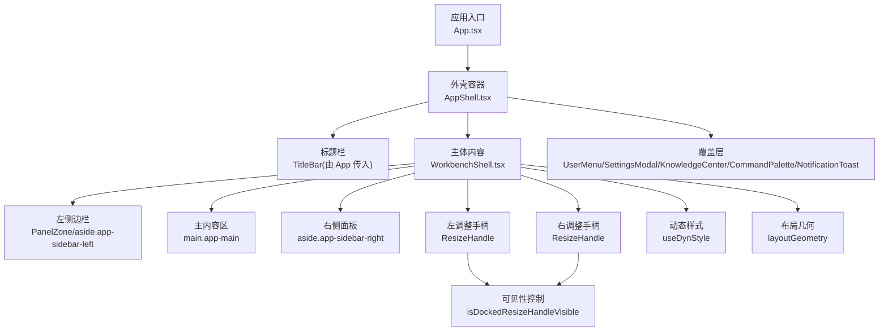
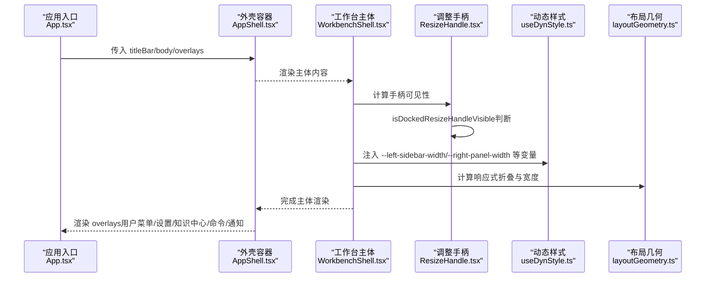
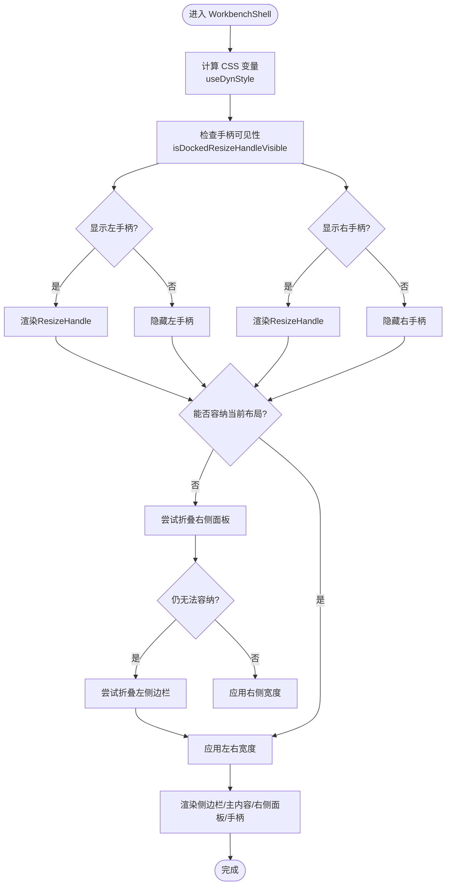
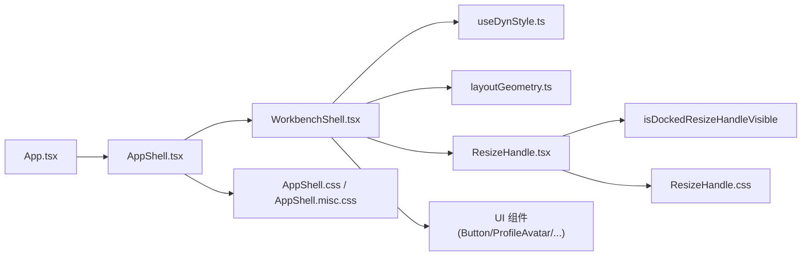

# 应用外壳组件

<cite>
**本文引用的文件**
- [AppShell.tsx](file://src/renderer/shell/AppShell.tsx)
- [AppShell.css](file://src/renderer/shell/AppShell.css)
- [AppShell.misc.css](file://src/renderer/shell/AppShell.misc.css)
- [WorkbenchShell.tsx](file://src/renderer/app/WorkbenchShell.tsx)
- [ResizeHandle.tsx](file://src/renderer/shell/ResizeHandle.tsx)
- [ResizeHandle.css](file://src/renderer/shell/ResizeHandle.css)
- [layoutGeometry.ts](file://src/renderer/shell/layoutGeometry.ts)
- [useDynStyle.ts](file://src/renderer/lib/useDynStyle.ts)
- [App.tsx](file://src/renderer/app/App.tsx)
- [layout.ts](file://src/shared/constants/layout.ts)
</cite>

## 更新摘要
**所做更改**
- 更新了WorkbenchShell组件的resize手柄逻辑，采用现代化的ResizeHandle组件
- 添加了isDockdResizeHandleVisible函数用于控制手柄可见性
- 简化了组件结构的条件渲染逻辑
- 增强了拖拽交互的用户体验

## 目录
1. [简介](#简介)
2. [项目结构](#项目结构)
3. [核心组件](#核心组件)
4. [架构总览](#架构总览)
5. [详细组件分析](#详细组件分析)
6. [依赖关系分析](#依赖关系分析)
7. [性能考量](#性能考量)
8. [故障排查指南](#故障排查指南)
9. [结论](#结论)
10. [附录](#附录)

## 简介
本文件围绕 AppShell 应用外壳组件，系统阐述其作为应用布局框架的核心职责：以最小化的容器承载标题栏、主体内容与覆盖层，并通过样式系统与主题变量实现一致的视觉与交互体验。文档同时说明 Props 接口设计（titleBar、body、overlays）、区域组织方式、CSS 类名规范、主题适配机制，以及基于 PanelZone、现代化 ResizeHandle、布局几何计算与动态样式 Hook 的扩展方法与最佳实践。

## 项目结构
- 外壳容器：AppShell 提供 app-container 根节点，按序渲染 titleBar、body、overlays。
- 工作台主体：WorkbenchShell 负责左右侧边栏、主内容区、右侧面板、终端抽屉等布局编排。
- 现代化调整手柄：ResizeHandle 提供统一的拖拽调整宽度能力，支持可见性控制和指针捕获。
- 布局几何：layoutGeometry 根据容器宽度与最小主内容宽度，计算两侧边栏是否折叠及最终宽度。
- 动态样式：useDynStyle 通过可构造样式表注入 CSS 变量，避免内联 style，满足 CSP 并提升性能。
- 应用装配：App 组装 TitleBar、WorkbenchShell 与 overlays（用户菜单、设置弹窗、知识中心、命令面板、通知）。



**图表来源**
- [App.tsx:149-247](file://src/renderer/app/App.tsx#L149-L247)
- [AppShell.tsx:12-20](file://src/renderer/shell/AppShell.tsx#L12-L20)
- [WorkbenchShell.tsx:147-236](file://src/renderer/app/WorkbenchShell.tsx#L147-L236)
- [ResizeHandle.tsx:12-14](file://src/renderer/shell/ResizeHandle.tsx#L12-L14)
- [useDynStyle.ts:39-53](file://src/renderer/lib/useDynStyle.ts#L39-L53)
- [layoutGeometry.ts:66-99](file://src/renderer/shell/layoutGeometry.ts#L66-L99)

**章节来源**
- [App.tsx:149-247](file://src/renderer/app/App.tsx#L149-L247)
- [AppShell.tsx:12-20](file://src/renderer/shell/AppShell.tsx#L12-L20)
- [WorkbenchShell.tsx:147-236](file://src/renderer/app/WorkbenchShell.tsx#L147-L236)

## 核心组件
- AppShell
  - 职责：应用外壳容器，仅负责渲染三个区域：标题栏、主体内容、覆盖层。
  - Props：
    - titleBar：ReactNode，必填，放置窗口标题栏与全局控制。
    - body：ReactNode，必填，放置工作台主体布局。
    - overlays：ReactNode，可选，放置模态、浮层、通知等覆盖层。
  - 样式：根节点使用 app-container 类，配合全局主题变量与 z-index 层级。
- WorkbenchShell
  - 职责：工作区主体布局，包含左侧边栏、主内容区、右侧面板、终端抽屉、提示条与浮动工具。
  - 关键特性：
    - 通过 CSS 变量控制左右侧边栏宽度与调整手柄可见性。
    - 支持抽屉模式与停靠模式切换。
    - 集成设备选择器、终端开关、活动告警状态。
    - **现代化resize手柄逻辑**：使用ResizeHandle组件和isDockedResizeHandleVisible函数控制手柄显示。
- ResizeHandle
  - 职责：提供统一的左右拖拽手柄，支持可见性控制、指针捕获和禁用状态。
  - 功能特性：
    - isDockedResizeHandleVisible函数：根据停靠状态和折叠状态决定手柄可见性。
    - bindResizePointerDown：处理指针事件，支持setPointerCapture和错误处理。
    - 支持disabled状态和自定义onDragStart回调。
- layoutGeometry
  - 职责：根据容器宽度与最小主内容宽度，决定两侧边栏折叠状态与最终宽度，保证主内容不溢出。
- useDynStyle
  - 职责：将 React 状态映射为 CSS 变量，写入可构造样式表，返回 data-dyn-style 标识供元素引用。

**章节来源**
- [AppShell.tsx:5-20](file://src/renderer/shell/AppShell.tsx#L5-L20)
- [WorkbenchShell.tsx:17-46](file://src/renderer/app/WorkbenchShell.tsx#L17-L46)
- [ResizeHandle.tsx:6-46](file://src/renderer/shell/ResizeHandle.tsx#L6-L46)
- [layoutGeometry.ts:66-151](file://src/renderer/shell/layoutGeometry.ts#L66-L151)
- [useDynStyle.ts:39-53](file://src/renderer/lib/useDynStyle.ts#L39-L53)

## 架构总览
AppShell 作为最外层容器，将应用分为三层：
- 标题栏层：窗口控制、面板切换、国际化文案等。
- 主体内容层：工作台布局、侧边栏、主页面、终端抽屉、浮动工具。
- 覆盖层：用户菜单、设置弹窗、知识中心、命令面板、通知。



**图表来源**
- [App.tsx:149-247](file://src/renderer/app/App.tsx#L149-L247)
- [AppShell.tsx:12-20](file://src/renderer/shell/AppShell.tsx#L12-L20)
- [WorkbenchShell.tsx:78-86](file://src/renderer/app/WorkbenchShell.tsx#L78-L86)
- [ResizeHandle.tsx:12-14](file://src/renderer/shell/ResizeHandle.tsx#L12-L14)
- [useDynStyle.ts:39-53](file://src/renderer/lib/useDynStyle.ts#L39-L53)
- [layoutGeometry.ts:66-99](file://src/renderer/shell/layoutGeometry.ts#L66-L99)

## 详细组件分析

### AppShell 组件
- 角色定位：纯布局外壳，不包含业务逻辑，便于在应用不同阶段复用。
- 结构：
  - 根节点 class：app-container
  - 子节点顺序：titleBar → body → overlays
- 扩展点：
  - 通过 overlays 插入任意覆盖层（模态、通知、命令面板等）。
  - 通过 body 注入复杂的工作台布局。
  - 通过 titleBar 注入窗口控制与全局操作。

```mermaid
classDiagram
class AppShell {
+titleBar : ReactNode
+body : ReactNode
+overlays? : ReactNode
}
class WorkbenchShell {
+appBodyRef : RefObject<HTMLDivElement>
+resolvedWidths : { left : number; right : number }
+effectiveLeftCollapsed : boolean
+effectiveRightCollapsed : boolean
+isRightRailVisible : boolean
+isTerminalOpen : boolean
+showMainPromptBar : boolean
+mainPage : ReactNode
}
class ResizeHandle {
+side : 'left' | 'right'
+disabled? : boolean
+onDragStart : function
}
AppShell --> WorkbenchShell : "作为 body 渲染"
WorkbenchShell --> ResizeHandle : "现代化调整手柄"
```

**图表来源**
- [AppShell.tsx:5-20](file://src/renderer/shell/AppShell.tsx#L5-L20)
- [WorkbenchShell.tsx:17-46](file://src/renderer/app/WorkbenchShell.tsx#L17-L46)
- [ResizeHandle.tsx:6-10](file://src/renderer/shell/ResizeHandle.tsx#L6-L10)

**章节来源**
- [AppShell.tsx:5-20](file://src/renderer/shell/AppShell.tsx#L5-L20)

### 标题栏区域（TitleBar）
- 位置与作用：位于 AppShell.titleBar，承载窗口控制、面板切换、国际化文案等。
- 与外壳协作：App 将 TitleBar 作为 titleBar 传入 AppShell，确保窗口级控件与布局解耦。
- 样式要点：遵循主题变量与 z-index 层级，保证在不同主题下的一致表现。

**章节来源**
- [App.tsx:152-172](file://src/renderer/app/App.tsx#L152-L172)

### 主体内容区域（WorkbenchShell）
- 布局结构：
  - 左侧边栏：aside.app-sidebar-left，支持折叠与抽屉模式。
  - 主内容区：main.app-main，包含 shell 通知、浮动工具、主页面与输入栏。
  - 右侧面板：aside.app-sidebar-right，支持折叠与抽屉模式。
  - **现代化调整手柄**：使用ResizeHandle组件替代内联div，支持可见性控制。
- **现代化resize手柄逻辑**：
  - 使用isDockedResizeHandleVisible函数判断手柄可见性
  - 通过三元表达式简化条件渲染逻辑
  - 支持停靠模式和抽屉模式的智能切换
- 动态样式：
  - 通过 useDynStyle 注入 CSS 变量：--left-sidebar-width、--right-panel-width、--left-resize-handle-width、--right-resize-handle-width、--workbench-rail-max-width、--workbench-inline-mode。
- 响应式布局：
  - 依据 layoutGeometry 计算最小主内容宽度与两侧边栏折叠状态，确保主内容不被挤压。
- 终端与通知：
  - 终端抽屉：TerminalDrawer，受 isTerminalOpen 控制。
  - 顶部通知：shell-notice，role="status"，aria-live="polite"。



**图表来源**
- [WorkbenchShell.tsx:78-86](file://src/renderer/app/WorkbenchShell.tsx#L78-L86)
- [ResizeHandle.tsx:12-14](file://src/renderer/shell/ResizeHandle.tsx#L12-L14)
- [layoutGeometry.ts:66-99](file://src/renderer/shell/layoutGeometry.ts#L66-L99)
- [useDynStyle.ts:39-53](file://src/renderer/lib/useDynStyle.ts#L39-L53)

**章节来源**
- [WorkbenchShell.tsx:78-86](file://src/renderer/app/WorkbenchShell.tsx#L78-L86)
- [WorkbenchShell.tsx:147-236](file://src/renderer/app/WorkbenchShell.tsx#L147-L236)
- [layoutGeometry.ts:66-151](file://src/renderer/shell/layoutGeometry.ts#L66-L151)

### 现代化调整手柄组件（ResizeHandle）
- **新增功能**：现代化的拖拽调整手柄组件，替代原有的内联div元素。
- **核心特性**：
  - isDockedResizeHandleVisible函数：根据停靠状态和折叠状态智能判断手柄可见性。
  - 指针捕获：使用setPointerCapture确保拖拽体验的一致性。
  - 错误处理：对不支持指针事件的浏览器进行降级处理。
  - 禁用状态：支持disabled属性，禁用时改变光标和行为。
- **样式系统**：
  - panel-resize-handle：基础手柄样式，支持hover和active状态。
  - panel-resize-handle-hit：点击热区，支持左右偏移以适应边框。
  - 主题化：使用CSS变量实现主题适配。
- **集成方式**：
  - 在WorkbenchShell中通过三元表达式简化条件渲染。
  - 结合APP_RESIZE_HANDLE_WIDTH常量控制手柄宽度。

**章节来源**
- [ResizeHandle.tsx:12-46](file://src/renderer/shell/ResizeHandle.tsx#L12-L46)
- [ResizeHandle.css:1-61](file://src/renderer/shell/ResizeHandle.css#L1-L61)
- [WorkbenchShell.tsx:163-167](file://src/renderer/app/WorkbenchShell.tsx#L163-L167)
- [WorkbenchShell.tsx:209-213](file://src/renderer/app/WorkbenchShell.tsx#L209-L213)

### 覆盖层（Overlays）
- 组成：用户菜单、设置弹窗、知识中心、命令面板、通知。
- 渲染位置：AppShell.overlays，确保覆盖层在所有内容之上。
- 交互：
  - 用户菜单：锚定元素与矩形，支持主题/语言/字体缩放变更。
  - 设置弹窗：集中管理外观与行为设置。
  - 知识中心：从侧边栏或主界面打开。
  - 命令面板：快捷执行配置等命令。
  - 通知：短暂显示后自动消失。

**章节来源**
- [App.tsx:208-245](file://src/renderer/app/App.tsx#L208-L245)

### 侧边栏与调整手柄
- PanelZone：统一侧边栏容器类名与折叠状态，支持自定义 className。
- **现代化ResizeHandle**：监听鼠标按下，读取相邻面板宽度并触发 onDragStart，实现拖拽调整。
- 样式类：
  - panel-resize-handle-left/right：调整手柄样式。
  - app-sidebar-left/right：侧边栏容器。
  - collapsed：折叠状态。

**章节来源**
- [ResizeHandle.tsx:34-46](file://src/renderer/shell/ResizeHandle.tsx#L34-L46)
- [ResizeHandle.css:1-61](file://src/renderer/shell/ResizeHandle.css#L1-L61)

## 依赖关系分析
- AppShell 依赖：
  - 样式：AppShell.css、AppShell.misc.css
  - 被 App 组合：传入 titleBar/body/overlays
- WorkbenchShell 依赖：
  - 动态样式：useDynStyle
  - 布局几何：layoutGeometry
  - **现代化调整手柄**：ResizeHandle组件和isDockedResizeHandleVisible函数
  - 子组件：Sidebar、ControlPanel、TerminalDrawer、DeviceSelector、Composer、ProfileAvatar、Button
- 样式系统：
  - 主题变量：--space-*、--radius-*、--token-bg-*、--token-text-*、--z-notification 等
  - 动态变量：--left-sidebar-width、--right-panel-width、--left-resize-handle-width、--right-resize-handle-width、--workbench-rail-max-width、--workbench-inline-mode
  - **手柄常量**：APP_RESIZE_HANDLE_WIDTH = 8px



**图表来源**
- [App.tsx:149-247](file://src/renderer/app/App.tsx#L149-L247)
- [AppShell.tsx:1-3](file://src/renderer/shell/AppShell.tsx#L1-L3)
- [WorkbenchShell.tsx:78-86](file://src/renderer/app/WorkbenchShell.tsx#L78-L86)
- [ResizeHandle.tsx:12-14](file://src/renderer/shell/ResizeHandle.tsx#L12-L14)
- [useDynStyle.ts:39-53](file://src/renderer/lib/useDynStyle.ts#L39-L53)
- [layoutGeometry.ts:66-99](file://src/renderer/shell/layoutGeometry.ts#L66-L99)

**章节来源**
- [App.tsx:149-247](file://src/renderer/app/App.tsx#L149-L247)
- [AppShell.tsx:1-3](file://src/renderer/shell/AppShell.tsx#L1-L3)
- [WorkbenchShell.tsx:78-86](file://src/renderer/app/WorkbenchShell.tsx#L78-L86)

## 性能考量
- 避免内联 style：useDynStyle 使用可构造样式表批量更新 CSS 变量，减少重排与样式计算开销，并满足 CSP 限制。
- 响应式计算优化：layoutGeometry 仅在容器尺寸变化时重新计算折叠与宽度，避免频繁重绘。
- **现代化手柄性能**：
  - ResizeHandle组件使用事件委托和指针捕获优化拖拽性能。
  - isDockedResizeHandleVisible函数提供O(1)时间复杂度的可见性判断。
  - 条件渲染避免不必要的DOM节点创建。
- 覆盖层隔离：overlays 独立于主体内容，降低主流程渲染压力。
- 拖拽交互：ResizeHandle 仅在按下时读取相邻面板宽度，减少不必要的测量。

## 故障排查指南
- 通知未显示或遮挡异常
  - 检查 shell-notice 的 z-index 与父容器高度，确认 role="status" 与 aria-live="polite" 正确设置。
  - 参考样式定义与通知容器结构。
- 侧边栏宽度异常或重叠
  - 检查 useDynStyle 注入的 --left-sidebar-width 与 --right-panel-width 是否正确。
  - 验证 layoutGeometry 的最小主内容宽度与可容纳布局判断。
- **现代化手柄问题**：
  - 检查 isDockedResizeHandleVisible 函数的参数传递是否正确。
  - 确认 ResizeHandle 的 disabled 状态与 onDragStart 回调是否绑定。
  - 验证 APP_RESIZE_HANDLE_WIDTH 常量值是否符合预期。
  - 检查相邻面板是否存在且可测量宽度。
- 主题变量未生效
  - 确认 AppShell 与 WorkbenchShell 均引入了必要的样式文件。
  - 检查 CSS 变量命名与值类型是否符合预期。

**章节来源**
- [AppShell.css:1-13](file://src/renderer/shell/AppShell.css#L1-L13)
- [WorkbenchShell.tsx:166-172](file://src/renderer/app/WorkbenchShell.tsx#L166-L172)
- [WorkbenchShell.tsx:78-86](file://src/renderer/app/WorkbenchShell.tsx#L78-L86)
- [ResizeHandle.tsx:12-14](file://src/renderer/shell/ResizeHandle.tsx#L12-L14)
- [ResizeHandle.tsx:34-46](file://src/renderer/shell/ResizeHandle.tsx#L34-L46)
- [layoutGeometry.ts:66-99](file://src/renderer/shell/layoutGeometry.ts#L66-L99)

## 结论
AppShell 以极简的容器职责，将标题栏、主体内容与覆盖层清晰分离，结合 WorkbenchShell 的灵活布局、**现代化的ResizeHandle组件**、layoutGeometry 的响应式计算与 useDynStyle 的动态样式注入，形成稳定可扩展的应用外壳体系。**最新的现代化改进**通过isDockedResizeHandleVisible函数和简洁的条件渲染逻辑，显著提升了调整手柄的可维护性和用户体验。通过统一的 CSS 类名与主题变量，确保跨主题一致性与可维护性。开发者可通过 overlays 与 body 快速扩展功能，遵循现有类名与变量规范即可无缝融入整体布局。

## 附录

### Props 接口与类名规范
- AppShellProps
  - titleBar：ReactNode，必填
  - body：ReactNode，必填
  - overlays：ReactNode，可选
- **新增ResizeHandleProps**
  - side：'left' | 'right'，必填
  - disabled：boolean，可选
  - onDragStart：function，必填
- 常用 CSS 类名
  - app-container：外壳根容器
  - app-body：工作台主体容器
  - app-sidebar-left/right：左右侧边栏
  - app-main：主内容区
  - panel-resize-handle-left/right：调整手柄
  - panel-resize-handle-hit：手柄点击热区
  - shell-notice：顶部通知
  - loading-screen/logo/text/bar：加载屏样式
- 主题变量
  - 间距：--space-*
  - 圆角：--radius-*
  - 背景：--token-bg-*
  - 文本：--token-text-*
  - 层级：--z-notification
- **新增常量**
  - APP_RESIZE_HANDLE_WIDTH：8px，手柄标准宽度

**章节来源**
- [AppShell.tsx:5-20](file://src/renderer/shell/AppShell.tsx#L5-L20)
- [ResizeHandle.tsx:6-10](file://src/renderer/shell/ResizeHandle.tsx#L6-L10)
- [AppShell.css:1-69](file://src/renderer/shell/AppShell.css#L1-L69)
- [ResizeHandle.css:1-61](file://src/renderer/shell/ResizeHandle.css#L1-L61)
- [layout.ts:15](file://src/shared/constants/layout.ts#L15)

### 自定义外壳扩展方法
- 替换主体内容：在 App 中为 AppShell.body 传入自定义 WorkbenchShell 或简化布局。
- 增加覆盖层：在 AppShell.overlays 中追加新的模态或浮层组件。
- 定制标题栏：在 AppShell.titleBar 中注入自定义 TitleBar 或精简版标题栏。
- **现代化手柄扩展**：
  - 使用isDockedResizeHandleVisible函数自定义手柄可见性逻辑。
  - 通过ResizeHandle组件的props扩展拖拽行为。
  - 结合APP_RESIZE_HANDLE_WIDTH常量调整手柄尺寸。
- 调整侧边栏行为：修改 WorkbenchShell 的 CSS 变量与折叠逻辑，或扩展 layoutGeometry 的计算规则。
- 动态样式扩展：使用 useDynStyle 注入新的 CSS 变量，并在样式文件中消费这些变量。

**章节来源**
- [App.tsx:149-247](file://src/renderer/app/App.tsx#L149-L247)
- [WorkbenchShell.tsx:78-86](file://src/renderer/app/WorkbenchShell.tsx#L78-L86)
- [ResizeHandle.tsx:12-14](file://src/renderer/shell/ResizeHandle.tsx#L12-L14)
- [useDynStyle.ts:39-53](file://src/renderer/lib/useDynStyle.ts#L39-L53)