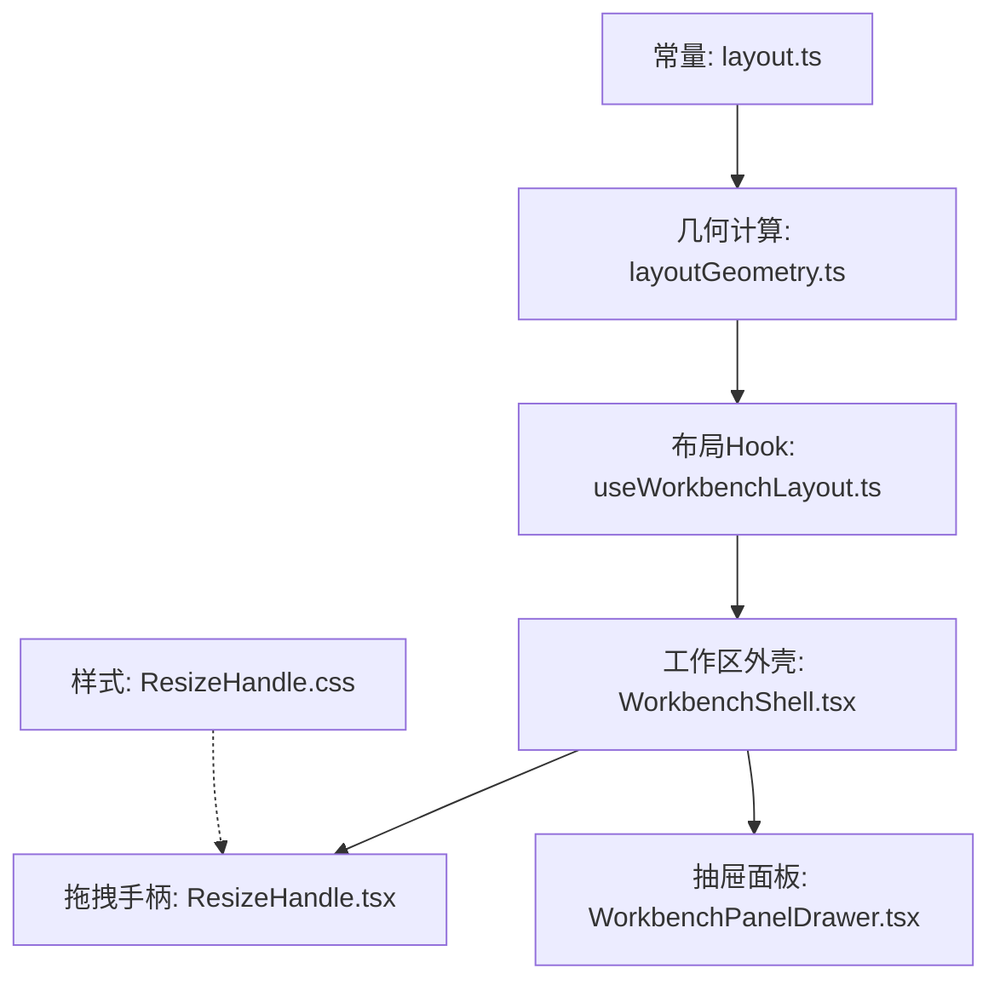
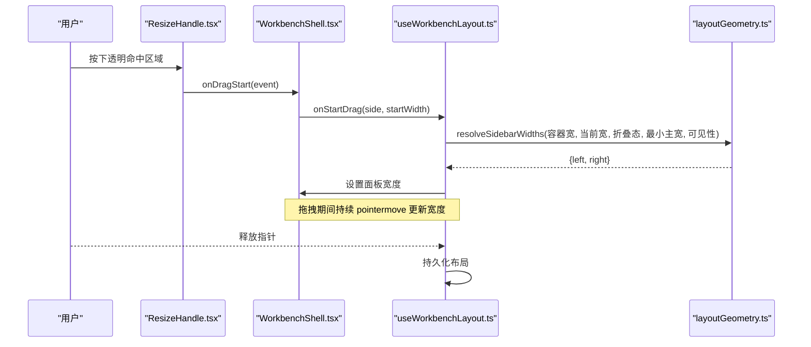
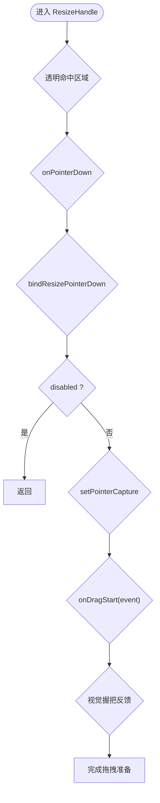
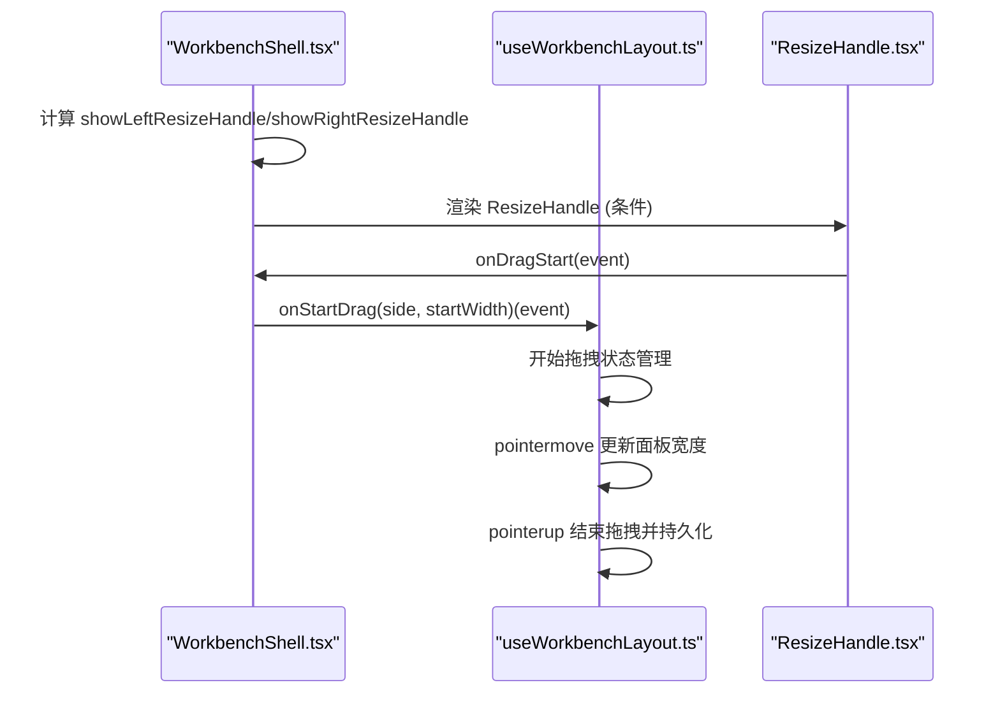
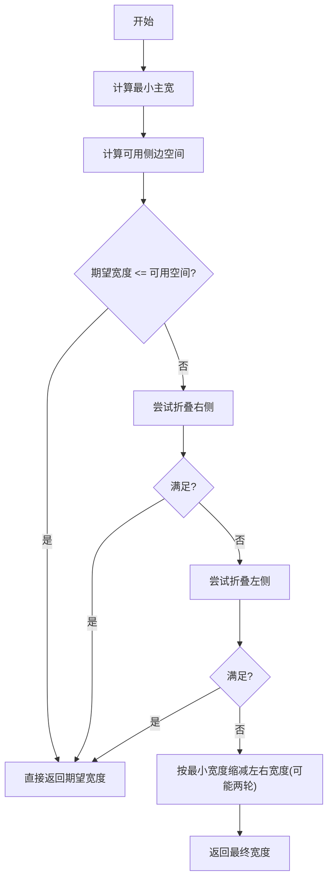
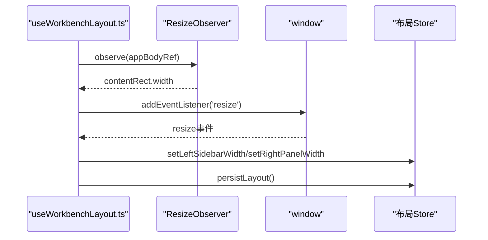
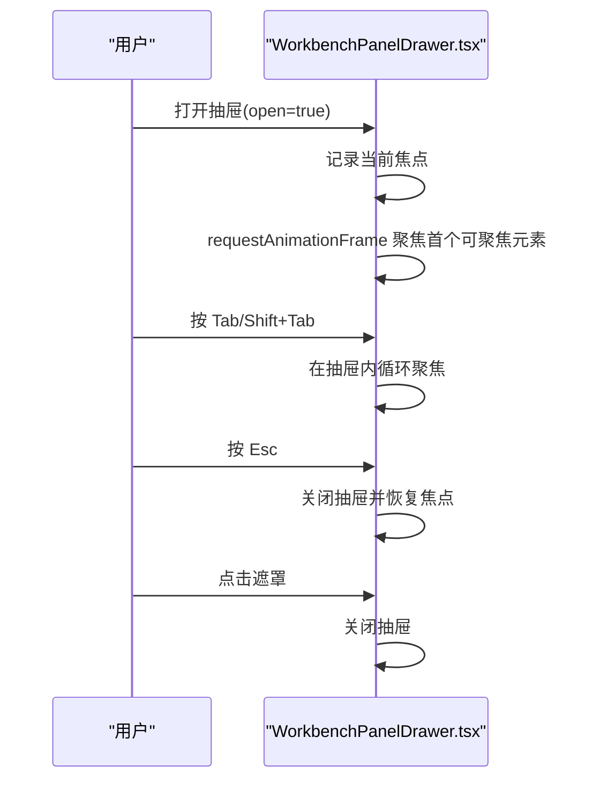
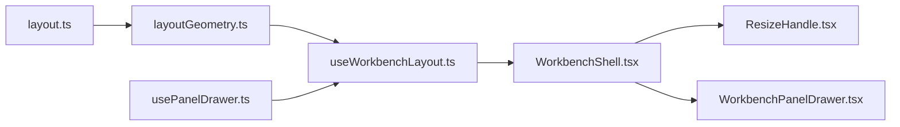

# 面板管理系统

<cite>
**本文引用的文件**
- [ResizeHandle.tsx](file://src/renderer/shell/ResizeHandle.tsx)
- [ResizeHandle.css](file://src/renderer/shell/ResizeHandle.css)
- [WorkbenchShell.tsx](file://src/renderer/app/WorkbenchShell.tsx)
- [useWorkbenchLayout.ts](file://src/renderer/app/useWorkbenchLayout.ts)
- [layoutGeometry.ts](file://src/renderer/shell/layoutGeometry.ts)
- [layout.ts](file://src/shared/constants/layout.ts)
- [WorkbenchPanelDrawer.tsx](file://src/renderer/app/WorkbenchPanelDrawer.tsx)
</cite>

## 更新摘要
**所做更改**
- 重构了 ResizeHandle 组件为透明溢出命中区域加列仅握把的新架构
- 移除了 PanelZone 组件和 useResizablePanel 钩子
- 布局逻辑简化到 WorkbenchShell 中直接管理
- 新增了 isDockedResizeHandleVisible 函数和 bindResizePointerDown 事件处理
- CSS 样式完全重新设计支持新的拆分架构
- 更新了拖拽交互机制和状态管理流程

## 目录
1. [简介](#简介)
2. [项目结构](#项目结构)
3. [核心组件](#核心组件)
4. [架构总览](#架构总览)
5. [详细组件分析](#详细组件分析)
6. [依赖关系分析](#依赖关系分析)
7. [性能考虑](#性能考虑)
8. [故障排查指南](#故障排查指南)
9. [结论](#结论)
10. [附录：自定义面板开发指南与集成示例](#附录自定义面板开发指南与集成示例)

## 简介
本文件面向面板管理系统的实现，聚焦以下目标：
- 解释重构后的 ResizeHandle 透明溢出命中区域架构与渲染机制
- 说明新的拖拽调整大小实现原理与用户交互处理
- 详细描述 WorkbenchPanelDrawer 抽屉面板的展开收起逻辑、动画效果与状态管理
- 覆盖面板生命周期管理、内存优化策略与性能调优方法
- 提供自定义面板开发指南和集成示例

## 项目结构
面板系统采用简化的分层架构，布局逻辑集中在 WorkbenchShell 中管理，ResizeHandle 组件专注于拖拽交互，通过透明的溢出命中区域提升用户体验。

**图表来源**
- [layout.ts:1-43](file://src/shared/constants/layout.ts#L1-L43)
- [layoutGeometry.ts:1-152](file://src/renderer/shell/layoutGeometry.ts#L1-L152)
- [useWorkbenchLayout.ts:1-211](file://src/renderer/app/useWorkbenchLayout.ts#L1-L211)
- [WorkbenchShell.tsx:1-242](file://src/renderer/app/WorkbenchShell.tsx#L1-L242)
- [ResizeHandle.tsx:1-46](file://src/renderer/shell/ResizeHandle.tsx#L1-L46)
- [ResizeHandle.css:1-61](file://src/renderer/shell/ResizeHandle.css#L1-L61)

**章节来源**
- [layout.ts:1-43](file://src/shared/constants/layout.ts#L1-L43)
- [layoutGeometry.ts:1-152](file://src/renderer/shell/layoutGeometry.ts#L1-L152)
- [useWorkbenchLayout.ts:1-211](file://src/renderer/app/useWorkbenchLayout.ts#L1-L211)
- [WorkbenchShell.tsx:1-242](file://src/renderer/app/WorkbenchShell.tsx#L1-L242)
- [ResizeHandle.tsx:1-46](file://src/renderer/shell/ResizeHandle.tsx#L1-L46)
- [ResizeHandle.css:1-61](file://src/renderer/shell/ResizeHandle.css#L1-L61)

## 核心组件
- **布局常量与约束**：定义左右面板默认/最小/最大宽度、折叠宽度、主内容最小宽度、拖拽条宽度、断点等。
- **几何计算**：根据容器宽度与当前折叠态，计算是否折叠、如何缩减溢出、得出最终左右宽度。
- **布局 Hook**：监听窗口与容器尺寸变化，维护拖拽状态，调用几何计算，更新面板宽度并持久化；同时决定抽屉模式。
- **工作区外壳**：直接在 WorkbenchShell 中管理面板布局和拖拽手柄，移除了中间层抽象。
- **拖拽手柄**：采用透明溢出命中区域加列仅握把的新架构，提供更精确的拖拽体验。
- **抽屉面板**：可访问性友好的模态抽屉，包含焦点管理、键盘交互、遮罩关闭、可选 keepMounted。

**章节来源**
- [layout.ts:1-43](file://src/shared/constants/layout.ts#L1-L43)
- [layoutGeometry.ts:1-152](file://src/renderer/shell/layoutGeometry.ts#L1-L152)
- [useWorkbenchLayout.ts:1-211](file://src/renderer/app/useWorkbenchLayout.ts#L1-L211)
- [WorkbenchShell.tsx:1-242](file://src/renderer/app/WorkbenchShell.tsx#L1-L242)
- [ResizeHandle.tsx:1-46](file://src/renderer/shell/ResizeHandle.tsx#L1-L46)
- [WorkbenchPanelDrawer.tsx:1-97](file://src/renderer/app/WorkbenchPanelDrawer.tsx#L1-L97)

## 架构总览
面板系统采用"常量 + 纯函数几何计算 + Hook 状态驱动 + 直接布局管理"的分层架构：
- 常量层：集中管理所有尺寸与断点，便于统一调优。
- 几何层：无副作用地计算折叠态与宽度，保证可测试性与稳定性。
- 交互层：Hook 负责事件绑定、尺寸同步、拖拽计算与持久化。
- 表现层：WorkbenchShell 直接管理面板布局，ResizeHandle 专注拖拽交互。

**图表来源**
- [ResizeHandle.tsx:1-46](file://src/renderer/shell/ResizeHandle.tsx#L1-L46)
- [WorkbenchShell.tsx:150-242](file://src/renderer/app/WorkbenchShell.tsx#L150-L242)
- [useWorkbenchLayout.ts:121-187](file://src/renderer/app/useWorkbenchLayout.ts#L121-L187)
- [layoutGeometry.ts:101-152](file://src/renderer/shell/layoutGeometry.ts#L101-L152)

## 详细组件分析

### 重构后的 ResizeHandle 组件：透明溢出命中区域架构
**更新** 组件已重构为透明溢出命中区域加列仅握把的新架构，提供更好的拖拽体验。

- **职责**：提供透明溢出命中区域和视觉握把，记录起始位置与基础宽度，触发上层拖拽流程。
- **新架构特点**：
  - `panel-resize-handle-hit`：透明命中区域，扩展拖拽感应范围
  - `panel-resize-handle::after`：视觉握把，显示在中心位置
  - 使用 `bindResizePointerDown` 封装事件处理逻辑
  - 新增 `isDockedResizeHandleVisible` 函数控制显示逻辑
- **交互流程**：
  - 点击透明命中区域触发拖拽
  - 使用 `setPointerCapture` 确保拖拽连续性
  - 支持 disabled 状态禁用交互
- **样式反馈**：hover/active 时高亮握把，disabled 时禁用交互。

**图表来源**
- [ResizeHandle.tsx:12-46](file://src/renderer/shell/ResizeHandle.tsx#L12-L46)
- [ResizeHandle.css:1-61](file://src/renderer/shell/ResizeHandle.css#L1-L61)

**章节来源**
- [ResizeHandle.tsx:1-46](file://src/renderer/shell/ResizeHandle.tsx#L1-L46)
- [ResizeHandle.css:1-61](file://src/renderer/shell/ResizeHandle.css#L1-L61)

### WorkbenchShell 直接布局管理
**更新** 布局逻辑已从 PanelZone 移至 WorkbenchShell 直接管理，简化了架构层次。

- **职责**：直接管理左右面板的布局、拖拽手柄的显示与隐藏、面板内容的渲染。
- **布局决策**：
  - 使用 `isDockedResizeHandleVisible` 判断拖拽手柄显示
  - 通过 CSS 变量动态设置面板宽度和拖拽手柄宽度
  - 条件渲染面板内容和拖拽手柄
- **拖拽集成**：
  - 接收 `onStartDrag` 回调创建拖拽处理器
  - 将拖拽事件传递给 useWorkbenchLayout 处理
  - 根据面板状态动态调整布局

**图表来源**
- [WorkbenchShell.tsx:79-89](file://src/renderer/app/WorkbenchShell.tsx#L79-L89)
- [WorkbenchShell.tsx:163-167](file://src/renderer/app/WorkbenchShell.tsx#L163-L167)
- [WorkbenchShell.tsx:209-213](file://src/renderer/app/WorkbenchShell.tsx#L209-L213)

**章节来源**
- [WorkbenchShell.tsx:1-242](file://src/renderer/app/WorkbenchShell.tsx#L1-L242)

### 布局算法：响应式折叠与宽度解析
- **输入**：容器宽度、左右面板当前宽度、折叠态、右侧可见性、最小主内容宽度。
- **步骤**：
  1) 计算最小主内容宽度（固定或响应式）。
  2) 计算可用侧边空间 = 容器宽 - 最小主宽 - 拖拽条占用。
  3) 若期望左右宽度之和超过可用空间，则优先折叠右侧，再折叠左侧。
  4) 若仍溢出，按最小宽度限制逐步缩减两侧宽度，必要时进行二次缩减。
  5) 输出最终 left/right 宽度。
- **关键常量**：左右面板默认/最小/最大/折叠宽度、拖拽条宽度、主内容最小宽度、右侧抽屉断点。

**图表来源**
- [layoutGeometry.ts:24-151](file://src/renderer/shell/layoutGeometry.ts#L24-L151)
- [layout.ts:1-43](file://src/shared/constants/layout.ts#L1-L43)

**章节来源**
- [layoutGeometry.ts:1-152](file://src/renderer/shell/layoutGeometry.ts#L1-L152)
- [layout.ts:1-43](file://src/shared/constants/layout.ts#L1-L43)

### 布局 Hook：状态、拖拽与持久化
- **状态来源**：从布局 store 读取/设置左右面板宽度与折叠态。
- **尺寸同步**：
  - 使用 ResizeObserver 观察容器尺寸变化。
  - 监听 window resize 保持窗口级同步。
- **拖拽处理**：
  - 记录拖拽起点与起始宽度。
  - pointermove 实时计算新宽度，受最小/最大宽度与主内容最小宽度限制。
  - pointerup 结束拖拽并持久化。
- **抽屉模式**：
  - 基于视口宽度与自动折叠态决定是否进入抽屉模式。
  - 使用 usePanelDrawer 管理 isOpen/close/toggle。

**图表来源**
- [useWorkbenchLayout.ts:96-187](file://src/renderer/app/useWorkbenchLayout.ts#L96-L187)

**章节来源**
- [useWorkbenchLayout.ts:1-211](file://src/renderer/app/useWorkbenchLayout.ts#L1-L211)

### 面板抽屉开关：usePanelDrawer
- **职责**：根据 isAvailable 控制抽屉开关，并在不可用时强制关闭。
- **暴露接口**：isOpen、close、toggle。
- **与布局联动**：当视口变窄或自动折叠时，切换到抽屉模式以提升可用性。

**章节来源**
- [usePanelDrawer.ts:1-17](file://src/renderer/app/usePanelDrawer.ts#L1-L17)
- [useWorkbenchLayout.ts:40-73](file://src/renderer/app/useWorkbenchLayout.ts#L40-L73)

### WorkbenchPanelDrawer 抽屉面板：展开收起、动画与状态
- **职责**：以 dialog 形式呈现侧边抽屉，支持遮罩关闭、Esc 关闭、Tab 焦点循环、首次自动聚焦、返回焦点。
- **展开收起逻辑**：
  - open 为 true 时渲染，false 且未 keepMounted 时直接返回 null。
  - 打开时记录当前焦点，首帧尝试聚焦到第一个可聚焦元素。
  - 关闭时恢复之前焦点。
- **键盘与可访问性**：
  - role="dialog", aria-modal="true", aria-label 标题。
  - Tab/Shift+Tab 在抽屉内循环聚焦。
  - Escape 关闭抽屉。
- **动画与视觉**：
  - 遮罩层点击关闭。
  - 头部包含标题与关闭按钮。
  - 内容区带滚动条样式。

**图表来源**
- [WorkbenchPanelDrawer.tsx:1-97](file://src/renderer/app/WorkbenchPanelDrawer.tsx#L1-L97)

**章节来源**
- [WorkbenchPanelDrawer.tsx:1-97](file://src/renderer/app/WorkbenchPanelDrawer.tsx#L1-L97)

## 依赖关系分析
- **常量依赖**：layoutGeometry 依赖 layout 中的尺寸常量。
- **Hook 依赖**：useWorkbenchLayout 依赖 layoutGeometry、usePanelDrawer、useNarrowViewport、项目/会话状态与布局 store。
- **组件依赖**：WorkbenchShell 直接管理布局，ResizeHandle 依赖样式；WorkbenchPanelDrawer 依赖 Button 与主题样式。
- **耦合度**：几何计算与 UI 解耦，便于单元测试与复用；WorkbenchShell 作为编排中心，集中布局管理与事件处理。

**图表来源**
- [layout.ts:1-43](file://src/shared/constants/layout.ts#L1-L43)
- [layoutGeometry.ts:1-152](file://src/renderer/shell/layoutGeometry.ts#L1-L152)
- [useWorkbenchLayout.ts:1-211](file://src/renderer/app/useWorkbenchLayout.ts#L1-L211)
- [usePanelDrawer.ts:1-17](file://src/renderer/app/usePanelDrawer.ts#L1-L17)
- [WorkbenchShell.tsx:1-242](file://src/renderer/app/WorkbenchShell.tsx#L1-L242)
- [ResizeHandle.tsx:1-46](file://src/renderer/shell/ResizeHandle.tsx#L1-L46)
- [WorkbenchPanelDrawer.tsx:1-97](file://src/renderer/app/WorkbenchPanelDrawer.tsx#L1-L97)

**章节来源**
- [layout.ts:1-43](file://src/shared/constants/layout.ts#L1-L43)
- [layoutGeometry.ts:1-152](file://src/renderer/shell/layoutGeometry.ts#L1-L152)
- [useWorkbenchLayout.ts:1-211](file://src/renderer/app/useWorkbenchLayout.ts#L1-L211)
- [usePanelDrawer.ts:1-17](file://src/renderer/app/usePanelDrawer.ts#L1-L17)
- [WorkbenchShell.tsx:1-242](file://src/renderer/app/WorkbenchShell.tsx#L1-L242)
- [ResizeHandle.tsx:1-46](file://src/renderer/shell/ResizeHandle.tsx#L1-L46)
- [WorkbenchPanelDrawer.tsx:1-97](file://src/renderer/app/WorkbenchPanelDrawer.tsx#L1-L97)

## 性能考虑
- **布局计算**
  - 几何计算为纯函数，时间复杂度近似 O(1)，适合高频调用。
  - 使用 useMemo 缓存响应式折叠态与最终宽度，减少重复计算。
- **事件与重排**
  - 使用 ResizeObserver 替代频繁 query 尺寸，降低回流。
  - pointermove 仅更新状态，避免在回调中进行昂贵操作。
  - 透明命中区域减少不必要的 DOM 操作。
- **渲染优化**
  - WorkbenchShell 直接管理布局，减少组件层级。
  - ResizeHandle 仅在 collapsed 切换或 width 变化时重新计算样式。
  - WorkbenchPanelDrawer 使用 hidden 属性与条件渲染，避免不必要的 DOM 构建。
- **内存与资源**
  - 清理事件监听与 observer，防止泄漏。
  - keepMounted 选项允许按需卸载/挂载，平衡体验与内存。
- **可访问性**
  - 焦点管理与键盘交互提升无障碍体验，减少辅助技术负担。

## 故障排查指南
- **拖拽无效**
  - 检查 ResizeHandle 是否 disabled。
  - 确认 isDockedResizeHandleVisible 返回正确的显示状态。
  - 验证 bindResizePointerDown 是否正确绑定事件。
  - 检查 useWorkbenchLayout 的 pointermove/pointerup 监听是否存在。
- **宽度异常**
  - 核对 layout 常量中的最小/最大宽度是否合理。
  - 检查 resolveSidebarWidths 的输入参数（容器宽、折叠态、最小主宽、右侧可见性）。
- **抽屉无法关闭**
  - 确认 Escape 与遮罩点击事件绑定。
  - 检查 focus trap 是否正确识别可聚焦元素。
- **样式错乱**
  - 确认 WorkbenchShell 的 CSS 变量设置正确。
  - 检查 ResizeHandle 的透明命中区域与视觉握把样式。
  - 验证面板的 collapsed 状态与宽度样式生效。

**章节来源**
- [ResizeHandle.tsx:12-46](file://src/renderer/shell/ResizeHandle.tsx#L12-L46)
- [WorkbenchShell.tsx:79-89](file://src/renderer/app/WorkbenchShell.tsx#L79-L89)
- [useWorkbenchLayout.ts:121-187](file://src/renderer/app/useWorkbenchLayout.ts#L121-L187)
- [layoutGeometry.ts:24-151](file://src/renderer/shell/layoutGeometry.ts#L24-L151)
- [WorkbenchPanelDrawer.tsx:1-97](file://src/renderer/app/WorkbenchPanelDrawer.tsx#L1-L97)
- [ResizeHandle.css:1-61](file://src/renderer/shell/ResizeHandle.css#L1-L61)

## 结论
面板管理系统通过重构后的透明溢出命中区域架构，结合简化的布局管理和可访问性友好的抽屉组件，实现了更稳定、更高效的面板布局与交互。新的架构减少了组件层级，提升了拖拽精度，并通过清晰的常量与几何计算层保证了系统的可维护性。建议在后续迭代中：
- 引入布局持久化的回退与冲突解决策略
- 增加更细粒度的性能指标采集（如拖拽帧率）
- 完善单元测试与可视化回归测试
- 进一步优化透明命中区域的交互体验

## 附录：自定义面板开发指南与集成示例
- **新增面板区域**
  - 在 WorkbenchShell 中直接管理面板布局，无需 PanelZone 组件。
  - 通过 useWorkbenchLayout 提供的 resolvedWidths 与 effectiveCollapsed 控制显示与尺寸。
  - 使用 CSS 变量动态设置面板宽度。
- **接入拖拽功能**
  - 在面板边缘放置 ResizeHandle，传入 side 和 onDragStart 回调。
  - 使用 isDockedResizeHandleVisible 控制拖拽手柄显示。
  - 通过 useWorkbenchLayout 的 onStartDrag 方法处理拖拽逻辑。
- **使用抽屉模式**
  - 对于小屏或自动折叠场景，使用 WorkbenchPanelDrawer 包裹内容，并通过 usePanelDrawer 控制开关。
  - 注意标题、关闭标签与可访问性属性。
- **生命周期与内存**
  - 在 useEffect 中注册/注销事件与观察者。
  - 合理使用 keepMounted，避免长时间持有大组件实例。
- **集成示例（步骤）**
  - 在应用壳中使用 WorkbenchShell 组织布局。
  - 在 body 中直接放置左右面板和中间主内容。
  - 在面板边缘添加 ResizeHandle，使用 isDockedResizeHandleVisible 控制显示。
  - 在小屏或需要时，将面板内容切换至 WorkbenchPanelDrawer。
  - 通过 useWorkbenchLayout 统一管理尺寸、折叠与抽屉模式。