# 用户界面

<cite>
**本文引用的文件**
- [main.tsx](file://src/renderer/main.tsx)
- [App.tsx](file://src/renderer/app/App.tsx)
- [WorkbenchShell.tsx](file://src/renderer/app/WorkbenchShell.tsx)
- [AppShell.tsx](file://src/renderer/shell/AppShell.tsx)
- [TitleBar/index.tsx](file://src/renderer/shell/TitleBar/index.tsx)
- [TitleBar.css](file://src/renderer/shell/TitleBar/TitleBar.css)
- [ProductLogo.tsx](file://src/renderer/ui/ProductLogo.tsx)
- [ProductLogo.css](file://src/renderer/ui/ProductLogo.css)
- [recolorLogo.ts](file://src/shared/theme/recolorLogo.ts)
- [productIcon.ts](file://src/main/window/productIcon.ts)
- [DebuggerPage.tsx](file://src/renderer/features/transcript/DebuggerPage.tsx)
- [SettingsModal/index.tsx](file://src/renderer/features/settings/SettingsModal/index.tsx)
- [useComposer.ts](file://src/renderer/features/composer/useComposer.ts)
- [useWorkbenchLayout.ts](file://src/renderer/app/useWorkbenchLayout.ts)
- [overlayStack.ts](file://src/renderer/lib/overlayStack.ts)
- [TaskDialog.tsx](file://src/renderer/ui/TaskDialog.tsx)
- [ColorPickerSurface.tsx](file://src/renderer/ui/ColorPickerSurface.tsx)
- [CheckPill.tsx](file://src/renderer/ui/CheckPill.tsx)
- [CheckPill.css](file://src/renderer/ui/CheckPill.css)
- [Tabs.tsx](file://src/renderer/ui/Tabs.tsx)
- [useModalFocus.ts](file://src/renderer/lib/useModalFocus.ts)
- [Select/index.tsx](file://src/renderer/ui/Select/index.tsx)
- [Select/SelectPrimitives.tsx](file://src/renderer/ui/Select/SelectPrimitives.tsx)
- [Select/types.ts](file://src/renderer/ui/Select/types.ts)
- [SearchMultiSelect.tsx](file://src/renderer/ui/SearchMultiSelect.tsx)
- [searchMultiSelectModel.ts](file://src/renderer/ui/searchMultiSelectModel.ts)
- [HelpTip.tsx](file://src/renderer/ui/HelpTip.tsx)
- [HelpTip.css](file://src/renderer/ui/HelpTip.css)
- [HelpTip.test.ts](file://src/renderer/ui/HelpTip.test.ts)
- [SettingsField.tsx](file://src/renderer/features/settings/SettingsModal/parts/SettingsField.tsx)
- [ProviderModelPreferences.tsx](file://src/renderer/features/settings/SettingsModal/sections/ProviderModelPreferences.tsx)
- [design-system.md](file://docs/ui/design-system.md)
- [workbench-and-transcript.md](file://docs/ui/workbench-and-transcript.md)
- [design-system.css](file://src/renderer/styles/design-system.css)
</cite>

## 更新摘要
**变更内容**
- 新增 HelpTip 组件：提供一致的帮助文本显示和弹出功能，支持键盘导航和屏幕阅读器
- 增强设置界面可访问性：在 SettingsField 中集成 HelpTip，为所有设置项提供统一的帮助提示
- 改进用户体验：通过 Popover 实现智能定位和帮助内容的可访问性展示
- 更新设计系统和 UI 组件库：新增可复用的帮助提示组件

## 目录
1. [简介](#简介)
2. [项目结构](#项目结构)
3. [核心组件](#核心组件)
4. [架构总览](#架构总览)
5. [详细组件分析](#详细组件分析)
6. [依赖关系分析](#依赖关系分析)
7. [性能与可访问性](#性能与可访问性)
8. [故障排查指南](#故障排查指南)
9. [结论](#结论)
10. [附录：样式定制与主题配置](#附录样式定制与主题配置)

## 简介
本文件面向 RDC-Agent 的用户界面，聚焦工作台、设置面板、调试视图等关键 UI 组件的设计与实现。文档覆盖界面布局、交互流程、响应式行为、状态管理、事件处理、数据绑定机制，以及用户体验优化建议与可访问性支持说明。内容基于仓库中的渲染层代码与设计系统文档整理而成，确保与实际实现一致。

**更新** 新增了 HelpTip 组件，为设置界面提供了统一的可访问性帮助提示功能。该组件支持键盘导航、屏幕阅读器兼容，并通过智能定位的 Popover 展示帮助内容。同时集成了 ProductLogo 组件用于动态重着色，主进程窗口图标管理得到增强，标题栏集成了新的产品品牌元素。

## 项目结构
RDC-Agent 的渲染入口位于 src/renderer，应用根组件 App 负责初始化、主题、窗口控制、IPC 桥接与全局模态；工作区外壳由 shell/AppShell 提供标题栏与主体容器；具体业务页面通过 features 目录组织（如 transcript、settings、composer、sidebar、right-rail、terminal）。UI 组件库位于 ui 目录，提供可复用的基础组件。

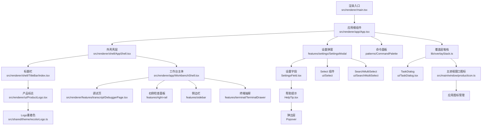

图表来源
- [main.tsx:1-16](file://src/renderer/main.tsx#L1-L16)
- [App.tsx:1-261](file://src/renderer/app/App.tsx#L1-L261)
- [AppShell.tsx:1-21](file://src/renderer/shell/AppShell.tsx#L1-L21)
- [TitleBar/index.tsx:1-141](file://src/renderer/shell/TitleBar/index.tsx#L1-L141)
- [ProductLogo.tsx:1-41](file://src/renderer/ui/ProductLogo.tsx#L1-L41)
- [recolorLogo.ts:1-33](file://src/shared/theme/recolorLogo.ts#L1-L33)
- [productIcon.ts:1-62](file://src/main/window/productIcon.ts#L1-L62)
- [WorkbenchShell.tsx:1-239](file://src/renderer/app/WorkbenchShell.tsx#L1-L239)
- [DebuggerPage.tsx:1-12](file://src/renderer/features/transcript/DebuggerPage.tsx#L1-L12)
- [SettingsModal/index.tsx:1-288](file://src/renderer/features/settings/SettingsModal/index.tsx#L1-L288)
- [SettingsField.tsx:1-48](file://src/renderer/features/settings/SettingsModal/parts/SettingsField.tsx#L1-L48)
- [HelpTip.tsx:1-26](file://src/renderer/ui/HelpTip.tsx#L1-L26)
- [overlayStack.ts:1-68](file://src/renderer/lib/overlayStack.ts#L1-L68)
- [TaskDialog.tsx:1-96](file://src/renderer/ui/TaskDialog.tsx#L1-L96)
- [useModalFocus.ts:1-116](file://src/renderer/lib/useModalFocus.ts#L1-L116)
- [Select/index.tsx:1-298](file://src/renderer/ui/Select/index.tsx#L1-L298)
- [SearchMultiSelect.tsx:1-73](file://src/renderer/ui/SearchMultiSelect.tsx#L1-L73)

章节来源
- [main.tsx:1-16](file://src/renderer/main.tsx#L1-L16)
- [App.tsx:1-261](file://src/renderer/app/App.tsx#L1-L261)
- [AppShell.tsx:1-21](file://src/renderer/shell/AppShell.tsx#L1-L21)

## 核心组件
- 应用根组件 App：负责启动引导、主题解析、窗口控制、IPC 事件桥接、通知与全局模态（设置、知识中心、命令面板），并组合标题栏与工作区主体。**更新** 集成了 ProductLogo 组件用于加载屏幕和品牌展示。
- 工作台外壳 WorkbenchShell：组织左侧导航、主内容区、右侧检查面板、底部 Composer 输入栏与终端抽屉；支持拖拽调整左右面板宽度与窄屏抽屉模式。
- 标题栏 TitleBar：提供左右面板切换按钮、窗口最小化/最大化/关闭控制，具备无障碍标签与禁用态。**更新** 集成了 ProductLogo 组件，显示动态重着色的产品标志。
- 产品标志 ProductLogo：**新增** 支持动态重着色的产品标志组件，使用 Canvas 实时渲染，根据主题强调色改变青绿色调。
- **新增** 帮助提示 HelpTip：提供一致的帮助文本显示和弹出功能，支持键盘导航和屏幕阅读器，通过 Popover 实现智能定位。
- 调试页 DebuggerPage：根据当前 Agent 模式渲染 AgentChat 作为主工作区。
- 设置面板 SettingsModal：以多节导航组织通用、外观、工作区、模型、技能、代理、工具、钩子、策略等设置项，支持运行时概览与连接对话框。**更新** 改进了 AgentListItem 布局和增强资源编辑器布局，集成了 HelpTip 组件提升可访问性。
- **新增** 设置字段 SettingsField：增强的表单字段组件，集成了 HelpTip 帮助提示功能，支持描述文本和帮助提示的统一展示。
- 组合器 useComposer：聚合会话、设备、项目、Agent、上下文用量等信息，封装发送、停止、附件、技能、提示词草稿等能力，暴露控制器给 Composer 使用。
- 布局 useWorkbenchLayout：计算响应式布局、抽屉模式、面板宽度、拖拽逻辑与持久化。
- 覆盖层堆栈 overlayStack：管理嵌套对话框的层级关系，确保只有最顶层的覆盖层能处理 Escape 键和焦点陷阱。
- TaskDialog：可复用的任务导向对话框组件，支持大小变体、忙状态、变体模式（task/alert）。
- ColorPickerSurface：自定义颜色选择器表面，替代浏览器原生颜色选择器，支持 HSV 空间操作。
- CheckPill：轻量级多选控件，现已更新为使用轮廓框与墨色勾选标记，替代强调色填充背景。
- Tabs：增强的标签页组件，支持分段模式和键盘导航。
- useModalFocus：移至 lib 目录并与覆盖层堆栈集成，支持嵌套对话框的焦点管理。
- **新增** Select 组件：统一的选择组件，提供下拉菜单功能，支持多种变体和完整的键盘导航。
- **新增** SearchMultiSelect 组件：用于多项目选择场景，支持搜索、过滤和批量操作。

章节来源
- [App.tsx:1-261](file://src/renderer/app/App.tsx#L1-L261)
- [WorkbenchShell.tsx:1-239](file://src/renderer/app/WorkbenchShell.tsx#L1-L239)
- [TitleBar/index.tsx:1-141](file://src/renderer/shell/TitleBar/index.tsx#L1-L141)
- [ProductLogo.tsx:1-41](file://src/renderer/ui/ProductLogo.tsx#L1-L41)
- [HelpTip.tsx:1-26](file://src/renderer/ui/HelpTip.tsx#L1-L26)
- [DebuggerPage.tsx:1-12](file://src/renderer/features/transcript/DebuggerPage.tsx#L1-L12)
- [SettingsModal/index.tsx:1-288](file://src/renderer/features/settings/SettingsModal/index.tsx#L1-L288)
- [SettingsField.tsx:1-48](file://src/renderer/features/settings/SettingsModal/parts/SettingsField.tsx#L1-L48)
- [useComposer.ts:1-193](file://src/renderer/features/composer/useComposer.ts#L1-L193)
- [useWorkbenchLayout.ts:1-211](file://src/renderer/app/useWorkbenchLayout.ts#L1-L211)
- [overlayStack.ts:1-68](file://src/renderer/lib/overlayStack.ts#L1-L68)
- [TaskDialog.tsx:1-96](file://src/renderer/ui/TaskDialog.tsx#L1-L96)
- [ColorPickerSurface.tsx:1-164](file://src/renderer/ui/ColorPickerSurface.tsx#L1-L164)
- [CheckPill.tsx:1-43](file://src/renderer/ui/CheckPill.tsx#L1-L43)
- [Tabs.tsx:1-121](file://src/renderer/ui/Tabs.tsx#L1-L121)
- [useModalFocus.ts:1-116](file://src/renderer/lib/useModalFocus.ts#L1-L116)
- [Select/index.tsx:1-298](file://src/renderer/ui/Select/index.tsx#L1-L298)
- [SearchMultiSelect.tsx:1-73](file://src/renderer/ui/SearchMultiSelect.tsx#L1-L73)

## 架构总览
渲染层采用"壳 + 面"的分层：AppShell 提供稳定的外壳容器，App 注入业务页面与全局覆盖层；WorkbenchShell 将侧栏、主区域、右侧检查面板与 Composer 组合为工作区；各功能模块通过 stores 与 hooks 共享状态，并通过 IPC 与主进程通信。覆盖层堆栈系统统一管理所有焦点捕获的覆盖层，确保嵌套对话框的正确行为。**更新** 新增了产品品牌系统集成和帮助提示系统，包括渲染器的 ProductLogo 组件、HelpTip 组件和主进程的窗口图标管理。

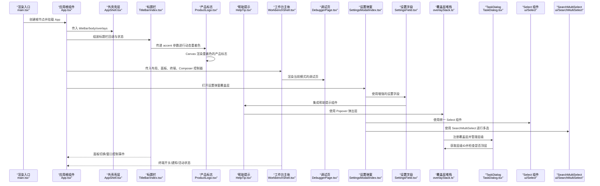

图表来源
- [main.tsx:1-16](file://src/renderer/main.tsx#L1-L16)
- [App.tsx:1-261](file://src/renderer/app/App.tsx#L1-L261)
- [AppShell.tsx:1-21](file://src/renderer/shell/AppShell.tsx#L1-L21)
- [TitleBar/index.tsx:1-141](file://src/renderer/shell/TitleBar/index.tsx#L1-L141)
- [ProductLogo.tsx:1-41](file://src/renderer/ui/ProductLogo.tsx#L1-L41)
- [HelpTip.tsx:1-26](file://src/renderer/ui/HelpTip.tsx#L1-L26)
- [WorkbenchShell.tsx:1-239](file://src/renderer/app/WorkbenchShell.tsx#L1-L239)
- [DebuggerPage.tsx:1-12](file://src/renderer/features/transcript/DebuggerPage.tsx#L1-L12)
- [SettingsModal/index.tsx:1-288](file://src/renderer/features/settings/SettingsModal/index.tsx#L1-L288)
- [SettingsField.tsx:1-48](file://src/renderer/features/settings/SettingsModal/parts/SettingsField.tsx#L1-L48)
- [overlayStack.ts:1-68](file://src/renderer/lib/overlayStack.ts#L1-L68)
- [TaskDialog.tsx:1-96](file://src/renderer/ui/TaskDialog.tsx#L1-L96)
- [Select/index.tsx:1-298](file://src/renderer/ui/Select/index.tsx#L1-L298)
- [SearchMultiSelect.tsx:1-73](file://src/renderer/ui/SearchMultiSelect.tsx#L1-L73)

## 详细组件分析

### 产品标志组件（ProductLogo）
- **新增** 职责：动态重着色的产品标志组件，根据主题强调色实时渲染产品标志。
- 核心功能：
  - 使用 Canvas API 进行像素级图像处理
  - 支持动态重着色，将青绿色调替换为主题强调色
  - 圆形遮罩效果，保持标志的圆形外观
  - 高性能缓存机制，避免重复加载图片
  - 错误处理和降级方案
- 技术实现：
  - 使用 `recolorLogoRgba` 函数进行像素重着色
  - 使用 `maskLogoCircleRgba` 函数应用圆形遮罩
  - 异步加载图片资源，支持错误处理
  - 响应式设计，适配不同尺寸需求

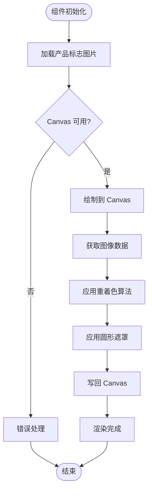

图表来源
- [ProductLogo.tsx:1-41](file://src/renderer/ui/ProductLogo.tsx#L1-L41)
- [recolorLogo.ts:1-33](file://src/shared/theme/recolorLogo.ts#L1-L33)

章节来源
- [ProductLogo.tsx:1-41](file://src/renderer/ui/ProductLogo.tsx#L1-L41)
- [ProductLogo.css:1-8](file://src/renderer/ui/ProductLogo.css#L1-L8)
- [recolorLogo.ts:1-33](file://src/shared/theme/recolorLogo.ts#L1-L33)

### 主进程窗口图标管理
- **新增** 职责：管理应用窗口图标，确保与主题保持一致。
- 核心功能：
  - 监听系统主题变化，自动更新窗口图标
  - 支持打包和非打包环境的资源路径处理
  - 高性能图标缓存机制
  - 错误处理和日志记录
- 技术实现：
  - 使用 Electron 的 nativeImage API 处理图标
  - 复用渲染器的重着色算法，确保视觉一致性
  - 支持 BGRA 格式转换和预乘 alpha 处理
  - 窗口生命周期管理，防止内存泄漏

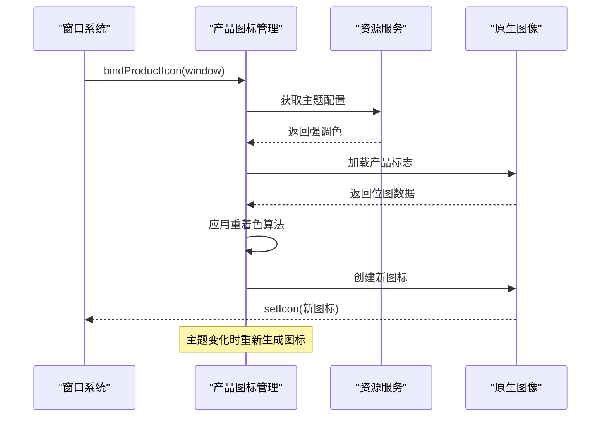

图表来源
- [productIcon.ts:1-62](file://src/main/window/productIcon.ts#L1-L62)
- [recolorLogo.ts:1-33](file://src/shared/theme/recolorLogo.ts#L1-L33)

章节来源
- [productIcon.ts:1-62](file://src/main/window/productIcon.ts#L1-L62)

### 帮助提示组件（HelpTip）
- **新增** 职责：提供一致的帮助文本显示和弹出功能，支持键盘导航和屏幕阅读器。
- 核心功能：
  - 基于 Popover 的智能弹出层，支持自动定位和边界检测
  - 完整的键盘导航支持（Tab、Shift+Tab、Escape）
  - 屏幕阅读器友好，使用适当的 ARIA 属性
  - 鼠标悬停和焦点触发显示
  - 延迟隐藏机制，避免误触关闭
  - 可访问的触发按钮，带有适当的标签和状态
- 技术实现：
  - 使用 React Hooks 管理状态（open、id、timer）
  - 集成 Popover 组件实现弹出层功能
  - 使用 Button 组件作为触发器，支持 ghost 变体
  - 通过 aria-describedby 关联帮助内容和触发器
  - 定时器管理延迟关闭，防止误操作

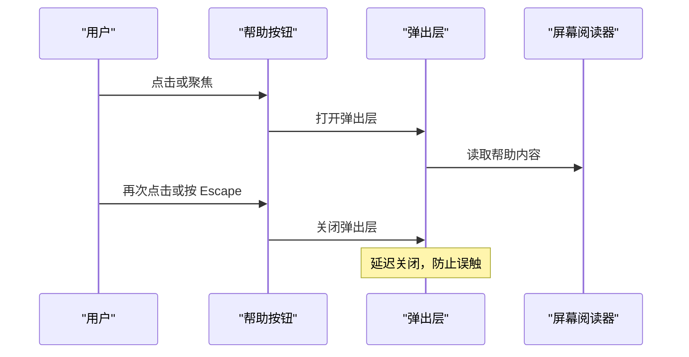

图表来源
- [HelpTip.tsx:1-26](file://src/renderer/ui/HelpTip.tsx#L1-L26)
- [HelpTip.css:1-14](file://src/renderer/ui/HelpTip.css#L1-L14)
- [HelpTip.test.ts:1-35](file://src/renderer/ui/HelpTip.test.ts#L1-L35)

章节来源
- [HelpTip.tsx:1-26](file://src/renderer/ui/HelpTip.tsx#L1-L26)
- [HelpTip.css:1-14](file://src/renderer/ui/HelpTip.css#L1-L14)
- [HelpTip.test.ts:1-35](file://src/renderer/ui/HelpTip.test.ts#L1-L35)

### 设置字段组件（SettingsField）
- **新增** 职责：增强的表单字段组件，集成了 HelpTip 帮助提示功能。
- 核心功能：
  - 支持 label、description、help 三种文本层次
  - 自动集成 HelpTip 组件，当存在 help 属性时显示帮助提示
  - 灵活的布局选项（stack、row）
  - 搜索索引支持，便于设置项查找
  - 完整的无障碍支持，包括 htmlFor 关联
- 技术实现：
  - 条件渲染 HelpTip 组件，仅在存在 help 属性时显示
  - 使用 cn 工具类进行样式组合
  - 支持多种数据类型（ReactNode）的 label 和 description
  - 与 HelpTip 组件无缝集成，提供一致的帮助体验

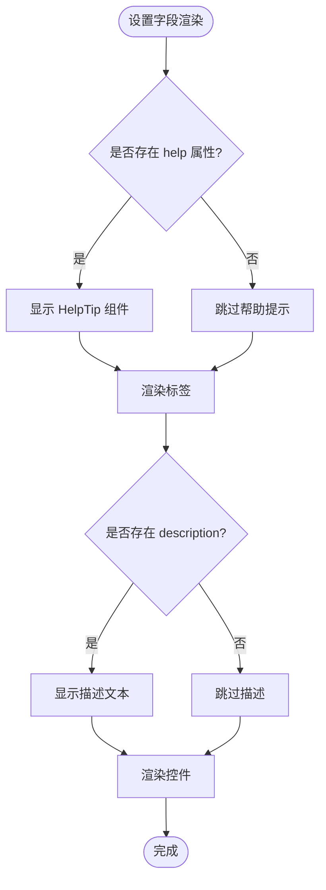

图表来源
- [SettingsField.tsx:1-48](file://src/renderer/features/settings/SettingsModal/parts/SettingsField.tsx#L1-L48)
- [HelpTip.tsx:1-26](file://src/renderer/ui/HelpTip.tsx#L1-L26)

章节来源
- [SettingsField.tsx:1-48](file://src/renderer/features/settings/SettingsModal/parts/SettingsField.tsx#L1-L48)

### 工作台界面（WorkbenchShell）
- 布局与分区：左侧导航（Sidebar）、主内容区（main-page）、右侧检查面板（ControlPanel）、底部 Composer 输入栏、终端抽屉（TerminalDrawer）。
- 响应式与抽屉：在窄屏或自动收起时，左右面板切换为抽屉模式，互斥显示，支持 Escape 关闭与焦点返回。
- 拖拽调整：左右面板可通过 ResizeHandle 拖拽改变宽度，受最小/最大宽度限制，并在松开后持久化。
- 动态样式：通过 CSS 变量注入当前面板宽度与是否折叠状态，避免硬编码尺寸。
- 顶部工具：设备选择器、终端开关（带活动状态徽章）。

图表来源
- [WorkbenchShell.tsx:1-239](file://src/renderer/app/WorkbenchShell.tsx#L1-L239)
- [useWorkbenchLayout.ts:1-211](file://src/renderer/app/useWorkbenchLayout.ts#L1-L211)

章节来源
- [WorkbenchShell.tsx:1-239](file://src/renderer/app/WorkbenchShell.tsx#L1-L239)
- [useWorkbenchLayout.ts:1-211](file://src/renderer/app/useWorkbenchLayout.ts#L1-L211)

### 设置面板（SettingsModal）
- 结构：左侧导航（九项设置），右侧内容区按 activeSection 渲染对应设置区块；支持运行时概览与资源作用域切换（用户/项目）。
- 交互：焦点陷阱、Escape 关闭、点击遮罩关闭；连接对话框独立于主弹窗，支持测试与保存。
- 数据流：通过 useSettingsModal hook 获取并维护各设置草稿与操作回调；与运行时服务交互刷新模型、工具、MCP 等。
- **更新** 改进了 AgentListItem 布局，提供更好的视觉层次和信息密度；增强了资源编辑器布局，支持更复杂的资源配置场景；集成了 HelpTip 组件提升可访问性。

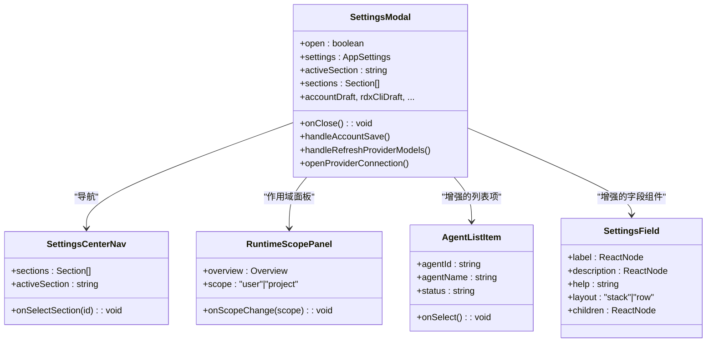

图表来源
- [SettingsModal/index.tsx:1-288](file://src/renderer/features/settings/SettingsModal/index.tsx#L1-L288)
- [SettingsField.tsx:1-48](file://src/renderer/features/settings/SettingsModal/parts/SettingsField.tsx#L1-L48)

章节来源
- [SettingsModal/index.tsx:1-288](file://src/renderer/features/settings/SettingsModal/index.tsx#L1-L288)

### 调试视图（DebuggerPage）
- 职责：根据当前 Agent 模式渲染 AgentChat，承载消息流与 Work Process 展示。
- 集成：由 App 注入当前模式，配合 WorkbenchShell 的主内容区呈现。

章节来源
- [DebuggerPage.tsx:1-12](file://src/renderer/features/transcript/DebuggerPage.tsx#L1-L12)
- [App.tsx:1-261](file://src/renderer/app/App.tsx#L1-L261)

### 标题栏（TitleBar）
- 功能：左侧面板切换、右侧检查面板切换、窗口控制（最小化、最大化/还原、关闭）。
- 可访问性：所有按钮具备 aria-label 与 tooltip；禁用态不可交互；图标随状态变化。
- **更新** 集成了 ProductLogo 组件，在产品品牌区域显示动态重着色的标志。

章节来源
- [TitleBar/index.tsx:1-141](file://src/renderer/shell/TitleBar/index.tsx#L1-L141)
- [TitleBar.css:1-114](file://src/renderer/shell/TitleBar/TitleBar.css#L1-L114)

### 组合器（useComposer）
- 职责：聚合项目、会话、设备、Agent、上下文用量等信息，封装发送、停止、附件、技能、提示词草稿等能力，暴露控制器供 Composer 使用。
- 关键点：
  - 从多个 store 读取状态（项目、会话、布局、设备、设置）。
  - 构建当前模式配置与 Agent 强调色。
  - 计算发送按钮禁用条件与占位文案。
  - 与附件、技能、发送流程协作。

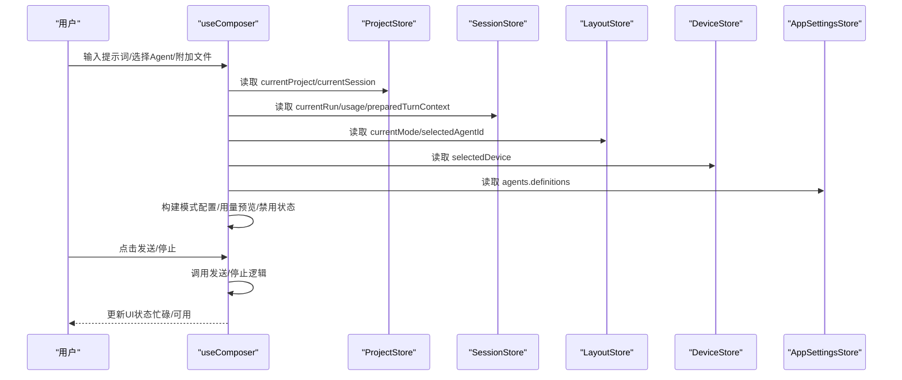

图表来源
- [useComposer.ts:1-193](file://src/renderer/features/composer/useComposer.ts#L1-L193)

章节来源
- [useComposer.ts:1-193](file://src/renderer/features/composer/useComposer.ts#L1-L193)

### 布局与响应式（useWorkbenchLayout）
- 职责：计算左右面板宽度、抽屉模式、拖拽逻辑、最小主内容宽度、持久化布局。
- 关键点：
  - 监听窗口尺寸变化与面板拖拽事件。
  - 根据目标（项目/会话）决定右侧检查面板可见性与模式。
  - 在窄屏或自动收起时切换到抽屉模式，保证主内容可读性。

章节来源
- [useWorkbenchLayout.ts:1-211](file://src/renderer/app/useWorkbenchLayout.ts#L1-L211)

### 覆盖层堆栈系统（Overlay Stack）
- 职责：统一管理所有焦点捕获的覆盖层（应用模态框、任务对话框、确认对话框），确保只有最顶层的覆盖层能处理 Escape 键和 Tab 焦点循环。
- 核心功能：
  - pushOverlayLayer/popOverlayLayer：添加和移除覆盖层
  - isTopOverlayLayer/getOverlayLayerDepth：查询覆盖层状态
  - useOverlayLayer：React hook 用于组件生命周期管理
- 设计原则：单例注册表，有序栈结构，事件驱动通知

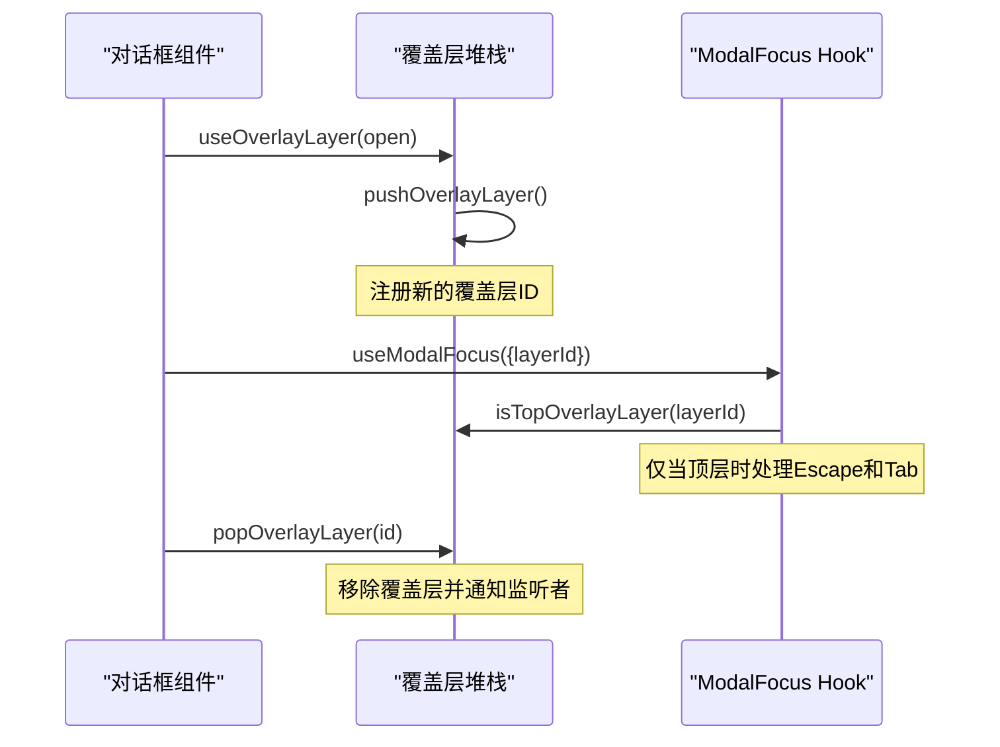

图表来源
- [overlayStack.ts:1-68](file://src/renderer/lib/overlayStack.ts#L1-L68)
- [useModalFocus.ts:1-116](file://src/renderer/lib/useModalFocus.ts#L1-L116)
- [TaskDialog.tsx:1-96](file://src/renderer/ui/TaskDialog.tsx#L1-L96)

章节来源
- [overlayStack.ts:1-68](file://src/renderer/lib/overlayStack.ts#L1-L68)
- [useModalFocus.ts:1-116](file://src/renderer/lib/useModalFocus.ts#L1-L116)

### 任务对话框（TaskDialog）
- 职责：可复用的任务导向子对话框基础组件，固定在页面之上而不替换页面内容。
- 特性：
  - 支持三种尺寸：sm、md、lg
  - 支持忙状态（busy）防止误操作
  - 支持两种变体：task（可关闭）和 alert（alertdialog，无关闭按钮）
  - 集成覆盖层堆栈和焦点管理
  - 完整的无障碍支持（aria-modal、role、labeling）

章节来源
- [TaskDialog.tsx:1-96](file://src/renderer/ui/TaskDialog.tsx#L1-L96)

### 颜色选择器表面（ColorPickerSurface）
- 职责：自定义颜色选择器，替代浏览器原生颜色选择器，提供更一致的跨平台体验。
- 功能：
  - HSV 颜色空间操作
  - 饱和度×明度平面拖拽
  - 色相条拖拽
  - 键盘导航支持（方向键微调，Shift+方向键粗调）
  - 指针捕获确保拖拽稳定性
  - 保持色相条在纯黑/白时的稳定性

章节来源
- [ColorPickerSurface.tsx:1-164](file://src/renderer/ui/ColorPickerSurface.tsx#L1-L164)

### 检查药丸（CheckPill）
- 职责：轻量级多选控件，用于工具权限和知识过滤器等场景。
- **更新** 视觉设计：现已采用轮廓框与墨色勾选标记设计，替代之前的强调色填充背景，实现更好的视觉一致性。
- 特性：
  - 复选框加文本的组合控件
  - 支持次要文本（hint）显示工具用途
  - 完整的无障碍支持（role="checkbox"、aria-checked）
  - 按钮语义，支持键盘操作
  - 使用设计系统的 checkbox 令牌确保主题一致性

章节来源
- [CheckPill.tsx:1-43](file://src/renderer/ui/CheckPill.tsx#L1-L43)
- [CheckPill.css:1-82](file://src/renderer/ui/CheckPill.css#L1-L82)

### 标签页（Tabs）
- 职责：增强的标签页组件，支持多种变体和完整的键盘导航。
- 新功能：
  - 分段模式（segmented）：紧凑的单选控件
  - 增强的键盘导航：左右箭头、Home、End 键
  - 禁用标签的智能跳过
  - 焦点管理：自动聚焦到选中标签

章节来源
- [Tabs.tsx:1-121](file://src/renderer/ui/Tabs.tsx#L1-L121)

### 模态焦点管理（useModalFocus）
- 职责：移至 lib 目录并与覆盖层堆栈集成，提供统一的模态焦点管理。
- 改进：
  - 集成覆盖层堆栈，仅在顶层时处理键盘事件
  - 支持可选的焦点陷阱根元素
  - 更精确的可聚焦元素检测
  - 更好的动画帧优化

章节来源
- [useModalFocus.ts:1-116](file://src/renderer/lib/useModalFocus.ts#L1-L116)

### 统一选择组件（Select）
- **新增** 职责：重构的统一选择组件，替代原有的 DropdownSelect，提供更一致的 API 和更好的可访问性支持。
- 核心功能：
  - 支持 field 和 inline 两种变体
  - 智能菜单定位，支持上下弹出和边界检测
  - 完整的键盘导航（方向键、Enter、Space、Escape）
  - 支持选项分组、禁用状态、颜色标记
  - 与覆盖层堆栈集成，确保正确的焦点管理
  - 响应式设计，自动适配不同屏幕尺寸

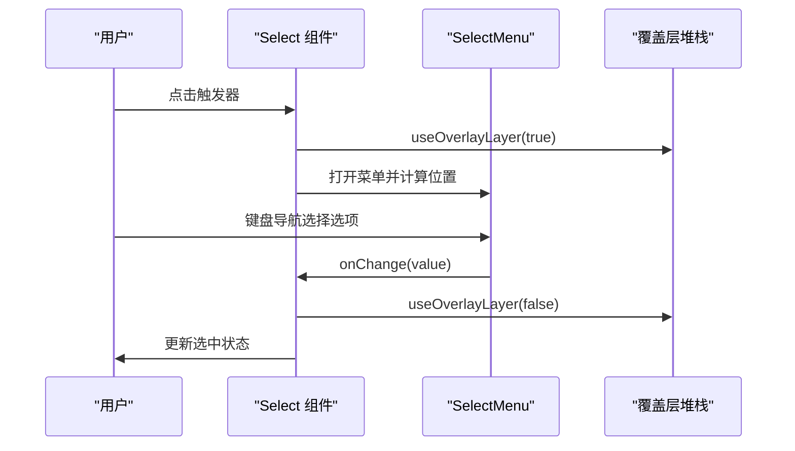

图表来源
- [Select/index.tsx:1-298](file://src/renderer/ui/Select/index.tsx#L1-L298)
- [Select/SelectPrimitives.tsx:1-219](file://src/renderer/ui/Select/SelectPrimitives.tsx#L1-L219)
- [Select/types.ts:1-28](file://src/renderer/ui/Select/types.ts#L1-L28)

章节来源
- [Select/index.tsx:1-298](file://src/renderer/ui/Select/index.tsx#L1-L298)
- [Select/SelectPrimitives.tsx:1-219](file://src/renderer/ui/Select/SelectPrimitives.tsx#L1-L219)
- [Select/types.ts:1-28](file://src/renderer/ui/Select/types.ts#L1-L28)

### 搜索多选组件（SearchMultiSelect）
- **新增** 职责：用于多项目选择场景，支持搜索、过滤和批量操作。
- 核心功能：
  - 实时搜索过滤，支持 label、id、source 字段搜索
  - 多选状态管理，支持去重和唯一性保证
  - 加载状态和错误处理
  - 不可用选项的视觉反馈
  - 完整的无障碍支持
  - 可配置的国际化标签

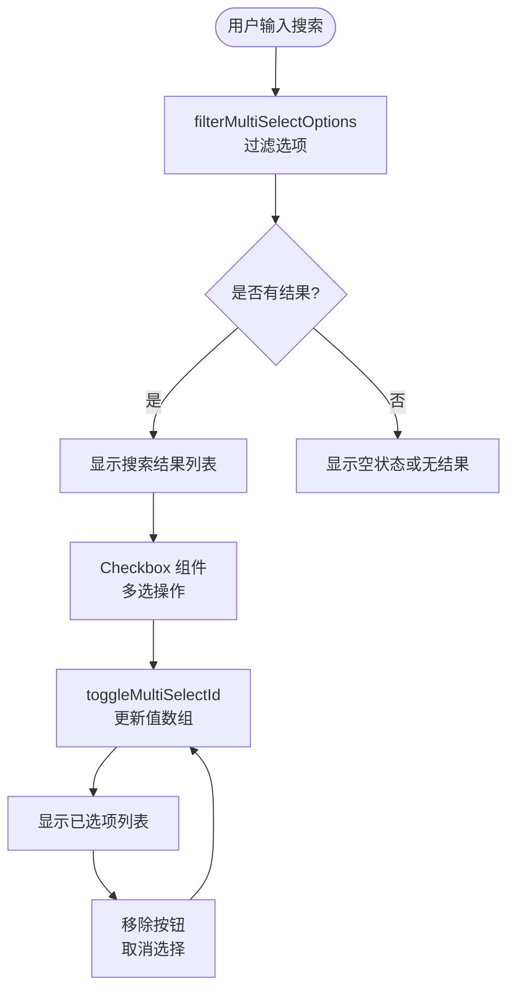

图表来源
- [SearchMultiSelect.tsx:1-73](file://src/renderer/ui/SearchMultiSelect.tsx#L1-L73)
- [searchMultiSelectModel.ts:1-22](file://src/renderer/ui/searchMultiSelectModel.ts#L1-L22)

章节来源
- [SearchMultiSelect.tsx:1-73](file://src/renderer/ui/SearchMultiSelect.tsx#L1-L73)
- [searchMultiSelectModel.ts:1-22](file://src/renderer/ui/searchMultiSelectModel.ts#L1-L22)

## 依赖关系分析
- 组件耦合：App 依赖 AppShell、WorkbenchShell、TitleBar、SettingsModal、DebuggerPage；WorkbenchShell 依赖 Sidebar、Right Rail、Terminal、Composer。
- 状态依赖：useComposer 依赖多个 store（项目、会话、布局、设备、设置），形成横向依赖但职责清晰。
- 外部依赖：IPC 事件桥接用于同步捕获、通知、窗口状态；设计系统 CSS 提供统一 token 与样式基线。
- 覆盖层依赖：TaskDialog 依赖 overlayStack 和 useModalFocus；所有模态组件都通过覆盖层堆栈进行层级管理。
- **新增** 产品品牌依赖：ProductLogo 组件依赖共享的重着色算法；主进程窗口图标管理与渲染器组件共用相同的像素处理逻辑。
- **新增** 帮助提示依赖：HelpTip 组件依赖 Popover 和 Button 组件；SettingsField 组件集成 HelpTip 提供统一的帮助体验。
- **新增** 选择组件依赖：Select 组件依赖覆盖层堆栈和动态样式；SearchMultiSelect 依赖搜索模型和复选框组件。

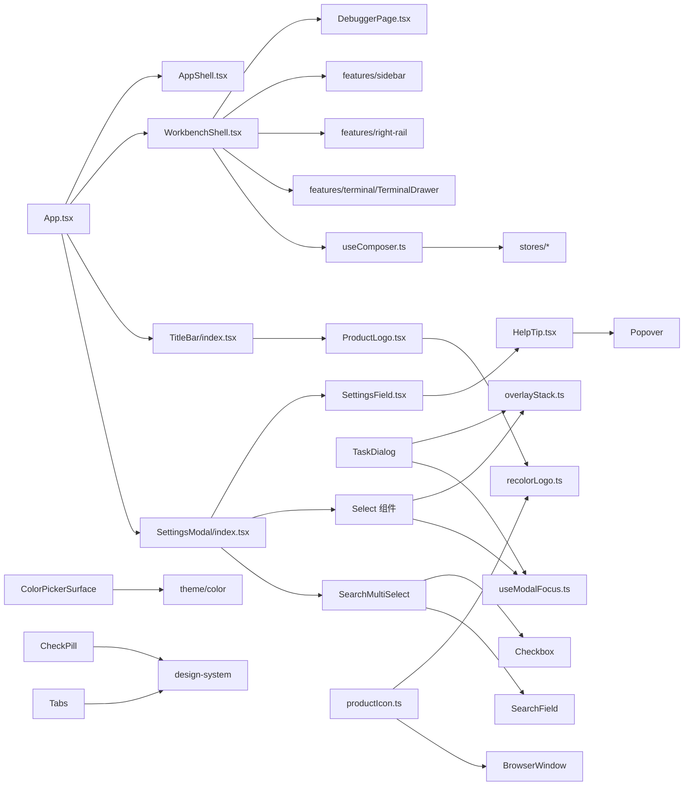

图表来源
- [App.tsx:1-261](file://src/renderer/app/App.tsx#L1-L261)
- [WorkbenchShell.tsx:1-239](file://src/renderer/app/WorkbenchShell.tsx#L1-L239)
- [TitleBar/index.tsx:1-141](file://src/renderer/shell/TitleBar/index.tsx#L1-L141)
- [ProductLogo.tsx:1-41](file://src/renderer/ui/ProductLogo.tsx#L1-L41)
- [recolorLogo.ts:1-33](file://src/shared/theme/recolorLogo.ts#L1-L33)
- [productIcon.ts:1-62](file://src/main/window/productIcon.ts#L1-L62)
- [SettingsModal/index.tsx:1-288](file://src/renderer/features/settings/SettingsModal/index.tsx#L1-L288)
- [SettingsField.tsx:1-48](file://src/renderer/features/settings/SettingsModal/parts/SettingsField.tsx#L1-L48)
- [HelpTip.tsx:1-26](file://src/renderer/ui/HelpTip.tsx#L1-L26)
- [useComposer.ts:1-193](file://src/renderer/features/composer/useComposer.ts#L1-L193)
- [TaskDialog.tsx:1-96](file://src/renderer/ui/TaskDialog.tsx#L1-L96)
- [overlayStack.ts:1-68](file://src/renderer/lib/overlayStack.ts#L1-L68)
- [useModalFocus.ts:1-116](file://src/renderer/lib/useModalFocus.ts#L1-L116)
- [ColorPickerSurface.tsx:1-164](file://src/renderer/ui/ColorPickerSurface.tsx#L1-L164)
- [CheckPill.tsx:1-43](file://src/renderer/ui/CheckPill.tsx#L1-L43)
- [Tabs.tsx:1-121](file://src/renderer/ui/Tabs.tsx#L1-L121)
- [Select/index.tsx:1-298](file://src/renderer/ui/Select/index.tsx#L1-L298)
- [SearchMultiSelect.tsx:1-73](file://src/renderer/ui/SearchMultiSelect.tsx#L1-L73)

章节来源
- [App.tsx:1-261](file://src/renderer/app/App.tsx#L1-L261)
- [WorkbenchShell.tsx:1-239](file://src/renderer/app/WorkbenchShell.tsx#L1-L239)
- [useComposer.ts:1-193](file://src/renderer/features/composer/useComposer.ts#L1-L193)

## 性能与可访问性
- 性能
  - 使用 CSS 变量动态注入面板宽度，减少重排与重绘。
  - 拖拽过程中仅更新状态并在松开后持久化，避免频繁写入。
  - 设计系统限制动画时长与过渡，遵循 reduced-motion 偏好。
  - 覆盖层堆栈使用事件驱动的通知机制，避免不必要的重新渲染。
  - ColorPickerSurface 使用指针捕获确保拖拽性能。
  - **新增** ProductLogo 组件使用 Canvas 缓存机制，避免重复图片加载。
  - **新增** 主进程窗口图标管理使用缓存机制，减少重复处理。
  - **新增** 共享重着色算法，避免代码重复。
  - **新增** HelpTip 组件使用延迟关闭机制，避免频繁的弹出层切换。
  - **新增** Select 组件使用智能定位算法，避免菜单溢出视口。
  - **新增** SearchMultiSelect 使用高效的搜索过滤算法，支持大数据集。
- 可访问性
  - 标题栏按钮具备 aria-label 与 tooltip；禁用态正确传递。
  - 设置弹窗使用 role="dialog"、aria-modal、焦点陷阱与 Escape 关闭。
  - 工作台通知使用 role="status" 与 aria-live 提示。
  - 键盘导航与焦点返回在抽屉与弹窗中保持一致体验。
  - TaskDialog 提供完整的无障碍支持，包括 alertdialog 变体。
  - ColorPickerSurface 支持键盘导航和屏幕阅读器。
  - CheckPill 使用正确的 checkbox 语义，支持键盘操作和无障碍属性。
  - Tabs 支持完整的键盘导航和 ARIA 属性。
  - **新增** ProductLogo 组件使用 canvas 元素，具有适当的无障碍属性。
  - **新增** HelpTip 组件提供完整的键盘导航支持，包括 Tab、Shift+Tab、Escape 键。
  - **新增** HelpTip 组件使用适当的 ARIA 属性，包括 aria-describedby、aria-expanded。
  - **新增** HelpTip 组件支持屏幕阅读器，提供清晰的帮助内容朗读。
  - **新增** Select 组件符合 WAI-ARIA 规范，支持完整的键盘导航。
  - **新增** SearchMultiSelect 提供适当的角色和标签，支持屏幕阅读器。

章节来源
- [TitleBar/index.tsx:1-141](file://src/renderer/shell/TitleBar/index.tsx#L1-L141)
- [SettingsModal/index.tsx:1-288](file://src/renderer/features/settings/SettingsModal/index.tsx#L1-L288)
- [WorkbenchShell.tsx:1-239](file://src/renderer/app/WorkbenchShell.tsx#L1-L239)
- [TaskDialog.tsx:1-96](file://src/renderer/ui/TaskDialog.tsx#L1-L96)
- [ColorPickerSurface.tsx:1-164](file://src/renderer/ui/ColorPickerSurface.tsx#L1-L164)
- [CheckPill.tsx:1-43](file://src/renderer/ui/CheckPill.tsx#L1-L43)
- [CheckPill.css:1-82](file://src/renderer/ui/CheckPill.css#L1-L82)
- [Tabs.tsx:1-121](file://src/renderer/ui/Tabs.tsx#L1-L121)
- [ProductLogo.tsx:1-41](file://src/renderer/ui/ProductLogo.tsx#L1-L41)
- [HelpTip.tsx:1-26](file://src/renderer/ui/HelpTip.tsx#L1-L26)
- [HelpTip.test.ts:1-35](file://src/renderer/ui/HelpTip.test.ts#L1-L35)
- [Select/index.tsx:1-298](file://src/renderer/ui/Select/index.tsx#L1-L298)
- [SearchMultiSelect.tsx:1-73](file://src/renderer/ui/SearchMultiSelect.tsx#L1-L73)

## 故障排查指南
- 面板无法拖拽：检查 effectiveLeftCollapsed/effectiveRightCollapsed 是否为 true；确认 ResizeHandle 的 pointer 事件绑定与 disabled 状态。
- 右侧检查面板不显示：确认 rightRailTarget 与当前项目/会话状态；检查 isRightRailVisible 计算。
- 设置弹窗无法关闭：检查 useModalFocus 的 trap 与 onClose 回调；确认 connectionDraft 未阻止关闭。
- 发送按钮始终禁用：检查 hasMessageContent 与 hasPendingAttachments；确认 isComposerBusy 与 currentRun.status。
- 嵌套对话框问题：确认每个对话框都正确使用 useOverlayLayer；检查 layerId 是否正确传递给 useModalFocus。
- 颜色选择器异常：检查 HSV 值范围；确认 areaRef 和 hueRef 正确引用；验证 hexToHsv/hsvToHex 转换。
- 标签页导航问题：检查 tabs 数组的 id 唯一性；确认 onChange 回调正确更新 value 状态。
- CheckPill 样式问题：确认设计系统 checkbox 令牌正确定义；检查轮廓框与墨色勾选标记的 CSS 变量。
- **新增** ProductLogo 加载失败：检查图片资源路径；确认 Canvas API 可用性；验证重着色算法参数。
- **新增** 主进程图标更新失败：检查资源文件存在性；确认主题配置正确；查看运行时日志输出。
- **新增** HelpTip 弹出层问题：检查 Popover 组件状态；确认触发器事件绑定；验证 aria-describedby 关联。
- **新增** HelpTip 键盘导航问题：检查 Tab 顺序；确认 Escape 键处理；验证焦点管理。
- **新增** Select 组件问题：检查 options 数组格式；确认 value 类型匹配；验证菜单定位计算。
- **新增** SearchMultiSelect 问题：检查 options 数据结构；确认搜索过滤逻辑；验证多选状态管理。

章节来源
- [useWorkbenchLayout.ts:1-211](file://src/renderer/app/useWorkbenchLayout.ts#L1-L211)
- [WorkbenchShell.tsx:1-239](file://src/renderer/app/WorkbenchShell.tsx#L1-L239)
- [SettingsModal/index.tsx:1-288](file://src/renderer/features/settings/SettingsModal/index.tsx#L1-L288)
- [useComposer.ts:1-193](file://src/renderer/features/composer/useComposer.ts#L1-L193)
- [overlayStack.ts:1-68](file://src/renderer/lib/overlayStack.ts#L1-L68)
- [ColorPickerSurface.tsx:1-164](file://src/renderer/ui/ColorPickerSurface.tsx#L1-L164)
- [Tabs.tsx:1-121](file://src/renderer/ui/Tabs.tsx#L1-L121)
- [CheckPill.css:1-82](file://src/renderer/ui/CheckPill.css#L1-L82)
- [ProductLogo.tsx:1-41](file://src/renderer/ui/ProductLogo.tsx#L1-L41)
- [productIcon.ts:1-62](file://src/main/window/productIcon.ts#L1-L62)
- [HelpTip.tsx:1-26](file://src/renderer/ui/HelpTip.tsx#L1-L26)
- [HelpTip.test.ts:1-35](file://src/renderer/ui/HelpTip.test.ts#L1-L35)
- [Select/index.tsx:1-298](file://src/renderer/ui/Select/index.tsx#L1-L298)
- [SearchMultiSelect.tsx:1-73](file://src/renderer/ui/SearchMultiSelect.tsx#L1-L73)

## 结论
RDC-Agent 的 UI 以清晰的壳层与模块化组件组织，结合设计系统与响应式布局，提供了高效的工作台体验。设置面板与调试视图满足专业调试场景需求，状态管理与事件处理机制稳健。**更新** 新增的 HelpTip 组件为设置界面提供了统一的可访问性帮助提示功能，支持键盘导航和屏幕阅读器，显著提升了用户体验。同时新增了 ProductLogo 组件实现了动态重着色功能，能够根据主题强调色实时渲染产品标志，提升了品牌一致性。主进程窗口图标管理得到增强，现在能够与应用主题保持同步。标题栏集成了新的产品品牌元素，进一步改善了用户体验。覆盖层堆栈系统、TaskDialog、ColorPickerSurface 和增强的 Tabs 组件进一步增强了 UI 的一致性和可维护性。共享的重着色算法确保了渲染器和主进程之间的一致性。遵循设计系统的 token 与交互规范，可保障跨平台一致性与可访问性。

## 附录：样式定制与主题配置
- 设计系统权威：语义 token 定义在 design-system.css，组件必须引用 --token-* 而非原始颜色值；字号、间距、圆角、时长均通过变量控制。
- 双体系：全局 Appearance（Light/Dark/System）影响 Shell、Settings、Transcript；Composer 第二套由 Agent accent 派生，用于边框、发送按钮与 Effort 滑条。
- CSP 与安全：生产环境禁止内联 style；动态样式通过 constructable stylesheet 注入。
- 验证命令：check:design-tokens、check:renderer-structure、check:appearance 用于约束样式与结构合规。
- 组件样式：新组件遵循相同的设计系统规范，使用统一的 CSS 类名约定和语义化样式。CheckPill 现在使用设计系统的 checkbox 令牌，确保在不同主题下的一致性表现。
- **新增** ProductLogo 样式：使用 product-logo 命名空间，支持响应式尺寸和圆形裁剪。
- **新增** 标题栏样式：更新了 app-logo 区域的样式，支持产品标志和品牌文字的布局。
- **新增** 帮助提示样式：使用 ui-help-tip 命名空间，包含触发按钮和弹出层的完整样式体系，支持响应式设计和主题变量。
- **新增** 选择组件样式：使用 dropdown-select 命名空间，支持 field 和 inline 变体，包含完整的主题变量支持。
- **新增** 搜索多选样式：使用 ui-search-multi-select 命名空间，支持搜索、选择和状态显示的完整样式体系。

章节来源
- [design-system.md:1-298](file://docs/ui/design-system.md#L1-L298)
- [design-system.css:1-919](file://src/renderer/styles/design-system.css#L1-L919)
- [CheckPill.css:1-82](file://src/renderer/ui/CheckPill.css#L1-L82)
- [ProductLogo.css:1-8](file://src/renderer/ui/ProductLogo.css#L1-L8)
- [TitleBar.css:1-114](file://src/renderer/shell/TitleBar/TitleBar.css#L1-L114)
- [HelpTip.css:1-14](file://src/renderer/ui/HelpTip.css#L1-L14)
- [Select/index.tsx:1-298](file://src/renderer/ui/Select/index.tsx#L1-L298)
- [SearchMultiSelect.tsx:1-73](file://src/renderer/ui/SearchMultiSelect.tsx#L1-L73)