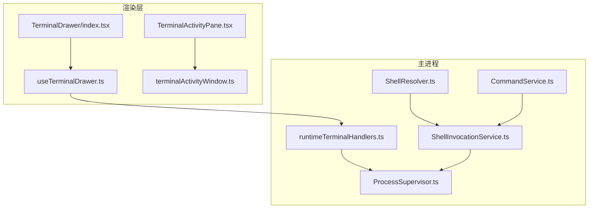
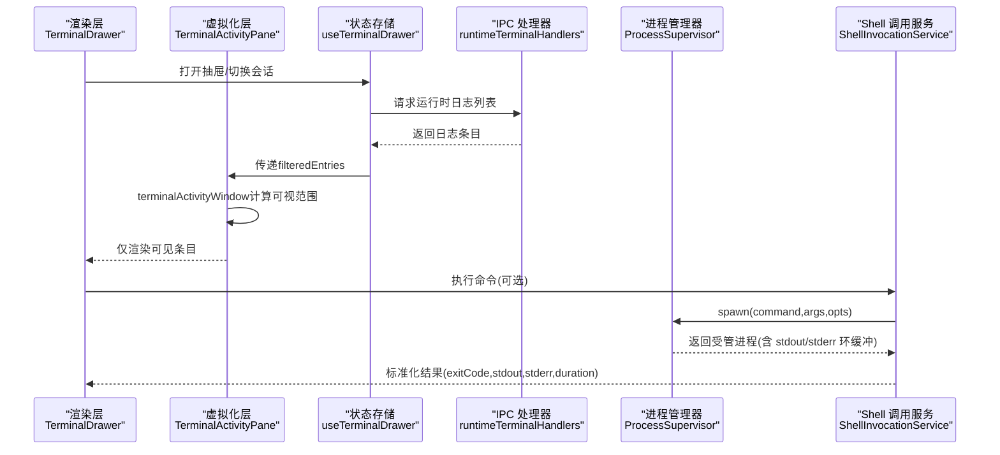
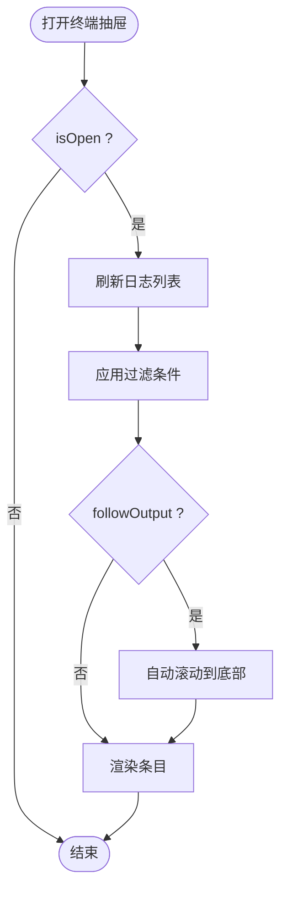
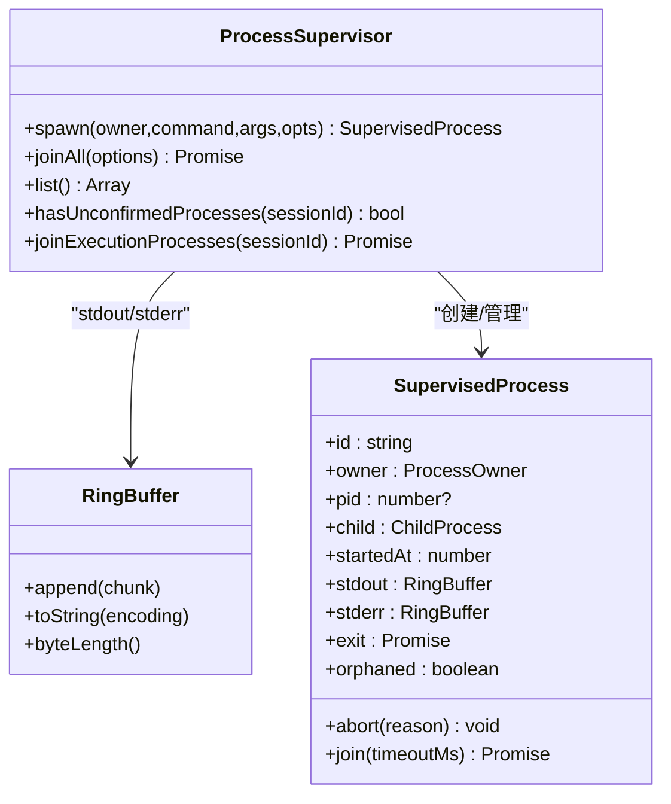
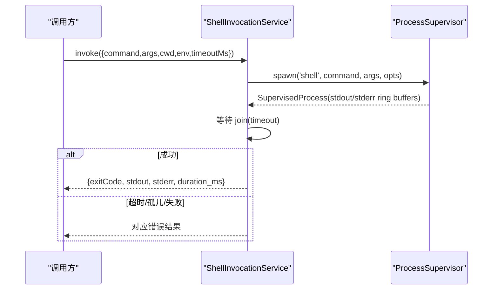
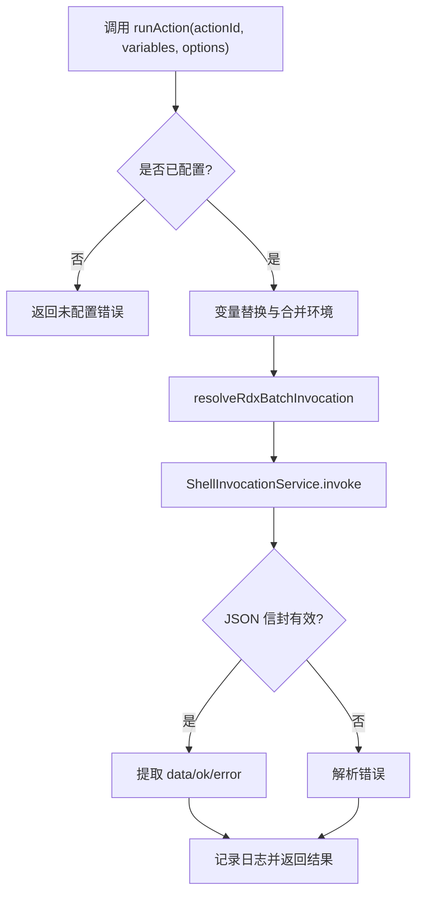
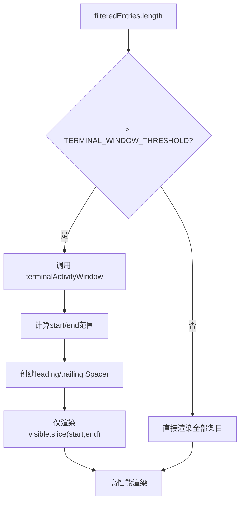
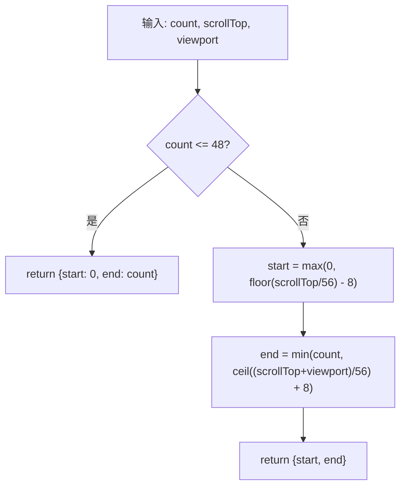
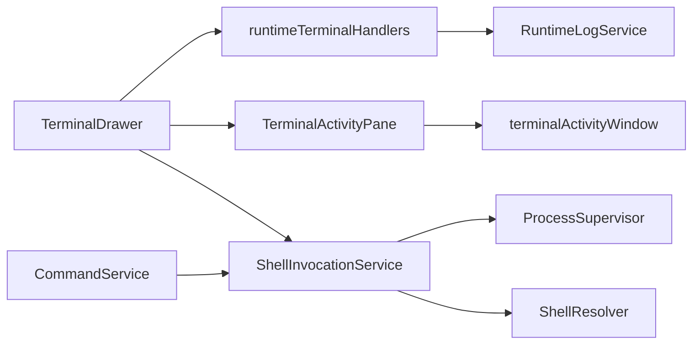

# 终端抽屉

<cite>
**本文引用的文件**
- [src/renderer/features/terminal/TerminalDrawer/index.tsx](file://src/renderer/features/terminal/TerminalDrawer/index.tsx)
- [src/renderer/features/terminal/TerminalDrawer/useTerminalDrawer.ts](file://src/renderer/features/terminal/TerminalDrawer/useTerminalDrawer.ts)
- [src/renderer/features/terminal/TerminalDrawer/TerminalActivityPane.tsx](file://src/renderer/features/terminal/TerminalDrawer/TerminalActivityPane.tsx)
- [src/renderer/features/terminal/TerminalDrawer/terminalActivityWindow.ts](file://src/renderer/features/terminal/TerminalDrawer/terminalActivityWindow.ts)
- [src/renderer/features/terminal/TerminalDrawer/terminalActivityWindow.test.ts](file://src/renderer/features/terminal/TerminalDrawer/terminalActivityWindow.test.ts)
- [src/main/ipc/runtimeTerminalHandlers.ts](file://src/main/ipc/runtimeTerminalHandlers.ts)
- [src/main/runtime/ProcessSupervisor.ts](file://src/main/runtime/ProcessSupervisor.ts)
- [src/main/tools/ShellInvocationService.ts](file://src/main/tools/ShellInvocationService.ts)
- [src/main/tools/RdxShellActionService.ts](file://src/main/tools/RdxShellActionService.ts)
- [src/main/runtime/ShellResolver.ts](file://src/main/runtime/ShellResolver.ts)
- [src/main/commands/CommandService.ts](file://src/main/commands/CommandService.ts)
</cite>

## 更新摘要
**所做更改**
- 新增虚拟化渲染章节，详细说明TerminalActivityPane的windowed rendering实现
- 更新性能考虑部分，包含虚拟化渲染的性能优化细节
- 添加terminalActivityWindow模块的技术说明和测试覆盖
- 增强架构总览图，展示虚拟化渲染的数据流

## 目录
1. [简介](#简介)
2. [项目结构](#项目结构)
3. [核心组件](#核心组件)
4. [架构总览](#架构总览)
5. [详细组件分析](#详细组件分析)
6. [虚拟化渲染系统](#虚拟化渲染系统)
7. [依赖关系分析](#依赖关系分析)
8. [性能考虑](#性能考虑)
9. [故障排查指南](#故障排查指南)
10. [结论](#结论)
11. [附录](#附录)

## 简介
本文件面向 RDC-Agent 的"终端抽屉"功能，聚焦内置终端的启动、管理与交互。内容涵盖：
- 命令执行与输出显示机制
- 错误处理与异常恢复
- 终端会话生命周期、进程管理与资源清理
- 自定义命令集成、脚本执行与环境配置
- **虚拟化渲染技术**以高效处理大量终端活动
- 使用最佳实践与性能优化建议

该能力由渲染层（React）与主进程（Electron）协同实现：渲染层提供 UI 与状态管理，主进程负责进程调度、日志采集与命令执行。**最新改进包括虚拟化渲染技术，能够高效处理数千个终端条目，显著提升性能。**

## 项目结构
终端抽屉位于渲染层的 features/terminal/TerminalDrawer 目录下，包含入口组件、视图模型 Hook、工具栏与活动面板等。主进程侧通过 IPC 暴露运行时日志查询接口，并通过进程管理器与 Shell 调用服务支撑命令执行与输出缓冲。

**图表来源**
- [src/renderer/features/terminal/TerminalDrawer/index.tsx:1-21](file://src/renderer/features/terminal/TerminalDrawer/index.tsx#L1-L21)
- [src/renderer/features/terminal/TerminalDrawer/useTerminalDrawer.ts:1-138](file://src/renderer/features/terminal/TerminalDrawer/useTerminalDrawer.ts#L1-L138)
- [src/renderer/features/terminal/TerminalDrawer/TerminalActivityPane.tsx:1-168](file://src/renderer/features/terminal/TerminalDrawer/TerminalActivityPane.tsx#L1-L168)
- [src/renderer/features/terminal/TerminalDrawer/terminalActivityWindow.ts:1-17](file://src/renderer/features/terminal/TerminalDrawer/terminalActivityWindow.ts#L1-L17)
- [src/main/ipc/runtimeTerminalHandlers.ts:1-18](file://src/main/ipc/runtimeTerminalHandlers.ts#L1-L18)
- [src/main/runtime/ProcessSupervisor.ts:1-425](file://src/main/runtime/ProcessSupervisor.ts#L1-L425)
- [src/main/tools/ShellInvocationService.ts:1-127](file://src/main/tools/ShellInvocationService.ts#L1-L127)
- [src/main/runtime/ShellResolver.ts:1-288](file://src/main/runtime/ShellResolver.ts#L1-L288)
- [src/main/commands/CommandService.ts:1-74](file://src/main/commands/CommandService.ts#L1-L74)

**章节来源**
- [src/renderer/features/terminal/TerminalDrawer/index.tsx:1-21](file://src/renderer/features/terminal/TerminalDrawer/index.tsx#L1-L21)
- [src/main/ipc/runtimeTerminalHandlers.ts:1-18](file://src/main/ipc/runtimeTerminalHandlers.ts#L1-L18)

## 核心组件
- 渲染层 TerminalDrawer：组合壳层、工具栏与活动面板，驱动终端抽屉展示与交互。
- useTerminalDrawer：聚合终端状态、过滤、复制、跟随滚动等行为，并触发刷新。
- **TerminalActivityPane：实现虚拟化渲染，高效处理大量终端活动列表。**
- **terminalActivityWindow：虚拟化窗口计算核心算法，支持动态可视区域管理。**
- 主进程 runtimeTerminalHandlers：注册 IPC 处理器，提供运行时日志列表查询。
- ProcessSupervisor：统一子进程注册表，带环形缓冲区、超时、强制终止与孤儿进程保护。
- ShellInvocationService：封装命令调用，基于 ProcessSupervisor 执行并返回标准化结果。
- ShellResolver：自动探测可用 Shell（PowerShell/zsh/bash/sh），生成非交互式参数。
- CommandService：命令执行桥接，将执行结果转换为系统消息供渲染层展示。

**章节来源**
- [src/renderer/features/terminal/TerminalDrawer/index.tsx:1-21](file://src/renderer/features/terminal/TerminalDrawer/index.tsx#L1-L21)
- [src/renderer/features/terminal/TerminalDrawer/useTerminalDrawer.ts:1-138](file://src/renderer/features/terminal/TerminalDrawer/useTerminalDrawer.ts#L1-L138)
- [src/renderer/features/terminal/TerminalDrawer/TerminalActivityPane.tsx:1-168](file://src/renderer/features/terminal/TerminalDrawer/TerminalActivityPane.tsx#L1-L168)
- [src/renderer/features/terminal/TerminalDrawer/terminalActivityWindow.ts:1-17](file://src/renderer/features/terminal/TerminalDrawer/terminalActivityWindow.ts#L1-L17)
- [src/main/ipc/runtimeTerminalHandlers.ts:1-18](file://src/main/ipc/runtimeTerminalHandlers.ts#L1-L18)
- [src/main/runtime/ProcessSupervisor.ts:1-425](file://src/main/runtime/ProcessSupervisor.ts#L1-L425)
- [src/main/tools/ShellInvocationService.ts:1-127](file://src/main/tools/ShellInvocationService.ts#L1-L127)
- [src/main/runtime/ShellResolver.ts:1-288](file://src/main/runtime/ShellResolver.ts#L1-L288)
- [src/main/commands/CommandService.ts:1-74](file://src/main/commands/CommandService.ts#L1-L74)

## 架构总览
终端抽屉采用"渲染层状态 + 主进程执行"的分层架构，**新增虚拟化渲染层以优化大量数据的显示性能**：
- 渲染层负责 UI 呈现、用户输入、过滤与复制等交互。
- **虚拟化渲染层智能管理可视区域，仅渲染当前可见的终端条目，大幅提升性能。**
- 主进程通过 IPC 暴露日志查询；命令执行由 ShellInvocationService 委托给 ProcessSupervisor 完成。
- ShellResolver 确保跨平台可执行的 Shell 选择与非交互式参数构造。
- 所有子进程输出通过环形缓冲区限制内存占用，支持超时与强制终止，避免僵尸进程。

**图表来源**
- [src/renderer/features/terminal/TerminalDrawer/useTerminalDrawer.ts:1-138](file://src/renderer/features/terminal/TerminalDrawer/useTerminalDrawer.ts#L1-L138)
- [src/renderer/features/terminal/TerminalDrawer/TerminalActivityPane.tsx:1-168](file://src/renderer/features/terminal/TerminalDrawer/TerminalActivityPane.tsx#L1-L168)
- [src/renderer/features/terminal/TerminalDrawer/terminalActivityWindow.ts:1-17](file://src/renderer/features/terminal/TerminalDrawer/terminalActivityWindow.ts#L1-L17)
- [src/main/ipc/runtimeTerminalHandlers.ts:1-18](file://src/main/ipc/runtimeTerminalHandlers.ts#L1-L18)
- [src/main/tools/ShellInvocationService.ts:1-127](file://src/main/tools/ShellInvocationService.ts#L1-L127)
- [src/main/runtime/ProcessSupervisor.ts:1-425](file://src/main/runtime/ProcessSupervisor.ts#L1-L425)

## 详细组件分析

### 渲染层：TerminalDrawer 与状态管理
- 入口组件组合壳层、工具栏与活动面板，驱动整体布局。
- Hook 聚合以下职责：
  - 监听抽屉开关与会话/运行 ID 变化，触发日志刷新。
  - 维护过滤条件（命名空间、严重级别、密度、查询）、跟随输出滚动。
  - 提供复制条目、关闭抽屉等交互。
  - 通过 IPC 获取运行时日志列表，并在渲染层进行筛选与展示。

**图表来源**
- [src/renderer/features/terminal/TerminalDrawer/useTerminalDrawer.ts:1-138](file://src/renderer/features/terminal/TerminalDrawer/useTerminalDrawer.ts#L1-L138)

**章节来源**
- [src/renderer/features/terminal/TerminalDrawer/index.tsx:1-21](file://src/renderer/features/terminal/TerminalDrawer/index.tsx#L1-L21)
- [src/renderer/features/terminal/TerminalDrawer/useTerminalDrawer.ts:1-138](file://src/renderer/features/terminal/TerminalDrawer/useTerminalDrawer.ts#L1-L138)

### 主进程：IPC 与日志查询
- 注册 IPC 处理器，接收运行时日志列表请求，校验入参后调用日志服务返回条目。
- 用于终端抽屉在打开时拉取当前会话/运行的日志。

**章节来源**
- [src/main/ipc/runtimeTerminalHandlers.ts:1-18](file://src/main/ipc/runtimeTerminalHandlers.ts#L1-L18)

### 进程管理：ProcessSupervisor
- 统一子进程注册表，支持：
  - 跨平台进程组隔离与树级终止（POSIX 使用进程组信号，Windows 使用 taskkill）。
  - 标准输出/错误环形缓冲区，默认每流 256 KiB，防止内存膨胀。
  - 超时控制、AbortSignal 取消、优雅宽限期后强制 SIGKILL。
  - 孤儿进程检测与保留，直到 close 事件确认，避免资源泄漏。
- 对外暴露 join/joinAll/list 等方法，便于上层等待或批量终止。

**图表来源**
- [src/main/runtime/ProcessSupervisor.ts:1-425](file://src/main/runtime/ProcessSupervisor.ts#L1-L425)

**章节来源**
- [src/main/runtime/ProcessSupervisor.ts:1-425](file://src/main/runtime/ProcessSupervisor.ts#L1-L425)

### 命令执行：ShellInvocationService
- 封装命令执行流程：
  - 根据平台决定是否启用 shell（Windows 下 .bat/.cmd）。
  - 注入环境变量（如 PYTHONIOENCODING），设置工作目录与超时。
  - 通过 ProcessSupervisor.spawn 启动进程，收集 stdout/stderr 并计算退出码。
  - 区分 spawn_failed、timeout、unconfirmed_orphan 等失败原因，返回标准化 CLIResult。
  - 维护活跃进程映射，支持按 runId 中止与全局终止。

**图表来源**
- [src/main/tools/ShellInvocationService.ts:1-127](file://src/main/tools/ShellInvocationService.ts#L1-L127)
- [src/main/runtime/ProcessSupervisor.ts:1-425](file://src/main/runtime/ProcessSupervisor.ts#L1-L425)

**章节来源**
- [src/main/tools/ShellInvocationService.ts:1-127](file://src/main/tools/ShellInvocationService.ts#L1-L127)

### Shell 解析：ShellResolver
- 自动探测可用 Shell：
  - Windows：优先 PowerShell 7 (pwsh)，其次 Windows PowerShell 5.1，最后 /bin/bash 或 /bin/sh。
  - POSIX：优先 $SHELL（限定为 zsh/bash/sh/dash），再回退到常见路径。
  - 排除不支持的交互式 Shell（fish/csh/nu 等）。
- 生成非交互式参数：
  - PowerShell：-NoProfile -NonInteractive -EncodedCommand。
  - POSIX sh：-lc <command>。
- 提供版本探测与缓存，避免重复探测开销。

**章节来源**
- [src/main/runtime/ShellResolver.ts:1-288](file://src/main/runtime/ShellResolver.ts#L1-L288)

### 命令桥接：CommandService
- 将命令执行结果包装为 ConversationMessage，附带 workTrace 块，便于渲染层以统一方式展示命令执行上下文与结果。
- 从输入中解析命令名，构建系统消息标题与摘要。

**章节来源**
- [src/main/commands/CommandService.ts:1-74](file://src/main/commands/CommandService.ts#L1-L74)

### 自定义命令与脚本执行
- RDX Shell Action 服务支持通过配置化动作执行外部脚本或命令：
  - 变量替换：workspaceRoot、logsPath、projectsPath、knowledgePath 等。
  - 环境注入：合并 action.env 与 options.env，支持变量插值。
  - 批处理解析：resolveRdxBatchInvocation 将命令与参数规范化。
  - 结果解析：要求标准 JSON 信封，否则视为错误；错误信息结构化并记录日志。
  - 诊断信息：分类、修复提示、失败步骤、RenderDoc 状态等。

**图表来源**
- [src/main/tools/RdxShellActionService.ts:1-278](file://src/main/tools/RdxShellActionService.ts#L1-L278)
- [src/main/tools/ShellInvocationService.ts:1-127](file://src/main/tools/ShellInvocationService.ts#L1-L127)

**章节来源**
- [src/main/tools/RdxShellActionService.ts:1-278](file://src/main/tools/RdxShellActionService.ts#L1-L278)

## 虚拟化渲染系统

### TerminalActivityPane 虚拟化实现
TerminalActivityPane 组件实现了高效的虚拟化渲染技术，专门用于处理大量终端活动条目的显示需求：

**核心特性：**
- **阈值判断**：当条目数量超过 TERMINAL_WINDOW_THRESHOLD（48个）时自动启用虚拟化
- **可视区域计算**：基于滚动位置和视口高度，精确计算当前应显示的条目范围
- **虚拟占位符**：使用 TerminalSpacer 组件创建视觉占位，保持滚动条的正确行为
- **增量渲染**：仅渲染当前可视范围内的条目，大幅减少 DOM 节点数量

**性能优化策略：**
- **过扫描（Overscan）**：在可视区域上下额外渲染 TERMINAL_WINDOW_OVERSCAN（8个）条目，提升滚动流畅度
- **估算高度**：使用 TERMINAL_ENTRY_ESTIMATE（56px）作为条目高度估算，避免精确测量开销
- **防抖更新**：通过 useCallback 和状态比较，避免不必要的重渲染

**图表来源**
- [src/renderer/features/terminal/TerminalDrawer/TerminalActivityPane.tsx:38-82](file://src/renderer/features/terminal/TerminalDrawer/TerminalActivityPane.tsx#L38-L82)

### terminalActivityWindow 核心算法
terminalActivityWindow 函数是虚拟化渲染的核心算法，负责计算当前应显示的条目范围：

**算法逻辑：**
- 当条目数 ≤ 48 时，返回完整范围 {start: 0, end: count}
- 否则基于滚动位置计算可视范围：
  - start = max(0, floor(scrollTop / estimate) - overscan)
  - end = min(count, ceil((scrollTop + viewport) / estimate) + overscan)

**关键参数：**
- `TERMINAL_WINDOW_THRESHOLD = 48`：虚拟化启用的阈值
- `TERMINAL_ENTRY_ESTIMATE = 56`：单个条目的估算高度（像素）
- `TERMINAL_WINDOW_OVERSCAN = 8`：可视区域外的预渲染条目数

**测试覆盖：**
- 短列表完全可访问性测试
- 长列表虚拟化无数据丢失测试
- 顶部、底部、中间位置的边界情况测试

**图表来源**
- [src/renderer/features/terminal/TerminalDrawer/terminalActivityWindow.ts:5-16](file://src/renderer/features/terminal/TerminalDrawer/terminalActivityWindow.ts#L5-L16)

**章节来源**
- [src/renderer/features/terminal/TerminalDrawer/TerminalActivityPane.tsx:1-168](file://src/renderer/features/terminal/TerminalDrawer/TerminalActivityPane.tsx#L1-L168)
- [src/renderer/features/terminal/TerminalDrawer/terminalActivityWindow.ts:1-17](file://src/renderer/features/terminal/TerminalDrawer/terminalActivityWindow.ts#L1-L17)
- [src/renderer/features/terminal/TerminalDrawer/terminalActivityWindow.test.ts:1-27](file://src/renderer/features/terminal/TerminalDrawer/terminalActivityWindow.test.ts#L1-L27)

## 依赖关系分析
- 渲染层依赖 IPC 获取日志，依赖状态存储管理过滤与视图行为。
- **虚拟化层依赖 terminalActivityWindow 算法进行可视区域计算。**
- 主进程 IPC 依赖日志服务；命令执行依赖 ShellInvocationService。
- ShellInvocationService 依赖 ProcessSupervisor 进行进程生命周期管理。
- ShellResolver 为 Shell 选择与参数构造提供基础能力。
- CommandService 作为命令执行的结果适配层，向上游提供统一的消息格式。

**图表来源**
- [src/renderer/features/terminal/TerminalDrawer/useTerminalDrawer.ts:1-138](file://src/renderer/features/terminal/TerminalDrawer/useTerminalDrawer.ts#L1-L138)
- [src/renderer/features/terminal/TerminalDrawer/TerminalActivityPane.tsx:1-168](file://src/renderer/features/terminal/TerminalDrawer/TerminalActivityPane.tsx#L1-L168)
- [src/renderer/features/terminal/TerminalDrawer/terminalActivityWindow.ts:1-17](file://src/renderer/features/terminal/TerminalDrawer/terminalActivityWindow.ts#L1-L17)
- [src/main/ipc/runtimeTerminalHandlers.ts:1-18](file://src/main/ipc/runtimeTerminalHandlers.ts#L1-L18)
- [src/main/tools/ShellInvocationService.ts:1-127](file://src/main/tools/ShellInvocationService.ts#L1-L127)
- [src/main/runtime/ProcessSupervisor.ts:1-425](file://src/main/runtime/ProcessSupervisor.ts#L1-L425)
- [src/main/runtime/ShellResolver.ts:1-288](file://src/main/runtime/ShellResolver.ts#L1-L288)
- [src/main/commands/CommandService.ts:1-74](file://src/main/commands/CommandService.ts#L1-L74)

**章节来源**
- [src/main/tools/ShellInvocationService.ts:1-127](file://src/main/tools/ShellInvocationService.ts#L1-L127)
- [src/main/runtime/ProcessSupervisor.ts:1-425](file://src/main/runtime/ProcessSupervisor.ts#L1-L425)

## 性能考虑
- **虚拟化渲染优化**：
  - 当终端活动超过48个时自动启用虚拟化，仅渲染可视区域的条目
  - 使用估算高度（56px）避免精确测量开销，提升滚动性能
  - 过扫描技术（额外渲染8个条目）确保滚动流畅性
  - 虚拟占位符保持正确的滚动行为和用户体验
- 输出缓冲限制：stdout/stderr 使用环形缓冲区，默认每流 256 KiB，避免长时间运行命令导致内存增长。
- 超时与强制终止：为命令执行设置超时，必要时发送 SIGTERM，宽限期后 SIGKILL，减少卡死风险。
- 进程组隔离：POSIX 下使用独立进程组，便于一次性终止整个进程树；Windows 使用 taskkill /T。
- Shell 探测缓存：ShellResolver 对已探测的 Shell 进行缓存，减少重复探测开销。
- 渲染层跟随滚动：仅在开启 followOutput 时自动滚动，降低频繁重排成本。
- 批量终止：joinAll 在应用关闭时统一终止所有受管进程，保证资源释放。

## 故障排查指南
- 无法找到可用 Shell：
  - 现象：抛出 SHELL_UNAVAILABLE。
  - 排查：检查 PATH、$SHELL、WindowsApps 别名；确认存在 pwsh/powershell/zsh/bash/sh。
  - 参考：ShellResolver 的候选列表与断言逻辑。
- 命令执行超时：
  - 现象：返回 timeout，退出码 124。
  - 排查：增大 timeoutMs；检查命令是否阻塞；查看 stderr 输出。
- 进程未确认退出（孤儿）：
  - 现象：返回 unconfirmed_orphan，进程被隔离。
  - 排查：检查父进程是否正常；观察 child.close 事件；必要时手动终止。
- 命令未配置：
  - 现象：RDX action 未配置，返回 action_not_configured。
  - 排查：在设置中启用并配置命令与参数。
- 输出为空或解析失败：
  - 现象：RDX action 需要标准 JSON 信封，否则报错。
  - 排查：确保命令输出符合规范；检查 stdout/stderr 内容。
- **虚拟化渲染问题**：
  - 现象：大量终端活动时界面卡顿或内存溢出。
  - 排查：确认虚拟化阈值设置合理；检查滚动事件监听是否正确；验证条目高度估算准确性。
  - 优化：调整 TERMINAL_WINDOW_THRESHOLD、TERMINAL_ENTRY_ESTIMATE、TERMINAL_WINDOW_OVERSCAN 参数。

**章节来源**
- [src/main/runtime/ShellResolver.ts:1-288](file://src/main/runtime/ShellResolver.ts#L1-L288)
- [src/main/tools/ShellInvocationService.ts:1-127](file://src/main/tools/ShellInvocationService.ts#L1-L127)
- [src/main/runtime/ProcessSupervisor.ts:1-425](file://src/main/runtime/ProcessSupervisor.ts#L1-L425)
- [src/main/tools/RdxShellActionService.ts:1-278](file://src/main/tools/RdxShellActionService.ts#L1-L278)
- [src/renderer/features/terminal/TerminalDrawer/terminalActivityWindow.ts:1-17](file://src/renderer/features/terminal/TerminalDrawer/terminalActivityWindow.ts#L1-L17)

## 结论
终端抽屉通过清晰的渲染层与主进程分工，实现了可靠的命令执行、输出显示与错误处理。**最新的虚拟化渲染技术显著提升了处理大量终端活动的性能，能够高效处理数千个终端条目而不会造成界面卡顿或内存溢出。** ProcessSupervisor 提供了健壮的进程生命周期管理，ShellResolver 确保了跨平台 Shell 可用性，CommandService 与 RDX Shell Action 服务则扩展了命令集与脚本执行能力。结合环形缓冲、超时、强制终止策略以及虚拟化渲染技术，系统在性能与稳定性之间取得平衡。建议在生产环境中合理配置超时、监控孤儿进程、调整虚拟化参数，并遵循最小权限原则配置环境变量与工作目录。

## 附录
- 使用最佳实践
  - 为长耗时命令设置合理的 timeoutMs，避免阻塞界面。
  - 使用 ShellResolver 生成的非交互式参数执行脚本，确保稳定输出。
  - 在 Windows 上避免使用 WindowsApps 别名路径，直接使用真实二进制。
  - 对敏感环境变量进行最小化注入，避免泄露。
  - 利用过滤与查询快速定位日志条目，提升调试效率。
  - **对于大量终端活动，虚拟化渲染会自动启用，无需手动干预。**
- 性能优化建议
  - 合理设置环形缓冲区大小，平衡内存与历史回溯需求。
  - 避免频繁刷新日志列表，按需触发。
  - 批量终止进程时使用 joinAll，确保有序释放资源。
  - **调整虚拟化参数以优化特定场景下的性能表现。**
  - **监控大量终端活动时的内存使用情况，必要时调整阈值设置。**
- **虚拟化渲染调优指南**
  - TERMINAL_WINDOW_THRESHOLD：控制虚拟化启用的条目数量阈值
  - TERMINAL_ENTRY_ESTIMATE：条目高度估算值，影响滚动计算精度
  - TERMINAL_WINDOW_OVERSCAN：可视区域外的预渲染条目数，影响滚动流畅度
  - 可根据具体设备性能和终端活动特点调整这些参数以获得最佳体验