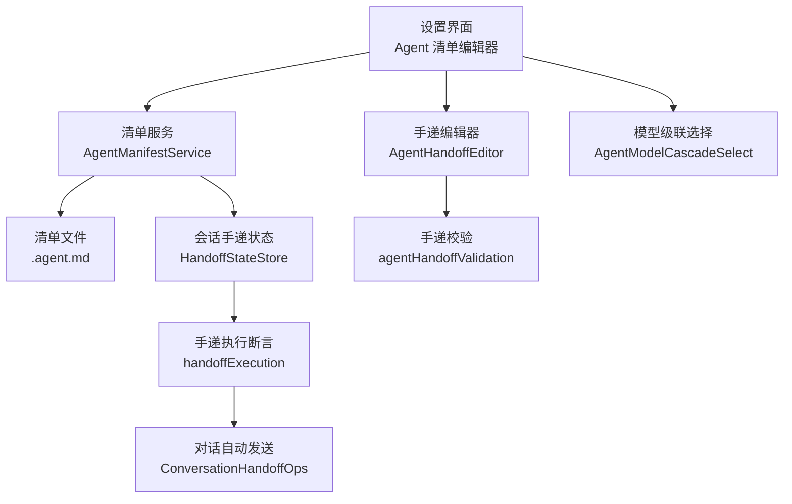
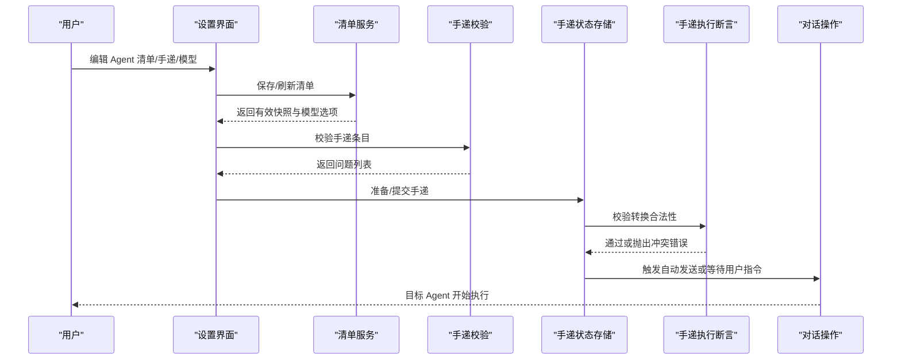
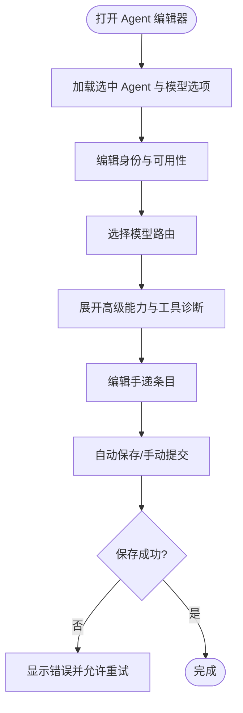
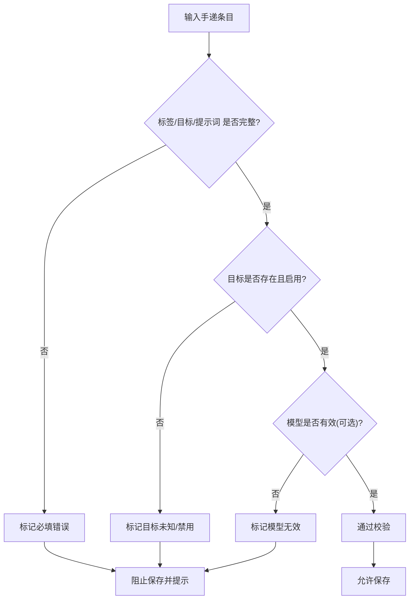
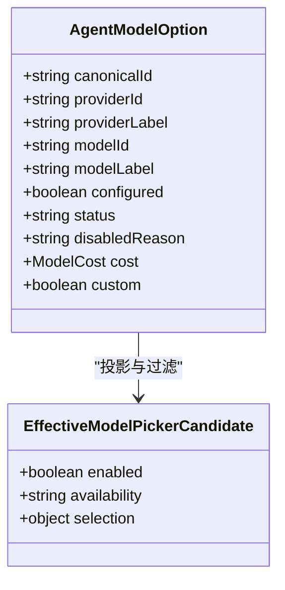
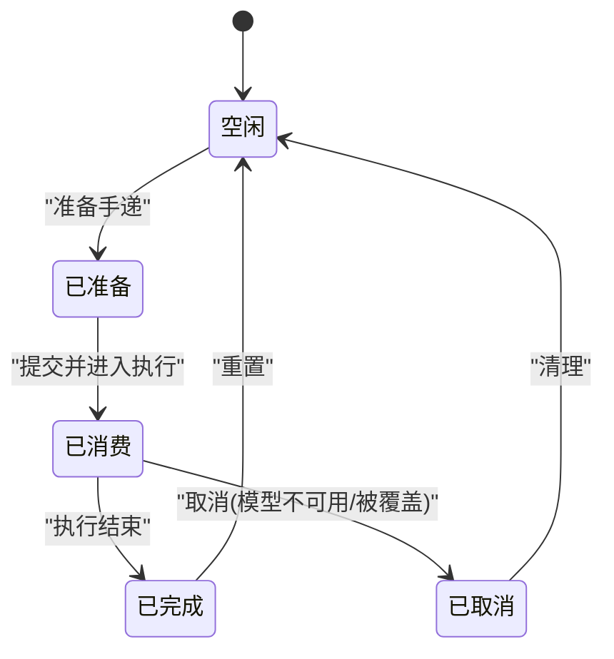
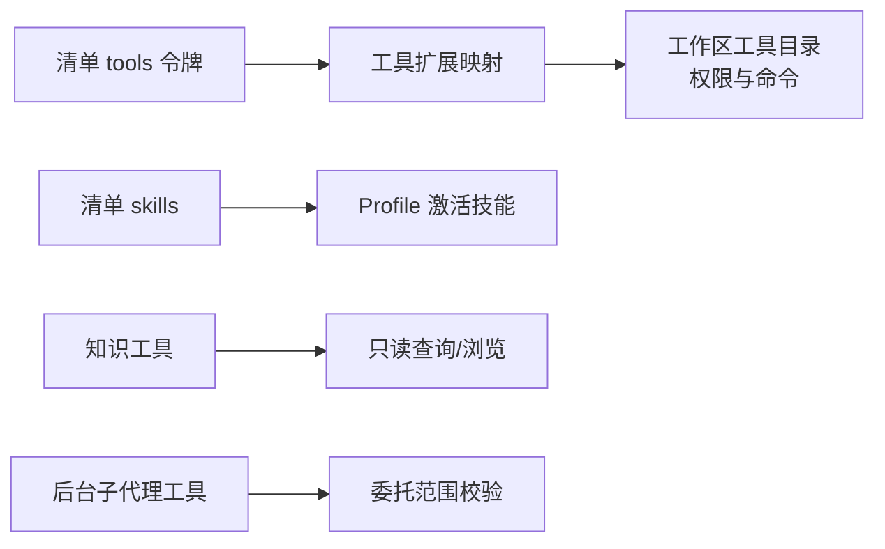
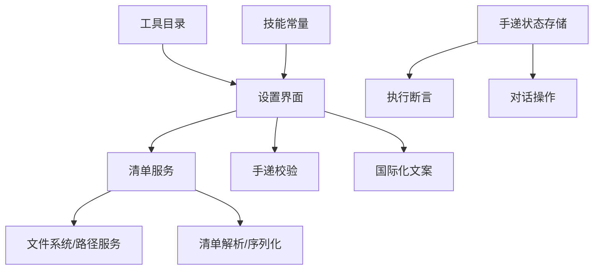

# Agent 设置

<cite>
**本文引用的文件**
- [README.md](file://README.md)
- [agent-manifest-models.md](file://docs/product/agent-manifest-models.md)
- [agentManifest.ts](file://src/shared/types/agentManifest.ts)
- [AgentManifestService.ts](file://src/main/settings/AgentManifestService.ts)
- [AgentManifestEditor.tsx](file://src/renderer/features/settings/SettingsModal/sections/AgentManifestEditor.tsx)
- [AgentHandoffEditor.tsx](file://src/renderer/features/settings/SettingsModal/sections/AgentHandoffEditor.tsx)
- [agentHandoffValidation.ts](file://src/renderer/features/settings/SettingsModal/sections/agentHandoffValidation.ts)
- [settings.ts（国际化）](file://src/renderer/i18n/en/settings.ts)
- [handoffExecution.ts](file://src/main/sessions/handoffExecution.ts)
- [HandoffStateStore.ts](file://src/main/sessions/HandoffStateStore.ts)
- [ConversationHandoffOps.ts](file://src/main/conversation/ConversationHandoffOps.ts)
- [canonicalSkills.ts](file://src/shared/constants/canonicalSkills.ts)
- [agentWorkbenchCatalog.ts](file://src/shared/constants/agentWorkbenchCatalog.ts)
- [KnowledgeTools.ts](file://src/main/knowledge/KnowledgeTools.ts)
- [BackgroundSubagentService.ts](file://src/main/workflow/debugger/BackgroundSubagentService.ts)
</cite>

## 目录
1. [简介](#简介)
2. [项目结构](#项目结构)
3. [核心组件](#核心组件)
4. [架构总览](#架构总览)
5. [详细组件分析](#详细组件分析)
6. [依赖关系分析](#依赖关系分析)
7. [性能考虑](#性能考虑)
8. [故障排除指南](#故障排除指南)
9. [结论](#结论)
10. [附录：常见配置示例与字段说明](#附录：常见配置示例与字段说明)

## 简介
本文件面向 RDC-Agent 的“Agent 设置”能力，聚焦于 Settings 界面中的 Agent 清单编辑器、手递配置与模型选择器。文档解释 Agent 清单文件的结构与字段含义（身份定义、技能绑定、工具权限），说明手递机制的配置方法和使用场景，并描述模型的级联选择与能力摘要显示。文末提供常见配置示例与故障排除建议。

## 项目结构
RDC-Agent 将 Agent 行为配置以 `.agent.md` 作为唯一产品入口，Settings UI 读写同一组文件。资源按作用域解析，优先级为内置 < 用户 < 项目，整资源替换。运行时通过统一的 PromptPlan -> RequestEnvelope -> Provider Adapter 管线执行 LLM 调用，并在 Work Process 中展示真实运行过程。

图表来源
- [AgentManifestService.ts:177-200](file://src/main/settings/AgentManifestService.ts#L177-L200)
- [AgentHandoffEditor.tsx:71-120](file://src/renderer/features/settings/SettingsModal/sections/AgentHandoffEditor.tsx#L71-L120)
- [agentHandoffValidation.ts:56-80](file://src/renderer/features/settings/SettingsModal/sections/agentHandoffValidation.ts#L56-L80)
- [HandoffStateStore.ts:142-175](file://src/main/sessions/HandoffStateStore.ts#L142-L175)
- [handoffExecution.ts:5-25](file://src/main/sessions/handoffExecution.ts#L5-L25)
- [ConversationHandoffOps.ts:75-102](file://src/main/conversation/ConversationHandoffOps.ts#L75-L102)

章节来源
- [README.md:1-46](file://README.md#L1-L46)
- [agent-manifest-models.md:1-16](file://docs/product/agent-manifest-models.md#L1-L16)

## 核心组件
- Agent 清单编辑器：编辑 Agent 的身份信息、可用性与路由、工具与技能、子代理、手递等；支持保存状态提示与重试。
- 手递编辑器：维护当前 Agent 可移交的目标 Agent、提示词、是否自动发送、是否在回合结束后继续、可选覆盖模型等。
- 模型选择器：基于提供者与模型投影的级联选择，支持可见性过滤、可用性状态与无障碍标签。
- 清单服务：读取/合并/写入 .agent.md，生成有效快照，计算模型选项与诊断。
- 手递状态与执行：持久化会话内手递状态，校验转换合法性，限制循环与深度，支持自动发送与取消。

章节来源
- [AgentManifestEditor.tsx:33-245](file://src/renderer/features/settings/SettingsModal/sections/AgentManifestEditor.tsx#L33-L245)
- [AgentHandoffEditor.tsx:37-120](file://src/renderer/features/settings/SettingsModal/sections/AgentHandoffEditor.tsx#L37-L120)
- [agentHandoffValidation.ts:1-103](file://src/renderer/features/settings/SettingsModal/sections/agentHandoffValidation.ts#L1-L103)
- [AgentManifestService.ts:177-200](file://src/main/settings/AgentManifestService.ts#L177-L200)
- [HandoffStateStore.ts:42-175](file://src/main/sessions/HandoffStateStore.ts#L42-L175)
- [handoffExecution.ts:5-25](file://src/main/sessions/handoffExecution.ts#L5-L25)
- [ConversationHandoffOps.ts:75-102](file://src/main/conversation/ConversationHandoffOps.ts#L75-L102)

## 架构总览
下图展示了从设置界面到运行时手递执行的端到端流程，包括清单解析、模型投影、手递校验与会话状态管理。

图表来源
- [AgentManifestService.ts:177-200](file://src/main/settings/AgentManifestService.ts#L177-L200)
- [agentHandoffValidation.ts:56-80](file://src/renderer/features/settings/SettingsModal/sections/agentHandoffValidation.ts#L56-L80)
- [HandoffStateStore.ts:142-175](file://src/main/sessions/HandoffStateStore.ts#L142-L175)
- [handoffExecution.ts:5-25](file://src/main/sessions/handoffExecution.ts#L5-L25)
- [ConversationHandoffOps.ts:75-102](file://src/main/conversation/ConversationHandoffOps.ts#L75-L102)

## 详细组件分析

### Agent 清单编辑器
- 功能要点
  - 编辑名称、描述、参数提示、图标与强调色。
  - 控制启用、用户可调用、禁用模型调用等开关。
  - 选择模型路由（级联选择器）。
  - 高级面板：能力选择器、工具诊断、手递编辑器、指令文本。
  - 保存状态与重试。
- 数据流
  - 编辑器从设置中获取当前 Agent 与模型选项，变更时调用更新回调，最终由自动保存与提交逻辑落盘。
- 关键交互
  - 模型选择器仅允许可见且可用的模型。
  - 能力选择器分组展示，工具诊断列出 token 与消息。
  - 手递编辑器在折叠面板中，支持增删改排序与即时校验。

图表来源
- [AgentManifestEditor.tsx:110-144](file://src/renderer/features/settings/SettingsModal/sections/AgentManifestEditor.tsx#L110-L144)
- [AgentManifestEditor.tsx:168-195](file://src/renderer/features/settings/SettingsModal/sections/AgentManifestEditor.tsx#L168-L195)
- [AgentManifestEditor.tsx:197-231](file://src/renderer/features/settings/SettingsModal/sections/AgentManifestEditor.tsx#L197-L231)
- [AgentManifestEditor.tsx:233-245](file://src/renderer/features/settings/SettingsModal/sections/AgentManifestEditor.tsx#L233-L245)

章节来源
- [AgentManifestEditor.tsx:33-245](file://src/renderer/features/settings/SettingsModal/sections/AgentManifestEditor.tsx#L33-L245)

### 手递编辑器与校验
- 功能要点
  - 维护手递条目列表：标签、目标 Agent、提示词、是否自动发送、是否在回合后继续、可选覆盖模型。
  - 实时校验：必填项、目标存在且启用、不可自引用、模型有效性。
  - 支持上下移动、删除、新增，保持行键稳定。
- 校验规则
  - 标签必填、目标必填且不能为空字符串。
  - 目标必须存在于已启用 Agent 列表中。
  - 提示词必填。
  - 若指定模型，需通过模型选择器的有效性检查。
- 提交拦截
  - 当存在校验问题时，阻止保存并提示需要修复的问题数量。

图表来源
- [agentHandoffValidation.ts:56-80](file://src/renderer/features/settings/SettingsModal/sections/agentHandoffValidation.ts#L56-L80)
- [AgentHandoffEditor.tsx:71-120](file://src/renderer/features/settings/SettingsModal/sections/AgentHandoffEditor.tsx#L71-L120)
- [settings.ts（国际化）:247-289](file://src/renderer/i18n/en/settings.ts#L247-L289)

章节来源
- [agentHandoffValidation.ts:1-103](file://src/renderer/features/settings/SettingsModal/sections/agentHandoffValidation.ts#L1-L103)
- [AgentHandoffEditor.tsx:37-120](file://src/renderer/features/settings/SettingsModal/sections/AgentHandoffEditor.tsx#L37-L120)
- [settings.ts（国际化）:247-289](file://src/renderer/i18n/en/settings.ts#L247-L289)

### 模型级联选择与能力摘要
- 模型选择器
  - 基于提供者与模型投影，显示可用状态、账户授权、预算等信息。
  - 仅对可见且可用的模型开放选择；内部变体或不可用将被隐藏。
  - 无障碍标签包含规范路由标识，便于读屏。
- 能力摘要
  - 能力选择器按组展示，结合工具诊断输出，帮助用户理解当前 Agent 的工具权限与限制。
  - 工具诊断会列出 token 与对应消息，辅助定位不兼容或缺失的能力。

图表来源
- [agentManifest.ts:64-77](file://src/shared/types/agentManifest.ts#L64-L77)
- [effectiveModelPicker.ts:1-18](file://src/shared/utils/effectiveModelPicker.ts#L1-L18)

章节来源
- [AgentManifestEditor.tsx:110-144](file://src/renderer/features/settings/SettingsModal/sections/AgentManifestEditor.tsx#L110-L144)
- [agentManifest.ts:64-77](file://src/shared/types/agentManifest.ts#L64-L77)
- [effectiveModelPicker.ts:1-18](file://src/shared/utils/effectiveModelPicker.ts#L1-L18)

### 手递机制与会话状态
- 手递类型
  - 路由型：每个根链仅允许一次初始路由。
  - 执行型：必须返回到调度者，禁止自执行，执行循环次数受限。
- 状态存储
  - 会话内持久化手递文档，记录活跃手递、历史与任务执行上下文。
  - 准备阶段进行冲突检测与深度限制。
- 自动发送
  - 根据配置决定是否立即发送目标 Agent，或在回合结束后继续。
  - 失败时根据错误类型决定取消原因（如模型不可用）。

图表来源
- [HandoffStateStore.ts:142-175](file://src/main/sessions/HandoffStateStore.ts#L142-L175)
- [handoffExecution.ts:5-25](file://src/main/sessions/handoffExecution.ts#L5-L25)
- [ConversationHandoffOps.ts:75-102](file://src/main/conversation/ConversationHandoffOps.ts#L75-L102)

章节来源
- [HandoffStateStore.ts:42-175](file://src/main/sessions/HandoffStateStore.ts#L42-L175)
- [handoffExecution.ts:5-25](file://src/main/sessions/handoffExecution.ts#L5-L25)
- [ConversationHandoffOps.ts:75-102](file://src/main/conversation/ConversationHandoffOps.ts#L75-L102)

### 技能绑定与工具权限
- 技能绑定
  - 清单中 skills 字段用于强制全文预加载；空列表表示不预载但不等于不可发现。
  - 不同 profile 会激活特定协调技能（如调试器、分析器、优化器）。
- 工具权限
  - 清单 tools 使用规范 token 集合，部分 token 会被扩展为多个具体工具。
  - 工作区目录定义了工具的权限等级（只读、变更、破坏、审批）与命令目录。
  - 知识工具提供浏览与读取能力，标注只读与并发安全。
  - 后台子代理工具限定在委托范围内执行，确保任务树边界。

图表来源
- [canonicalSkills.ts:54-94](file://src/shared/constants/canonicalSkills.ts#L54-L94)
- [agentWorkbenchCatalog.ts:1-741](file://src/shared/constants/agentWorkbenchCatalog.ts#L1-L741)
- [KnowledgeTools.ts:116-234](file://src/main/knowledge/KnowledgeTools.ts#L116-L234)
- [BackgroundSubagentService.ts:370-385](file://src/main/workflow/debugger/BackgroundSubagentService.ts#L370-L385)

章节来源
- [agent-manifest-models.md:92-117](file://docs/product/agent-manifest-models.md#L92-L117)
- [canonicalSkills.ts:54-94](file://src/shared/constants/canonicalSkills.ts#L54-L94)
- [agentWorkbenchCatalog.ts:1-741](file://src/shared/constants/agentWorkbenchCatalog.ts#L1-L741)
- [KnowledgeTools.ts:116-234](file://src/main/knowledge/KnowledgeTools.ts#L116-L234)
- [BackgroundSubagentService.ts:370-385](file://src/main/workflow/debugger/BackgroundSubagentService.ts#L370-L385)

## 依赖关系分析
- 设置界面依赖清单服务提供的有效快照与模型选项。
- 手递编辑器依赖校验模块与国际化文案。
- 清单服务依赖文件系统、路径服务、解析与序列化、种子迁移与哈希。
- 会话层依赖手递状态存储与执行断言，保证状态一致性与安全性。
- 工具与技能通过常量目录与工具目录约束权限与可见性。

图表来源
- [AgentManifestService.ts:177-200](file://src/main/settings/AgentManifestService.ts#L177-L200)
- [agentHandoffValidation.ts:56-80](file://src/renderer/features/settings/SettingsModal/sections/agentHandoffValidation.ts#L56-L80)
- [HandoffStateStore.ts:142-175](file://src/main/sessions/HandoffStateStore.ts#L142-L175)
- [handoffExecution.ts:5-25](file://src/main/sessions/handoffExecution.ts#L5-L25)
- [ConversationHandoffOps.ts:75-102](file://src/main/conversation/ConversationHandoffOps.ts#L75-L102)
- [agentWorkbenchCatalog.ts:1-741](file://src/shared/constants/agentWorkbenchCatalog.ts#L1-L741)
- [canonicalSkills.ts:54-94](file://src/shared/constants/canonicalSkills.ts#L54-L94)

章节来源
- [AgentManifestService.ts:177-200](file://src/main/settings/AgentManifestService.ts#L177-L200)
- [agentHandoffValidation.ts:56-80](file://src/renderer/features/settings/SettingsModal/sections/agentHandoffValidation.ts#L56-L80)
- [HandoffStateStore.ts:142-175](file://src/main/sessions/HandoffStateStore.ts#L142-L175)
- [handoffExecution.ts:5-25](file://src/main/sessions/handoffExecution.ts#L5-L25)
- [ConversationHandoffOps.ts:75-102](file://src/main/conversation/ConversationHandoffOps.ts#L75-L102)
- [agentWorkbenchCatalog.ts:1-741](file://src/shared/constants/agentWorkbenchCatalog.ts#L1-L741)
- [canonicalSkills.ts:54-94](file://src/shared/constants/canonicalSkills.ts#L54-L94)

## 性能考虑
- 清单解析与合并：批量扫描与严格解析，避免构建期阻塞；内置清单失效时 fail-closed，减少运行时异常。
- 模型选项投影：仅投影可见且可用的模型，降低选择器渲染与校验开销。
- 手递校验：增量校验与即时反馈，避免全量重算；限制执行循环与深度，防止长链导致性能退化。
- 工具权限：通过固定目录与 token 映射减少动态发现成本，提高稳定性。

[本节为通用指导，不直接分析具体文件]

## 故障排除指南
- 手递保存被阻止
  - 现象：保存按钮被禁用并提示需修复的问题数量。
  - 排查：检查标签、目标 Agent、提示词是否填写；目标是否启用且存在；模型是否有效。
  - 参考：校验规则与国际化错误文案。
- 手递执行冲突
  - 现象：抛出状态冲突或循环限制错误。
  - 排查：确认路由型仅一次、执行型必须返回、未超过执行循环限制与链深度限制。
- 模型不可用或被隐藏
  - 现象：模型选择器中目标模型不可选或不可见。
  - 排查：检查模型可用性、账户授权、内部变体可见性；确认未被策略隐藏。
- 工具权限不足
  - 现象：工具诊断提示 token 不兼容或缺失。
  - 排查：核对清单 tools 令牌与工作区工具目录权限；必要时调整 Agent 路由或能力。

章节来源
- [agentHandoffValidation.ts:56-80](file://src/renderer/features/settings/SettingsModal/sections/agentHandoffValidation.ts#L56-L80)
- [settings.ts（国际化）:247-289](file://src/renderer/i18n/en/settings.ts#L247-L289)
- [handoffExecution.ts:5-25](file://src/main/sessions/handoffExecution.ts#L5-L25)
- [HandoffStateStore.ts:142-175](file://src/main/sessions/HandoffStateStore.ts#L142-L175)
- [effectiveModelPicker.ts:1-18](file://src/shared/utils/effectiveModelPicker.ts#L1-L18)
- [agentWorkbenchCatalog.ts:1-741](file://src/shared/constants/agentWorkbenchCatalog.ts#L1-L741)

## 结论
RDC-Agent 的 Agent 设置以 .agent.md 为核心，通过 Settings 界面提供直观的清单编辑、手递配置与模型选择能力。清单服务负责解析与合并，手递机制保障会话内流转的安全与可控，工具与技能通过固定目录与 token 映射实现稳定的权限控制。遵循本文档的配置方法与故障排除建议，可高效完成 Agent 身份、能力与协作流程的定制。

[本节为总结，不直接分析具体文件]

## 附录：常见配置示例与字段说明
- 清单字段概览
  - 身份与外观：name、description、argument-hint、icon、accent。
  - 路由与可用性：target、models、enabled、userInvocable、disableModelInvocation。
  - 能力与协作：tools、skills、mcp-servers、agents、handoffs。
  - 元数据与指令：metadata、instructions。
- 手递字段
  - label、agent、prompt、send、showContinueOn、model（可选覆盖）。
- 工具令牌
  - 常用令牌包括 read、search、web、shell、write、edit、git、askUser、agent、handoff、task、memory、planArtifact、skills、mcp、subagent、tool_search、rdxContext。
- 典型场景
  - 调试器向分析器移交证据：设置 handoffs 中目标为 analyzer，提示词引导分析，可选择 send 自动发送。
  - 通用执行器启用 shell 与写能力：在 tools 中添加 shell、write、edit，并确保路由允许写操作。
  - 分析器仅只读：tools 仅包含只读令牌，配合 Knowledge 浏览与读取工具进行证据检索。

章节来源
- [agent-manifest-models.md:17-89](file://docs/product/agent-manifest-models.md#L17-L89)
- [agent-manifest-models.md:92-117](file://docs/product/agent-manifest-models.md#L92-L117)
- [agentManifest.ts:5-46](file://src/shared/types/agentManifest.ts#L5-L46)
- [agentWorkbenchCatalog.ts:1-741](file://src/shared/constants/agentWorkbenchCatalog.ts#L1-L741)
- [KnowledgeTools.ts:116-234](file://src/main/knowledge/KnowledgeTools.ts#L116-L234)