# Provider 设置

<cite>
**本文引用的文件**
- [src/main/settings/README.md](file://src/main/settings/README.md)
- [src/main/settings/ProviderConnectionService.ts](file://src/main/settings/ProviderConnectionService.ts)
- [src/main/settings/ProviderAccountAuthService.ts](file://src/main/settings/ProviderAccountAuthService.ts)
- [src/main/settings/EffectiveCatalogService.ts](file://src/main/settings/EffectiveCatalogService.ts)
- [src/main/settings/SettingsService.ts](file://src/main/settings/SettingsService.ts)
- [src/main/provider-catalog/ProviderCatalogRegistry.ts](file://src/main/provider-catalog/ProviderCatalogRegistry.ts)
- [src/main/settings/ProviderCapabilityProbeService.ts](file://src/main/settings/ProviderCapabilityProbeService.ts)
- [src/main/settings/ProviderConnectionDraft.ts](file://src/main/settings/ProviderConnectionDraft.ts)
- [src/main/settings/providerConnectionErrors.ts](file://src/main/settings/providerConnectionErrors.ts)
- [src/main/settings/LiveProviderOAuthContracts.ts](file://src/main/settings/LiveProviderOAuthContracts.ts)
- [src/renderer/features/settings/SettingsModal/sections/ProviderModelCapabilitySummary.tsx](file://src/renderer/features/settings/SettingsModal/sections/ProviderModelCapabilitySummary.tsx)
- [src/renderer/features/settings/SettingsModal/sections/ProviderModelPreferences.tsx](file://src/renderer/features/settings/SettingsModal/sections/ProviderModelPreferences.tsx)
- [src/renderer/features/settings/SettingsModal/sections/ProviderModelDetails.tsx](file://src/renderer/features/settings/SettingsModal/sections/ProviderModelDetails.tsx)
- [src/renderer/features/settings/SettingsModal/sections/ProviderModelProbe.tsx](file://src/renderer/features/settings/SettingsModal/sections/ProviderModelProbe.tsx)
- [src/renderer/features/settings/SettingsModal/modelCapabilitySummaryUtils.ts](file://src/renderer/features/settings/SettingsModal/modelCapabilitySummaryUtils.ts)
</cite>

## 更新摘要
**变更内容**
- 重构了ProviderModelCapabilitySummary组件，将其分解为三个专注的子组件
- 新增ProviderModelPreferences组件处理路由选择、推理偏好和客户端预算配置
- 新增ProviderModelDetails组件管理上下文层级信息、定价详情和路由选项
- 新增ProviderModelProbe组件隔离模型探测功能
- 更新了能力展示和用户交互流程

## 目录
1. [简介](#简介)
2. [项目结构](#项目结构)
3. [核心组件](#核心组件)
4. [架构总览](#架构总览)
5. [详细组件分析](#详细组件分析)
6. [依赖关系分析](#依赖关系分析)
7. [性能与可用性](#性能与可用性)
8. [故障诊断与常见问题](#故障诊断与常见问题)
9. [结论](#结论)
10. [附录：配置示例与最佳实践](#附录配置示例与最佳实践)

## 简介
本文件面向"Provider 连接管理"的完整说明，覆盖提供商发现、连接配置与认证设置；解释各类 LLM 提供商的配置项（API 密钥、端点 URL、模型选择）；详述 OAuth 账户登录流程与账户管理；并给出能力探测、连接测试与错误诊断方法。文档同时提供不同提供商的配置思路与常见问题解决方案，帮助使用者快速完成 Provider 接入与排障。

**更新** 最近对ProviderModelCapabilitySummary组件进行了重大重构，将单一组件分解为三个专注的子组件，提升了代码的可维护性和功能的模块化程度。

## 项目结构
Provider 设置位于主进程 settings 层，负责 provider、model route、secret 与有效目录（Effective Catalog）的运行时边界。其关键职责包括：
- 对外暴露可展示、可保存、可诊断的设置数据；
- 在主进程内解析 secret 并交给 provider adapter；
- 通过 Provider Catalog Registry 加载声明式 surface，统一输出 catalog DTO；
- 通过 EffectiveCatalogService 合并 discovery、entitlement、observed 三层，生成最终可用模型集合；
- 通过 ProviderAccountAuthService 处理 OAuth 账户登录、刷新与目录发现；
- 通过 ProviderConnectionService 协调连接测试、保存与刷新；
- 通过 ProviderCapabilityProbeService 执行能力探测并记录证据。

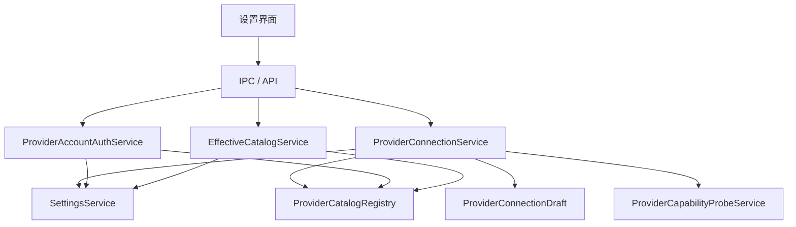

**图表来源**
- [src/main/settings/ProviderConnectionService.ts:53-110](file://src/main/settings/ProviderConnectionService.ts#L53-L110)
- [src/main/settings/ProviderAccountAuthService.ts:99-194](file://src/main/settings/ProviderAccountAuthService.ts#L99-L194)
- [src/main/settings/EffectiveCatalogService.ts:84-163](file://src/main/settings/EffectiveCatalogService.ts#L84-L163)
- [src/main/provider-catalog/ProviderCatalogRegistry.ts:106-147](file://src/main/provider-catalog/ProviderCatalogRegistry.ts#L106-L147)
- [src/main/settings/SettingsService.ts:94-139](file://src/main/settings/SettingsService.ts#L94-L139)

**章节来源**
- [src/main/settings/README.md:1-72](file://src/main/settings/README.md#L1-L72)

## 核心组件
- ProviderConnectionService：负责 Provider 连接草稿解析、连接测试、保存连接、刷新模型、断开连接、账户登录流程编排与状态查询。
- ProviderAccountAuthService：负责 OAuth 账户登录（浏览器/设备码）、回调交换、Token 刷新、目录发现、账户状态与注销。
- EffectiveCatalogService：维护有效目录快照，合并 discovery/entitlement/observed，支持 TTL、回退重试、持久化与监听。
- SettingsService：持久化与归一化应用设置，读取/写入 provider 连接值与 secret，提供运行时凭据解析。
- ProviderCatalogRegistry：加载编译后的 Provider Surface 清单，提供摘要、模型定义、协议映射与可用性信息。
- ProviderCapabilityProbeService：对模型进行能力探测（fast/max-context），记录成功/失败证据并更新有效目录。
- ProviderConnectionDraft：将用户输入与已存储值合并为连接草稿，校验必填字段并计算 baseUrl。
- LiveProviderOAuthContracts：提供特定提供商（如 OpenRouter）的 PKCE 授权与交换工具。

**更新** 前端组件层新增了三个专门的子组件来替代原来的单一ProviderModelCapabilitySummary组件，提供更好的关注点分离和用户体验。

**章节来源**
- [src/main/settings/ProviderConnectionService.ts:53-356](file://src/main/settings/ProviderConnectionService.ts#L53-L356)
- [src/main/settings/ProviderAccountAuthService.ts:99-530](file://src/main/settings/ProviderAccountAuthService.ts#L99-L530)
- [src/main/settings/EffectiveCatalogService.ts:84-453](file://src/main/settings/EffectiveCatalogService.ts#L84-L453)
- [src/main/settings/SettingsService.ts:94-200](file://src/main/settings/SettingsService.ts#L94-L200)
- [src/main/provider-catalog/ProviderCatalogRegistry.ts:106-200](file://src/main/provider-catalog/ProviderCatalogRegistry.ts#L106-L200)
- [src/main/settings/ProviderCapabilityProbeService.ts:277-355](file://src/main/settings/ProviderCapabilityProbeService.ts#L277-L355)
- [src/main/settings/ProviderConnectionDraft.ts:18-77](file://src/main/settings/ProviderConnectionDraft.ts#L18-L77)
- [src/main/settings/LiveProviderOAuthContracts.ts:1-35](file://src/main/settings/LiveProviderOAuthContracts.ts#L1-L35)

## 架构总览
Provider 设置采用分层与边界清晰的设计：
- 公开目录（Catalog）与运行时目录（Effective Catalog）分离，DTO 不携带任何敏感信息；
- 连接与认证在主进程内完成，Secret 仅通过运行时凭据租约传递；
- 账户登录与 API Key 两种模式并存，按 Provider 声明的 authModes 决定可用方式；
- 模型能力通过探测结果（observed）动态修正可用性与配额限制。

**更新** 前端架构现在采用了更细粒度的组件拆分，每个子组件专注于特定的功能领域，提高了代码的可测试性和可维护性。

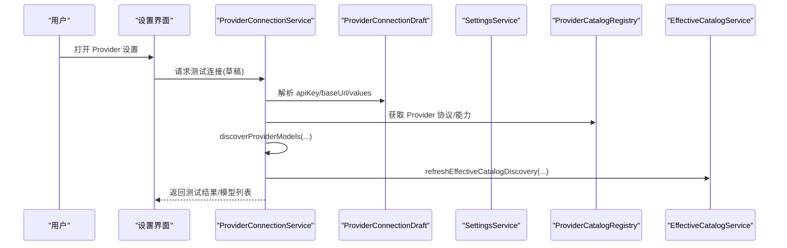

**图表来源**
- [src/main/settings/ProviderConnectionService.ts:111-151](file://src/main/settings/ProviderConnectionService.ts#L111-L151)
- [src/main/settings/ProviderConnectionDraft.ts:18-53](file://src/main/settings/ProviderConnectionDraft.ts#L18-L53)
- [src/main/provider-catalog/ProviderCatalogRegistry.ts:106-147](file://src/main/provider-catalog/ProviderCatalogRegistry.ts#L106-L147)
- [src/main/settings/EffectiveCatalogService.ts:150-163](file://src/main/settings/EffectiveCatalogService.ts#L150-L163)

## 详细组件分析

### 提供商发现与目录服务
- 目录来源：ProviderCatalogRegistry 从编译索引加载 surface，提供模型摘要、协议映射与可用性。
- 有效目录：EffectiveCatalogService 合并 discovery（来自连接或账户）、entitlement（账户权益）、observed（能力探测证据），生成稳定版本化的模型快照，支持 TTL、回退与持久化。
- 刷新策略：当快照过期或无缓存时触发异步刷新，失败时指数退避，避免风暴。

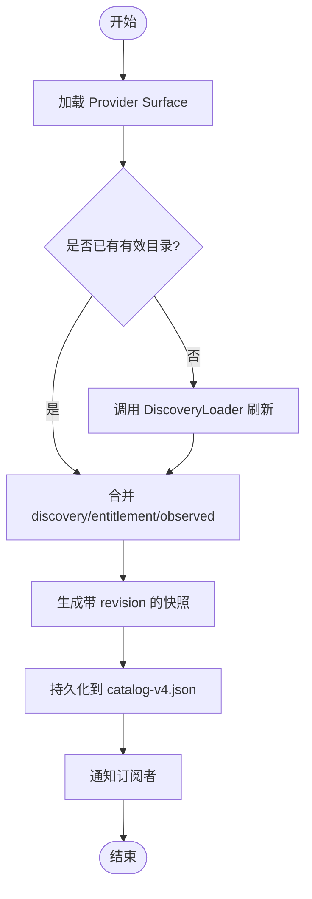

**图表来源**
- [src/main/provider-catalog/ProviderCatalogRegistry.ts:106-147](file://src/main/provider-catalog/ProviderCatalogRegistry.ts#L106-L147)
- [src/main/settings/EffectiveCatalogService.ts:150-244](file://src/main/settings/EffectiveCatalogService.ts#L150-L244)
- [src/main/settings/EffectiveCatalogService.ts:246-298](file://src/main/settings/EffectiveCatalogService.ts#L246-L298)
- [src/main/settings/EffectiveCatalogService.ts:423-449](file://src/main/settings/EffectiveCatalogService.ts#L423-L449)

**章节来源**
- [src/main/provider-catalog/ProviderCatalogRegistry.ts:106-200](file://src/main/provider-catalog/ProviderCatalogRegistry.ts#L106-L200)
- [src/main/settings/EffectiveCatalogService.ts:84-453](file://src/main/settings/EffectiveCatalogService.ts#L84-L453)

### 连接配置与草稿解析
- 草稿合并：ProviderConnectionDraft 将用户输入与已存储值合并，优先使用 schema 中的主密钥字段；若未满足 schema 且非云厂商特殊路径，则报错。
- 端点解析：根据 connectionSchema 模板与用户提供的 baseUrl 计算最终 endpoint。
- 安全边界：settings:get 等公开接口不返回敏感字段；运行时凭据通过租约传递。

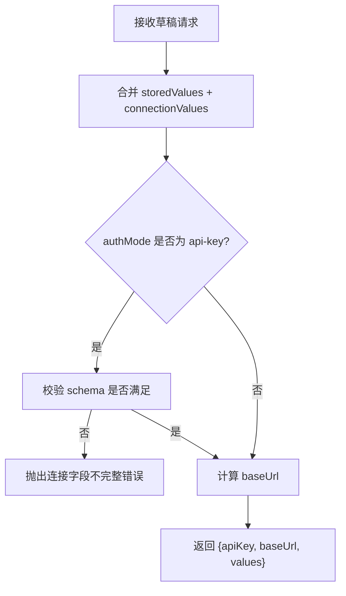

**图表来源**
- [src/main/settings/ProviderConnectionDraft.ts:18-53](file://src/main/settings/ProviderConnectionDraft.ts#L18-L53)
- [src/main/settings/providerConnectionErrors.ts:1-15](file://src/main/settings/providerConnectionErrors.ts#L1-L15)

**章节来源**
- [src/main/settings/ProviderConnectionDraft.ts:18-77](file://src/main/settings/ProviderConnectionDraft.ts#L18-L77)
- [src/main/settings/providerConnectionErrors.ts:1-15](file://src/main/settings/providerConnectionErrors.ts#L1-L15)

### 连接测试与保存
- 测试流程：ProviderConnectionService.testProviderDraft 解析草稿后调用 discoverProviderModels，并将结果刷新至有效目录，返回模型列表与诊断信息。
- 保存流程：connectProvider 在测试成功后保存连接（含 models、baseUrl、protocol、authMode 与偏好），并刷新有效目录。
- 刷新流程：refreshProviderModels 针对已配置 Provider 重新拉取模型，account 模式走账户目录发现。

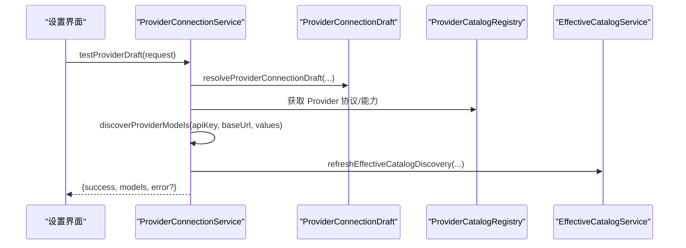

**图表来源**
- [src/main/settings/ProviderConnectionService.ts:111-151](file://src/main/settings/ProviderConnectionService.ts#L111-L151)
- [src/main/settings/ProviderConnectionService.ts:153-198](file://src/main/settings/ProviderConnectionService.ts#L153-L198)
- [src/main/settings/ProviderConnectionService.ts:200-260](file://src/main/settings/ProviderConnectionService.ts#L200-L260)

**章节来源**
- [src/main/settings/ProviderConnectionService.ts:111-260](file://src/main/settings/ProviderConnectionService.ts#L111-L260)

### OAuth 账户登录与账户管理
- 登录入口：startLogin 根据 Provider 类型启动对应流程（浏览器/设备码/回调服务器）。
- 完成登录：finishLogin 根据 flowId 与 code 交换凭证，持久化 bundle 并发现目录。
- Token 刷新：refreshBundleIfNeeded 自动刷新过期 token，必要时强制刷新；失败时标记刷新失败。
- 目录发现：discoverCatalog 根据 providerId 调用具体实现，得到可用模型与权益贡献。
- 状态与注销：status/logout 提供账户状态、授权模式、到期时间等信息，并清理会话。

```mermaid
sequenceDiagram
participant UI as "设置界面"
participant PAA as "ProviderAccountAuthService"
participant O as "OAuth 提供方"
participant S as "SettingsService"
participant E as "EffectiveCatalogService"
UI->>PAA : startLogin(providerId, mode?)
PAA->>O : 打开浏览器/设备码流程
O-->>PAA : 回调(code)
PAA->>PAA : exchangeCode(...)/pollDevice(...)
PAA->>S : saveProviderAccountConnection(bundle, models, meta)
PAA->>E : refreshEffectiveCatalogDiscovery(...)
PAA-->>UI : {state, connected, message, ...}
```

**图表来源**
- [src/main/settings/ProviderAccountAuthService.ts:108-194](file://src/main/settings/ProviderAccountAuthService.ts#L108-L194)
- [src/main/settings/ProviderAccountAuthService.ts:196-248](file://src/main/settings/ProviderAccountAuthService.ts#L196-L248)
- [src/main/settings/ProviderAccountAuthService.ts:406-473](file://src/main/settings/ProviderAccountAuthService.ts#L406-L473)
- [src/main/settings/ProviderAccountAuthService.ts:317-372](file://src/main/settings/ProviderAccountAuthService.ts#L317-L372)

**章节来源**
- [src/main/settings/ProviderAccountAuthService.ts:99-530](file://src/main/settings/ProviderAccountAuthService.ts#L99-L530)

### 能力探测与证据记录
- 探测目标：基于有效模型与计划（plan）确定要探测的模式（fast/max-context）。
- 执行与记录：execute 发送探测请求，成功记录 observed 并授予 entitlement；失败按 HTTP 状态分类（401/404/429/402）并可能标记配额耗尽。
- 临时配额：recordTransientQuota 在短期内抑制重复探测，提升用户体验。

**更新** 前端现在通过独立的ProviderModelProbe组件来处理模型探测功能，提供了更好的用户交互体验。

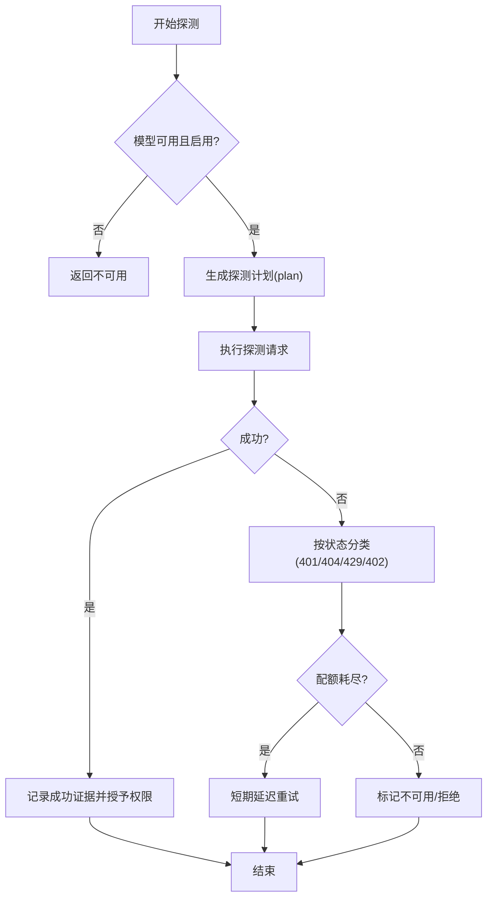

**图表来源**
- [src/main/settings/ProviderCapabilityProbeService.ts:277-355](file://src/main/settings/ProviderCapabilityProbeService.ts#L277-L355)
- [src/main/settings/EffectiveCatalogService.ts:300-340](file://src/main/settings/EffectiveCatalogService.ts#L300-L340)

**章节来源**
- [src/main/settings/ProviderCapabilityProbeService.ts:277-355](file://src/main/settings/ProviderCapabilityProbeService.ts#L277-L355)
- [src/main/settings/EffectiveCatalogService.ts:300-340](file://src/main/settings/EffectiveCatalogService.ts#L300-L340)

### 设置与凭据边界
- 公开 DTO 不含敏感信息：catalog 与 get 接口不返回 apiKey、secretRef、token 等。
- 运行时凭据：通过 ProviderRuntimeCredentialService 创建 opaque lease，adapter 无 handle 必须 fail-closed。
- 刷新策略：401 刷新只替换同一 lease 的 credential material，不改变冻结 route。

**章节来源**
- [src/main/settings/README.md:42-50](file://src/main/settings/README.md#L42-L50)

### 前端组件重构详解

**更新** 最近的前端组件重构将原来单一的ProviderModelCapabilitySummary组件分解为三个专注的子组件：

#### ProviderModelPreferences 组件
该组件专门处理模型偏好设置，包括：
- 路由选择：允许用户在多个可用的路由选项中选择首选路由
- 推理偏好：配置模型的推理级别（off/on/minimal/low/medium/high/xhigh/max）
- 客户端预算：设置客户端级别的令牌预算限制

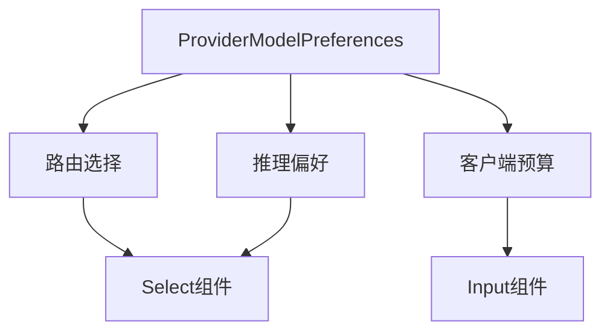

**图表来源**
- [src/renderer/features/settings/SettingsModal/sections/ProviderModelPreferences.tsx:12-61](file://src/renderer/features/settings/SettingsModal/sections/ProviderModelPreferences.tsx#L12-L61)

#### ProviderModelDetails 组件
该组件负责展示模型的详细信息，包括：
- 上下文层级信息：显示不同上下文层级的限制和成本
- 定价详情：展示输入、输出、缓存等不同操作的定价信息
- 路由选项：列出所有可用的路由选项及其元信息

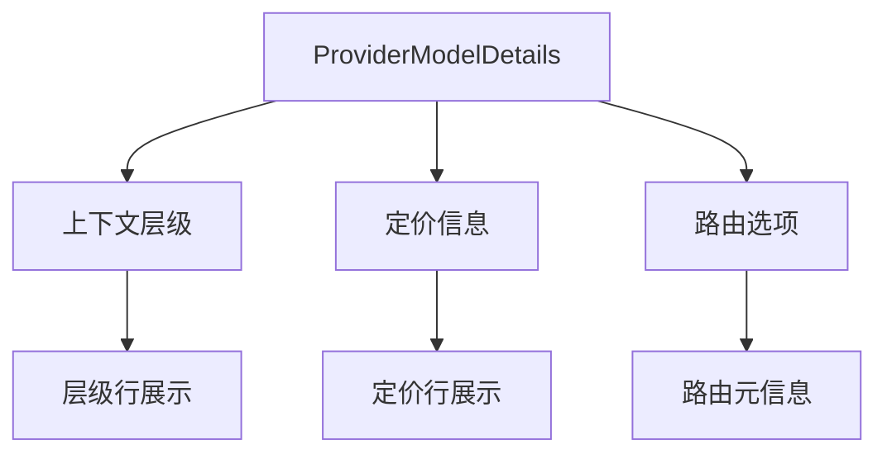

**图表来源**
- [src/renderer/features/settings/SettingsModal/sections/ProviderModelDetails.tsx:5-44](file://src/renderer/features/settings/SettingsModal/sections/ProviderModelDetails.tsx#L5-L44)

#### ProviderModelProbe 组件
该组件专门处理模型能力探测功能：
- 探测模式选择：提供default、fast、max-context等探测模式
- 探测状态管理：跟踪探测进度和结果
- 用户交互：提供按钮让用户手动触发探测

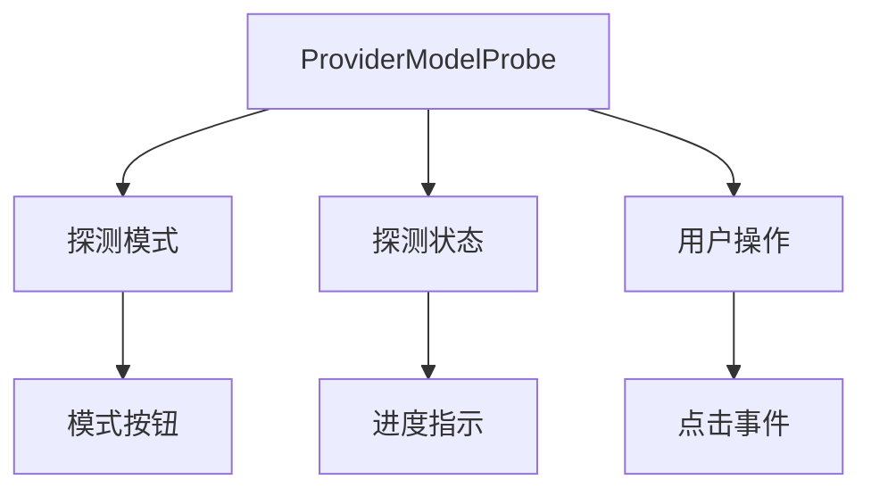

**图表来源**
- [src/renderer/features/settings/SettingsModal/sections/ProviderModelProbe.tsx:11-39](file://src/renderer/features/settings/SettingsModal/sections/ProviderModelProbe.tsx#L11-L39)

#### 工具函数增强
重构还增强了modelCapabilitySummaryUtils工具函数，提供了：
- buildCapabilityChips：构建能力展示芯片
- buildContextTierRows：构建上下文层级行
- buildPricingRows：构建定价信息行
- formatReasoningDefault：格式化推理默认值

**章节来源**
- [src/renderer/features/settings/SettingsModal/sections/ProviderModelCapabilitySummary.tsx:19-141](file://src/renderer/features/settings/SettingsModal/sections/ProviderModelCapabilitySummary.tsx#L19-L141)
- [src/renderer/features/settings/SettingsModal/sections/ProviderModelPreferences.tsx:1-61](file://src/renderer/features/settings/SettingsModal/sections/ProviderModelPreferences.tsx#L1-L61)
- [src/renderer/features/settings/SettingsModal/sections/ProviderModelDetails.tsx:1-44](file://src/renderer/features/settings/SettingsModal/sections/ProviderModelDetails.tsx#L1-L44)
- [src/renderer/features/settings/SettingsModal/sections/ProviderModelProbe.tsx:1-39](file://src/renderer/features/settings/SettingsModal/sections/ProviderModelProbe.tsx#L1-L39)
- [src/renderer/features/settings/SettingsModal/modelCapabilitySummaryUtils.ts:238-286](file://src/renderer/features/settings/SettingsModal/modelCapabilitySummaryUtils.ts#L238-L286)

## 依赖关系分析
- ProviderConnectionService 依赖：
  - SettingsService：读写 provider 连接值与保存连接；
  - ProviderCatalogRegistry：获取 Provider 协议与能力；
  - ProviderConnectionDraft：解析草稿与端点；
  - EffectiveCatalogService：刷新有效目录；
  - ProviderAccountAuthService：账户登录与目录发现。
- ProviderAccountAuthService 依赖：
  - SettingsService：保存账户连接与元数据；
  - ProviderCatalogRegistry：加载 Provider Surface；
  - OAuth 模块：各提供商登录/交换/刷新实现；
  - OAuthRefreshManager：统一刷新逻辑。
- EffectiveCatalogService 依赖：
  - SettingsService：读取/写入设置；
  - ProviderCatalogRegistry：加载 Provider Surface；
  - 文件系统：持久化 catalog-v4.json。

**更新** 前端组件现在依赖于新的子组件结构，每个子组件都有明确的职责和依赖关系。

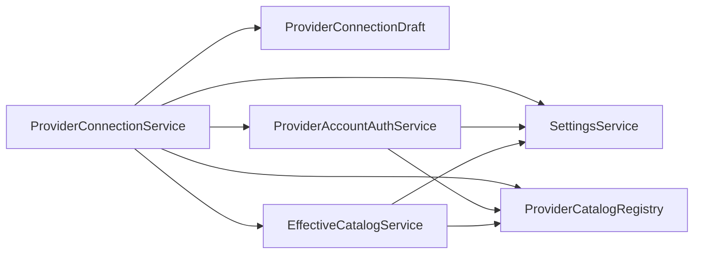

**图表来源**
- [src/main/settings/ProviderConnectionService.ts:53-110](file://src/main/settings/ProviderConnectionService.ts#L53-L110)
- [src/main/settings/ProviderAccountAuthService.ts:99-194](file://src/main/settings/ProviderAccountAuthService.ts#L99-L194)
- [src/main/settings/EffectiveCatalogService.ts:84-163](file://src/main/settings/EffectiveCatalogService.ts#L84-L163)

**章节来源**
- [src/main/settings/ProviderConnectionService.ts:53-356](file://src/main/settings/ProviderConnectionService.ts#L53-L356)
- [src/main/settings/ProviderAccountAuthService.ts:99-530](file://src/main/settings/ProviderAccountAuthService.ts#L99-L530)
- [src/main/settings/EffectiveCatalogService.ts:84-453](file://src/main/settings/EffectiveCatalogService.ts#L84-L453)

## 性能与可用性
- 目录缓存与 TTL：EffectiveCatalogService 对 discovery/entitlement 设置过期时间，减少频繁网络请求。
- 并发与去重：刷新任务按 key 去重，避免重复请求。
- 失败回退：指数退避窗口防止雪崩；观察到的配额耗尽会短期抑制探测。
- 持久化：原子写入 catalog 状态文件，保证一致性。
- 审计与稳定性：快照包含 catalogRevision，避免无关变更导致前端预检失效。

**更新** 前端组件重构提高了性能，通过组件拆分减少了不必要的重新渲染，提升了用户体验。

**章节来源**
- [src/main/settings/EffectiveCatalogService.ts:150-244](file://src/main/settings/EffectiveCatalogService.ts#L150-L244)
- [src/main/settings/EffectiveCatalogService.ts:246-298](file://src/main/settings/EffectiveCatalogService.ts#L246-L298)
- [src/main/settings/EffectiveCatalogService.ts:423-449](file://src/main/settings/EffectiveCatalogService.ts#L423-L449)

## 故障诊断与常见问题
- 连接字段不完整：当 authMode=api-key 且 schema 未满足时，会提示字段不完整。检查 apiKey 与必填字段是否正确填写。
- 超时与中断：DOMException AbortError 会被识别为连接测试超时，建议稍后重试。
- 账户未连接：OAuth 账户未连接或流已过期，需重新发起登录流程。
- 401/404/429/402：分别代表认证失败、路由不可用、配额耗尽/限流、预算不足；系统会根据状态分类并记录证据或短期延迟。
- 目录陈旧：若目录过期或被无效化，系统将自动刷新；若持续失败，检查网络与凭据有效性。
- 无法打开外部浏览器：某些环境禁止 shell.openExternal，需确认系统设置或代理配置。

**更新** 前端组件重构后，错误处理和用户反馈更加明确，各个子组件都有清晰的错误状态展示。

**章节来源**
- [src/main/settings/ProviderConnectionDraft.ts:35-44](file://src/main/settings/ProviderConnectionDraft.ts#L35-L44)
- [src/main/settings/providerConnectionErrors.ts:3-14](file://src/main/settings/providerConnectionErrors.ts#L3-L14)
- [src/main/settings/ProviderAccountAuthService.ts:196-248](file://src/main/settings/ProviderAccountAuthService.ts#L196-L248)
- [src/main/settings/ProviderCapabilityProbeService.ts:41-58](file://src/main/settings/ProviderCapabilityProbeService.ts#L41-L58)
- [src/main/settings/EffectiveCatalogService.ts:246-298](file://src/main/settings/EffectiveCatalogService.ts#L246-L298)

## 结论
Provider 设置通过清晰的边界与分层设计，实现了安全的凭据管理、稳定的目录发现与灵活的认证方式。连接测试与能力探测提供了可靠的验证手段，结合有效目录的证据机制，确保模型可用性与配额状态的准确性。**更新** 最近的前端组件重构进一步提升了代码质量和用户体验，通过关注点分离使得各个功能模块更加独立和可维护。遵循本文档的流程与最佳实践，可高效完成各类 LLM 提供商的接入与运维。

## 附录：配置示例与最佳实践
- API Key 模式
  - 必填项：apiKey 与可选 baseUrl；若 Provider 定义了 connectionSchema，需满足所有必填字段。
  - 建议：优先使用默认端点，仅在需要自定义网关时填写 baseUrl。
  - 参考路径：[ProviderConnectionDraft.ts:18-53](file://src/main/settings/ProviderConnectionDraft.ts#L18-L53)
- OAuth 账户模式
  - 流程：startLogin -> 浏览器/设备码 -> finishLogin -> 保存 bundle -> 发现目录。
  - 刷新：系统自动刷新过期 token；必要时可强制刷新。
  - 参考路径：[ProviderAccountAuthService.ts:108-194](file://src/main/settings/ProviderAccountAuthService.ts#L108-L194)、[ProviderAccountAuthService.ts:406-473](file://src/main/settings/ProviderAccountAuthService.ts#L406-L473)
- 模型选择与偏好
  - 通过 modelPreferences 指定首选模型；有效目录合并后会显示可用模型与能力。
  - **更新** 现在可以通过独立的ProviderModelPreferences组件来配置路由选择、推理偏好和客户端预算。
  - 参考路径：[ProviderConnectionService.ts:153-198](file://src/main/settings/ProviderConnectionService.ts#L153-L198)
- 能力探测
  - fast：尝试快速推理模式；max-context：尝试最大上下文模式。
  - 成功会授予相应 entitlement；失败可能因配额耗尽或路由不可用。
  - **更新** 现在通过独立的ProviderModelProbe组件提供探测功能，支持多种探测模式和状态管理。
  - 参考路径：[ProviderCapabilityProbeService.ts:277-355](file://src/main/settings/ProviderCapabilityProbeService.ts#L277-L355)
- 常见提供商要点
  - OpenRouter：使用 PKCE 授权与交换，构建授权 URL 与交换请求。
    - 参考路径：[LiveProviderOAuthContracts.ts:1-35](file://src/main/settings/LiveProviderOAuthContracts.ts#L1-L35)
  - Google Vertex / Amazon Bedrock：支持特殊凭据解析路径，无需显式 apiKey。
    - 参考路径：[ProviderConnectionDraft.ts:39-44](file://src/main/settings/ProviderConnectionDraft.ts#L39-L44)
- 最佳实践
  - 先测试连接再保存；保存后刷新有效目录以获取最新模型。
  - 定期执行能力探测以确认可用性，尤其是 max-context/fast 模式。
  - 遇到 429/402 时等待配额恢复后再试，避免频繁重试。
  - 保持目录缓存新鲜，避免 stale 导致的模型不可见。
  - **更新** 利用新的组件结构，可以更好地组织和管理模型配置，提高开发效率。

**章节来源**
- [src/main/settings/ProviderConnectionDraft.ts:18-53](file://src/main/settings/ProviderConnectionDraft.ts#L18-L53)
- [src/main/settings/ProviderAccountAuthService.ts:108-194](file://src/main/settings/ProviderAccountAuthService.ts#L108-L194)
- [src/main/settings/ProviderAccountAuthService.ts:406-473](file://src/main/settings/ProviderAccountAuthService.ts#L406-L473)
- [src/main/settings/ProviderConnectionService.ts:153-198](file://src/main/settings/ProviderConnectionService.ts#L153-L198)
- [src/main/settings/ProviderCapabilityProbeService.ts:277-355](file://src/main/settings/ProviderCapabilityProbeService.ts#L277-L355)
- [src/main/settings/LiveProviderOAuthContracts.ts:1-35](file://src/main/settings/LiveProviderOAuthContracts.ts#L1-L35)