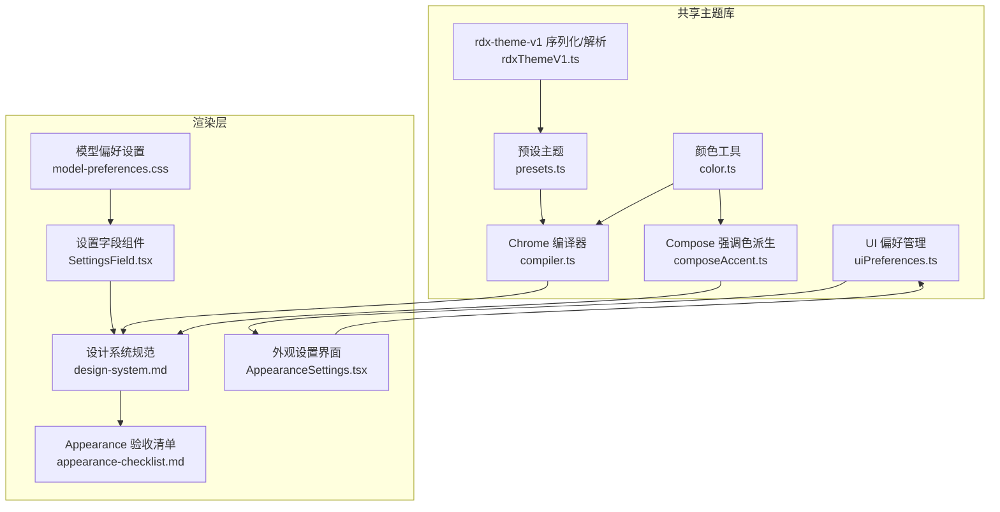
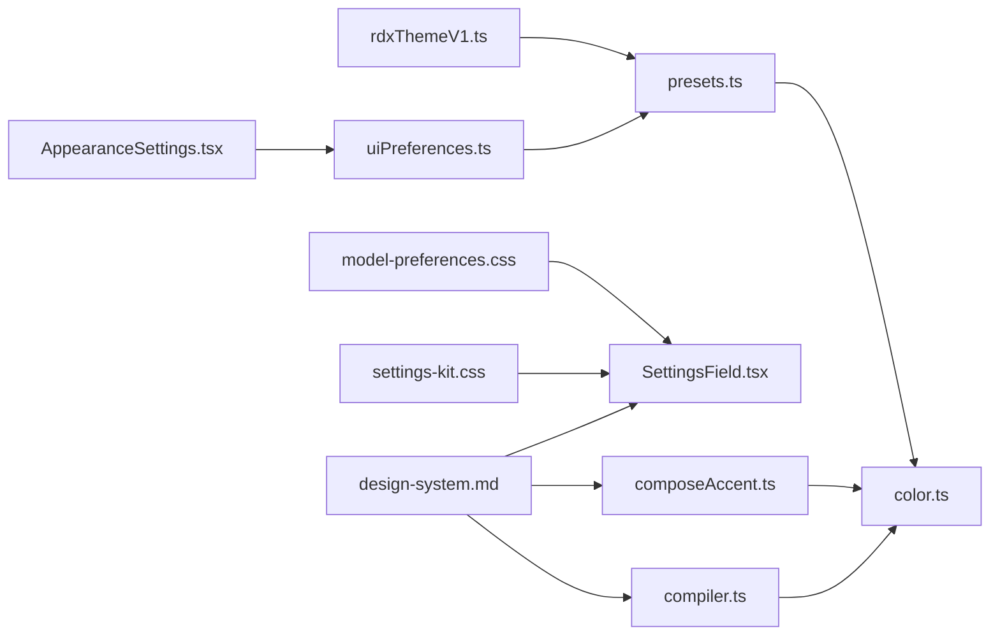

# 外观设置

<cite>
**本文引用的文件**
- [appearance-checklist.md](file://docs/ui/appearance-checklist.md)
- [design-system.md](file://docs/ui/design-system.md)
- [presets.ts](file://src/shared/theme/presets.ts)
- [compiler.ts](file://src/shared/theme/compiler.ts)
- [color.ts](file://src/shared/theme/color.ts)
- [composeAccent.ts](file://src/shared/theme/composeAccent.ts)
- [rdxThemeV1.ts](file://src/shared/theme/rdxThemeV1.ts)
- [index.ts](file://src/shared/theme/index.ts)
- [AppearanceSettings.tsx](file://src/renderer/features/settings/SettingsModal/sections/AppearanceSettings.tsx)
- [uiPreferences.ts](file://src/shared/theme/uiPreferences.ts)
- [defaultAppSettings.ts](file://src/renderer/stores/defaultAppSettings.ts)
- [model-preferences.css](file://src/renderer/features/settings/SettingsModal/sections/model-preferences.css)
- [ProviderModelPreferences.tsx](file://src/renderer/features/settings/SettingsModal/sections/ProviderModelPreferences.tsx)
- [SettingsField.tsx](file://src/renderer/features/settings/SettingsModal/parts/SettingsField.tsx)
- [settings-kit.css](file://src/renderer/features/settings/SettingsModal/parts/settings-kit.css)
</cite>

## 更新摘要
**所做更改**
- 更新了模型偏好设置的响应式设计，增加了针对窄屏设备（max-width: 640px）的媒体查询
- 改进了标签与控件的对齐和间距一致性，确保在小屏幕设备上提供更好的用户体验
- 增强了设置界面的可访问性和移动设备适配能力

## 目录
1. [简介](#简介)
2. [项目结构](#项目结构)
3. [核心组件](#核心组件)
4. [架构总览](#架构总览)
5. [详细组件分析](#详细组件分析)
6. [依赖关系分析](#依赖关系分析)
7. [性能考虑](#性能考虑)
8. [故障排查指南](#故障排查指南)
9. [结论](#结论)
10. [附录](#附录)

## 简介
本文件面向"外观设置"主题，覆盖主题选择、字体设置与颜色配置；说明内置主题特点与自定义主题创建方法；解释 Chrome 样式定制选项与 CSS 变量使用；给出深色/浅色模式切换逻辑；并提供主题开发指南与样式最佳实践。**重要更新**：系统已移除减少动画设置和控制选项，用户现在无法通过设置界面禁用动画效果；核心运动效果和动画已恢复并保持活跃状态。文档同时兼顾非技术读者理解与开发者落地细节。

## 项目结构
外观系统由"共享主题库 + 渲染层设计系统 + 设置面板"三部分构成：
- 共享主题库（src/shared/theme）：提供预设主题、颜色工具、Chrome 编译、Compose 强调色派生与 rdx-theme-v1 序列化/解析。
- 渲染层设计系统（docs/ui/design-system.md）：定义语义 token、CSS 入口、双体系（全局 chrome 与 Composer agent accent）、CSP 约束与验收规则。
- 设置面板与验收清单（docs/ui/appearance-checklist.md）：描述 Appearance 面板能力、预览一致性与验证命令。



**图表来源**
- [presets.ts:1-110](file://src/shared/theme/presets.ts#L1-L110)
- [compiler.ts:1-85](file://src/shared/theme/compiler.ts#L1-L85)
- [color.ts:1-187](file://src/shared/theme/color.ts#L1-L187)
- [composeAccent.ts:1-102](file://src/shared/theme/composeAccent.ts#L1-L102)
- [rdxThemeV1.ts:1-106](file://src/shared/theme/rdxThemeV1.ts#L1-L106)
- [uiPreferences.ts:1-85](file://src/shared/theme/uiPreferences.ts#L1-L85)
- [AppearanceSettings.tsx:1-116](file://src/renderer/features/settings/SettingsModal/sections/AppearanceSettings.tsx#L1-L116)
- [model-preferences.css:1-103](file://src/renderer/features/settings/SettingsModal/sections/model-preferences.css#L1-L103)
- [SettingsField.tsx:1-48](file://src/renderer/features/settings/SettingsModal/parts/SettingsField.tsx#L1-L48)
- [design-system.md:1-252](file://docs/ui/design-system.md#L1-L252)
- [appearance-checklist.md:1-69](file://docs/ui/appearance-checklist.md#L1-L69)

**章节来源**
- [design-system.md:86-103](file://docs/ui/design-system.md#L86-L103)
- [appearance-checklist.md:1-69](file://docs/ui/appearance-checklist.md#L1-L69)

## 核心组件
- 预设主题目录：集中维护 Light/Dark 两套 chrome 配置，包含 accent/surface/ink/contrast/fonts 等字段，并导出默认主题与查询工具。
- Chrome 编译器：将 ThemeChromeConfig 编译为 CSS 自定义属性补丁，注入到根节点以驱动全局外观。
- 颜色工具：提供十六进制/RGB/HSL 转换、对比度调节、调色板缩放等基础能力。
- Compose 强调色派生：基于 Agent 的 accent 生成 Composer 专属变量，Light/Dark 仅调制亮度，不改变色相来源。
- rdx-theme-v1：主题导入/导出的统一格式，支持校验、清理与回退策略。
- **UI 偏好管理**：负责外观设置的验证、合并和清理，确保动画控制选项被正确移除。
- **响应式设置界面**：提供模型偏好设置的响应式布局，支持窄屏设备的优化显示。

**章节来源**
- [presets.ts:25-110](file://src/shared/theme/presets.ts#L25-L110)
- [compiler.ts:19-78](file://src/shared/theme/compiler.ts#L19-L78)
- [color.ts:109-187](file://src/shared/theme/color.ts#L109-L187)
- [composeAccent.ts:32-86](file://src/shared/theme/composeAccent.ts#L32-L86)
- [rdxThemeV1.ts:23-105](file://src/shared/theme/rdxThemeV1.ts#L23-L105)
- [uiPreferences.ts:20-85](file://src/shared/theme/uiPreferences.ts#L20-L85)
- [model-preferences.css:47-51](file://src/renderer/features/settings/SettingsModal/sections/model-preferences.css#L47-L51)

## 架构总览
外观系统的运行时数据流如下：用户通过设置界面选择或编辑主题 → 读取预设或自定义配置 → 经 Chrome 编译器生成 CSS 变量 → 应用至 :root → 渲染层通过语义 token 消费变量 → 同时根据当前 Agent 的 accent 派生 Compose 强调色变量，供 Composer 使用。**重要更新**：所有动画控制选项已被移除，核心运动效果保持活跃状态。

```mermaid
sequenceDiagram
participant U as "用户"
participant S as "设置界面"
participant P as "UI 偏好管理"
participant T as "主题库"
participant R as "渲染层"
M as "响应式布局"
U->>S : 选择/编辑主题
S->>P : 验证并清理设置
P->>T : 读取预设或自定义配置
T-->>P : ThemeChromeConfig / Agent Accent
P->>R : 应用 CSS 变量补丁
R->>R : 通过语义 token 消费变量
R->>T : 派生 Compose 强调色变量
T-->>R : --composer-* 变量
R->>M : 应用响应式布局调整
M-->>R : 窄屏设备优化布局
R-->>U : 更新后的界面外观
Note over R,U : 核心运动效果保持活跃，无动画控制选项
```

**图表来源**
- [compiler.ts:19-78](file://src/shared/theme/compiler.ts#L19-L78)
- [composeAccent.ts:32-86](file://src/shared/theme/composeAccent.ts#L32-L86)
- [uiPreferences.ts:32-85](file://src/shared/theme/uiPreferences.ts#L32-L85)
- [model-preferences.css:47-51](file://src/renderer/features/settings/SettingsModal/sections/model-preferences.css#L47-L51)
- [design-system.md:86-103](file://docs/ui/design-system.md#L86-L103)

## 详细组件分析

### 主题选择与内置主题
- 内置主题列表：RDC、Absolutely、Ayu、Catppuccin、Dracula、Everforest、GitHub、Gruvbox、Linear。每个主题均提供 Light/Dark 两套 chrome 配置，包含 accent、surface、ink、contrast 与 fonts。
- 默认主题：RDC。
- 主题 ID 校验与获取：提供 isThemePresetId/getThemePreset/getPresetChrome/createDefaultChromeThemes 等工具函数。

**章节来源**
- [presets.ts:25-110](file://src/shared/theme/presets.ts#L25-L110)

### 字体设置
- 字体来源：ThemeChromeConfig.fonts.ui 与 fonts.code 分别对应 UI 与代码字体。
- 默认字体：未设置时回退到 Inter 系列与 JetBrains Mono 系列。
- 生效方式：编译器输出 --font-sans 与 --font-mono 变量，供设计系统 token 层引用。

**章节来源**
- [compiler.ts:14-17](file://src/shared/theme/compiler.ts#L14-L17)
- [compiler.ts:49-50](file://src/shared/theme/compiler.ts#L49-L50)

### 颜色配置与 Chrome 样式定制
- 输入三要素：accent（强调色）、surface（表面底色）、ink（文字/图标墨色），以及 contrast（对比度滑块）。
- 对比度调节：在 dark/light 下对 surface/ink 进行混合，确保可读性。
- 调色板生成：基于 accent 生成 50–900 级强调色；基于 surface 生成 0–5 级表面色；基于 ink 生成 primary/secondary/tertiary/muted/disabled 文本色。
- 边框与叠加层：根据 light/dark 输出不同的边框透明度与 overlay 背景，保证弹窗/弹层一致性。
- 字体变量：--font-sans/--font-mono 直接来自 chrome 配置或默认值。

**章节来源**
- [compiler.ts:23-78](file://src/shared/theme/compiler.ts#L23-L78)
- [color.ts:109-187](file://src/shared/theme/color.ts#L109-L187)

### Compose 强调色与 CSS 变量
- 作用域：Composer 区域使用独立的强调色体系，来源于当前 Agent 的 accent。
- 派生变量：--composer-mode-accent、--composer-effort-fill-1..5、--composer-effort-thumb/track/max-track/max-from/mid/to/sparkle/thumb。
- 明暗策略：Light/Dark 仅调整亮度，保持色相不变，避免在不同壳层中失去与 Agent 的视觉关联。

**章节来源**
- [composeAccent.ts:32-86](file://src/shared/theme/composeAccent.ts#L32-L86)

### 深色模式与浅色模式切换逻辑
- 切换依据：ResolvedTheme（light/dark/system）决定编译器输出的表面/文本/边框/overlay 等变量。
- 影响范围：全局 chrome（Shell、Settings、transcript、全局 CTA/focus）与 Compose 强调色的亮度调制。
- 设计系统约束：唯一全局入口、禁止内联 style 注入、生产 CSP 限制，确保动态样式通过 constructable stylesheet 应用。

**章节来源**
- [compiler.ts:23-78](file://src/shared/theme/compiler.ts#L23-L78)
- [design-system.md:86-103](file://docs/ui/design-system.md#L86-L103)

### 自定义主题创建与导入导出
- 导出格式：rdx-theme-v1: 前缀 + JSON payload，包含 presetId、variant、theme（accent/surface/ink/contrast/fonts）。
- 导入流程：校验前缀与 JSON → 校验 variant → 可选 expectedVariant 匹配 → 清理与回退 → 返回可应用的 ThemeChromeConfig。
- 兼容提示：不支持 codex-theme-v1 前缀，需迁移到 rdx-theme-v1。

**章节来源**
- [rdxThemeV1.ts:23-105](file://src/shared/theme/rdxThemeV1.ts#L23-L105)

### 外观设置界面与验收要点
- 面板能力：System/Light/Dark 迷你窗口磁贴、双栏视觉预览、圆角色板+hex、Import/Copy rdx-theme-v1、Preferences。
- **更新**：已移除减少动画设置和控制选项，用户无法通过设置界面禁用动画效果。
- 预览一致性：全局预览跟随 chrome；Composer/Effort 仍跟随 agent accent；Context Usage 弹层底色遵循 --color-surface-overlay / --token-bg-overlay。
- 验证命令：pnpm run check:appearance。

**章节来源**
- [AppearanceSettings.tsx:68-112](file://src/renderer/features/settings/SettingsModal/sections/AppearanceSettings.tsx#L68-L112)
- [appearance-checklist.md:1-69](file://docs/ui/appearance-checklist.md#L1-L69)

### UI 偏好管理与动画控制移除
- **重要更新**：系统已完全移除 reduceMotion 相关设置，包括默认值、验证逻辑和用户界面选项。
- 清理机制：sanitizeUiPreferences 函数会主动移除任何残留的 reduceMotion 属性。
- 验证保障：测试用例确保旧版本的 reduceMotion 设置不会在新版本中保留。
- 核心运动效果：所有核心动画和运动效果保持活跃状态，不受用户设置影响。

**章节来源**
- [uiPreferences.ts:32-56](file://src/shared/theme/uiPreferences.ts#L32-L56)
- [uiPreferences.test.ts:4-29](file://src/shared/theme/uiPreferences.test.ts#L4-L29)

### 响应式模型偏好设置
- **新增功能**：模型偏好设置界面现在支持响应式布局，针对窄屏设备进行了专门优化。
- 网格布局：使用 CSS Grid 实现标签与控件的两列布局，在大屏幕上显示为左右排列。
- 媒体查询：当屏幕宽度小于等于 640px 时，自动切换为单列布局，提升小屏幕设备的可用性。
- 对齐优化：通过 `align-items: center` 确保标签与控件在垂直方向上完美对齐。
- 间距一致性：使用设计系统的 `--space-*` 变量确保一致的间距标准。

**章节来源**
- [model-preferences.css:19-23](file://src/renderer/features/settings/SettingsModal/sections/model-preferences.css#L19-L23)
- [model-preferences.css:47-51](file://src/renderer/features/settings/SettingsModal/sections/model-preferences.css#L47-L51)
- [ProviderModelPreferences.tsx:31-58](file://src/renderer/features/settings/SettingsModal/sections/ProviderModelPreferences.tsx#L31-L58)

### 设置字段组件与对齐机制
- 通用字段组件：`SettingsField` 组件提供统一的标签、帮助信息和控件容器。
- 布局模式：支持 `stack` 和 `row` 两种布局模式，适应不同的设置场景。
- 容器查询：使用 CSS Container Queries 实现响应式行为，在小容器内自动调整布局。
- 样式隔离：通过 BEM 命名约定确保样式的一致性和可维护性。

**章节来源**
- [SettingsField.tsx:17-47](file://src/renderer/features/settings/SettingsModal/parts/SettingsField.tsx#L17-L47)
- [settings-kit.css:25-46](file://src/renderer/features/settings/SettingsModal/parts/settings-kit.css#L25-L46)

## 依赖关系分析
- presets.ts 依赖 color.ts 提供的颜色工具（用于生成默认主题时的配色）。
- compiler.ts 依赖 color.ts 进行对比度调节与调色板缩放，并输出 CSS 变量。
- composeAccent.ts 依赖 color.ts 进行 HSL/RGB 转换与亮度调制，输出 Compose 专用变量。
- rdxThemeV1.ts 依赖 presets.ts 的预设 ID 校验与 sanitize 清理，确保导入安全。
- uiPreferences.ts 负责外观设置的验证和清理，确保动画控制选项被正确移除。
- design-system.md 作为权威规范，约束所有组件必须消费语义 token，禁止直接使用 primitive 或硬编码颜色。
- model-preferences.css 依赖 SettingsField 组件的样式类名，提供响应式布局支持。



**图表来源**
- [presets.ts:1-110](file://src/shared/theme/presets.ts#L1-L110)
- [compiler.ts:1-85](file://src/shared/theme/compiler.ts#L1-L85)
- [color.ts:1-187](file://src/shared/theme/color.ts#L1-L187)
- [composeAccent.ts:1-102](file://src/shared/theme/composeAccent.ts#L1-L102)
- [rdxThemeV1.ts:1-106](file://src/shared/theme/rdxThemeV1.ts#L1-L106)
- [uiPreferences.ts:1-85](file://src/shared/theme/uiPreferences.ts#L1-L85)
- [AppearanceSettings.tsx:1-116](file://src/renderer/features/settings/SettingsModal/sections/AppearanceSettings.tsx#L1-L116)
- [model-preferences.css:1-103](file://src/renderer/features/settings/SettingsModal/sections/model-preferences.css#L1-L103)
- [SettingsField.tsx:1-48](file://src/renderer/features/settings/SettingsModal/parts/SettingsField.tsx#L1-L48)
- [settings-kit.css:1-318](file://src/renderer/features/settings/SettingsModal/parts/settings-kit.css#L1-L318)
- [design-system.md:1-252](file://docs/ui/design-system.md#L1-L252)

**章节来源**
- [index.ts:1-8](file://src/shared/theme/index.ts#L1-L8)

## 性能考虑
- 编译阶段一次性生成 CSS 变量补丁，避免运行时重复计算。
- 使用 CSS 自定义属性与语义 token，减少样式重绘与重排。
- Compose 强调色派生仅在必要时更新，且仅调整亮度，避免大范围重绘。
- 遵循 CSP 与 constructable stylesheet，避免内联 style 注入带来的性能与安全开销。
- **更新**：移除动画控制选项后，减少了设置验证和状态管理的复杂度，提升了整体性能。
- **新增优化**：响应式布局使用 CSS Grid 和媒体查询，避免了 JavaScript 计算的开销，提升了移动端性能。

## 故障排查指南
- 导入失败：检查是否以 rdx-theme-v1: 开头；JSON 是否合法；variant 是否为 light/dark；expectedVariant 是否匹配。
- 颜色异常：确认 contrast 滑块范围与 light/dark 下的混合策略；检查 surface/ink 是否被意外覆盖。
- 字体未生效：确认 fonts.ui/fonts.code 已正确传入；默认字体回退是否被覆盖。
- 预览不一致：确保全局预览与 chrome 同步；Composer/Effort 应跟随 agent accent；Context Usage 弹层底色遵循 overlay token。
- **动画相关问题**：确认没有尝试设置 reduceMotion 选项；核心运动效果应保持活跃状态。
- **响应式问题**：检查媒体查询是否正确应用；确认窄屏设备上的布局是否符合预期；验证标签与控件的对齐是否正常。
- 验收失败：运行 pnpm run check:appearance；对照 appearance-checklist.md 逐项核对。

**章节来源**
- [rdxThemeV1.ts:41-105](file://src/shared/theme/rdxThemeV1.ts#L41-L105)
- [compiler.ts:23-78](file://src/shared/theme/compiler.ts#L23-L78)
- [appearance-checklist.md:1-69](file://docs/ui/appearance-checklist.md#L1-L69)
- [model-preferences.css:47-51](file://src/renderer/features/settings/SettingsModal/sections/model-preferences.css#L47-L51)

## 结论
外观系统通过"预设主题 + Chrome 编译器 + Compose 强调色派生 + rdx-theme-v1 序列化"形成闭环，既满足产品默认体验，又支持高度自定义。**重要更新**：系统已移除减少动画设置和控制选项，确保核心运动效果和动画始终保持活跃状态，为用户提供一致的视觉体验。设计系统规范确保所有组件消费语义 token，保障跨界面一致性与可维护性。**新增功能**：响应式模型偏好设置界面提供了更好的移动设备体验，确保在各种屏幕尺寸下都能保持良好的可用性和视觉效果。按本文档实践，可快速完成主题选择、字体与颜色配置、深浅色切换与自定义主题开发。

## 附录

### 主题开发指南与样式最佳实践
- 新增主题：在 presets.ts 中添加 ThemePresetDefinition，提供 light/dark 两套配置；确保 accent/surface/ink/contrast/fonts 合理搭配。
- 自定义主题：使用 rdx-theme-v1 格式导出/导入；注意 variant 与 expectedVariant 匹配；非法前缀将被拒绝。
- 样式规范：组件 CSS 仅引用语义 token（--token-*），禁止直接使用 primitive token 或硬编码颜色；字号/间距/圆角/时长遵循设计系统刻度。
- 动态样式：生产环境通过 constructable stylesheet 应用，遵守 CSP 限制；避免 element.style 或 <style>.textContent 注入。
- **动画策略**：所有核心运动效果保持活跃状态，不提供用户控制选项；确保动画在不同设备和性能条件下都能正常工作。
- **响应式设计**：使用 CSS Grid 和媒体查询实现响应式布局；优先使用容器查询而非媒体查询；确保在小屏幕设备上保持良好的用户体验。
- 验收流程：修改后执行 pnpm run check:appearance；对照 appearance-checklist.md 逐项验证；必要时重启浏览器 QA session 并新建隔离会话。

**章节来源**
- [presets.ts:25-110](file://src/shared/theme/presets.ts#L25-L110)
- [rdxThemeV1.ts:23-105](file://src/shared/theme/rdxThemeV1.ts#L23-L105)
- [design-system.md:86-103](file://docs/ui/design-system.md#L86-L103)
- [appearance-checklist.md:1-69](file://docs/ui/appearance-checklist.md#L1-L69)
- [uiPreferences.ts:20-85](file://src/shared/theme/uiPreferences.ts#L20-L85)
- [model-preferences.css:47-51](file://src/renderer/features/settings/SettingsModal/sections/model-preferences.css#L47-L51)
- [settings-kit.css:41-46](file://src/renderer/features/settings/SettingsModal/parts/settings-kit.css#L41-L46)