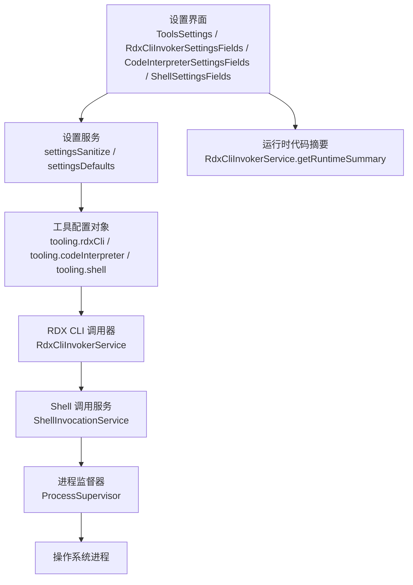
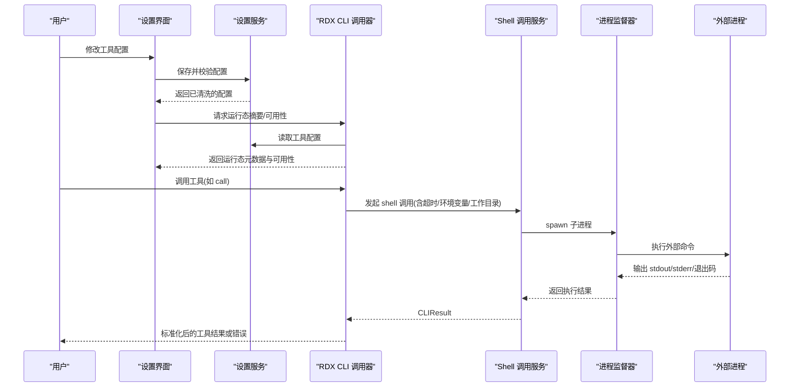
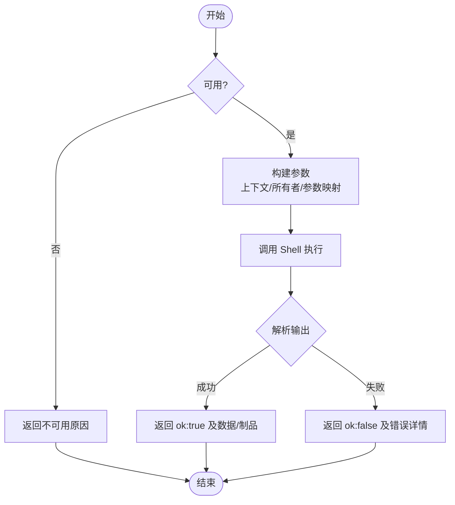
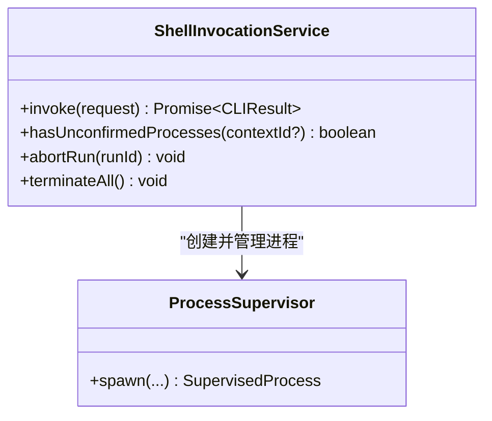
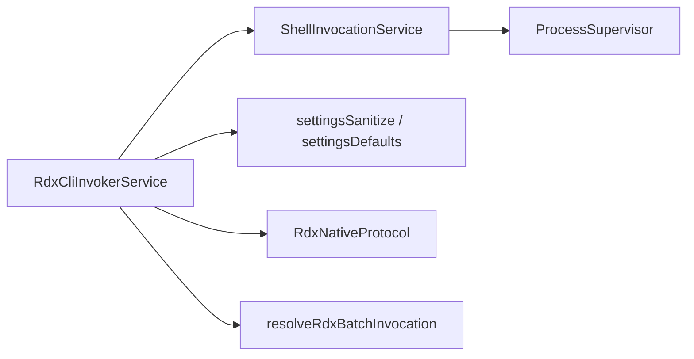

# 工具设置

<cite>
**本文引用的文件**
- [RdxCliInvokerService.ts](file://src/main/tools/RdxCliInvokerService.ts)
- [ShellInvocationService.ts](file://src/main/tools/ShellInvocationService.ts)
- [settingsSanitize.ts](file://src/main/settings/settingsSanitize.ts)
- [settingsDefaults.ts](file://src/main/settings/settingsDefaults.ts)
- [ProcessSupervisor.ts](file://src/main/runtime/ProcessSupervisor.ts)
- [RdxNativeProtocol.ts](file://src/main/tools/RdxNativeProtocol.ts)
- [resolveRdxBatchInvocation.ts](file://src/main/tools/resolveRdxBatchInvocation.ts)
- [ToolingSettings.tsx](file://src/renderer/features/settings/SettingsModal/sections/ToolsSettings.tsx)
- [RdxCliInvokerSettingsFields.tsx](file://src/renderer/features/settings/SettingsModal/sections/RdxCliInvokerSettingsFields.tsx)
- [CodeInterpreterSettingsFields.tsx](file://src/renderer/features/settings/SettingsModal/sections/CodeInterpreterSettingsFields.tsx)
- [ShellSettingsFields.tsx](file://src/renderer/features/settings/SettingsModal/sections/ShellSettingsFields.tsx)
</cite>

## 目录
1. [简介](#简介)
2. [项目结构](#项目结构)
3. [核心组件](#核心组件)
4. [架构总览](#架构总览)
5. [详细组件分析](#详细组件分析)
6. [依赖关系分析](#依赖关系分析)
7. [性能考虑](#性能考虑)
8. [故障排除指南](#故障排除指南)
9. [结论](#结论)
10. [附录](#附录)

## 简介
本文件面向 RDC-Agent 的“工具设置”能力，覆盖以下主题：
- 工具配置界面与数据模型：代码解释器、RDX CLI 调用器、文件系统（工作目录与环境变量）等。
- 每个工具的可用选项、安全限制与执行环境。
- 工具权限模型与访问控制机制。
- 工具执行日志查看与性能监控要点。
- 最佳实践与常见问题排查。

## 项目结构
与“工具设置”相关的代码主要分布在以下位置：
- 主进程工具执行层：RDX CLI 调用器与服务化 Shell 调用封装。
- 设置持久化与校验：默认值、清洗与合并策略。
- 渲染层设置界面：各工具的配置表单与展示。
- 运行时进程管理：子进程生命周期、超时、隔离与终止。

图表来源
- [RdxCliInvokerService.ts:42-141](file://src/main/tools/RdxCliInvokerService.ts#L42-L141)
- [ShellInvocationService.ts:29-127](file://src/main/tools/ShellInvocationService.ts#L29-L127)
- [settingsSanitize.ts:156-164](file://src/main/settings/settingsSanitize.ts#L156-L164)
- [settingsDefaults.ts:119-165](file://src/main/settings/settingsDefaults.ts#L119-L165)

章节来源
- [RdxCliInvokerService.ts:42-141](file://src/main/tools/RdxCliInvokerService.ts#L42-L141)
- [ShellInvocationService.ts:29-127](file://src/main/tools/ShellInvocationService.ts#L29-L127)
- [settingsSanitize.ts:156-164](file://src/main/settings/settingsSanitize.ts#L156-L164)
- [settingsDefaults.ts:119-165](file://src/main/settings/settingsDefaults.ts#L119-L165)

## 核心组件
- RDX CLI 调用器服务：负责加载工具清单、组装参数、执行命令、解析结果、生成追踪记录。
- Shell 调用服务：统一封装子进程启动、超时、隔离、异常退出码处理与进程清理。
- 设置清洗与默认值：对工具配置进行类型校验、范围约束、路径展开与安全过滤。
- 设置界面：提供用户可编辑的表单字段，绑定到后端设置并触发重新计算运行态元数据。

章节来源
- [RdxCliInvokerService.ts:42-367](file://src/main/tools/RdxCliInvokerService.ts#L42-L367)
- [ShellInvocationService.ts:29-127](file://src/main/tools/ShellInvocationService.ts#L29-L127)
- [settingsSanitize.ts:73-164](file://src/main/settings/settingsSanitize.ts#L73-L164)
- [settingsDefaults.ts:119-165](file://src/main/settings/settingsDefaults.ts#L119-L165)

## 架构总览
下图展示了从设置变更到工具执行的完整链路，包括配置校验、CLI 参数构建、子进程执行与结果回传。

图表来源
- [RdxCliInvokerService.ts:178-355](file://src/main/tools/RdxCliInvokerService.ts#L178-L355)
- [ShellInvocationService.ts:32-105](file://src/main/tools/ShellInvocationService.ts#L32-L105)
- [ProcessSupervisor.ts](file://src/main/runtime/ProcessSupervisor.ts)

## 详细组件分析

### RDX CLI 调用器（RdxCliInvokerService）
- 功能职责
  - 加载工具清单（catalog），支持本地 JSON 清单文件。
  - 根据配置组装命令行参数，注入上下文标识、运行时所有者等信息。
  - 通过 Shell 调用服务执行命令，解析标准输出为结构化结果。
  - 生成并广播工具调用追踪事件，便于日志与审计。
- 关键行为
  - 可用性检查：是否启用、命令是否存在、工作目录与清单路径有效性。
  - 参数归一化：将内部参数名映射为 CLI 期望的参数名。
  - 超时与中止：继承调用方传入的超时与中止信号。
  - 错误分类：区分 CLI 返回失败、进程启动失败、超时、内部异常等。
- 配置项
  - enabled/command/argsPrefix/workingDirectory/env/timeoutMs/catalogPath/jsonMode。
- 执行环境
  - 工作目录优先使用调用方指定，其次为配置中的 workingDirectory。
  - 环境变量合并：进程环境 + 配置 env + 调用时 env。
  - 平台差异：Windows 下 .bat/.cmd 自动走 shell 模式。

图表来源
- [RdxCliInvokerService.ts:49-141](file://src/main/tools/RdxCliInvokerService.ts#L49-L141)
- [RdxCliInvokerService.ts:178-355](file://src/main/tools/RdxCliInvokerService.ts#L178-L355)

章节来源
- [RdxCliInvokerService.ts:42-367](file://src/main/tools/RdxCliInvokerService.ts#L42-L367)

### Shell 调用服务（ShellInvocationService）
- 功能职责
  - 统一封装子进程启动、超时、隔离、异常退出码处理与进程清理。
  - 维护活跃进程表，支持按 runId 中止与全局终止。
- 关键行为
  - 平台适配：Windows 下批处理脚本自动启用 shell。
  - 超时处理：超过阈值返回特定退出码与消息。
  - 孤儿进程检测：未确认退出的进程会被标记并清理。
  - 环境变量注入：强制 PYTHONIOENCODING=utf-8，避免编码问题。
- 安全与隔离
  - 非 Windows 平台启用进程组隔离，降低跨进程影响。
  - windowsHide 隐藏控制台窗口，减少干扰。

图表来源
- [ShellInvocationService.ts:29-127](file://src/main/tools/ShellInvocationService.ts#L29-L127)
- [ProcessSupervisor.ts](file://src/main/runtime/ProcessSupervisor.ts)

章节来源
- [ShellInvocationService.ts:29-127](file://src/main/tools/ShellInvocationService.ts#L29-L127)

### 设置清洗与默认值（settingsSanitize / settingsDefaults）
- 工具配置清洗
  - RDX CLI 调用器：enabled/command/argsPrefix/workingDirectory/env/timeoutMs/catalogPath/jsonMode。
  - 代码解释器：enabled/command/argsPrefix/timeoutMs/env/artifactsEnabled。
  - Shell 工具：executable。
  - 超时范围限制在 1s~600s，防止极端值导致资源占用。
- 路径与环境
  - 支持 ~ 与 %USERPROFILE% 展开为绝对路径。
  - 环境变量键值清洗，仅保留字符串键值对。
- 默认值
  - 所有工具默认禁用，需显式开启并配置命令。
  - 默认超时 60s，可根据任务调整。

章节来源
- [settingsSanitize.ts:73-164](file://src/main/settings/settingsSanitize.ts#L73-L164)
- [settingsDefaults.ts:119-165](file://src/main/settings/settingsDefaults.ts#L119-L165)

### 设置界面（渲染层）
- 工具设置入口与分组
  - ToolsSettings：工具相关设置的聚合页面。
  - RdxCliInvokerSettingsFields：RDX CLI 调用器的表单字段。
  - CodeInterpreterSettingsFields：代码解释器的表单字段。
  - ShellSettingsFields：Shell 工具的可执行文件配置。
- 交互流程
  - 用户在界面修改配置后，写入设置服务；
  - 界面可实时获取运行态摘要（如工具可用性、命名空间统计）。

章节来源
- [ToolsSettings.tsx](file://src/renderer/features/settings/SettingsModal/sections/ToolsSettings.tsx)
- [RdxCliInvokerSettingsFields.tsx](file://src/renderer/features/settings/SettingsModal/sections/RdxCliInvokerSettingsFields.tsx)
- [CodeInterpreterSettingsFields.tsx](file://src/renderer/features/settings/SettingsModal/sections/CodeInterpreterSettingsFields.tsx)
- [ShellSettingsFields.tsx](file://src/renderer/features/settings/SettingsModal/sections/ShellSettingsFields.tsx)

## 依赖关系分析
- 模块耦合
  - RdxCliInvokerService 依赖 ShellInvocationService 与设置服务；
  - ShellInvocationService 依赖 ProcessSupervisor；
  - 设置清洗依赖默认值与共享常量。
- 外部依赖
  - 文件系统：读取工具清单 JSON。
  - 操作系统：进程创建、超时、信号与隔离。
- 潜在循环依赖
  - 当前实现未见循环引用；调用方向清晰：UI -> 设置 -> 工具服务 -> Shell -> 进程。

图表来源
- [RdxCliInvokerService.ts:1-18](file://src/main/tools/RdxCliInvokerService.ts#L1-L18)
- [ShellInvocationService.ts:1-6](file://src/main/tools/ShellInvocationService.ts#L1-L6)
- [settingsSanitize.ts:1-40](file://src/main/settings/settingsSanitize.ts#L1-L40)
- [settingsDefaults.ts:1-33](file://src/main/settings/settingsDefaults.ts#L1-L33)

章节来源
- [RdxCliInvokerService.ts:1-18](file://src/main/tools/RdxCliInvokerService.ts#L1-L18)
- [ShellInvocationService.ts:1-6](file://src/main/tools/ShellInvocationService.ts#L1-L6)
- [settingsSanitize.ts:1-40](file://src/main/settings/settingsSanitize.ts#L1-L40)
- [settingsDefaults.ts:1-33](file://src/main/settings/settingsDefaults.ts#L1-L33)

## 性能考虑
- 超时与资源释放
  - 合理设置 timeoutMs，避免长时间阻塞；默认 60s，可按任务复杂度调整。
  - 使用 abortSignal 支持中断长耗时任务。
- 进程隔离
  - 非 Windows 平台启用进程组隔离，减少副作用。
  - 孤儿进程检测与清理，避免僵尸进程。
- I/O 与解析
  - 工具清单缓存于内存，避免重复读取。
  - 输出解析仅在必要时进行，减少 CPU 开销。
- 并发与终止
  - 支持按 runId 中止特定任务，支持全局终止以快速回收资源。

[本节为通用指导，不直接分析具体文件]

## 故障排除指南
- 工具不可用
  - 现象：运行态摘要显示不可用，或调用返回不可用原因。
  - 排查：检查 enabled 是否为真、command 是否配置且存在、catalogPath 是否有效。
  - 参考：可用性检查逻辑与返回信息。
- 命令执行失败
  - 现象：返回 exitCode 非 0，stderr 包含错误信息。
  - 排查：核对 argsPrefix、命令参数、工作目录、环境变量；确认外部依赖安装正确。
  - 参考：参数构建与执行流程。
- 超时
  - 现象：返回特定退出码与超时消息。
  - 排查：增大 timeoutMs，优化外部命令性能，或拆分任务。
  - 参考：超时处理分支。
- 孤儿进程
  - 现象：进程未确认退出被隔离。
  - 排查：检查外部命令是否正确响应终止信号；必要时手动终止。
  - 参考：孤儿进程检测与清理。
- 日志与追踪
  - 使用工具调用追踪事件（trace_id、turnId、toolName、args、result）定位问题。
  - 结合 stderr/stdout 与退出码分析根因。

章节来源
- [RdxCliInvokerService.ts:70-90](file://src/main/tools/RdxCliInvokerService.ts#L70-L90)
- [RdxCliInvokerService.ts:178-355](file://src/main/tools/RdxCliInvokerService.ts#L178-L355)
- [ShellInvocationService.ts:32-105](file://src/main/tools/ShellInvocationService.ts#L32-L105)

## 结论
RDC-Agent 的工具设置体系通过清晰的配置清洗、安全的执行环境与完善的追踪机制，提供了可扩展且可控的工具调用能力。建议在生产环境中：
- 最小权限原则：仅启用必要工具，严格限定工作目录与环境变量。
- 明确超时与中止策略：保障系统稳定性与资源回收。
- 持续监控与审计：利用追踪事件与日志快速定位问题。
- 定期审查配置：确保命令与依赖保持最新与安全。

[本节为总结性内容，不直接分析具体文件]

## 附录

### 工具配置选项速查
- RDX CLI 调用器
  - enabled：是否启用
  - command：可执行命令或路径
  - argsPrefix：前置参数数组
  - workingDirectory：工作目录
  - env：环境变量键值对
  - timeoutMs：超时毫秒数（1s~600s）
  - catalogPath：工具清单 JSON 路径
  - jsonMode：JSON 模式（auto/always）
- 代码解释器
  - enabled：是否启用
  - command：可执行命令或路径
  - argsPrefix：前置参数数组
  - timeoutMs：超时毫秒数（1s~600s）
  - env：环境变量键值对
  - artifactsEnabled：是否允许制品输出
- Shell 工具
  - executable：Shell 可执行文件路径

章节来源
- [settingsSanitize.ts:73-164](file://src/main/settings/settingsSanitize.ts#L73-L164)
- [settingsDefaults.ts:119-165](file://src/main/settings/settingsDefaults.ts#L119-L165)

### 权限模型与访问控制
- 权限模式
  - 支持多种模式（default/auto-review/full-access/custom），用于控制工具与资源的访问粒度。
- 路径白名单/黑名单
  - readableRoots/writableRoots 限制可读/可写根路径。
  - allowedCommandPrefixes/deniedCommandPrefixes 限制允许/禁止的命令前缀。
- 作用域
  - 通过 contextId 与 ownerLeaseId 关联执行上下文，限制跨会话访问。

章节来源
- [settingsSanitize.ts:183-216](file://src/main/settings/settingsSanitize.ts#L183-L216)
- [settingsDefaults.ts:167-178](file://src/main/settings/settingsDefaults.ts#L167-L178)
- [RdxCliInvokerService.ts:248-281](file://src/main/tools/RdxCliInvokerService.ts#L248-L281)

### 执行日志查看与性能监控
- 工具调用追踪
  - trace_id、turnId、toolName、args、result、timestamp、contextId、runtimeOwner、ownerLeaseId。
- 执行指标
  - duration_ms：单次调用耗时。
  - exitCode/stdout/stderr：原始执行结果。
- 监控建议
  - 收集并聚合追踪事件，建立告警规则（超时、高频失败、异常退出码）。
  - 结合进程监督器状态，观察孤儿进程与未确认退出情况。

章节来源
- [RdxCliInvokerService.ts:223-246](file://src/main/tools/RdxCliInvokerService.ts#L223-L246)
- [RdxCliInvokerService.ts:248-355](file://src/main/tools/RdxCliInvokerService.ts#L248-L355)
- [ShellInvocationService.ts:32-105](file://src/main/tools/ShellInvocationService.ts#L32-L105)