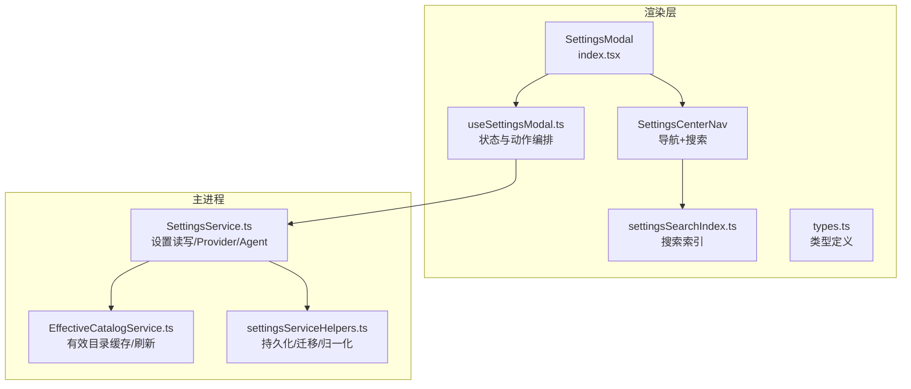
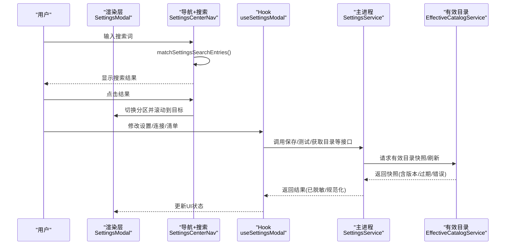
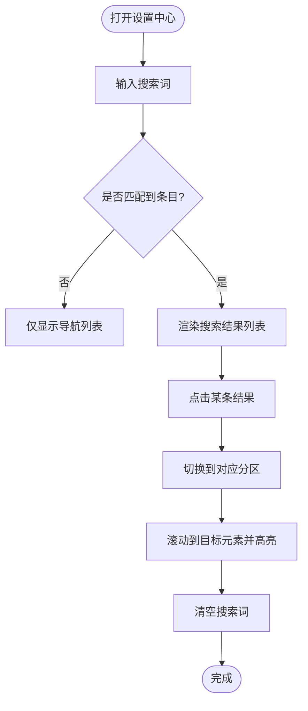
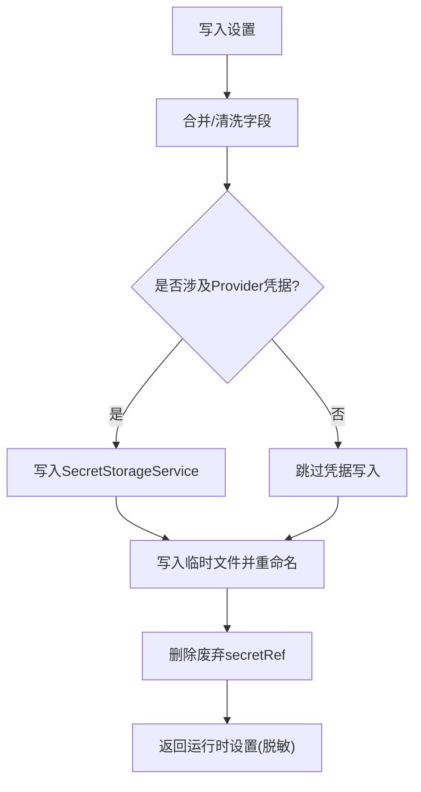
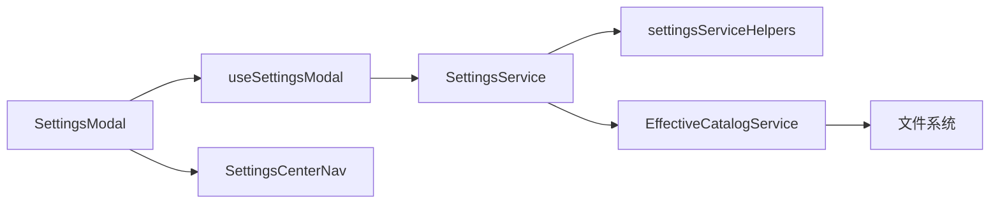

# 设置工具

<cite>
**本文引用的文件**
- [src/renderer/features/settings/SettingsModal/index.tsx](file://src/renderer/features/settings/SettingsModal/index.tsx)
- [src/renderer/features/settings/SettingsModal/SettingsCenterNav.tsx](file://src/renderer/features/settings/SettingsModal/SettingsCenterNav.tsx)
- [src/renderer/features/settings/SettingsModal/settingsSearchIndex.ts](file://src/renderer/features/settings/SettingsModal/settingsSearchIndex.ts)
- [src/renderer/features/settings/SettingsModal/useSettingsModal.ts](file://src/renderer/features/settings/SettingsModal/useSettingsModal.ts)
- [src/renderer/features/settings/SettingsModal/types.ts](file://src/renderer/features/settings/SettingsModal/types.ts)
- [src/main/settings/SettingsService.ts](file://src/main/settings/SettingsService.ts)
- [src/main/settings/EffectiveCatalogService.ts](file://src/main/settings/EffectiveCatalogService.ts)
- [src/main/settings/settingsServiceHelpers.ts](file://src/main/settings/settingsServiceHelpers.ts)
- [src/main/settings/README.md](file://src/main/settings/README.md)
</cite>

## 目录
1. [简介](#简介)
2. [项目结构](#项目结构)
3. [核心组件](#核心组件)
4. [架构总览](#架构总览)
5. [详细组件分析](#详细组件分析)
6. [依赖关系分析](#依赖关系分析)
7. [性能考量](#性能考量)
8. [故障排查指南](#故障排查指南)
9. [结论](#结论)
10. [附录](#附录)

## 简介
本文件面向“设置工具”功能，系统性说明设置中心的导航与搜索、通用 UI 部件、设置项渲染与验证、错误处理机制、设置搜索索引的构建与查询优化，以及设置导入导出与批量配置操作。同时提供设置扩展开发的工具链与调试技巧，帮助开发者快速定位问题并高效扩展能力。

## 项目结构
设置中心由渲染层（React）与主进程（Node/Electron）两部分组成：
- 渲染层负责设置弹窗容器、侧边导航、搜索框、各分区页面（通用、外观、工作区、模型、代理、技能、工具、钩子、策略）以及连接对话框等。
- 主进程负责设置持久化、提供者目录与有效目录缓存、凭据安全边界、窗口布局保存、Agent 清单与路由管理等。

图表来源
- [src/renderer/features/settings/SettingsModal/index.tsx:1-288](file://src/renderer/features/settings/SettingsModal/index.tsx#L1-L288)
- [src/renderer/features/settings/SettingsModal/SettingsCenterNav.tsx:1-125](file://src/renderer/features/settings/SettingsModal/SettingsCenterNav.tsx#L1-L125)
- [src/renderer/features/settings/SettingsModal/settingsSearchIndex.ts:1-147](file://src/renderer/features/settings/SettingsModal/settingsSearchIndex.ts#L1-L147)
- [src/renderer/features/settings/SettingsModal/useSettingsModal.ts:1-186](file://src/renderer/features/settings/SettingsModal/useSettingsModal.ts#L1-L186)
- [src/main/settings/SettingsService.ts:1-518](file://src/main/settings/SettingsService.ts#L1-L518)
- [src/main/settings/EffectiveCatalogService.ts:1-453](file://src/main/settings/EffectiveCatalogService.ts#L1-L453)
- [src/main/settings/settingsServiceHelpers.ts:1-408](file://src/main/settings/settingsServiceHelpers.ts#L1-L408)

章节来源
- [src/renderer/features/settings/SettingsModal/index.tsx:1-288](file://src/renderer/features/settings/SettingsModal/index.tsx#L1-L288)
- [src/main/settings/README.md:1-72](file://src/main/settings/README.md#L1-L72)

## 核心组件
- 设置弹窗容器：承载品牌标识、标题栏、关闭按钮、滚动面板与各分区内容；支持通过 Portal 挂载到 body。
- 设置中心导航：提供垂直标签式导航、键盘可达性、搜索输入与结果列表；点击结果可跳转到目标区域并高亮提示。
- 搜索索引：维护跨分区的条目映射（id、section、titleKey、keywords、target），按关键词匹配后返回条目集合。
- 设置模态 Hook：聚合设置状态、Provider 连接状态、Agent 清单草稿、自动保存、分类过滤、国际化与动作方法。
- 主进程设置服务：读取/写入设置、Provider 凭据管理、Agent 清单与路由、窗口布局保存、运行时路径与默认值合并。
- 有效目录服务：对 Provider 模型发现结果进行缓存、过期控制、去重、回退与订阅推送，生成带版本号的快照。

章节来源
- [src/renderer/features/settings/SettingsModal/index.tsx:1-288](file://src/renderer/features/settings/SettingsModal/index.tsx#L1-L288)
- [src/renderer/features/settings/SettingsModal/SettingsCenterNav.tsx:1-125](file://src/renderer/features/settings/SettingsModal/SettingsCenterNav.tsx#L1-L125)
- [src/renderer/features/settings/SettingsModal/settingsSearchIndex.ts:1-147](file://src/renderer/features/settings/SettingsModal/settingsSearchIndex.ts#L1-L147)
- [src/renderer/features/settings/SettingsModal/useSettingsModal.ts:1-186](file://src/renderer/features/settings/SettingsModal/useSettingsModal.ts#L1-L186)
- [src/main/settings/SettingsService.ts:1-518](file://src/main/settings/SettingsService.ts#L1-L518)
- [src/main/settings/EffectiveCatalogService.ts:1-453](file://src/main/settings/EffectiveCatalogService.ts#L1-L453)

## 架构总览
设置中心采用“渲染层展示 + 主进程数据与安全边界”的分层架构。渲染层通过 IPC 调用主进程能力，主进程统一处理设置持久化、凭据安全、Provider 目录与 Agent 清单。

图表来源
- [src/renderer/features/settings/SettingsModal/SettingsCenterNav.tsx:1-125](file://src/renderer/features/settings/SettingsModal/SettingsCenterNav.tsx#L1-L125)
- [src/renderer/features/settings/SettingsModal/settingsSearchIndex.ts:1-147](file://src/renderer/features/settings/SettingsModal/settingsSearchIndex.ts#L1-L147)
- [src/renderer/features/settings/SettingsModal/useSettingsModal.ts:1-186](file://src/renderer/features/settings/SettingsModal/useSettingsModal.ts#L1-L186)
- [src/main/settings/SettingsService.ts:1-518](file://src/main/settings/SettingsService.ts#L1-L518)
- [src/main/settings/EffectiveCatalogService.ts:1-453](file://src/main/settings/EffectiveCatalogService.ts#L1-L453)

## 详细组件分析

### 设置中心导航与搜索
- 导航组件提供垂直标签列表，支持键盘上下/左右/Home/End 移动焦点，当前选中项具备 aria-selected 与 tabIndex 控制。
- 搜索框使用统一的 SearchField 组件，输入变化时调用 matchSettingsSearchEntries 进行本地匹配，结果以列表形式呈现。
- 选择搜索结果后，先切换到对应 section，再滚动到目标元素并添加短暂高亮类，随后清空搜索词。

图表来源
- [src/renderer/features/settings/SettingsModal/SettingsCenterNav.tsx:1-125](file://src/renderer/features/settings/SettingsModal/SettingsCenterNav.tsx#L1-L125)
- [src/renderer/features/settings/SettingsModal/settingsSearchIndex.ts:1-147](file://src/renderer/features/settings/SettingsModal/settingsSearchIndex.ts#L1-L147)

章节来源
- [src/renderer/features/settings/SettingsModal/SettingsCenterNav.tsx:1-125](file://src/renderer/features/settings/SettingsModal/SettingsCenterNav.tsx#L1-L125)
- [src/renderer/features/settings/SettingsModal/settingsSearchIndex.ts:1-147](file://src/renderer/features/settings/SettingsModal/settingsSearchIndex.ts#L1-L147)

### 设置项渲染引擎与通用 UI 部件
- 设置弹窗作为容器，根据 activeSection 动态渲染各分区组件（通用、外观、工作区、模型、代理、技能、工具、钩子、策略）。
- 每个分区通过 props 接收设置值与回调，如语言、主题、字体缩放、指针光标、减少动效、Chrome 主题等。
- 资源范围面板（RuntimeScopePanel）在技能/工具/钩子/策略等分区中用于切换用户级或项目级作用域。
- 通用 UI 部件包括图标、按钮、搜索字段、抽屉/面板等，遵循设计系统规范。

章节来源
- [src/renderer/features/settings/SettingsModal/index.tsx:1-288](file://src/renderer/features/settings/SettingsModal/index.tsx#L1-L288)

### 设置搜索索引的构建与查询优化
- 索引结构包含 id、section、titleKey、keywords、target，覆盖通用、外观、工作区、模型、代理、技能、工具、钩子、策略等。
- 查询逻辑将搜索词小写化，并与标题翻译文本、section、keywords 拼接后进行包含匹配，时间复杂度 O(n)，n 为索引条目数。
- 优化点：
  - 索引规模较小，适合前端内存检索。
  - 可通过增加同义词、多语言关键词提升召回率。
  - 若未来条目增长，可引入前缀树或倒排索引以提升性能。

章节来源
- [src/renderer/features/settings/SettingsModal/settingsSearchIndex.ts:1-147](file://src/renderer/features/settings/SettingsModal/settingsSearchIndex.ts#L1-L147)

### 设置持久化、验证规则与错误处理
- 设置读取与初始化：
  - 启动时读取持久化设置，校验 schemaVersion，必要时执行硬重建并清理废弃凭据引用。
  - 提供 getAll/setAll/persistWindowLayout 等方法，分别用于全量读取、补丁写入与窗口布局增量写入。
- 验证与清洗：
  - 对 appearance、layout、tooling、agentRuntime 等字段进行 sanitize 与默认值合并。
  - Provider 凭据仅在 runtime-facing 路径解析，settings:get 返回的 provider entry 会清空 apiKey。
- 错误处理：
  - JSON 读取失败记录警告并返回空对象，避免崩溃。
  - 有效目录刷新失败记录 lastRefreshError，并在快照中标注 stale/refreshing 状态。
  - 存储 schema 不兼容抛出特定错误，阻止继续运行。

图表来源
- [src/main/settings/SettingsService.ts:249-383](file://src/main/settings/SettingsService.ts#L249-L383)
- [src/main/settings/settingsServiceHelpers.ts:327-355](file://src/main/settings/settingsServiceHelpers.ts#L327-L355)

章节来源
- [src/main/settings/SettingsService.ts:1-518](file://src/main/settings/SettingsService.ts#L1-L518)
- [src/main/settings/settingsServiceHelpers.ts:1-408](file://src/main/settings/settingsServiceHelpers.ts#L1-L408)

### 设置导入导出与批量配置操作
- 导入：
  - 支持导入 Agent 清单（handleImportAgentManifest），结合自动保存与回滚机制，失败时恢复草稿。
- 导出：
  - 通过 getProviderCatalog 暴露只读目录摘要，不包含敏感信息，便于外部消费与诊断。
- 批量操作：
  - setAll 支持一次性补丁多个字段（appearance/layout/tooling/agentRuntime/llm.providers），内部进行字段级合并与清洗。
  - 窗口布局支持同步与异步两种写入方式，避免阻塞事件循环。

章节来源
- [src/renderer/features/settings/SettingsModal/index.tsx:1-288](file://src/renderer/features/settings/SettingsModal/index.tsx#L1-L288)
- [src/main/settings/SettingsService.ts:249-383](file://src/main/settings/SettingsService.ts#L249-L383)
- [src/main/settings/settingsServiceHelpers.ts:327-355](file://src/main/settings/settingsServiceHelpers.ts#L327-L355)

### 设置扩展开发工具链与调试技巧
- 工具链：
  - 使用 ProviderCatalogRegistry 与 EffectiveCatalogService 管理 Provider 目录与模型发现，确保 DTO 不含敏感字段。
  - 通过 SecretStorageService 管理凭据，避免在渲染层持久化敏感信息。
  - 使用 settingsSanitize 与默认值合并保证数据结构稳定。
- 调试技巧：
  - 关注有效目录快照中的 catalogRevision、stale、refreshing、lastRefreshError 字段，判断缓存与刷新状态。
  - 检查 Provider 连接草稿中的 discoveryDiagnostic、testedConnectionSignature 等字段，辅助定位连接问题。
  - 利用 IPC 与 Browser App Bridge 的同一入口一致性，确保多端行为一致。

章节来源
- [src/main/settings/README.md:1-72](file://src/main/settings/README.md#L1-L72)
- [src/main/settings/EffectiveCatalogService.ts:150-244](file://src/main/settings/EffectiveCatalogService.ts#L150-L244)
- [src/renderer/features/settings/SettingsModal/types.ts:24-52](file://src/renderer/features/settings/SettingsModal/types.ts#L24-L52)

## 依赖关系分析
- 渲染层依赖：
  - SettingsModal 依赖 useSettingsModal 管理状态与动作，依赖 SettingsCenterNav 提供导航与搜索。
  - useSettingsModal 依赖 appSettingsStore、projectStore、i18n、providerConnection 等模块。
- 主进程依赖：
  - SettingsService 依赖 settingsServiceHelpers、SecretStorageService、AgentManifestService、ProviderCatalogService、ExecutionProfileService 等。
  - EffectiveCatalogService 依赖 effectiveCatalogMerge、appPathService，并通过文件系统持久化状态。

图表来源
- [src/renderer/features/settings/SettingsModal/index.tsx:1-288](file://src/renderer/features/settings/SettingsModal/index.tsx#L1-L288)
- [src/renderer/features/settings/SettingsModal/useSettingsModal.ts:1-186](file://src/renderer/features/settings/SettingsModal/useSettingsModal.ts#L1-L186)
- [src/main/settings/SettingsService.ts:1-518](file://src/main/settings/SettingsService.ts#L1-L518)
- [src/main/settings/EffectiveCatalogService.ts:1-453](file://src/main/settings/EffectiveCatalogService.ts#L1-L453)
- [src/main/settings/settingsServiceHelpers.ts:1-408](file://src/main/settings/settingsServiceHelpers.ts#L1-L408)

章节来源
- [src/renderer/features/settings/SettingsModal/index.tsx:1-288](file://src/renderer/features/settings/SettingsModal/index.tsx#L1-L288)
- [src/renderer/features/settings/SettingsModal/useSettingsModal.ts:1-186](file://src/renderer/features/settings/SettingsModal/useSettingsModal.ts#L1-L186)
- [src/main/settings/SettingsService.ts:1-518](file://src/main/settings/SettingsService.ts#L1-L518)
- [src/main/settings/EffectiveCatalogService.ts:1-453](file://src/main/settings/EffectiveCatalogService.ts#L1-L453)
- [src/main/settings/settingsServiceHelpers.ts:1-408](file://src/main/settings/settingsServiceHelpers.ts#L1-L408)

## 性能考量
- 搜索性能：索引规模小，字符串包含匹配开销低；如需扩展，建议引入倒排索引或前缀树。
- 设置写入：使用临时文件+原子重命名，避免部分写入导致损坏；异步写入避免阻塞事件循环。
- 有效目录缓存：基于 TTL 与版本号控制，减少重复刷新；失败指数退避，降低网络压力。
- Provider 凭据：仅在主进程解析，渲染层不持有明文，降低泄露风险与序列化成本。

[本节为通用指导，无需具体文件分析]

## 故障排查指南
- 设置文件损坏或不兼容：
  - 检查 schemaVersion，若不兼容会抛出存储 schema 错误；必要时触发硬重建并清理废弃凭据。
- Provider 连接失败：
  - 查看有效目录快照中的 lastRefreshError 与 stale/refreshing 状态；确认 discoveryDiagnostic 与 testedConnectionSignature。
- 凭据未生效：
  - 确认 API Key 或 OAuth 凭据是否正确写入 SecretStorageService；检查 secretRef 是否被正确替换或删除。
- 窗口布局未保存：
  - 使用 persistWindowLayout/persistWindowLayoutAsync 进行增量写入；检查临时文件是否成功重命名为最终文件。

章节来源
- [src/main/settings/settingsServiceHelpers.ts:112-126](file://src/main/settings/settingsServiceHelpers.ts#L112-L126)
- [src/main/settings/EffectiveCatalogService.ts:246-298](file://src/main/settings/EffectiveCatalogService.ts#L246-L298)
- [src/main/settings/SettingsService.ts:208-228](file://src/main/settings/SettingsService.ts#L208-L228)

## 结论
设置工具以清晰的渲染层与主进程边界实现安全的设置管理与 Provider 集成。导航与搜索提供直观的用户体验，搜索索引简单高效；设置持久化与验证确保数据一致性与安全性；有效目录服务提供稳定的模型发现与缓存机制。通过合理的工具链与调试技巧，开发者可以高效扩展与维护设置能力。

[本节为总结，无需具体文件分析]

## 附录
- 关键类型与枚举：
  - SettingsSection：general、appearance、workspace、models、skills、agents、tools、hooks、policy。
  - ProviderConnectionDraft：描述连接草稿的状态与字段可见性、测试结果与账户状态。
- 常用 IPC/Bridge：
  - settings:getProviderCatalog：获取 Provider 目录摘要（不含敏感信息）。
  - 浏览器应用桥接与 HTTP 端点复用同一处理器，保证一致性。

章节来源
- [src/renderer/features/settings/SettingsModal/types.ts:11-57](file://src/renderer/features/settings/SettingsModal/types.ts#L11-L57)
- [src/main/settings/README.md:10-41](file://src/main/settings/README.md#L10-L41)