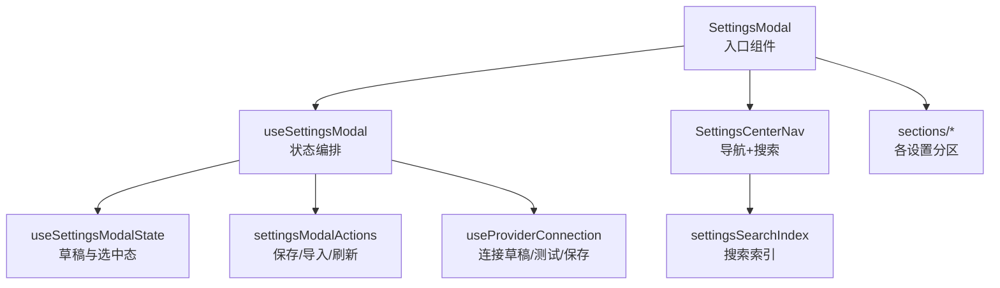
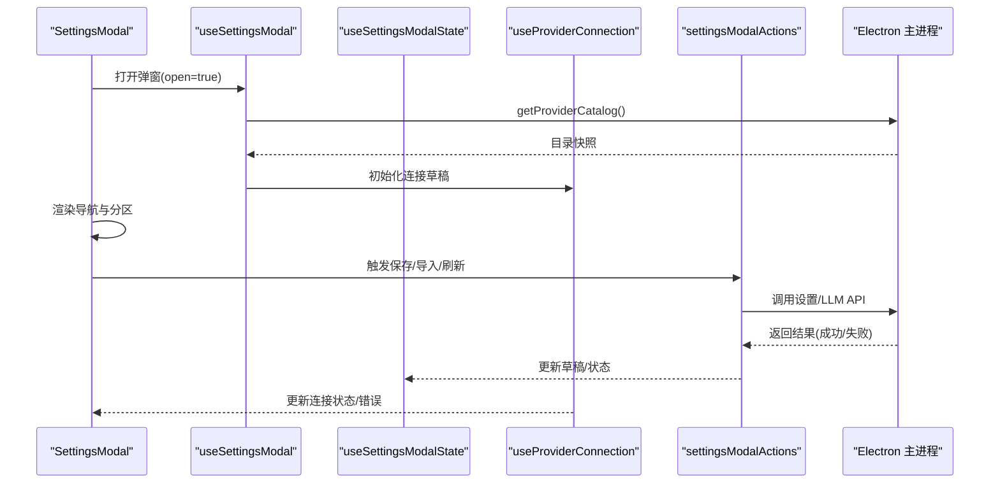
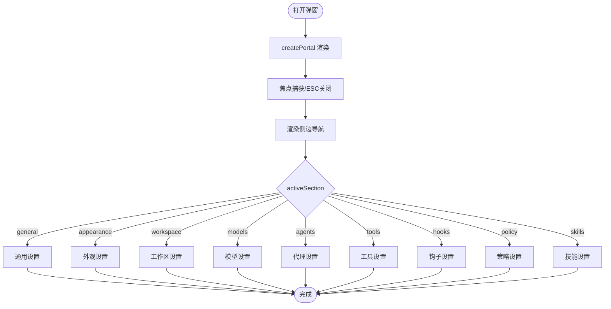
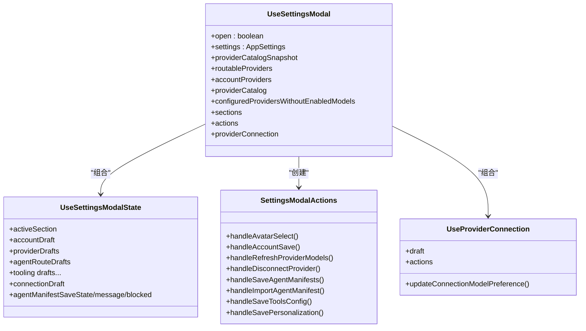
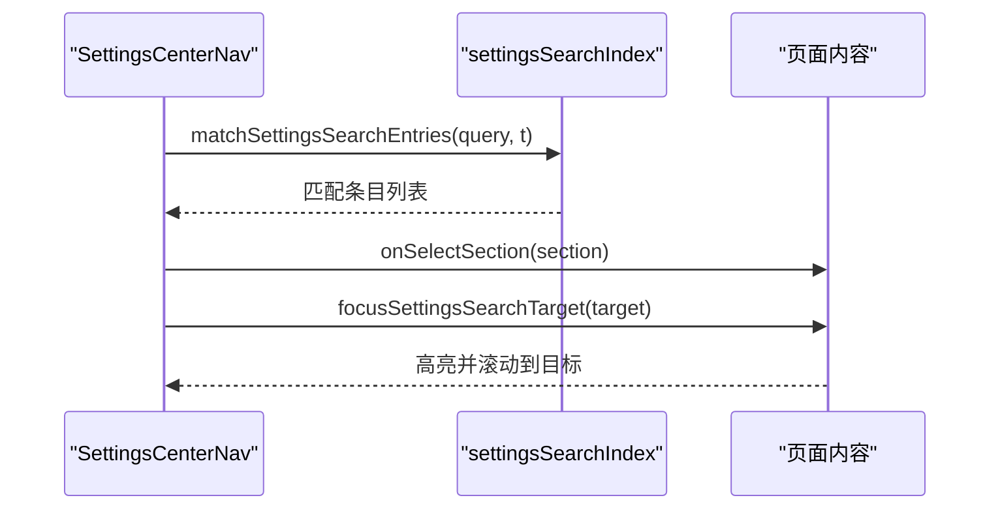
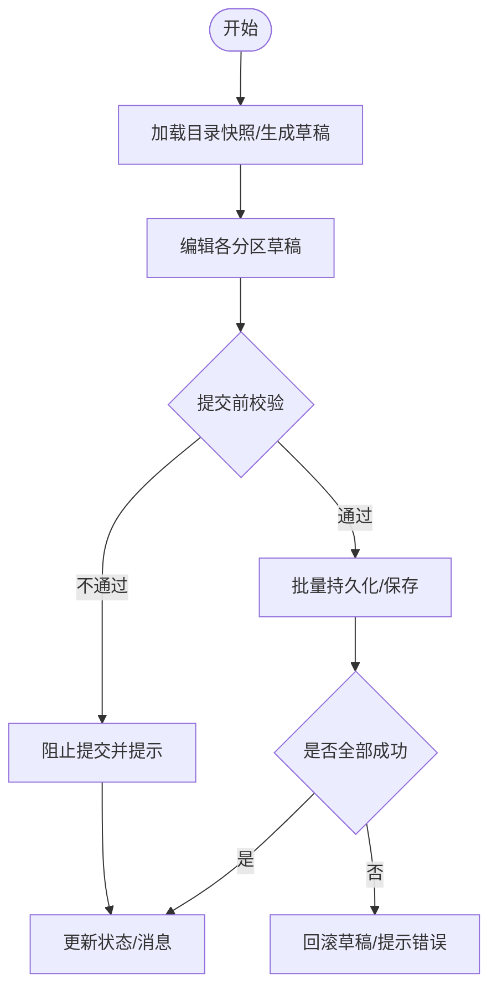
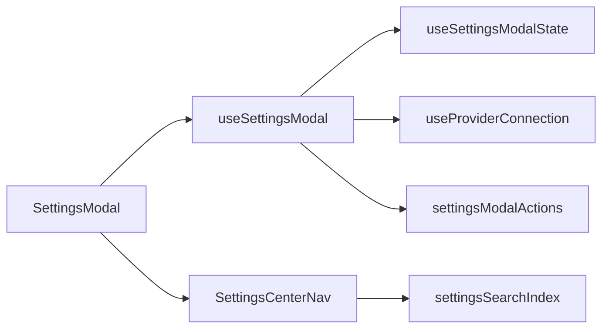

# 设置模态框架构

<cite>
**本文引用的文件**
- [index.tsx](file://src/renderer/features/settings/SettingsModal/index.tsx)
- [useSettingsModal.ts](file://src/renderer/features/settings/SettingsModal/useSettingsModal.ts)
- [useSettingsModalState.ts](file://src/renderer/features/settings/SettingsModal/useSettingsModalState.ts)
- [settingsModalActions.ts](file://src/renderer/features/settings/SettingsModal/settingsModalActions.ts)
- [types.ts](file://src/renderer/features/settings/SettingsModal/types.ts)
- [SettingsCenterNav.tsx](file://src/renderer/features/settings/SettingsModal/SettingsCenterNav.tsx)
- [settingsSearchIndex.ts](file://src/renderer/features/settings/SettingsModal/settingsSearchIndex.ts)
- [useAgentManifestAutosave.ts](file://src/renderer/features/settings/SettingsModal/useAgentManifestAutosave.ts)
- [useProviderConnection.ts](file://src/renderer/features/settings/SettingsModal/useProviderConnection.ts)
</cite>

## 目录
1. [简介](#简介)
2. [项目结构](#项目结构)
3. [核心组件与职责](#核心组件与职责)
4. [架构总览](#架构总览)
5. [详细组件分析](#详细组件分析)
6. [依赖关系分析](#依赖关系分析)
7. [性能考量](#性能考量)
8. [故障排查指南](#故障排查指南)
9. [结论](#结论)
10. [附录：扩展新设置类别指南](#附录：扩展新设置类别指南)

## 简介
本文件系统性说明“设置模态框”的整体设计模式、状态管理机制与组件结构。重点覆盖：
- SettingsModal 主组件的职责与渲染流程
- useSettingsModal 自定义 Hook 的状态编排与能力聚合
- 类型定义在数据契约与交互安全中的作用
- 设置面板的导航系统、搜索功能与响应式布局
- 设置数据的加载、验证与持久化流程（含代理清单自动保存）
- 扩展新设置类别的开发指南与最佳实践

## 项目结构
设置模态框位于渲染进程，采用“单入口 + 多分区”的组织方式：
- 入口组件：SettingsModal（负责弹窗外壳、侧边导航、内容区切换、连接对话框等）
- 状态层：useSettingsModalState（维护各设置项的草稿与选中态）、useSettingsModal（组合状态、动作、外部能力）
- 动作层：settingsModalActions（账户、模型、工具、代理清单等保存/导入/刷新等操作）
- 连接管理：useProviderConnection（提供商连接草稿、测试、保存、回滚）
- 导航与搜索：SettingsCenterNav + settingsSearchIndex（侧边导航、搜索索引、目标定位）
- 类型契约：types.ts（模块内类型与快照类型）

图表来源
- [index.tsx:30-288](file://src/renderer/features/settings/SettingsModal/index.tsx#L30-L288)
- [useSettingsModal.ts:33-186](file://src/renderer/features/settings/SettingsModal/useSettingsModal.ts#L33-L186)
- [useSettingsModalState.ts:16-132](file://src/renderer/features/settings/SettingsModal/useSettingsModalState.ts#L16-L132)
- [settingsModalActions.ts:40-225](file://src/renderer/features/settings/SettingsModal/settingsModalActions.ts#L40-L225)
- [useProviderConnection.ts:32-105](file://src/renderer/features/settings/SettingsModal/useProviderConnection.ts#L32-L105)
- [SettingsCenterNav.tsx:20-125](file://src/renderer/features/settings/SettingsModal/SettingsCenterNav.tsx#L20-L125)
- [settingsSearchIndex.ts:12-147](file://src/renderer/features/settings/SettingsModal/settingsSearchIndex.ts#L12-L147)

章节来源
- [index.tsx:30-288](file://src/renderer/features/settings/SettingsModal/index.tsx#L30-L288)
- [useSettingsModal.ts:33-186](file://src/renderer/features/settings/SettingsModal/useSettingsModal.ts#L33-L186)

## 核心组件与职责
- SettingsModal（入口）
  - 通过 createPortal 渲染到 body，控制焦点捕获与 ESC 关闭
  - 根据 activeSection 条件渲染各设置分区（通用、外观、工作区、模型、代理、技能、工具、钩子、策略）
  - 承载 ProviderConnectDialog（提供商连接向导）
  - 集成运行时概览（RuntimeScopePanel）用于按资源范围筛选
- useSettingsModal（编排）
  - 初始化并归一化提供商目录快照
  - 组合 useSettingsModalState 与 useProviderConnection
  - 计算可路由/已配置/账号类提供商列表
  - 组装 sections 导航元数据
  - 创建 actions（保存/导入/刷新/断开等）
  - 接入代理清单自动保存 Hook
- useSettingsModalState（草稿）
  - 将 AppSettings 映射为各分区的草稿对象（账户、提供商、代理路由、工具、全局指令等）
  - 打开时重置/同步草稿；支持项目级上下文切换
- settingsModalActions（动作）
  - 头像选择、账户保存、刷新模型、断开提供商
  - 代理清单批量保存、导入、错误处理与状态更新
  - 工具配置保存、个性化指令保存
- types（类型）
  - 统一设置分区枚举、提供商连接草稿、协议与目录快照类型

章节来源
- [index.tsx:30-288](file://src/renderer/features/settings/SettingsModal/index.tsx#L30-L288)
- [useSettingsModal.ts:33-186](file://src/renderer/features/settings/SettingsModal/useSettingsModal.ts#L33-L186)
- [useSettingsModalState.ts:16-132](file://src/renderer/features/settings/SettingsModal/useSettingsModalState.ts#L16-L132)
- [settingsModalActions.ts:40-225](file://src/renderer/features/settings/SettingsModal/settingsModalActions.ts#L40-L225)
- [types.ts:11-57](file://src/renderer/features/settings/SettingsModal/types.ts#L11-L57)

## 架构总览
设置模态框采用“视图-状态-动作-服务”分层：
- 视图层：SettingsModal 与各 sections 分区
- 状态层：useSettingsModalState 维护草稿；useSettingsModal 聚合状态与副作用
- 动作层：settingsModalActions 封装业务操作；useProviderConnection 管理连接生命周期
- 服务层：通过 window.electronAPI 调用主进程能力（设置读写、LLM 刷新、文件选择等）

图表来源
- [useSettingsModal.ts:52-69](file://src/renderer/features/settings/SettingsModal/useSettingsModal.ts#L52-L69)
- [useProviderConnection.ts:32-105](file://src/renderer/features/settings/SettingsModal/useProviderConnection.ts#L32-L105)
- [settingsModalActions.ts:51-225](file://src/renderer/features/settings/SettingsModal/settingsModalActions.ts#L51-L225)
- [index.tsx:30-288](file://src/renderer/features/settings/SettingsModal/index.tsx#L30-L288)

## 详细组件分析

### SettingsModal 主组件
- 使用 createPortal 挂载到 body，避免层级问题
- 通过 useModalFocus 实现焦点陷阱与 ESC 关闭
- 根据 activeSection 条件渲染各分区，并在切换时滚动至顶部
- 当存在 connectionDraft 时，阻止关闭并显示 ProviderConnectDialog
- 集成 RuntimeScopePanel 以用户/项目维度展示资源

图表来源
- [index.tsx:30-288](file://src/renderer/features/settings/SettingsModal/index.tsx#L30-L288)

章节来源
- [index.tsx:30-288](file://src/renderer/features/settings/SettingsModal/index.tsx#L30-L288)

### useSettingsModal 自定义 Hook
- 初始化提供商目录快照（open 时拉取，异常降级为空）
- 组合 useSettingsModalState 与 useProviderConnection
- 计算分类后的提供商集合（可路由、账号类、已配置无可用模型）
- 构建 sections 导航元数据
- 创建 actions 并注入代理清单自动保存 Hook
- 暴露主题/语言/字体/动效等设置变更方法

图表来源
- [useSettingsModal.ts:33-186](file://src/renderer/features/settings/SettingsModal/useSettingsModal.ts#L33-L186)
- [useSettingsModalState.ts:16-132](file://src/renderer/features/settings/SettingsModal/useSettingsModalState.ts#L16-L132)
- [settingsModalActions.ts:40-225](file://src/renderer/features/settings/SettingsModal/settingsModalActions.ts#L40-L225)
- [useProviderConnection.ts:32-105](file://src/renderer/features/settings/SettingsModal/useProviderConnection.ts#L32-L105)

章节来源
- [useSettingsModal.ts:33-186](file://src/renderer/features/settings/SettingsModal/useSettingsModal.ts#L33-L186)

### 类型定义的作用
- SettingsSection：约束设置分区枚举，确保导航与渲染一致性
- ProviderConnectionDraft：描述连接向导中的临时字段、可见性、测试结果、账户状态等
- ProviderCatalogSnapshot：对齐主进程返回的目录结构，便于前端排序与展示

章节来源
- [types.ts:11-57](file://src/renderer/features/settings/SettingsModal/types.ts#L11-L57)

### 导航系统与搜索
- SettingsCenterNav 提供垂直导航与键盘可达性（方向键/Home/End）
- 内置 SearchField，基于 settingsSearchIndex 进行标题、分区与关键词匹配
- 命中后自动滚动到目标元素并高亮提示

图表来源
- [SettingsCenterNav.tsx:20-125](file://src/renderer/features/settings/SettingsModal/SettingsCenterNav.tsx#L20-L125)
- [settingsSearchIndex.ts:12-147](file://src/renderer/features/settings/SettingsModal/settingsSearchIndex.ts#L12-L147)

章节来源
- [SettingsCenterNav.tsx:20-125](file://src/renderer/features/settings/SettingsModal/SettingsCenterNav.tsx#L20-L125)
- [settingsSearchIndex.ts:12-147](file://src/renderer/features/settings/SettingsModal/settingsSearchIndex.ts#L12-L147)

### 响应式布局
- 使用 CSS 类名组织布局（如 settings-center-sidebar、settings-center-content、settings-center-panel）
- 通过 panelRef 在切换分区时滚动至顶部，保证一致体验
- 结合媒体查询与滚动条样式实现窄屏适配（具体样式由对应 CSS 文件管理）

章节来源
- [index.tsx:114-259](file://src/renderer/features/settings/SettingsModal/index.tsx#L114-L259)

### 设置数据的加载、验证与持久化
- 加载
  - 打开弹窗时拉取提供商目录快照，异常时降级为空
  - 从 AppSettings 克隆生成各分区草稿，确保编辑隔离
- 验证
  - 代理清单提交前执行 handoff 校验，阻止冲突或非法配置
  - 连接测试/保存失败时回滚本地偏好并显示错误信息
- 持久化
  - 账户/工具/个性化：通过 patchSettings/updateProfile/saveProvider 写入
  - 代理清单：批量提交，支持自动保存与关闭时兜底保存；失败时回滚
  - 连接偏好：修改模型偏好即持久化，失败则回滚

图表来源
- [useSettingsModal.ts:117-162](file://src/renderer/features/settings/SettingsModal/useSettingsModal.ts#L117-L162)
- [settingsModalActions.ts:109-225](file://src/renderer/features/settings/SettingsModal/settingsModalActions.ts#L109-L225)
- [useAgentManifestAutosave.ts:82-180](file://src/renderer/features/settings/SettingsModal/useAgentManifestAutosave.ts#L82-L180)
- [useProviderConnection.ts:48-97](file://src/renderer/features/settings/SettingsModal/useProviderConnection.ts#L48-L97)

章节来源
- [useSettingsModal.ts:117-162](file://src/renderer/features/settings/SettingsModal/useSettingsModal.ts#L117-L162)
- [settingsModalActions.ts:109-225](file://src/renderer/features/settings/SettingsModal/settingsModalActions.ts#L109-L225)
- [useAgentManifestAutosave.ts:82-180](file://src/renderer/features/settings/SettingsModal/useAgentManifestAutosave.ts#L82-L180)
- [useProviderConnection.ts:48-97](file://src/renderer/features/settings/SettingsModal/useProviderConnection.ts#L48-L97)

## 依赖关系分析
- 组件耦合
  - SettingsModal 依赖 useSettingsModal 提供的状态与动作，低耦合地消费各分区组件
  - useSettingsModal 组合 useSettingsModalState、useProviderConnection、settingsModalActions
- 外部依赖
  - Electron 主进程 API：设置读写、LLM 刷新、文件选择等
  - 共享类型：AppSettings、LlmProviderEntry、AgentManifestDraft 等
- 潜在循环
  - 当前通过 Hook 拆分职责，未见直接循环依赖；注意新增 Hook 时保持单向依赖

图表来源
- [index.tsx:30-288](file://src/renderer/features/settings/SettingsModal/index.tsx#L30-L288)
- [useSettingsModal.ts:33-186](file://src/renderer/features/settings/SettingsModal/useSettingsModal.ts#L33-L186)
- [SettingsCenterNav.tsx:20-125](file://src/renderer/features/settings/SettingsModal/SettingsCenterNav.tsx#L20-L125)
- [settingsSearchIndex.ts:12-147](file://src/renderer/features/settings/SettingsModal/settingsSearchIndex.ts#L12-L147)

章节来源
- [useSettingsModal.ts:33-186](file://src/renderer/features/settings/SettingsModal/useSettingsModal.ts#L33-L186)
- [index.tsx:30-288](file://src/renderer/features/settings/SettingsModal/index.tsx#L30-L288)

## 性能考量
- 目录快照仅在 open 时拉取，避免重复请求
- 提供商列表通过 useMemo 过滤与排序，减少重渲染开销
- 代理清单自动保存使用防抖与版本控制，避免频繁写入
- 连接偏好变更即时持久化，失败快速回滚，降低长事务风险

[本节为通用指导，无需特定文件引用]

## 故障排查指南
- 提供商目录为空
  - 检查 open 时的 getProviderCatalog 调用与异常分支
- 代理清单保存失败
  - 查看自动保存 Hook 的错误分支与回滚逻辑
  - 确认 blockSubmit/blockProjectedSubmit 是否拦截
- 连接测试/保存失败
  - 检查 updateConnectionModelPreference 的回滚路径
  - 核对 providerDrafts 与 connectionDraft 的一致性

章节来源
- [useSettingsModal.ts:52-69](file://src/renderer/features/settings/SettingsModal/useSettingsModal.ts#L52-L69)
- [useAgentManifestAutosave.ts:121-132](file://src/renderer/features/settings/SettingsModal/useAgentManifestAutosave.ts#L121-L132)
- [useProviderConnection.ts:48-97](file://src/renderer/features/settings/SettingsModal/useProviderConnection.ts#L48-L97)

## 结论
设置模态框通过清晰的 Hook 分层与类型契约，实现了可扩展、可维护的设置界面。其特点包括：
- 以草稿为核心的编辑模型，保障数据安全与可回滚
- 统一的导航与搜索机制，提升可用性
- 完善的持久化与错误处理，确保数据一致性
- 良好的扩展点，便于新增设置类别与能力

[本节为总结，无需特定文件引用]

## 附录：扩展新设置类别指南
步骤建议：
1. 新增分区枚举
   - 在 types.ts 的 SettingsSection 中添加新分区标识
2. 注册导航项
   - 在 useSettingsModal.ts 的 sections 数组中增加新项（id、label）
3. 实现分区组件
   - 在 sections/ 下新建组件，接收所需 props，处理本地草稿与保存
4. 接入搜索索引
   - 在 settingsSearchIndex.ts 添加条目（id、section、titleKey、keywords、target）
5. 在 SettingsModal 中渲染
   - 在 index.tsx 的条件渲染块中增加新分区
6. 持久化与验证
   - 通过 settingsModalActions 或专用 Hook 调用 patchSettings/saveProvider 等
   - 如需复杂校验，参考代理清单的 blockSubmit/blockProjectedSubmit 模式
7. 可选：运行时范围
   - 若需按用户/项目范围展示，复用 RuntimeScopePanel 与 overview 回调

最佳实践：
- 所有敏感字段仅存在于连接草稿中，不进入持久化设置
- 任何异步保存都应有失败回滚与用户提示
- 搜索索引应覆盖中英文关键词，提升可发现性
- 保持分区组件无副作用，状态集中在 Hook 层

章节来源
- [types.ts:11-20](file://src/renderer/features/settings/SettingsModal/types.ts#L11-L20)
- [useSettingsModal.ts:105-115](file://src/renderer/features/settings/SettingsModal/useSettingsModal.ts#L105-L115)
- [settingsSearchIndex.ts:12-132](file://src/renderer/features/settings/SettingsModal/settingsSearchIndex.ts#L12-L132)
- [index.tsx:160-257](file://src/renderer/features/settings/SettingsModal/index.tsx#L160-L257)
- [settingsModalActions.ts:190-225](file://src/renderer/features/settings/SettingsModal/settingsModalActions.ts#L190-L225)