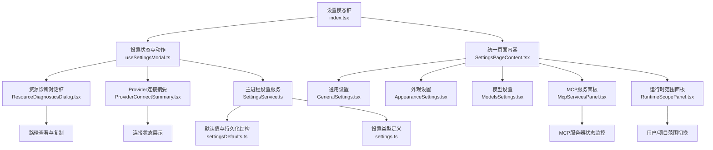
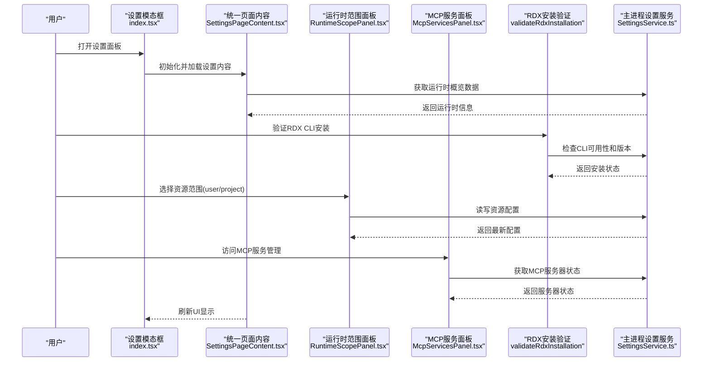
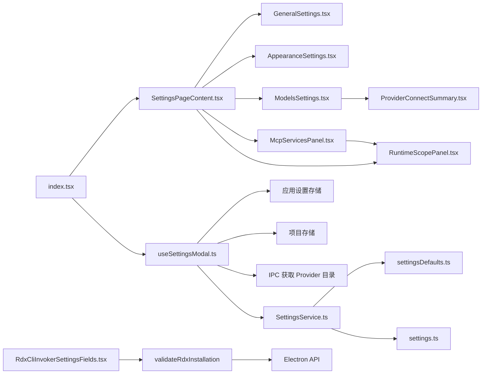

# 设置面板

<cite>
**本文引用的文件**
- [src/renderer/features/settings/SettingsModal/index.tsx](file://src/renderer/features/settings/SettingsModal/index.tsx)
- [src/renderer/features/settings/SettingsModal/SettingsPageContent.tsx](file://src/renderer/features/settings/SettingsModal/SettingsPageContent.tsx)
- [src/renderer/features/settings/SettingsModal/useSettingsModal.ts](file://src/renderer/features/settings/SettingsModal/useSettingsModal.ts)
- [src/renderer/features/settings/SettingsModal/SettingsCenterNav.tsx](file://src/renderer/features/settings/SettingsModal/SettingsCenterNav.tsx)
- [src/renderer/features/settings/SettingsModal/sections/RuntimeScopePanel.tsx](file://src/renderer/features/settings/SettingsModal/sections/RuntimeScopePanel.tsx)
- [src/renderer/features/settings/SettingsModal/sections/ResourceDiagnosticsDialog.tsx](file://src/renderer/features/settings/SettingsModal/sections/ResourceDiagnosticsDialog.tsx)
- [src/renderer/features/settings/SettingsModal/sections/ModelsSettings.tsx](file://src/renderer/features/settings/SettingsModal/sections/ModelsSettings.tsx)
- [src/renderer/features/settings/SettingsModal/sections/ProvidersSettings.tsx](file://src/renderer/features/settings/SettingsModal/sections/ProvidersSettings.tsx)
- [src/renderer/features/settings/SettingsModal/sections/McpServicesPanel.tsx](file://src/renderer/features/settings/SettingsModal/sections/McpServicesPanel.tsx)
- [src/renderer/features/settings/SettingsModal/sections/ProviderConnectSummary.tsx](file://src/renderer/features/settings/SettingsModal/sections/ProviderConnectSummary.tsx)
- [src/renderer/features/settings/SettingsModal/sections/RdxCliInvokerSettingsFields.tsx](file://src/renderer/features/settings/SettingsModal/sections/RdxCliInvokerSettingsFields.tsx)
- [src/renderer/features/settings/SettingsModal/sections/ToolsSettings.tsx](file://src/renderer/features/settings/SettingsModal/sections/ToolsSettings.tsx)
- [src/renderer/platform/rdxInstallation.ts](file://src/renderer/platform/rdxInstallation.ts)
- [src/main/settings/SettingsService.ts](file://src/main/settings/SettingsService.ts)
- [src/main/settings/settingsDefaults.ts](file://src/main/settings/settingsDefaults.ts)
- [src/shared/types/settings.ts](file://src/shared/types/settings.ts)
</cite>

## 更新摘要
**变更内容**
- 移除了 RdxActionsFields 组件和生命周期模板配置功能，简化了设置界面
- 新增了 RDX CLI 安装的实时验证功能，提供更直观的安装状态反馈
- 增强了工具设置面板的验证机制，支持即时检查 RDX CLI 可用性
- 优化了设置界面的用户体验，减少了不必要的配置选项

## 目录
1. [简介](#简介)
2. [项目结构](#项目结构)
3. [核心组件](#核心组件)
4. [架构总览](#架构总览)
5. [详细组件分析](#详细组件分析)
6. [依赖关系分析](#依赖关系分析)
7. [性能考量](#性能考量)
8. [故障排除指南](#故障排除指南)
9. [结论](#结论)
10. [附录](#附录)

## 简介
本文件面向 RDC-Agent 的设置面板，系统性说明设置模态框的整体架构、各设置分类（Agent 配置、Provider 连接、工具设置、外观定制等）的职责与交互，并详细描述每个设置项的作用、配置选项与验证规则。同时覆盖设置持久化机制、配置迁移、用户偏好管理、导入导出、批量配置与环境变量支持，并提供常见配置场景示例与故障排除建议。

**更新** 本次更新反映了设置面板的重大简化：移除了 RdxActionsFields 组件和生命周期模板配置功能，新增了 RDX CLI 安装的实时验证功能，显著提升了用户体验和配置效率。

## 项目结构
设置面板由渲染层（React 模态与分节组件）与主进程（设置服务、默认值、类型定义）共同构成：
- 渲染层入口与导航：设置模态框容器负责组织侧边栏导航与各设置分节，并通过 SettingsPageContent 统一管理页面内容。
- 状态与动作：统一通过自定义 Hook 聚合设置状态、Provider 连接草稿、自动保存、搜索索引等逻辑。
- 主进程设置服务：负责读取/写入持久化配置、清理敏感信息、合并默认值、执行迁移与权限控制。
- 类型与默认值：集中定义设置数据结构、主题、布局、工具、Agent 运行时等默认值与校验约束。

**图示来源**
- [src/renderer/features/settings/SettingsModal/index.tsx:24-185](file://src/renderer/features/settings/SettingsModal/index.tsx#L24-L185)
- [src/renderer/features/settings/SettingsModal/SettingsPageContent.tsx:32-174](file://src/renderer/features/settings/SettingsModal/SettingsPageContent.tsx#L32-L174)
- [src/renderer/features/settings/SettingsModal/sections/McpServicesPanel.tsx:53-146](file://src/renderer/features/settings/SettingsModal/sections/McpServicesPanel.tsx#L53-L146)
- [src/renderer/features/settings/SettingsModal/sections/ProviderConnectSummary.tsx:11-60](file://src/renderer/features/settings/SettingsModal/sections/ProviderConnectSummary.tsx#L11-L60)

**章节来源**
- [src/renderer/features/settings/SettingsModal/index.tsx:24-185](file://src/renderer/features/settings/SettingsModal/index.tsx#L24-L185)
- [src/renderer/features/settings/SettingsModal/SettingsPageContent.tsx:32-174](file://src/renderer/features/settings/SettingsModal/SettingsPageContent.tsx#L32-L174)
- [src/main/settings/SettingsService.ts:103-139](file://src/main/settings/SettingsService.ts#L103-L139)
- [src/main/settings/settingsDefaults.ts:180-192](file://src/main/settings/settingsDefaults.ts#L180-L192)
- [src/shared/types/settings.ts:9-14](file://src/shared/types/settings.ts#L9-L14)

## 核心组件
- 设置模态框容器：提供侧边栏导航、标题栏、关闭按钮与内容区；通过 SettingsPageContent 统一管理各设置分区。
- 统一页面内容组件：集中处理所有设置分区的渲染逻辑，包括 general、appearance、models、agents、tools、hooks、policy 等。
- MCP 服务面板：提供 MCP 服务器的状态监控、信任管理和配置编辑功能。
- Provider 连接摘要：提供统一的连接状态展示和协议信息摘要。
- 运行时范围面板：增强的资源管理界面，支持更多资源类型和高级操作。
- 资源诊断对话框：独立的工作区概览视图，展示当前环境与资源路径。

**更新** 移除了 RdxActionsFields 组件和生命周期模板配置功能，新增了 RDX CLI 安装的实时验证功能，简化了设置界面。

**章节来源**
- [src/renderer/features/settings/SettingsModal/index.tsx:24-185](file://src/renderer/features/settings/SettingsModal/index.tsx#L24-L185)
- [src/renderer/features/settings/SettingsModal/SettingsPageContent.tsx:32-174](file://src/renderer/features/settings/SettingsModal/SettingsPageContent.tsx#L32-L174)
- [src/renderer/features/settings/SettingsModal/sections/McpServicesPanel.tsx:53-146](file://src/renderer/features/settings/SettingsModal/sections/McpServicesPanel.tsx#L53-L146)
- [src/renderer/features/settings/SettingsModal/sections/ProviderConnectSummary.tsx:11-60](file://src/renderer/features/settings/SettingsModal/sections/ProviderConnectSummary.tsx#L11-L60)

## 架构总览
设置面板遵循"渲染层只展示可保存/可诊断数据，主进程负责解析敏感信息与运行时能力"的边界原则。Provider Catalog 作为独立契约，不混入 settings:get 的派生 UI 状态。

**更新** 新的架构引入了 RDX CLI 安装验证机制，提供了更直观的工具配置体验。

**图示来源**
- [src/renderer/features/settings/SettingsModal/index.tsx:24-185](file://src/renderer/features/settings/SettingsModal/index.tsx#L24-L185)
- [src/renderer/features/settings/SettingsModal/SettingsPageContent.tsx:32-174](file://src/renderer/features/settings/SettingsModal/SettingsPageContent.tsx#L32-L174)
- [src/renderer/features/settings/SettingsModal/sections/McpServicesPanel.tsx:53-146](file://src/renderer/features/settings/SettingsModal/sections/McpServicesPanel.tsx#L53-L146)
- [src/renderer/platform/rdxInstallation.ts:5-14](file://src/renderer/platform/rdxInstallation.ts#L5-L14)
- [src/main/settings/SettingsService.ts:249-383](file://src/main/settings/SettingsService.ts#L249-L383)

## 详细组件分析

### 设置模态框容器（index.tsx）
- 职责：组织导航与内容区，通过 SettingsPageContent 统一管理各设置分区；在需要时弹出 Provider 连接对话框。
- 关键交互：
  - 侧边栏导航：通过 sections 数组驱动，包含 general/appearance/models/agents/skills/tools/hooks/policy。
  - Provider 连接：当 connectionDraft 存在时，渲染 ProviderConnectDialog，透传连接草稿、模型选择、测试与保存回调。
  - 运行时概览：使用 useRdxRuntimeOverview Hook 获取运行时环境信息。
  - 资源范围：通过 state 管理 user/project 范围切换。

**更新** 移除了直接的分区渲染逻辑，改为通过 SettingsPageContent 统一管理，并集成了简化的工具配置界面。

**图示来源**
- [src/renderer/features/settings/SettingsModal/index.tsx:24-185](file://src/renderer/features/settings/SettingsModal/index.tsx#L24-L185)
- [src/renderer/features/settings/SettingsModal/SettingsPageContent.tsx:32-174](file://src/renderer/features/settings/SettingsModal/SettingsPageContent.tsx#L32-L174)

**章节来源**
- [src/renderer/features/settings/SettingsModal/index.tsx:24-185](file://src/renderer/features/settings/SettingsModal/index.tsx#L24-L185)

### 统一页面内容组件（SettingsPageContent.tsx）
- 职责：集中管理所有设置分区的渲染逻辑，根据 activeSection 动态渲染对应组件。
- 功能特性：
  - 分区路由：根据 activeSection 渲染对应的设置组件。
  - 状态传递：向各分区组件传递必要的状态和回调函数。
  - 运行时集成：集成运行时概览数据和范围切换功能。
  - 资源管理：支持资源的创建、编辑、删除等操作。

**更新** 移除了生命周期模板配置相关的渲染逻辑，简化了工具设置区域的复杂度。

**章节来源**
- [src/renderer/features/settings/SettingsModal/SettingsPageContent.tsx:32-174](file://src/renderer/features/settings/SettingsModal/SettingsPageContent.tsx#L32-L174)

### RDX CLI 安装验证（RdxCliInvokerSettingsFields.tsx）
- 职责：提供 RDX CLI 工具的实时安装验证功能，确保工具配置的正确性。
- 功能特性：
  - 实时验证：点击验证按钮后立即检查 RDX CLI 的安装状态和版本信息。
  - 状态反馈：显示验证中、已验证、不可用等不同状态的提示信息。
  - 错误处理：捕获并显示验证过程中的各种错误情况。
  - 配置同步：确保验证基于最新的配置草稿而非已保存的配置。

**新增** 这是新引入的 RDX CLI 安装验证功能，显著提升了工具配置的可靠性和用户体验。

**章节来源**
- [src/renderer/features/settings/SettingsModal/sections/RdxCliInvokerSettingsFields.tsx:34-43](file://src/renderer/features/settings/SettingsModal/sections/RdxCliInvokerSettingsFields.tsx#L34-L43)
- [src/renderer/features/settings/SettingsModal/sections/RdxCliInvokerSettingsFields.tsx:68-75](file://src/renderer/features/settings/SettingsModal/sections/RdxCliInvokerSettingsFields.tsx#L68-L75)

### RDX 安装验证器（rdxInstallation.ts）
- 职责：封装 RDX CLI 安装的验证逻辑，提供统一的验证接口。
- 功能特性：
  - 配置比较：检查草稿配置与已保存配置是否一致，避免不必要的验证调用。
  - 异步验证：通过 Electron API 调用主进程的 RDX CLI 验证功能。
  - 结果处理：返回详细的工具运行时摘要信息或空值表示需要保存后才能验证。

**新增** 这是新引入的 RDX 安装验证器，为设置面板提供了可靠的安装状态检查能力。

**章节来源**
- [src/renderer/platform/rdxInstallation.ts:5-14](file://src/renderer/platform/rdxInstallation.ts#L5-L14)

### MCP 服务面板（McpServicesPanel.tsx）
- 职责：提供 MCP 服务器的状态监控、信任管理和配置编辑功能。
- 功能特性：
  - 状态监控：实时显示 MCP 服务器的连接状态和工具数量。
  - 信任管理：支持 MCP 服务器的信任授予和撤销。
  - 配置编辑：提供 MCP 服务器的配置编辑界面。
  - 错误处理：显示连接错误和诊断信息。

**章节来源**
- [src/renderer/features/settings/SettingsModal/sections/McpServicesPanel.tsx:53-146](file://src/renderer/features/settings/SettingsModal/sections/McpServicesPanel.tsx#L53-L146)

### Provider 连接摘要（ProviderConnectSummary.tsx）
- 职责：提供统一的 Provider 连接状态展示和协议信息摘要。
- 功能特性：
  - 协议摘要：显示 Provider 的协议、端点类、运营商和目录所有权信息。
  - 连接状态：提供统一的连接状态指示器（未测试、测试中、已连接、失败）。
  - 发现提示：在未成功测试前显示空发现面板。

**章节来源**
- [src/renderer/features/settings/SettingsModal/sections/ProviderConnectSummary.tsx:11-60](file://src/renderer/features/settings/SettingsModal/sections/ProviderConnectSummary.tsx#L11-L60)

### 运行时范围面板（RuntimeScopePanel.tsx）
- 职责：提供统一的资源管理界面，支持用户/项目范围切换和资源CRUD操作。
- 功能特性：
  - 范围切换：支持user/project两种资源范围的切换。
  - 资源列表：显示当前范围内的资源列表，支持选择、编辑、删除。
  - 编辑器集成：支持内联编辑或对话框编辑模式。
  - 导入导出：支持资源的导入和位置揭示功能。
  - 状态管理：处理保存状态、删除确认、未保存更改提示。

**更新** 移除了生命周期模板配置相关的功能，专注于核心的资源管理能力。

**章节来源**
- [src/renderer/features/settings/SettingsModal/sections/RuntimeScopePanel.tsx:19-200](file://src/renderer/features/settings/SettingsModal/sections/RuntimeScopePanel.tsx#L19-L200)

### 资源诊断对话框（ResourceDiagnosticsDialog.tsx）
- 职责：提供工作区概览视图，展示当前环境和资源路径信息。
- 功能特性：
  - 根路径显示：展示用户根路径和项目根路径。
  - 路径组显示：按范围显示各类资源的实际路径。
  - 路径操作：支持路径复制和文件管理器中显示。
  - 只读视图：不提供修改功能，仅用于诊断和调试。

**章节来源**
- [src/renderer/features/settings/SettingsModal/sections/ResourceDiagnosticsDialog.tsx:30-116](file://src/renderer/features/settings/SettingsModal/sections/ResourceDiagnosticsDialog.tsx#L30-L116)

### 设置中心导航（SettingsCenterNav.tsx）
- 职责：提供设置面板的侧边栏导航，支持搜索和键盘导航。
- 功能特性：
  - 搜索功能：支持设置项的快速搜索和定位。
  - 键盘导航：支持箭头键和Home/End键的键盘操作。
  - 焦点管理：自动管理导航项的tabIndex和焦点状态。
  - 结果高亮：搜索结果会高亮显示并自动滚动到目标位置。

**章节来源**
- [src/renderer/features/settings/SettingsModal/SettingsCenterNav.tsx:20-125](file://src/renderer/features/settings/SettingsModal/SettingsCenterNav.tsx#L20-L125)

### 主进程设置服务（SettingsService.ts）
- 职责：初始化路径与执行环境、读取/写入持久化设置、合并默认值、清理敏感字段、Provider 凭据管理与 Agent 清单操作。
- 关键点：
  - initialize/getAll：确保初始化，读取 JSON 设置文件，断言 schemaVersion，转换为运行时设置。
  - setAll：合并 appearance/layout/profile/tooling/agentRuntime/llm.providers，清理 apiKey 输出，删除废弃 secret 引用。
  - 窗口布局快速持久化：persistWindowLayout/persistWindowLayoutAsync 仅写 window 布局，跳过 provider 归一化。
  - Provider 连接：saveProviderConnection/saveProviderAccountConnection/rotateProviderAccountCredential/disconnectProvider。
  - LLM 配置：getLlmConfig 仅返回启用且已验证的 Provider，并按 authMode 注入运行时凭据。
  - 目录服务：getProviderCatalog 委托 ProviderCatalogService。

**章节来源**
- [src/main/settings/SettingsService.ts:103-139](file://src/main/settings/SettingsService.ts#L103-L139)
- [src/main/settings/SettingsService.ts:249-383](file://src/main/settings/SettingsService.ts#L249-L383)
- [src/main/settings/SettingsService.ts:411-456](file://src/main/settings/SettingsService.ts#L411-L456)
- [src/main/settings/SettingsService.ts:458-491](file://src/main/settings/SettingsService.ts#L458-L491)

### 默认值与持久化结构（settingsDefaults.ts）
- 职责：定义 schemaVersion、默认外观/布局/个人资料/工具/Agent 运行时等默认值，以及持久化负载结构。
- 关键点：
  - SETTINGS_SCHEMA_VERSION：用于迁移与兼容性检查。
  - createDefaultPersistedSettings：生成初始持久化对象，包含 appearance/layout/profile/tooling/agentRuntime/llm.providers。
  - 布局默认值：左右侧栏、终端高度、窗口尺寸与最大化状态。
  - 工具默认值：RDX CLI、代码解释器、Shell 工具默认启用状态与超时等。

**更新** 移除了 RDX Actions 相关的默认配置，简化了工具默认值结构。

**章节来源**
- [src/main/settings/settingsDefaults.ts:33-192](file://src/main/settings/settingsDefaults.ts#L33-L192)

### 类型定义（settings.ts）
- 职责：集中定义主题、语言、字体缩放、减少动画、Provider ID/协议/认证模式/类别/连接字段等类型。
- 关键点：
  - 主题与语言：AppTheme、AppLanguage、FontScale、ReduceMotionPreference。
  - Provider 体系：LlmProviderId、LlmProviderProtocol、LlmProviderAuthMode、LlmProviderCategory、连接字段种类与 Schema。
  - 连接字段：secret/text/url/region/path，支持环境变量映射与主密钥字段标识。

**章节来源**
- [src/shared/types/settings.ts:9-14](file://src/shared/types/settings.ts#L9-L14)
- [src/shared/types/settings.ts:46-109](file://src/shared/types/settings.ts#L46-L109)
- [src/shared/types/settings.ts:116-132](file://src/shared/types/settings.ts#L116-L132)
- [src/shared/types/settings.ts:134-144](file://src/shared/types/settings.ts#L134-L144)
- [src/shared/types/settings.ts:157-177](file://src/shared/types/settings.ts#L157-L177)
- [src/shared/types/settings.ts:179-200](file://src/shared/types/settings.ts#L179-L200)

## 依赖关系分析
- 渲染层依赖：
  - index.tsx 依赖 useSettingsModal.ts 提供的状态与动作，以及 SettingsPageContent 统一管理页面内容。
  - SettingsPageContent 依赖各设置分区组件和运行时概览数据。
  - McpServicesPanel 依赖 RuntimeScopePanel 和各种 MCP 相关组件。
  - ProviderConnectSummary 依赖 Provider 类型定义和工具函数。
  - RdxCliInvokerSettingsFields 依赖 validateRdxInstallation 进行安装验证。
- 主进程依赖：
  - SettingsService.ts 依赖路径服务、执行环境、默认值、类型定义、Provider 目录服务、秘密存储服务。
- 类型与默认值：
  - settings.ts 为全仓共享类型；settingsDefaults.ts 提供默认结构与常量。

**更新** 新增了 RDX CLI 安装验证功能的依赖关系，移除了 RdxActionsFields 相关的依赖。

**图示来源**
- [src/renderer/features/settings/SettingsModal/index.tsx:24-185](file://src/renderer/features/settings/SettingsModal/index.tsx#L24-L185)
- [src/renderer/features/settings/SettingsModal/SettingsPageContent.tsx:32-174](file://src/renderer/features/settings/SettingsModal/SettingsPageContent.tsx#L32-L174)
- [src/renderer/features/settings/SettingsModal/sections/McpServicesPanel.tsx:53-146](file://src/renderer/features/settings/SettingsModal/sections/McpServicesPanel.tsx#L53-L146)
- [src/renderer/features/settings/SettingsModal/sections/ProviderConnectSummary.tsx:11-60](file://src/renderer/features/settings/SettingsModal/sections/ProviderConnectSummary.tsx#L11-L60)
- [src/renderer/features/settings/SettingsModal/sections/RdxCliInvokerSettingsFields.tsx:34-43](file://src/renderer/features/settings/SettingsModal/sections/RdxCliInvokerSettingsFields.tsx#L34-L43)
- [src/renderer/platform/rdxInstallation.ts:5-14](file://src/renderer/platform/rdxInstallation.ts#L5-L14)
- [src/main/settings/SettingsService.ts:94-518](file://src/main/settings/SettingsService.ts#L94-L518)

**章节来源**
- [src/renderer/features/settings/SettingsModal/index.tsx:24-185](file://src/renderer/features/settings/SettingsModal/index.tsx#L24-L185)
- [src/renderer/features/settings/SettingsModal/SettingsPageContent.tsx:32-174](file://src/renderer/features/settings/SettingsModal/SettingsPageContent.tsx#L32-L174)
- [src/main/settings/SettingsService.ts:94-518](file://src/main/settings/SettingsService.ts#L94-L518)
- [src/main/settings/settingsDefaults.ts:180-192](file://src/main/settings/settingsDefaults.ts#L180-L192)
- [src/shared/types/settings.ts:9-14](file://src/shared/types/settings.ts#L9-L14)

## 性能考量
- Provider 目录按需加载：仅在模态框打开时请求目录快照，避免每次渲染都拉取。
- 窗口布局快速持久化：移动/调整大小时使用异步写入，跳过昂贵的 provider 归一化。
- 最小化敏感数据输出：settings:get 与 Provider Catalog 均不包含密钥或敏感字段，降低序列化与传输开销。
- 默认值合并与清理：写入时合并默认值并清理废弃 secret 引用，避免脏数据累积。
- **新增** RDX CLI 安装验证的缓存机制：避免重复验证相同的配置。
- **新增** 验证结果的本地缓存：减少网络请求和系统调用次数。
- **新增** 条件验证：只在配置发生变化时才触发验证，提升响应速度。

**更新** 增加了针对 RDX CLI 安装验证功能的性能优化考虑。

## 故障排除指南
- 无法加载 Provider 目录：
  - 现象：模态框打开后 Provider 列表为空。
  - 排查：确认 IPC 调用 getProviderCatalog 是否成功；查看 useSettingsModal 中的异常分支是否回退到空快照。
  - 参考：[src/renderer/features/settings/SettingsModal/useSettingsModal.ts:52-69](file://src/renderer/features/settings/SettingsModal/useSettingsModal.ts#L52-L69)
- 保存设置无效：
  - 现象：修改外观/工具/Agent 后未生效。
  - 排查：确认 setAll 是否被调用；检查 schemaVersion 是否匹配；查看 writeSettings 是否成功。
  - 参考：[src/main/settings/SettingsService.ts:249-383](file://src/main/settings/SettingsService.ts#L249-L383)
- Provider 连接失败：
  - 现象：测试连接报错或 401。
  - 排查：确认凭据是否正确；检查是否有有效的 lease；确认 adapter 未回读 Settings。
  - 参考：[src/main/settings/README.md:42-50](file://src/main/settings/README.md#L42-L50)
- 密钥泄露风险：
  - 现象：UI 或日志中出现明文密钥。
  - 排查：确认 settings:get 与 Provider Catalog 是否清除了 apiKey；确认 SecretStorageService 正确掩码。
  - 参考：[src/main/settings/README.md:42-50](file://src/main/settings/README.md#L42-L50)
- **新增** RDX CLI 安装验证失败：
  - 现象：点击验证按钮后显示错误或无法验证。
  - 排查：检查 RDX CLI 命令路径是否正确；确认命令行参数配置；查看 Electron API 是否可用。
  - 参考：[src/renderer/platform/rdxInstallation.ts:5-14](file://src/renderer/platform/rdxInstallation.ts#L5-L14)
- **新增** RDX CLI 验证状态不正确：
  - 现象：验证结果显示与实际安装状态不符。
  - 排查：确认配置草稿与已保存配置的一致性检查；检查验证函数的实现逻辑。
  - 参考：[src/renderer/features/settings/SettingsModal/sections/RdxCliInvokerSettingsFields.tsx:34-43](file://src/renderer/features/settings/SettingsModal/sections/RdxCliInvokerSettingsFields.tsx#L34-L43)
- **新增** 生命周期模板配置相关问题：
  - 现象：找不到生命周期模板配置选项。
  - 排查：确认该功能已被移除；检查相关组件引用是否已清理。
  - 参考：[src/renderer/features/settings/SettingsModal/SettingsPageContent.tsx:32-174](file://src/renderer/features/settings/SettingsModal/SettingsPageContent.tsx#L32-L174)

**更新** 增加了 RDX CLI 安装验证和生命周期模板配置移除相关的故障排除指南。

**章节来源**
- [src/renderer/features/settings/SettingsModal/useSettingsModal.ts:52-69](file://src/renderer/features/settings/SettingsModal/useSettingsModal.ts#L52-L69)
- [src/main/settings/SettingsService.ts:249-383](file://src/main/settings/SettingsService.ts#L249-L383)
- [src/main/settings/README.md:42-50](file://src/main/settings/README.md#L42-L50)
- [src/renderer/platform/rdxInstallation.ts:5-14](file://src/renderer/platform/rdxInstallation.ts#L5-L14)
- [src/renderer/features/settings/SettingsModal/sections/RdxCliInvokerSettingsFields.tsx:34-43](file://src/renderer/features/settings/SettingsModal/sections/RdxCliInvokerSettingsFields.tsx#L34-L43)
- [src/renderer/features/settings/SettingsModal/SettingsPageContent.tsx:32-174](file://src/renderer/features/settings/SettingsModal/SettingsPageContent.tsx#L32-L174)

## 结论
RDC-Agent 设置面板经过重大简化重构后，采用了更加精简和高效的设计。通过移除 RdxActionsFields 组件和生命周期模板配置功能，显著降低了设置界面的复杂度。新增的 RDX CLI 安装实时验证功能，为用户提供了更加直观和可靠的工具配置体验。建议在新增设置项时遵循现有模式：使用 SettingsPageContent 进行统一渲染，定义清晰的类型和默认值，实现主进程写入与清理逻辑，并在渲染层提供对应的表单与保存流程。

**更新** 本次简化重构显著提升了设置面板的可维护性和用户体验，为未来的功能扩展奠定了更加稳固的基础。

## 附录

### 设置分类与配置项说明
- 通用设置（general）
  - 账户资料：昵称、头像路径。
  - 语言：zh-CN/en。
  - 全局指令：文本输入，保存后写入 Agent 指令。
- 外观设置（appearance）
  - 主题模式：system/light/dark。
  - 字体缩放：small/medium/large。
  - 光标样式：usePointerCursors。
  - 减少动画：system/on/off。
  - 编辑器 Markdown：开关。
  - Chrome 主题：light/dark 两套 preset/accent/surface/ink/contrast/fonts。
- 模型与 Provider（models）
  - 已配置 Provider 列表、模型可用性、断开连接、刷新模型。
  - 采用卡片式布局展示，支持搜索和分组。
- Agent 清单（agents）
  - 清单草稿编辑、自动保存、导入、保存状态与阻断提示。
  - 使用RuntimeScopePanel提供统一的管理界面。
- 技能（skills）
  - 资源范围切换（user/project），技能列表与编辑。
  - 使用RuntimeScopePanel提供统一的管理界面。
- 工具（tools）
  - RDX CLI、代码解释器、Shell 工具配置与保存。
  - 包含MCP服务和信任管理。
  - **新增** RDX CLI 安装实时验证功能。
- 钩子（hooks）
  - 资源范围切换，钩子信任与配置。
  - 使用RuntimeScopePanel提供统一的管理界面。
- 策略（policy）
  - 资源范围切换，策略配置。
  - 使用RuntimeScopePanel提供统一的管理界面。

**更新** 移除了 RDX Actions 和生命周期模板配置相关的说明，新增了 RDX CLI 安装验证功能的描述。

### 设置持久化与迁移
- 持久化位置：主进程读取/写入 JSON 设置文件。
- 迁移机制：schemaVersion 断言与重建，必要时清理废弃 secret 引用。
- 默认值合并：写入时合并默认外观、布局、个人资料、工具与 Agent 运行时设置。
- **更新** 移除了 RDX Actions 相关的默认配置和迁移逻辑。

### 用户偏好管理
- 偏好项包括主题、语言、字体缩放、光标样式、减少动画、编辑器 Markdown、Chrome 主题等。
- 偏好变更通过应用设置存储与主进程设置服务协同持久化。

### 导入导出与批量配置
- 导入：Agent 清单支持导入，结合自动保存与阻断校验。
- 导出：可通过主进程设置服务获取完整设置路径，便于备份或分发。
- 批量：Provider 连接与 Agent 清单草稿支持批量编辑与保存。

### 环境变量支持
- Provider 连接字段支持 environmentVariable 映射，允许从环境解析凭据而不持久化。

### 常见配置场景示例
- 首次启动：创建默认设置，等待用户配置 Provider 与外观。
- 切换主题：选择 system/light/dark，并编辑 Chrome 主题。
- 添加 Provider：选择协议与认证模式，填写连接字段，测试并保存。
- 配置工具：启用 RDX CLI/代码解释器/Shell，设置命令与超时。
- **新增** 验证 RDX CLI 安装：配置 RDX CLI 命令路径，点击验证按钮检查安装状态。
- 配置 Agent：编辑清单草稿，自动保存，处理 handoff 冲突。
- 管理 MCP 服务：配置 MCP 服务器，设置信任状态，监控连接状态。
- 查看 Provider 连接摘要：查看协议信息和连接状态。

**更新** 移除了生命周期模板配置相关的场景，新增了 RDX CLI 安装验证的场景。

### 故障排除要点
- 目录加载失败：检查 IPC 与异常分支。
- 保存无效：检查 schemaVersion 与写入路径。
- 连接失败：检查凭据与 lease，避免回读 Settings。
- 密钥泄露：确认 settings:get 与 Catalog 不包含敏感字段。
- **新增** RDX CLI 安装验证问题：检查命令路径、参数配置和 Electron API 可用性。
- **新增** 生命周期模板配置问题：确认该功能已被移除，检查相关组件引用。
- MCP 服务面板问题：检查 useMcpStatus Hook 和连接状态。
- Provider 连接摘要问题：检查连接阶段计算和协议信息。

**更新** 增加了 RDX CLI 安装验证和生命周期模板配置移除相关的故障排除要点。

### CSS 模块化架构
- **settings-kit.css**：提供通用的设置面板基础样式，包括区块、字段、工具栏等。
- **settings-resources.css**：专注于资源管理相关的样式，包括运行时范围面板、编辑器等。
- **settings-mcp.css**：专门针对 MCP 服务面板的样式，包括表格、详情面板等。
- **settings-primitives.css**：提供设置面板的基础原语样式，如空状态、字段、链接等。

**章节来源**
- [src/renderer/features/settings/SettingsModal/parts/settings-kit.css:1-273](file://src/renderer/features/settings/SettingsModal/parts/settings-kit.css#L1-L273)
- [src/renderer/features/settings/SettingsModal/settings-resources.css:1-185](file://src/renderer/features/settings/SettingsModal/settings-resources.css#L1-L185)
- [src/renderer/features/settings/SettingsModal/settings-mcp.css:1-91](file://src/renderer/features/settings/SettingsModal/settings-mcp.css#L1-L91)
- [src/renderer/features/settings/SettingsModal/settings-primitives.css:1-88](file://src/renderer/features/settings/SettingsModal/settings-primitives.css#L1-L88)