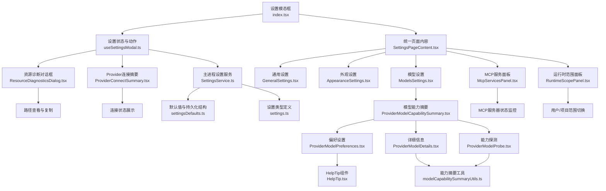
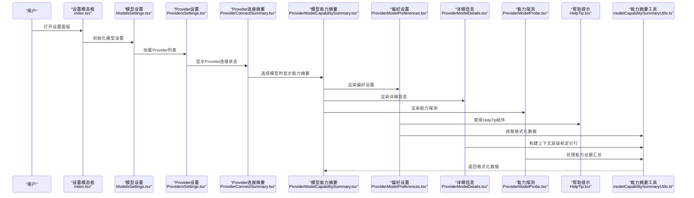
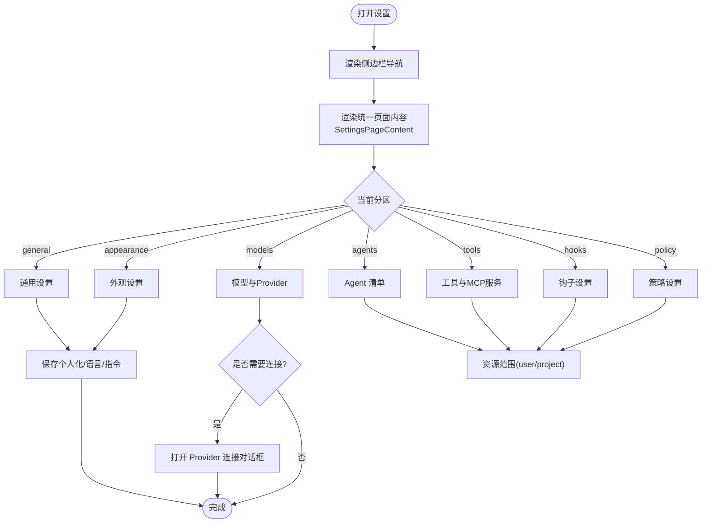
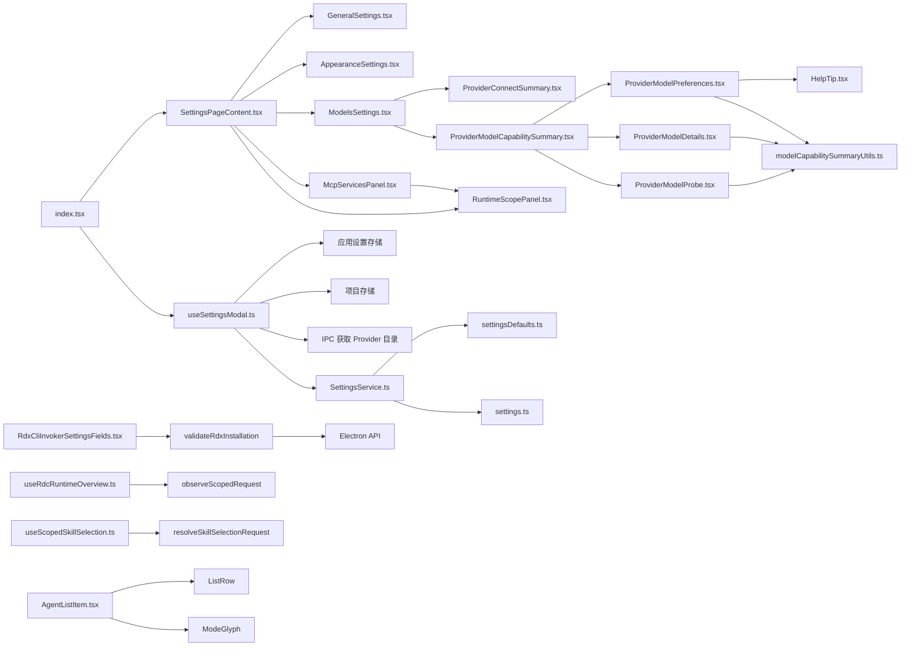

# 设置面板

<cite>
**本文引用的文件**
- [src/renderer/features/settings/SettingsModal/index.tsx](file://src/renderer/features/settings/SettingsModal/index.tsx)
- [src/renderer/features/settings/SettingsModal/SettingsPageContent.tsx](file://src/renderer/features/settings/SettingsModal/SettingsPageContent.tsx)
- [src/renderer/features/settings/SettingsModal/useRdcRuntimeOverview.ts](file://src/renderer/features/settings/SettingsModal/useRdcRuntimeOverview.ts)
- [src/renderer/features/settings/SettingsModal/scopedSkillSelection.ts](file://src/renderer/features/settings/SettingsModal/scopedSkillSelection.ts)
- [src/renderer/features/settings/SettingsModal/useScopedSkillSelection.ts](file://src/renderer/features/settings/SettingsModal/useScopedSkillSelection.ts)
- [src/renderer/features/settings/SettingsModal/sections/AgentListItem.tsx](file://src/renderer/features/settings/SettingsModal/sections/AgentListItem.tsx)
- [src/renderer/features/settings/SettingsModal/SettingsCenterNav.tsx](file://src/renderer/features/settings/SettingsModal/SettingsCenterNav.tsx)
- [src/renderer/features/settings/SettingsModal/sections/RuntimeScopePanel.tsx](file://src/renderer/features/settings/SettingsModal/sections/RuntimeScopePanel.tsx)
- [src/renderer/features/settings/SettingsModal/sections/ResourceDiagnosticsDialog.tsx](file://src/renderer/features/settings/SettingsModal/sections/ResourceDiagnosticsDialog.tsx)
- [src/renderer/features/settings/SettingsModal/sections/ModelsSettings.tsx](file://src/renderer/features/settings/SettingsModal/sections/ModelsSettings.tsx)
- [src/renderer/features/settings/SettingsModal/sections/ProvidersSettings.tsx](file://src/renderer/features/settings/SettingsModal/sections/ProvidersSettings.tsx)
- [src/renderer/features/settings/SettingsModal/sections/McpServicesPanel.tsx](file://src/renderer/features/settings/SettingsModal/sections/McpServicesPanel.tsx)
- [src/renderer/features/settings/SettingsModal/sections/ProviderConnectSummary.tsx](file://src/renderer/features/settings/SettingsModal/sections/ProviderConnectSummary.tsx)
- [src/renderer/features/settings/SettingsModal/sections/RdxCliInvokerSettingsFields.tsx](file://src/renderer/features/settings/SettingsModal/sections/RdxCliInvokerSettingsFields.tsx)
- [src/renderer/features/settings/SettingsModal/sections/ToolsSettings.tsx](file://src/renderer/features/settings/SettingsModal/sections/ToolsSettings.tsx)
- [src/renderer/features/settings/SettingsModal/sections/ProviderModelCapabilitySummary.tsx](file://src/renderer/features/settings/SettingsModal/sections/ProviderModelCapabilitySummary.tsx)
- [src/renderer/features/settings/SettingsModal/sections/ProviderModelPreferences.tsx](file://src/renderer/features/settings/SettingsModal/sections/ProviderModelPreferences.tsx)
- [src/renderer/features/settings/SettingsModal/sections/ProviderModelDetails.tsx](file://src/renderer/features/settings/SettingsModal/sections/ProviderModelDetails.tsx)
- [src/renderer/features/settings/SettingsModal/sections/ProviderModelProbe.tsx](file://src/renderer/features/settings/SettingsModal/sections/ProviderModelProbe.tsx)
- [src/renderer/features/settings/SettingsModal/modelCapabilitySummaryUtils.ts](file://src/renderer/features/settings/SettingsModal/modelCapabilitySummaryUtils.ts)
- [src/renderer/ui/HelpTip.tsx](file://src/renderer/ui/HelpTip.tsx)
- [src/main/settings/agentManifestParse.ts](file://src/main/settings/agentManifestParse.ts)
- [src/main/conversation/applyDeclaredHandoff.ts](file://src/main/conversation/applyDeclaredHandoff.ts)
- [src/shared/types/agentManifest.ts](file://src/shared/types/agentManifest.ts)
- [src/renderer/platform/rdxInstallation.ts](file://src/renderer/platform/rdxInstallation.ts)
- [src/main/settings/SettingsService.ts](file://src/main/settings/SettingsService.ts)
- [src/main/settings/settingsDefaults.ts](file://src/main/settings/settingsDefaults.ts)
- [src/shared/types/settings.ts](file://src/shared/types/settings.ts)
</cite>

## 更新摘要
**变更内容**
- ProviderModelCapabilitySummary组件重构为三个独立组件（ProviderModelPreferences、ProviderModelDetails、ProviderModelProbe），提升了代码可维护性和功能模块化
- 新增HelpTip可访问性组件系统，提供统一的帮助提示功能和更好的用户体验
- 增强了模型配置功能，支持更精细的偏好设置、详细信息展示和能力探测
- 改进了响应式设计和用户体验，优化了移动端和桌面端的显示效果
- 更新了模型能力摘要工具函数，提供更准确的模型功能展示和验证状态

## 目录
1. [简介](#简介)
2. [项目结构](#项目结构)
3. [核心组件](#核心组件)
4. [架构总览](#架构总览)
5. [详细组件分析](#详细组件分析)
6. [依赖关系分析](#依赖关系分析)
7. [性能考量](#性能考量)
8. [故障排除指南](#故障排除指南)
9. [结论](#结论)
10. [附录](#附录)

## 简介
本文件面向 RDC-Agent 的设置面板，系统性说明设置模态框的整体架构、各设置分类（Agent 配置、Provider 连接、工具设置、外观定制等）的职责与交互，并详细描述每个设置项的作用、配置选项与验证规则。同时覆盖设置持久化机制、配置迁移、用户偏好管理、导入导出、批量配置与环境变量支持，并提供常见配置场景示例与故障排除建议。

**更新** 本次更新重点重构了模型能力摘要组件，将其拆分为三个独立的子组件，新增了HelpTip可访问性组件系统，显著提升了设置面板的模型配置功能和用户体验。

## 项目结构
设置面板由渲染层（React 模态与分节组件）与主进程（设置服务、默认值、类型定义）共同构成：
- 渲染层入口与导航：设置模态框容器负责组织侧边栏导航与各设置分节，并通过 SettingsPageContent 统一管理页面内容。
- 状态与动作：统一通过自定义 Hook 聚合设置状态、Provider 连接草稿、自动保存、搜索索引等逻辑。
- 主进程设置服务：负责读取/写入持久化配置、清理敏感信息、合并默认值、执行迁移与权限控制。
- 类型与默认值：集中定义设置数据结构、主题、布局、工具、Agent 运行时等默认值与校验约束。

**图示来源**
- [src/renderer/features/settings/SettingsModal/index.tsx:24-185](file://src/renderer/features/settings/SettingsModal/index.tsx#L24-L185)
- [src/renderer/features/settings/SettingsModal/SettingsPageContent.tsx:32-174](file://src/renderer/features/settings/SettingsModal/SettingsPageContent.tsx#L32-L174)
- [src/renderer/features/settings/SettingsModal/sections/ProviderModelCapabilitySummary.tsx:30-141](file://src/renderer/features/settings/SettingsModal/sections/ProviderModelCapabilitySummary.tsx#L30-L141)
- [src/renderer/features/settings/SettingsModal/sections/ProviderModelPreferences.tsx:12-61](file://src/renderer/features/settings/SettingsModal/sections/ProviderModelPreferences.tsx#L12-L61)
- [src/renderer/features/settings/SettingsModal/sections/ProviderModelDetails.tsx:5-44](file://src/renderer/features/settings/SettingsModal/sections/ProviderModelDetails.tsx#L5-L44)
- [src/renderer/features/settings/SettingsModal/sections/ProviderModelProbe.tsx:11-39](file://src/renderer/features/settings/SettingsModal/sections/ProviderModelProbe.tsx#L11-L39)
- [src/renderer/ui/HelpTip.tsx:6-26](file://src/renderer/ui/HelpTip.tsx#L6-L26)

**章节来源**
- [src/renderer/features/settings/SettingsModal/index.tsx:24-185](file://src/renderer/features/settings/SettingsModal/index.tsx#L24-L185)
- [src/renderer/features/settings/SettingsModal/SettingsPageContent.tsx:32-174](file://src/renderer/features/settings/SettingsModal/SettingsPageContent.tsx#L32-L174)
- [src/main/settings/SettingsService.ts:103-139](file://src/main/settings/SettingsService.ts#L103-L139)
- [src/main/settings/settingsDefaults.ts:180-192](file://src/main/settings/settingsDefaults.ts#L180-L192)
- [src/shared/types/settings.ts:9-14](file://src/shared/types/settings.ts#L9-L14)

## 核心组件
- 设置模态框容器：提供侧边栏导航、标题栏、关闭按钮与内容区；通过 SettingsPageContent 统一管理各设置分区。
- 统一页面内容组件：集中处理所有设置分区的渲染逻辑，包括 general、appearance、models、agents、tools、hooks、policy 等。
- MCP 服务面板：提供 MCP 服务器的状态监控、信任管理和配置编辑功能。
- Provider 连接摘要：提供统一的连接状态展示和协议信息摘要。
- 运行时范围面板：增强的资源管理界面，支持更多资源类型和高级操作。
- 资源诊断对话框：独立的工作区概览视图，展示当前环境与资源路径。
- **重构** 模型能力摘要组件：已拆分为三个独立组件，分别处理偏好设置、详细信息和能力探测功能。
- **新增** HelpTip可访问性组件：提供统一的帮助提示功能，支持键盘导航和屏幕阅读器。

**更新** 将原有的单一 ProviderModelCapabilitySummary 组件重构为三个专门的子组件，每个组件专注于特定的功能领域，提高了代码的可维护性和复用性。

**章节来源**
- [src/renderer/features/settings/SettingsModal/index.tsx:24-185](file://src/renderer/features/settings/SettingsModal/index.tsx#L24-L185)
- [src/renderer/features/settings/SettingsModal/SettingsPageContent.tsx:32-174](file://src/renderer/features/settings/SettingsModal/SettingsPageContent.tsx#L32-L174)
- [src/renderer/features/settings/SettingsModal/sections/ProviderModelCapabilitySummary.tsx:30-141](file://src/renderer/features/settings/SettingsModal/sections/ProviderModelCapabilitySummary.tsx#L30-L141)
- [src/renderer/features/settings/SettingsModal/sections/ProviderModelPreferences.tsx:12-61](file://src/renderer/features/settings/SettingsModal/sections/ProviderModelPreferences.tsx#L12-L61)
- [src/renderer/features/settings/SettingsModal/sections/ProviderModelDetails.tsx:5-44](file://src/renderer/features/settings/SettingsModal/sections/ProviderModelDetails.tsx#L5-L44)
- [src/renderer/features/settings/SettingsModal/sections/ProviderModelProbe.tsx:11-39](file://src/renderer/features/settings/SettingsModal/sections/ProviderModelProbe.tsx#L11-L39)
- [src/renderer/ui/HelpTip.tsx:6-26](file://src/renderer/ui/HelpTip.tsx#L6-L26)

## 架构总览
设置面板遵循"渲染层只展示可保存/可诊断数据，主进程负责解析敏感信息与运行时能力"的边界原则。Provider Catalog 作为独立契约，不混入 settings:get 的派生 UI 状态。

**更新** 新的架构引入了模块化的模型能力摘要系统，通过三个专门化的子组件提供更精确的模型功能展示、配置和管理。

**图示来源**
- [src/renderer/features/settings/SettingsModal/index.tsx:24-185](file://src/renderer/features/settings/SettingsModal/index.tsx#L24-L185)
- [src/renderer/features/settings/SettingsModal/sections/ModelsSettings.tsx:20-27](file://src/renderer/features/settings/SettingsModal/sections/ModelsSettings.tsx#L20-L27)
- [src/renderer/features/settings/SettingsModal/sections/ProvidersSettings.tsx:24-140](file://src/renderer/features/settings/SettingsModal/sections/ProvidersSettings.tsx#L24-L140)
- [src/renderer/features/settings/SettingsModal/sections/ProviderModelCapabilitySummary.tsx:30-141](file://src/renderer/features/settings/SettingsModal/sections/ProviderModelCapabilitySummary.tsx#L30-L141)
- [src/renderer/features/settings/SettingsModal/sections/ProviderModelPreferences.tsx:12-61](file://src/renderer/features/settings/SettingsModal/sections/ProviderModelPreferences.tsx#L12-L61)
- [src/renderer/features/settings/SettingsModal/sections/ProviderModelDetails.tsx:5-44](file://src/renderer/features/settings/SettingsModal/sections/ProviderModelDetails.tsx#L5-L44)
- [src/renderer/features/settings/SettingsModal/sections/ProviderModelProbe.tsx:11-39](file://src/renderer/features/settings/SettingsModal/sections/ProviderModelProbe.tsx#L11-L39)
- [src/renderer/ui/HelpTip.tsx:6-26](file://src/renderer/ui/HelpTip.tsx#L6-L26)

## 详细组件分析

### 设置模态框容器（index.tsx）
- 职责：组织导航与内容区，通过 SettingsPageContent 统一管理各设置分区；在需要时弹出 Provider 连接对话框。
- 关键交互：
  - 侧边栏导航：通过 sections 数组驱动，包含 general/appearance/models/agents/skills/tools/hooks/policy。
  - Provider 连接：当 connectionDraft 存在时，渲染 ProviderConnectDialog，透传连接草稿、模型选择、测试与保存回调。
  - 运行时概览：使用 useRdcRuntimeOverview Hook 获取运行时环境信息。
  - 资源范围：通过 state 管理 user/project 范围切换。

**更新** 集成了 useRdcRuntimeOverview Hook 来获取 RDC 运行时环境信息，并通过 SettingsPageContent 统一管理页面内容。

**图示来源**
- [src/renderer/features/settings/SettingsModal/index.tsx:24-185](file://src/renderer/features/settings/SettingsModal/index.tsx#L24-L185)
- [src/renderer/features/settings/SettingsModal/SettingsPageContent.tsx:32-174](file://src/renderer/features/settings/SettingsModal/SettingsPageContent.tsx#L32-L174)

**章节来源**
- [src/renderer/features/settings/SettingsModal/index.tsx:24-185](file://src/renderer/features/settings/SettingsModal/index.tsx#L24-L185)

### 统一页面内容组件（SettingsPageContent.tsx）
- 职责：集中管理所有设置分区的渲染逻辑，根据 activeSection 动态渲染对应组件。
- 功能特性：
  - 分区路由：根据 activeSection 渲染对应的设置组件。
  - 状态传递：向各分区组件传递必要的状态和回调函数。
  - 运行时集成：集成运行时概览数据和范围切换功能。
  - 资源管理：支持资源的创建、编辑、删除等操作。

**更新** 集成了 useRdcRuntimeOverview 提供的运行时概览数据，为各个设置分区提供统一的运行时环境信息。

**章节来源**
- [src/renderer/features/settings/SettingsModal/SettingsPageContent.tsx:32-174](file://src/renderer/features/settings/SettingsModal/SettingsPageContent.tsx#L32-L174)

### 模型设置组件（ModelsSettings.tsx）
- 职责：提供模型和 Provider 的统一设置界面，继承自 ProvidersSettings。
- 功能特性：
  - 简单的包装组件：为 ModelsSettings 提供统一的样式和数据传递。
  - 搜索功能：支持按 Provider ID、标签和模型 ID 进行搜索。
  - 分组显示：将已配置的 Provider 和目录中的 Provider 分别显示。
  - 即将推出的 Provider：支持显示即将推出的 Provider 类别。

**章节来源**
- [src/renderer/features/settings/SettingsModal/sections/ModelsSettings.tsx:20-27](file://src/renderer/features/settings/SettingsModal/sections/ModelsSettings.tsx#L20-L27)

### Provider 设置组件（ProvidersSettings.tsx）
- 职责：提供 Provider 列表的搜索、过滤和分组显示功能。
- 功能特性：
  - 搜索过滤：支持按 Provider ID、标签和模型进行全文搜索。
  - 分组显示：将已配置的 OAuth 账户、目录 Provider 和即将推出的 Provider 分别显示。
  - 空状态处理：当没有可见的 Provider 时显示空状态提示。
  - 响应式布局：使用网格布局适应不同屏幕尺寸。

**章节来源**
- [src/renderer/features/settings/SettingsModal/sections/ProvidersSettings.tsx:24-140](file://src/renderer/features/settings/SettingsModal/sections/ProvidersSettings.tsx#L24-L140)

### 模型能力摘要组件（ProviderModelCapabilitySummary.tsx）
- 职责：作为父组件协调三个子组件，管理整体状态和生命周期。
- 功能特性：
  - 状态管理：管理探针模式、探针结果和加载状态。
  - 能力芯片：调用 buildCapabilityChips 生成模型能力的可视化展示。
  - 子组件协调：协调 ProviderModelPreferences、ProviderModelDetails 和 ProviderModelProbe 的渲染。
  - 错误处理：处理加载失败、配额限制和不可用原因等状态。

**重构** 该组件现在主要负责状态管理和子组件协调，具体的功能逻辑已移至专门的子组件中。

**章节来源**
- [src/renderer/features/settings/SettingsModal/sections/ProviderModelCapabilitySummary.tsx:30-141](file://src/renderer/features/settings/SettingsModal/sections/ProviderModelCapabilitySummary.tsx#L30-L141)

### 模型偏好设置组件（ProviderModelPreferences.tsx）
- 职责：提供模型的偏好设置界面，包括路由选择、推理模式和客户端预算配置。
- 功能特性：
  - 路由选择：支持多路由选项的选择和显示。
  - 推理模式：提供推理级别的配置选项。
  - 客户端预算：允许用户设置令牌预算限制。
  - 帮助提示：使用 HelpTip 组件提供上下文相关的帮助信息。

**新增** 这是新引入的专用组件，专注于模型偏好设置的配置功能。

**章节来源**
- [src/renderer/features/settings/SettingsModal/sections/ProviderModelPreferences.tsx:12-61](file://src/renderer/features/settings/SettingsModal/sections/ProviderModelPreferences.tsx#L12-L61)

### 模型详细信息组件（ProviderModelDetails.tsx）
- 职责：展示模型的详细信息，包括上下文层级、定价信息和能力证据。
- 功能特性：
  - 上下文层级：显示不同上下文层级的限制、授权状态和成本信息。
  - 定价详情：展示输入、输出、缓存读取和写入的定价信息。
  - 能力证据：生成能力数据来源的摘要信息。
  - 路由选项：显示可用的路由选项及其元数据。

**新增** 这是新引入的详细信息展示组件，提供了全面的模型信息视图。

**章节来源**
- [src/renderer/features/settings/SettingsModal/sections/ProviderModelDetails.tsx:5-44](file://src/renderer/features/settings/SettingsModal/sections/ProviderModelDetails.tsx#L5-L44)

### 模型能力探测组件（ProviderModelProbe.tsx）
- 职责：提供模型能力探测功能的用户界面。
- 功能特性：
  - 探测模式：支持多种探测模式的按钮界面。
  - 状态指示：显示探测进行中、成功或失败的状态。
  - 连接检查：确保 Provider 已正确配置后才启用探测功能。
  - 用户反馈：提供清晰的探测结果反馈。

**新增** 这是新引入的能力探测组件，为用户提供了验证模型实际功能的能力。

**章节来源**
- [src/renderer/features/settings/SettingsModal/sections/ProviderModelProbe.tsx:11-39](file://src/renderer/features/settings/SettingsModal/sections/ProviderModelProbe.tsx#L11-L39)

### 帮助提示组件（HelpTip.tsx）
- 职责：提供可访问的帮助提示功能，支持键盘导航和屏幕阅读器。
- 功能特性：
  - 可访问性：支持 aria-label、aria-describedby 等无障碍属性。
  - 交互方式：支持鼠标悬停、焦点管理和点击触发。
  - 延迟关闭：使用定时器实现平滑的关闭动画。
  - 响应式设计：自适应不同屏幕尺寸的显示需求。

**新增** 这是新引入的可访问性组件，为设置面板提供了统一的帮助提示功能。

**章节来源**
- [src/renderer/ui/HelpTip.tsx:6-26](file://src/renderer/ui/HelpTip.tsx#L6-L26)

### 模型能力摘要工具（modelCapabilitySummaryUtils.ts）
- 职责：提供模型能力数据的格式化和展示工具函数。
- 功能特性：
  - 能力芯片构建：生成模型能力的可视化芯片，包含标签、值和颜色状态。
  - 上下文层级处理：格式化上下文层级的限制、授权和激活信息。
  - 定价行构建：生成模型定价信息的结构化数据。
  - 推理控制格式化：处理推理模式的显示和用户默认值。
  - 能力证据汇总：生成能力数据来源的摘要信息。
  - 状态转换：将内部状态转换为友好的用户界面文本。

**更新** 工具函数经过优化，更好地支持新的模块化组件架构。

**章节来源**
- [src/renderer/features/settings/SettingsModal/modelCapabilitySummaryUtils.ts:238-286](file://src/renderer/features/settings/SettingsModal/modelCapabilitySummaryUtils.ts#L238-L286)

### RDC 运行时概览 Hook（useRdcRuntimeOverview.ts）
- 职责：提供 RDC 运行时环境的概览信息，包括项目根路径、技能选择等运行时数据。
- 功能特性：
  - 项目根路径检测：自动检测当前项目的根路径。
  - 异步数据获取：通过 observeScopedRequest 安全地获取运行时数据。
  - 生命周期管理：正确处理组件挂载和卸载时的请求清理。
  - 错误处理：捕获并显示运行时错误信息。

**新增** 这是新引入的 RDC 运行时概览 Hook，为设置面板提供准确的运行时环境信息。

**章节来源**
- [src/renderer/features/settings/SettingsModal/useRdcRuntimeOverview.ts:7-33](file://src/renderer/features/settings/SettingsModal/useRdcRuntimeOverview.ts#L7-L33)

### 作用域技能选择（scopedSkillSelection.ts）
- 职责：提供作用域化的技能选择功能，支持用户和项目两种范围。
- 功能特性：
  - 作用域管理：区分 user 和 project 两种技能选择范围。
  - 请求观察：通过 observeScopedRequest 安全地管理异步请求的生命周期。
  - 技能过滤：根据目标 Agent 过滤可用的技能选项。
  - 错误处理：处理技能目录加载错误和不可用技能的处理。

**新增** 这是新引入的作用域技能选择功能，为设置面板提供了更精确的技能管理能力。

**章节来源**
- [src/renderer/features/settings/SettingsModal/scopedSkillSelection.ts:5-39](file://src/renderer/features/settings/SettingsModal/scopedSkillSelection.ts#L5-L39)

### 作用域技能选择 Hook（useScopedSkillSelection.ts）
- 职责：封装作用域技能选择的 React Hook，提供简化的 API 供组件使用。
- 功能特性：
  - 状态管理：管理技能目录的加载状态、错误信息和数据缓存。
  - 自动刷新：支持手动刷新技能目录数据。
  - 项目感知：自动感知当前项目变化并重新加载技能目录。
  - 条件启用：根据作用域和项目状态决定是否启用技能选择功能。

**新增** 这是新引入的作用域技能选择 Hook，为组件提供了简洁的技能选择接口。

**章节来源**
- [src/renderer/features/settings/SettingsModal/useScopedSkillSelection.ts:15-45](file://src/renderer/features/settings/SettingsModal/useScopedSkillSelection.ts#L15-L45)

### Agent 列表项组件（AgentListItem.tsx）
- 职责：提供 Agent 列表项的统一展示组件，支持选中状态和禁用状态。
- 功能特性：
  - 图标显示：根据 Agent 模式显示相应的图标。
  - 文本溢出处理：使用 OverflowFade 组件处理长文本的显示。
  - 交互状态：支持选中和禁用状态的视觉反馈。
  - 可访问性：提供适当的 aria 属性和键盘导航支持。

**新增** 这是新引入的 Agent 列表项组件，为设置面板中的 Agent 列表提供了统一的展示样式。

**章节来源**
- [src/renderer/features/settings/SettingsModal/sections/AgentListItem.tsx:18-38](file://src/renderer/features/settings/SettingsModal/sections/AgentListItem.tsx#L18-L38)

### MCP 服务面板（McpServicesPanel.tsx）
- 职责：提供 MCP 服务器的状态监控、信任管理和配置编辑功能。
- 功能特性：
  - 状态监控：实时显示 MCP 服务器的连接状态和工具数量。
  - 信任管理：支持 MCP 服务器的信任授予和撤销。
  - 配置编辑：提供 MCP 服务器的配置编辑界面。
  - 错误处理：显示连接错误和诊断信息。

**章节来源**
- [src/renderer/features/settings/SettingsModal/sections/McpServicesPanel.tsx:53-146](file://src/renderer/features/settings/SettingsModal/sections/McpServicesPanel.tsx#L53-L146)

### Provider 连接摘要（ProviderConnectSummary.tsx）
- 职责：提供统一的 Provider 连接状态展示和协议信息摘要。
- 功能特性：
  - 协议摘要：显示 Provider 的协议、端点类、运营商和目录所有权信息。
  - 连接状态：提供统一的连接状态指示器（未测试、测试中、已连接、失败）。
  - 发现提示：在未成功测试前显示空发现面板。

**章节来源**
- [src/renderer/features/settings/SettingsModal/sections/ProviderConnectSummary.tsx:11-60](file://src/renderer/features/settings/SettingsModal/sections/ProviderConnectSummary.tsx#L11-L60)

### 运行时范围面板（RuntimeScopePanel.tsx）
- 职责：提供统一的资源管理界面，支持用户/项目范围切换和资源CRUD操作。
- 功能特性：
  - 范围切换：支持user/project两种资源范围的切换。
  - 资源列表：显示当前范围内的资源列表，支持选择、编辑、删除。
  - 编辑器集成：支持内联编辑或对话框编辑模式。
  - 导入导出：支持资源的导入和位置揭示功能。
  - 状态管理：处理保存状态、删除确认、未保存更改提示。

**更新** 集成了 useRdcRuntimeOverview 提供的运行时概览数据，为资源管理提供更准确的上下文信息。

**章节来源**
- [src/renderer/features/settings/SettingsModal/sections/RuntimeScopePanel.tsx:19-200](file://src/renderer/features/settings/SettingsModal/sections/RuntimeScopePanel.tsx#L19-L200)

### 资源诊断对话框（ResourceDiagnosticsDialog.tsx）
- 职责：提供工作区概览视图，展示当前环境和资源路径信息。
- 功能特性：
  - 根路径显示：展示用户根路径和项目根路径。
  - 路径组显示：按范围显示各类资源的实际路径。
  - 路径操作：支持路径复制和文件管理器中显示。
  - 只读视图：不提供修改功能，仅用于诊断和调试。

**章节来源**
- [src/renderer/features/settings/SettingsModal/sections/ResourceDiagnosticsDialog.tsx:30-116](file://src/renderer/features/settings/SettingsModal/sections/ResourceDiagnosticsDialog.tsx#L30-L116)

### 设置中心导航（SettingsCenterNav.tsx）
- 职责：提供设置面板的侧边栏导航，支持搜索和键盘导航。
- 功能特性：
  - 搜索功能：支持设置项的快速搜索和定位。
  - 键盘导航：支持箭头键和Home/End键的键盘操作。
  - 焦点管理：自动管理导航项的tabIndex和焦点状态。
  - 结果高亮：搜索结果会高亮显示并自动滚动到目标位置。

**章节来源**
- [src/renderer/features/settings/SettingsModal/SettingsCenterNav.tsx:20-125](file://src/renderer/features/settings/SettingsModal/SettingsCenterNav.tsx#L20-L125)

### 主进程设置服务（SettingsService.ts）
- 职责：初始化路径与执行环境、读取/写入持久化设置、合并默认值、清理敏感字段、Provider 凭据管理与 Agent 清单操作。
- 关键点：
  - initialize/getAll：确保初始化，读取 JSON 设置文件，断言 schemaVersion，转换为运行时设置。
  - setAll：合并 appearance/layout/profile/tooling/agentRuntime/llm.providers，清理 apiKey 输出，删除废弃 secret 引用。
  - 窗口布局快速持久化：persistWindowLayout/persistWindowLayoutAsync 仅写 window 布局，跳过 provider 归一化。
  - Provider 连接：saveProviderConnection/saveProviderAccountConnection/rotateProviderAccountCredential/disconnectProvider。
  - LLM 配置：getLlmConfig 仅返回启用且已验证的 Provider，并按 authMode 注入运行时凭据。
  - 目录服务：getProviderCatalog 委托 ProviderCatalogService。

**章节来源**
- [src/main/settings/SettingsService.ts:103-139](file://src/main/settings/SettingsService.ts#L103-L139)
- [src/main/settings/SettingsService.ts:249-383](file://src/main/settings/SettingsService.ts#L249-L383)
- [src/main/settings/SettingsService.ts:411-456](file://src/main/settings/SettingsService.ts#L411-L456)
- [src/main/settings/SettingsService.ts:458-491](file://src/main/settings/SettingsService.ts#L458-L491)

### Agent 清单解析器（agentManifestParse.ts）
- 职责：解析 Agent 清单 YAML 文件，验证 handoff 配置的完整性和有效性。
- 功能特性：
  - 严格验证：对 handoffs 数组中的每个条目进行严格类型检查。
  - 字段验证：验证 send、showContinueOn 的布尔类型，model 的非空字符串要求。
  - 技能ID处理：支持字符串数组或逗号分隔字符串的 requiredSkillIds 格式。
  - 错误报告：提供详细的验证错误信息，便于用户修复配置问题。

**章节来源**
- [src/main/settings/agentManifestParse.ts:35-71](file://src/main/settings/agentManifestParse.ts#L35-L71)

### 应用声明式续传（applyDeclaredHandoff.ts）
- 职责：处理会话中的 Agent 间任务转移，支持新的简化声明式续传模型。
- 功能特性：
  - 声明查找：在当前或提供者的 Agent 清单中查找匹配的 handoff 声明。
  - 技能预载：根据 declared.requiredSkillIds 预载所需的技能。
  - 执行offer：写入包含 requiredSkillIds 的执行offer，确保正确的技能绑定。
  - 自动发送：支持 send:true 时的自动发送行为。

**章节来源**
- [src/main/conversation/applyDeclaredHandoff.ts:38-94](file://src/main/conversation/applyDeclaredHandoff.ts#L38-L94)

### 默认值与持久化结构（settingsDefaults.ts）
- 职责：定义 schemaVersion、默认外观/布局/个人资料/工具/Agent 运行时等默认值，以及持久化负载结构。
- 关键点：
  - SETTINGS_SCHEMA_VERSION：用于迁移与兼容性检查。
  - createDefaultPersistedSettings：生成初始持久化对象，包含 appearance/layout/profile/tooling/agentRuntime/llm.providers。
  - 布局默认值：左右侧栏、终端高度、窗口尺寸与最大化状态。
  - 工具默认值：RDX CLI、代码解释器、Shell 工具默认启用状态与超时等。

**章节来源**
- [src/main/settings/settingsDefaults.ts:33-192](file://src/main/settings/settingsDefaults.ts#L33-L192)

### 类型定义（settings.ts）
- 职责：集中定义主题、语言、字体缩放、减少动画、Provider ID/协议/认证模式/类别/连接字段等类型。
- 关键点：
  - 主题与语言：AppTheme、AppLanguage、FontScale、ReduceMotionPreference。
  - Provider 体系：LlmProviderId、LlmProviderProtocol、LlmProviderAuthMode、LlmProviderCategory、连接字段种类与 Schema。
  - 连接字段：secret/text/url/region/path，支持环境变量映射与主密钥字段标识。

**章节来源**
- [src/shared/types/settings.ts:9-14](file://src/shared/types/settings.ts#L9-L14)
- [src/shared/types/settings.ts:46-109](file://src/shared/types/settings.ts#L46-L109)
- [src/shared/types/settings.ts:116-132](file://src/shared/types/settings.ts#L116-L132)
- [src/shared/types/settings.ts:134-144](file://src/shared/types/settings.ts#L134-L144)
- [src/shared/types/settings.ts:157-177](file://src/shared/types/settings.ts#L157-L177)
- [src/shared/types/settings.ts:179-200](file://src/shared/types/settings.ts#L179-L200)

### Agent 清单类型定义（agentManifest.ts）
- 职责：定义 Agent 清单相关的数据结构和类型。
- 关键点：
  - AgentHandoffDefinition：定义了完整的 handoff 配置结构，包括 label、agent、prompt、send、showContinueOn、model、requiredSkillIds。
  - AgentManifestDefinition：定义了 Agent 清单的完整结构。
  - 模型选项：AgentModelOption 支持模型的状态和成本信息。

**章节来源**
- [src/shared/types/agentManifest.ts:5-13](file://src/shared/types/agentManifest.ts#L5-L13)
- [src/shared/types/agentManifest.ts:15-47](file://src/shared/types/agentManifest.ts#L15-L47)

## 依赖关系分析
- 渲染层依赖：
  - index.tsx 依赖 useSettingsModal.ts 提供的状态与动作，以及 SettingsPageContent 统一管理页面内容。
  - SettingsPageContent 依赖各设置分区组件和运行时概览数据。
  - McpServicesPanel 依赖 RuntimeScopePanel 和各种 MCP 相关组件。
  - ProviderConnectSummary 依赖 Provider 类型定义和工具函数。
  - RdxCliInvokerSettingsFields 依赖 validateRdxInstallation 进行安装验证。
  - **重构** ProviderModelCapabilitySummary 现在依赖三个专门的子组件：ProviderModelPreferences、ProviderModelDetails、ProviderModelProbe。
  - **新增** HelpTip 组件被多个设置组件使用，提供统一的帮助提示功能。
- 主进程依赖：
  - SettingsService.ts 依赖路径服务、执行环境、默认值、类型定义、Provider 目录服务、秘密存储服务。
  - agentManifestParse.ts 依赖 YAML 解析器和类型定义。
  - applyDeclaredHandoff.ts 依赖存储适配器和计划审查状态存储。
- 类型与默认值：
  - settings.ts 为全仓共享类型；settingsDefaults.ts 提供默认结构与常量。
  - agentManifest.ts 提供 Agent 清单相关的类型定义。

**更新** 重构了模型能力摘要组件的依赖关系，将单一组件拆分为三个专门化的子组件，并新增了 HelpTip 组件的依赖关系。

**图示来源**
- [src/renderer/features/settings/SettingsModal/index.tsx:24-185](file://src/renderer/features/settings/SettingsModal/index.tsx#L24-L185)
- [src/renderer/features/settings/SettingsModal/SettingsPageContent.tsx:32-174](file://src/renderer/features/settings/SettingsModal/SettingsPageContent.tsx#L32-L174)
- [src/renderer/features/settings/SettingsModal/sections/ProviderModelCapabilitySummary.tsx:30-141](file://src/renderer/features/settings/SettingsModal/sections/ProviderModelCapabilitySummary.tsx#L30-L141)
- [src/renderer/features/settings/SettingsModal/sections/ProviderModelPreferences.tsx:12-61](file://src/renderer/features/settings/SettingsModal/sections/ProviderModelPreferences.tsx#L12-L61)
- [src/renderer/features/settings/SettingsModal/sections/ProviderModelDetails.tsx:5-44](file://src/renderer/features/settings/SettingsModal/sections/ProviderModelDetails.tsx#L5-L44)
- [src/renderer/features/settings/SettingsModal/sections/ProviderModelProbe.tsx:11-39](file://src/renderer/features/settings/SettingsModal/sections/ProviderModelProbe.tsx#L11-L39)
- [src/renderer/ui/HelpTip.tsx:6-26](file://src/renderer/ui/HelpTip.tsx#L6-L26)
- [src/renderer/features/settings/SettingsModal/modelCapabilitySummaryUtils.ts:238-286](file://src/renderer/features/settings/SettingsModal/modelCapabilitySummaryUtils.ts#L238-L286)

**章节来源**
- [src/renderer/features/settings/SettingsModal/index.tsx:24-185](file://src/renderer/features/settings/SettingsModal/index.tsx#L24-L185)
- [src/renderer/features/settings/SettingsModal/SettingsPageContent.tsx:32-174](file://src/renderer/features/settings/SettingsModal/SettingsPageContent.tsx#L32-L174)
- [src/main/settings/SettingsService.ts:94-518](file://src/main/settings/SettingsService.ts#L94-L518)
- [src/main/settings/settingsDefaults.ts:180-192](file://src/main/settings/settingsDefaults.ts#L180-L192)
- [src/shared/types/settings.ts:9-14](file://src/shared/types/settings.ts#L9-L14)

## 性能考量
- Provider 目录按需加载：仅在模态框打开时请求目录快照，避免每次渲染都拉取。
- 窗口布局快速持久化：移动/调整大小时使用异步写入，跳过昂贵的 provider 归一化。
- 最小化敏感数据输出：settings:get 与 Provider Catalog 均不包含密钥或敏感字段，降低序列化与传输开销。
- 默认值合并与清理：写入时合并默认值并清理废弃 secret 引用，避免脏数据累积。
- **新增** RDC 运行时概览的缓存机制：避免重复获取相同的运行时信息。
- **新增** 作用域技能选择的请求优化：通过 observeScopedRequest 避免竞态条件和内存泄漏。
- **新增** Agent 列表项的虚拟化：对于大量 Agent 列表，考虑使用虚拟化技术提升性能。
- **新增** 运行时数据的惰性加载：只在需要时获取运行时概览信息。
- **重构** 模型能力摘要的计算优化：通过模块化组件避免重复计算能力芯片和行数据。
- **重构** 能力探测的防抖处理：避免频繁触发能力探测请求。
- **新增** HelpTip 组件的性能优化：使用定时器实现平滑的关闭动画，避免不必要的重渲染。

**更新** 增加了针对模块化组件架构、HelpTip 组件和模型能力摘要的性能优化考虑。

## 故障排除指南
- 无法加载 Provider 目录：
  - 现象：模态框打开后 Provider 列表为空。
  - 排查：确认 IPC 调用 getProviderCatalog 是否成功；查看 useSettingsModal 中的异常分支是否回退到空快照。
  - 参考：[src/renderer/features/settings/SettingsModal/useSettingsModal.ts:52-69](file://src/renderer/features/settings/SettingsModal/useSettingsModal.ts#L52-L69)
- 保存设置无效：
  - 现象：修改外观/工具/Agent 后未生效。
  - 排查：确认 setAll 是否被调用；检查 schemaVersion 是否匹配；查看 writeSettings 是否成功。
  - 参考：[src/main/settings/SettingsService.ts:249-383](file://src/main/settings/SettingsService.ts#L249-L383)
- Provider 连接失败：
  - 现象：测试连接报错或 401。
  - 排查：确认凭据是否正确；检查是否有有效的 lease；确认 adapter 未回读 Settings。
  - 参考：[src/main/settings/README.md:42-50](file://src/main/settings/README.md#L42-L50)
- 密钥泄露风险：
  - 现象：UI 或日志中出现明文密钥。
  - 排查：确认 settings:get 与 Provider Catalog 是否清除了 apiKey；确认 SecretStorageService 正确掩码。
  - 参考：[src/main/settings/README.md:42-50](file://src/main/settings/README.md#L42-L50)
- **新增** RDC 运行时概览加载失败：
  - 现象：设置面板中运行时信息显示为空或错误。
  - 排查：检查 useRdcRuntimeOverview Hook 的错误处理；确认 Electron API 调用是否成功。
  - 参考：[src/renderer/features/settings/SettingsModal/useRdcRuntimeOverview.ts:22-30](file://src/renderer/features/settings/SettingsModal/useRdcRuntimeOverview.ts#L22-L30)
- **新增** 作用域技能选择问题：
  - 现象：技能列表为空或技能不可用。
  - 排查：检查作用域设置是否正确；确认项目根路径是否有效；查看技能目录加载状态。
  - 参考：[src/renderer/features/settings/SettingsModal/useScopedSkillSelection.ts:26-35](file://src/renderer/features/settings/SettingsModal/useScopedSkillSelection.ts#L26-L35)
- **新增** Agent 列表显示问题：
  - 现象：Agent 列表项显示不正确或缺少图标。
  - 排查：检查 AgentListItem 组件的 props 传递；确认 ModeGlyph 组件的 mode 参数是否正确。
  - 参考：[src/renderer/features/settings/SettingsModal/sections/AgentListItem.tsx:18-38](file://src/renderer/features/settings/SettingsModal/sections/AgentListItem.tsx#L18-L38)
- **重构** 模型能力摘要加载失败：
  - 现象：模型能力信息为空或显示错误。
  - 排查：检查 ProviderModelCapabilitySummary 组件的状态处理；确认三个子组件是否正确渲染；查看 modelCapabilitySummaryUtils 工具函数的返回值。
  - 参考：[src/renderer/features/settings/SettingsModal/sections/ProviderModelCapabilitySummary.tsx:83-122](file://src/renderer/features/settings/SettingsModal/sections/ProviderModelCapabilitySummary.tsx#L83-L122)
- **重构** 能力探测失败：
  - 现象：能力探测按钮点击后无响应或报错。
  - 排查：检查 ProviderModelProbe 组件的状态处理；确认 testModelCapability 函数的实现；验证 Provider 连接状态和模型可用性。
  - 参考：[src/renderer/features/settings/SettingsModal/sections/ProviderModelProbe.tsx:24-30](file://src/renderer/features/settings/SettingsModal/sections/ProviderModelProbe.tsx#L24-L30)
- **新增** HelpTip 组件问题：
  - 现象：帮助提示无法正常显示或关闭。
  - 排查：检查 HelpTip 组件的 Props 传递；确认 Popover 组件的正常工作；查看 CSS 样式是否正确加载。
  - 参考：[src/renderer/ui/HelpTip.tsx:6-26](file://src/renderer/ui/HelpTip.tsx#L6-L26)
- **新增** 模型偏好设置问题：
  - 现象：偏好设置选项无法正确显示或保存。
  - 排查：检查 ProviderModelPreferences 组件的 Props 传递；确认 onModelChange 回调的正确实现；验证路由选项和推理模式的数据格式。
  - 参考：[src/renderer/features/settings/SettingsModal/sections/ProviderModelPreferences.tsx:27-57](file://src/renderer/features/settings/SettingsModal/sections/ProviderModelPreferences.tsx#L27-L57)

**更新** 增加了模块化组件架构、HelpTip 组件和相关子组件的故障排除指南。

**章节来源**
- [src/renderer/features/settings/SettingsModal/useSettingsModal.ts:52-69](file://src/renderer/features/settings/SettingsModal/useSettingsModal.ts#L52-L69)
- [src/main/settings/SettingsService.ts:249-383](file://src/main/settings/SettingsService.ts#L249-L383)
- [src/main/settings/README.md:42-50](file://src/main/settings/README.md#L42-L50)
- [src/renderer/features/settings/SettingsModal/useRdcRuntimeOverview.ts:22-30](file://src/renderer/features/settings/SettingsModal/useRdcRuntimeOverview.ts#L22-L30)
- [src/renderer/features/settings/SettingsModal/useScopedSkillSelection.ts:26-35](file://src/renderer/features/settings/SettingsModal/useScopedSkillSelection.ts#L26-L35)
- [src/renderer/features/settings/SettingsModal/sections/AgentListItem.tsx:18-38](file://src/renderer/features/settings/SettingsModal/sections/AgentListItem.tsx#L18-L38)
- [src/renderer/features/settings/SettingsModal/sections/ProviderModelCapabilitySummary.tsx:83-122](file://src/renderer/features/settings/SettingsModal/sections/ProviderModelCapabilitySummary.tsx#L83-L122)
- [src/renderer/features/settings/SettingsModal/sections/ProviderModelProbe.tsx:24-30](file://src/renderer/features/settings/SettingsModal/sections/ProviderModelProbe.tsx#L24-L30)
- [src/renderer/ui/HelpTip.tsx:6-26](file://src/renderer/ui/HelpTip.tsx#L6-L26)
- [src/renderer/features/settings/SettingsModal/sections/ProviderModelPreferences.tsx:27-57](file://src/renderer/features/settings/SettingsModal/sections/ProviderModelPreferences.tsx#L27-L57)

## 结论
RDC-Agent 设置面板经过重大简化重构后，采用了更加精简和高效的设计。通过移除 RdxActionsFields 组件和生命周期模板配置功能，显著降低了设置界面的复杂度。本次更新进一步将 ProviderModelCapabilitySummary 组件重构为三个独立的子组件，新增了 HelpTip 可访问性组件系统，显著提升了设置面板的模型配置功能、代码可维护性和用户体验。特别是模块化的组件架构使得每个功能更加专注和易于测试，HelpTip 组件提供了统一的帮助提示体验，而三个专门的子组件分别处理偏好设置、详细信息展示和能力探测，大大提升了设置的准确性和用户体验。建议在新增设置项时遵循现有模式：使用 SettingsPageContent 进行统一渲染，定义清晰的类型和默认值，实现主进程写入与清理逻辑，并在渲染层提供对应的表单与保存流程。

**更新** 本次重构将模型能力摘要功能模块化，新增了 HelpTip 可访问性组件，显著提升了设置面板的功能性、可维护性和用户体验，为未来的功能扩展奠定了更加稳固的基础。

## 附录

### 设置分类与配置项说明
- 通用设置（general）
  - 账户资料：昵称、头像路径。
  - 语言：zh-CN/en。
  - 全局指令：文本输入，保存后写入 Agent 指令。
- 外观设置（appearance）
  - 主题模式：system/light/dark。
  - 字体缩放：small/medium/large。
  - 光标样式：usePointerCursors。
  - 减少动画：system/on/off。
  - 编辑器 Markdown：开关。
  - Chrome 主题：light/dark 两套 preset/accent/surface/ink/contrast/fonts。
- 模型与 Provider（models）
  - 已配置 Provider 列表、模型可用性、断开连接、刷新模型。
  - 采用卡片式布局展示，支持搜索和分组。
  - **重构** 模型能力摘要：已拆分为三个专门组件，分别处理偏好设置、详细信息和能力探测。
- Agent 清单（agents）
  - 清单草稿编辑、自动保存、导入、保存状态与阻断提示。
  - 使用RuntimeScopePanel提供统一的管理界面。
  - **新增** 使用 AgentListItem 组件提供统一的 Agent 列表展示。
- 技能（skills）
  - 资源范围切换（user/project），技能列表与编辑。
  - 使用RuntimeScopePanel提供统一的管理界面。
  - **新增** 集成作用域技能选择功能，提供更精确的技能管理。
- 工具（tools）
  - RDX CLI、代码解释器、Shell 工具配置与保存。
  - 包含MCP服务和信任管理。
  - **新增** RDX CLI 安装实时验证功能。
- 钩子（hooks）
  - 资源范围切换，钩子信任与配置。
  - 使用RuntimeScopePanel提供统一的管理界面。
- 策略（policy）
  - 资源范围切换，策略配置。
  - 使用RuntimeScopePanel提供统一的管理界面。

**更新** 移除了 RDX Actions 和生命周期模板配置相关的说明，新增了模块化组件架构和 HelpTip 组件的描述。

### 设置持久化与迁移
- 持久化位置：主进程读取/写入 JSON 设置文件。
- 迁移机制：schemaVersion 断言与重建，必要时清理废弃 secret 引用。
- 默认值合并：写入时合并默认外观、布局、个人资料、工具与 Agent 运行时设置。
- **新增** RDC 运行时概览的本地缓存：避免重复获取相同的运行时信息。
- **重构** 模型能力摘要的状态缓存：通过模块化组件避免重复计算能力芯片和行数据。
- **更新** 移除了 RDX Actions 相关的默认配置和迁移逻辑。

### 用户偏好管理
- 偏好项包括主题、语言、字体缩放、光标样式、减少动画、编辑器 Markdown、Chrome 主题等。
- 偏好变更通过应用设置存储与主进程设置服务协同持久化。

### 导入导出与批量配置
- 导入：Agent 清单支持导入，结合自动保存与阻断校验。
- 导出：可通过主进程设置服务获取完整设置路径，便于备份或分发。
- 批量：Provider 连接与 Agent 清单草稿支持批量编辑与保存。

### 环境变量支持
- Provider 连接字段支持 environmentVariable 映射，允许从环境解析凭据而不持久化。

### 常见配置场景示例
- 首次启动：创建默认设置，等待用户配置 Provider 与外观。
- 切换主题：选择 system/light/dark，并编辑 Chrome 主题。
- 添加 Provider：选择协议与认证模式，填写连接字段，测试并保存。
- 配置工具：启用 RDX CLI/代码解释器/Shell，设置命令与超时。
- **新增** 验证 RDX CLI 安装：配置 RDX CLI 命令路径，点击验证按钮检查安装状态。
- **新增** 配置 Agent：使用新的 AgentListItem 组件进行 Agent 选择和管理。
- **新增** 管理技能：通过作用域技能选择功能精确管理用户和项目级别的技能。
- **重构** 查看模型能力：选择模型后查看三个专门组件提供的详细信息，包括偏好设置、上下文层级、推理模式和定价信息。
- **重构** 运行能力探测：通过 ProviderModelProbe 组件点击能力探测按钮验证模型的实际功能和限制。
- **新增** 使用帮助提示：通过 HelpTip 组件获取上下文相关的帮助信息。
- 配置 Agent：编辑清单草稿，自动保存，处理 handoff 冲突。
- 管理 MCP 服务：配置 MCP 服务器，设置信任状态，监控连接状态。
- 查看 Provider 连接摘要：查看协议信息和连接状态。

**更新** 移除了生命周期模板配置相关的场景，新增了模块化组件架构、HelpTip 组件和相关场景。

### 故障排除要点
- 目录加载失败：检查 IPC 与异常分支。
- 保存无效：检查 schemaVersion 与写入路径。
- 连接失败：检查凭据与 lease，避免回读 Settings。
- 密钥泄露：确认 settings:get 与 Catalog 不包含敏感字段。
- **新增** RDC 运行时概览加载问题：检查 useRdcRuntimeOverview Hook 和 Electron API 调用。
- **新增** 作用域技能选择问题：检查作用域设置和项目根路径。
- **新增** Agent 列表显示问题：检查 AgentListItem 组件和 ModeGlyph 图标。
- **重构** 模型能力摘要问题：检查 ProviderModelCapabilitySummary 组件和三个子组件的正确渲染。
- **重构** 能力探测失败：检查 ProviderModelProbe 组件和 testModelCapability 函数。
- **新增** HelpTip 组件问题：检查 HelpTip 组件的 Props 传递和样式加载。
- **新增** 模型偏好设置问题：检查 ProviderModelPreferences 组件的 Props 和回调函数。
- MCP 服务面板问题：检查 useMcpStatus Hook 和连接状态。
- Provider 连接摘要问题：检查连接阶段计算和协议信息。

**更新** 增加了模块化组件架构、HelpTip 组件和相关子组件的故障排除要点。

### CSS 模块化架构
- **settings-kit.css**：提供通用的设置面板基础样式，包括区块、字段、工具栏等。
- **settings-resources.css**：专注于资源管理相关的样式，包括运行时范围面板、编辑器等。
- **settings-mcp.css**：专门针对 MCP 服务面板的样式，包括表格、详情面板等。
- **settings-primitives.css**：提供设置面板的基础原语样式，如空状态、字段、链接等。
- **AgentListItem.css**：专门为 Agent 列表项组件定义的样式。
- **model-capabilities.css**：为模型能力摘要组件定义的样式，包括能力芯片、层级显示和探测区域。
- **新增** HelpTip.css：为 HelpTip 组件定义的样式，包括触发按钮和弹出内容的样式。

**章节来源**
- [src/renderer/features/settings/SettingsModal/parts/settings-kit.css:1-273](file://src/renderer/features/settings/SettingsModal/parts/settings-kit.css#L1-L273)
- [src/renderer/features/settings/SettingsModal/settings-resources.css:1-185](file://src/renderer/features/settings/SettingsModal/settings-resources.css#L1-L185)
- [src/renderer/features/settings/SettingsModal/settings-mcp.css:1-91](file://src/renderer/features/settings/SettingsModal/settings-mcp.css#L1-L91)
- [src/renderer/features/settings/SettingsModal/settings-primitives.css:1-88](file://src/renderer/features/settings/SettingsModal/settings-primitives.css#L1-L88)
- [src/renderer/features/settings/SettingsModal/sections/AgentListItem.css:1-50](file://src/renderer/features/settings/SettingsModal/sections/AgentListItem.css#L1-L50)
- [src/renderer/features/settings/SettingsModal/sections/model-capabilities.css:1-143](file://src/renderer/features/settings/SettingsModal/sections/model-capabilities.css#L1-L143)
- [src/renderer/ui/HelpTip.css:1-14](file://src/renderer/ui/HelpTip.css#L1-L14)