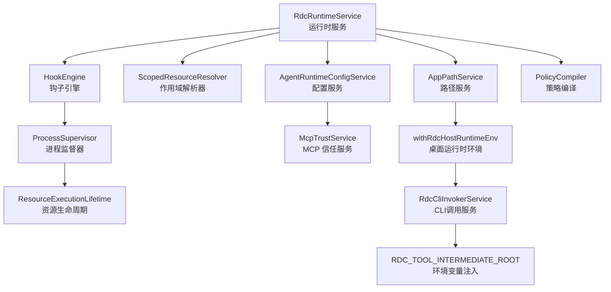
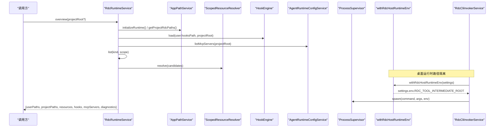
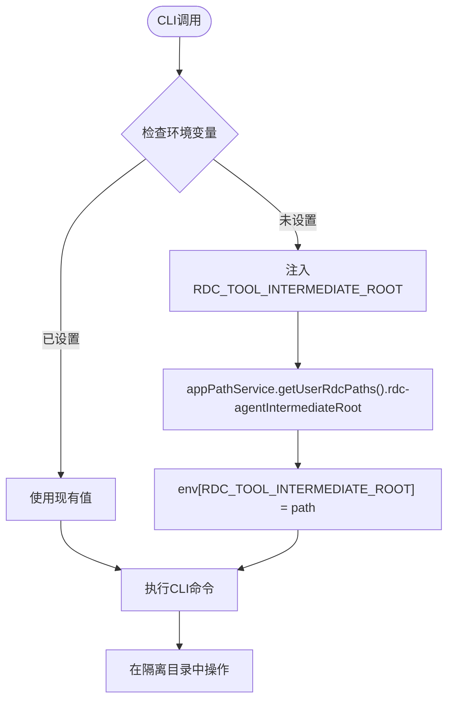
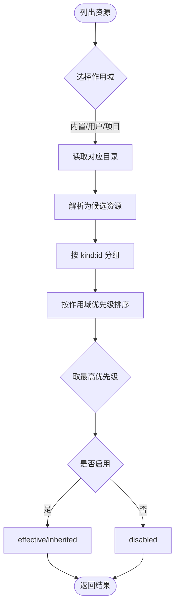
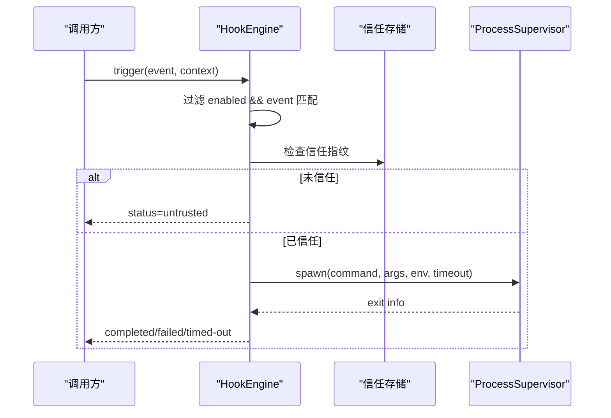
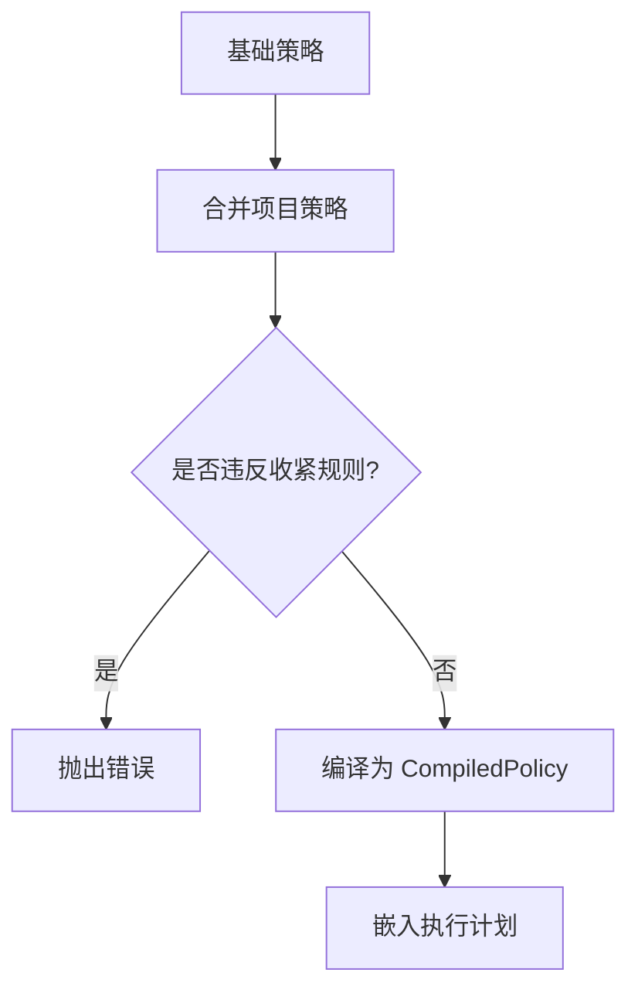
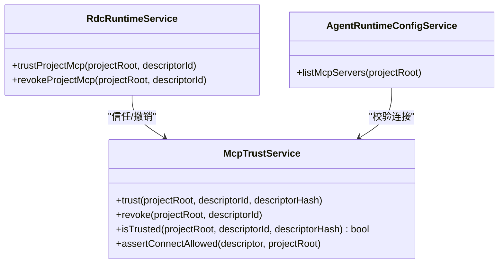
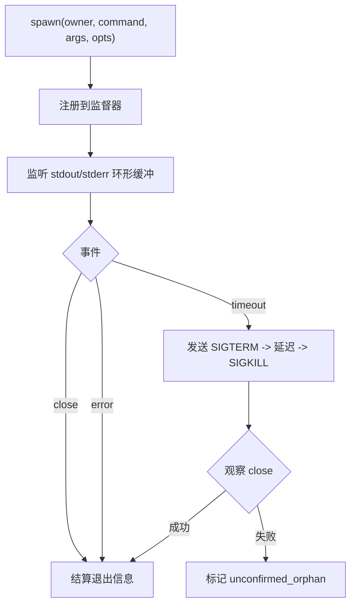
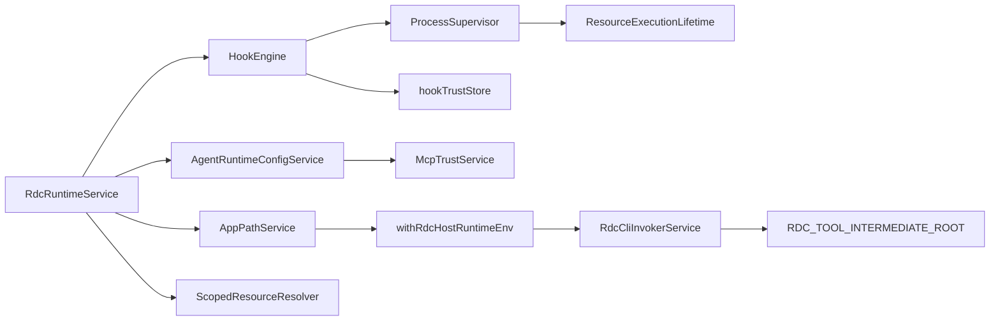

# 运行时设置

<cite>
**本文引用的文件**
- [RdcRuntimeService.ts](file://src/main/runtime/RdcRuntimeService.ts)
- [HookEngine.ts](file://src/main/hooks/HookEngine.ts)
- [AgentRuntimeConfigService.ts](file://src/main/settings/AgentRuntimeConfigService.ts)
- [ScopedResourceResolver.ts](file://src/main/runtime/ScopedResourceResolver.ts)
- [ProcessSupervisor.ts](file://src/main/runtime/ProcessSupervisor.ts)
- [AppPathService.ts](file://src/main/runtime/AppPathService.ts)
- [McpTrustService.ts](file://src/main/settings/McpTrustService.ts)
- [hookTrustStore.ts](file://src/main/hooks/hookTrustStore.ts)
- [PolicyCompiler.ts](file://src/main/agent-runtime/permissions/PolicyCompiler.ts)
- [ResourceExecutionLifetime.ts](file://src/main/runtime/ResourceExecutionLifetime.ts)
- [withRdcHostRuntimeEnv.ts](file://src/main/tools/withRdcHostRuntimeEnv.ts)
- [RdcCliInvokerService.ts](file://src/main/tools/RdcCliInvokerService.ts)
- [settings.ts](file://src/shared/types/settings.ts)
- [tool.ts](file://src/shared/types/tool.ts)
</cite>

## 更新摘要
**所做更改**
- 新增桌面运行时路径隔离功能章节，详细说明RDC_TOOL_INTERMEDIATE_ROOT环境变量的作用
- 更新AppPathService部分，增加rdcIntermediateRoot属性的说明
- 扩展RdcCliInvokerService部分，描述环境变量注入机制
- 更新工具运行时元数据，包含intermediateRoot字段
- 增强故障排查指南，包含路径隔离相关的调试信息

## 目录
1. [简介](#简介)
2. [项目结构](#项目结构)
3. [核心组件](#核心组件)
4. [架构总览](#架构总览)
5. [详细组件分析](#详细组件分析)
6. [依赖关系分析](#依赖关系分析)
7. [性能与优化建议](#性能与优化建议)
8. [故障排查指南](#故障排查指南)
9. [结论](#结论)

## 简介
本文件面向"运行时设置"的完整说明，覆盖以下目标：
- 运行时环境配置与作用域资源管理（用户级、项目级、内置）
- 桌面运行时路径隔离机制，防止桌面用户账户污染CLI的默认中间目录
- 钩子系统的工作原理、信任机制与自定义开发方法
- 执行策略与权限控制（限制工具、审批强度、资源限额）
- 执行配置文件的管理与版本控制（MCP 描述符、钩子清单）
- 运行时优化与性能调优建议

## 项目结构
运行时相关能力主要分布在以下模块：
- 运行时服务：统一入口，负责列举、读写、导入删除作用域资源，生成运行概览
- 路径服务：定义用户、项目与应用状态路径，并自动初始化目录，包括隔离的中间目录
- 作用域解析器：按作用域优先级合并资源，计算哈希与生效状态
- 钩子引擎：加载、匹配、执行钩子，维护信任存储
- 进程监督器：统一派生子进程、超时、树杀、环形缓冲输出
- 配置服务：技能与 MCP 服务器发现、合并、信任校验
- 权限策略：编译与合并限制性策略，约束工具调用与资源限额
- 资源生命周期：在异步上下文中跟踪资源退出，避免孤儿进程
- 桌面运行时环境：提供路径隔离和环境变量注入机制

图表来源
- [RdcRuntimeService.ts:24-151](file://src/main/runtime/RdcRuntimeService.ts#L24-L151)
- [AppPathService.ts:65-210](file://src/main/runtime/AppPathService.ts#L65-L210)
- [ScopedResourceResolver.ts:29-95](file://src/main/runtime/ScopedResourceResolver.ts#L29-L95)
- [HookEngine.ts:71-129](file://src/main/hooks/HookEngine.ts#L71-L129)
- [AgentRuntimeConfigService.ts:61-232](file://src/main/settings/AgentRuntimeConfigService.ts#L61-L232)
- [ProcessSupervisor.ts:140-425](file://src/main/runtime/ProcessSupervisor.ts#L140-L425)
- [McpTrustService.ts:43-129](file://src/main/settings/McpTrustService.ts#L43-L129)
- [PolicyCompiler.ts:145-172](file://src/main/agent-runtime/permissions/PolicyCompiler.ts#L145-L172)
- [ResourceExecutionLifetime.ts:1-21](file://src/main/runtime/ResourceExecutionLifetime.ts#L1-L21)
- [withRdcHostRuntimeEnv.ts:1-17](file://src/main/tools/withRdcHostRuntimeEnv.ts#L1-L17)
- [RdcCliInvokerService.ts:29-49](file://src/main/tools/RdcCliInvokerService.ts#L29-L49)

章节来源
- [RdcRuntimeService.ts:24-151](file://src/main/runtime/RdcRuntimeService.ts#L24-L151)
- [AppPathService.ts:65-210](file://src/main/runtime/AppPathService.ts#L65-L210)

## 核心组件
- RdcRuntimeService：提供运行时资源的列表、概览、写入、导入、删除；聚合钩子与 MCP 信息，汇总诊断。
- AppPathService：统一用户、项目与应用状态路径，自动创建目录，支持内置运行时根定位和隔离的中间目录。
- ScopedResourceResolver：按作用域优先级（内置 < 用户 < 项目）合并资源，计算稳定哈希，标记生效状态。
- HookEngine：扫描、解析、信任校验、匹配与执行钩子；维护信任存储，支持测试与撤销。
- AgentRuntimeConfigService：发现与合并技能与 MCP 服务器，处理传输协议白名单与项目对用户的覆盖限制。
- ProcessSupervisor：统一的子进程注册表，支持超时、信号终止、树杀、环形缓冲输出与孤儿检测。
- McpTrustService：基于项目真实路径与描述符哈希的 MCP 信任记录，连接前强制校验。
- PolicyCompiler：编译限制性策略，合并多层策略，冻结限额与禁用工具集。
- ResourceExecutionLifetime：在异步上下文内追踪资源退出，确保关闭时等待所有子进程完成。
- withRdcHostRuntimeEnv：桌面运行时环境隔离，注入RDC_TOOL_INTERMEDIATE_ROOT环境变量防止路径污染。
- RdcCliInvokerService：集成环境变量注入机制，确保CLI调用使用隔离的中间目录。

章节来源
- [RdcRuntimeService.ts:24-302](file://src/main/runtime/RdcRuntimeService.ts#L24-L302)
- [AppPathService.ts:65-233](file://src/main/runtime/AppPathService.ts#L65-L233)
- [ScopedResourceResolver.ts:29-124](file://src/main/runtime/ScopedResourceResolver.ts#L29-L124)
- [HookEngine.ts:71-381](file://src/main/hooks/HookEngine.ts#L71-L381)
- [AgentRuntimeConfigService.ts:61-237](file://src/main/settings/AgentRuntimeConfigService.ts#L61-L237)
- [ProcessSupervisor.ts:140-425](file://src/main/runtime/ProcessSupervisor.ts#L140-L425)
- [McpTrustService.ts:43-129](file://src/main/settings/McpTrustService.ts#L43-L129)
- [PolicyCompiler.ts:145-172](file://src/main/agent-runtime/permissions/PolicyCompiler.ts#L145-L172)
- [ResourceExecutionLifetime.ts:1-21](file://src/main/runtime/ResourceExecutionLifetime.ts#L1-L21)
- [withRdcHostRuntimeEnv.ts:1-17](file://src/main/tools/withRdcHostRuntimeEnv.ts#L1-L17)
- [RdcCliInvokerService.ts:29-49](file://src/main/tools/RdcCliInvokerService.ts#L29-L49)

## 架构总览
运行时以"作用域资源 + 钩子 + 策略 + 进程监督 + 路径隔离"为核心，形成可插拔、可审计、可控制的执行环境。

图表来源
- [RdcRuntimeService.ts:92-151](file://src/main/runtime/RdcRuntimeService.ts#L92-L151)
- [AppPathService.ts:161-210](file://src/main/runtime/AppPathService.ts#L161-L210)
- [HookEngine.ts:76-129](file://src/main/hooks/HookEngine.ts#L76-L129)
- [AgentRuntimeConfigService.ts:120-232](file://src/main/settings/AgentRuntimeConfigService.ts#L120-L232)
- [ScopedResourceResolver.ts:30-95](file://src/main/runtime/ScopedResourceResolver.ts#L30-L95)
- [withRdcHostRuntimeEnv.ts:10-16](file://src/main/tools/withRdcHostRuntimeEnv.ts#L10-L16)
- [RdcCliInvokerService.ts:161-164](file://src/main/tools/RdcCliInvokerService.ts#L161-L164)

## 详细组件分析

### 桌面运行时路径隔离机制
**新增功能** 桌面运行时路径隔离通过`withRdcHostRuntimeEnv`模块实现，防止桌面用户账户污染CLI的默认中间目录。

- **环境变量注入**
  - `RDC_TOOL_INTERMEDIATE_ROOT_ENV = 'RDC_TOOL_INTERMEDIATE_ROOT'`：定义隔离目录的环境变量名
  - `hostRdcIntermediateRoot()`：获取用户作用域的隔离中间目录路径
  - `withRdcHostRuntimeEnv(settings)`：为CLI调用注入隔离的环境变量

- **路径隔离原理**
  - 每个桌面用户拥有独立的`.rdc-agent/rdc-intermediate`目录
  - CLI工具通过`RDC_TOOL_INTERMEDIATE_ROOT`环境变量访问隔离目录
  - 防止不同用户间的临时文件、缓存和中间产物相互污染

- **集成点**
  - `RdcCliInvokerService.createRuntimeMetadata()`：读取隔离目录路径到运行时元数据
  - `RdcCliInvokerService.executeCLI()`：在所有CLI调用中注入环境变量
  - `ToolRuntimeMetadata.intermediateRoot`：暴露当前使用的隔离目录

图表来源
- [withRdcHostRuntimeEnv.ts:6-16](file://src/main/tools/withRdcHostRuntimeEnv.ts#L6-L16)
- [RdcCliInvokerService.ts:33-49](file://src/main/tools/RdcCliInvokerService.ts#L33-L49)
- [RdcCliInvokerService.ts:161-164](file://src/main/tools/RdcCliInvokerService.ts#L161-L164)

章节来源
- [withRdcHostRuntimeEnv.ts:1-17](file://src/main/tools/withRdcHostRuntimeEnv.ts#L1-L17)
- [RdcCliInvokerService.ts:29-49](file://src/main/tools/RdcCliInvokerService.ts#L29-L49)
- [RdcCliInvokerService.ts:161-164](file://src/main/tools/RdcCliInvokerService.ts#L161-L164)

### 作用域资源管理与权限控制
- 作用域划分
  - 内置（builtin）：打包或应用提供的默认资源，优先级最低
  - 用户（user）：位于用户目录下的 .rdc-agent 对应子目录，包括隔离的中间目录
  - 项目（project）：位于项目根 .rdc-agent 下，优先级最高，可覆盖用户配置
- 资源类型与扩展名
  - agent(.agent.md)、skill(目录+SKILL.md)、mcp(.mcp.json)、hook(.hook.yml)、policy(.policy.yml)、knowledge(.md)、memory(.md)
- 合并与生效状态
  - 同 ID 的资源按作用域优先级排序，高优先级覆盖低优先级
  - 有效状态包括 effective、overridden、inherited、disabled、invalid
- 安全边界
  - 写入路径必须位于作用域根目录下，防止逃逸
  - 策略合并采用收紧原则，项目策略不能降低基础策略的审批强度或放宽限额

图表来源
- [RdcRuntimeService.ts:40-90](file://src/main/runtime/RdcRuntimeService.ts#L40-L90)
- [ScopedResourceResolver.ts:30-95](file://src/main/runtime/ScopedResourceResolver.ts#L30-L95)

章节来源
- [RdcRuntimeService.ts:27-90](file://src/main/runtime/RdcRuntimeService.ts#L27-L90)
- [ScopedResourceResolver.ts:29-124](file://src/main/runtime/ScopedResourceResolver.ts#L29-L124)

### 钩子系统工作原理与自定义开发
- 钩子定义
  - 通过 .hook.yml 声明 id、event、command、args、cwd、env、timeoutMs、failurePolicy、matcher
  - failurePolicy 支持 block 或 warn，决定失败时的阻断行为
- 加载与信任
  - 从内置、用户、项目三个目录扫描 .hook.yml
  - 使用信任指纹（包含定义、作用域、源路径等）判断是否需要重新信任
  - 信任存储位于应用状态目录，支持撤销与查询
- 匹配与执行
  - 根据事件、agentId、toolName 进行匹配
  - 通过进程监督器派生外部脚本，注入上下文 JSON 到标准输入
  - 支持超时、输出环形缓冲、孤儿进程检测
- 自定义钩子开发步骤
  - 在项目或用户目录创建 .hook.yml，填写必要字段
  - 编写命令对应的脚本或可执行程序
  - 首次触发时会要求信任；信任后才会执行
  - 可使用 test 接口验证钩子行为

图表来源
- [HookEngine.ts:214-246](file://src/main/hooks/HookEngine.ts#L214-L246)
- [HookEngine.ts:293-369](file://src/main/hooks/HookEngine.ts#L293-L369)
- [hookTrustStore.ts:65-100](file://src/main/hooks/hookTrustStore.ts#L65-L100)
- [ProcessSupervisor.ts:167-394](file://src/main/runtime/ProcessSupervisor.ts#L167-L394)

章节来源
- [HookEngine.ts:48-129](file://src/main/hooks/HookEngine.ts#L48-L129)
- [HookEngine.ts:139-212](file://src/main/hooks/HookEngine.ts#L139-L212)
- [HookEngine.ts:214-369](file://src/main/hooks/HookEngine.ts#L214-L369)
- [hookTrustStore.ts:1-101](file://src/main/hooks/hookTrustStore.ts#L1-L101)

### 执行策略与权限控制
- 策略来源
  - 用户与项目目录下的 .policy.yml，支持多层合并
- 策略内容
  - deniedTools：禁用工具集合
  - approval：全局审批强度（none/destructive/mutation/all）
  - limits：资源限额（如最大轮数、工具调用次数、子代理深度、墙钟时间、上下文压缩比例等）
- 合并规则
  - 项目策略只能收紧基础策略，不能放宽审批强度或提高限额
  - 每层策略的 limits 取最小值，deniedTools 合并去重
- 编译与使用
  - 将 RestrictivePolicy 编译为 CompiledPolicy，冻结不可变字段
  - 在执行计划中结合策略与权限设置，生成最终可用工具集与限额

图表来源
- [ScopedResourceResolver.ts:97-120](file://src/main/runtime/ScopedResourceResolver.ts#L97-L120)
- [PolicyCompiler.ts:145-172](file://src/main/agent-runtime/permissions/PolicyCompiler.ts#L145-L172)

章节来源
- [ScopedResourceResolver.ts:97-120](file://src/main/runtime/ScopedResourceResolver.ts#L97-L120)
- [PolicyCompiler.ts:145-172](file://src/main/agent-runtime/permissions/PolicyCompiler.ts#L145-L172)

### 执行配置文件管理与版本控制
- MCP 服务器描述符
  - 用户与项目目录下的 .mcp.json，支持 stdio 与 streamable-http 传输
  - 项目描述符可覆盖用户描述符的非执行字段（名称、描述、默认启用），但禁止覆盖命令、参数、URL、环境变量
  - 项目 MCP 需要信任：基于项目真实路径与描述符哈希，连接前强制校验
- 版本与一致性
  - 描述符哈希用于变更检测与信任绑定
  - 信任存储记录项目真实路径、描述符 ID、哈希与信任时间
- 技能与提示词
  - 技能目录包含 SKILL.md，支持 frontmatter 元数据与指令
  - 技能可见性可按查看者代理 ID 过滤

图表来源
- [McpTrustService.ts:43-129](file://src/main/settings/McpTrustService.ts#L43-L129)
- [AgentRuntimeConfigService.ts:120-232](file://src/main/settings/AgentRuntimeConfigService.ts#L120-L232)
- [RdcRuntimeService.ts:153-175](file://src/main/runtime/RdcRuntimeService.ts#L153-L175)

章节来源
- [AgentRuntimeConfigService.ts:120-232](file://src/main/settings/AgentRuntimeConfigService.ts#L120-L232)
- [McpTrustService.ts:43-129](file://src/main/settings/McpTrustService.ts#L43-L129)
- [RdcRuntimeService.ts:153-175](file://src/main/runtime/RdcRuntimeService.ts#L153-L175)

### 进程监督与资源生命周期
- 进程监督器职责
  - 统一派生子进程，支持超时、信号终止、树杀（POSIX 进程组、Windows taskkill）
  - 环形缓冲输出，限制内存占用
  - 孤儿进程检测与确认，避免僵尸进程
- 资源生命周期
  - 在工具执行期间保留资源引用，直到监督器观察到子进程退出
  - 支持会话级执行所有者，便于清理与诊断

图表来源
- [ProcessSupervisor.ts:167-394](file://src/main/runtime/ProcessSupervisor.ts#L167-L394)
- [ResourceExecutionLifetime.ts:1-21](file://src/main/runtime/ResourceExecutionLifetime.ts#L1-L21)

章节来源
- [ProcessSupervisor.ts:140-425](file://src/main/runtime/ProcessSupervisor.ts#L140-L425)
- [ResourceExecutionLifetime.ts:1-21](file://src/main/runtime/ResourceExecutionLifetime.ts#L1-L21)

## 依赖关系分析
- RdcRuntimeService 依赖 AppPathService 获取路径，依赖 HookEngine 与 AgentRuntimeConfigService 获取钩子与 MCP 信息，依赖 ScopedResourceResolver 进行资源合并
- HookEngine 依赖 ProcessSupervisor 执行外部脚本，依赖 hookTrustStore 持久化信任
- AgentRuntimeConfigService 依赖 McpTrustService 进行 MCP 连接前的信任校验
- PolicyCompiler 被上层策略系统使用，与 ScopedResourceResolver 的 tightenPolicy 协作保证策略收紧
- withRdcHostRuntimeEnv 依赖 AppPathService 获取隔离目录路径，被 RdcCliInvokerService 集成使用
- RdcCliInvokerService 通过环境变量注入机制确保CLI调用使用隔离的中间目录

图表来源
- [RdcRuntimeService.ts:24-151](file://src/main/runtime/RdcRuntimeService.ts#L24-L151)
- [HookEngine.ts:71-129](file://src/main/hooks/HookEngine.ts#L71-L129)
- [AgentRuntimeConfigService.ts:61-232](file://src/main/settings/AgentRuntimeConfigService.ts#L61-L232)
- [ProcessSupervisor.ts:140-425](file://src/main/runtime/ProcessSupervisor.ts#L140-L425)
- [hookTrustStore.ts:1-101](file://src/main/hooks/hookTrustStore.ts#L1-L101)
- [McpTrustService.ts:43-129](file://src/main/settings/McpTrustService.ts#L43-L129)
- [ResourceExecutionLifetime.ts:1-21](file://src/main/runtime/ResourceExecutionLifetime.ts#L1-L21)
- [withRdcHostRuntimeEnv.ts:1-17](file://src/main/tools/withRdcHostRuntimeEnv.ts#L1-L17)
- [RdcCliInvokerService.ts:29-49](file://src/main/tools/RdcCliInvokerService.ts#L29-L49)

章节来源
- [RdcRuntimeService.ts:24-151](file://src/main/runtime/RdcRuntimeService.ts#L24-L151)
- [HookEngine.ts:71-129](file://src/main/hooks/HookEngine.ts#L71-L129)
- [AgentRuntimeConfigService.ts:61-232](file://src/main/settings/AgentRuntimeConfigService.ts#L61-L232)
- [ProcessSupervisor.ts:140-425](file://src/main/runtime/ProcessSupervisor.ts#L140-L425)

## 性能与优化建议
- 钩子执行
  - 合理设置 timeoutMs，避免长时间阻塞；失败策略优先使用 warn，减少阻断
  - 使用 matcher 精确匹配 agent/tool，减少不必要执行
  - 控制 stdout/stderr 输出大小，利用环形缓冲限制内存占用
- 进程管理
  - 避免频繁派生短命进程；必要时复用进程或批处理
  - 使用 isolateProcessGroup=false 仅在确知不会泄漏子进程时使用
  - 关注 orphaned 标志，及时清理未确认退出的进程
- 策略与权限
  - 通过 deniedTools 与 limits 限制高风险操作，降低整体开销
  - 使用紧凑的上下文压缩比例，避免过大上下文导致性能下降
- 资源路径
  - 尽量将大文件放在 inputs/artifacts 目录，避免污染 .rdc-agent 配置目录
  - 使用项目作用域覆盖用户配置，减少重复定义
- **路径隔离优化**
  - 隔离目录位于用户作用域下，避免跨用户文件竞争
  - 通过环境变量传递隔离路径，减少文件系统查找开销
  - 定期清理隔离目录中的临时文件，避免磁盘空间浪费

[本节为通用指导，不直接分析具体文件]

## 故障排查指南
- 钩子未信任
  - 现象：status=untrusted，reason 提示需要显式信任
  - 解决：调用 trustUserHook 或 trustProjectHook 进行信任；检查信任存储文件
- 钩子执行失败或超时
  - 现象：status=failed/timed-out，reason 包含退出码或超时信息
  - 解决：检查命令与参数、工作目录、环境变量；调整 timeoutMs 与 failurePolicy
- MCP 连接被拒绝
  - 现象：blockedReason 或 needsRetrust
  - 解决：确认传输协议受支持；对项目 MCP 执行信任；避免项目覆盖用户可执行字段
- 策略冲突
  - 现象：tightenPolicy 抛出错误，提示无法放宽审批或限额
  - 解决：调整项目策略，使其仅能收紧基础策略
- 进程孤儿
  - 现象：orphaned=true，reason=unconfirmed_orphan
  - 解决：检查子进程是否正确关闭；必要时强制终止并观察 close 事件
- **路径隔离问题**
  - 现象：CLI工具访问错误的中间目录，文件或缓存混乱
  - 解决：检查`RDC_TOOL_INTERMEDIATE_ROOT`环境变量是否正确注入；确认`withRdcHostRuntimeEnv`函数被正确调用；验证`ToolRuntimeMetadata.intermediateRoot`字段值
  - 调试：查看CLI调用的环境变量快照，确认隔离路径已正确设置

章节来源
- [HookEngine.ts:214-246](file://src/main/hooks/HookEngine.ts#L214-L246)
- [HookEngine.ts:293-369](file://src/main/hooks/HookEngine.ts#L293-L369)
- [McpTrustService.ts:86-106](file://src/main/settings/McpTrustService.ts#L86-L106)
- [ScopedResourceResolver.ts:97-120](file://src/main/runtime/ScopedResourceResolver.ts#L97-L120)
- [ProcessSupervisor.ts:302-343](file://src/main/runtime/ProcessSupervisor.ts#L302-L343)
- [withRdcHostRuntimeEnv.test.ts:15-33](file://src/main/tools/withRdcHostRuntimeEnv.test.ts#L15-L33)

## 结论
本运行时通过作用域资源、钩子、策略、进程监督与路径隔离的组合，提供了安全、可控、可扩展的执行环境。**新增的桌面运行时路径隔离功能**确保了不同桌面用户之间的CLI中间目录完全隔离，防止了用户账户污染问题。开发者可通过钩子与策略定制行为，同时借助信任机制、权限控制与路径隔离保障安全性。建议在项目中合理使用项目作用域覆盖、策略收紧、进程超时控制与路径隔离，以获得最佳的性能与稳定性。

**路径隔离的核心优势**：
- 每个桌面用户拥有独立的中间目录，避免文件冲突
- 通过环境变量注入机制，透明地为CLI工具提供隔离路径
- 支持用户自定义覆盖，满足特殊场景需求
- 与现有的作用域资源管理系统无缝集成