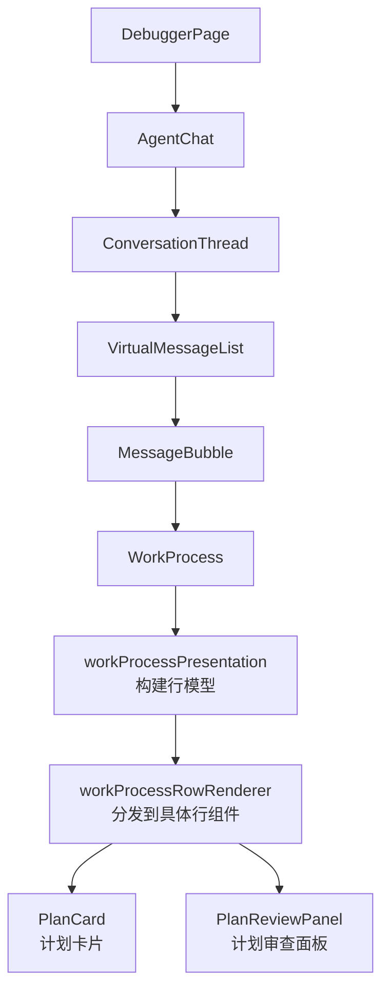
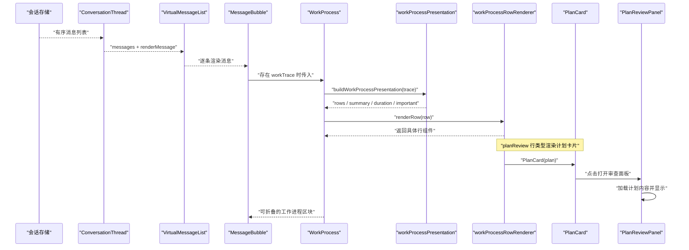
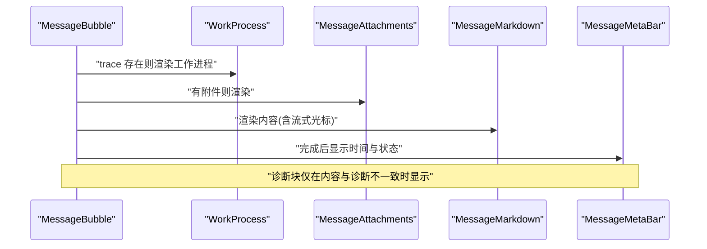
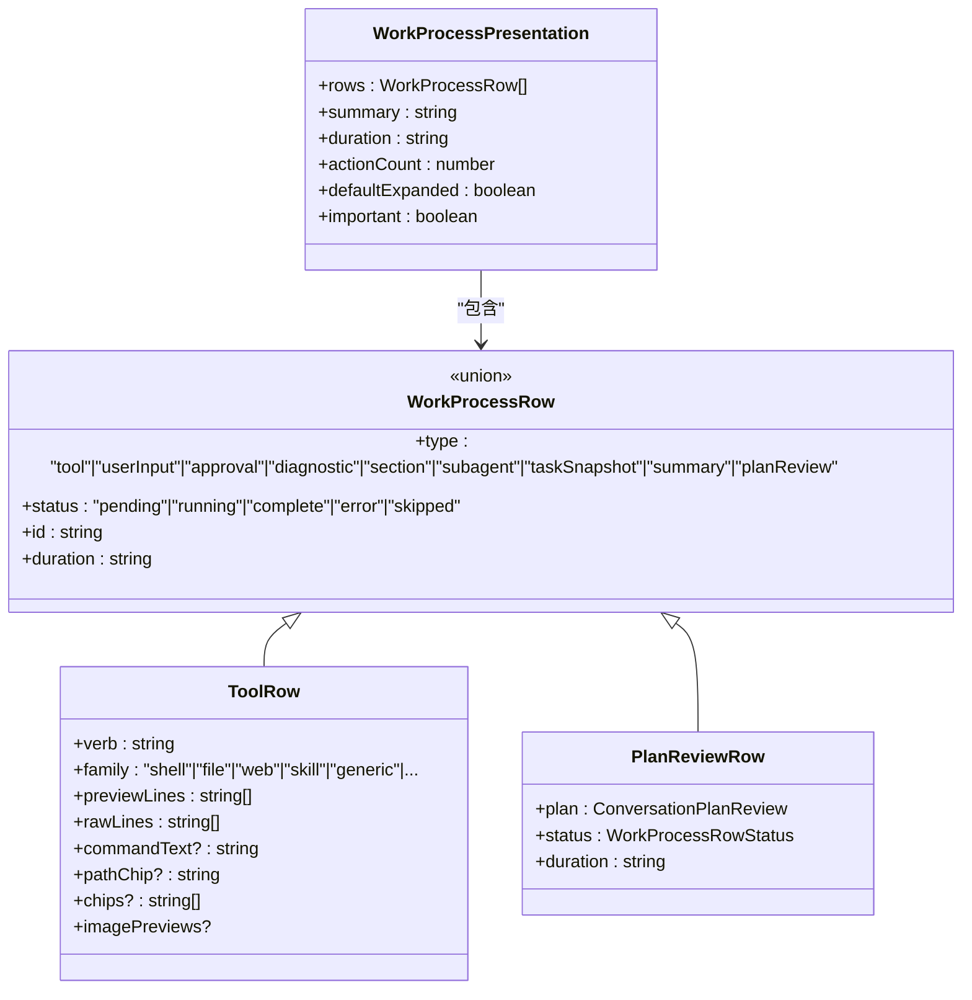
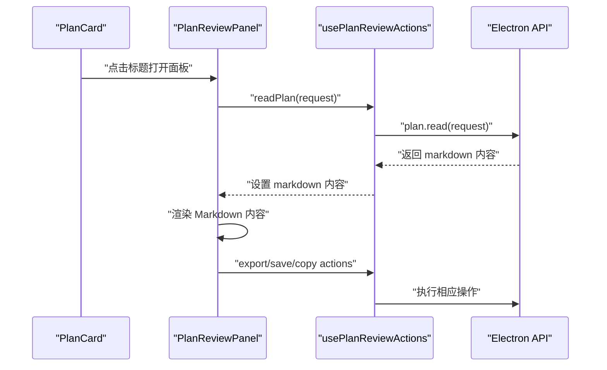
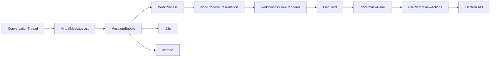

# 调试视图

<cite>
**本文引用的文件**
- [src/renderer/features/transcript/index.tsx](file://src/renderer/features/transcript/index.tsx)
- [src/renderer/features/transcript/DebuggerPage.tsx](file://src/renderer/features/transcript/DebuggerPage.tsx)
- [src/renderer/features/transcript/ConversationThread.tsx](file://src/renderer/features/transcript/ConversationThread.tsx)
- [src/renderer/features/transcript/VirtualMessageList.tsx](file://src/renderer/features/transcript/VirtualMessageList.tsx)
- [src/renderer/features/transcript/MessageBubble.tsx](file://src/renderer/features/transcript/MessageBubble.tsx)
- [src/renderer/features/transcript/WorkProcess.tsx](file://src/renderer/features/transcript/WorkProcess.tsx)
- [src/renderer/features/transcript/workProcessPresentation.ts](file://src/renderer/features/transcript/workProcessPresentation.ts)
- [src/renderer/features/transcript/workProcessTypes.ts](file://src/renderer/features/transcript/workProcessTypes.ts)
- [src/renderer/features/transcript/workProcessRowRenderer.tsx](file://src/renderer/features/transcript/workProcessRowRenderer.tsx)
- [src/renderer/features/transcript/PlanCard.tsx](file://src/renderer/features/transcript/PlanCard.tsx)
- [src/renderer/features/transcript/PlanReviewPanel.tsx](file://src/renderer/features/transcript/PlanReviewPanel.tsx)
- [src/renderer/features/transcript/usePlanReviewActions.ts](file://src/renderer/features/transcript/usePlanReviewActions.ts)
- [src/renderer/features/transcript/WorkProcessRows.tsx](file://src/renderer/features/transcript/WorkProcessRows.tsx)
- [src/renderer/features/transcript/plan-card.css](file://src/renderer/features/transcript/plan-card.css)
- [src/shared/types/planReview.ts](file://src/shared/types/planReview.ts)
</cite>

## 更新摘要
**变更内容**
- 新增计划卡片组件 PlanCard，用于显示计划状态、摘要和章节信息
- 新增计划审查面板 PlanReviewPanel，提供完整的计划查看、导出和保存功能
- 集成计划审查行到工作进程可视化中，支持计划审批流程
- 增强调试视图对计划相关工具调用的支持

## 目录
1. [简介](#简介)
2. [项目结构](#项目结构)
3. [核心组件](#核心组件)
4. [架构总览](#架构总览)
5. [详细组件分析](#详细组件分析)
6. [依赖关系分析](#依赖关系分析)
7. [性能考虑](#性能考虑)
8. [故障排查指南](#故障排查指南)
9. [结论](#结论)
10. [附录](#附录)

## 简介
本文件面向 RDC-Agent 的"调试视图"，系统性说明对话线程展示、工作进程可视化与调试信息呈现。重点覆盖消息渲染机制、工具执行跟踪、错误诊断显示、虚拟滚动优化、消息搜索过滤与时间线导航能力，并给出自定义消息类型、调试标记与日志导出能力的实践建议，以及调试工作流最佳实践与性能调优建议。

**更新** 新增了计划卡片和计划审查面板功能，用于显示计划状态、摘要和章节信息，增强了调试视图对计划审批流程的支持。

## 项目结构
调试视图位于渲染层 features/transcript 目录，采用"页面容器 + 会话线程 + 虚拟列表 + 消息气泡 + 工作进程"的分层组织：
- 页面容器：DebuggerPage 提供调试页外壳，AgentChat 负责滚动吸附与空态处理。
- 会话线程：ConversationThread 从 store 获取有序消息，交由 VirtualMessageList 渲染。
- 虚拟列表：VirtualMessageList 实现短列表全量渲染、长列表虚拟滚动（基于估算高度与可视区计算）。
- 消息气泡：MessageBubble 根据角色与状态渲染用户/助手/系统消息，承载附件、编辑重写、诊断块等。
- 工作进程：WorkProcess 将 ConversationWorkTrace 投影为可折叠的行集合，支持工具调用、审批、诊断、子代理等行类型。
- **新增** 计划卡片：PlanCard 显示计划状态、摘要和章节信息，PlanReviewPanel 提供完整计划查看界面。

**图表来源**
- [src/renderer/features/transcript/DebuggerPage.tsx:1-12](file://src/renderer/features/transcript/DebuggerPage.tsx#L1-L12)
- [src/renderer/features/transcript/index.tsx:16-60](file://src/renderer/features/transcript/index.tsx#L16-L60)
- [src/renderer/features/transcript/ConversationThread.tsx:16-43](file://src/renderer/features/transcript/ConversationThread.tsx#L16-L43)
- [src/renderer/features/transcript/VirtualMessageList.tsx:52-166](file://src/renderer/features/transcript/VirtualMessageList.tsx#L52-L166)
- [src/renderer/features/transcript/MessageBubble.tsx:183-247](file://src/renderer/features/transcript/MessageBubble.tsx#L183-L247)
- [src/renderer/features/transcript/WorkProcess.tsx:12-83](file://src/renderer/features/transcript/WorkProcess.tsx#L12-L83)
- [src/renderer/features/transcript/workProcessPresentation.ts:296-318](file://src/renderer/features/transcript/workProcessPresentation.ts#L296-L318)
- [src/renderer/features/transcript/workProcessRowRenderer.tsx:15-37](file://src/renderer/features/transcript/workProcessRowRenderer.tsx#L15-L37)
- [src/renderer/features/transcript/PlanCard.tsx:15-59](file://src/renderer/features/transcript/PlanCard.tsx#L15-L59)
- [src/renderer/features/transcript/PlanReviewPanel.tsx:14-126](file://src/renderer/features/transcript/PlanReviewPanel.tsx#L14-L126)

## 核心组件
- DebuggerPage：调试页入口，挂载 AgentChat。
- AgentChat：管理滚动容器、自动吸底、空态样式。
- ConversationThread：订阅有序消息，空态时显示提示，否则交给虚拟列表。
- VirtualMessageList：短列表阈值以下全量渲染；超过阈值则按估算高度计算可视范围，仅渲染可见项与 overscan。
- MessageBubble：按角色渲染用户/助手/系统消息；助手消息优先展示工作进程，再展示内容气泡与诊断块；支持附件、编辑重写、流式光标。
- WorkProcess：将 ConversationWorkTrace 投影为可折叠区域，包含摘要、步骤行、时长与动作计数；运行中或重要时默认展开。
- workProcessPresentation：把原始 trace blocks 转换为统一行模型（tool、userInput、approval、diagnostic、section、subagent、taskSnapshot、**planReview** 等），并计算统计与默认展开策略。
- workProcessRowRenderer：根据行类型分派到对应 UI 组件。
- **新增** PlanCard：显示计划状态、标题、摘要和章节信息，支持打开详细审查面板。
- **新增** PlanReviewPanel：提供完整的计划查看界面，支持导出、保存到项目和复制功能。

**章节来源**
- [src/renderer/features/transcript/DebuggerPage.tsx:1-12](file://src/renderer/features/transcript/DebuggerPage.tsx#L1-L12)
- [src/renderer/features/transcript/index.tsx:16-60](file://src/renderer/features/transcript/index.tsx#L16-L60)
- [src/renderer/features/transcript/ConversationThread.tsx:16-43](file://src/renderer/features/transcript/ConversationThread.tsx#L16-L43)
- [src/renderer/features/transcript/VirtualMessageList.tsx:52-166](file://src/renderer/features/transcript/VirtualMessageList.tsx#L52-L166)
- [src/renderer/features/transcript/MessageBubble.tsx:183-247](file://src/renderer/features/transcript/MessageBubble.tsx#L183-L247)
- [src/renderer/features/transcript/WorkProcess.tsx:12-83](file://src/renderer/features/transcript/WorkProcess.tsx#L12-L83)
- [src/renderer/features/transcript/workProcessPresentation.ts:296-318](file://src/renderer/features/transcript/workProcessPresentation.ts#L296-L318)
- [src/renderer/features/transcript/workProcessRowRenderer.tsx:15-37](file://src/renderer/features/transcript/workProcessRowRenderer.tsx#L15-L37)
- [src/renderer/features/transcript/PlanCard.tsx:15-59](file://src/renderer/features/transcript/PlanCard.tsx#L15-L59)
- [src/renderer/features/transcript/PlanReviewPanel.tsx:14-126](file://src/renderer/features/transcript/PlanReviewPanel.tsx#L14-L126)

## 架构总览
调试视图的数据流自下而上：store 中的会话消息驱动 ConversationThread，再由 VirtualMessageList 进行高效渲染；每条消息通过 MessageBubble 决定展示形态；助手消息若携带 workTrace，则由 WorkProcess 将其投影为结构化行，便于追踪工具执行、审批与诊断。**新增的计划审查功能**通过 planReview 行类型集成到工作进程流程中。

**图表来源**
- [src/renderer/features/transcript/ConversationThread.tsx:16-43](file://src/renderer/features/transcript/ConversationThread.tsx#L16-L43)
- [src/renderer/features/transcript/VirtualMessageList.tsx:52-166](file://src/renderer/features/transcript/VirtualMessageList.tsx#L52-L166)
- [src/renderer/features/transcript/MessageBubble.tsx:183-247](file://src/renderer/features/transcript/MessageBubble.tsx#L183-L247)
- [src/renderer/features/transcript/WorkProcess.tsx:12-83](file://src/renderer/features/transcript/WorkProcess.tsx#L12-L83)
- [src/renderer/features/transcript/workProcessPresentation.ts:296-318](file://src/renderer/features/transcript/workProcessPresentation.ts#L296-L318)
- [src/renderer/features/transcript/workProcessRowRenderer.tsx:15-37](file://src/renderer/features/transcript/workProcessRowRenderer.tsx#L15-L37)
- [src/renderer/features/transcript/PlanCard.tsx:15-59](file://src/renderer/features/transcript/PlanCard.tsx#L15-L59)
- [src/renderer/features/transcript/PlanReviewPanel.tsx:14-126](file://src/renderer/features/transcript/PlanReviewPanel.tsx#L14-L126)

## 详细组件分析

### 对话线程与虚拟滚动
- 线程装配：ConversationThread 从 store 选择器获取有序消息，空态显示占位提示，非空态交给 VirtualMessageList。
- 虚拟滚动策略：
  - 短列表（≤ 阈值）全量渲染，保证布局保真。
  - 长列表使用估算高度与可视区计算 start/end，配合 overscan 减少闪烁。
  - 监听父级滚动容器与 ResizeObserver，动态更新可视范围。
- 滚动吸附：AgentChat 在消息数量或最新活动变化时平滑滚动到底部，并在用户上滚时退出吸附。

**图表来源**
- [src/renderer/features/transcript/VirtualMessageList.tsx:52-166](file://src/renderer/features/transcript/VirtualMessageList.tsx#L52-L166)
- [src/renderer/features/transcript/index.tsx:23-47](file://src/renderer/features/transcript/index.tsx#L23-L47)

**章节来源**
- [src/renderer/features/transcript/ConversationThread.tsx:16-43](file://src/renderer/features/transcript/ConversationThread.tsx#L16-L43)
- [src/renderer/features/transcript/VirtualMessageList.tsx:52-166](file://src/renderer/features/transcript/VirtualMessageList.tsx#L52-L166)
- [src/renderer/features/transcript/index.tsx:23-47](file://src/renderer/features/transcript/index.tsx#L23-L47)

### 消息渲染机制与调试信息
- 角色路由：MessageBubble 根据 role 路由到用户/助手/系统三类渲染。
- 助手消息：
  - 优先渲染工作进程（若有），随后渲染附件与内容气泡。
  - 流式状态下显示光标；完成后再显示元信息栏（时间、状态标签、操作）。
  - 当存在 diagnostic 且与正文不同，渲染独立诊断块，避免重复信息。
- 用户消息：支持编辑重写（乐观快照）、Markdown 开关、附件预览。
- 系统消息：由 SystemMessage 处理。

**图表来源**
- [src/renderer/features/transcript/MessageBubble.tsx:183-247](file://src/renderer/features/transcript/MessageBubble.tsx#L183-L247)

**章节来源**
- [src/renderer/features/transcript/MessageBubble.tsx:183-247](file://src/renderer/features/transcript/MessageBubble.tsx#L183-L247)

### 工作进程可视化与工具执行跟踪
- 投影管线：WorkProcess 调用 buildWorkProcessPresentation 将 ConversationWorkTrace.blocks 转换为统一的行模型（row），包括 tool、userInput、approval、diagnostic、section、subagent、taskSnapshot、**planReview** 等。
- 行渲染：workProcessRowRenderer 根据 row.type 分派到具体组件（ToolRow、UserInputRow、ApprovalRow、DiagnosticRow、SubagentRow、TaskSnapshotCard、WorkProcessSectionRow、SummaryRow、**PlanCard**）。
- 工具卡片：
  - 解析工具名称、目标、参数预览、结果预览，生成人类可读的摘要与详情。
  - 对 shell、代码解释器、技能读取、web 抓取等工具进行专用解包与预览。
  - 失败时提取诊断标题，避免直接暴露原始 JSON。
- 审批与询问：
  - 将 approval 状态映射为"等待审批/自动检查/已批准/已拒绝"等动词与消息。
  - ask_user 被投影为 userInput 行，展示问题与答案。
- 思考与评论：
  - 根据 reasoningState 与输出阶段，决定是否在"思考"槽位展示摘要/原始/未知类型思考。
  - commentary 作为叙述性文本，不进入思考槽位。
- **新增** 计划审查行：planReview 行类型用于显示计划审批请求，包含计划状态、摘要和章节信息。

**图表来源**
- [src/renderer/features/transcript/workProcessTypes.ts:116-266](file://src/renderer/features/transcript/workProcessTypes.ts#L116-L266)
- [src/renderer/features/transcript/workProcessPresentation.ts:296-318](file://src/renderer/features/transcript/workProcessPresentation.ts#L296-L318)
- [src/renderer/features/transcript/workProcessRowRenderer.tsx:15-37](file://src/renderer/features/transcript/workProcessRowRenderer.tsx#L15-L37)
- [src/renderer/features/transcript/WorkProcessRows.tsx:61-68](file://src/renderer/features/transcript/WorkProcessRows.tsx#L61-L68)

**章节来源**
- [src/renderer/features/transcript/WorkProcess.tsx:12-83](file://src/renderer/features/transcript/WorkProcess.tsx#L12-L83)
- [src/renderer/features/transcript/workProcessPresentation.ts:296-318](file://src/renderer/features/transcript/workProcessPresentation.ts#L296-L318)
- [src/renderer/features/transcript/workProcessTypes.ts:116-266](file://src/renderer/features/transcript/workProcessTypes.ts#L116-L266)
- [src/renderer/features/transcript/workProcessRowRenderer.tsx:15-37](file://src/renderer/features/transcript/workProcessRowRenderer.tsx#L15-L37)
- [src/renderer/features/transcript/WorkProcessRows.tsx:61-68](file://src/renderer/features/transcript/WorkProcessRows.tsx#L61-L68)

### 计划卡片与审查面板
- **新增** PlanCard 组件：显示计划的基本信息，包括状态标识、标题、摘要列表和前三个章节的折叠预览。
- **新增** PlanReviewPanel 组件：通过模态框提供完整的计划查看界面，支持 Markdown 渲染、导出、保存到项目和复制功能。
- 计划状态：支持 awaiting（等待审批）、approved（已批准）、rejected（已拒绝）、superseded（已替代）四种状态。
- 交互流程：用户点击计划卡片标题打开审查面板，面板中提供多种操作按钮。

**图表来源**
- [src/renderer/features/transcript/PlanCard.tsx:15-59](file://src/renderer/features/transcript/PlanCard.tsx#L15-L59)
- [src/renderer/features/transcript/PlanReviewPanel.tsx:14-126](file://src/renderer/features/transcript/PlanReviewPanel.tsx#L14-L126)
- [src/renderer/features/transcript/usePlanReviewActions.ts:5-36](file://src/renderer/features/transcript/usePlanReviewActions.ts#L5-L36)

**章节来源**
- [src/renderer/features/transcript/PlanCard.tsx:15-59](file://src/renderer/features/transcript/PlanCard.tsx#L15-L59)
- [src/renderer/features/transcript/PlanReviewPanel.tsx:14-126](file://src/renderer/features/transcript/PlanReviewPanel.tsx#L14-L126)
- [src/renderer/features/transcript/usePlanReviewActions.ts:5-36](file://src/renderer/features/transcript/usePlanReviewActions.ts#L5-L36)
- [src/renderer/features/transcript/plan-card.css:1-100](file://src/renderer/features/transcript/plan-card.css#L1-L100)

### 时间线导航与交互
- 滚动吸附：AgentChat 在新增消息或活动更新时自动滚动到底部；当用户向上滚动超出阈值时停止吸附，允许自由浏览历史。
- 折叠/展开：WorkProcess 根据 status 与重要性控制默认展开；运行中或重要任务保持展开以提升可观测性。
- 元信息栏：消息底部显示时间、流式/错误/停止状态标签与操作按钮，便于快速定位与二次操作。

**章节来源**
- [src/renderer/features/transcript/index.tsx:23-47](file://src/renderer/features/transcript/index.tsx#L23-L47)
- [src/renderer/features/transcript/WorkProcess.tsx:12-83](file://src/renderer/features/transcript/WorkProcess.tsx#L12-L83)
- [src/renderer/features/transcript/MessageBubble.tsx:57-87](file://src/renderer/features/transcript/MessageBubble.tsx#L57-L87)

### 消息搜索过滤与时间线导航（扩展建议）
当前代码未内置搜索过滤组件。建议在 ConversationThread 或 AgentChat 层引入轻量搜索：
- 在 ConversationThread 外层包裹搜索输入，基于 message.content、workTrace.summary、tool 行 verb/target、**planReview 标题** 进行匹配。
- 使用 VirtualMessageList 的 data-testid 与 data-message-role/status 属性辅助定位高亮。
- 搜索结果以锚点形式跳转到对应消息，结合滚动吸附恢复体验。

[本节为概念性建议，不直接分析具体文件]

### 自定义消息类型、调试标记与日志导出（扩展建议）
- 自定义消息类型：可在 MessageBubble 的角色路由处增加新分支，或在 WorkProcess 的行模型中添加新的 row.type，并通过 workProcessRowRenderer 分派到对应组件。
- 调试标记：利用现有 data-testid、data-message-role、data-message-status 等属性，结合自动化测试或调试面板进行定位。
- 日志导出：建议在 AgentChat 或 ConversationThread 层集成导出功能，将 orderedMessages 与 workTrace 序列化为 JSON/CSV，并提供下载链接。

[本节为概念性建议，不直接分析具体文件]

## 依赖关系分析
- 组件耦合：
  - ConversationThread 依赖 store 的选择器与 VirtualMessageList。
  - VirtualMessageList 依赖 useDynStyle 与滚动容器 DOM API。
  - MessageBubble 依赖 Markdown、附件、工作进程与设置/布局/项目相关 store。
  - WorkProcess 依赖 workProcessPresentation 与行渲染器。
  - **新增** PlanCard 依赖 PlanReviewPanel 和 i18n。
  - **新增** PlanReviewPanel 依赖 usePlanReviewActions 和 Electron API。
- 外部依赖：
  - i18n 用于文案国际化。
  - ActiveSignalText 用于运行中标识。
  - 共享类型来自 @shared/types/conversation 与 @shared/types/reasoning。
  - **新增** @shared/types/planReview 用于计划审查类型定义。

**图表来源**
- [src/renderer/features/transcript/ConversationThread.tsx:16-43](file://src/renderer/features/transcript/ConversationThread.tsx#L16-L43)
- [src/renderer/features/transcript/VirtualMessageList.tsx:52-166](file://src/renderer/features/transcript/VirtualMessageList.tsx#L52-L166)
- [src/renderer/features/transcript/MessageBubble.tsx:183-247](file://src/renderer/features/transcript/MessageBubble.tsx#L183-L247)
- [src/renderer/features/transcript/WorkProcess.tsx:12-83](file://src/renderer/features/transcript/WorkProcess.tsx#L12-L83)
- [src/renderer/features/transcript/workProcessPresentation.ts:296-318](file://src/renderer/features/transcript/workProcessPresentation.ts#L296-L318)
- [src/renderer/features/transcript/workProcessRowRenderer.tsx:15-37](file://src/renderer/features/transcript/workProcessRowRenderer.tsx#L15-L37)
- [src/renderer/features/transcript/PlanCard.tsx:15-59](file://src/renderer/features/transcript/PlanCard.tsx#L15-L59)
- [src/renderer/features/transcript/PlanReviewPanel.tsx:14-126](file://src/renderer/features/transcript/PlanReviewPanel.tsx#L14-L126)
- [src/renderer/features/transcript/usePlanReviewActions.ts:5-36](file://src/renderer/features/transcript/usePlanReviewActions.ts#L5-L36)

**章节来源**
- [src/renderer/features/transcript/ConversationThread.tsx:16-43](file://src/renderer/features/transcript/ConversationThread.tsx#L16-L43)
- [src/renderer/features/transcript/VirtualMessageList.tsx:52-166](file://src/renderer/features/transcript/VirtualMessageList.tsx#L52-L166)
- [src/renderer/features/transcript/MessageBubble.tsx:183-247](file://src/renderer/features/transcript/MessageBubble.tsx#L183-L247)
- [src/renderer/features/transcript/WorkProcess.tsx:12-83](file://src/renderer/features/transcript/WorkProcess.tsx#L12-L83)
- [src/renderer/features/transcript/workProcessPresentation.ts:296-318](file://src/renderer/features/transcript/workProcessPresentation.ts#L296-L318)
- [src/renderer/features/transcript/workProcessRowRenderer.tsx:15-37](file://src/renderer/features/transcript/workProcessRowRenderer.tsx#L15-L37)
- [src/renderer/features/transcript/PlanCard.tsx:15-59](file://src/renderer/features/transcript/PlanCard.tsx#L15-L59)
- [src/renderer/features/transcript/PlanReviewPanel.tsx:14-126](file://src/renderer/features/transcript/PlanReviewPanel.tsx#L14-L126)
- [src/renderer/features/transcript/usePlanReviewActions.ts:5-36](file://src/renderer/features/transcript/usePlanReviewActions.ts#L5-L36)

## 性能考虑
- 虚拟滚动：
  - 短列表阈值以下全量渲染，避免不必要的开销。
  - 长列表使用估算高度与可视范围裁剪，显著降低 DOM 节点数量。
  - 使用 ResizeObserver 与被动滚动监听，减少重排抖动。
- 渲染优化：
  - MessageBubble 使用 React.memo 包裹，减少不必要重渲染。
  - WorkProcess 使用 useMemo 缓存 presentation 与行渲染器。
  - **新增** PlanReviewPanel 使用 createPortal 渲染到 body，避免嵌套层级影响。
- 滚动体验：
  - 智能吸附阈值避免频繁滚动跳动。
  - 流式内容仅追加光标，不触发整段重绘。
- **新增** 计划面板性能：
  - 使用懒加载方式读取计划内容，避免初始渲染阻塞。
  - 模态框使用 overlay stack 管理，确保正确的焦点管理和键盘导航。

**章节来源**
- [src/renderer/features/transcript/VirtualMessageList.tsx:52-166](file://src/renderer/features/transcript/VirtualMessageList.tsx#L52-L166)
- [src/renderer/features/transcript/MessageBubble.tsx:237-247](file://src/renderer/features/transcript/MessageBubble.tsx#L237-L247)
- [src/renderer/features/transcript/WorkProcess.tsx:12-23](file://src/renderer/features/transcript/WorkProcess.tsx#L12-L23)
- [src/renderer/features/transcript/index.tsx:23-47](file://src/renderer/features/transcript/index.tsx#L23-L47)
- [src/renderer/features/transcript/PlanReviewPanel.tsx:67-126](file://src/renderer/features/transcript/PlanReviewPanel.tsx#L67-L126)

## 故障排查指南
- 工作进程未展开：
  - 检查 trace.status 与 presentation.important；运行中或重要任务应默认展开。
- 工具行无预览：
  - 确认 resultPreview/argsPreview 是否被正确解包；shell/代码解释器等专用路径需满足二进制检测与命令提取条件。
- 诊断重复显示：
  - 当 diagnostic.userMessage 与 message.content 一致时，不再重复渲染诊断块；如需单独显示，请确保二者不一致。
- 审批流程卡住：
  - 检查 approval.status 与 isToolApprovalRejected 逻辑；被拒绝或取消会映射为 error/skipped 状态。
- 虚拟滚动错位：
  - 确认 estimateHeight 与实际内容高度接近；过大/过小会导致可视范围计算偏差。
- **新增** 计划卡片相关问题：
  - 检查 plan.status 是否正确映射到 CSS 类名（is-awaiting、is-approved 等）。
  - 确认 plan.sections 数组格式正确，每个 section 包含 heading 和 body 字段。
  - 验证 PlanReviewPanel 的 readPlan 调用是否成功，检查 sessionId 和 planId 参数。
  - 检查 Electron API 是否可用，特别是 plan.read、plan.export、plan.saveToProject 等方法。

**章节来源**
- [src/renderer/features/transcript/WorkProcess.tsx:12-83](file://src/renderer/features/transcript/WorkProcess.tsx#L12-L83)
- [src/renderer/features/transcript/workProcessPresentation.ts:349-404](file://src/renderer/features/transcript/workProcessPresentation.ts#L349-L404)
- [src/renderer/features/transcript/MessageBubble.tsx:183-247](file://src/renderer/features/transcript/MessageBubble.tsx#L183-L247)
- [src/renderer/features/transcript/VirtualMessageList.tsx:52-166](file://src/renderer/features/transcript/VirtualMessageList.tsx#L52-L166)
- [src/renderer/features/transcript/PlanCard.tsx:15-59](file://src/renderer/features/transcript/PlanCard.tsx#L15-L59)
- [src/renderer/features/transcript/PlanReviewPanel.tsx:14-126](file://src/renderer/features/transcript/PlanReviewPanel.tsx#L14-L126)
- [src/renderer/features/transcript/usePlanReviewActions.ts:5-36](file://src/renderer/features/transcript/usePlanReviewActions.ts#L5-L36)

## 结论
调试视图通过清晰的层次化组件与强大的工作进程投影机制，实现了对话线程的高效渲染与深度可观测性。虚拟滚动保障大列表性能，工作进程行模型统一了工具执行、审批与诊断的呈现方式。**新增的计划卡片和审查面板功能**进一步增强了调试视图对计划审批流程的支持，提供了直观的计划状态展示和完整的计划内容查看能力。结合搜索过滤、自定义消息类型与日志导出等扩展能力，可进一步提升调试效率与可维护性。

## 附录
- 关键类型参考：WorkProcessRow、WorkProcessToolFamily、WorkProcessIconKey 等定义于 workProcessTypes.ts。
- 工具族与图标映射：通过 workProcessToolCatalog 与 getToolDisplay 统一管理。
- 格式化与归一化：normalizeWorkProcessText、formatDurationMs 等工具函数用于文本与时长展示。
- **新增** 计划审查类型：ConversationPlanReview、PlanReviewSection、PlanReviewStatus 等定义于 @shared/types/planReview.ts。
- **新增** 计划审查状态：awaiting、approved、rejected、superseded 四种状态表示计划的不同生命周期阶段。

**章节来源**
- [src/renderer/features/transcript/workProcessTypes.ts:1-102](file://src/renderer/features/transcript/workProcessTypes.ts#L1-L102)
- [src/renderer/features/transcript/workProcessPresentation.ts:1-100](file://src/renderer/features/transcript/workProcessPresentation.ts#L1-L100)
- [src/shared/types/planReview.ts:1-69](file://src/shared/types/planReview.ts#L1-L69)