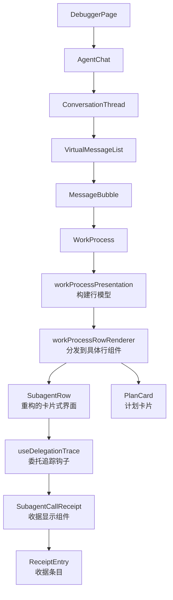
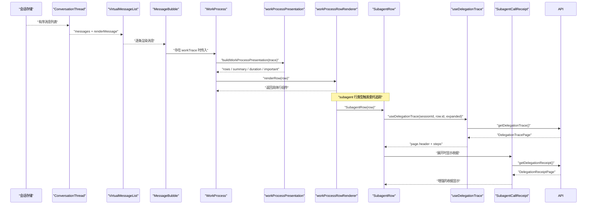
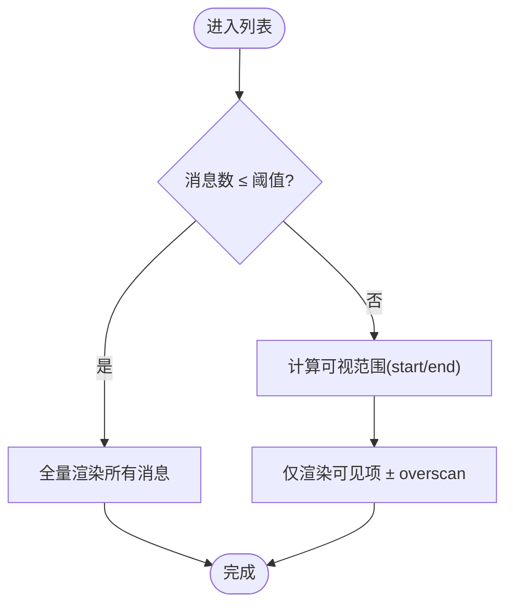
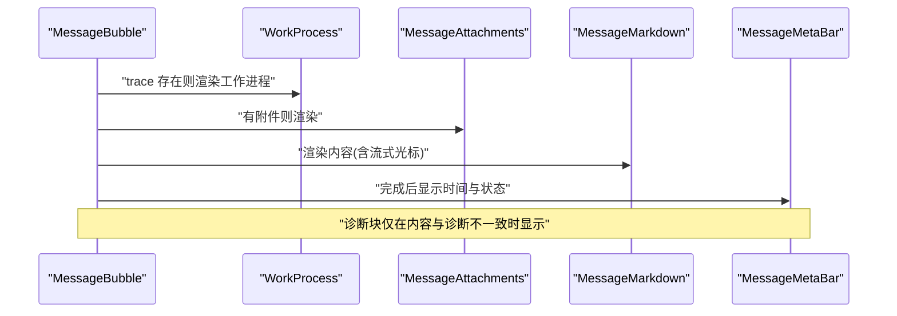
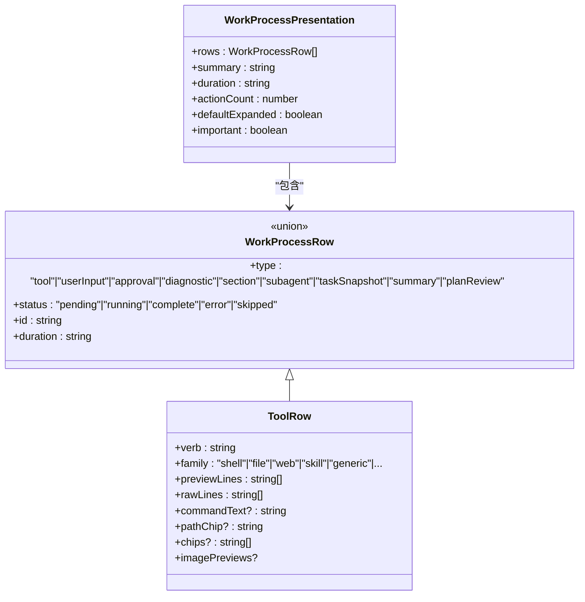
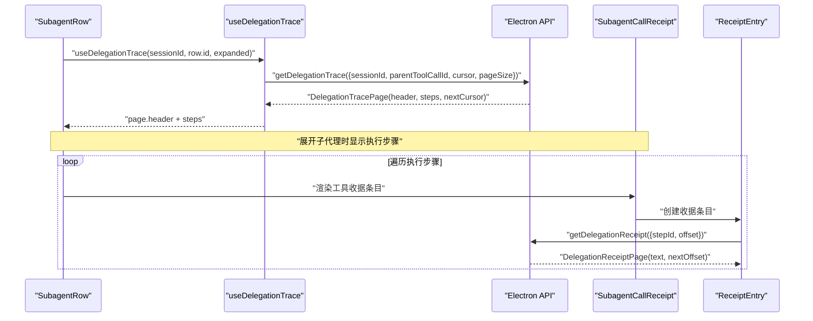
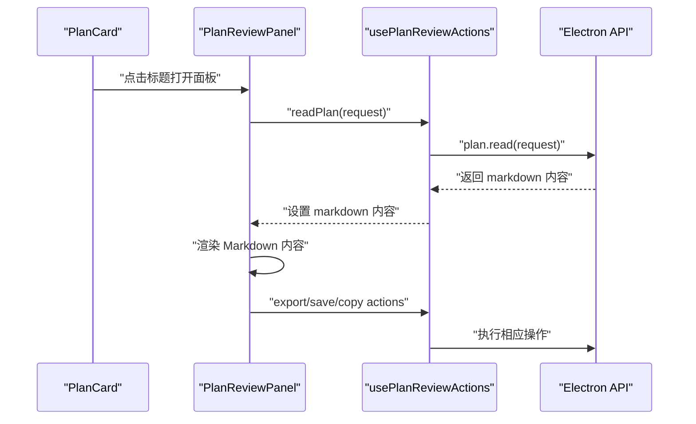
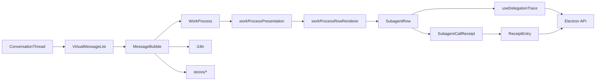

# 调试视图

<cite>
**本文引用的文件**
- [src/renderer/features/transcript/index.tsx](file://src/renderer/features/transcript/index.tsx)
- [src/renderer/features/transcript/DebuggerPage.tsx](file://src/renderer/features/transcript/DebuggerPage.tsx)
- [src/renderer/features/transcript/ConversationThread.tsx](file://src/renderer/features/transcript/ConversationThread.tsx)
- [src/renderer/features/transcript/VirtualMessageList.tsx](file://src/renderer/features/transcript/VirtualMessageList.tsx)
- [src/renderer/features/transcript/MessageBubble.tsx](file://src/renderer/features/transcript/MessageBubble.tsx)
- [src/renderer/features/transcript/WorkProcess.tsx](file://src/renderer/features/transcript/WorkProcess.tsx)
- [src/renderer/features/transcript/workProcessPresentation.ts](file://src/renderer/features/transcript/workProcessPresentation.ts)
- [src/renderer/features/transcript/workProcessTypes.ts](file://src/renderer/features/transcript/workProcessTypes.ts)
- [src/renderer/features/transcript/workProcessRowRenderer.tsx](file://src/renderer/features/transcript/workProcessRowRenderer.tsx)
- [src/renderer/features/transcript/SubagentRow.tsx](file://src/renderer/features/transcript/SubagentRow.tsx)
- [src/renderer/features/transcript/SubagentCallReceipt.tsx](file://src/renderer/features/transcript/SubagentCallReceipt.tsx)
- [src/renderer/features/transcript/useDelegationTrace.ts](file://src/renderer/features/transcript/useDelegationTrace.ts)
- [src/renderer/features/transcript/subagentPresentation.ts](file://src/renderer/features/transcript/subagentPresentation.ts)
- [src/renderer/features/transcript/work-process-subagent.css](file://src/renderer/features/transcript/work-process-subagent.css)
- [src/renderer/features/transcript/PlanCard.tsx](file://src/renderer/features/transcript/PlanCard.tsx)
- [src/renderer/features/transcript/PlanReviewPanel.tsx](file://src/renderer/features/transcript/PlanReviewPanel.tsx)
- [src/renderer/features/transcript/usePlanReviewActions.ts](file://src/renderer/features/transcript/usePlanReviewActions.ts)
- [src/renderer/features/transcript/WorkProcessRows.tsx](file://src/renderer/features/transcript/WorkProcessRows.tsx)
- [src/shared/types/delegationTrace.ts](file://src/shared/types/delegationTrace.ts)
- [src/shared/types/planReview.ts](file://src/shared/types/planReview.ts)
</cite>

## 更新摘要
**变更内容**
- SubagentRow 组件完全重构为卡片式界面，提供增强的状态指示器和改进的收据显示功能
- 新增委托追踪系统，支持动态数据加载、分页处理和实时更新
- 引入 ReceiptEntry 组件，实现工具收据的分页加载和错误处理
- 增强子代理行显示，包含任务详情、执行状态、步骤列表和原始调用信息
- 扩展工作进程可视化以支持复杂的委托执行场景

## 目录
1. [简介](#简介)
2. [项目结构](#项目结构)
3. [核心组件](#核心组件)
4. [架构总览](#架构总览)
5. [详细组件分析](#详细组件分析)
6. [依赖关系分析](#依赖关系分析)
7. [性能考虑](#性能考虑)
8. [故障排查指南](#故障排查指南)
9. [结论](#结论)
10. [附录](#附录)

## 简介
本文件面向 RDC-Agent 的"调试视图"，系统性说明对话线程展示、工作进程可视化与调试信息呈现。重点覆盖消息渲染机制、工具执行跟踪、错误诊断显示、虚拟滚动优化、消息搜索过滤与时间线导航能力，并给出自定义消息类型、调试标记与日志导出能力的实践建议，以及调试工作流最佳实践与性能调优建议。

**更新** SubagentRow 组件已完全重构为卡片式界面，集成了新的委托追踪系统，支持动态加载、增强显示、收据查看等功能；新增了 useDelegationTrace 钩子和 ReceiptEntry 组件，显著增强了子代理执行的可视化和调试能力。

## 项目结构
调试视图位于渲染层 features/transcript 目录，采用"页面容器 + 会话线程 + 虚拟列表 + 消息气泡 + 工作进程"的分层组织：
- 页面容器：DebuggerPage 提供调试页外壳，AgentChat 负责滚动吸附与空态处理。
- 会话线程：ConversationThread 从 store 获取有序消息，交由 VirtualMessageList 渲染。
- 虚拟列表：VirtualMessageList 实现短列表全量渲染、长列表虚拟滚动（基于估算高度与可视区计算）。
- 消息气泡：MessageBubble 根据角色与状态渲染用户/助手/系统消息，承载附件、编辑重写、诊断块等。
- 工作进程：WorkProcess 将 ConversationWorkTrace 投影为可折叠的行集合，支持工具调用、审批、诊断、子代理等行类型。
- **重构** 委托追踪系统：SubagentRow 使用 useDelegationTrace 钩子动态加载委托执行跟踪数据，支持分页和实时更新，采用卡片式界面设计。

**图表来源**
- [src/renderer/features/transcript/DebuggerPage.tsx:1-12](file://src/renderer/features/transcript/DebuggerPage.tsx#L1-L12)
- [src/renderer/features/transcript/index.tsx:16-60](file://src/renderer/features/transcript/index.tsx#L16-L60)
- [src/renderer/features/transcript/ConversationThread.tsx:16-43](file://src/renderer/features/transcript/ConversationThread.tsx#L16-L43)
- [src/renderer/features/transcript/VirtualMessageList.tsx:52-166](file://src/renderer/features/transcript/VirtualMessageList.tsx#L52-L166)
- [src/renderer/features/transcript/MessageBubble.tsx:183-247](file://src/renderer/features/transcript/MessageBubble.tsx#L183-L247)
- [src/renderer/features/transcript/WorkProcess.tsx:12-83](file://src/renderer/features/transcript/WorkProcess.tsx#L12-L83)
- [src/renderer/features/transcript/workProcessPresentation.ts:296-318](file://src/renderer/features/transcript/workProcessPresentation.ts#L296-L318)
- [src/renderer/features/transcript/workProcessRowRenderer.tsx:15-37](file://src/renderer/features/transcript/workProcessRowRenderer.tsx#L15-L37)
- [src/renderer/features/transcript/SubagentRow.tsx:43-102](file://src/renderer/features/transcript/SubagentRow.tsx#L43-L102)
- [src/renderer/features/transcript/useDelegationTrace.ts:7-49](file://src/renderer/features/transcript/useDelegationTrace.ts#L7-L49)

## 核心组件
- DebuggerPage：调试页入口，挂载 AgentChat。
- AgentChat：管理滚动容器、自动吸底、空态样式。
- ConversationThread：订阅有序消息，空态时显示提示，否则交给虚拟列表。
- VirtualMessageList：短列表阈值以下全量渲染；超过阈值则按估算高度计算可视范围，仅渲染可见项与 overscan。
- MessageBubble：按角色渲染用户/助手/系统消息；助手消息优先展示工作进程，再展示内容气泡与诊断块；支持附件、编辑重写、流式光标。
- WorkProcess：将 ConversationWorkTrace 投影为可折叠区域，包含摘要、步骤行、时长与动作计数；运行中或重要时默认展开。
- workProcessPresentation：把原始 trace blocks 转换为统一行模型（tool、userInput、approval、diagnostic、section、subagent、taskSnapshot、planReview 等），并计算统计与默认展开策略。
- workProcessRowRenderer：根据行类型分派到对应 UI 组件。
- **重构** SubagentRow：完全重构的子代理行组件，采用卡片式界面设计，集成委托追踪系统，支持动态加载、增强显示和收据查看。
- **新增** useDelegationTrace：委托追踪数据加载钩子，提供分页加载、实时更新和错误处理。
- **新增** SubagentCallReceipt：工具收据显示组件，支持分页加载和错误状态显示。
- **新增** ReceiptEntry：工具收据条目组件，支持分页加载工具收据内容和错误状态显示。

**章节来源**
- [src/renderer/features/transcript/DebuggerPage.tsx:1-12](file://src/renderer/features/transcript/DebuggerPage.tsx#L1-L12)
- [src/renderer/features/transcript/index.tsx:16-60](file://src/renderer/features/transcript/index.tsx#L16-L60)
- [src/renderer/features/transcript/ConversationThread.tsx:16-43](file://src/renderer/features/transcript/ConversationThread.tsx#L16-L43)
- [src/renderer/features/transcript/VirtualMessageList.tsx:52-166](file://src/renderer/features/transcript/VirtualMessageList.tsx#L52-L166)
- [src/renderer/features/transcript/MessageBubble.tsx:183-247](file://src/renderer/features/transcript/MessageBubble.tsx#L183-L247)
- [src/renderer/features/transcript/WorkProcess.tsx:12-83](file://src/renderer/features/transcript/WorkProcess.tsx#L12-L83)
- [src/renderer/features/transcript/workProcessPresentation.ts:296-318](file://src/renderer/features/transcript/workProcessPresentation.ts#L296-L318)
- [src/renderer/features/transcript/workProcessRowRenderer.tsx:15-37](file://src/renderer/features/transcript/workProcessRowRenderer.tsx#L15-L37)
- [src/renderer/features/transcript/SubagentRow.tsx:43-102](file://src/renderer/features/transcript/SubagentRow.tsx#L43-L102)
- [src/renderer/features/transcript/useDelegationTrace.ts:7-49](file://src/renderer/features/transcript/useDelegationTrace.ts#L7-L49)

## 架构总览
调试视图的数据流自下而上：store 中的会话消息驱动 ConversationThread，再由 VirtualMessageList 进行高效渲染；每条消息通过 MessageBubble 决定展示形态；助手消息若携带 workTrace，则由 WorkProcess 将其投影为结构化行，便于追踪工具执行、审批与诊断。子代理行现在通过 useDelegationTrace 钩子动态加载委托执行跟踪数据，提供更丰富的执行细节。

**图表来源**
- [src/renderer/features/transcript/ConversationThread.tsx:16-43](file://src/renderer/features/transcript/ConversationThread.tsx#L16-L43)
- [src/renderer/features/transcript/VirtualMessageList.tsx:52-166](file://src/renderer/features/transcript/VirtualMessageList.tsx#L52-L166)
- [src/renderer/features/transcript/MessageBubble.tsx:183-247](file://src/renderer/features/transcript/MessageBubble.tsx#L183-L247)
- [src/renderer/features/transcript/WorkProcess.tsx:12-83](file://src/renderer/features/transcript/WorkProcess.tsx#L12-L83)
- [src/renderer/features/transcript/workProcessPresentation.ts:296-318](file://src/renderer/features/transcript/workProcessPresentation.ts#L296-L318)
- [src/renderer/features/transcript/workProcessRowRenderer.tsx:15-37](file://src/renderer/features/transcript/workProcessRowRenderer.tsx#L15-L37)
- [src/renderer/features/transcript/SubagentRow.tsx:43-102](file://src/renderer/features/transcript/SubagentRow.tsx#L43-L102)
- [src/renderer/features/transcript/useDelegationTrace.ts:7-49](file://src/renderer/features/transcript/useDelegationTrace.ts#L7-L49)
- [src/renderer/features/transcript/SubagentCallReceipt.tsx:39-75](file://src/renderer/features/transcript/SubagentCallReceipt.tsx#L39-L75)

## 详细组件分析

### 对话线程与虚拟滚动
- 线程装配：ConversationThread 从 store 选择器获取有序消息，空态显示占位提示，非空态交给 VirtualMessageList。
- 虚拟滚动策略：
  - 短列表（≤ 阈值）全量渲染，保证布局保真。
  - 长列表使用估算高度与可视区计算 start/end，配合 overscan 减少闪烁。
  - 监听父级滚动容器与 ResizeObserver，动态更新可视范围。
- 滚动吸附：AgentChat 在消息数量或最新活动变化时平滑滚动到底部，并在用户上滚时退出吸附。

**图表来源**
- [src/renderer/features/transcript/VirtualMessageList.tsx:52-166](file://src/renderer/features/transcript/VirtualMessageList.tsx#L52-L166)
- [src/renderer/features/transcript/index.tsx:23-47](file://src/renderer/features/transcript/index.tsx#L23-L47)

**章节来源**
- [src/renderer/features/transcript/ConversationThread.tsx:16-43](file://src/renderer/features/transcript/ConversationThread.tsx#L16-L43)
- [src/renderer/features/transcript/VirtualMessageList.tsx:52-166](file://src/renderer/features/transcript/VirtualMessageList.tsx#L52-L166)
- [src/renderer/features/transcript/index.tsx:23-47](file://src/renderer/features/transcript/index.tsx#L23-L47)

### 消息渲染机制与调试信息
- 角色路由：MessageBubble 根据 role 路由到用户/助手/系统三类渲染。
- 助手消息：
  - 优先渲染工作进程（若有），随后渲染附件与内容气泡。
  - 流式状态下显示光标；完成后再显示元信息栏（时间、状态标签、操作）。
  - 当存在 diagnostic 且与正文不同，渲染独立诊断块，避免重复信息。
- 用户消息：支持编辑重写（乐观快照）、Markdown 开关、附件预览。
- 系统消息：由 SystemMessage 处理。

**图表来源**
- [src/renderer/features/transcript/MessageBubble.tsx:183-247](file://src/renderer/features/transcript/MessageBubble.tsx#L183-L247)

**章节来源**
- [src/renderer/features/transcript/MessageBubble.tsx:183-247](file://src/renderer/features/transcript/MessageBubble.tsx#L183-L247)

### 工作进程可视化与工具执行跟踪
- 投影管线：WorkProcess 调用 buildWorkProcessPresentation 将 ConversationWorkTrace.blocks 转换为统一的行模型（row），包括 tool、userInput、approval、diagnostic、section、subagent、taskSnapshot、planReview 等。
- 行渲染：workProcessRowRenderer 根据 row.type 分派到具体组件（ToolRow、UserInputRow、ApprovalRow、DiagnosticRow、SubagentRow、TaskSnapshotCard、WorkProcessSectionRow、SummaryRow、PlanCard）。
- 工具卡片：
  - 解析工具名称、目标、参数预览、结果预览，生成人类可读的摘要与详情。
  - 对 shell、代码解释器、技能读取、web 抓取等工具进行专用解包与预览。
  - 失败时提取诊断标题，避免直接暴露原始 JSON。
- 审批与询问：
  - 将 approval 状态映射为"等待审批/自动检查/已批准/已拒绝"等动词与消息。
  - ask_user 被投影为 userInput 行，展示问题与答案。
- 思考与评论：
  - 根据 reasoningState 与输出阶段，决定是否在"思考"槽位展示摘要/原始/未知类型思考。
  - commentary 作为叙述性文本，不进入思考槽位。

**图表来源**
- [src/renderer/features/transcript/workProcessTypes.ts:116-266](file://src/renderer/features/transcript/workProcessTypes.ts#L116-L266)
- [src/renderer/features/transcript/workProcessPresentation.ts:296-318](file://src/renderer/features/transcript/workProcessPresentation.ts#L296-L318)
- [src/renderer/features/transcript/workProcessRowRenderer.tsx:15-37](file://src/renderer/features/transcript/workProcessRowRenderer.tsx#L15-L37)
- [src/renderer/features/transcript/WorkProcessRows.tsx:61-68](file://src/renderer/features/transcript/WorkProcessRows.tsx#L61-L68)

**章节来源**
- [src/renderer/features/transcript/WorkProcess.tsx:12-83](file://src/renderer/features/transcript/WorkProcess.tsx#L12-L83)
- [src/renderer/features/transcript/workProcessPresentation.ts:296-318](file://src/renderer/features/transcript/workProcessPresentation.ts#L296-L318)
- [src/renderer/features/transcript/workProcessTypes.ts:116-266](file://src/renderer/features/transcript/workProcessTypes.ts#L116-L266)
- [src/renderer/features/transcript/workProcessRowRenderer.tsx:15-37](file://src/renderer/features/transcript/workProcessRowRenderer.tsx#L15-L37)
- [src/renderer/features/transcript/WorkProcessRows.tsx:61-68](file://src/renderer/features/transcript/WorkProcessRows.tsx#L61-L68)

### 重构后的子代理行与委托追踪系统
- **重构** SubagentRow 组件：完全重构的子代理行组件，采用卡片式界面设计，集成了新的委托追踪系统，提供更丰富的执行细节展示。
- **新增** useDelegationTrace 钩子：提供委托执行跟踪数据的异步加载能力，支持分页加载、实时更新和错误处理。
- **新增** SubagentCallReceipt 组件：工具收据显示组件，支持分页加载工具收据内容和错误状态显示。
- **新增** ReceiptEntry 组件：工具收据条目组件，支持分页加载工具收据内容和错误状态显示。
- 委托追踪数据流：
  - 子代理行通过 useDelegationTrace 钩子获取 DelegationTracePage 数据。
  - 支持实时监听委托执行状态变化，自动刷新界面。
  - 分页加载大量执行步骤，提升性能。
- 增强的显示功能：
  - 显示委托任务的标题、配置、模式和执行状态。
  - 展示执行过程中的工具调用、诊断消息和摘要信息。
  - 提供原始调用信息和收据的查看功能。
  - 支持工具收据的分页加载和错误处理。
- 卡片式设计特点：
  - 紧凑的卡片界面，带有边框和圆角。
  - 彩色状态点指示器，清晰显示执行状态。
  - 改进的视觉层次结构，提供更好的用户体验。
  - 响应式布局，适配不同屏幕尺寸。

**图表来源**
- [src/renderer/features/transcript/SubagentRow.tsx:43-102](file://src/renderer/features/transcript/SubagentRow.tsx#L43-L102)
- [src/renderer/features/transcript/useDelegationTrace.ts:7-49](file://src/renderer/features/transcript/useDelegationTrace.ts#L7-L49)
- [src/renderer/features/transcript/SubagentCallReceipt.tsx:39-75](file://src/renderer/features/transcript/SubagentCallReceipt.tsx#L39-L75)
- [src/renderer/features/transcript/SubagentCallReceipt.tsx:7-37](file://src/renderer/features/transcript/SubagentCallReceipt.tsx#L7-L37)

**章节来源**
- [src/renderer/features/transcript/SubagentRow.tsx:43-102](file://src/renderer/features/transcript/SubagentRow.tsx#L43-L102)
- [src/renderer/features/transcript/useDelegationTrace.ts:7-49](file://src/renderer/features/transcript/useDelegationTrace.ts#L7-L49)
- [src/renderer/features/transcript/SubagentCallReceipt.tsx:39-75](file://src/renderer/features/transcript/SubagentCallReceipt.tsx#L39-L75)
- [src/renderer/features/transcript/SubagentCallReceipt.tsx:7-37](file://src/renderer/features/transcript/SubagentCallReceipt.tsx#L7-L37)
- [src/shared/types/delegationTrace.ts:1-45](file://src/shared/types/delegationTrace.ts#L1-L45)

### 计划卡片与审查面板
- PlanCard 组件：显示计划的基本信息，包括状态标识、标题、摘要列表和前三个章节的折叠预览。
- PlanReviewPanel 组件：通过模态框提供完整的计划查看界面，支持 Markdown 渲染、导出、保存到项目和复制功能。
- 计划状态：支持 awaiting（等待审批）、approved（已批准）、rejected（已拒绝）、superseded（已替代）四种状态。
- 交互流程：用户点击计划卡片标题打开审查面板，面板中提供多种操作按钮。

**图表来源**
- [src/renderer/features/transcript/PlanCard.tsx:15-59](file://src/renderer/features/transcript/PlanCard.tsx#L15-L59)
- [src/renderer/features/transcript/PlanReviewPanel.tsx:14-126](file://src/renderer/features/transcript/PlanReviewPanel.tsx#L14-L126)
- [src/renderer/features/transcript/usePlanReviewActions.ts:5-36](file://src/renderer/features/transcript/usePlanReviewActions.ts#L5-L36)

**章节来源**
- [src/renderer/features/transcript/PlanCard.tsx:15-59](file://src/renderer/features/transcript/PlanCard.tsx#L15-L59)
- [src/renderer/features/transcript/PlanReviewPanel.tsx:14-126](file://src/renderer/features/transcript/PlanReviewPanel.tsx#L14-L126)
- [src/renderer/features/transcript/usePlanReviewActions.ts:5-36](file://src/renderer/features/transcript/usePlanReviewActions.ts#L5-L36)

### 时间线导航与交互
- 滚动吸附：AgentChat 在新增消息或活动更新时自动滚动到底部；当用户向上滚动超出阈值时停止吸附，允许自由浏览历史。
- 折叠/展开：WorkProcess 根据 status 与重要性控制默认展开；运行中或重要任务保持展开以提升可观测性。
- 元信息栏：消息底部显示时间、流式/错误/停止状态标签与操作按钮，便于快速定位与二次操作。

**章节来源**
- [src/renderer/features/transcript/index.tsx:23-47](file://src/renderer/features/transcript/index.tsx#L23-L47)
- [src/renderer/features/transcript/WorkProcess.tsx:12-83](file://src/renderer/features/transcript/WorkProcess.tsx#L12-L83)
- [src/renderer/features/transcript/MessageBubble.tsx:57-87](file://src/renderer/features/transcript/MessageBubble.tsx#L57-L87)

### 消息搜索过滤与时间线导航（扩展建议）
当前代码未内置搜索过滤组件。建议在 ConversationThread 或 AgentChat 层引入轻量搜索：
- 在 ConversationThread 外层包裹搜索输入，基于 message.content、workTrace.summary、tool 行 verb/target、planReview 标题进行匹配。
- 使用 VirtualMessageList 的 data-testid 与 data-message-role/status 属性辅助定位高亮。
- 搜索结果以锚点形式跳转到对应消息，结合滚动吸附恢复体验。

[本节为概念性建议，不直接分析具体文件]

### 自定义消息类型、调试标记与日志导出（扩展建议）
- 自定义消息类型：可在 MessageBubble 的角色路由处增加新分支，或在 WorkProcess 的行模型中添加新的 row.type，并通过 workProcessRowRenderer 分派到对应组件。
- 调试标记：利用现有 data-testid、data-message-role、data-message-status 等属性，结合自动化测试或调试面板进行定位。
- 日志导出：建议在 AgentChat 或 ConversationThread 层集成导出功能，将 orderedMessages 与 workTrace 序列化为 JSON/CSV，并提供下载链接。

[本节为概念性建议，不直接分析具体文件]

## 依赖关系分析
- 组件耦合：
  - ConversationThread 依赖 store 的选择器与 VirtualMessageList。
  - VirtualMessageList 依赖 useDynStyle 与滚动容器 DOM API。
  - MessageBubble 依赖 Markdown、附件、工作进程与设置/布局/项目相关 store。
  - WorkProcess 依赖 workProcessPresentation 与行渲染器。
  - **重构** SubagentRow 依赖 useDelegationTrace 钩子和 Electron API。
  - **新增** useDelegationTrace 依赖 Electron API 事件监听。
  - **新增** SubagentCallReceipt 依赖 Electron API 和 i18n。
  - **新增** ReceiptEntry 依赖 Electron API 和 i18n。
- 外部依赖：
  - i18n 用于文案国际化。
  - ActiveSignalText 用于运行中标识。
  - 共享类型来自 @shared/types/conversation 与 @shared/types/reasoning。
  - **新增** @shared/types/delegationTrace 用于委托追踪类型定义。

**图表来源**
- [src/renderer/features/transcript/ConversationThread.tsx:16-43](file://src/renderer/features/transcript/ConversationThread.tsx#L16-L43)
- [src/renderer/features/transcript/VirtualMessageList.tsx:52-166](file://src/renderer/features/transcript/VirtualMessageList.tsx#L52-L166)
- [src/renderer/features/transcript/MessageBubble.tsx:183-247](file://src/renderer/features/transcript/MessageBubble.tsx#L183-L247)
- [src/renderer/features/transcript/WorkProcess.tsx:12-83](file://src/renderer/features/transcript/WorkProcess.tsx#L12-L83)
- [src/renderer/features/transcript/workProcessPresentation.ts:296-318](file://src/renderer/features/transcript/workProcessPresentation.ts#L296-L318)
- [src/renderer/features/transcript/workProcessRowRenderer.tsx:15-37](file://src/renderer/features/transcript/workProcessRowRenderer.tsx#L15-L37)
- [src/renderer/features/transcript/SubagentRow.tsx:43-102](file://src/renderer/features/transcript/SubagentRow.tsx#L43-L102)
- [src/renderer/features/transcript/useDelegationTrace.ts:7-49](file://src/renderer/features/transcript/useDelegationTrace.ts#L7-L49)
- [src/renderer/features/transcript/SubagentCallReceipt.tsx:39-75](file://src/renderer/features/transcript/SubagentCallReceipt.tsx#L39-L75)

**章节来源**
- [src/renderer/features/transcript/ConversationThread.tsx:16-43](file://src/renderer/features/transcript/ConversationThread.tsx#L16-L43)
- [src/renderer/features/transcript/VirtualMessageList.tsx:52-166](file://src/renderer/features/transcript/VirtualMessageList.tsx#L52-L166)
- [src/renderer/features/transcript/MessageBubble.tsx:183-247](file://src/renderer/features/transcript/MessageBubble.tsx#L183-L247)
- [src/renderer/features/transcript/WorkProcess.tsx:12-83](file://src/renderer/features/transcript/WorkProcess.tsx#L12-L83)
- [src/renderer/features/transcript/workProcessPresentation.ts:296-318](file://src/renderer/features/transcript/workProcessPresentation.ts#L296-L318)
- [src/renderer/features/transcript/workProcessRowRenderer.tsx:15-37](file://src/renderer/features/transcript/workProcessRowRenderer.tsx#L15-L37)
- [src/renderer/features/transcript/SubagentRow.tsx:43-102](file://src/renderer/features/transcript/SubagentRow.tsx#L43-L102)
- [src/renderer/features/transcript/useDelegationTrace.ts:7-49](file://src/renderer/features/transcript/useDelegationTrace.ts#L7-L49)

## 性能考虑
- 虚拟滚动：
  - 短列表阈值以下全量渲染，避免不必要的开销。
  - 长列表使用估算高度与可视范围裁剪，显著降低 DOM 节点数量。
  - 使用 ResizeObserver 与被动滚动监听，减少重排抖动。
- 渲染优化：
  - MessageBubble 使用 React.memo 包裹，减少不必要重渲染。
  - WorkProcess 使用 useMemo 缓存 presentation 与行渲染器。
- 滚动体验：
  - 智能吸附阈值避免频繁滚动跳动。
  - 流式内容仅追加光标，不触发整段重绘。
- **新增** 委托追踪性能优化：
  - useDelegationTrace 使用分页加载，初始只加载少量步骤，按需加载更多。
  - 实时监听委托执行状态变化，使用防抖机制避免频繁更新。
  - SubagentCallReceipt 和 ReceiptEntry 组件支持收据内容的分页加载，避免一次性加载大量数据。
  - 子代理行在未展开时不加载委托追踪数据，减少内存占用。
  - 卡片式设计减少DOM复杂度，提升渲染性能。

**章节来源**
- [src/renderer/features/transcript/VirtualMessageList.tsx:52-166](file://src/renderer/features/transcript/VirtualMessageList.tsx#L52-L166)
- [src/renderer/features/transcript/MessageBubble.tsx:237-247](file://src/renderer/features/transcript/MessageBubble.tsx#L237-L247)
- [src/renderer/features/transcript/WorkProcess.tsx:12-23](file://src/renderer/features/transcript/WorkProcess.tsx#L12-L23)
- [src/renderer/features/transcript/index.tsx:23-47](file://src/renderer/features/transcript/index.tsx#L23-L47)
- [src/renderer/features/transcript/useDelegationTrace.ts:7-49](file://src/renderer/features/transcript/useDelegationTrace.ts#L7-L49)

## 故障排查指南
- 工作进程未展开：
  - 检查 trace.status 与 presentation.important；运行中或重要任务应默认展开。
- 工具行无预览：
  - 确认 resultPreview/argsPreview 是否被正确解包；shell/代码解释器等专用路径需满足二进制检测与命令提取条件。
- 诊断重复显示：
  - 当 diagnostic.userMessage 与 message.content 一致时，不再重复渲染诊断块；如需单独显示，请确保二者不一致。
- 审批流程卡住：
  - 检查 approval.status 与 isToolApprovalRejected 逻辑；被拒绝或取消会映射为 error/skipped 状态。
- 虚拟滚动错位：
  - 确认 estimateHeight 与实际内容高度接近；过大/过小会导致可视范围计算偏差。
- **新增** 子代理行相关问题：
  - 检查 useDelegationTrace 是否正确获取委托追踪数据，确认 sessionId 和 parentToolCallId 参数。
  - 验证 Electron API 的 conversation.getDelegationTrace 方法是否可用。
  - 检查委托追踪数据格式是否符合 DelegationTracePage 类型定义。
  - 确认 SubagentCallReceipt 组件的收据加载逻辑，检查 receiptRef 和 offset 参数。
  - 验证委托执行状态映射，确保 running/complete/error 状态正确显示。
  - 检查实时监听机制，确认 onDelegationTraceChanged 事件是否正常触发。
  - 检查卡片式样式的CSS类名是否正确应用。
  - 验证状态指示器的颜色映射是否正确。

**章节来源**
- [src/renderer/features/transcript/WorkProcess.tsx:12-83](file://src/renderer/features/transcript/WorkProcess.tsx#L12-L83)
- [src/renderer/features/transcript/workProcessPresentation.ts:349-404](file://src/renderer/features/transcript/workProcessPresentation.ts#L349-L404)
- [src/renderer/features/transcript/MessageBubble.tsx:183-247](file://src/renderer/features/transcript/MessageBubble.tsx#L183-L247)
- [src/renderer/features/transcript/VirtualMessageList.tsx:52-166](file://src/renderer/features/transcript/VirtualMessageList.tsx#L52-L166)
- [src/renderer/features/transcript/SubagentRow.tsx:43-102](file://src/renderer/features/transcript/SubagentRow.tsx#L43-L102)
- [src/renderer/features/transcript/useDelegationTrace.ts:7-49](file://src/renderer/features/transcript/useDelegationTrace.ts#L7-L49)
- [src/renderer/features/transcript/SubagentCallReceipt.tsx:39-75](file://src/renderer/features/transcript/SubagentCallReceipt.tsx#L39-L75)

## 结论
调试视图通过清晰的层次化组件与强大的工作进程投影机制，实现了对话线程的高效渲染与深度可观测性。虚拟滚动保障大列表性能，工作进程行模型统一了工具执行、审批与诊断的呈现方式。**重构后的 SubagentRow 组件和新增的委托追踪系统**显著增强了子代理执行的可视化和调试能力，提供了更丰富的执行细节展示、动态数据加载、实时状态更新和卡片式界面设计。结合搜索过滤、自定义消息类型与日志导出等扩展能力，可进一步提升调试效率与可维护性。

## 附录
- 关键类型参考：WorkProcessRow、WorkProcessToolFamily、WorkProcessIconKey 等定义于 workProcessTypes.ts。
- 工具族与图标映射：通过 workProcessToolCatalog 与 getToolDisplay 统一管理。
- 格式化与归一化：normalizeWorkProcessText、formatDurationMs 等工具函数用于文本与时长展示。
- **新增** 委托追踪类型：DelegationTraceStep、DelegationTraceHeader、DelegationTracePage、DelegationReceiptPage 等定义于 @shared/types/delegationTrace.ts。
- **新增** 委托追踪功能：支持工具收据分页加载、实时状态监听和执行步骤可视化。
- **新增** 卡片式设计：work-process-subagent.css 定义了卡片式界面的样式，包括边框、圆角、状态指示器等。

**章节来源**
- [src/renderer/features/transcript/workProcessTypes.ts:1-102](file://src/renderer/features/transcript/workProcessTypes.ts#L1-L102)
- [src/renderer/features/transcript/workProcessPresentation.ts:1-100](file://src/renderer/features/transcript/workProcessPresentation.ts#L1-L100)
- [src/shared/types/delegationTrace.ts:1-45](file://src/shared/types/delegationTrace.ts#L1-L45)
- [src/renderer/features/transcript/work-process-subagent.css:1-129](file://src/renderer/features/transcript/work-process-subagent.css#L1-L129)