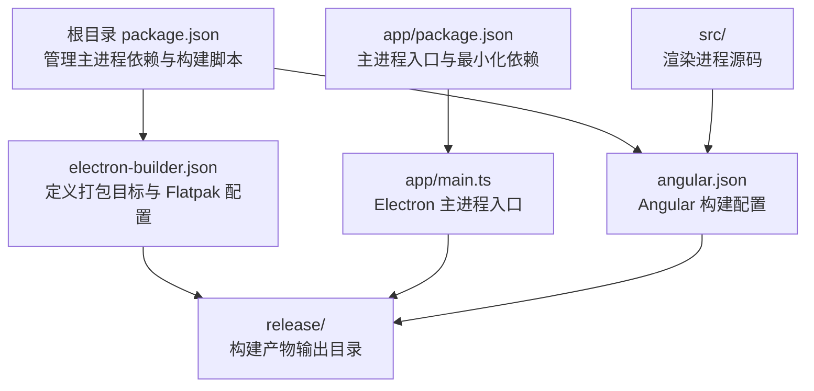
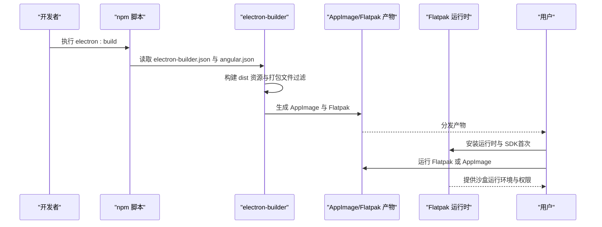
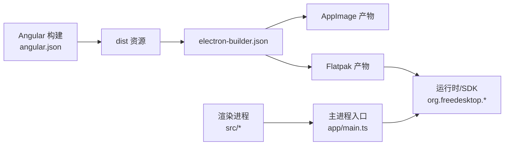

# Linux 平台部署

<cite>
**本文档引用的文件**
- [electron-builder.json](file://electron-builder.json)
- [package.json](file://package.json)
- [README.md](file://README.md)
- [HOW_TO.md](file://HOW_TO.md)
- [app/main.ts](file://app/main.ts)
- [src/app/core/services/electron/electron.service.ts](file://src/app/core/services/electron/electron.service.ts)
- [src/app/app.component.ts](file://src/app/app.component.ts)
- [angular.json](file://angular.json)
- [.github/workflows/ubuntu.yml](file://.github/workflows/ubuntu.yml)
- [e2e/main.spec.ts](file://e2e/main.spec.ts)
</cite>

## 目录
1. [简介](#简介)
2. [项目结构](#项目结构)
3. [核心组件](#核心组件)
4. [架构总览](#架构总览)
5. [详细组件分析](#详细组件分析)
6. [依赖关系分析](#依赖关系分析)
7. [性能考虑](#性能考虑)
8. [故障排除指南](#故障排除指南)
9. [结论](#结论)
10. [附录](#附录)

## 简介
本文件面向在 Linux 平台上部署基于 Electron 的 Angular 应用，重点覆盖以下内容：
- 使用 electron-builder 同时构建 AppImage 和 Flatpak 的完整流程与配置要点
- Linux 平台相关配置参数详解：图标路径、目标平台配置、Flatpak 特有参数
- Flatpak 沙盒机制、运行时依赖与权限配置（finishArgs）说明
- 不同发行版兼容性测试方法与依赖检查清单
- 常见部署问题排查：应用无法启动、权限问题、桌面环境集成问题

## 项目结构
该项目采用“双 package.json”结构，优化最终打包体积并保持 Angular ng add 能力：
- 根目录 package.json：管理 Electron 主进程依赖与构建脚本
- app/package.json：定义 Electron 主进程入口与最小化依赖
- src：渲染进程（Angular）资源与源码
- 构建产物输出至 release/ 目录

图表来源
- [package.json:1-108](file://package.json#L1-L108)
- [electron-builder.json:1-61](file://electron-builder.json#L1-L61)
- [angular.json:1-188](file://angular.json#L1-L188)
- [app/main.ts:1-94](file://app/main.ts#L1-L94)

章节来源
- [package.json:1-108](file://package.json#L1-L108)
- [electron-builder.json:1-61](file://electron-builder.json#L1-L61)
- [angular.json:1-188](file://angular.json#L1-L188)

## 核心组件
- electron-builder 配置：定义 Linux 目标（AppImage、Flatpak）、图标路径、打包文件过滤规则、输出目录等
- Flatpak 配置：指定运行时、SDK、基础应用、分类以及沙盒权限（finishArgs）
- 构建脚本：通过 npm run electron:build 触发多平台构建
- 主进程入口：负责窗口创建、开发/生产模式加载策略、IPC 交互

章节来源
- [electron-builder.json:1-61](file://electron-builder.json#L1-L61)
- [package.json:27-47](file://package.json#L27-L47)
- [app/main.ts:1-94](file://app/main.ts#L1-L94)

## 架构总览
下图展示从构建到运行的关键流程：Angular 构建 → Electron 打包 → 生成 AppImage/Flatpak → 运行时依赖与权限控制。

图表来源
- [package.json:27-47](file://package.json#L27-L47)
- [electron-builder.json:1-61](file://electron-builder.json#L1-L61)
- [angular.json:25-82](file://angular.json#L25-L82)

## 详细组件分析

### electron-builder 配置（Linux 目标与 Flatpak）
- 输出目录：release/
- 文件过滤：排除 TypeScript 源、映射文件、根目录 package.json，包含 dist 资源
- Linux 目标：
  - AppImage：直接生成可执行镜像
  - Flatpak：指定架构为 x64
- 图标路径：指向 dist/browser/assets/icons
- Flatpak 特有配置：
  - 基础应用与版本：org.electronjs.Electron2.BaseApp//25.08
  - 运行时与 SDK：org.freedesktop.Platform//25.08 与 org.freedesktop.Sdk//25.08
  - 分类：Utility
  - finishArgs 权限：Wayland/X11 显示、IPC 共享、GPU 设备访问、音频、Home 文件系统、网络、通知服务通信

章节来源
- [electron-builder.json:1-61](file://electron-builder.json#L1-L61)

### Flatpak 沙盒机制与权限（finishArgs）
- 显示系统：--socket=wayland、--socket=x11、--share=ipc
- GPU 访问：--device=dri
- 音频：--socket=pulseaudio
- 文件系统：--filesystem=home
- 网络：--share=network
- 通知：--talk-name=org.freedesktop.Notifications

章节来源
- [electron-builder.json:42-59](file://electron-builder.json#L42-L59)

### 构建脚本与命令
- electron:build：先构建 Web 资产，再调用 electron-builder 生成多平台产物
- electron:local：本地联调，结合 Angular 开发服务器热重载
- electron:serve：开发模式组合启动

章节来源
- [package.json:27-47](file://package.json#L27-L47)

### 主进程入口与窗口加载策略
- 开发模式：加载 http://localhost:4200，并启用调试与重载
- 生产模式：优先使用打包后的 dist/browser/index.html；若不存在则回退到本地路径
- IPC：提供应用版本查询接口，便于渲染进程获取版本信息

章节来源
- [app/main.ts:1-94](file://app/main.ts#L1-L94)
- [src/app/core/services/electron/electron.service.ts:1-57](file://src/app/core/services/electron/electron.service.ts#L1-L57)
- [src/app/app.component.ts:1-35](file://src/app/app.component.ts#L1-L35)

### Angular 构建配置
- 输出目录：dist
- 资源：assets、favicon、SCSS 样式
- 构建目标：浏览器端与 Electron 渲染进程通用
- 测试与覆盖率：集成 Vitest 与 Playwright

章节来源
- [angular.json:25-82](file://angular.json#L25-L82)

### CI/CD（Ubuntu 工作流）
- 使用 Ubuntu 22.04 Runner
- 缓存 Node 模块与 Electron 缓存
- 固定 Node 版本矩阵（24）

章节来源
- [.github/workflows/ubuntu.yml:1-52](file://.github/workflows/ubuntu.yml#L1-L52)

## 依赖关系分析
- 构建链路：Angular 构建 → electron-builder 读取配置 → 生成 AppImage/Flatpak
- 运行时链路：Flatpak 安装运行时与 SDK → 运行应用 → 通过 finishArgs 权限访问系统资源
- 主进程与渲染进程：通过 IPC 通信，渲染进程条件加载 Electron API

图表来源
- [angular.json:25-82](file://angular.json#L25-L82)
- [electron-builder.json:1-61](file://electron-builder.json#L1-L61)
- [app/main.ts:1-94](file://app/main.ts#L1-L94)

章节来源
- [angular.json:25-82](file://angular.json#L25-L82)
- [electron-builder.json:1-61](file://electron-builder.json#L1-L61)
- [app/main.ts:1-94](file://app/main.ts#L1-L94)

## 性能考虑
- ASAR 打包：开启压缩与打包以减小体积
- 文件过滤：仅包含 dist 与必要资源，避免冗余文件进入包体
- 缓存策略：CI 中缓存 Node 与 Electron 缓存，缩短构建时间
- 运行时选择：根据目标发行版选择合适的运行时版本，平衡兼容性与体积

章节来源
- [electron-builder.json:1-61](file://electron-builder.json#L1-L61)
- [.github/workflows/ubuntu.yml:30-47](file://.github/workflows/ubuntu.yml#L30-L47)

## 故障排除指南

### 应用无法启动
- 检查主进程入口是否正确加载：开发模式需确保 Angular 开发服务器可用；生产模式需确认 dist/browser/index.html 存在
- 查看主进程日志与错误处理：定位窗口创建与资源加载失败原因
- IPC 接口验证：确认渲染进程已正确检测 Electron 环境并调用 IPC

章节来源
- [app/main.ts:27-51](file://app/main.ts#L27-L51)
- [src/app/core/services/electron/electron.service.ts:18-50](file://src/app/core/services/electron/electron.service.ts#L18-L50)

### Flatpak 权限问题
- 显示/图形：确认已授予 Wayland/X11、IPC、GPU 设备访问权限
- 音频：确认 PulseAudio socket 权限
- 文件系统：如需访问用户目录，确认 home 文件系统权限
- 网络：确认网络共享权限
- 通知：确认通知服务通信权限

章节来源
- [electron-builder.json:42-59](file://electron-builder.json#L42-L59)

### 桌面环境集成问题
- 桌面文件与菜单：确认应用图标与名称在 Linux 桌面环境中可见
- 快捷方式：建议通过 AppImage 直接运行或通过 Flatpak 安装后在应用商店启动
- 多显示器/缩放：主进程窗口尺寸初始化逻辑需适配不同分辨率

章节来源
- [electron-builder.json:32-41](file://electron-builder.json#L32-L41)
- [app/main.ts:11-25](file://app/main.ts#L11-L25)

### E2E 测试与本地验证
- 使用 Playwright/Electron 组合进行端到端测试，验证窗口状态、标题等关键行为
- 在 CI 中使用 Ubuntu Runner，确保构建与运行环境一致

章节来源
- [e2e/main.spec.ts:1-60](file://e2e/main.spec.ts#L1-L60)
- [.github/workflows/ubuntu.yml:1-52](file://.github/workflows/ubuntu.yml#L1-L52)

## 结论
本项目通过 electron-builder 实现了对 Linux 平台的原生支持，同时提供 AppImage 与 Flatpak 两种分发方式。Flatpak 配置明确了运行时依赖与沙盒权限，满足现代 Linux 发行版的运行要求。配合 Angular 构建与 CI 缓存策略，可实现高效稳定的持续交付。

## 附录

### Linux 平台构建与分发步骤
- 安装 Flatpak 与 flatpak-builder
- 添加 Flathub 远程仓库
- 安装所需运行时与 SDK：org.freedesktop.Platform//25.08、org.freedesktop.Sdk//25.08、org.electronjs.Electron2.BaseApp//25.08
- 执行 npm run electron:build 生成 AppImage 与 Flatpak

章节来源
- [README.md:115-132](file://README.md#L115-L132)

### Linux 发行版兼容性测试清单
- Ubuntu 22.04（CI 使用）：验证构建与运行
- Fedora/opensuse：安装对应运行时后运行 Flatpak
- Arch/Manjaro：验证 AppImage 可执行性
- 桌面环境：GNOME/KDE/xfce 下的图标、菜单项、通知显示

章节来源
- [.github/workflows/ubuntu.yml:25-25](file://.github/workflows/ubuntu.yml#L25-L25)