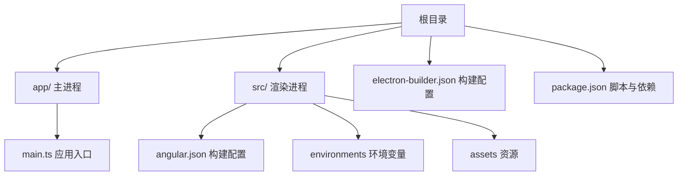
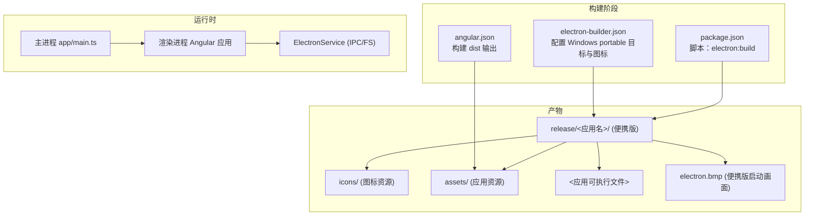
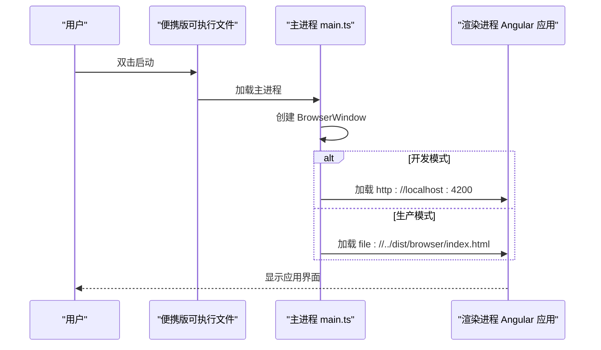
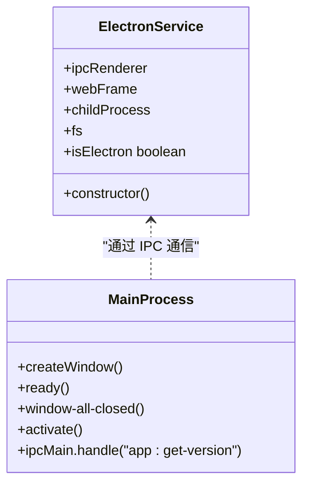
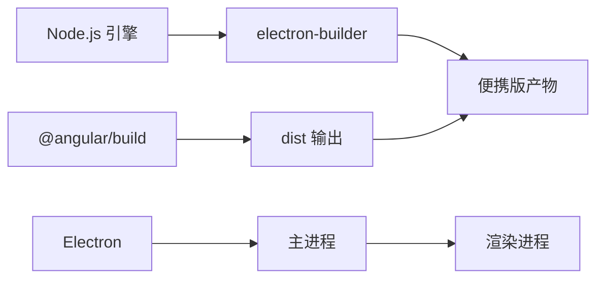

# Windows 平台部署

<cite>
**本文档引用的文件**
- [electron-builder.json](file://electron-builder.json)
- [package.json](file://package.json)
- [README.md](file://README.md)
- [app/main.ts](file://app/main.ts)
- [src/app/core/services/electron/electron.service.ts](file://src/app/core/services/electron/electron.service.ts)
- [angular.json](file://angular.json)
- [src/environments/environment.ts](file://src/environments/environment.ts)
- [src/environments/environment.prod.ts](file://src/environments/environment.prod.ts)
- [src/environments/environment.dev.ts](file://src/environments/environment.dev.ts)
- [e2e/main.spec.ts](file://e2e/main.spec.ts)
</cite>

## 目录
1. [简介](#简介)
2. [项目结构](#项目结构)
3. [核心组件](#核心组件)
4. [架构概览](#架构概览)
5. [详细组件分析](#详细组件分析)
6. [依赖分析](#依赖分析)
7. [性能考虑](#性能考虑)
8. [故障排除指南](#故障排除指南)
9. [结论](#结论)
10. [附录](#附录)

## 简介
本文件面向在 Windows 平台上部署便携版（portable）应用的工程师与运维人员，基于仓库中的配置与实现，系统阐述从构建到部署的完整流程。重点覆盖以下方面：
- Windows 配置参数：图标路径、目标平台、便携版特有 splashImage 配置
- 便携版应用启动机制、文件组织结构与运行时要求
- Windows 平台依赖检查清单、系统兼容性与安全软件兼容性注意事项
- 常见部署问题排查与性能优化建议

## 项目结构
该工程采用 Electron Builder 的双 package.json 结构，将主进程（app/main.ts）与渲染进程（src）分离，便于优化最终打包体积并保持 Angular CLI 的可用性。

图表来源
- [package.json:1-108](file://package.json#L1-L108)
- [electron-builder.json:1-61](file://electron-builder.json#L1-L61)
- [angular.json:1-188](file://angular.json#L1-L188)

章节来源
- [README.md:63-81](file://README.md#L63-L81)
- [package.json:1-108](file://package.json#L1-L108)

## 核心组件
- 构建配置（electron-builder.json）
  - 启用 asar 打包，输出至 release/ 目录
  - Windows 目标为 portable，图标路径指向 dist/browser/assets/icons
  - 便携版特有 splashImage 指向 dist/browser/assets/icons/electron.bmp
- 应用入口（app/main.ts）
  - 主进程负责创建 BrowserWindow，开发模式加载本地 Angular 开发服务器，生产模式加载打包后的静态资源
  - 提供版本查询 IPC 接口
- 渲染进程（src）
  - Angular 应用，通过 ElectronService 在渲染进程中访问 Electron/Node 能力
  - 环境配置分为开发、生产与默认环境

章节来源
- [electron-builder.json:1-61](file://electron-builder.json#L1-L61)
- [app/main.ts:1-94](file://app/main.ts#L1-L94)
- [src/app/core/services/electron/electron.service.ts:1-57](file://src/app/core/services/electron/electron.service.ts#L1-L57)
- [src/environments/environment.ts:1-5](file://src/environments/environment.ts#L1-L5)

## 架构概览
下图展示 Windows 便携版应用的构建与运行时交互：

图表来源
- [electron-builder.json:17-25](file://electron-builder.json#L17-L25)
- [package.json:41-41](file://package.json#L41-L41)
- [angular.json:25-46](file://angular.json#L25-L46)
- [app/main.ts:39-51](file://app/main.ts#L39-L51)

## 详细组件分析

### Windows 便携版构建配置
- 目标平台与输出
  - Windows 目标为 portable，确保生成便携式可执行文件，无需安装即可运行
  - 输出目录为 release/，包含便携版所需的所有文件
- 图标与启动画面
  - 图标路径设置为 dist/browser/assets/icons，用于 Windows 任务栏、文件管理器等显示
  - 便携版特有 splashImage 设置为 dist/browser/assets/icons/electron.bmp，作为启动时的欢迎画面
- 文件包含规则
  - 默认打包所有文件，排除 TypeScript 源码与 sourcemap
  - 显式包含 dist 目录内容，确保 Angular 构建产物被正确打包

章节来源
- [electron-builder.json:17-25](file://electron-builder.json#L17-L25)
- [electron-builder.json:6-16](file://electron-builder.json#L6-L16)

### 应用启动机制与文件组织
- 启动流程
  - 主进程在 ready 事件后延时创建窗口，避免透明窗口导致的黑屏问题
  - 开发模式：加载本地 http://localhost:4200
  - 生产模式：优先加载 ../dist/browser/index.html，回退到 ./browser/index.html
- 文件组织结构（便携版）
  - 可执行文件位于 release/<应用名>/
  - 图标与资源位于 icons/ 与 assets/ 子目录
  - 启动画面 electron.bmp 位于 icons/ 下
- 运行时要求
  - Node.js 版本需满足 engines 要求（>= 22.12.0 或 >= 24.0.0）
  - TypeScript 版本要求（>= 5.8.0 且 < 6.0.0）

图表来源
- [app/main.ts:9-51](file://app/main.ts#L9-L51)
- [app/main.ts:64-88](file://app/main.ts#L64-L88)

章节来源
- [app/main.ts:1-94](file://app/main.ts#L1-L94)
- [package.json:96-99](file://package.json#L96-L99)

### 渲染进程与 IPC 通信
- ElectronService 提供条件化导入能力，仅在 Electron 环境中加载 Node/Electron 模块
- 支持通过 ipcRenderer.invoke 与主进程通信，如获取应用版本
- 环境配置通过 environment.ts 切换开发/生产模式

图表来源
- [src/app/core/services/electron/electron.service.ts:12-56](file://src/app/core/services/electron/electron.service.ts#L12-L56)
- [app/main.ts:65-88](file://app/main.ts#L65-L88)

章节来源
- [src/app/core/services/electron/electron.service.ts:1-57](file://src/app/core/services/electron/electron.service.ts#L1-L57)
- [src/environments/environment.ts:1-5](file://src/environments/environment.ts#L1-L5)
- [src/environments/environment.prod.ts:1-5](file://src/environments/environment.prod.ts#L1-L5)
- [src/environments/environment.dev.ts:1-5](file://src/environments/environment.dev.ts#L1-L5)

### 构建与测试流程
- 构建命令
  - npm run web:prod：构建 Angular 生产版本，输出至 dist
  - npm run electron:build：调用 electron-builder 执行打包，生成 Windows portable 产物
- 测试
  - E2E 使用 Playwright，通过 _electron.launch 启动应用进行验证

章节来源
- [package.json:32-41](file://package.json#L32-L41)
- [e2e/main.spec.ts:10-16](file://e2e/main.spec.ts#L10-L16)

## 依赖分析
- 构建工具链
  - electron-builder：统一跨平台打包，支持 portable 目标
  - Angular 构建器：@angular/build:application 生成 dist
- 运行时依赖
  - Electron：主进程与渲染进程运行时
  - Node.js：满足 engines 要求
- 开发与测试
  - Playwright：端到端测试
  - Vitest：单元测试

图表来源
- [package.json:82-94](file://package.json#L82-L94)
- [angular.json:25-46](file://angular.json#L25-L46)

章节来源
- [package.json:82-94](file://package.json#L82-L94)
- [angular.json:25-46](file://angular.json#L25-L46)

## 性能考虑
- 打包优化
  - 启用 asar 压缩，减少文件数量，提升加载效率
  - 仅包含 dist 目录与必要资源，避免冗余文件进入最终包
- 启动性能
  - 主进程 ready 事件后延时创建窗口，避免透明窗口黑屏问题
  - 生产模式直接加载本地静态资源，减少网络请求
- 资源管理
  - 将图标与启动画面集中于 icons/ 与 assets/，便于便携版分发与缓存

章节来源
- [electron-builder.json:2-2](file://electron-builder.json#L2-L2)
- [electron-builder.json:6-16](file://electron-builder.json#L6-L16)
- [app/main.ts:71-71](file://app/main.ts#L71-L71)
- [app/main.ts:39-51](file://app/main.ts#L39-L51)

## 故障排除指南
- 便携版无法启动或黑屏
  - 检查主进程是否在 ready 事件后创建窗口
  - 确认生产模式下 ../dist/browser/index.html 是否存在
- 启动画面未显示
  - 确认 splashImage 路径与实际文件一致
  - 检查便携版目录结构是否正确
- 图标不显示
  - 确认 dist/browser/assets/icons 下包含有效图标文件
  - 检查 Windows 目标配置中的 icon 路径
- 版本信息获取失败
  - 确认主进程已注册 "app:get-version" IPC 处理函数
- 环境变量与构建配置
  - 确保环境切换（开发/生产）与构建配置一致
- 安全软件干扰
  - 便携版首次运行可能被误报，建议添加白名单或临时放行
  - 确保解压目录权限允许读取与执行

章节来源
- [app/main.ts:65-88](file://app/main.ts#L65-L88)
- [electron-builder.json:23-25](file://electron-builder.json#L23-L25)
- [electron-builder.json:17-22](file://electron-builder.json#L17-L22)
- [src/environments/environment.ts:1-5](file://src/environments/environment.ts#L1-L5)

## 结论
本项目通过 electron-builder 的 portable 目标与合理的文件组织，实现了 Windows 平台的便携式部署。结合 asar 打包、清晰的图标与启动画面配置以及主进程的启动策略，能够在不同环境中稳定运行。建议在部署前完成依赖检查与安全软件配置，并遵循本文提供的排障与优化建议以获得最佳体验。

## 附录
- 快速部署步骤
  - 安装依赖：npm install
  - 构建 Web：npm run web:prod
  - 打包便携版：npm run electron:build
  - 产物位置：release/<应用名>/
- 关键配置参考
  - Windows 目标与图标：[electron-builder.json:17-22](file://electron-builder.json#L17-L22)
  - 便携版启动画面：[electron-builder.json:24-24](file://electron-builder.json#L24-L24)
  - 构建脚本：[package.json:41-41](file://package.json#L41-L41)
  - 主进程入口：[app/main.ts:1-94](file://app/main.ts#L1-L94)