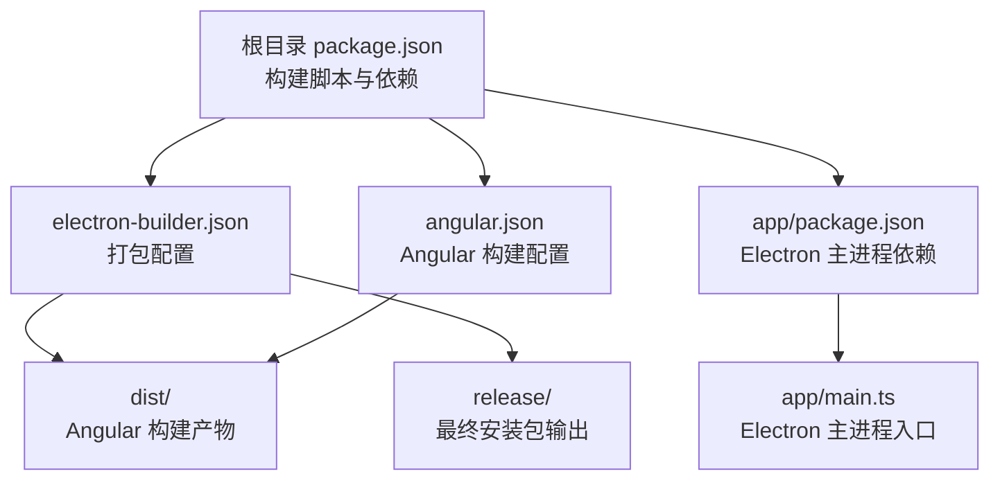
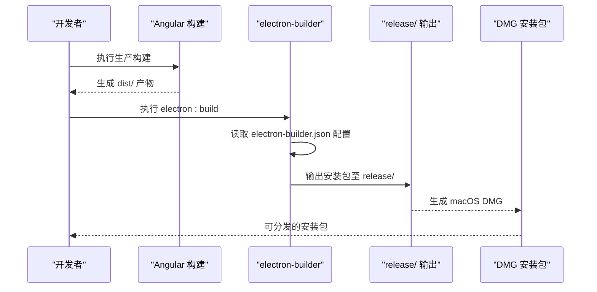
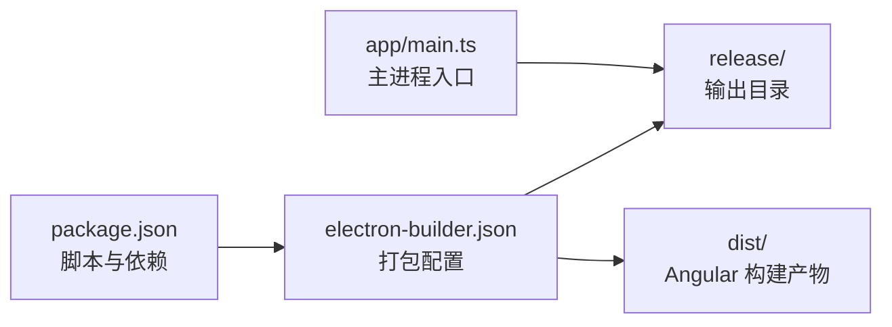

# macOS 平台部署

<cite>
**本文引用的文件**
- [electron-builder.json](file://electron-builder.json)
- [package.json](file://package.json)
- [app/main.ts](file://app/main.ts)
- [angular.json](file://angular.json)
- [tsconfig.json](file://tsconfig.json)
- [src/environments/environment.ts](file://src/environments/environment.ts)
- [src/environments/environment.prod.ts](file://src/environments/environment.prod.ts)
- [src/app/core/services/electron/electron.service.ts](file://src/app/core/services/electron/electron.service.ts)
- [README.md](file://README.md)
</cite>

## 目录
1. [简介](#简介)
2. [项目结构](#项目结构)
3. [核心组件](#核心组件)
4. [架构总览](#架构总览)
5. [详细组件分析](#详细组件分析)
6. [依赖关系分析](#依赖关系分析)
7. [性能考虑](#性能考虑)
8. [故障排除指南](#故障排除指南)
9. [结论](#结论)
10. [附录](#附录)

## 简介
本文件面向在 macOS 平台上部署基于 Electron 的桌面应用，聚焦于 DMG 安装包的制作与分发、macOS 配置参数（图标、目标平台、打包目录等）、代码签名与公证（notarization）要求、沙盒机制与权限配置、Gatekeeper 兼容性，以及常见部署问题的排查方法。本文所有技术细节均来源于仓库中的实际配置与源码。

## 项目结构
该仓库采用 Electron Builder 的“双 package.json”结构：根目录的 package.json 管理开发工具与构建脚本，app/package.json 管理 Electron 主进程依赖。构建产物通过 electron-builder 输出到 release/ 目录，默认目标为 dmg（macOS），同时支持其他平台目标（如 Windows portable、Linux AppImage/Flatpak）。Angular 构建输出位于 dist/，electron-builder 在打包时会将 dist/ 内容纳入最终安装包。

图表来源
- [electron-builder.json:1-61](file://electron-builder.json#L1-L61)
- [package.json:1-108](file://package.json#L1-L108)
- [angular.json:1-188](file://angular.json#L1-L188)

章节来源
- [electron-builder.json:1-61](file://electron-builder.json#L1-L61)
- [package.json:27-47](file://package.json#L27-L47)
- [angular.json:24-82](file://angular.json#L24-L82)

## 核心组件
- 打包配置：electron-builder.json 指定了 asar 压缩、输出目录、文件过滤规则、各平台目标（macOS 生成 dmg），以及 Linux Flatpak 的额外权限参数。
- 构建脚本：package.json 中的 electron:build 脚本负责先执行 Angular 生产构建，再调用 electron-builder 进行跨平台打包。
- 主进程入口：app/main.ts 定义了窗口创建、开发/生产模式加载策略、平台特定行为（如 macOS Dock 行为）。
- Angular 构建：angular.json 定义了浏览器端构建选项、环境替换与输出路径，tsconfig.json 提供编译器选项。
- 环境配置：src/environments 提供开发/生产环境常量，用于运行时配置切换。

章节来源
- [electron-builder.json:1-61](file://electron-builder.json#L1-L61)
- [package.json:27-47](file://package.json#L27-L47)
- [app/main.ts:1-94](file://app/main.ts#L1-L94)
- [angular.json:24-82](file://angular.json#L24-L82)
- [tsconfig.json:1-34](file://tsconfig.json#L1-L34)
- [src/environments/environment.ts:1-5](file://src/environments/environment.ts#L1-L5)
- [src/environments/environment.prod.ts:1-5](file://src/environments/environment.prod.ts#L1-L5)

## 架构总览
下图展示了从开发到发布的关键流程：Angular 构建 → Electron 主进程打包 → electron-builder 生成 DMG → 可选的代码签名与公证。

图表来源
- [package.json:41](file://package.json#L41)
- [electron-builder.json:1-61](file://electron-builder.json#L1-L61)

## 详细组件分析

### DMG 制作与分发
- 目标平台与输出
  - electron-builder.json 将 mac 目标设为 dmg，输出目录为 release/，并使用 asar 压缩。
  - files 数组中包含 dist/ 路径，确保 Angular 构建产物被正确打包。
- 构建命令
  - package.json 的 electron:build 脚本会先进行 Angular 生产构建，再调用 electron-builder 进行打包。
- 分发建议
  - DMG 作为 macOS 用户最熟悉的安装格式，适合个人或小团队分发。
  - 如需更严格的分发控制，可结合 Notarization（公证）与 Gatekeeper 兼容性处理。

章节来源
- [electron-builder.json:26-31](file://electron-builder.json#L26-L31)
- [electron-builder.json:3-5](file://electron-builder.json#L3-L5)
- [electron-builder.json:6-16](file://electron-builder.json#L6-L16)
- [package.json:41](file://package.json#L41)

### macOS 配置参数详解
- 图标与资源
  - electron-builder.json 中 mac.icon 指向 dist/browser/assets/icons，表示应用图标资源路径。
  - 实际图标文件应放置在该目录下，以确保 DMG 制作与应用图标显示正常。
- 目标平台与输出
  - mac.target 指定为 dmg；linux 与 win 平台也定义了各自的目标与图标路径。
- 打包目录与文件过滤
  - directories.output 指定 release/ 为最终输出目录。
  - files 数组通过 from/filter 将 dist/ 内容纳入打包，同时排除 TypeScript 源码与 sourcemap 文件。
- ASAR 压缩
  - asar:true 启用打包压缩，提升安全性与体积优化。

章节来源
- [electron-builder.json:26-31](file://electron-builder.json#L26-L31)
- [electron-builder.json:3-5](file://electron-builder.json#L3-L5)
- [electron-builder.json:6-16](file://electron-builder.json#L6-L16)
- [electron-builder.json:2](file://electron-builder.json#L2)

### 代码签名与公证（Notarization）
- 代码签名
  - Electron 支持对 macOS 应用进行代码签名，以满足 Gatekeeper 要求。
  - 通常需要有效的 Apple Developer 证书与 Team ID。
- 公证（Notarization）
  - 通过 Apple 的 notary service 对应用进行公证，以提升 Gatekeeper 信任度。
  - 公证后需将票据与应用绑定，确保用户下载后能顺利通过 Gatekeeper 校验。
- 注意事项
  - 若未签名或未公证，应用可能被 Gatekeeper 拦截，导致无法打开或弹出安全警告。
  - 公证流程通常需要稳定的网络连接与 Apple ID 权限。

章节来源
- [README.md:173](file://README.md#L173)

### 沙盒机制、权限配置与 Gatekeeper 兼容性
- 沙盒机制
  - macOS 应用可通过沙盒限制系统资源访问，提高安全性。
  - 若应用需要访问系统资源（如文件、网络、设备），需在 Info.plist 或 entitlements 中声明相应权限。
- 权限配置
  - entitlements.plist 用于声明应用所需的权限（如访问相机、麦克风、剪贴板等）。
  - electron-builder 支持通过配置注入 entitlements，确保应用在沙盒内具备必要能力。
- Gatekeeper 兼容性
  - 未签名或未公证的应用会被 Gatekeeper 拦截。
  - 通过签名与公证可显著降低被拦截概率，提升用户体验。

章节来源
- [README.md:173](file://README.md#L173)

### 证书申请、开发者账号与公证步骤
- 证书申请
  - 通过 Apple Developer Program 申请开发者证书（个人或公司级别）。
  - 下载并安装证书到本地钥匙串。
- 开发者账号配置
  - 在 Apple Developer 账号中创建 App ID、配置签名证书与描述文件。
  - 记录 Team ID，用于构建与签名配置。
- 应用公证
  - 使用 notarytool 或第三方工具提交应用进行公证。
  - 公证成功后，将票据与应用绑定，并进行 stapling（附着票据）以增强兼容性。
- 注意事项
  - 公证过程可能因网络或 Apple 服务状态而失败，需重试并检查证书有效性。

章节来源
- [README.md:173](file://README.md#L173)

### macOS 特有部署问题与排查
- 应用无法启动
  - 检查是否完成代码签名与公证；未签名或未公证会导致 Gatekeeper 拦截。
  - 确认主进程入口路径与资源路径正确，避免打包后路径错误。
- 权限不足
  - 若应用需要访问系统资源（如摄像头、麦克风、剪贴板），需在 entitlements 中声明相应权限。
  - 沙盒模式下，未声明的权限将被系统拒绝。
- Gatekeeper 弹窗
  - 通过公证与票据附着减少弹窗概率；若仍出现，提示用户右键“打开”或在系统偏好设置中允许。
- macOS Dock 行为差异
  - app/main.ts 中对 macOS 平台的窗口关闭与激活逻辑进行了适配，确保符合用户预期。

章节来源
- [app/main.ts:74-88](file://app/main.ts#L74-L88)
- [README.md:173](file://README.md#L173)

## 依赖关系分析
electron-builder.json 与 package.json 协同工作：前者定义打包规则与目标平台，后者提供构建脚本与依赖。Angular 构建产物 dist/ 由 electron-builder 统一打包，最终生成 DMG。

图表来源
- [package.json:27-47](file://package.json#L27-L47)
- [electron-builder.json:1-61](file://electron-builder.json#L1-L61)

章节来源
- [package.json:27-47](file://package.json#L27-L47)
- [electron-builder.json:1-61](file://electron-builder.json#L1-L61)

## 性能考虑
- ASAR 压缩：启用 asar 可减小包体并提升加载速度，但会增加首次解压开销。
- 文件过滤：通过 files 数组排除不必要的源码与映射文件，减少打包体积。
- 构建优化：使用 Angular 生产配置（AOT、Tree-shaking、最小化）进一步优化渲染进程资源。

章节来源
- [electron-builder.json:2](file://electron-builder.json#L2)
- [electron-builder.json:6-16](file://electron-builder.json#L6-L16)
- [angular.json:62-75](file://angular.json#L62-L75)

## 故障排除指南
- DMG 无法挂载或内容缺失
  - 检查 electron-builder.json 的 files 配置是否包含 dist/。
  - 确认构建顺序：先执行 Angular 生产构建，再执行 electron:build。
- 应用启动黑屏或空白
  - 确认主进程入口路径与资源路径正确；开发模式与生产模式加载逻辑不同。
  - 检查 webSecurity 与 contextIsolation 设置，避免开发模式与生产模式差异导致的问题。
- 权限相关错误
  - 在沙盒模式下，未声明的权限会被系统拒绝；检查 entitlements 配置。
- Gatekeeper 拦截
  - 未签名或未公证的应用会被拦截；完成签名与公证流程后再分发。

章节来源
- [electron-builder.json:6-16](file://electron-builder.json#L6-L16)
- [package.json:41](file://package.json#L41)
- [app/main.ts:39-51](file://app/main.ts#L39-L51)

## 结论
本项目已具备在 macOS 上生成 DMG 安装包的基础配置。要实现完整的生产级分发，建议补充以下步骤：完成 Apple Developer 账号配置与证书申请、对应用进行代码签名与公证、根据功能需求完善沙盒权限与 entitlements、并针对 Gatekeeper 进行兼容性验证。遵循上述流程可显著提升应用的安全性与用户体验。

## 附录
- 构建与运行
  - 开发模式：npm start 启动热重载的开发环境。
  - 生产构建：npm run electron:build 生成多平台安装包（含 macOS DMG）。
- 项目结构说明
  - app/：Electron 主进程（Node.js）。
  - src/：Electron 渲染进程（Web/Angular）。
  - dist/：Angular 构建输出目录。
  - release/：electron-builder 最终输出目录。

章节来源
- [README.md:65-113](file://README.md#L65-L113)
- [package.json:27-47](file://package.json#L27-L47)
- [angular.json:10-187](file://angular.json#L10-L187)