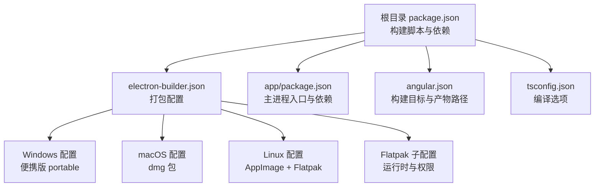
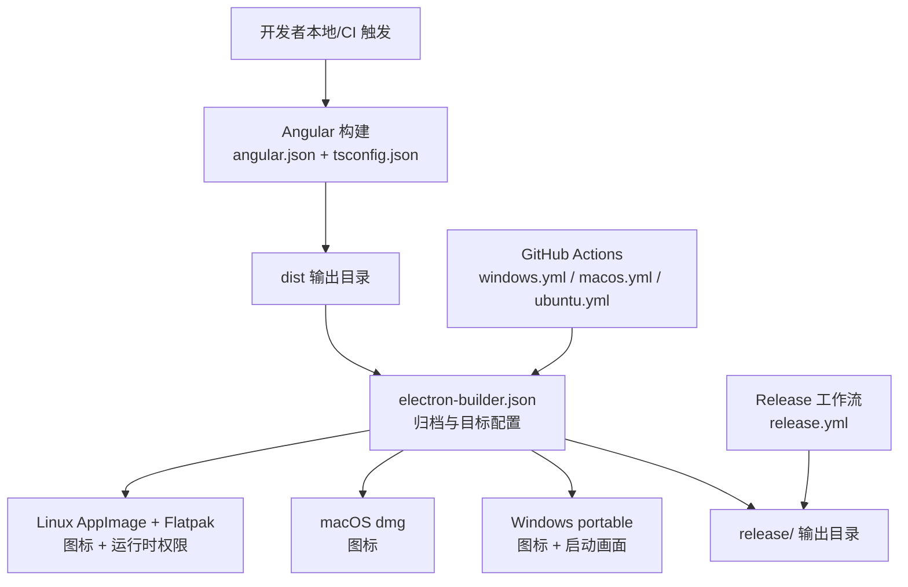
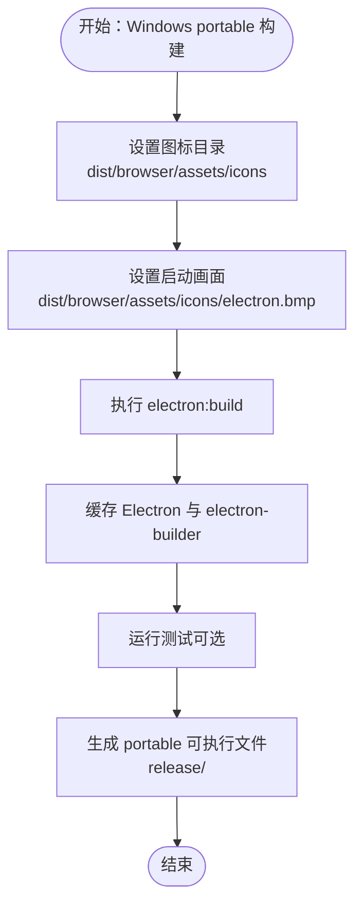
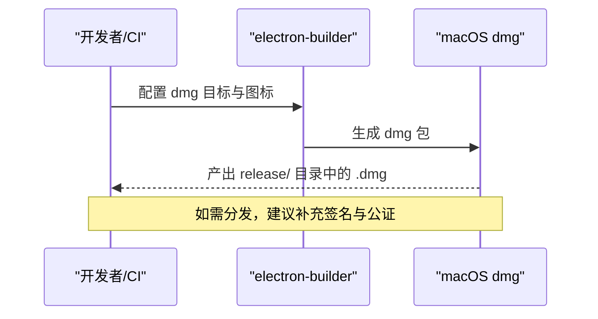
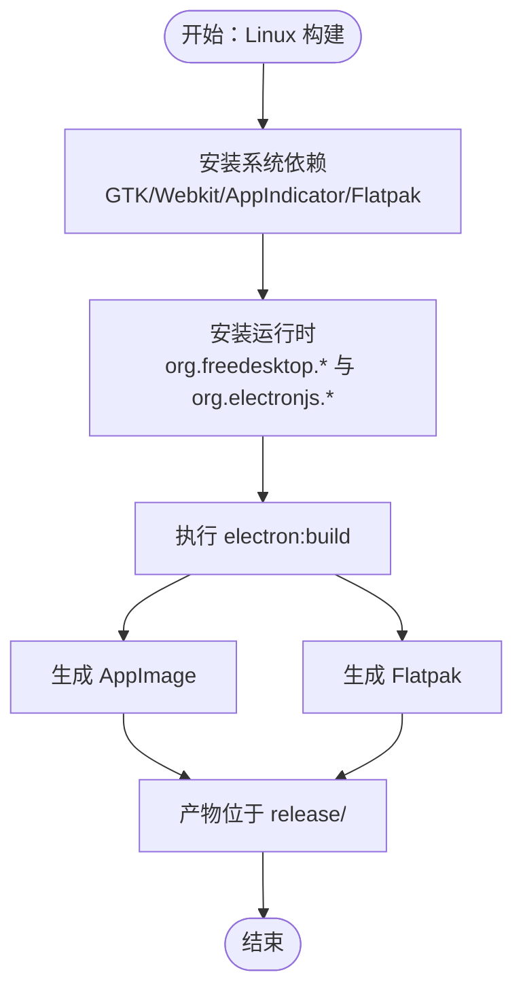
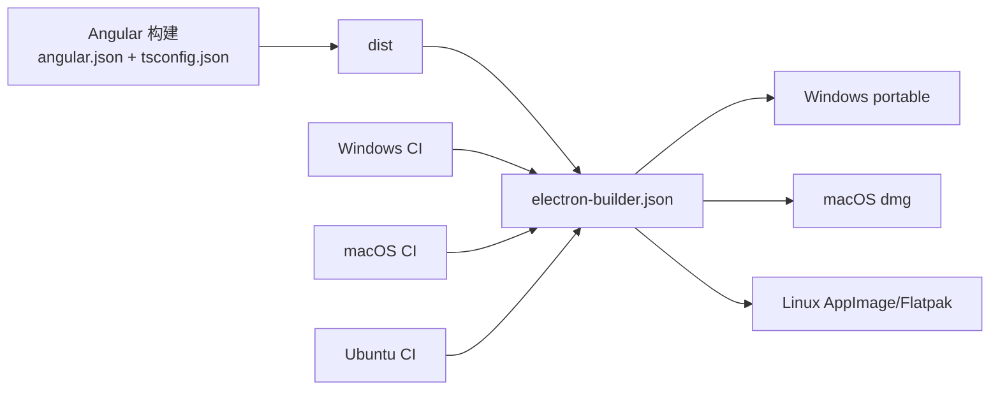

# 平台部署

<cite>
**本文引用的文件**
- [electron-builder.json](file://electron-builder.json)
- [package.json](file://package.json)
- [app/package.json](file://app/package.json)
- [.github/workflows/windows.yml](file://.github/workflows/windows.yml)
- [.github/workflows/macos.yml](file://.github/workflows/macos.yml)
- [.github/workflows/ubuntu.yml](file://.github/workflows/ubuntu.yml)
- [.github/workflows/release.yml](file://.github/workflows/release.yml)
- [README.md](file://README.md)
- [angular.json](file://angular.json)
- [tsconfig.json](file://tsconfig.json)
</cite>

## 目录
1. [简介](#简介)
2. [项目结构](#项目结构)
3. [核心组件](#核心组件)
4. [架构总览](#架构总览)
5. [详细组件分析](#详细组件分析)
6. [依赖关系分析](#依赖关系分析)
7. [性能考虑](#性能考虑)
8. [故障排除指南](#故障排除指南)
9. [结论](#结论)
10. [附录](#附录)

## 简介
本文件面向多平台桌面应用分发与部署，围绕 Windows、macOS 与 Linux 三大平台，系统梳理应用打包与发布流程，重点覆盖：
- Windows 便携版（portable）构建与部署特性（图标配置、启动画面）
- macOS dmg 包制作流程与签名相关注意事项
- Linux 平台多种包格式支持（AppImage 与 Flatpak），以及构建差异
- 各平台特有的配置参数、依赖要求与部署注意事项
- 平台特定的故障排除指南与性能优化建议

该工程采用 Electron + Angular 架构，并通过 electron-builder 进行跨平台打包；同时使用 GitHub Actions 在 Windows、macOS 与 Ubuntu 上进行 CI 构建与发布。

## 项目结构
本项目采用“双 package.json”结构以优化最终包体并保持 Angular CLI 的可用性：
- 根目录 package.json：管理前端构建工具链与打包脚本，包含 electron-builder 配置与构建命令
- app/package.json：Electron 主进程依赖与入口配置
- electron-builder.json：统一的打包配置，定义输出目录、文件过滤、目标平台与平台特定参数

图表来源
- [electron-builder.json:1-61](file://electron-builder.json#L1-L61)
- [package.json:1-108](file://package.json#L1-L108)
- [app/package.json:1-13](file://app/package.json#L1-L13)
- [angular.json:1-188](file://angular.json#L1-L188)
- [tsconfig.json:1-34](file://tsconfig.json#L1-L34)

章节来源
- [package.json:27-47](file://package.json#L27-L47)
- [electron-builder.json:17-41](file://electron-builder.json#L17-L41)
- [angular.json:25-46](file://angular.json#L25-L46)

## 核心组件
- 打包配置（electron-builder.json）
  - 归档策略与输出目录
  - 文件过滤规则（排除 TypeScript 源码与映射文件，包含 dist 资产）
  - 平台目标与图标路径
  - Windows 便携版启动画面
  - Linux AppImage 与 Flatpak 目标及 Flatpak 子配置
- 构建脚本（package.json）
  - electron:build 命令调用 electron-builder
  - postinstall 安装应用依赖
  - 版本回写脚本
- 平台构建流水线（GitHub Actions）
  - Windows/macOS/Linux 分别在不同 runners 上执行
  - 缓存 Electron 二进制与 npm 依赖
  - 安装测试与打包所需依赖
  - 执行测试后触发打包
- 发布流程（GitHub Actions）
  - 触发式版本号提升与标签推送
  - 自动生成变更日志并创建 GitHub Release

章节来源
- [electron-builder.json:1-61](file://electron-builder.json#L1-L61)
- [package.json:27-47](file://package.json#L27-L47)
- [.github/workflows/windows.yml:30-82](file://.github/workflows/windows.yml#L30-L82)
- [.github/workflows/macos.yml:26-84](file://.github/workflows/macos.yml#L26-L84)
- [.github/workflows/ubuntu.yml:27-90](file://.github/workflows/ubuntu.yml#L27-L90)
- [.github/workflows/release.yml:15-110](file://.github/workflows/release.yml#L15-L110)

## 架构总览
下图展示从源码到多平台产物的整体流程，涵盖前端构建、打包配置、平台目标与 CI 流水线。

图表来源
- [angular.json:25-46](file://angular.json#L25-L46)
- [tsconfig.json:1-34](file://tsconfig.json#L1-L34)
- [electron-builder.json:3-41](file://electron-builder.json#L3-L41)
- [.github/workflows/windows.yml:76-82](file://.github/workflows/windows.yml#L76-L82)
- [.github/workflows/macos.yml:78-84](file://.github/workflows/macos.yml#L78-L84)
- [.github/workflows/ubuntu.yml:84-90](file://.github/workflows/ubuntu.yml#L84-L90)
- [.github/workflows/release.yml:105-110](file://.github/workflows/release.yml#L105-L110)

## 详细组件分析

### Windows 便携版（portable）构建与部署
- 目标与输出
  - 使用 portable 目标，生成无需安装的可执行文件，便于分发与便携使用
- 图标与启动画面
  - 图标目录指向 dist/browser/assets/icons
  - 启动画面（splashImage）指向 dist/browser/assets/icons/electron.bmp
- CI 构建要点
  - Windows Runner 上缓存 Electron 与 electron-builder 缓存，减少重复下载
  - 安装依赖后执行测试，最后执行打包命令
- 部署注意事项
  - 便携版不涉及系统级签名或沙箱签名，但需确保图标与启动画面资源存在且路径正确
  - 建议在 release/ 目录中核验产物完整性

图表来源
- [electron-builder.json:17-25](file://electron-builder.json#L17-L25)
- [.github/workflows/windows.yml:42-51](file://.github/workflows/windows.yml#L42-L51)
- [.github/workflows/windows.yml:76-82](file://.github/workflows/windows.yml#L76-L82)

章节来源
- [electron-builder.json:17-25](file://electron-builder.json#L17-L25)
- [.github/workflows/windows.yml:30-82](file://.github/workflows/windows.yml#L30-L82)

### macOS dmg 包制作流程与签名要求
- 目标与输出
  - 使用 dmg 目标生成磁盘映像包，便于用户安装与分发
- 图标与目标
  - 图标目录指向 dist/browser/assets/icons
  - 目标为 dmg
- CI 构建要点
  - macOS Runner 上缓存 Electron 与 electron-builder 缓存
  - 安装额外依赖（gnu-tar、coreutils 等）以提升打包兼容性
  - 安装依赖后执行测试，最后执行打包命令
- 签名与公证（建议）
  - 本仓库未在配置中显式声明签名参数，若需上架或企业分发，应在 CI 中补充 Apple 证书与公证步骤
  - 建议在本地开发环境使用自签名证书进行测试，避免 Gatekeeper 拦截

图表来源
- [electron-builder.json:26-31](file://electron-builder.json#L26-L31)
- [.github/workflows/macos.yml:48-57](file://.github/workflows/macos.yml#L48-L57)
- [.github/workflows/macos.yml:78-84](file://.github/workflows/macos.yml#L78-L84)

章节来源
- [electron-builder.json:26-31](file://electron-builder.json#L26-L31)
- [.github/workflows/macos.yml:26-84](file://.github/workflows/macos.yml#L26-L84)

### Linux 平台：AppImage 与 Flatpak 的构建差异
- AppImage
  - 作为单一可执行文件，便于分发与运行，无需系统安装
  - 由 electron-builder 直接生成
- Flatpak
  - 通过 Flatpak 子配置定义运行时与权限，支持沙箱化运行
  - 需要安装 org.freedesktop.Platform、org.freedesktop.Sdk 与 org.electronjs.Electron2.BaseApp 等运行时
  - CI 中已包含安装命令与远程仓库配置
- CI 构建要点
  - Ubuntu Runner 上安装 GTK/Webkit/AppIndicator 等系统依赖
  - 安装 flatpak 与 flatpak-builder，并预装所需运行时
  - 执行测试后触发打包，生成 AppImage 与 Flatpak

图表来源
- [electron-builder.json:32-41](file://electron-builder.json#L32-L41)
- [electron-builder.json:42-59](file://electron-builder.json#L42-L59)
- [.github/workflows/ubuntu.yml:54-60](file://.github/workflows/ubuntu.yml#L54-L60)
- [.github/workflows/ubuntu.yml:84-90](file://.github/workflows/ubuntu.yml#L84-L90)
- [README.md:115-133](file://README.md#L115-L133)

章节来源
- [electron-builder.json:32-41](file://electron-builder.json#L32-L41)
- [electron-builder.json:42-59](file://electron-builder.json#L42-L59)
- [.github/workflows/ubuntu.yml:27-90](file://.github/workflows/ubuntu.yml#L27-L90)
- [README.md:115-133](file://README.md#L115-L133)

### 平台特定配置参数与依赖要求
- Windows
  - portable 目标、图标目录、启动画面
  - CI 缓存 Electron 与 electron-builder
- macOS
  - dmg 目标、图标目录
  - CI 安装 gnu-tar、coreutils 等工具
- Linux
  - AppImage 与 Flatpak 目标
  - 系统依赖与 Flatpak 运行时安装
  - CI 中预装运行时以支持 Flatpak 构建

章节来源
- [electron-builder.json:17-41](file://electron-builder.json#L17-L41)
- [.github/workflows/windows.yml:42-51](file://.github/workflows/windows.yml#L42-L51)
- [.github/workflows/macos.yml:53-57](file://.github/workflows/macos.yml#L53-L57)
- [.github/workflows/ubuntu.yml:54-60](file://.github/workflows/ubuntu.yml#L54-L60)

## 依赖关系分析
- 构建链路
  - 前端构建（Angular）生成 dist
  - electron-builder 读取打包配置，将 dist 与必要资源打包为目标平台产物
  - CI 在不同平台上缓存依赖与 Electron 二进制，加速构建
- 关键依赖
  - electron-builder：跨平台打包核心
  - Playwright：端到端测试
  - Node.js 版本要求与 TypeScript 版本约束

图表来源
- [angular.json:25-46](file://angular.json#L25-L46)
- [tsconfig.json:1-34](file://tsconfig.json#L1-L34)
- [electron-builder.json:3-41](file://electron-builder.json#L3-L41)
- [.github/workflows/windows.yml:76-82](file://.github/workflows/windows.yml#L76-L82)
- [.github/workflows/macos.yml:78-84](file://.github/workflows/macos.yml#L78-L84)
- [.github/workflows/ubuntu.yml:84-90](file://.github/workflows/ubuntu.yml#L84-L90)

章节来源
- [package.json:62-95](file://package.json#L62-L95)
- [electron-builder.json:1-61](file://electron-builder.json#L1-L61)

## 性能考虑
- 构建缓存
  - Windows/macOS/Ubuntu 均配置了 npm 与 Electron/electron-builder 缓存，显著缩短 CI 时间
- 产物体积
  - electron-builder 启用 asar，仅包含 dist 与必要资源，减少包体
- 测试前置
  - CI 先执行测试再打包，降低失败成本
- 建议
  - 在大型项目中启用增量构建与并行任务
  - 对于 Linux，优先使用 AppImage 以减少运行时依赖；如需沙箱化与系统集成，选择 Flatpak 并合理配置权限

章节来源
- [.github/workflows/windows.yml:33-50](file://.github/workflows/windows.yml#L33-L50)
- [.github/workflows/macos.yml:29-47](file://.github/workflows/macos.yml#L29-L47)
- [.github/workflows/ubuntu.yml:30-48](file://.github/workflows/ubuntu.yml#L30-L48)
- [electron-builder.json:2](file://electron-builder.json#L2)

## 故障排除指南
- Windows
  - 现象：打包缓慢或失败
  - 排查：确认缓存命中情况；检查图标与启动画面路径是否存在
  - 参考：Windows CI 步骤中的缓存与打包命令
- macOS
  - 现象：打包报错或图标不生效
  - 排查：确认 gnu-tar、coreutils 是否安装；检查 dmg 目标与图标路径
  - 参考：macOS CI 步骤与打包命令
- Linux
  - 现象：Flatpak 构建失败或运行时缺失
  - 排查：确认 Flatpak 运行时是否按 README 与 CI 脚本安装；检查权限参数
  - 参考：Ubuntu CI 步骤与 Flatpak 子配置
- 通用
  - 现象：测试失败导致跳过打包
  - 排查：先在本地运行测试，确保通过后再触发 CI；检查代理与网络环境
  - 参考：各平台 CI 中的测试与打包顺序

章节来源
- [.github/workflows/windows.yml:30-82](file://.github/workflows/windows.yml#L30-L82)
- [.github/workflows/macos.yml:26-84](file://.github/workflows/macos.yml#L26-L84)
- [.github/workflows/ubuntu.yml:27-90](file://.github/workflows/ubuntu.yml#L27-L90)
- [README.md:115-133](file://README.md#L115-L133)

## 结论
本项目通过 electron-builder 与 GitHub Actions 实现了对 Windows、macOS 与 Linux 的标准化打包与分发。Windows 便携版强调图标与启动画面配置；macOS 侧重 dmg 包与签名流程；Linux 则提供 AppImage 与 Flatpak 两种模式，满足不同场景需求。结合 CI 缓存与测试前置，整体构建效率与稳定性得到保障。建议在生产环境中补充 macOS 签名与公证流程，并根据实际需要调整 Flatpak 权限与运行时版本。

## 附录
- 构建命令与脚本
  - electron:build：调用 electron-builder 生成多平台产物
  - postinstall：安装应用依赖
  - 版本回写：同步更新 app/package.json 的版本
- 发布流程
  - 通过 release.yml 触发版本号提升、生成变更日志并创建 GitHub Release

章节来源
- [package.json:27-47](file://package.json#L27-L47)
- [.github/workflows/release.yml:15-110](file://.github/workflows/release.yml#L15-L110)